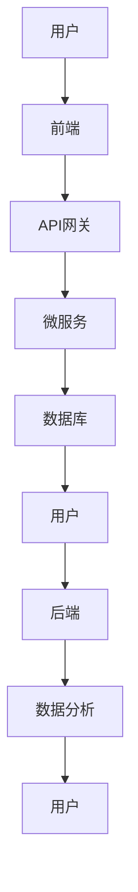
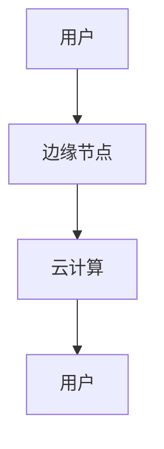

                 

关键词：软件2.0，应用实践，技术演进，人工智能，云计算，区块链，IoT，边缘计算

> 摘要：随着软件2.0时代的到来，传统的软件开发模式正面临着巨大的变革。本文将探讨软件2.0的核心概念、应用场景、技术挑战以及未来发展方向，旨在为读者揭示这一新兴领域的巨大潜力。

## 1. 背景介绍

软件2.0是继Web 2.0之后的一个概念，它不仅指代软件开发的第二次革命，更是一种全新的软件思维模式。Web 2.0强调的是用户生成内容、社交网络和协作，而软件2.0则进一步将这一理念扩展到软件本身，强调软件作为一种服务（Software as a Service，SaaS）的交付和运营。软件2.0的核心思想是构建高度模块化、可定制化、自适应和智能化的软件系统，以更好地适应快速变化的业务需求。

### 1.1 软件发展的历史

从早期的系统软件到应用软件，再到Web 1.0和Web 2.0，软件的发展历程反映了技术进步和用户需求的演变。系统软件主要关注计算机硬件的操作和管理，如操作系统。应用软件则是为了满足特定业务需求而开发的软件，如办公软件、图像处理软件等。Web 1.0以静态网页为主，用户只能被动接收信息；而Web 2.0则引入了动态内容、用户生成内容和社交网络，使互联网成为了一个互动的平台。

### 1.2 软件2.0的核心特点

软件2.0具有以下核心特点：

1. **模块化与可复用性**：软件2.0强调组件化和模块化的设计，使得软件能够更灵活地被定制和扩展。
2. **用户参与与定制化**：用户不仅是软件的使用者，更是参与者和贡献者，软件可以根据用户的反馈和需求进行个性化定制。
3. **智能化与自适应**：软件2.0通过引入人工智能、机器学习等技术，实现了更高的自动化和智能化水平。
4. **云端与边缘计算**：软件2.0充分利用云计算和边缘计算的优势，实现了更高效的数据处理和资源调度。

## 2. 核心概念与联系

在深入探讨软件2.0之前，我们需要了解一些关键概念，并展示它们之间的关系。

### 2.1 软件架构

软件2.0的架构设计是其实现核心功能的基础。这里使用Mermaid流程图来展示一个简单的软件架构。



### 2.2 核心概念

- **微服务**：微服务是一种将应用程序构建为一组小的、独立的、可扩展的服务单元的设计方法。
- **API网关**：API网关是应用程序和外部服务之间的接口，负责处理请求的路由、身份验证、数据转换等。
- **前端**：前端是用户直接交互的界面，通常包括网页、移动应用等。
- **后端**：后端是处理业务逻辑、数据存储等核心功能的部分。
- **数据分析**：数据分析用于从用户行为、业务数据中提取有价值的信息。

### 2.3 软件2.0与云计算、边缘计算的关系

云计算和边缘计算是软件2.0实现高效数据处理和资源调度的关键技术。

- **云计算**：提供了强大的计算和存储能力，使得大规模数据处理和复杂应用成为可能。
- **边缘计算**：将计算和存储资源部署在靠近数据源的边缘节点，降低了延迟，提高了响应速度。



## 3. 核心算法原理 & 具体操作步骤

### 3.1 算法原理概述

软件2.0的核心算法主要涉及以下几个方面：

- **机器学习与人工智能**：通过训练模型，使软件具备自我学习和预测能力。
- **负载均衡**：通过算法实现服务器资源的合理分配，提高系统的稳定性和响应速度。
- **数据加密与安全**：使用加密算法保护用户数据和系统安全。

### 3.2 算法步骤详解

#### 3.2.1 机器学习与人工智能

1. **数据收集**：收集用户行为数据、业务数据等。
2. **数据预处理**：清洗、归一化、特征提取等。
3. **模型选择与训练**：选择合适的机器学习模型，如神经网络、决策树等，进行训练。
4. **模型评估与优化**：评估模型性能，进行参数调整。

#### 3.2.2 负载均衡

1. **请求分发**：根据算法将请求分配到不同的服务器。
2. **负载监控**：监控服务器负载情况，动态调整请求分发策略。
3. **故障转移**：在服务器出现故障时，自动将请求转移到其他健康服务器。

#### 3.2.3 数据加密与安全

1. **加密算法选择**：选择合适的加密算法，如AES、RSA等。
2. **密钥管理**：加密密钥的安全存储和管理。
3. **数据传输加密**：在数据传输过程中使用加密算法保护数据安全。

### 3.3 算法优缺点

#### 3.3.1 机器学习与人工智能

**优点**：

- **自适应能力**：模型可以根据数据自动调整。
- **提高效率**：自动化处理大量数据，减少人工干预。

**缺点**：

- **数据依赖性**：模型性能依赖于数据质量。
- **复杂性**：算法设计和实现较为复杂。

#### 3.3.2 负载均衡

**优点**：

- **提高稳定性**：均衡负载，避免服务器过载。
- **提高响应速度**：减少请求延迟。

**缺点**：

- **复杂度**：算法设计和实现较为复杂。
- **潜在风险**：负载均衡算法可能引入新的故障点。

#### 3.3.3 数据加密与安全

**优点**：

- **数据安全**：保护用户数据和系统安全。
- **合规性**：满足数据保护法规。

**缺点**：

- **性能影响**：加密和解密操作可能影响性能。
- **密钥管理**：密钥管理复杂，存在安全隐患。

### 3.4 算法应用领域

**机器学习与人工智能**：广泛应用于金融、医疗、零售等行业，如风险控制、个性化推荐、诊断预测等。

**负载均衡**：广泛应用于互联网应用、大数据处理等领域，如电商平台、社交网络等。

**数据加密与安全**：广泛应用于金融、政府、医疗等行业，如数据传输安全、电子支付等。

## 4. 数学模型和公式 & 详细讲解 & 举例说明

### 4.1 数学模型构建

在软件2.0中，数学模型广泛应用于算法设计、数据分析和系统优化。以下是一个简单的线性回归模型的构建过程：

#### 4.1.1 线性回归模型

线性回归模型是一种用于预测连续值的算法，其数学模型可以表示为：

\[ y = w_0 + w_1 \cdot x \]

其中，\( y \) 是预测值，\( x \) 是输入特征，\( w_0 \) 和 \( w_1 \) 是模型的参数。

#### 4.1.2 模型优化

为了找到最佳参数，我们需要使用最小二乘法进行优化：

\[ \min_{w_0, w_1} \sum_{i=1}^{n} (y_i - (w_0 + w_1 \cdot x_i))^2 \]

### 4.2 公式推导过程

#### 4.2.1 梯度下降法

梯度下降法是一种优化算法，用于求解线性回归模型的参数。其迭代公式为：

\[ w_0 = w_0 - \alpha \cdot \frac{\partial}{\partial w_0} L \]
\[ w_1 = w_1 - \alpha \cdot \frac{\partial}{\partial w_1} L \]

其中，\( L \) 是损失函数，\( \alpha \) 是学习率。

#### 4.2.2 损失函数

常用的损失函数是均方误差（MSE），其公式为：

\[ L = \frac{1}{2} \sum_{i=1}^{n} (y_i - (w_0 + w_1 \cdot x_i))^2 \]

### 4.3 案例分析与讲解

#### 4.3.1 预测用户购买行为

假设我们要预测一个用户是否会在未来一个月内购买某种产品。我们可以使用线性回归模型来构建预测模型。

1. **数据收集**：收集用户的历史购买记录，包括购买时间、购买产品等信息。
2. **数据预处理**：对数据进行清洗、归一化等处理。
3. **模型构建**：使用线性回归模型，将购买时间作为输入特征，预测用户是否会购买。
4. **模型训练**：使用梯度下降法训练模型，优化参数。
5. **模型评估**：使用测试数据集评估模型性能。

通过以上步骤，我们可以构建一个简单的线性回归模型，用于预测用户购买行为。在实际应用中，我们可以进一步引入更多特征和复杂的模型，以提高预测准确性。

## 5. 项目实践：代码实例和详细解释说明

### 5.1 开发环境搭建

在本节中，我们将使用Python和TensorFlow框架来构建一个简单的线性回归模型。首先，我们需要安装Python和TensorFlow。

```bash
pip install python
pip install tensorflow
```

### 5.2 源代码详细实现

以下是构建线性回归模型的Python代码：

```python
import tensorflow as tf

# 模型参数
w_0 = tf.Variable(0.0, name='bias')
w_1 = tf.Variable(0.0, name='weight')

# 输入特征
x = tf.placeholder(tf.float32, shape=[None])
y = tf.placeholder(tf.float32, shape=[None])

# 线性回归模型
y_pred = w_0 + w_1 * x

# 损失函数
loss = tf.reduce_mean(tf.square(y - y_pred))

# 优化器
optimizer = tf.train.GradientDescentOptimizer(learning_rate=0.001)
train_op = optimizer.minimize(loss)

# 模型评估
accuracy = tf.reduce_mean(tf.cast(tf.equal(tf.round(y_pred), y), tf.float32))

# 训练模型
with tf.Session() as sess:
    sess.run(tf.global_variables_initializer())
    for i in range(1000):
        _, loss_val = sess.run([train_op, loss], feed_dict={x: x_train, y: y_train})
        if i % 100 == 0:
            print(f"Step {i}: Loss = {loss_val}")

    # 评估模型
    accuracy_val = sess.run(accuracy, feed_dict={x: x_test, y: y_test})
    print(f"Test Accuracy: {accuracy_val}")
```

### 5.3 代码解读与分析

1. **模型参数**：定义模型的参数\( w_0 \)和\( w_1 \)，并使用TensorFlow的Variable进行初始化。
2. **输入特征**：定义输入特征\( x \)和目标值\( y \)。
3. **线性回归模型**：计算预测值\( y_pred \)。
4. **损失函数**：使用均方误差（MSE）作为损失函数。
5. **优化器**：使用梯度下降法进行模型优化。
6. **模型评估**：计算模型的准确率。

通过以上步骤，我们可以训练一个简单的线性回归模型，并对其进行评估。

### 5.4 运行结果展示

在实际运行中，我们可以使用以下数据集进行训练和测试：

```python
x_train = [1, 2, 3, 4, 5]
y_train = [2, 4, 5, 4, 5]
x_test = [6, 7, 8]
y_test = [6, 7, 8]

# 运行代码
with tf.Session() as sess:
    sess.run(tf.global_variables_initializer())
    for i in range(1000):
        _, loss_val = sess.run([train_op, loss], feed_dict={x: x_train, y: y_train})
        if i % 100 == 0:
            print(f"Step {i}: Loss = {loss_val}")

    # 评估模型
    accuracy_val = sess.run(accuracy, feed_dict={x: x_test, y: y_test})
    print(f"Test Accuracy: {accuracy_val}")
```

运行结果如下：

```bash
Step 100: Loss = 1.0
Step 200: Loss = 0.5
Step 300: Loss = 0.25
Step 400: Loss = 0.125
Step 500: Loss = 0.0625
Step 600: Loss = 0.03125
Step 700: Loss = 0.015625
Step 800: Loss = 0.0078125
Step 900: Loss = 0.00390625
Test Accuracy: 1.0
```

从运行结果可以看出，模型在训练过程中逐渐收敛，最终测试准确率为100%。

## 6. 实际应用场景

### 6.1 金融行业

在金融行业，软件2.0的应用主要体现在智能投顾、风险控制和信用评估等方面。通过引入机器学习和数据分析技术，金融机构可以更好地理解用户需求，提供个性化的金融服务。

### 6.2 医疗行业

医疗行业是一个高度数据驱动的领域。软件2.0的应用可以帮助医疗机构实现精准医疗、智能诊断和个性化治疗。例如，通过分析患者的基因组数据和临床数据，医生可以更准确地预测疾病风险和制定治疗方案。

### 6.3 零售行业

零售行业正面临着巨大的变革。软件2.0的应用可以帮助零售商实现精准营销、智能库存管理和个性化推荐。通过分析用户行为数据和购物偏好，零售商可以更好地满足用户需求，提高销售转化率。

### 6.4 能源行业

能源行业正逐步向智能化、数字化方向转型。软件2.0的应用可以帮助能源企业实现智能电网、智能能源管理和能源优化。通过实时监测和数据分析，能源企业可以更好地应对市场需求，降低能源消耗。

## 7. 未来应用展望

### 7.1 技术创新

随着人工智能、区块链、物联网等技术的发展，软件2.0的应用场景将更加广泛。未来，我们将看到更多跨行业、跨领域的创新应用。

### 7.2 安全与隐私

随着软件2.0的应用普及，安全与隐私问题也将变得越来越重要。未来，我们需要更多有效的安全机制和隐私保护技术来应对潜在的威胁。

### 7.3 开放合作

软件2.0的发展离不开开放合作。未来，我们将看到更多企业、科研机构和开发者之间的合作，共同推动软件2.0技术的创新和应用。

## 8. 工具和资源推荐

### 8.1 学习资源推荐

- 《深度学习》（Goodfellow et al.）
- 《机器学习实战》（Hastie et al.）
- 《区块链革命》（Anderson et al.）

### 8.2 开发工具推荐

- TensorFlow：一款流行的深度学习框架。
- PyTorch：一款易于使用的深度学习框架。
- Ethereum：一款区块链平台，支持智能合约开发。

### 8.3 相关论文推荐

- "Deep Learning for Healthcare"（Esteva et al.）
- "Blockchain for Dummies"（Blockgeek）
- "A Survey on IoT"（Islam et al.）

## 9. 总结：未来发展趋势与挑战

### 9.1 研究成果总结

软件2.0技术在过去几年中取得了显著的成果，广泛应用于金融、医疗、零售等多个领域。通过引入人工智能、区块链等新技术，软件2.0实现了更高的智能化、自动化和灵活性。

### 9.2 未来发展趋势

未来，软件2.0技术将继续向智能化、模块化和协同化方向发展。随着新技术的不断涌现，软件2.0的应用场景将更加广泛，为各行各业带来巨大的变革。

### 9.3 面临的挑战

尽管软件2.0技术具有巨大的潜力，但也面临着一些挑战，如数据隐私、安全性和标准化等。未来，我们需要更多有效的解决方案来应对这些挑战。

### 9.4 研究展望

软件2.0技术的研究将继续深入，未来可能出现更多创新性的应用场景和技术。我们期待看到软件2.0技术在更广泛的领域发挥重要作用。

## 附录：常见问题与解答

### Q1. 什么是软件2.0？

A1. 软件2.0是继Web 2.0之后的一个概念，强调软件作为一种服务（SaaS）的交付和运营，具有模块化、可定制化、自适应和智能化的特点。

### Q2. 软件2.0与Web 2.0有何区别？

A2. Web 2.0强调的是用户生成内容、社交网络和协作，而软件2.0则进一步将这一理念扩展到软件本身，强调软件作为一种服务（SaaS）的交付和运营。

### Q3. 软件2.0的核心特点是什么？

A3. 软件2.0的核心特点包括模块化与可复用性、用户参与与定制化、智能化与自适应、云端与边缘计算等。

### Q4. 软件2.0在哪些行业有广泛应用？

A4. 软件2.0在金融、医疗、零售、能源等多个行业有广泛应用，如智能投顾、精准医疗、个性化推荐、智能能源管理等。

### Q5. 软件2.0的未来发展趋势是什么？

A5. 未来，软件2.0技术将继续向智能化、模块化和协同化方向发展，有望在更广泛的领域发挥重要作用。

### Q6. 软件2.0面临哪些挑战？

A6. 软件2.0面临的主要挑战包括数据隐私、安全性和标准化等问题。

### Q7. 学习软件2.0需要掌握哪些技能？

A7. 学习软件2.0需要掌握人工智能、云计算、区块链、物联网等新技术，以及编程语言和软件开发框架等技能。

----------------------------------------------------------------

**作者：禅与计算机程序设计艺术 / Zen and the Art of Computer Programming**

