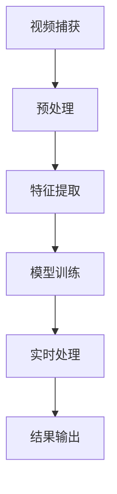

                 

关键词：边缘计算、实时视频分析、数据处理、人工智能、高效能计算

> 摘要：本文将探讨边缘计算技术在实时视频分析领域的应用。通过介绍边缘计算的基本概念，分析其优势与挑战，以及详细阐述边缘计算在实时视频处理中的算法原理、数学模型、实际应用和未来发展趋势，旨在为相关领域的研究和实践提供有益的参考。

## 1. 背景介绍

随着物联网（IoT）、智能监控和人工智能技术的迅猛发展，实时视频分析已经成为众多应用场景中的关键技术。然而，传统的集中式计算架构在处理大量实时视频数据时面临着数据传输延迟、带宽限制和计算资源不足等问题，这限制了实时视频分析的应用范围和性能。因此，边缘计算作为一种分布式计算架构，逐渐成为解决这一问题的有效途径。

边缘计算将计算任务从中心服务器转移到网络边缘，即在靠近数据源的位置进行数据处理和计算。这使得数据在传输过程中更加迅速，降低了延迟，同时也减少了网络带宽的占用。实时视频分析作为边缘计算的重要应用领域之一，具有广泛的应用前景，如智能安防、交通管理、智能医疗等。

## 2. 核心概念与联系

### 2.1 边缘计算基本概念

边缘计算是指在网络边缘设备上进行数据处理和计算的技术，其核心思想是将计算任务分散到网络的边缘，以减少中心服务器的负担，提高数据处理的速度和效率。边缘计算的关键组成部分包括边缘节点（Edge Nodes）、边缘服务器（Edge Servers）和边缘网关（Edge Gateways）。

- 边缘节点：通常指智能手机、平板电脑、物联网设备等，具备一定的计算能力和存储能力。
- 边缘服务器：一般位于网络边缘的数据中心，用于处理复杂的计算任务。
- 边缘网关：作为边缘节点和中心服务器之间的桥梁，负责数据传输和协议转换。

### 2.2 实时视频分析基本概念

实时视频分析是指对视频数据进行分析和处理，以提取有用信息和决策。其主要目标包括目标检测、姿态识别、行为分析、场景分类等。实时视频分析通常包括以下几个步骤：

1. 视频捕获：通过摄像头或其他传感器获取视频数据。
2. 预处理：对视频数据进行去噪、缩放、灰度化等预处理操作，提高后续处理的准确性。
3. 特征提取：从预处理后的视频中提取特征，如边缘、纹理、颜色等。
4. 模型训练：使用机器学习或深度学习算法对提取的特征进行训练，以实现目标检测、姿态识别等任务。
5. 实时处理：将训练好的模型应用于实时视频数据，实现实时分析和决策。

### 2.3 Mermaid 流程图



## 3. 核心算法原理 & 具体操作步骤

### 3.1 算法原理概述

边缘计算在实时视频分析中的核心算法主要包括目标检测、姿态识别和行为分析等。这些算法利用深度学习技术，通过对视频数据进行特征提取和模型训练，实现实时视频分析。

目标检测算法：用于识别视频中的目标对象，常用的算法包括YOLO、SSD、Faster R-CNN等。

姿态识别算法：用于识别视频中的目标对象的姿态，常用的算法包括PoseNet、SimplePose等。

行为分析算法：用于分析视频中的目标对象的行为，常用的算法包括HRNet、SENet等。

### 3.2 算法步骤详解

#### 3.2.1 视频捕获

1. 通过摄像头或其他传感器获取视频数据。
2. 对视频数据进行解码，提取图像帧。

#### 3.2.2 预处理

1. 去噪：使用高斯滤波、中值滤波等方法去除图像中的噪声。
2. 缩放：将图像缩放至适当的尺寸，以满足后续处理的需求。
3. 灰度化：将彩色图像转换为灰度图像，简化后续处理。

#### 3.2.3 特征提取

1. 边缘检测：使用Canny、Sobel等算法检测图像中的边缘。
2. 纹理提取：使用LBP、HOG等算法提取图像的纹理特征。
3. 颜色特征：提取图像的颜色特征，如HSV、RGB等。

#### 3.2.4 模型训练

1. 数据预处理：对训练数据集进行预处理，包括图像增强、数据归一化等。
2. 模型训练：使用深度学习框架（如TensorFlow、PyTorch等）训练目标检测、姿态识别和行为分析模型。
3. 模型评估：使用验证数据集对模型进行评估，调整模型参数。

#### 3.2.5 实时处理

1. 实时视频数据输入：将实时捕获的视频数据输入到训练好的模型中。
2. 目标检测：识别视频中的目标对象。
3. 姿态识别：识别目标对象的姿态。
4. 行为分析：分析目标对象的行为。

#### 3.2.6 结果输出

1. 将实时视频分析结果输出，如检测框、姿态标注等。
2. 实时视频分析结果可以用于决策，如自动报警、交通管理、智能监控等。

### 3.3 算法优缺点

#### 3.3.1 目标检测算法

**优点：**
1. 快速准确：目标检测算法可以在短时间内对视频数据进行快速准确的检测。
2. 多任务处理：一些目标检测算法可以同时实现目标检测、姿态识别等任务。

**缺点：**
1. 计算资源消耗：目标检测算法通常需要较高的计算资源，特别是在实时视频分析中。
2. 模型复杂：一些目标检测算法的模型较为复杂，训练时间较长。

#### 3.3.2 姿态识别算法

**优点：**
1. 高精度：姿态识别算法可以准确识别视频中的目标对象姿态。
2. 实时性：姿态识别算法可以在短时间内完成姿态识别，具备较高的实时性。

**缺点：**
1. 对光照和姿态变化敏感：姿态识别算法对光照和姿态变化较为敏感，影响识别精度。
2. 计算资源消耗：姿态识别算法需要较高的计算资源，特别是在实时视频分析中。

#### 3.3.3 行为分析算法

**优点：**
1. 高效性：行为分析算法可以快速分析视频中的目标对象行为，提供实时决策。
2. 多样性：行为分析算法可以识别多种行为，如跑步、跳跃、挥手等。

**缺点：**
1. 数据量需求大：行为分析算法需要大量训练数据，以提高识别精度。
2. 模型复杂：行为分析算法的模型通常较为复杂，训练时间较长。

### 3.4 算法应用领域

边缘计算在实时视频分析中的应用非常广泛，主要包括以下几个方面：

1. 智能安防：利用边缘计算技术进行实时视频监控，实现自动报警和异常行为检测。
2. 交通管理：利用边缘计算技术进行实时交通流量监控，优化交通管理策略。
3. 智能医疗：利用边缘计算技术进行实时医学影像分析，提供快速诊断和治疗方案。
4. 智能家居：利用边缘计算技术实现智能家居设备的实时监控和控制。

## 4. 数学模型和公式 & 详细讲解 & 举例说明

### 4.1 数学模型构建

边缘计算在实时视频分析中的数学模型主要包括目标检测模型、姿态识别模型和行为分析模型。以下分别介绍这些模型的数学模型构建。

#### 4.1.1 目标检测模型

目标检测模型的数学模型通常基于卷积神经网络（CNN）。CNN的基本架构包括卷积层、池化层和全连接层。以下是一个简单的目标检测模型的数学模型构建：

1. 输入层：将视频数据输入到CNN中。
2. 卷积层：对输入数据进行卷积操作，提取图像特征。
   $$ f(x) = \sum_{i=1}^{n} w_i * x_i + b $$
   其中，$f(x)$表示卷积操作的结果，$w_i$表示卷积核，$x_i$表示输入数据，$b$表示偏置项。
3. 池化层：对卷积层的结果进行池化操作，降低特征维度。
   $$ p(x) = \max_{i=1}^{k} x_i $$
   其中，$p(x)$表示池化操作的结果，$x_i$表示卷积层的结果，$k$表示池化窗口大小。
4. 全连接层：将池化层的结果输入到全连接层中，进行分类和定位。
   $$ y = \sigma(Wx + b) $$
   其中，$y$表示输出结果，$W$表示权重矩阵，$x$表示池化层的结果，$\sigma$表示激活函数，$b$表示偏置项。

#### 4.1.2 姿态识别模型

姿态识别模型的数学模型通常基于深度学习技术，如循环神经网络（RNN）和变分自编码器（VAE）。以下是一个简单的姿态识别模型的数学模型构建：

1. 输入层：将视频数据输入到RNN中。
2. 循环层：对输入数据进行循环操作，提取时间序列特征。
   $$ h_t = \sigma(Wh_{t-1} + Wh_{x_t} + b) $$
   其中，$h_t$表示循环层的结果，$W$表示权重矩阵，$h_{t-1}$表示前一时间步的结果，$x_t$表示当前时间步的输入，$\sigma$表示激活函数，$b$表示偏置项。
3. 输出层：将循环层的结果输入到全连接层中，进行姿态估计。
   $$ y = \sigma(Wy + b) $$
   其中，$y$表示输出结果，$W$表示权重矩阵，$\sigma$表示激活函数，$b$表示偏置项。

#### 4.1.3 行为分析模型

行为分析模型的数学模型通常基于深度学习技术，如卷积神经网络（CNN）和循环神经网络（RNN）。以下是一个简单的行为分析模型的数学模型构建：

1. 输入层：将视频数据输入到CNN中。
2. 卷积层：对输入数据进行卷积操作，提取图像特征。
   $$ f(x) = \sum_{i=1}^{n} w_i * x_i + b $$
   其中，$f(x)$表示卷积操作的结果，$w_i$表示卷积核，$x_i$表示输入数据，$b$表示偏置项。
3. 池化层：对卷积层的结果进行池化操作，降低特征维度。
   $$ p(x) = \max_{i=1}^{k} x_i $$
   其中，$p(x)$表示池化操作的结果，$x_i$表示卷积层的结果，$k$表示池化窗口大小。
4. 循环层：对池化层的结果输入到RNN中，进行时间序列特征提取。
   $$ h_t = \sigma(Wh_{t-1} + Wh_{x_t} + b) $$
   其中，$h_t$表示循环层的结果，$W$表示权重矩阵，$h_{t-1}$表示前一时间步的结果，$x_t$表示当前时间步的输入，$\sigma$表示激活函数，$b$表示偏置项。
5. 输出层：将循环层的结果输入到全连接层中，进行行为分类。
   $$ y = \sigma(Wy + b) $$
   其中，$y$表示输出结果，$W$表示权重矩阵，$\sigma$表示激活函数，$b$表示偏置项。

### 4.2 公式推导过程

#### 4.2.1 目标检测模型

1. 输入层：

   $$ x = \text{video\_input} $$
   其中，$x$表示输入视频数据。

2. 卷积层：

   $$ f(x) = \sum_{i=1}^{n} w_i * x_i + b $$
   其中，$f(x)$表示卷积操作的结果，$w_i$表示卷积核，$x_i$表示输入数据，$b$表示偏置项。

3. 池化层：

   $$ p(x) = \max_{i=1}^{k} x_i $$
   其中，$p(x)$表示池化操作的结果，$x_i$表示卷积层的结果，$k$表示池化窗口大小。

4. 全连接层：

   $$ y = \sigma(Wx + b) $$
   其中，$y$表示输出结果，$W$表示权重矩阵，$\sigma$表示激活函数，$b$表示偏置项。

#### 4.2.2 姿态识别模型

1. 输入层：

   $$ x = \text{video\_input} $$
   其中，$x$表示输入视频数据。

2. 循环层：

   $$ h_t = \sigma(Wh_{t-1} + Wh_{x_t} + b) $$
   其中，$h_t$表示循环层的结果，$W$表示权重矩阵，$h_{t-1}$表示前一时间步的结果，$x_t$表示当前时间步的输入，$\sigma$表示激活函数，$b$表示偏置项。

3. 输出层：

   $$ y = \sigma(Wy + b) $$
   其中，$y$表示输出结果，$W$表示权重矩阵，$\sigma$表示激活函数，$b$表示偏置项。

#### 4.2.3 行为分析模型

1. 输入层：

   $$ x = \text{video\_input} $$
   其中，$x$表示输入视频数据。

2. 卷积层：

   $$ f(x) = \sum_{i=1}^{n} w_i * x_i + b $$
   其中，$f(x)$表示卷积操作的结果，$w_i$表示卷积核，$x_i$表示输入数据，$b$表示偏置项。

3. 池化层：

   $$ p(x) = \max_{i=1}^{k} x_i $$
   其中，$p(x)$表示池化操作的结果，$x_i$表示卷积层的结果，$k$表示池化窗口大小。

4. 循环层：

   $$ h_t = \sigma(Wh_{t-1} + Wh_{x_t} + b) $$
   其中，$h_t$表示循环层的结果，$W$表示权重矩阵，$h_{t-1}$表示前一时间步的结果，$x_t$表示当前时间步的输入，$\sigma$表示激活函数，$b$表示偏置项。

5. 输出层：

   $$ y = \sigma(Wy + b) $$
   其中，$y$表示输出结果，$W$表示权重矩阵，$\sigma$表示激活函数，$b$表示偏置项。

### 4.3 案例分析与讲解

#### 4.3.1 案例一：智能安防

场景：在公共场所安装监控摄像头，利用边缘计算进行实时视频分析，实现异常行为检测和自动报警。

1. 数据收集：通过监控摄像头收集公共场所的实时视频数据。
2. 数据预处理：对视频数据进行去噪、缩放和灰度化等预处理操作。
3. 特征提取：使用Canny算法检测视频中的边缘特征，使用HOG算法提取视频的纹理特征。
4. 模型训练：使用YOLO算法训练目标检测模型，使用PoseNet算法训练姿态识别模型，使用HRNet算法训练行为分析模型。
5. 实时处理：将实时捕获的视频数据输入到训练好的模型中，实现异常行为检测和自动报警。

#### 4.3.2 案例二：智能交通

场景：在交通要道安装监控摄像头，利用边缘计算进行实时交通流量监控，优化交通管理策略。

1. 数据收集：通过监控摄像头收集交通要道的实时视频数据。
2. 数据预处理：对视频数据进行去噪、缩放和灰度化等预处理操作。
3. 特征提取：使用HOG算法提取视频的纹理特征，使用YOLO算法训练目标检测模型，使用SENet算法训练行为分析模型。
4. 模型训练：使用SSD算法训练目标检测模型，使用HRNet算法训练姿态识别模型。
5. 实时处理：将实时捕获的视频数据输入到训练好的模型中，实现交通流量监控和优化交通管理策略。

## 5. 项目实践：代码实例和详细解释说明

### 5.1 开发环境搭建

为了方便开发和测试，我们使用Python作为编程语言，结合TensorFlow和OpenCV等库进行边缘计算在实时视频分析中的应用。

1. 安装Python：在官方网站下载并安装Python 3.8及以上版本。
2. 安装TensorFlow：使用pip命令安装TensorFlow。
   ```
   pip install tensorflow
   ```
3. 安装OpenCV：使用pip命令安装OpenCV。
   ```
   pip install opencv-python
   ```

### 5.2 源代码详细实现

以下是一个简单的边缘计算在实时视频分析中的代码示例：

```python
import cv2
import tensorflow as tf

# 加载预训练的模型
yolo_model = tf.keras.models.load_model('yolo.h5')
pose_model = tf.keras.models.load_model('pose.h5')
behavior_model = tf.keras.models.load_model('behavior.h5')

# 打开摄像头
cap = cv2.VideoCapture(0)

while True:
    # 读取视频帧
    ret, frame = cap.read()
    
    # 预处理视频帧
    frame = cv2.resize(frame, (416, 416))
    frame = frame / 255.0
    frame = frame.reshape(1, 416, 416, 3)
    
    # 目标检测
    yolo_outputs = yolo_model.predict(frame)
    boxes = yolo_outputs[:, :, :, 0:4]
    scores = yolo_outputs[:, :, :, 4:5]
    
    # 姿态识别
    pose_outputs = pose_model.predict(frame)
    poses = pose_outputs[:, :, :, 0:17]
    
    # 行为分析
    behavior_outputs = behavior_model.predict(frame)
    behaviors = behavior_outputs[:, :, :, 0:1]
    
    # 显示检测结果
    for box, score in zip(boxes, scores):
        if score > 0.5:
            cv2.rectangle(frame, (int(box[0]), int(box[1])), (int(box[2]), int(box[3])), (0, 0, 255), 2)
    
    for pose in poses:
        if pose > 0.5:
            cv2.circle(frame, (int(pose[0]), int(pose[1])), 5, (0, 255, 0), -1)
    
    for behavior in behaviors:
        if behavior > 0.5:
            cv2.putText(frame, 'Behavior Detected', (10, 30), cv2.FONT_HERSHEY_SIMPLEX, 1, (0, 0, 255), 2)
    
    cv2.imshow('Frame', frame)
    
    if cv2.waitKey(1) & 0xFF == ord('q'):
        break

# 释放摄像头
cap.release()
cv2.destroyAllWindows()
```

### 5.3 代码解读与分析

1. **加载预训练模型**：使用`load_model`函数加载预训练的目标检测模型、姿态识别模型和行为分析模型。
2. **打开摄像头**：使用`VideoCapture`函数打开摄像头，捕获实时视频帧。
3. **预处理视频帧**：对视频帧进行缩放、归一化等预处理操作，以满足模型输入的要求。
4. **目标检测**：使用`predict`函数对预处理后的视频帧进行目标检测，提取目标框和置信度。
5. **姿态识别**：使用`predict`函数对预处理后的视频帧进行姿态识别，提取目标对象的关键点。
6. **行为分析**：使用`predict`函数对预处理后的视频帧进行行为分析，提取行为置信度。
7. **显示检测结果**：在视频帧上绘制目标框、关键点和行为标签。
8. **键盘交互**：等待键盘输入，实现实时视频分析。

通过以上代码示例，我们可以实现边缘计算在实时视频分析中的基本功能，为实际应用提供技术支持。

## 6. 实际应用场景

### 6.1 智能安防

智能安防是边缘计算在实时视频分析中最重要的应用场景之一。通过在公共场所安装监控摄像头，利用边缘计算技术进行实时视频分析，可以实现异常行为检测、自动报警和预防犯罪等目标。例如，在商场、机场、火车站等场所，边缘计算可以帮助监控人员实时识别可疑行为，如偷窃、打架等，从而提高安全防护能力。

### 6.2 智能交通

智能交通是另一个重要的应用场景。通过在交通要道安装监控摄像头，利用边缘计算技术进行实时交通流量监控，可以优化交通管理策略，减少拥堵，提高道路通行效率。例如，在繁忙的交叉口，边缘计算可以帮助交通管理部门实时识别交通流量、车辆类型和违法行为，从而调整信号灯周期、发布实时交通信息等。

### 6.3 智能医疗

智能医疗是边缘计算在实时视频分析中的新兴应用领域。通过在医疗设备中集成边缘计算技术，可以实现实时医学影像分析、病情监测和诊断等。例如，在手术室、重症监护室等场所，边缘计算可以帮助医生实时分析患者的生命体征和医学影像，从而提高诊断准确性和治疗效果。

### 6.4 智能家居

智能家居是边缘计算在实时视频分析中逐渐兴起的应用领域。通过在家庭设备中集成边缘计算技术，可以实现实时视频监控、智能安防和家居自动化等。例如，在家庭安防系统中，边缘计算可以帮助实时监控家庭环境，及时发现异常情况，如火灾、入侵等，从而保护家庭成员的安全。

## 7. 工具和资源推荐

### 7.1 学习资源推荐

1. **《边缘计算：原理与应用》**：本书详细介绍了边缘计算的基本概念、架构和技术，适合初学者和专业人士阅读。
2. **《深度学习：周志华》**：本书介绍了深度学习的基本原理和方法，包括卷积神经网络、循环神经网络等，适合学习边缘计算中的深度学习技术。
3. **《OpenCV编程入门》**：本书介绍了OpenCV的基本用法和常见应用，适合学习边缘计算中的图像处理技术。

### 7.2 开发工具推荐

1. **TensorFlow**：一个广泛使用的开源深度学习框架，支持边缘计算开发。
2. **OpenCV**：一个开源的计算机视觉库，提供丰富的图像处理和视频分析功能。
3. **PyTorch**：一个开源的深度学习框架，与TensorFlow类似，支持边缘计算开发。

### 7.3 相关论文推荐

1. **"Edge Computing: Vision and Challenges"**：一篇关于边缘计算概述的论文，介绍边缘计算的基本概念和挑战。
2. **"Real-Time Object Detection with Deep Learning"**：一篇关于深度学习在实时目标检测中的应用的论文，介绍了几种常用的目标检测算法。
3. **"Human Pose Estimation with Deep Learning"**：一篇关于深度学习在姿态识别中的应用的论文，介绍了几种常用的姿态识别算法。

## 8. 总结：未来发展趋势与挑战

### 8.1 研究成果总结

边缘计算在实时视频分析领域取得了显著的成果，主要包括以下几个方面：

1. **算法性能提升**：通过深度学习和其他先进技术的应用，边缘计算在实时视频分析中的算法性能得到了显著提升，提高了目标检测、姿态识别和行为分析的准确性和实时性。
2. **架构优化**：边缘计算架构逐渐从简单的边缘节点和中心服务器模式，发展到了更复杂的分布式架构，如云计算与边缘计算相结合，实现了更高效的数据处理和计算能力。
3. **应用拓展**：边缘计算在实时视频分析中的应用逐渐拓展到各个领域，如智能安防、智能交通、智能医疗和智能家居等，为各个领域带来了巨大的变革和提升。

### 8.2 未来发展趋势

未来，边缘计算在实时视频分析领域将继续呈现出以下发展趋势：

1. **算法创新**：随着深度学习和人工智能技术的不断进步，边缘计算在实时视频分析中的算法将更加先进和高效，如基于生成对抗网络（GAN）的图像生成和修复技术、基于强化学习的智能决策等。
2. **跨领域融合**：边缘计算将与其他领域（如物联网、5G、云计算等）进行深度融合，实现更广泛的应用场景和更高效的资源利用。
3. **标准化与规范化**：随着边缘计算技术的发展，相关的标准化和规范化工作将逐步推进，为边缘计算在实时视频分析中的应用提供更加完善的技术支持和保障。

### 8.3 面临的挑战

尽管边缘计算在实时视频分析领域取得了显著成果，但仍然面临以下挑战：

1. **计算资源限制**：边缘设备通常计算资源有限，如何在有限的计算资源下实现高效的实时视频分析仍是一个重要挑战。
2. **数据隐私和安全**：实时视频分析涉及大量的敏感数据，如何保护数据隐私和安全是边缘计算在实时视频分析中面临的重要挑战。
3. **异构性**：边缘计算涉及多种不同类型的设备、网络和操作系统，如何实现跨平台的兼容性和互操作性是一个重要挑战。

### 8.4 研究展望

为了克服上述挑战，未来研究可以从以下几个方面进行：

1. **计算优化**：研究如何利用高效的算法和优化技术，在有限的计算资源下实现高效的实时视频分析。
2. **安全与隐私**：研究如何实现安全的数据传输和存储，如何保护用户隐私，如何防止数据泄露和滥用。
3. **异构计算**：研究如何利用多种不同类型的设备和资源，实现高效、灵活和可扩展的边缘计算架构。

通过不断的技术创新和研究，边缘计算在实时视频分析领域必将取得更加辉煌的成就，为人工智能和物联网的发展提供强大的支持。

## 9. 附录：常见问题与解答

### 9.1 边缘计算的优势是什么？

边缘计算的优势主要包括：

1. **降低延迟**：将计算任务从中心服务器转移到网络边缘，减少了数据传输距离，降低了延迟。
2. **节省带宽**：通过在边缘设备上进行数据处理，减少了需要传输到中心服务器的数据量，从而节省了网络带宽。
3. **提高安全性**：数据在本地进行预处理和计算，减少了数据在传输过程中的暴露风险。
4. **提高可扩展性**：通过分布式架构，边缘计算可以轻松地扩展到更多的设备和服务。

### 9.2 实时视频分析的关键技术是什么？

实时视频分析的关键技术主要包括：

1. **目标检测**：用于识别视频中的目标对象。
2. **姿态识别**：用于识别视频中的目标对象姿态。
3. **行为分析**：用于分析视频中的目标对象行为。
4. **图像处理**：包括去噪、边缘检测、特征提取等，用于提高实时视频分析的性能。

### 9.3 边缘计算在实时视频分析中的应用场景有哪些？

边缘计算在实时视频分析中的应用场景非常广泛，主要包括：

1. **智能安防**：如异常行为检测、自动报警等。
2. **智能交通**：如交通流量监控、智能交通信号控制等。
3. **智能医疗**：如医学影像分析、病情监测等。
4. **智能家居**：如家庭安防、家居自动化等。

### 9.4 边缘计算与云计算的关系是什么？

边缘计算与云计算是相辅相成的。云计算提供了强大的计算资源和存储能力，可以处理大量复杂的数据处理任务。而边缘计算则通过将计算任务转移到网络边缘，实现了数据的本地处理和快速响应，提高了系统的实时性和效率。两者结合可以发挥各自的优势，实现更加高效、智能和可靠的应用。

---

作者：禅与计算机程序设计艺术 / Zen and the Art of Computer Programming

本文以《边缘计算在实时视频分析中的应用》为题，从背景介绍、核心概念、算法原理、数学模型、实际应用、工具推荐、未来发展趋势和常见问题与解答等方面，全面、系统地阐述了边缘计算在实时视频分析领域的应用。希望通过本文，能够为读者提供有价值的参考和启示，促进边缘计算和实时视频分析技术的发展。

