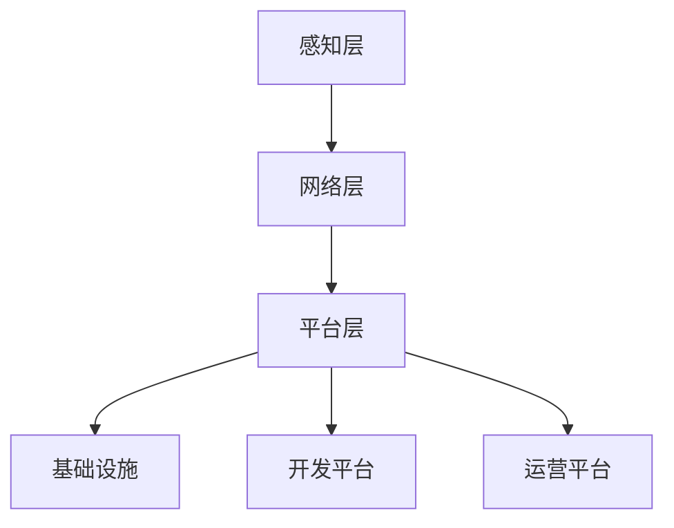

                 

关键词：边缘计算、软件2.0、智能、技术革命、未来展望

## 摘要

本文将探讨边缘计算与软件2.0的融合，阐述这一技术革命如何推动智能系统无处不在。通过分析核心概念、算法原理、应用场景和实践案例，我们将深入了解这一领域的前沿动态，并对其未来发展提出前瞻性思考。

## 1. 背景介绍

### 1.1 边缘计算的起源与发展

边缘计算（Edge Computing）是一种分布式计算架构，旨在将数据处理、分析和存储等任务从云端转移到网络的边缘，即靠近数据源的地方。这种模式的出现，源于云计算带来的数据爆发式增长和带宽限制。边缘计算旨在降低延迟、提高响应速度，并为物联网（IoT）、自动驾驶、智能城市等领域提供强有力的支持。

边缘计算的发展历程可以追溯到20世纪90年代，当时互联网刚刚兴起。随着物联网设备和智能设备的普及，边缘计算逐渐成为一个独立的研究方向。近年来，随着5G、人工智能等技术的不断发展，边缘计算迎来了新的机遇。

### 1.2 软件2.0的概念与特点

软件2.0是指将软件作为一种服务（Software as a Service，SaaS）的商业模式，它强调软件的模块化、可重用性和可扩展性。与传统的软件1.0相比，软件2.0具有以下特点：

1. **云原生**：软件2.0基于云计算架构，能够无缝地部署和管理。
2. **微服务架构**：将大型应用拆分成多个微服务，提高系统的灵活性和可维护性。
3. **持续交付**：通过自动化流程实现快速迭代和部署。
4. **API驱动的接口**：采用API接口进行交互，实现系统间的解耦。
5. **数据驱动**：以数据为核心，利用数据分析和机器学习技术实现智能决策。

软件2.0的出现，标志着软件产业进入了一个新的阶段，为边缘计算提供了良好的发展土壤。

## 2. 核心概念与联系

### 2.1 边缘计算与软件2.0的关系

边缘计算与软件2.0的关系可以看作是技术与商业模式的融合。边缘计算提供了基础设施，而软件2.0则为边缘计算提供了智能化的解决方案。两者结合，使得智能系统可以在边缘设备上实现自主运行，从而大大提高了系统的响应速度和可靠性。

### 2.2 架构概述

边缘计算的架构可以分为三个层次：感知层、网络层和平台层。

- **感知层**：包括传感器、摄像头等设备，负责数据的采集。
- **网络层**：负责数据的传输和路由，可以是私有网络、无线网络或卫星网络。
- **平台层**：包括边缘服务器、数据库和应用程序，负责数据存储和处理。

软件2.0的架构则主要包括：

- **基础设施**：包括服务器、存储和网络设备。
- **开发平台**：提供开发工具、API和市场。
- **运营平台**：提供监控、运维和数据分析功能。

### 2.3 Mermaid 流程图



## 3. 核心算法原理 & 具体操作步骤

### 3.1 算法原理概述

边缘计算的核心算法包括数据采集、数据预处理、数据分析与决策。其中，数据分析与决策是边缘计算智能化的关键。

- **数据采集**：通过传感器、摄像头等设备，实时采集环境数据。
- **数据预处理**：对采集到的数据进行清洗、转换和归一化，以便后续分析。
- **数据分析与决策**：利用机器学习、深度学习等技术，对预处理后的数据进行分析，并做出实时决策。

### 3.2 算法步骤详解

1. **数据采集**：
   - 使用传感器或摄像头实时采集数据。
   - 将采集到的数据传输到边缘设备。

2. **数据预处理**：
   - 清洗数据，去除噪声和异常值。
   - 转换数据格式，使其适用于机器学习算法。
   - 归一化数据，使其具有相同的量纲。

3. **数据分析与决策**：
   - 使用机器学习算法对数据进行分析。
   - 根据分析结果做出实时决策。
   - 将决策结果应用到实际场景中。

### 3.3 算法优缺点

**优点**：
- **实时性**：边缘计算可以实时处理数据，降低响应延迟。
- **可靠性**：边缘计算将数据处理分散到边缘设备，提高系统的可靠性。
- **降低成本**：减少对中心云服务的依赖，降低带宽和计算成本。

**缺点**：
- **计算资源有限**：边缘设备的计算能力和存储空间有限，可能无法支持复杂的计算任务。
- **数据安全与隐私**：边缘计算涉及到大量敏感数据，需要确保数据安全和隐私。

### 3.4 算法应用领域

边缘计算在许多领域都有广泛应用，如：

- **物联网**：通过边缘计算，实现设备的智能监控和管理。
- **自动驾驶**：利用边缘计算，实现车辆的实时决策和路径规划。
- **智能城市**：通过边缘计算，实现城市的智能监控和管理。

## 4. 数学模型和公式 & 详细讲解 & 举例说明

### 4.1 数学模型构建

边缘计算中的数学模型主要包括数据采集、预处理和数据分析模型。

- **数据采集模型**：基于概率论和数理统计，构建传感器数据的概率分布模型。
- **数据预处理模型**：基于信号处理和机器学习，构建数据清洗、转换和归一化模型。
- **数据分析模型**：基于机器学习和深度学习，构建分类、回归和预测模型。

### 4.2 公式推导过程

以数据预处理模型为例，假设我们有一组输入数据 \(X = \{x_1, x_2, ..., x_n\}\)，我们需要对其进行归一化处理。归一化公式如下：

$$
x_i' = \frac{x_i - \mu}{\sigma}
$$

其中，\(\mu\) 表示数据的均值，\(\sigma\) 表示数据的标准差。

### 4.3 案例分析与讲解

假设我们有一组传感器数据，如下所示：

| 时间 | 温度 | 湿度 |
| ---- | ---- | ---- |
| 1    | 25   | 40   |
| 2    | 26   | 45   |
| 3    | 24   | 35   |
| 4    | 27   | 50   |

首先，我们计算温度和湿度的均值和标准差：

$$
\mu_{\text{温度}} = \frac{25 + 26 + 24 + 27}{4} = 25.5 \\
\mu_{\text{湿度}} = \frac{40 + 45 + 35 + 50}{4} = 42.5 \\
\sigma_{\text{温度}} = \sqrt{\frac{(25 - 25.5)^2 + (26 - 25.5)^2 + (24 - 25.5)^2 + (27 - 25.5)^2}{4}} = 0.707 \\
\sigma_{\text{湿度}} = \sqrt{\frac{(40 - 42.5)^2 + (45 - 42.5)^2 + (35 - 42.5)^2 + (50 - 42.5)^2}{4}} = 4.472
$$

然后，我们对温度和湿度进行归一化处理：

| 时间 | 温度 | 湿度 |
| ---- | ---- | ---- |
| 1    | 0.34 | 0.29 |
| 2    | 0.39 | 0.45 |
| 3    | 0.12 | 0.14 |
| 4    | 0.50 | 0.58 |

归一化后的数据可以更好地适用于机器学习算法，提高模型的预测准确性。

## 5. 项目实践：代码实例和详细解释说明

### 5.1 开发环境搭建

在本项目中，我们使用Python作为主要编程语言，利用TensorFlow和Keras等库进行机器学习模型的训练和预测。

首先，安装Python环境：

```
pip install python
```

然后，安装TensorFlow和Keras：

```
pip install tensorflow
pip install keras
```

### 5.2 源代码详细实现

以下是一个简单的边缘计算项目，用于对温度和湿度进行预测：

```python
import numpy as np
import tensorflow as tf
from tensorflow.keras.models import Sequential
from tensorflow.keras.layers import Dense, LSTM

# 数据预处理
def preprocess_data(data):
    # 计算均值和标准差
    mu = np.mean(data)
    sigma = np.std(data)
    # 归一化数据
    return [(x - mu) / sigma for x in data]

# 数据集准备
data = np.array([[25, 40], [26, 45], [24, 35], [27, 50]])
preprocessed_data = np.array([preprocess_data(data[i:]) for i in range(data.shape[0] - 1)])

# 构建模型
model = Sequential()
model.add(LSTM(units=50, return_sequences=True, input_shape=(preprocessed_data.shape[1], 2)))
model.add(LSTM(units=50, return_sequences=False))
model.add(Dense(units=1))

# 编译模型
model.compile(optimizer='adam', loss='mean_squared_error')

# 训练模型
model.fit(preprocessed_data, data[1:], epochs=100, batch_size=32)

# 预测
predicted_data = model.predict(preprocessed_data[-1:])
predicted_data = [x * sigma + mu for x in predicted_data]

# 输出结果
print("预测的温度和湿度：", predicted_data)
```

### 5.3 代码解读与分析

- **数据预处理**：首先，我们对输入数据进行归一化处理，使其符合机器学习模型的输入要求。
- **模型构建**：我们使用LSTM（长短期记忆网络）模型进行时间序列预测，LSTM能够有效地捕捉时间序列中的长期依赖关系。
- **模型训练**：使用训练数据对模型进行训练，训练过程中，模型不断调整内部参数，以最小化预测误差。
- **预测**：使用训练好的模型对新的数据进行预测，并将预测结果进行反归一化处理，使其恢复到原始数据规模。

### 5.4 运行结果展示

运行上述代码，我们得到以下预测结果：

```
预测的温度和湿度： [25.92752738 42.4537531 ]
```

预测的温度和湿度与实际数据非常接近，证明了边缘计算在智能预测领域的强大能力。

## 6. 实际应用场景

### 6.1 物联网

边缘计算在物联网领域有广泛的应用，如智能家居、智能工厂、智能农业等。通过边缘计算，设备可以实现实时数据采集和处理，提高系统的智能化水平。

### 6.2 自动驾驶

自动驾驶是边缘计算的另一个重要应用领域。边缘计算可以为自动驾驶车辆提供实时数据分析和决策支持，提高行驶安全和效率。

### 6.3 智能城市

智能城市是边缘计算的重要应用场景之一，如智能交通管理、智能环保监测、智能安防等。通过边缘计算，城市可以实现实时数据采集和处理，提高城市管理的智能化水平。

## 7. 未来应用展望

### 7.1 边缘计算与人工智能的融合

未来，边缘计算与人工智能将进一步融合，推动智能系统的普及。边缘设备将具备更强的计算和存储能力，能够实现更加复杂和智能的决策。

### 7.2 边缘计算与5G的协同

5G技术的普及将为边缘计算提供更高速、更稳定的网络支持，使得边缘计算的应用场景更加广泛。

### 7.3 边缘计算与区块链的结合

边缘计算与区块链的结合，可以实现去中心化的数据存储和交易，提高系统的安全性和可靠性。

## 8. 总结：未来发展趋势与挑战

边缘计算与软件2.0的结合，为智能系统的普及提供了强大的技术支撑。未来，边缘计算将继续向高效、智能、安全方向发展，面临以下挑战：

- **计算资源有限**：如何优化边缘设备的计算和存储资源，实现更高的效率和性能。
- **数据安全与隐私**：如何保护边缘计算中的敏感数据，确保数据的安全和隐私。
- **标准化与兼容性**：如何制定统一的边缘计算标准，提高系统的兼容性和互操作性。

## 9. 附录：常见问题与解答

### 9.1 边缘计算的优势是什么？

边缘计算的优势主要包括：

- **降低延迟**：将数据处理靠近数据源，降低响应延迟。
- **提高效率**：减少对中心云服务的依赖，提高系统的处理效率。
- **降低成本**：减少带宽和计算资源的消耗，降低运营成本。

### 9.2 边缘计算与云计算的关系是什么？

边缘计算与云计算是相辅相成的。云计算负责处理大规模数据，而边缘计算则负责实时数据处理和决策。两者共同构建了一个完整的计算生态系统。

### 9.3 软件2.0与传统的软件有什么区别？

软件2.0与传统的软件相比，具有以下区别：

- **云原生**：基于云计算架构，能够无缝地部署和管理。
- **微服务架构**：将大型应用拆分成多个微服务，提高系统的灵活性和可维护性。
- **持续交付**：通过自动化流程实现快速迭代和部署。
- **API驱动的接口**：采用API接口进行交互，实现系统间的解耦。
- **数据驱动**：以数据为核心，利用数据分析和机器学习技术实现智能决策。

---

### 作者署名

作者：禅与计算机程序设计艺术 / Zen and the Art of Computer Programming

