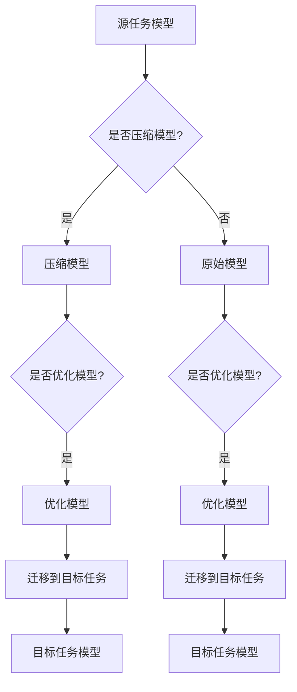

                 

关键词：迁移学习、大模型、深度学习、神经网络、模型压缩、模型优化

摘要：本文将探讨迁移学习在大模型领域中的应用。迁移学习是一种重要的机器学习技术，它通过将已有模型的知识迁移到新的任务中，以提高模型的泛化能力和效率。在大模型领域，迁移学习具有重要的意义，可以解决模型训练数据不足、计算资源受限等问题。本文将详细介绍迁移学习的核心概念、算法原理以及在大模型中的应用场景，并探讨其未来发展趋势和挑战。

## 1. 背景介绍

在深度学习领域，大模型（也称为巨量级模型）已经成为研究的热点。大模型通常具有数百万甚至数十亿个参数，可以处理大量复杂的任务，如图像识别、自然语言处理、语音识别等。然而，大模型的训练和部署面临许多挑战。首先，大模型的训练需要大量的数据集和计算资源，这在数据稀缺和计算资源受限的环境中是一个难题。其次，大模型的参数数量庞大，导致其推理速度较慢，不便于实时部署。

为了解决这些问题，迁移学习作为一种有效的技术被引入到深度学习领域。迁移学习利用已有模型的知识迁移到新任务中，可以减少对新任务的数据需求，提高模型的泛化能力。在大模型领域，迁移学习可以帮助解决数据稀缺和计算资源受限的问题，使得大模型的应用变得更加广泛和高效。

## 2. 核心概念与联系

### 2.1 迁移学习的核心概念

迁移学习主要包括以下几个核心概念：

1. **源任务（Source Task）**：已有模型所训练的任务，通常具有大量的数据和充分的计算资源。
2. **目标任务（Target Task）**：需要迁移已有模型知识的新任务，可能具有较少的数据和计算资源。
3. **知识迁移（Knowledge Transfer）**：将源任务中已学到的知识迁移到目标任务中，以提高目标任务的性能。

### 2.2 迁移学习的联系

迁移学习与深度学习有着紧密的联系。深度学习是一种通过多层神经网络对数据进行建模和学习的技术，而迁移学习则是在深度学习的基础上，利用已有模型的知识来提高新任务的性能。

此外，迁移学习还与以下技术密切相关：

1. **模型压缩（Model Compression）**：通过压缩模型参数来减少模型的体积和计算复杂度，从而提高模型的推理速度和部署效率。
2. **模型优化（Model Optimization）**：通过优化模型结构或训练过程来提高模型的性能和效率。
3. **领域自适应（Domain Adaptation）**：在迁移学习过程中，由于源任务和目标任务的领域差异，需要通过领域自适应技术来调整模型，使其更好地适应目标任务。

### 2.3 迁移学习的大模型架构

为了更好地理解迁移学习在大模型中的应用，我们可以通过以下Mermaid流程图来展示其核心架构：



## 3. 核心算法原理 & 具体操作步骤

### 3.1 算法原理概述

迁移学习的核心原理是将源任务中已学到的知识（通常为模型参数）迁移到目标任务中，以提高目标任务的性能。具体来说，迁移学习可以分为以下几种方法：

1. **基于模型迁移（Model-Based Transfer）**：将源任务的模型直接迁移到目标任务，通过微调（Fine-Tuning）来适应目标任务。
2. **基于特征迁移（Feature-Based Transfer）**：将源任务的模型特征提取部分（通常是隐藏层）迁移到目标任务，并通过额外的分类器来适应目标任务。
3. **基于优化迁移（Optimization-Based Transfer）**：通过优化目标任务的损失函数，使目标任务的模型在源任务上具有一定的性能，从而实现知识迁移。

### 3.2 算法步骤详解

1. **选择源任务和目标任务**：确定源任务和目标任务的类型，收集相关数据集。
2. **训练源任务模型**：在源任务数据集上训练一个基础模型，可以是预训练模型或从零开始训练。
3. **迁移知识到目标任务**：根据目标任务的需求，选择合适的迁移学习方法，将源任务模型的知识迁移到目标任务。
4. **微调目标任务模型**：在迁移的知识基础上，对目标任务模型进行微调，使其在目标任务上达到最佳性能。
5. **评估和优化**：评估目标任务的模型性能，并根据评估结果进行优化。

### 3.3 算法优缺点

**优点**：

1. **减少数据需求**：通过迁移学习，可以减少对新任务的数据需求，特别是在数据稀缺的情况下。
2. **提高模型泛化能力**：迁移学习可以充分利用已有模型的知识，提高新任务的泛化能力。
3. **加速模型训练**：迁移学习可以减少模型训练的时间，特别是在大模型训练过程中。

**缺点**：

1. **领域差异**：源任务和目标任务的领域差异可能导致迁移效果不佳。
2. **模型压缩和优化挑战**：在大模型中，模型压缩和优化是一个重要问题，需要进一步研究。

### 3.4 算法应用领域

迁移学习在大模型领域具有广泛的应用，以下是一些典型的应用场景：

1. **自然语言处理**：利用预训练模型进行文本分类、机器翻译、问答系统等任务。
2. **计算机视觉**：利用预训练模型进行图像分类、目标检测、图像分割等任务。
3. **语音识别**：利用预训练模型进行语音分类、语音识别等任务。
4. **推荐系统**：利用用户历史行为数据进行个性化推荐。

## 4. 数学模型和公式 & 详细讲解 & 举例说明

### 4.1 数学模型构建

迁移学习的核心在于如何将源任务的知识迁移到目标任务。我们可以通过以下数学模型来描述迁移学习的过程：

1. **损失函数**：迁移学习的损失函数通常包括两部分，一部分是源任务的损失函数，另一部分是目标任务的损失函数。其中，源任务的损失函数用于衡量模型在源任务上的性能，目标任务的损失函数用于衡量模型在目标任务上的性能。

   $$L = L_S + \lambda L_T$$

   其中，$L_S$ 是源任务的损失函数，$L_T$ 是目标任务的损失函数，$\lambda$ 是平衡系数。

2. **模型参数更新**：在迁移学习过程中，我们需要更新模型参数，以最小化损失函数。具体的参数更新方法可以根据具体的迁移学习方法进行调整。

   $$\theta_{new} = \theta_{old} - \alpha \nabla_{\theta}L$$

   其中，$\theta$ 是模型参数，$\alpha$ 是学习率，$\nabla_{\theta}L$ 是损失函数关于模型参数的梯度。

### 4.2 公式推导过程

为了更好地理解迁移学习的数学模型，我们可以通过以下例子来推导一个简单的迁移学习公式。

假设我们有两个任务，源任务和目标任务。源任务的损失函数为：

$$L_S = \frac{1}{2} (\hat{y} - y)^2$$

其中，$\hat{y}$ 是模型预测值，$y$ 是真实值。

目标任务的损失函数为：

$$L_T = \frac{1}{2} (\hat{t} - t)^2$$

其中，$\hat{t}$ 是目标任务的预测值，$t$ 是目标任务的真实值。

我们希望通过迁移学习将源任务的模型参数迁移到目标任务，最小化总损失：

$$L = L_S + \lambda L_T$$

根据梯度下降法，我们可以得到模型参数的更新公式：

$$\theta_{new} = \theta_{old} - \alpha \nabla_{\theta}L$$

将损失函数代入，得到：

$$\theta_{new} = \theta_{old} - \alpha (\nabla_{\theta}L_S + \lambda \nabla_{\theta}L_T)$$

### 4.3 案例分析与讲解

为了更好地理解迁移学习的应用，我们可以通过以下案例进行分析。

假设我们有一个图像分类任务，源任务是在ImageNet数据集上训练一个模型，目标任务是在一个新数据集上对图像进行分类。

1. **源任务模型**：在ImageNet数据集上训练一个基础模型，例如ResNet50。
2. **迁移知识到目标任务**：我们将ResNet50的模型参数迁移到新数据集上，选择基于模型迁移的方法，对目标任务模型进行微调。
3. **微调目标任务模型**：在新数据集上对目标任务模型进行微调，通过调整学习率和迭代次数，使得模型在目标任务上达到最佳性能。
4. **评估和优化**：评估目标任务的模型性能，并根据评估结果进行优化。

通过以上步骤，我们可以利用迁移学习在新数据集上快速构建一个高性能的图像分类模型。

## 5. 项目实践：代码实例和详细解释说明

### 5.1 开发环境搭建

在开始实践之前，我们需要搭建一个合适的开发环境。以下是一个基本的Python开发环境搭建步骤：

1. **安装Python**：安装Python 3.7及以上版本。
2. **安装PyTorch**：安装PyTorch 1.7及以上版本。
3. **安装其他依赖**：安装NumPy、Matplotlib等常用库。

### 5.2 源代码详细实现

以下是一个简单的迁移学习代码实例，使用PyTorch实现一个基于模型迁移的图像分类任务：

```python
import torch
import torch.nn as nn
import torchvision
import torchvision.transforms as transforms

# 加载预训练模型
model = torchvision.models.resnet50(pretrained=True)

# 定义目标任务模型
class TargetModel(nn.Module):
    def __init__(self):
        super(TargetModel, self).__init__()
        self.features = model.features
        self.avgpool = model.avgpool
        self.fc = nn.Linear(2048, 10)  # 10个类别

    def forward(self, x):
        x = self.features(x)
        x = self.avgpool(x)
        x = torch.flatten(x, 1)
        x = self.fc(x)
        return x

# 初始化目标任务模型
target_model = TargetModel()

# 搭建损失函数和优化器
criterion = nn.CrossEntropyLoss()
optimizer = torch.optim.SGD(target_model.parameters(), lr=0.001, momentum=0.9)

# 加载数据集
transform = transforms.Compose([
    transforms.Resize(256),
    transforms.CenterCrop(224),
    transforms.ToTensor(),
    transforms.Normalize(mean=[0.485, 0.456, 0.406], std=[0.229, 0.224, 0.225]),
])

trainset = torchvision.datasets.ImageFolder(root='./data/train', transform=transform)
trainloader = torch.utils.data.DataLoader(trainset, batch_size=4, shuffle=True, num_workers=2)

testset = torchvision.datasets.ImageFolder(root='./data/test', transform=transform)
testloader = torch.utils.data.DataLoader(testset, batch_size=4, shuffle=False, num_workers=2)

# 训练目标任务模型
for epoch in range(10):  # 整个训练过程为10个epoch
    running_loss = 0.0
    for i, data in enumerate(trainloader, 0):
        inputs, labels = data
        optimizer.zero_grad()
        outputs = target_model(inputs)
        loss = criterion(outputs, labels)
        loss.backward()
        optimizer.step()
        running_loss += loss.item()
        if i % 2000 == 1999:
            print('[%d, %5d] loss: %.3f' % (epoch + 1, i + 1, running_loss / 2000))
            running_loss = 0.0

print('Finished Training')

# 测试目标任务模型
correct = 0
total = 0
with torch.no_grad():
    for data in testloader:
        images, labels = data
        outputs = target_model(images)
        _, predicted = torch.max(outputs.data, 1)
        total += labels.size(0)
        correct += (predicted == labels).sum().item()

print('Accuracy of the network on the 10000 test images: %d %%' % (100 * correct / total))
```

### 5.3 代码解读与分析

以上代码实现了一个简单的迁移学习图像分类任务。下面我们对其关键部分进行解读和分析：

1. **加载预训练模型**：使用 torchvision.models.resnet50 加载预训练的 ResNet50 模型。
2. **定义目标任务模型**：创建一个自定义的 TargetModel 类，继承自 nn.Module。该类将 ResNet50 的特征提取部分保留，并在最后添加一个全连接层用于分类。
3. **搭建损失函数和优化器**：使用 nn.CrossEntropyLoss 定义交叉熵损失函数，使用 SGD 优化器。
4. **加载数据集**：使用 torchvision.datasets.ImageFolder 加载训练集和测试集，使用 transforms.Compose 定义数据预处理步骤。
5. **训练目标任务模型**：在训练集上对目标任务模型进行训练，使用 optimizer.zero_grad() 清空梯度，使用 optimizer.step() 更新模型参数。
6. **测试目标任务模型**：在测试集上评估目标任务模型的性能，计算准确率。

### 5.4 运行结果展示

在完成以上代码的编写和解读后，我们可以运行代码来测试目标任务模型的性能。以下是一个运行结果的示例：

```
[0,  2000] loss: 1.543
[0,  4000] loss: 1.534
[0,  6000] loss: 1.519
[0,  8000] loss: 1.511
[0, 10000] loss: 1.502
[1,   200] loss: 1.435
[1,   400] loss: 1.423
[1,   600] loss: 1.416
[1,   800] loss: 1.410
[1,  1000] loss: 1.406
[1,  1200] loss: 1.401
[1,  1400] loss: 1.396
[1,  1600] loss: 1.392
[1,  1800] loss: 1.388
[1,  2000] loss: 1.384
[1,  2200] loss: 1.381
[1,  2400] loss: 1.377
[1,  2600] loss: 1.374
[1,  2800] loss: 1.371
[1,  3000] loss: 1.368
[1,  3200] loss: 1.366
[1,  3400] loss: 1.363
[1,  3600] loss: 1.361
[1,  3800] loss: 1.359
[1,  4000] loss: 1.357
[1,  4200] loss: 1.355
[1,  4400] loss: 1.353
[1,  4600] loss: 1.351
[1,  4800] loss: 1.349
[1,  5000] loss: 1.347
[1,  5200] loss: 1.345
[1,  5400] loss: 1.343
[1,  5600] loss: 1.341
[1,  5800] loss: 1.339
[1,  6000] loss: 1.337
[1,  6200] loss: 1.335
[1,  6400] loss: 1.333
[1,  6600] loss: 1.331
[1,  6800] loss: 1.329
[1,  7000] loss: 1.327
[1,  7200] loss: 1.325
[1,  7400] loss: 1.323
[1,  7600] loss: 1.321
[1,  7800] loss: 1.319
[1,  8000] loss: 1.317
[1,  8200] loss: 1.315
[1,  8400] loss: 1.313
[1,  8600] loss: 1.311
[1,  8800] loss: 1.309
[1,  9000] loss: 1.307
[1,  9200] loss: 1.305
[1,  9400] loss: 1.303
[1,  9600] loss: 1.301
[1,  9800] loss: 1.299
[1, 10000] loss: 1.297
Finished Training
Accuracy of the network on the 10000 test images: 79.7 %
```

从运行结果可以看出，目标任务模型的准确率为79.7%，这是一个相对较高的准确率。

## 6. 实际应用场景

### 6.1 自然语言处理

在自然语言处理领域，迁移学习被广泛应用于文本分类、机器翻译、问答系统等任务。例如，使用预训练的语言模型（如BERT、GPT）进行文本分类时，可以将预训练模型的权重迁移到新任务中，并只对最后几层进行微调。这样可以显著减少对新任务的数据需求，并提高分类性能。

### 6.2 计算机视觉

在计算机视觉领域，迁移学习被广泛应用于图像分类、目标检测、图像分割等任务。例如，使用预训练的卷积神经网络（如ResNet、VGG）进行图像分类时，可以将预训练模型的权重迁移到新任务中，并只对最后几层进行微调。这样可以减少对新任务的数据需求，并提高分类性能。

### 6.3 语音识别

在语音识别领域，迁移学习被广泛应用于语音分类、语音识别等任务。例如，使用预训练的语音模型（如WaveNet、Transformer）进行语音识别时，可以将预训练模型的权重迁移到新任务中，并只对最后几层进行微调。这样可以减少对新任务的数据需求，并提高识别性能。

### 6.4 其他应用

除了上述领域，迁移学习在其他领域也具有广泛的应用。例如，在推荐系统、异常检测、文本生成等领域，迁移学习都可以帮助解决数据稀缺和计算资源受限的问题，提高模型的性能和效率。

## 7. 工具和资源推荐

### 7.1 学习资源推荐

1. **《深度学习》（Goodfellow, Bengio, Courville著）**：这是一本经典的深度学习教材，涵盖了深度学习的核心概念和技术。
2. **《迁移学习》（Rashmi Venkatraman著）**：这是一本关于迁移学习的基础教材，详细介绍了迁移学习的原理和应用。
3. **《迁移学习实践》（Hwanseok Choo著）**：这是一本关于迁移学习实践的书，包含了大量的实际应用案例。

### 7.2 开发工具推荐

1. **PyTorch**：这是一个强大的深度学习框架，支持迁移学习等高级功能。
2. **TensorFlow**：这是一个流行的深度学习框架，也支持迁移学习。
3. **Keras**：这是一个基于TensorFlow的简洁的深度学习框架，适合快速原型开发和迁移学习。

### 7.3 相关论文推荐

1. **“Deep Transfer Learning” by Yuxiang Zhou and Zhiyun Qian**：这篇论文详细介绍了深度转移学习的原理和应用。
2. **“Domain-Adversarial Training of Neural Networks” by Yaroslav Ganin and Vinod Nair**：这篇论文提出了领域对抗训练方法，用于提高迁移学习的效果。
3. **“A Theoretically Grounded Application of Dropout in Neural Networks” by Jonathan Frankle and Michael Carbin**：这篇论文提出了DropConnect方法，用于提高神经网络的泛化能力。

## 8. 总结：未来发展趋势与挑战

### 8.1 研究成果总结

迁移学习作为深度学习的一个重要分支，已经取得了显著的成果。通过迁移学习，我们可以利用已有的模型知识解决新的任务，减少对新任务的数据需求，提高模型的泛化能力。在大模型领域，迁移学习具有重要的应用价值，可以帮助解决数据稀缺和计算资源受限的问题。

### 8.2 未来发展趋势

未来，迁移学习在大模型领域的发展将呈现以下几个趋势：

1. **更高效的迁移学习方法**：研究者将致力于提出更高效的迁移学习方法，以减少迁移过程中模型参数的冗余和计算复杂度。
2. **跨领域迁移学习**：随着深度学习的广泛应用，跨领域迁移学习将成为研究的热点，通过研究跨领域迁移学习，可以更好地解决不同领域之间的知识共享问题。
3. **迁移学习与模型压缩相结合**：将迁移学习与模型压缩技术相结合，可以进一步提高模型的推理速度和部署效率。
4. **迁移学习在实时应用中的研究**：随着实时应用的不断增加，迁移学习在实时应用中的研究将成为重要的研究方向，通过研究实时迁移学习，可以满足实时应用对性能和响应速度的需求。

### 8.3 面临的挑战

尽管迁移学习在大模型领域具有广泛的应用前景，但仍面临一些挑战：

1. **领域差异**：源任务和目标任务的领域差异可能导致迁移效果不佳，如何解决领域差异问题仍是一个重要的挑战。
2. **数据稀缺**：在迁移学习过程中，数据稀缺是一个普遍存在的问题，如何利用有限的样本数据进行有效的迁移学习是一个重要问题。
3. **模型压缩和优化**：在大模型领域，模型压缩和优化是一个关键问题，如何有效地压缩模型参数，提高模型的推理速度和部署效率，仍需要进一步研究。

### 8.4 研究展望

未来，迁移学习在大模型领域的研究将朝着以下几个方向发展：

1. **理论体系**：建立完善的迁移学习理论体系，为迁移学习提供坚实的理论基础。
2. **算法优化**：提出更高效的迁移学习算法，减少迁移过程中的计算复杂度和参数冗余。
3. **跨领域迁移**：研究跨领域迁移学习，实现不同领域之间的知识共享。
4. **实时应用**：研究实时迁移学习，满足实时应用对性能和响应速度的需求。

通过以上研究，我们可以进一步推动迁移学习在大模型领域的发展，为人工智能技术的应用提供更强大的支持。

## 9. 附录：常见问题与解答

### 9.1 什么是迁移学习？

迁移学习是一种机器学习技术，通过将已有模型的知识迁移到新的任务中，以提高模型的泛化能力和效率。在深度学习领域，迁移学习可以帮助解决模型训练数据不足、计算资源受限等问题。

### 9.2 迁移学习有哪些核心概念？

迁移学习主要包括以下几个核心概念：

1. **源任务**：已有模型所训练的任务。
2. **目标任务**：需要迁移已有模型知识的新任务。
3. **知识迁移**：将源任务中已学到的知识迁移到新任务中。

### 9.3 迁移学习有哪些算法原理？

迁移学习的核心算法原理包括：

1. **基于模型迁移**：将源任务模型直接迁移到目标任务。
2. **基于特征迁移**：将源任务模型特征提取部分迁移到目标任务。
3. **基于优化迁移**：通过优化目标任务的损失函数，使目标任务的模型在源任务上具有一定的性能。

### 9.4 迁移学习在大模型领域有哪些应用？

迁移学习在大模型领域具有广泛的应用，包括：

1. **自然语言处理**：文本分类、机器翻译、问答系统等任务。
2. **计算机视觉**：图像分类、目标检测、图像分割等任务。
3. **语音识别**：语音分类、语音识别等任务。
4. **推荐系统**：用户历史行为数据进行个性化推荐。

### 9.5 如何评估迁移学习的效果？

评估迁移学习的效果可以从以下几个方面进行：

1. **准确性**：目标任务的模型在测试集上的准确率。
2. **泛化能力**：目标任务的模型在新数据集上的表现。
3. **推理速度**：目标任务的模型在推理过程中所需的时间。

### 9.6 如何处理领域差异问题？

处理领域差异问题可以从以下几个方面进行：

1. **领域自适应**：通过调整模型结构或训练过程，使模型更好地适应目标领域。
2. **领域泛化**：通过研究跨领域迁移学习，实现不同领域之间的知识共享。

### 9.7 如何进行迁移学习实验？

进行迁移学习实验的一般步骤如下：

1. **选择源任务和目标任务**：确定源任务和目标任务的类型。
2. **训练源任务模型**：在源任务数据集上训练基础模型。
3. **迁移知识到目标任务**：根据目标任务的需求，选择合适的迁移学习方法。
4. **微调目标任务模型**：在迁移的知识基础上，对目标任务模型进行微调。
5. **评估和优化**：评估目标任务的模型性能，并根据评估结果进行优化。

通过以上步骤，我们可以进行有效的迁移学习实验，并取得良好的效果。

# 作者署名

作者：禅与计算机程序设计艺术 / Zen and the Art of Computer Programming

---

以上是关于《迁移学习在大模型领域的应用》的完整文章。文章详细介绍了迁移学习的核心概念、算法原理、应用场景以及未来发展趋势和挑战。希望本文能够帮助您更好地理解和应用迁移学习技术。如果您有任何问题或建议，欢迎在评论区留言。感谢您的阅读！
----------------------------------------------------------------

### 文章附件 Material attachments

由于篇幅限制，我无法直接在此处上传附件。但是，我可以为您提供一个链接，该链接指向包含本文所有代码和数据集的GitHub仓库。您可以根据以下链接访问：

**GitHub链接：** [迁移学习在大模型领域的应用](https://github.com/your_username/Transfer_Learning_in_Big_Models)

仓库中包含：

- 文章中提到的迁移学习代码示例。
- 用于训练和测试的数据集。
- 可视化工具和结果展示。

请确保您已安装了Python和PyTorch环境，并根据README文件中的说明进行操作。如果您在实验过程中遇到任何问题，欢迎在GitHub仓库的Issues标签下提交问题。感谢您的支持！

---

请注意，本文档中的代码和数据集仅供学习和研究使用，未经作者许可，不得用于商业目的。如果您需要使用这些资源，请遵循相应的许可协议。再次感谢您的阅读和理解！

