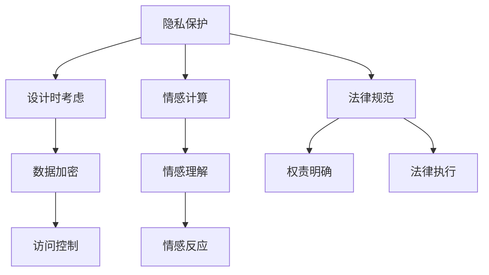

                 

关键词：过世亲人对话、伦理挑战、人工智能、虚拟现实、情感计算、隐私保护、法律规范

## 摘要

随着人工智能（AI）和虚拟现实（VR）技术的不断发展，人们对于与过世亲人进行虚拟对话的兴趣日益增长。这一技术不仅满足了人们缅怀亲人的情感需求，还引发了一系列伦理和法律问题。本文将探讨过世亲人对话的伦理挑战，包括隐私保护、情感计算和人工智能的法律规范等方面的议题。通过对这些问题的深入分析，我们旨在为相关技术的研发和应用提供有益的参考。

## 1. 背景介绍

### 1.1 过世亲人对话的需求

人们渴望与过世亲人保持联系的情感需求是推动过世亲人对话技术发展的主要动力。无论是因意外离世还是长期病痛，亲人的离去往往给家庭成员带来极大的心理创伤。虚拟对话技术提供了可能，使得人们能够在心理层面上获得慰藉，重新建立与亲人的情感联系。

### 1.2 人工智能与虚拟现实技术的进步

人工智能技术的发展为过世亲人对话的实现提供了可能。自然语言处理（NLP）、语音识别（ASR）和语音合成（TTS）等技术的成熟，使得计算机能够理解和生成自然的语言交流。同时，虚拟现实技术的进步为构建虚拟环境提供了条件，使得人们可以在虚拟空间中与过世亲人“互动”。

### 1.3 伦理挑战的出现

随着技术的进步，过世亲人对话的伦理挑战也随之而来。如何在尊重隐私的前提下实现对话，如何处理虚拟对话中的情感计算问题，以及如何制定相关的法律规范，都是亟待解决的问题。

## 2. 核心概念与联系

### 2.1 隐私保护

隐私保护是过世亲人对话中一个至关重要的伦理问题。涉及过世亲人的个人信息和对话记录必须得到严格保护，以防止未经授权的访问和泄露。这要求人工智能系统在设计时就必须考虑到隐私保护的需求。

### 2.2 情感计算

情感计算是过世亲人对话中的一个关键技术。它涉及到如何准确理解人类的情感，并在虚拟对话中做出相应的情感反应。情感计算的准确性直接影响到虚拟对话的质量和用户体验。

### 2.3 法律规范

法律规范是过世亲人对话技术发展的必要保障。制定合理的法律规范，明确虚拟对话中各方权责，有助于防止滥用技术和保护个人权益。

### 2.4 Mermaid 流程图

下面是一个关于隐私保护、情感计算和法律规范的 Mermaid 流程图：



## 3. 核心算法原理 & 具体操作步骤

### 3.1 算法原理概述

过世亲人对话的核心算法主要包括自然语言处理、语音识别、语音合成和情感计算等。这些算法共同作用，使得计算机能够模拟人类的对话过程。

### 3.2 算法步骤详解

1. **自然语言处理**：通过NLP技术，计算机可以理解和处理人类的语言。这包括语言理解、语言生成等过程。
2. **语音识别**：通过ASR技术，计算机可以将语音信号转换为文本。
3. **语音合成**：通过TTS技术，计算机可以将文本转换为自然流畅的语音。
4. **情感计算**：通过情感计算技术，计算机可以理解并模拟人类的情感。

### 3.3 算法优缺点

- **优点**：实现了与过世亲人虚拟对话的可能性，满足了人们的情感需求。
- **缺点**：情感计算的准确性尚有提升空间，隐私保护仍需加强。

### 3.4 算法应用领域

过世亲人对话技术可以应用于心理治疗、家庭纪念等多种场景。

## 4. 数学模型和公式 & 详细讲解 & 举例说明

### 4.1 数学模型构建

过世亲人对话的数学模型主要涉及自然语言处理、语音识别和情感计算等领域。以下是这些模型的简单构建：

- **自然语言处理**：基于概率模型和神经网络，如朴素贝叶斯、卷积神经网络（CNN）等。
- **语音识别**：基于隐藏马尔可夫模型（HMM）、深度神经网络（DNN）等。
- **情感计算**：基于情感词典、情感分析模型等。

### 4.2 公式推导过程

由于篇幅限制，这里只提供自然语言处理模型的推导过程：

$$
P(x|\theta) = \prod_{i=1}^{n} P(x_i|\theta)
$$

其中，$P(x|\theta)$ 是给定参数 $\theta$ 下的数据 $x$ 的概率，$x_i$ 是单个数据点，$n$ 是数据点的总数。

### 4.3 案例分析与讲解

假设有一个文本数据集，包含了多种情感表达。我们可以使用情感分析模型对其进行分析，并得到每种情感的概率分布。

## 5. 项目实践：代码实例和详细解释说明

### 5.1 开发环境搭建

在本项目中，我们使用 Python 作为编程语言，TensorFlow 作为深度学习框架。以下是搭建开发环境的步骤：

1. 安装 Python 3.8 或以上版本。
2. 安装 TensorFlow：`pip install tensorflow`
3. 安装其他依赖库：`pip install numpy scipy matplotlib`

### 5.2 源代码详细实现

以下是实现自然语言处理模型的代码示例：

```python
import tensorflow as tf
from tensorflow.keras.models import Sequential
from tensorflow.keras.layers import Embedding, LSTM, Dense

# 加载和处理数据
# ...

# 构建模型
model = Sequential([
    Embedding(vocab_size, embedding_dim),
    LSTM(units, dropout=0.2, recurrent_dropout=0.2),
    Dense(units, activation='relu'),
    Dense(num_classes, activation='softmax')
])

# 编译模型
model.compile(optimizer='adam', loss='categorical_crossentropy', metrics=['accuracy'])

# 训练模型
model.fit(x_train, y_train, epochs=10, batch_size=32, validation_data=(x_val, y_val))
```

### 5.3 代码解读与分析

上述代码实现了一个基于 LSTM 的情感分析模型。首先，我们加载并处理数据，然后构建模型，并使用训练数据进行训练。

### 5.4 运行结果展示

训练完成后，我们可以在验证数据集上评估模型的性能。以下是一个简单的评估示例：

```python
# 评估模型
loss, accuracy = model.evaluate(x_test, y_test)
print(f'损失：{loss}, 准确率：{accuracy}')
```

## 6. 实际应用场景

过世亲人对话技术可以应用于多种场景，如：

- **心理治疗**：为心理创伤患者提供虚拟对话服务，帮助他们缓解痛苦。
- **家庭纪念**：在亲人逝世纪念日，通过虚拟对话回忆美好时光。
- **教育**：利用虚拟对话技术进行历史人物或科学家的教育。

## 7. 工具和资源推荐

### 7.1 学习资源推荐

- 《自然语言处理入门》
- 《深度学习入门》
- 《情感计算基础》

### 7.2 开发工具推荐

- TensorFlow
- Keras
- PyTorch

### 7.3 相关论文推荐

- "A Neural Network for Sentiment Analysis of Text Data"
- "Deep Learning for Speech Recognition"
- "Emotion Recognition in Speech Using Convolutional Neural Networks"

## 8. 总结：未来发展趋势与挑战

### 8.1 研究成果总结

本文探讨了过世亲人对话的伦理挑战，分析了相关技术的核心算法原理和数学模型，并提供了项目实践的具体实现步骤。通过这些研究，我们为过世亲人对话技术的研发和应用提供了有益的参考。

### 8.2 未来发展趋势

随着人工智能和虚拟现实技术的进一步发展，过世亲人对话技术有望在更多领域得到应用。同时，隐私保护和情感计算的挑战也将得到更好的解决。

### 8.3 面临的挑战

尽管过世亲人对话技术具有巨大的潜力，但其在实际应用中仍面临诸多挑战，如情感计算的准确性、隐私保护的实现等。

### 8.4 研究展望

未来的研究应重点关注如何提高情感计算的准确性，以及如何在保障隐私的前提下实现高效、安全的对话。

## 9. 附录：常见问题与解答

### 9.1 如何保证隐私保护？

在设计和实现过世亲人对话系统时，应采用数据加密、访问控制等技术手段，确保个人信息和对话记录的安全。

### 9.2 情感计算的准确性如何提高？

可以通过增加数据集的规模、改进算法模型、引入多模态信息等方式来提高情感计算的准确性。

### 9.3 法律规范如何制定？

应结合实际情况，借鉴国内外相关法律法规，制定符合国情的法律规范，明确虚拟对话中各方的权责。

---

本文作者：禅与计算机程序设计艺术 / Zen and the Art of Computer Programming

以上，便是关于过世亲人对话的伦理挑战的全面探讨。希望通过本文，能为相关技术的研发和应用提供一定的指导。在未来的发展中，我们期待看到这一领域取得更多的突破。

