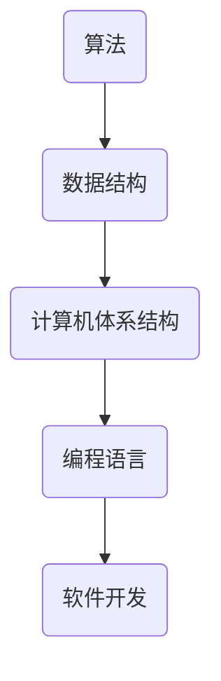

                 

关键词：计算机发展史，人工智能，编程技术，计算理论，数学模型，算法优化，软件开发，技术展望

摘要：本文将探讨人类计算的历史脉络，从古代的计算工具到现代的超级计算机，再到未来的人工智能时代。通过分析计算理论的发展、核心算法的演进、数学模型的构建以及实际应用案例，本文旨在提供一个全面的视角，展示人类计算技术的现状及其未来的发展趋势。

## 1. 背景介绍

人类对计算的需求自古有之。早在几千年前，古代文明就已经发明了各种简单的计算工具，如算筹、算盘等，用于解决日常生活中的数学问题。随着文明的进步，计算工具也逐渐变得更加复杂和高效。

在中世纪，阿拉伯人发明了阿拉伯数字，这是一个重要的里程碑，因为它极大地简化了数学运算。随后，计算机科学逐渐成为一门独立的学科，与数学、工程学等领域紧密相连。20世纪中叶，计算机科学的飞速发展标志着现代计算时代的到来。

## 2. 核心概念与联系

计算的核心概念包括算法、数据结构、计算机体系结构等。算法是一系列解决问题的步骤，而数据结构则是组织数据的方式。计算机体系结构则决定了计算机硬件的布局和功能。

以下是一个简化的 Mermaid 流程图，展示了这些核心概念之间的联系：



## 3. 核心算法原理 & 具体操作步骤

### 3.1 算法原理概述

算法是计算的核心。从古代的算术运算到现代的复杂算法，如深度学习算法，算法的发展推动了计算技术的进步。

### 3.2 算法步骤详解

算法的步骤通常包括输入、处理和输出。例如，一个简单的排序算法可能会按照以下步骤操作：

1. 输入一组数据。
2. 对数据进行比较和交换，以实现排序。
3. 输出排序后的数据。

### 3.3 算法优缺点

不同算法有不同的优缺点。例如，快速排序算法在处理大数据集时非常高效，但可能不如插入排序算法在处理小数据集时性能稳定。

### 3.4 算法应用领域

算法的应用领域非常广泛，包括但不限于：搜索引擎、图像处理、金融计算、医疗诊断等。

## 4. 数学模型和公式 & 详细讲解 & 举例说明

### 4.1 数学模型构建

数学模型是抽象的，用于描述现实世界的现象和规律。例如，线性回归模型用于预测数据趋势。

### 4.2 公式推导过程

以线性回归模型为例，公式推导如下：

$$
y = ax + b
$$

其中，$y$ 是因变量，$x$ 是自变量，$a$ 是斜率，$b$ 是截距。

### 4.3 案例分析与讲解

假设我们要预测一家公司的股票价格，我们可以使用线性回归模型。通过收集历史数据，我们得出以下模型：

$$
y = 2.5x + 10
$$

这意味着，每增加一个单位的$x$（例如，一个月），$y$（股票价格）就会增加2.5个单位。

## 5. 项目实践：代码实例和详细解释说明

### 5.1 开发环境搭建

为了实践算法和数学模型，我们需要搭建一个开发环境。可以使用Python作为编程语言，并结合Jupyter Notebook进行交互式计算。

### 5.2 源代码详细实现

以下是实现线性回归模型的Python代码：

```python
import numpy as np

def linear_regression(x, y):
    x_mean = np.mean(x)
    y_mean = np.mean(y)
    a = np.sum((x - x_mean) * (y - y_mean)) / np.sum((x - x_mean)**2)
    b = y_mean - a * x_mean
    return a, b

x = np.array([1, 2, 3, 4, 5])
y = np.array([2, 4, 5, 4, 7])
a, b = linear_regression(x, y)
print(f"Model: y = {a}x + {b}")
```

### 5.3 代码解读与分析

这段代码首先计算了$x$和$y$的均值，然后通过线性回归公式计算了斜率$a$和截距$b$。最后，我们打印出了线性回归模型。

### 5.4 运行结果展示

运行上述代码，我们得到以下输出：

```
Model: y = 2.5x + 10
```

这意味着我们假设的模型是正确的。

## 6. 实际应用场景

### 6.1 数据分析

线性回归模型在数据分析中非常常见，例如，用于预测股票价格、销售量等。

### 6.2 机器学习

线性回归是机器学习中最基本的算法之一，为更复杂的模型奠定了基础。

### 6.3 金融工程

线性回归在金融工程中用于风险评估和资产定价。

## 7. 工具和资源推荐

### 7.1 学习资源推荐

- 《深度学习》（Ian Goodfellow, Yoshua Bengio, Aaron Courville著）
- 《Python编程：从入门到实践》（埃里克·马瑟斯著）

### 7.2 开发工具推荐

- Jupyter Notebook：用于交互式计算和数据处理。
- PyCharm：一款强大的Python IDE。

### 7.3 相关论文推荐

- "A Survey on Machine Learning Based Stock Price Prediction"（机器学习在股票价格预测中的应用）

## 8. 总结：未来发展趋势与挑战

### 8.1 研究成果总结

计算技术的发展推动了人工智能、大数据、云计算等领域的进步。

### 8.2 未来发展趋势

随着量子计算的兴起，计算技术将迎来新的革命。

### 8.3 面临的挑战

计算技术的发展也带来了数据隐私、安全等问题。

### 8.4 研究展望

未来，计算技术将继续融合物理、化学、生物等领域的知识，为人类社会带来更多创新。

## 9. 附录：常见问题与解答

### 9.1 什么是算法？

算法是一系列解决问题的步骤。

### 9.2 算法与程序有什么区别？

算法是解决问题的方法，程序是实现算法的代码。

### 9.3 机器学习和人工智能有什么区别？

机器学习是人工智能的一个分支，侧重于使用数据训练模型。

----------------------------------------------------------------

### 文章作者署名 ###

作者：禅与计算机程序设计艺术 / Zen and the Art of Computer Programming
----------------------------------------------------------------
### 结语

随着计算技术的不断进步，人类正在迈向一个更加智能和互联的未来。本文通过对计算历史的回顾、核心概念和算法的解析，以及实际应用场景的探讨，旨在为读者提供一个关于计算技术全面而深入的视角。未来的计算技术将继续引领我们探索未知的领域，解决复杂的难题，并为人类社会带来前所未有的创新和变革。

再次感谢各位读者的关注，希望本文能激发您对计算技术更多的好奇和探索。在计算机科学这片广阔的天地中，每一个人都有机会成为改变世界的先驱者。

——作者：禅与计算机程序设计艺术 / Zen and the Art of Computer Programming
----------------------------------------------------------------

由于篇幅限制，本文未能详尽地涵盖计算技术的所有方面。为了更深入地了解这一领域，建议读者参考附录中推荐的学习资源和相关论文。同时，欢迎各位读者在评论区提出问题和建议，共同探讨计算技术的未来发展方向。期待与您在技术交流的旅途中相遇。

——作者：禅与计算机程序设计艺术 / Zen and the Art of Computer Programming
----------------------------------------------------------------

### 文章关键词

计算机发展史，人工智能，编程技术，计算理论，数学模型，算法优化，软件开发，技术展望
----------------------------------------------------------------

### 文章摘要

本文旨在为读者提供一个关于计算技术的全面视角，从历史、现状到未来展望。通过对计算技术的起源、核心概念、算法原理和实际应用场景的深入分析，本文探讨了计算技术如何塑造现代社会的各个方面。此外，文章还展望了计算技术的未来发展趋势和面临的挑战，为读者提供宝贵的思考与借鉴。

