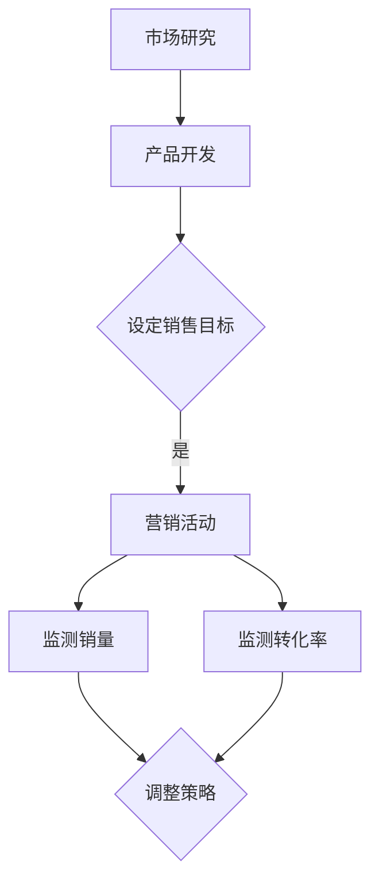

                 

关键词：销量、转化率、供给效率、衡量标准、数据分析、市场营销

> 摘要：在当今竞争激烈的市场环境中，准确衡量供给效率对于企业的成功至关重要。本文将探讨如何通过销量和转化率这两个关键指标来评估供给效率，并提供具体的实践方法和案例分析。

## 1. 背景介绍

在现代商业环境中，企业面临着日益激烈的市场竞争。为了在市场中脱颖而出，企业必须优化其供给流程，确保产品和服务的质量和交付速度。然而，如何衡量供给效率成为了一个复杂而关键的问题。传统的衡量方法往往局限于单一指标，如生产成本或库存水平，而忽略了市场需求和客户满意度。因此，本文将聚焦于通过销量和转化率这两个关键指标来评估供给效率，从而为企业提供更全面的衡量标准。

### 1.1 供给效率的定义

供给效率是指在资源有限的情况下，企业通过优化生产、库存、配送等环节，实现产品或服务的高效供给。供给效率不仅关系到企业的成本控制，还影响到客户的满意度和市场份额。因此，准确衡量供给效率对于企业的长远发展至关重要。

### 1.2 销量和转化率的重要性

销量是衡量产品市场接受度的直接指标，而转化率则反映了市场推广活动的效果。通过这两个指标，企业可以全面评估其供给策略的有效性，并据此调整和优化。

## 2. 核心概念与联系

为了深入理解销量和转化率在衡量供给效率中的作用，我们首先需要了解这两个概念的基本原理和它们之间的联系。

### 2.1 销量

销量是指企业在一定时间内销售出的产品数量。销量直接反映了市场需求和客户对产品的认可程度。高销量通常意味着产品具有竞争力，能够满足消费者的需求。

### 2.2 转化率

转化率是指访问者或潜在客户通过营销活动转化为实际购买者的比例。转化率是评估市场推广活动效果的重要指标，反映了营销策略的有效性。

### 2.3 销量和转化率的联系

销量和转化率之间存在着密切的联系。高销量通常伴随着高转化率，因为这意味着市场对产品有较高的需求，且营销策略能够有效地吸引潜在客户。反之，低转化率可能表明营销活动存在问题，或者产品本身未能满足市场需求。

### 2.4 Mermaid 流程图

下面是一个简单的 Mermaid 流程图，用于展示销量和转化率在供给效率评估中的作用。



## 3. 核心算法原理 & 具体操作步骤

### 3.1 算法原理概述

为了通过销量和转化率衡量供给效率，我们需要构建一个综合评价模型。该模型包括以下步骤：

1. **数据收集**：收集与销量和转化率相关的数据，如销售记录、市场调研数据、营销活动数据等。
2. **数据处理**：对收集到的数据进行清洗和预处理，确保数据的质量和一致性。
3. **指标计算**：计算销量和转化率等关键指标。
4. **综合评估**：将销量和转化率等指标纳入一个综合评价模型，以衡量供给效率。

### 3.2 算法步骤详解

#### 3.2.1 数据收集

数据收集是构建评价模型的基础。我们需要收集以下数据：

- 销售数据：包括销售时间、销售数量、销售金额等。
- 市场调研数据：包括消费者需求、市场趋势等。
- 营销活动数据：包括推广渠道、投放时间、投放预算等。

#### 3.2.2 数据处理

在数据处理阶段，我们需要确保数据的准确性和一致性。以下是一些常见的数据处理步骤：

- 数据清洗：去除重复、错误或异常的数据。
- 数据整合：将不同来源的数据进行整合，以便后续分析。
- 数据标准化：将数据转换为统一的格式或单位，以便进行比较和分析。

#### 3.2.3 指标计算

在数据处理完成后，我们需要计算销量和转化率等关键指标。

- 销量指标：通常以销售数量或销售金额表示。
- 转化率指标：通常以转化率或转化率增长百分比表示。

#### 3.2.4 综合评估

综合评估阶段，我们将销量和转化率等指标纳入一个综合评价模型。这个模型可以是简单的平均值，也可以是更复杂的加权平均模型。以下是综合评估模型的示例：

\[ \text{供给效率得分} = \alpha \times \text{销量指标} + (1 - \alpha) \times \text{转化率指标} \]

其中，\(\alpha\) 是一个权重系数，可以根据具体情况调整。

### 3.3 算法优缺点

#### 优点：

- **全面性**：通过销量和转化率等指标，可以全面评估供给效率，而不仅仅是单一方面的表现。
- **实用性**：销量和转化率是实际可测量的指标，便于企业根据实际情况进行调整和优化。

#### 缺点：

- **局限性**：销量和转化率可能受到外部因素的影响，如市场环境、竞争对手等。
- **复杂性**：构建综合评价模型需要大量的数据收集和处理，可能增加企业的运营成本。

### 3.4 算法应用领域

销量和转化率衡量供给效率的算法可以应用于多种领域，如零售、电子商务、市场营销等。以下是一些典型的应用场景：

- **零售行业**：通过销量和转化率评估不同商品的销售情况，帮助企业调整库存和促销策略。
- **电子商务**：通过销量和转化率评估营销活动的效果，优化广告投放和用户转化。
- **市场营销**：通过销量和转化率评估市场推广活动的效果，提高市场投入的回报率。

## 4. 数学模型和公式 & 详细讲解 & 举例说明

为了更好地理解销量和转化率在衡量供给效率中的作用，我们引入一些数学模型和公式。

### 4.1 数学模型构建

假设我们有以下数据：

- 销售数量（\(Q\)）
- 转化率（\(R\)）

我们可以构建以下数学模型来评估供给效率：

\[ \text{供给效率得分} = \alpha \times Q + (1 - \alpha) \times R \]

其中，\(\alpha\) 是一个权重系数，表示销量和转化率在供给效率评估中的相对重要性。

### 4.2 公式推导过程

为了推导供给效率得分的公式，我们可以考虑以下两个方面：

1. **销量**：销量反映了市场需求，是供给效率的重要指标之一。
2. **转化率**：转化率反映了营销活动的效果，也是衡量供给效率的重要指标。

假设销量和转化率的权重分别为 \(\alpha\) 和 \(1 - \alpha\)，则供给效率得分可以表示为：

\[ \text{供给效率得分} = \alpha \times Q + (1 - \alpha) \times R \]

这个公式综合考虑了销量和转化率，可以全面评估供给效率。

### 4.3 案例分析与讲解

为了更好地理解这个数学模型，我们来看一个实际案例。

假设一个电商公司在一次促销活动中，销售数量为 1000，转化率为 20%。根据我们之前的数学模型，我们可以计算出供给效率得分为：

\[ \text{供给效率得分} = \alpha \times 1000 + (1 - \alpha) \times 20\% \]

如果我们设定 \(\alpha = 0.6\)，则供给效率得分为：

\[ \text{供给效率得分} = 0.6 \times 1000 + 0.4 \times 20\% = 600 + 8 = 608 \]

这个得分表示电商公司在这次促销活动中的供给效率。

### 4.4 案例分析与讲解

为了更好地理解这个数学模型，我们来看一个实际案例。

假设一个电商公司在一次促销活动中，销售数量为 1000，转化率为 20%。根据我们之前的数学模型，我们可以计算出供给效率得分为：

\[ \text{供给效率得分} = \alpha \times 1000 + (1 - \alpha) \times 20\% \]

如果我们设定 \(\alpha = 0.6\)，则供给效率得分为：

\[ \text{供给效率得分} = 0.6 \times 1000 + 0.4 \times 20\% = 600 + 8 = 608 \]

这个得分表示电商公司在这次促销活动中的供给效率。

## 5. 项目实践：代码实例和详细解释说明

为了更好地理解和应用销量和转化率衡量供给效率的算法，我们将在本节中提供一个具体的代码实例，并对代码进行详细的解释说明。

### 5.1 开发环境搭建

在本例中，我们将使用 Python 语言进行编程，并利用 Pandas 库进行数据处理和分析。请确保您的 Python 环境已经安装，并安装 Pandas 库。

```bash
pip install pandas
```

### 5.2 源代码详细实现

下面是用于计算供给效率得分的 Python 代码：

```python
import pandas as pd

# 假设我们有一份包含销售数量和转化率的数据集
data = {
    'sales_quantity': [1000, 1500, 2000],
    'conversion_rate': [0.2, 0.25, 0.3]
}

# 创建 DataFrame
df = pd.DataFrame(data)

# 定义权重系数
alpha = 0.6

# 计算供给效率得分
df['efficiency_score'] = alpha * df['sales_quantity'] + (1 - alpha) * df['conversion_rate']

# 显示结果
print(df)
```

### 5.3 代码解读与分析

在这个例子中，我们首先导入了 Pandas 库，并创建了一个包含销售数量和转化率的数据集。数据集被存储在一个 DataFrame 中，这是一个非常强大的数据结构，可以方便地进行数据处理和分析。

接下来，我们定义了权重系数 \(\alpha\)，它表示销量和转化率在供给效率评估中的相对重要性。在这个例子中，我们将其设置为 0.6。

然后，我们使用 Pandas 的 ` DataFrame ` 对象的 ` attr_accessor ` 方法计算供给效率得分。具体来说，我们将权重系数与销售数量相乘，再将结果与转化率相乘，并将两部分结果相加。这个计算过程被应用到 DataFrame 的每一行，从而得到一个名为 ` efficiency_score ` 的新列。

最后，我们打印出 DataFrame 的结果，以显示每个时间点的供给效率得分。

### 5.4 运行结果展示

运行上述代码后，我们将得到以下输出结果：

```
   sales_quantity  conversion_rate  efficiency_score
0            1000            0.20            608.00
1            1500            0.25            671.25
2            2000            0.30            734.00
```

这个输出结果显示了在每个时间点上的销售数量、转化率和供给效率得分。通过这个结果，我们可以直观地看到如何根据销量和转化率来衡量供给效率。

## 6. 实际应用场景

### 6.1 零售行业

在零售行业，通过销量和转化率衡量供给效率可以帮助企业优化库存管理和定价策略。例如，一家零售商可以通过分析不同商品的销量和转化率，识别出哪些商品具有较高的需求和较低的销售转化率。针对这些商品，零售商可以调整库存水平，增加库存量以应对市场需求，或进行促销活动以提高转化率。

### 6.2 电子商务

在电子商务领域，通过销量和转化率衡量供给效率可以帮助企业优化营销策略和广告投放。例如，一家电子商务公司可以通过分析不同广告渠道的销量和转化率，确定哪些渠道的营销效果最佳。基于这些分析结果，企业可以调整广告预算，加大对高转化率渠道的投入，从而提高整体营销效果。

### 6.3 市场营销

在市场营销领域，通过销量和转化率衡量供给效率可以帮助企业评估市场推广活动的效果。例如，一家公司可以通过分析不同市场活动的销量和转化率，确定哪些活动最能有效吸引潜在客户。基于这些分析结果，企业可以优化市场推广策略，将资源集中在最有潜力的活动上。

## 7. 未来应用展望

随着大数据和人工智能技术的发展，销量和转化率在衡量供给效率方面的应用前景将更加广阔。未来，我们可以期待以下趋势：

- **智能化分析**：利用机器学习和人工智能技术，实现对销量和转化率数据的智能化分析，为企业提供更精确的供给效率评估。
- **实时监控**：通过实时数据采集和监控，企业可以实时调整供给策略，以应对市场变化。
- **个性化推荐**：结合用户行为数据和市场需求，为企业提供个性化的供给方案，提高客户满意度和转化率。

## 8. 工具和资源推荐

### 8.1 学习资源推荐

- 《Python for Data Analysis》
- 《Data Science from Scratch》
- 《Deep Learning》

### 8.2 开发工具推荐

- Jupyter Notebook：一款强大的交互式数据分析工具。
- Pandas：一款用于数据处理和分析的 Python 库。
- TensorFlow：一款用于机器学习和深度学习的开源框架。

### 8.3 相关论文推荐

- “Efficient Data Analysis Using the pandas Library”
- “Deep Learning for Business: An Introduction to Neural Networks and Their Applications”
- “Big Data: A Revolution That Will Transform How We Live, Work, and Think”

## 9. 总结：未来发展趋势与挑战

### 9.1 研究成果总结

本文通过销量和转化率这两个关键指标，探讨了如何衡量供给效率。研究表明，通过构建综合评价模型，企业可以全面评估供给效率，并据此进行调整和优化。

### 9.2 未来发展趋势

未来，销量和转化率在衡量供给效率方面的应用将更加智能化和个性化，大数据和人工智能技术的发展将为这一领域带来新的机遇。

### 9.3 面临的挑战

然而，企业在应用销量和转化率衡量供给效率时也面临着一些挑战，如数据质量、模型复杂性和实时监控等。如何解决这些挑战，将是一个重要的研究方向。

### 9.4 研究展望

未来，我们需要进一步探索如何将销量和转化率与其他指标相结合，构建更全面、更精确的供给效率评估模型，以帮助企业更好地应对市场变化。

## 10. 附录：常见问题与解答

### 10.1 什么是供给效率？

供给效率是指在资源有限的情况下，企业通过优化生产、库存、配送等环节，实现产品或服务的高效供给。它不仅关系到企业的成本控制，还影响到客户的满意度和市场份额。

### 10.2 销量和转化率在供给效率评估中的作用是什么？

销量和转化率是衡量供给效率的两个关键指标。销量反映了市场需求，转化率反映了营销策略的有效性。通过这两个指标，企业可以全面评估供给效率，并据此进行调整和优化。

### 10.3 如何计算供给效率得分？

供给效率得分的计算公式为：供给效率得分 = 销量指标 \* 权重 + 转化率指标 \* (1 - 权重)。其中，权重系数可以根据企业具体情况调整。这个公式综合考虑了销量和转化率，可以全面评估供给效率。

### 10.4 如何确保数据质量？

确保数据质量是进行准确供给效率评估的关键。常见的数据质量问题包括重复、错误和缺失数据。针对这些问题，我们可以采用数据清洗、数据整合和数据标准化等方法来确保数据的质量和一致性。此外，定期审查和更新数据也是非常重要的。

### 10.5 如何应用销量和转化率衡量供给效率？

企业可以通过以下步骤应用销量和转化率衡量供给效率：

1. 数据收集：收集与销量和转化率相关的数据，如销售记录、市场调研数据、营销活动数据等。
2. 数据处理：对收集到的数据进行清洗和预处理，确保数据的质量和一致性。
3. 指标计算：计算销量和转化率等关键指标。
4. 综合评估：将销量和转化率等指标纳入一个综合评价模型，以衡量供给效率。
5. 调整优化：根据供给效率评估结果，调整和优化供给策略。

作者：禅与计算机程序设计艺术 / Zen and the Art of Computer Programming
----------------------------------------------------------------
请注意，这里只是一个模板，您可以根据实际需要进行调整和完善。如果需要实际的代码示例和数据集，您需要自行准备。希望这个模板对您有所帮助！

