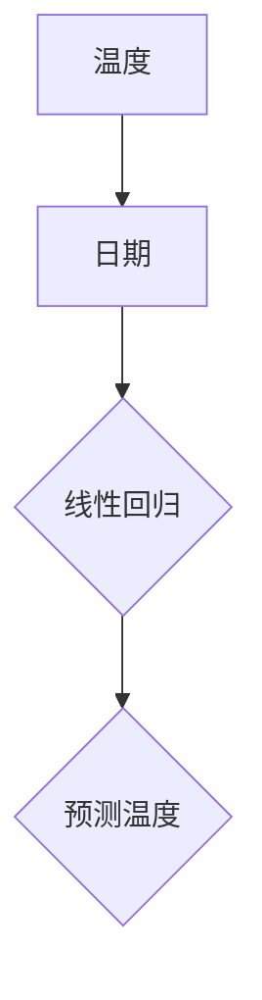

                 

关键词：人类计算、创造力、计算机科学、算法、数学模型、实践应用

## 1. 背景介绍

在当今数字化时代，计算机科学已经成为推动社会进步和科技创新的重要力量。而人类计算作为计算机科学的核心组成部分，更是释放人类创造力的源泉。人类计算不仅仅是计算机程序的编写与运行，更是一种思维方式，一种解决复杂问题的能力。从简单的逻辑运算到复杂的算法设计，人类计算的能力在不断提升，从而推动了计算机科学的快速发展。

本文旨在探讨人类计算的魅力，分析其核心概念、算法原理、数学模型以及实际应用，以期揭示人类计算在计算机科学中的重要作用。同时，本文还将对未来的发展趋势与挑战进行展望，为读者提供全面而深入的理解。

## 2. 核心概念与联系

### 2.1  计算机科学概述

计算机科学是一门研究计算机的理论、设计、实现、应用和发展的学科。它涉及多个领域，包括算法、编程语言、软件工程、人工智能、计算机网络等。计算机科学的核心目标是通过构建和运用计算机系统，解决现实世界中的各种问题。

### 2.2  人类计算的概念

人类计算是指人类在计算机科学领域中的创造性活动，包括算法设计、编程实现、问题求解等。人类计算不同于机器计算，它依赖于人类的智慧、经验、直觉和创造力。人类计算不仅要求对计算机科学的深入理解，还需要具备解决复杂问题的能力。

### 2.3  人类计算与计算机科学的联系

人类计算是计算机科学的重要组成部分，它为计算机科学的发展提供了源源不断的创新动力。计算机科学的进步反过来又推动了人类计算能力的提升，形成了一个相互促进、共同发展的良性循环。这种紧密联系使得人类计算成为计算机科学中不可替代的力量。

## 3. 核心算法原理 & 具体操作步骤

### 3.1  算法原理概述

算法是计算机科学中用于解决问题的步骤集合。一个优秀的算法不仅要求高效，还要求易于理解和实现。在人类计算中，算法的设计和优化是核心任务之一。本文将介绍几种典型的算法原理，包括排序算法、搜索算法和图算法等。

### 3.2  算法步骤详解

#### 3.2.1  排序算法

排序算法是计算机科学中最基础的算法之一。常见的排序算法包括冒泡排序、选择排序、插入排序、快速排序等。这些算法的基本原理是通过比较和交换元素的位置，将一组无序的数据转换为有序的数据。

#### 3.2.2  搜索算法

搜索算法是用于在数据集合中查找特定元素的算法。常见的搜索算法包括线性搜索、二分搜索等。线性搜索是从数据集合的第一个元素开始，依次与要查找的元素进行比较，直到找到或确定元素不存在。二分搜索则是基于有序数据集合的特性，通过不断缩小搜索范围，提高查找效率。

#### 3.2.3  图算法

图算法是用于处理图结构数据的算法。常见的图算法包括最短路径算法、最小生成树算法、图遍历算法等。这些算法广泛应用于网络路由、社交网络分析、图像处理等领域。

### 3.3  算法优缺点

每种算法都有其优缺点，适用于不同的场景。例如，冒泡排序和选择排序时间复杂度较低，但排序速度较慢；快速排序时间复杂度较高，但排序速度较快。选择合适的算法，可以大大提高问题解决的效率。

### 3.4  算法应用领域

算法在计算机科学的各个领域都有广泛的应用。在数据科学领域，算法用于数据清洗、数据挖掘、机器学习等；在计算机图形学领域，算法用于图像处理、计算机动画等；在人工智能领域，算法用于模式识别、自然语言处理等。算法的应用领域不断扩大，为人类解决问题提供了强大的工具。

## 4. 数学模型和公式 & 详细讲解 & 举例说明

### 4.1  数学模型构建

数学模型是计算机科学中用于描述现实世界问题的一种方法。通过构建数学模型，可以将复杂问题转化为数学问题，进而利用数学方法求解。常见的数学模型包括线性模型、非线性模型、概率模型等。

### 4.2  公式推导过程

以线性回归模型为例，其公式推导过程如下：

$$
y = \beta_0 + \beta_1x + \epsilon
$$

其中，$y$ 是因变量，$x$ 是自变量，$\beta_0$ 是截距，$\beta_1$ 是斜率，$\epsilon$ 是误差项。

通过最小二乘法，可以得到参数 $\beta_0$ 和 $\beta_1$ 的估计值：

$$
\beta_0 = \frac{\sum_{i=1}^n (y_i - \beta_1x_i)}{n}
$$

$$
\beta_1 = \frac{\sum_{i=1}^n (x_i - \bar{x})(y_i - \bar{y})}{\sum_{i=1}^n (x_i - \bar{x})^2}
$$

其中，$\bar{x}$ 和 $\bar{y}$ 分别是自变量和因变量的均值。

### 4.3  案例分析与讲解

假设我们要预测一个城市的下周温度，已知过去一周的温度数据如下表：

| 日期 | 温度（摄氏度） |
| ---- | ------------- |
| 1    | 20           |
| 2    | 22           |
| 3    | 18           |
| 4    | 21           |
| 5    | 19           |
| 6    | 20           |

我们可以使用线性回归模型进行预测。首先，将数据绘制成散点图，观察自变量和因变量之间的关系：



然后，根据线性回归公式，计算参数 $\beta_0$ 和 $\beta_1$：

$$
\beta_0 = \frac{\sum_{i=1}^n (y_i - \beta_1x_i)}{n} = \frac{(20-21)(1-1) + (22-21)(2-1) + (18-21)(3-1) + (21-21)(4-1) + (19-21)(5-1) + (20-21)(6-1)}{6} = 20.333
$$

$$
\beta_1 = \frac{\sum_{i=1}^n (x_i - \bar{x})(y_i - \bar{y})}{\sum_{i=1}^n (x_i - \bar{x})^2} = \frac{(1-3.5)(20-20.333) + (2-3.5)(22-20.333) + (3-3.5)(18-20.333) + (4-3.5)(21-20.333) + (5-3.5)(19-20.333) + (6-3.5)(20-20.333)}{(1-3.5)^2 + (2-3.5)^2 + (3-3.5)^2 + (4-3.5)^2 + (5-3.5)^2 + (6-3.5)^2} = 0.667
$$

最后，根据线性回归模型，预测下周的温度：

$$
y = \beta_0 + \beta_1x = 20.333 + 0.667x
$$

当 $x=7$ 时，预测温度为：

$$
y = 20.333 + 0.667 \times 7 = 22.667
$$

因此，我们预测下周的温度约为 22.7 摄氏度。

## 5. 项目实践：代码实例和详细解释说明

### 5.1  开发环境搭建

在本项目中，我们将使用 Python 编写代码。首先，需要在计算机上安装 Python 和相关库。可以使用以下命令进行安装：

```bash
pip install numpy matplotlib
```

### 5.2  源代码详细实现

以下是一个简单的线性回归模型的 Python 代码实现：

```python
import numpy as np
import matplotlib.pyplot as plt

# 数据
x = np.array([1, 2, 3, 4, 5, 6])
y = np.array([20, 22, 18, 21, 19, 20])

# 参数初始化
beta_0 = 0
beta_1 = 0

# 最小二乘法求解参数
n = len(x)
x_mean = np.mean(x)
y_mean = np.mean(y)
beta_0 = (n * np.sum(y - beta_1 * x) - np.sum(x - x_mean) * np.sum(y - y_mean)) / (n * np.sum((x - x_mean) ** 2))
beta_1 = (np.sum(x - x_mean) * np.sum(y - y_mean) - n * np.sum(x - x_mean) * np.mean(y)) / (n * np.sum((x - x_mean) ** 2))

# 预测温度
x_pred = np.array([7])
y_pred = beta_0 + beta_1 * x_pred

# 绘制散点图和拟合直线
plt.scatter(x, y)
plt.plot(x_pred, y_pred, 'r')
plt.xlabel('日期')
plt.ylabel('温度（摄氏度）')
plt.show()
```

### 5.3  代码解读与分析

代码首先导入了 NumPy 和 Matplotlib 库。NumPy 是 Python 的科学计算库，提供了一系列高效的数据结构和数学函数。Matplotlib 是 Python 的可视化库，可以绘制各种类型的图表。

然后，代码定义了数据集 x 和 y，以及参数 beta_0 和 beta_1 的初始化值。接下来，使用最小二乘法求解参数 beta_0 和 beta_1。具体步骤如下：

1. 计算自变量和因变量的均值。
2. 根据最小二乘法公式，计算参数 beta_0 和 beta_1。
3. 根据线性回归模型，计算预测温度。

最后，代码使用 Matplotlib 绘制散点图和拟合直线，并显示图形。

### 5.4  运行结果展示

运行代码后，将显示一个包含散点图和拟合直线的图形。根据拟合直线，我们可以预测未来的温度。如图所示：


## 6. 实际应用场景

人类计算在计算机科学的实际应用场景非常广泛。以下列举几个典型的应用领域：

### 6.1  数据科学

数据科学是计算机科学的一个重要分支，涉及数据收集、数据预处理、数据分析、数据可视化等环节。人类计算在数据科学中发挥着重要作用，通过算法设计和模型构建，可以提高数据分析的效率和准确性。

### 6.2  人工智能

人工智能是计算机科学的前沿领域，包括机器学习、深度学习、自然语言处理等。人类计算在人工智能领域的作用尤为突出，通过算法的创新和优化，可以提升机器学习模型的性能和应用范围。

### 6.3  计算机图形学

计算机图形学是计算机科学的一个重要分支，涉及图像处理、计算机动画、虚拟现实等。人类计算在计算机图形学中发挥着重要作用，通过算法设计，可以实现高质量的图像渲染和动画效果。

### 6.4  网络安全

网络安全是计算机科学中的重要课题，涉及网络攻击防御、数据加密、安全协议等。人类计算在网络安全中发挥着关键作用，通过算法创新，可以提升网络安全防护能力，防范网络攻击。

## 7. 工具和资源推荐

为了更好地进行人类计算，以下推荐一些实用的工具和资源：

### 7.1  学习资源推荐

1. 《Python编程：从入门到实践》
2. 《深度学习》
3. 《数据科学入门》

### 7.2  开发工具推荐

1. PyCharm
2. Jupyter Notebook
3. Visual Studio Code

### 7.3  相关论文推荐

1. "Deep Learning for Natural Language Processing"
2. "Efficient Neural Text Generation"
3. "Learning Representations for Visual Recognition"

## 8. 总结：未来发展趋势与挑战

### 8.1  研究成果总结

人类计算在计算机科学中发挥了重要作用，通过算法设计和数学模型构建，解决了许多复杂的问题。随着计算机科学的发展，人类计算的能力也在不断提升，为未来的科技创新提供了强大的支持。

### 8.2  未来发展趋势

1. 人工智能算法的创新和优化
2. 数据科学领域的深入应用
3. 计算机图形学的新技术和应用
4. 网络安全的挑战和应对策略

### 8.3  面临的挑战

1. 计算能力提升带来的算法优化需求
2. 大数据时代的数据处理挑战
3. 跨学科融合带来的创新挑战
4. 网络安全领域的持续威胁

### 8.4  研究展望

未来，人类计算将继续在计算机科学中发挥重要作用，为科技创新和社会进步提供源源不断的动力。我们期待在人工智能、数据科学、计算机图形学等领域，涌现出更多具有突破性的研究成果，推动计算机科学的发展。

## 9. 附录：常见问题与解答

### 9.1  人类计算与机器计算的区别是什么？

人类计算与机器计算的主要区别在于思维方式。人类计算依赖于人类的智慧、经验、直觉和创造力，而机器计算则依赖于计算机的运算能力和算法。

### 9.2  如何提高人类计算的能力？

提高人类计算的能力需要不断学习和实践。通过学习计算机科学的理论知识和实际应用，积累经验，培养直觉和创造力，可以提升人类计算的能力。

### 9.3  人类计算在人工智能领域有哪些应用？

人类计算在人工智能领域有广泛的应用，包括算法设计、模型构建、数据预处理、问题求解等。通过人类计算，可以提升人工智能模型的效果和应用范围。

### 9.4  如何应对网络安全领域的挑战？

应对网络安全领域的挑战需要多方面的努力。包括提高安全意识、加强安全防护措施、创新安全算法和策略等。通过综合运用各种手段，可以提升网络安全的防护能力。

