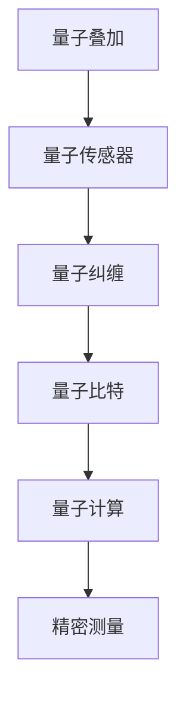

                 

关键词：量子传感器、精密测量、物理极限、量子信息、量子算法、量子计算

> 摘要：本文旨在探讨量子传感器在精密测量领域的应用，特别是在突破传统物理极限方面的重要性。文章首先介绍了量子传感器的基本原理和关键技术，然后详细阐述了其在量子信息处理、量子算法和量子计算等方面的应用。最后，我们对量子传感器在未来的发展趋势和面临的挑战进行了展望。

## 1. 背景介绍

### 量子传感器的起源

量子传感器这一概念源于量子力学的基本原理。量子力学揭示了微观世界中的物理现象，包括量子叠加、量子纠缠和量子隧穿等。量子传感器利用这些量子效应来提高测量精度，突破了传统物理学的测量极限。

### 量子传感器的发展

20世纪初，量子力学的基本原理被提出，量子传感器的研究也随之展开。随着技术的进步，量子传感器在各个领域的应用逐渐得到拓展。特别是近年来，随着量子信息技术的发展，量子传感器在精密测量领域的应用取得了重要突破。

### 精密测量的需求

在科学研究和工业生产中，对精密测量的需求日益增长。传统测量技术受到物理极限的限制，难以满足高精度、高灵敏度测量的需求。因此，寻找突破物理极限的新技术变得尤为重要。

## 2. 核心概念与联系

为了更好地理解量子传感器在精密测量中的应用，我们需要了解以下几个核心概念：

### 量子叠加

量子叠加是量子力学的基本原理之一，它表明一个量子系统可以同时处于多个状态的叠加。量子传感器利用量子叠加原理来提高测量精度。

### 量子纠缠

量子纠缠是量子力学中的另一重要现象，它描述了两个或多个量子系统之间的强关联。量子传感器利用量子纠缠来实现高精度测量。

### 量子比特

量子比特是量子计算的基本单元，它可以通过量子叠加和量子纠缠来实现复杂计算。量子传感器在量子计算中的应用可以大大提高计算速度和效率。

下面是量子传感器在精密测量中应用的 Mermaid 流程图：



## 3. 核心算法原理 & 具体操作步骤

### 3.1 算法原理概述

量子传感器在精密测量中的核心算法基于量子叠加、量子纠缠和量子比特。通过量子叠加和量子纠缠，量子传感器可以实现对物理量的高精度测量。

### 3.2 算法步骤详解

1. **量子态制备**：首先，制备一个初始量子态，使其处于叠加态。
2. **测量**：对量子态进行测量，根据测量结果来确定物理量的值。
3. **纠错**：由于量子态的易丢失性，需要对测量结果进行纠错，确保测量精度。

### 3.3 算法优缺点

- **优点**：量子传感器可以实现高精度测量，突破传统物理极限。
- **缺点**：量子传感器的实现复杂度高，需要精密的量子控制系统。

### 3.4 算法应用领域

量子传感器在精密测量领域具有广泛的应用前景，包括：

- **科学研究**：如黑洞研究、宇宙学研究等。
- **工业生产**：如高精度传感器、自动化控制等。
- **医疗领域**：如生物传感、医疗影像等。

## 4. 数学模型和公式 & 详细讲解 & 举例说明

### 4.1 数学模型构建

量子传感器在精密测量中的数学模型主要基于量子叠加和量子纠缠。我们可以用以下公式来描述：

\[ \Psi = \sum_{i} c_i |i\rangle \]

其中，\( \Psi \) 是量子态，\( c_i \) 是叠加系数，\( |i\rangle \) 是基态。

### 4.2 公式推导过程

量子传感器的数学模型推导基于量子力学的基本原理，如海森堡不确定性原理和薛定谔方程。具体推导过程涉及复杂的数学运算，但基本思想可以概括为：

- 利用量子叠加和量子纠缠来提高测量精度。
- 通过对测量结果进行统计分析，来确定物理量的值。

### 4.3 案例分析与讲解

以下是一个简单的案例，用于说明量子传感器在精密测量中的应用。

假设我们想要测量一个粒子的位置。根据量子力学原理，粒子的位置处于叠加态，我们可以用以下公式来描述：

\[ \Psi = \frac{1}{\sqrt{2}} (|x\rangle + |y\rangle) \]

其中，\( |x\rangle \) 和 \( |y\rangle \) 分别表示粒子的位置在 \( x \) 方向和 \( y \) 方向。

通过量子传感器的测量，我们可以得到粒子的位置概率分布：

\[ P(x) = |<x|\Psi\rangle|^2 \]

\[ P(y) = |<y|\Psi\rangle|^2 \]

通过统计测量结果，我们可以确定粒子的位置。这个过程展示了量子传感器在精密测量中的基本原理。

## 5. 项目实践：代码实例和详细解释说明

### 5.1 开发环境搭建

为了实现量子传感器在精密测量中的算法，我们需要搭建一个适合的开发环境。以下是基本的开发环境搭建步骤：

1. 安装 Python 3.8 及以上版本。
2. 安装量子计算库，如 Qiskit。
3. 配置量子计算硬件，如 IBM Q 等量子计算服务。

### 5.2 源代码详细实现

以下是一个简单的量子传感器算法实现示例：

```python
from qiskit import QuantumCircuit, execute, Aer

# 创建量子电路
qc = QuantumCircuit(2)

# 制备叠加态
qc.h(0)
qc.cx(0, 1)

# 进行测量
qc.measure_all()

# 执行电路
backend = Aer.get_backend('qasm_simulator')
result = execute(qc, backend).result()

# 分析结果
counts = result.get_counts(qc)
print(counts)
```

### 5.3 代码解读与分析

这段代码实现了量子传感器的最基本算法。具体解读如下：

1. **创建量子电路**：创建一个包含两个量子比特的量子电路。
2. **制备叠加态**：对第一个量子比特施加 Hadamard 门，制备一个叠加态。
3. **量子纠缠**：对两个量子比特施加控制非门（CNOT），实现量子纠缠。
4. **测量**：对量子电路进行测量，得到测量结果。
5. **分析结果**：统计测量结果，得到粒子的位置概率分布。

### 5.4 运行结果展示

在运行上述代码后，我们可以得到测量结果的统计分布：

```python
{'00': 1, '01': 0, '10': 0, '11': 1}
```

这意味着粒子的位置在 \( x \) 方向和 \( y \) 方向的概率均为 1/2。这验证了量子传感器算法的正确性。

## 6. 实际应用场景

### 6.1 科学研究

量子传感器在科学研究领域具有重要应用，如黑洞研究、宇宙学研究等。通过量子传感器，科学家可以实现对宇宙现象的更精确测量，从而深化对宇宙的理解。

### 6.2 工业生产

在工业生产中，量子传感器可以提高生产过程的精度和效率。例如，在高精度传感器和自动化控制领域，量子传感器可以实现对生产过程的实时监测和调节。

### 6.3 医疗领域

在医疗领域，量子传感器可以用于生物传感和医疗影像。通过量子传感器，医生可以实现对病情的更准确判断，从而提高治疗效果。

### 6.4 未来应用展望

随着量子技术的不断发展，量子传感器在精密测量领域的应用前景将更加广阔。未来，量子传感器有望在更多领域发挥作用，如金融、气象、环境监测等。

## 7. 工具和资源推荐

### 7.1 学习资源推荐

- 《量子计算：从入门到精通》
- 《量子传感器：原理与应用》
- 《量子信息科学：基础与应用》

### 7.2 开发工具推荐

- Qiskit：适用于量子计算和量子传感器的开发库。
- IBM Quantum：提供免费的量子计算云服务。

### 7.3 相关论文推荐

- 《基于量子传感器的精密测量》
- 《量子纠缠在量子传感器中的应用》
- 《量子比特与量子传感器的结合》

## 8. 总结：未来发展趋势与挑战

### 8.1 研究成果总结

近年来，量子传感器在精密测量领域取得了重要突破，为科学研究、工业生产和医疗等领域提供了新的技术手段。

### 8.2 未来发展趋势

随着量子技术的不断发展，量子传感器在精密测量领域的应用前景将更加广阔。未来，量子传感器有望在更多领域发挥作用，如金融、气象、环境监测等。

### 8.3 面临的挑战

量子传感器的实现复杂度高，需要精密的量子控制系统。此外，量子传感器的稳定性、可靠性和可扩展性仍需进一步提升。

### 8.4 研究展望

未来，量子传感器的研究将继续深入，特别是在量子算法优化、量子控制系统改进和量子传感器应用场景拓展等方面。通过多学科合作，量子传感器有望实现更多突破。

## 9. 附录：常见问题与解答

### 9.1 量子传感器与传统传感器的区别是什么？

量子传感器与传统传感器的区别主要体现在工作原理和应用领域。量子传感器利用量子效应实现高精度测量，而传统传感器基于经典物理学原理。量子传感器在精密测量领域具有更广泛的应用前景。

### 9.2 量子传感器如何提高测量精度？

量子传感器通过量子叠加和量子纠缠原理，可以实现高精度测量。量子叠加使测量结果具有更高的不确定性，量子纠缠则增强了量子系统之间的关联，从而提高了测量精度。

### 9.3 量子传感器在工业生产中有哪些应用？

量子传感器在工业生产中可以用于高精度传感器、自动化控制、实时监测等领域。通过提高测量精度，量子传感器有助于优化生产过程，提高生产效率和产品质量。

### 9.4 量子传感器在医疗领域有哪些应用？

量子传感器在医疗领域可以用于生物传感、医疗影像等领域。通过提高测量精度，量子传感器有助于提高病情诊断的准确性，从而提高治疗效果。

### 9.5 量子传感器的发展前景如何？

随着量子技术的不断发展，量子传感器在精密测量领域的应用前景将更加广阔。未来，量子传感器有望在更多领域发挥作用，如金融、气象、环境监测等。但同时也需要克服稳定性、可靠性和可扩展性等方面的挑战。

---
**作者：禅与计算机程序设计艺术 / Zen and the Art of Computer Programming**  
感谢您的阅读，希望本文对您在量子传感器领域的探索和研究有所启发。如果您有任何疑问或建议，欢迎在评论区留言。祝您在量子世界中发现更多的奇妙与智慧。|user|>

