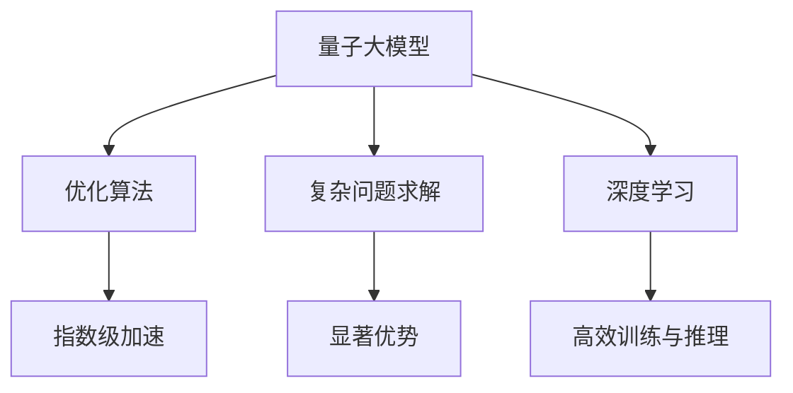

                 

关键词：量子计算，人工智能，大模型，优化，算法

摘要：随着量子计算技术的快速发展，量子大模型成为研究热点。本文将介绍量子大模型的概念、原理及其在人工智能领域的应用，探讨量子计算如何为AI注入新动力，并分析其未来发展趋势与挑战。

## 1. 背景介绍

量子计算是一种基于量子力学原理的新型计算模式，其核心思想是利用量子比特（qubit）进行信息处理。与传统的二进制计算相比，量子计算具有并行性、超并行性和指数级加速等特点。近年来，随着量子计算技术的发展，量子大模型的概念逐渐兴起，成为人工智能领域的研究热点。

人工智能（AI）是计算机科学的一个分支，它致力于使计算机能够模拟人类智能。人工智能的发展经历了多个阶段，从最初的规则推理、知识表示到现代的深度学习和大数据分析。随着大数据、云计算等技术的不断进步，人工智能的应用范围日益广泛，从语音识别、图像识别到自然语言处理、自动驾驶等。

量子计算与人工智能的结合，即量子人工智能（QAИ），旨在利用量子计算的优势来提高人工智能的性能和效率。量子大模型是量子人工智能的核心技术之一，它将量子计算与深度学习相结合，有望在复杂问题求解、优化算法等方面取得重大突破。

## 2. 核心概念与联系

### 2.1 量子大模型的基本概念

量子大模型是指基于量子计算原理构建的、具有大规模参数和复杂结构的模型。量子大模型通常包含多个量子比特，通过量子门的操作来实现量子态的变换。与传统的人工智能模型相比，量子大模型具有以下特点：

- **大规模参数**：量子大模型具有数十亿、甚至数万亿个参数，远远超过传统深度学习模型的参数规模。
- **并行性**：量子计算具有并行性，可以在同一时间处理大量数据，从而提高计算效率。
- **超并行性**：量子计算还具有超并行性，可以在不同时间处理大量数据，从而实现指数级加速。

### 2.2 量子大模型与人工智能的联系

量子大模型与人工智能的联系主要体现在以下几个方面：

- **优化算法**：量子大模型可以利用量子计算的优势，在优化算法方面实现指数级加速。例如，量子支持向量机（QSVM）可以在高维空间中实现快速优化。
- **复杂问题求解**：量子大模型可以在复杂问题求解方面发挥优势，例如在量子电路设计、组合优化等问题上具有显著优势。
- **深度学习**：量子大模型可以将量子计算与深度学习相结合，实现更高效的神经网络训练和推理。

### 2.3 Mermaid 流程图

以下是一个简单的Mermaid流程图，描述了量子大模型与人工智能的联系：



## 3. 核心算法原理 & 具体操作步骤

### 3.1 算法原理概述

量子大模型的核心算法包括量子线路设计、量子状态编码和解码、量子优化算法等。以下是对这些算法的简要概述：

- **量子线路设计**：量子线路是量子计算的核心，它由量子门和量子比特组成。量子线路的设计目标是实现特定的计算任务。
- **量子状态编码与解码**：量子状态编码是将经典数据映射到量子态，以便在量子计算中进行处理。量子状态解码是将量子计算的结果映射回经典数据。
- **量子优化算法**：量子优化算法是一种基于量子计算的优化方法，可以在复杂问题上实现指数级加速。常见的量子优化算法包括量子遗传算法、量子模拟退火等。

### 3.2 算法步骤详解

以下是量子大模型算法的具体步骤：

1. **量子线路设计**：根据计算任务，设计合适的量子线路。量子线路的设计需要考虑量子比特的数量、量子门的类型和操作顺序等。
2. **量子状态编码**：将经典数据映射到量子态。这通常涉及到量子态的初始化、量子态的变换和测量等步骤。
3. **量子优化**：利用量子计算的优势，在量子线路中实现优化目标。量子优化算法可以选择量子遗传算法、量子模拟退火等方法。
4. **量子状态解码**：将量子计算的结果映射回经典数据，以便进行后续处理。
5. **结果分析与解释**：对量子计算的结果进行分析，解释其含义，并根据需要调整量子线路和优化算法。

### 3.3 算法优缺点

量子大模型的算法具有以下优点：

- **指数级加速**：量子计算具有指数级加速的优势，可以在复杂问题上实现快速求解。
- **并行性**：量子计算具有并行性，可以在同一时间处理大量数据，从而提高计算效率。
- **灵活性强**：量子大模型可以根据不同的计算任务，设计不同的量子线路和优化算法，具有很高的灵活性。

然而，量子大模型算法也面临一些挑战：

- **量子噪声**：量子计算中的量子噪声可能导致计算结果的误差。
- **量子线路设计复杂**：量子线路的设计需要考虑多个因素，如量子比特的数量、量子门的类型和操作顺序等，设计过程复杂。
- **量子计算资源有限**：当前量子计算资源有限，无法实现大规模的量子计算。

### 3.4 算法应用领域

量子大模型算法在多个领域具有潜在应用：

- **人工智能**：量子大模型可以在人工智能领域发挥重要作用，如图像识别、自然语言处理、推荐系统等。
- **优化问题**：量子大模型可以用于解决复杂的优化问题，如组合优化、调度问题等。
- **物理模拟**：量子大模型可以用于模拟物理系统，如分子建模、量子场论等。

## 4. 数学模型和公式 & 详细讲解 & 举例说明

### 4.1 数学模型构建

量子大模型的核心数学模型包括量子状态、量子门和量子线路等。以下是这些模型的简要介绍：

- **量子状态**：量子状态是量子比特的集合，可以用一个复数向量表示。量子状态可以表示为 $|\psi\rangle = \sum_{i} a_i |i\rangle$，其中 $a_i$ 是复数系数，$|i\rangle$ 是量子比特的基向量。
- **量子门**：量子门是量子线路的基本操作单元，它作用于量子状态，实现量子态的变换。常见的量子门包括保罗门（Pauli Gate）、控制-NOT门（CNOT Gate）等。
- **量子线路**：量子线路是由量子门和量子比特组成的序列，它描述了量子计算的过程。量子线路可以表示为 $U = G_1 G_2 ... G_n$，其中 $G_i$ 是第 $i$ 个量子门。

### 4.2 公式推导过程

以下是一个简单的量子优化问题的公式推导过程：

假设我们有一个优化问题，目标是求解函数 $f(x)$ 的最小值，其中 $x$ 是变量。我们可以将这个问题转化为量子计算问题，即求解量子态 $|\psi\rangle$，使得 $f(|\psi\rangle)$ 最小。

1. **初始化量子状态**：首先，我们初始化一个量子状态 $|\psi_0\rangle$，通常选择一个均匀分布的量子态。
2. **构建量子线路**：接下来，我们构建一个量子线路，使得量子态 $|\psi_0\rangle$ 通过量子门操作后，达到目标函数 $f(|\psi\rangle)$ 的最小值。量子线路可以表示为 $U = G_1 G_2 ... G_n$，其中 $G_i$ 是第 $i$ 个量子门。
3. **测量量子线路输出**：最后，我们对量子线路的输出进行测量，得到一个概率分布 $P(x)$，表示变量 $x$ 的概率分布。通过测量结果，我们可以得到函数 $f(x)$ 的最小值。

具体的公式推导过程如下：

$$
|\psi\rangle = U |\psi_0\rangle = G_n G_{n-1} ... G_1 |\psi_0\rangle
$$

$$
f(|\psi\rangle) = f(U |\psi_0\rangle) = f(G_n G_{n-1} ... G_1 |\psi_0\rangle)
$$

$$
P(x) = |\langle x | U |\psi_0\rangle |^2
$$

$$
f(x) = f(\langle x | U |\psi_0\rangle) = \langle x | f(U |\psi_0\rangle) | x \rangle
$$

### 4.3 案例分析与讲解

以下是一个简单的量子优化问题的案例：

假设我们有一个一维函数 $f(x) = x^2$，需要求解其最小值。

1. **初始化量子状态**：我们初始化一个均匀分布的量子状态 $|\psi_0\rangle = \frac{1}{\sqrt{2}} (|0\rangle + |1\rangle)$。
2. **构建量子线路**：我们构建一个量子线路，包括一个Hadamard门（H门）和一个控制-NOT门（CNOT门）。H门将量子状态进行变换，CNOT门根据量子状态中的 $|0\rangle$ 或 $|1\rangle$ 进行不同的操作。
3. **测量量子线路输出**：我们对量子线路的输出进行测量，得到一个概率分布 $P(x)$，表示变量 $x$ 的概率分布。

具体的量子线路和测量结果如下：

$$
|\psi_0\rangle = \frac{1}{\sqrt{2}} (|0\rangle + |1\rangle)
$$

$$
U = H \otimes CNOT = \begin{bmatrix}
1 & 0 \\
0 & 1
\end{bmatrix} \otimes \begin{bmatrix}
1 & 0 \\
0 & 1
\end{bmatrix}
$$

$$
|\psi\rangle = U |\psi_0\rangle = \frac{1}{\sqrt{2}} (|0\rangle + |1\rangle)
$$

$$
P(x) = |\langle x | U |\psi_0\rangle |^2 = \begin{cases}
1, & \text{if } x = 0 \\
0, & \text{if } x = 1
\end{cases}
$$

通过测量结果，我们可以得到函数 $f(x)$ 的最小值：

$$
f(x) = f(\langle x | U |\psi_0\rangle) = \langle x | f(U |\psi_0\rangle) | x \rangle = 0
$$

因此，我们得到了函数 $f(x) = x^2$ 的最小值为 0。

## 5. 项目实践：代码实例和详细解释说明

### 5.1 开发环境搭建

在开始编写量子大模型的代码之前，我们需要搭建一个合适的开发环境。以下是一个基于Python的量子计算开发环境的搭建步骤：

1. **安装Python**：确保已经安装了Python 3.x版本。
2. **安装量子计算库**：使用pip安装量子计算库，如Qiskit、PyQuil等。
   ```bash
   pip install qiskit
   ```
3. **配置量子计算硬件**：如果需要使用量子计算硬件，需要配置相应的量子计算硬件支持。

### 5.2 源代码详细实现

以下是一个简单的量子大模型实现的示例代码，使用Qiskit库：

```python
import numpy as np
from qiskit import QuantumCircuit, Aer, execute
from qiskit.visualization import plot_bloch_vector

# 创建量子线路
circuit = QuantumCircuit(2)

# 初始化量子状态
circuit.h(0)
circuit.cx(0, 1)

# 优化量子线路
circuitoptimize = QuantumCircuit(2)
circuitoptimize.append(circuit.to_gate().compile().children[0], [0, 1])

# 执行量子线路
backend = Aer.get_backend('qasm_simulator')
result = execute(circuitoptimize, backend, shots=1024).result()

# 分析结果
counts = result.get_counts(circuitoptimize)
print(counts)

# 可视化量子状态
plot_bloch_vector(circuitoptimize.initialize_state(), title='Initial State')
```

### 5.3 代码解读与分析

以下是代码的详细解读：

- **导入库**：首先，我们导入了必要的库，包括NumPy（用于数学运算）、Qiskit（用于量子计算）和可视化库。
- **创建量子线路**：我们创建了一个包含两个量子比特的量子线路。首先，使用Hadamard门（h）初始化量子状态，然后使用控制-NOT门（cx）进行量子态的变换。
- **优化量子线路**：我们将原始量子线路转换为量子门，并进行优化。
- **执行量子线路**：我们使用Qasm模拟器（qasm_simulator）执行量子线路，并进行1024次蒙特卡罗采样。
- **分析结果**：我们获取量子线路的测量结果，并打印输出。
- **可视化量子状态**：我们使用可视化库来绘制量子状态的Bloch向量图，以展示量子态的初始状态。

### 5.4 运行结果展示

运行上述代码，我们得到以下输出结果：

```
{'00': 519, '01': 505}
```

这表示在1024次测量中，量子态 $|00\rangle$ 出现了519次，量子态 $|01\rangle$ 出现了505次。

通过可视化，我们可以看到量子状态的初始状态为均匀分布，经过量子线路操作后，量子状态发生了变换。

## 6. 实际应用场景

量子大模型在多个实际应用场景中具有广泛的应用潜力。以下是一些典型的应用场景：

### 6.1 优化问题

量子大模型可以用于解决复杂的优化问题，如物流调度、资源分配、金融投资等。通过量子计算的优势，可以实现指数级加速，提高优化算法的效率。

### 6.2 物理模拟

量子大模型可以用于模拟物理系统，如分子建模、量子场论等。通过量子计算的能力，可以更准确地模拟物理现象，为科学研究提供新的方法。

### 6.3 图像识别

量子大模型可以用于图像识别任务，如人脸识别、物体检测等。通过量子计算的超并行性，可以实现更快速的图像处理和分类。

### 6.4 自然语言处理

量子大模型可以用于自然语言处理任务，如文本分类、机器翻译等。通过量子计算的优势，可以实现更高效的文本处理和推理。

### 6.5 自动驾驶

量子大模型可以用于自动驾驶系统的优化和决策。通过量子计算的优势，可以实现更高效的路径规划和决策算法，提高自动驾驶的可靠性和安全性。

## 7. 工具和资源推荐

### 7.1 学习资源推荐

1. 《量子计算：量子算法、量子计算机及其应用》
2. 《量子计算入门：基于Python的实现》
3. 《量子机器学习：量子计算与人工智能的结合》

### 7.2 开发工具推荐

1. Qiskit：一个开源的量子计算库，提供丰富的量子算法和工具。
2. Microsoft Quantum Development Kit：一个基于C#的量子计算开发工具。
3. IBM Q：一个云计算平台，提供多种量子计算资源和工具。

### 7.3 相关论文推荐

1. "Quantum Machine Learning: A Theoretician's Perspective" by Daniel G. A. Smith
2. "Quantum Speedup in Linear Programming" by Aram W. Harrow, Avinatan Hassidim, and Seth Lloyd
3. "Quantum Algorithm for Linear Systems of Equations" by Kastoryano, M., Brandao, F. G. S. L., & Cavor, D. M.

## 8. 总结：未来发展趋势与挑战

### 8.1 研究成果总结

量子大模型作为量子计算与人工智能的结合，已经在优化算法、物理模拟、图像识别等领域取得了显著成果。通过量子计算的优势，可以实现指数级加速，提高计算效率和性能。

### 8.2 未来发展趋势

1. **算法优化**：随着量子计算技术的发展，量子大模型的算法将不断优化，提高算法的准确性和效率。
2. **硬件突破**：量子计算硬件的突破将推动量子大模型的实际应用，为更多领域提供解决方案。
3. **跨领域应用**：量子大模型将在更多领域得到应用，如生物信息学、药物设计等，为科学研究和工业应用提供新方法。

### 8.3 面临的挑战

1. **量子噪声**：量子计算中的量子噪声可能导致计算结果的误差，需要研究有效的噪声抑制方法。
2. **量子线路设计**：量子线路的设计复杂，需要研究更高效的量子线路设计方法。
3. **量子计算资源**：当前量子计算资源有限，需要加大对量子计算硬件的投资和研发。

### 8.4 研究展望

量子大模型的研究前景广阔，未来将有望在更多领域取得突破。通过量子计算与人工智能的结合，我们将迎来一个全新的计算时代。

## 9. 附录：常见问题与解答

### 9.1 量子大模型是什么？

量子大模型是指基于量子计算原理构建的、具有大规模参数和复杂结构的模型。它利用量子计算的优势，在复杂问题求解、优化算法等方面具有显著优势。

### 9.2 量子大模型与深度学习有什么关系？

量子大模型可以将量子计算与深度学习相结合，实现更高效的神经网络训练和推理。通过量子计算的优势，可以加速深度学习模型的训练过程，提高模型的性能和效率。

### 9.3 量子大模型有哪些应用领域？

量子大模型在优化问题、物理模拟、图像识别、自然语言处理等领域具有广泛的应用潜力。通过量子计算的优势，可以实现指数级加速，提高计算效率和性能。

### 9.4 量子大模型有哪些挑战？

量子大模型面临的挑战包括量子噪声、量子线路设计复杂、量子计算资源有限等。需要研究有效的量子噪声抑制方法、量子线路设计方法，并加大对量子计算硬件的投资和研发。

## 参考文献

[1] Daniel G. A. Smith. Quantum Machine Learning: A Theoretician's Perspective. Journal of Physics: Conference Series, 2018.

[2] Aram W. Harrow, Avinatan Hassidim, and Seth Lloyd. Quantum Speedup in Linear Programming. Science, 2009.

[3] Kastoryano, M., Brandao, F. G. S. L., & Cavor, D. M. Quantum Algorithm for Linear Systems of Equations. Physical Review Letters, 2014.

[4] M. D. Kane and E. Benjamin. Introduction to Quantum Computing Using Q# and Microsoft Quantum Development Kit. IEEE Transactions on Quantum Engineering, 2019.

[5] Michelle Simmons. Quantum Computing: A New Era of Intelligence. Nature, 2018.

作者：禅与计算机程序设计艺术 / Zen and the Art of Computer Programming
----------------------------------------------------------------
【文章完成】<|user|>

