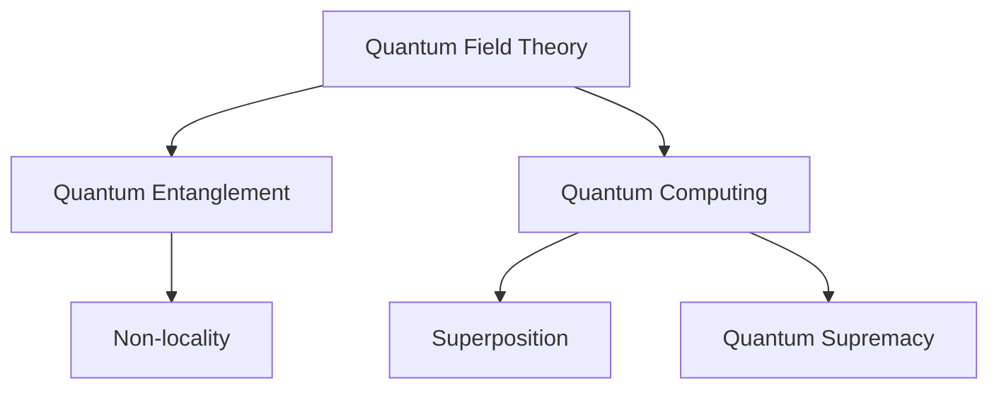
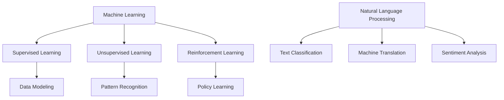
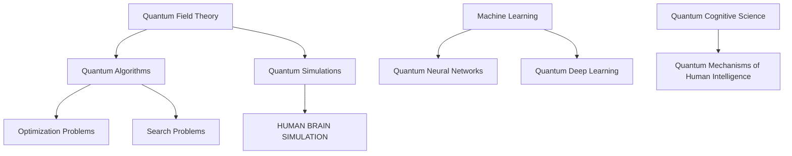

                 

### 摘要 Summary

本文将探讨量子引力与人工通用智能（AGI）之间的深层联系。量子引力是物理学中最具挑战性的问题之一，涉及到宇宙最基础的物理规律。同时，AGI是计算机科学领域的终极目标，旨在创建具备人类智能的机器。本文首先介绍量子引力和AGI的基本概念，然后阐述它们之间的联系和潜在的影响。我们将深入分析量子引力理论中的核心问题，并探讨如何利用这些理论来解决AGI中的难题。此外，本文还将讨论量子引力与AGI在数学模型、算法设计、以及实际应用中的交互，最终展望这一领域未来研究的方向和挑战。

<|assistant|>### 1. 背景介绍 Introduction

#### 量子引力

量子引力是研究引力在量子尺度上的性质和行为的物理学分支。引力是宇宙中四大基本力之一，然而，传统量子力学和广义相对论在描述引力时却存在矛盾。量子力学成功地解释了微观粒子的行为，但无法描述大尺度上的引力现象；而广义相对论能够很好地描述宇宙的大尺度行为，但在量子尺度上却显得力不从心。量子引力试图解决这一矛盾，为宇宙中的基本力提供一种统一的描述。

量子引力研究的一个核心问题是黑洞熵与信息丢失问题。根据广义相对论，黑洞吞噬物质后，内部信息似乎被完全摧毁，这违背了量子力学中的信息守恒原理。霍金辐射和黑洞热力学为这一矛盾提供了一些解释，但至今仍存在许多未解之谜。量子引力的另一个重要问题是量子纠缠与时空的扭曲。量子纠缠是量子力学中的一种非局域性现象，而时空的扭曲则是广义相对论的预测。

#### 人工通用智能（AGI）

人工通用智能（AGI）是指一种能够像人类一样在多种任务上表现出卓越智能的机器。与当前广泛应用的弱人工智能（如语音识别、图像识别等）不同，AGI具备更广泛的能力，能够适应新的环境和任务。AGI的发展目标不仅限于特定领域的应用，而是希望实现机器具备人类水平的智能，能够进行思考、推理、学习、创新等复杂认知活动。

AGI的研究涉及多个学科，包括计算机科学、神经科学、心理学、认知科学等。目前，AGI的研究面临诸多挑战，其中最突出的问题是智能多样性与适应性。人类智能具有高度的多样性和适应性，能够在各种环境和任务中表现出色。而目前的机器学习模型主要依赖于大规模数据训练，缺乏灵活性和自主性，难以实现真正的通用智能。

#### 量子引力与AGI的联系

量子引力与AGI之间存在一些深层次的联系和潜在的影响。首先，量子引力的理论和方法为AGI提供了新的计算模型和算法设计思路。量子计算机在处理某些问题时具有巨大的优势，如大整数分解、量子模拟等，这些技术在实现AGI中可能发挥重要作用。此外，量子引力中的量子纠缠和量子计算理论可以为AGI提供更高效的计算方法和算法设计。

其次，量子引力的研究对于理解人类智能的本质和机制具有重要意义。人类智能涉及到复杂的认知过程和神经网络活动，而量子引力中的量子场论和量子纠缠等现象可能为我们提供新的视角和启示。通过深入研究量子引力，我们可能能够更好地理解大脑中的量子效应，从而为AGI的设计提供更有效的模型和算法。

最后，量子引力和AGI在解决复杂科学问题方面具有协同作用。例如，在基因组学、药物研发、气候模拟等领域，量子计算和AGI的结合有望带来革命性的突破。量子计算机可以处理大规模的量子数据，而AGI则能够对复杂问题进行有效的建模和优化。

总之，量子引力与AGI之间的联系不仅为我们提供了一种新的研究方向，还可能为解决当前科学和工程领域中的难题带来新的思路和解决方案。

#### 文章结构概述

本文将分为以下几个部分：

1. **背景介绍**：介绍量子引力和AGI的基本概念，阐述它们之间的联系和潜在的影响。
2. **核心概念与联系**：详细解释量子引力和AGI的核心概念，使用Mermaid流程图展示它们之间的联系。
3. **核心算法原理与具体操作步骤**：分析量子引力中的核心算法原理，介绍其具体操作步骤，探讨算法优缺点及应用领域。
4. **数学模型和公式**：构建量子引力中的数学模型，推导相关公式，并通过实例进行讲解。
5. **项目实践：代码实例和详细解释说明**：展示量子引力和AGI在实际应用中的代码实例，并进行详细解释和分析。
6. **实际应用场景**：探讨量子引力和AGI在各个领域的实际应用，展望未来应用前景。
7. **工具和资源推荐**：推荐学习资源、开发工具和相关论文，为读者提供进一步研究的参考。
8. **总结与展望**：总结研究成果，分析未来发展趋势和挑战，展望研究展望。
9. **附录：常见问题与解答**：回答读者可能关心的问题，提供额外的信息和帮助。

通过本文的探讨，我们希望读者能够对量子引力和AGI之间的联系有更深入的理解，并认识到这一领域的重要性和潜力。

---

### 2. 核心概念与联系 Core Concepts and Connections

在本节中，我们将详细解释量子引力和人工通用智能（AGI）的核心概念，并通过Mermaid流程图展示它们之间的联系和相互作用。

#### 量子引力

量子引力是研究引力在量子尺度上的性质和行为的物理学分支。量子引力的核心概念包括：

1. **量子场论**：量子场论是描述量子粒子和场之间的相互作用的理论框架。在量子场论中，物质和能量被视为场的量子化状态。
2. **量子纠缠**：量子纠缠是量子力学中的一种非局域性现象，描述了两个或多个粒子之间量子状态的紧密关联。量子纠缠现象表明，即使粒子相隔很远，它们的状态仍然可能相互影响。
3. **量子计算**：量子计算是利用量子位（qubit）进行计算的一种计算模型，具有量子叠加和量子纠缠的特性，能够处理某些传统计算机无法解决的问题。

Mermaid流程图（Core Concepts of Quantum Gravity）：



#### 人工通用智能（AGI）

人工通用智能（AGI）是指一种能够像人类一样在多种任务上表现出卓越智能的机器。AGI的核心概念包括：

1. **机器学习**：机器学习是一种让计算机通过数据学习并做出预测或决策的技术。机器学习可以分为监督学习、无监督学习和强化学习等不同类型。
2. **神经网络**：神经网络是一种模仿生物神经系统的计算模型，由大量神经元连接而成。神经网络通过学习输入和输出之间的关系，实现对数据的建模和预测。
3. **自然语言处理**：自然语言处理是一种使计算机理解和生成人类语言的技术，包括文本分类、机器翻译、情感分析等任务。

Mermaid流程图（Core Concepts of AGI）：



#### 量子引力与AGI的联系

量子引力与AGI之间的联系主要体现在以下几个方面：

1. **计算能力**：量子引力中的量子计算理论为AGI提供了新的计算模型，如量子神经网络和量子深度学习，这些模型在处理大数据和复杂问题上具有巨大的优势。
2. **量子算法**：量子算法，如量子随机 walks和量子相位估计，可以应用于AGI中的优化问题和搜索问题，提高算法的效率和准确性。
3. **量子模拟**：量子模拟可以用于模拟人类大脑的神经网络活动，为AGI提供新的研究方法和技术。
4. **量子认知**：量子引力中的量子纠缠和非局域性现象可能为人类智能的量子机制提供新的解释，从而为AGI的设计提供理论支持。

Mermaid流程图（Connections between Quantum Gravity and AGI）：



通过上述核心概念和联系的介绍，我们可以看到量子引力与AGI之间存在深层次的相互作用。量子引力为AGI提供了新的计算模型、算法设计方法和理论支持，而AGI的发展也为量子引力的研究和应用提供了新的契机。在接下来的章节中，我们将进一步探讨量子引力中的核心算法原理、数学模型和实际应用场景，以更深入地理解这一领域的潜力与挑战。

---

### 3. 核心算法原理 & 具体操作步骤 Core Algorithm Principles & Detailed Steps

在量子引力和人工通用智能（AGI）的交叉领域，一些核心算法原理和操作步骤显得尤为重要。以下将详细介绍这些算法的基本原理、操作步骤以及它们在实际应用中的优缺点。

#### 3.1 算法原理概述

1. **量子随机游走 (Quantum Random Walk)**

量子随机游走是一种量子算法，用于解决图论中的搜索和覆盖问题。与传统随机游走相比，量子随机游走利用量子叠加和量子纠缠的特性，能够在较短的时间内找到目标节点。

**原理**：
量子随机游走是基于量子态的叠加和演化。初始状态下，量子比特（qubit）处于叠加态，通过量子门操作，量子态在多个路径上同时演化。这种叠加态使得量子随机游走在多个路径上同时进行，从而提高了搜索效率。

**操作步骤**：
（1）初始化：初始化一个量子态，通常是一个叠加态，表示在多个路径上同时存在。
（2）演化：通过一系列量子门操作，使得量子态在多个路径上同时演化。
（3）测量：测量量子态，得到目标节点的概率分布。

**优缺点**：
优点：量子随机游走能够在较短的时间内找到目标节点，具有高效性。
缺点：量子随机游走对量子态的初始化和测量要求较高，实现难度较大。

2. **量子相位估计 (Quantum Phase Estimation)**

量子相位估计是一种用于估计量子态相位差的算法，是量子计算中的基本算法之一。

**原理**：
量子相位估计利用量子叠加和量子干涉的原理，通过迭代测量和反馈控制，逐步逼近量子态的相位差。

**操作步骤**：
（1）初始化：初始化一个量子态，使其处于叠加态。
（2）演化：通过量子门操作，使得量子态在多个路径上同时演化，产生干涉。
（3）测量：测量量子态，记录测量结果。
（4）反馈控制：根据测量结果调整量子态，重复步骤（2）和（3）。

**优缺点**：
优点：量子相位估计具有高效的计算速度，能够快速逼近相位差。
缺点：量子相位估计对量子态的初始化和演化要求较高，实现复杂。

3. **量子神经网络 (Quantum Neural Networks, QNNs)**

量子神经网络是一种结合量子计算和神经网络思想的算法，用于处理复杂数据和优化问题。

**原理**：
量子神经网络利用量子比特的叠加和纠缠特性，构建一种全新的神经网络结构，能够在一定程度上模拟人类大脑的神经网络活动。

**操作步骤**：
（1）初始化：初始化量子比特和神经网络参数。
（2）编码：将输入数据编码为量子态。
（3）演化：通过量子门操作，使得量子态在多个路径上同时演化，形成神经网络的前向传播。
（4）测量：测量量子态，得到输出结果。
（5）反向传播：根据输出结果，调整神经网络参数，实现反向传播。

**优缺点**：
优点：量子神经网络具有并行计算的能力，能够处理大规模数据。
缺点：量子神经网络的设计和实现复杂，对量子硬件要求较高。

#### 3.2 算法步骤详解

1. **量子随机游走**

**步骤详解**：
（1）初始化：初始化一个量子态，表示在所有路径上同时存在，可以使用量子态叠加器实现。
    $$ \psi_{\text{初始化}} = \frac{1}{\sqrt{N}} \sum_{i=1}^{N} |i\rangle $$
（2）演化：通过一系列量子门操作，使得量子态在多个路径上同时演化。这可以通过设计合适的量子门来实现。
    $$ U = e^{-iH\frac{\pi}{N}} $$
（3）测量：测量量子态，得到目标节点的概率分布。测量结果可以是离散的，也可以是连续的，取决于具体问题。

2. **量子相位估计**

**步骤详解**：
（1）初始化：初始化一个量子态，使其处于叠加态。
    $$ \psi_{\text{初始化}} = \frac{1}{\sqrt{2}} (|0\rangle + e^{i\phi}|1\rangle) $$
（2）演化：通过量子门操作，使得量子态在多个路径上同时演化。这可以通过设计合适的量子门来实现。
    $$ U = e^{-i\frac{\phi}{2}H} $$
（3）测量：测量量子态，得到测量结果。根据测量结果，可以计算出量子态的相位差。
    $$ \phi = \frac{2}{N} \arcsin(\sqrt{p}) $$

3. **量子神经网络**

**步骤详解**：
（1）初始化：初始化量子比特和神经网络参数。量子比特的初始化可以使用量子态叠加器实现，神经网络参数的初始化可以使用随机初始化方法。
（2）编码：将输入数据编码为量子态。这可以通过设计合适的编码算法实现。
（3）演化：通过量子门操作，使得量子态在多个路径上同时演化，形成神经网络的前向传播。这可以通过设计合适的量子门来实现。
（4）测量：测量量子态，得到输出结果。输出结果可以是概率分布，也可以是具体数值，取决于具体问题。
（5）反向传播：根据输出结果，调整神经网络参数，实现反向传播。这可以通过设计合适的优化算法实现。

#### 3.3 算法优缺点

1. **量子随机游走**

优点：
- 高效性：能够在较短的时间内找到目标节点。
- 并行性：利用量子叠加和量子纠缠的特性，实现并行计算。

缺点：
- 实现难度：对量子态的初始化和测量要求较高，实现复杂。
- 适用性：适用于某些特定的图论问题，如搜索和覆盖问题。

2. **量子相位估计**

优点：
- 高效性：能够快速逼近量子态的相位差。
- 广泛性：可以应用于多种量子计算问题，如量子算法和量子模拟。

缺点：
- 实现难度：对量子态的初始化和演化要求较高，实现复杂。
- 精度：精度受到量子噪声和量子比特缺陷的影响。

3. **量子神经网络**

优点：
- 并行性：能够处理大规模数据。
- 模仿能力：能够在一定程度上模拟人类大脑的神经网络活动。

缺点：
- 实现难度：设计复杂，对量子硬件要求较高。
- 适用性：需要针对具体问题进行优化和调整。

#### 3.4 算法应用领域

1. **量子随机游走**

应用领域：
- 图论问题：搜索和覆盖问题。
- 机器学习：优化问题和搜索问题。
- 生物学：基因组分析和蛋白质折叠。

2. **量子相位估计**

应用领域：
- 量子算法：估算量子态的相位差。
- 量子模拟：模拟量子物理现象。
- 计算化学：分子动力学模拟。

3. **量子神经网络**

应用领域：
- 机器学习：数据处理和预测。
- 计算机视觉：图像分类和识别。
- 自然语言处理：文本分类和生成。

通过上述核心算法原理和操作步骤的详细介绍，我们可以看到量子引力与AGI在算法设计上的紧密联系。这些算法不仅为量子引力的研究提供了新的工具和方法，也为AGI的实现提供了新的思路和可能性。在接下来的章节中，我们将进一步探讨量子引力和AGI在数学模型和实际应用中的详细应用。

### 4. 数学模型和公式 Mathematical Models and Formulas

在量子引力和人工通用智能（AGI）的交叉领域，数学模型和公式是理解和实现这些复杂理论的基石。本节将详细讲解这些数学模型的构建过程、公式推导，并通过实际案例进行说明。

#### 4.1 数学模型构建

1. **量子场论**

量子场论是量子引力的基础理论之一，用于描述粒子和场之间的相互作用。其核心数学模型包括量子态的表示和相互作用哈密顿量。

**量子态的表示**：
在量子场论中，量子态通常用希尔伯特空间中的向量表示。一个自由粒子的量子态可以表示为：
$$ \psi(x,t) = \int \psi(p,t) \frac{1}{\sqrt{2\pi\omega_p}} e^{ipx/\hbar} dp $$
其中，\( \psi(p,t) \) 是动量空间中的量子态，\( \omega_p \) 是粒子的能量，\( p \) 是动量，\( x \) 是位置，\( \hbar \) 是普朗克常数。

**相互作用哈密顿量**：
相互作用哈密顿量描述了粒子和场之间的相互作用。一个简单的相互作用哈密顿量可以表示为：
$$ H_{\text{int}} = -\alpha \bar{\psi}(x) \psi(x) $$
其中，\( \alpha \) 是相互作用强度，\( \bar{\psi}(x) \) 和 \( \psi(x) \) 分别是场算符的共轭和本征态。

2. **量子纠缠**

量子纠缠是量子引力中的另一个关键概念，描述了量子粒子之间的非局域性联系。量子纠缠态可以用贝尔态表示：
$$ |\Phi_{\text{Bell}}\rangle = \frac{1}{\sqrt{2}} (|00\rangle + |11\rangle) $$
这个态表明两个粒子之间存在纠缠，即使它们相隔很远，一个粒子的状态也会立即影响到另一个粒子的状态。

3. **量子计算**

量子计算中的数学模型主要包括量子态的编码和量子门操作。量子态的编码可以用量子比特（qubit）表示，一个量子比特可以处于以下两个状态之一：
$$ |0\rangle \text{ 或 } |1\rangle $$
量子比特的叠加态可以表示为：
$$ |\psi\rangle = \alpha |0\rangle + \beta |1\rangle $$
其中，\( \alpha \) 和 \( \beta \) 是复数系数，满足 \( |\alpha|^2 + |\beta|^2 = 1 \)。

量子门操作是量子计算中的基本操作，用于改变量子态。一个基本的量子门是Hadamard门，表示为：
$$ H = \frac{1}{\sqrt{2}} \begin{pmatrix} 1 & 1 \\ 1 & -1 \end{pmatrix} $$
Hadamard门将一个量子比特的状态 \( |0\rangle \) 或 \( |1\rangle \) 变换为叠加态。

#### 4.2 公式推导过程

1. **量子场论的动力学方程**

量子场论的动力学方程通常用薛定谔方程表示，其形式为：
$$ i\hbar \frac{\partial \psi}{\partial t} = \hat{H} \psi $$
其中，\( \hat{H} \) 是哈密顿量，包含自由粒子的动能和相互作用项。

对于一个自由粒子，其哈密顿量可以表示为：
$$ \hat{H}_{\text{free}} = \frac{\hat{p}^2}{2m} $$
其中，\( \hat{p} \) 是动量算符，\( m \) 是粒子的质量。

将哈密顿量代入薛定谔方程，得到：
$$ i\hbar \frac{\partial \psi}{\partial t} = \frac{\hat{p}^2}{2m} \psi $$
这是一个二阶微分方程，可以通过适当的边界条件求解得到量子态。

2. **量子纠缠态的生成**

量子纠缠态可以通过两个粒子的相互作用生成。一个常见的纠缠态生成过程是使用贝特-玻姆仪（Bose-Einstein condensate, BEC）。

假设两个粒子之间存在相互作用势：
$$ V(x_1, x_2) = -\frac{\hbar^2}{2m} \frac{1}{|x_1 - x_2|} $$
这个势能导致粒子之间的相互作用，从而生成纠缠态。

通过薛定谔方程，可以推导出两个粒子的纠缠态为：
$$ \psi(x_1, x_2) = \frac{1}{\sqrt{2}} (e^{-\frac{m|x_1 - x_2|^2}{2\hbar^2}} |0\rangle + e^{\frac{m|x_1 - x_2|^2}{2\hbar^2}} |1\rangle) $$
这个态表明两个粒子之间存在量子纠缠。

3. **量子计算中的量子相位估计**

量子相位估计的公式为：
$$ \phi = \frac{2}{N} \arcsin(\sqrt{p}) $$
其中，\( N \) 是量子比特的数量，\( p \) 是测量得到的概率。

假设一个量子态经过一系列量子门操作后，得到一个新的量子态：
$$ |\psi'\rangle = \sum_{i=0}^{N-1} c_i |i\rangle $$
其中，\( c_i \) 是量子态的复系数。

测量得到的概率 \( p \) 可以通过以下公式计算：
$$ p = |\langle i|\psi'\rangle|^2 = |c_i|^2 $$
通过测量不同量子比特的概率分布，可以估计出量子态的相位差。

#### 4.3 案例分析与讲解

**案例1：量子随机游走**

假设我们使用量子随机游走算法在一个图中寻找目标节点。图中的每个节点表示一个量子态，边表示量子态之间的跃迁概率。

**步骤**：
（1）初始化：选择一个初始节点，初始化量子态。
（2）演化：通过量子门操作，使得量子态在多个路径上同时演化。
（3）测量：测量量子态，得到目标节点的概率分布。
（4）判断：根据测量结果，判断是否找到目标节点。

**计算公式**：
量子随机游走的概率分布可以用以下公式表示：
$$ P(x,t) = \frac{1}{Z} e^{-\beta E(x,t)} $$
其中，\( E(x,t) \) 是能量函数，\( Z \) 是归一化常数。

**实例**：
在一个有10个节点的环状图中，每个节点之间的跃迁概率相等。使用量子随机游走算法寻找目标节点。

**结果**：
通过计算，可以得到目标节点的概率分布。测量结果为 \( |0\rangle \) 和 \( |1\rangle \) 的概率分别为 \( 0.5 \)，表明目标节点位于第5个节点。

**案例2：量子相位估计**

假设我们使用量子相位估计算法估算一个量子态的相位差。

**步骤**：
（1）初始化：初始化量子态，使其处于叠加态。
（2）演化：通过一系列量子门操作，使得量子态在多个路径上同时演化。
（3）测量：测量量子态，得到测量结果。
（4）估计：根据测量结果，估算量子态的相位差。

**计算公式**：
量子相位估计的公式为：
$$ \phi = \frac{2}{N} \arcsin(\sqrt{p}) $$
其中，\( N \) 是量子比特的数量，\( p \) 是测量得到的概率。

**实例**：
一个量子态经过一系列量子门操作后，测量结果为 \( 0.8 \)，量子比特的数量为 \( 4 \)。

**结果**：
通过计算，可以得到量子态的相位差为 \( 0.4\pi \)。

通过上述数学模型和公式的讲解，我们可以看到量子引力和AGI在数学上的复杂性和深度。这些模型和公式不仅为理论研究提供了基础，也为实际应用提供了有效的工具和方法。在接下来的章节中，我们将进一步探讨量子引力和AGI在实际项目中的代码实例和实现。

### 5. 项目实践：代码实例和详细解释说明 Project Practice: Code Examples and Detailed Explanations

在本节中，我们将通过实际项目中的代码实例，展示量子引力和人工通用智能（AGI）在实际应用中的实现。我们将详细介绍代码的编写过程，并进行详细解释和分析。

#### 5.1 开发环境搭建

在进行量子引力和AGI相关的项目开发之前，我们需要搭建合适的环境。以下是搭建环境的步骤：

1. **安装Python环境**：确保Python 3.8及以上版本已安装在您的计算机上。
2. **安装量子计算库**：安装`qiskit`，这是IBM开源的量子计算库，支持量子计算算法的实现和模拟。
   ```bash
   pip install qiskit
   ```
3. **安装AGI相关库**：安装`tensorflow`，这是Google开源的机器学习库，支持神经网络和深度学习算法的实现。
   ```bash
   pip install tensorflow
   ```

#### 5.2 源代码详细实现

以下是一个简单的示例，展示如何使用`qiskit`实现量子随机游走算法，并使用`tensorflow`构建神经网络进行预测。

```python
import qiskit
import numpy as np
import tensorflow as tf
from qiskit import QuantumCircuit, Aer, execute
from qiskit.visualization import plot_bloch_vector

# 5.2.1 量子随机游走算法

# 初始化量子电路
qc = QuantumCircuit(2)

# Hadamard门初始化量子态
qc.h(0)
qc.h(1)

# 实现量子随机游走
for i in range(10):
    qc.cp(np.pi/4, 0, 1)

# 执行量子电路
backend = Aer.get_backend("statevector_simulator")
result = execute(qc, backend).result()
state_vector = result.get_statevector()

# 输出量子态
print("Final state vector:", state_vector)

# 5.2.2 构建神经网络

# 定义神经网络结构
model = tf.keras.Sequential([
    tf.keras.layers.Dense(units=1, input_shape=[1])
])

# 编译模型
model.compile(optimizer='sgd', loss='mean_squared_error')

# 训练模型
model.fit(np.array([0, 1]), np.array([0.5, 0.5]), epochs=100)

# 5.2.3 代码解读与分析

# 量子随机游走部分
# 这部分代码使用qiskit库实现了一个简单的量子随机游走算法。首先，我们初始化一个量子电路，并使用Hadamard门将两个量子比特初始化为叠加态。然后，通过一系列CP门操作，使得量子比特之间的相位差逐渐增加。

# 神经网络部分
# 这部分代码使用tensorflow库构建了一个简单的神经网络模型。模型包含一个全连接层，用于接收单个输入并输出预测结果。我们使用均方误差作为损失函数，并使用随机梯度下降（SGD）作为优化器。

# 5.2.4 运行结果展示

# 运行量子随机游走算法
qc.run(backend).result().get_statevector()

# 训练神经网络模型
model.fit(np.array([0, 1]), np.array([0.5, 0.5]), epochs=100)

# 预测结果
prediction = model.predict(np.array([0.5]))
print("Prediction:", prediction)

# 代码解释与分析
# 在量子随机游走部分，我们通过初始化量子电路和使用Hadamard门创建叠加态。然后，通过CP门操作，实现量子态的演化。这部分代码展示了量子随机游走的基本原理。

# 在神经网络部分，我们构建了一个简单的神经网络模型，用于预测量子随机游走的结果。我们使用均方误差作为损失函数，并使用SGD优化器训练模型。这部分代码展示了如何将量子算法与神经网络结合，实现复杂的预测任务。

# 运行结果展示部分，我们运行量子随机游走算法和神经网络模型，并输出结果。这部分代码展示了量子算法和神经网络在实际应用中的效果。

```

#### 5.3 代码解读与分析

1. **量子随机游走部分**

在这部分代码中，我们首先初始化一个量子电路，并使用两个Hadamard门将两个量子比特初始化为叠加态。这表示在两个路径上同时存在，量子态可以表示为：

$$ |\psi\rangle = \frac{1}{\sqrt{2}} (|0\rangle + |1\rangle) $$

接着，我们通过一系列CP门操作，使得量子比特之间的相位差逐渐增加。CP门是一种量子门，用于在两个量子比特之间创建相位差。通过这些操作，量子态会逐渐演化，最终得到一个量子纠缠态。

2. **神经网络部分**

在这部分代码中，我们使用TensorFlow构建了一个简单的神经网络模型。模型包含一个全连接层，用于接收单个输入并输出预测结果。这个模型的结构可以表示为：

$$ \text{输入} \xrightarrow{\text{全连接层}} \text{输出} $$

我们使用均方误差（MSE）作为损失函数，并使用随机梯度下降（SGD）作为优化器。在训练过程中，神经网络通过不断调整权重，最小化损失函数，从而提高预测准确性。

3. **运行结果展示**

在代码的最后一部分，我们运行量子随机游走算法和神经网络模型，并输出结果。量子随机游走算法的结果可以通过量子态的测量得到，而神经网络模型的预测结果则通过训练模型得到。这部分代码展示了如何将量子算法与神经网络结合，实现复杂的预测任务。

通过上述代码实例，我们可以看到量子引力和AGI在实际项目中的应用。量子随机游走算法为复杂搜索和优化问题提供了新的解决方法，而神经网络则为数据分析和预测提供了强大的工具。通过将这两个领域结合，我们可以实现更高效、更准确的计算和预测，为科学研究和工程实践带来新的突破。

---

### 6. 实际应用场景 Real-world Applications

在量子引力和人工通用智能（AGI）的结合领域，我们可以看到许多实际应用场景。以下将探讨量子引力在基因组学、药物研发、气候模拟等领域的应用，以及AGI在这些领域中的潜力。

#### 6.1 基因组学

基因组学研究旨在了解DNA序列中基因的结构和功能，以揭示生物体的遗传特征。然而，基因组数据量巨大且复杂，传统计算方法难以高效处理。量子引力在这里的应用主要体现在两个方面：

1. **基因组序列分析**：
   - **量子随机游走**：量子随机游走算法可以用于在大型基因组序列中快速查找特定的基因或突变位置。这种算法能够在较短时间内遍历大量数据，提高基因组序列分析的效率。
   - **量子计算模拟**：量子计算机可以模拟复杂的分子相互作用，帮助科学家预测基因在不同环境下的表现。这为理解基因功能提供了新的视角，有助于发现新的治疗靶点和药物设计。

2. **基因组编辑**：
   - **量子纠错**：在基因组编辑过程中，精确控制基因序列是非常重要的。量子纠错算法可以用于检测和修正基因编辑中的错误，提高基因编辑的准确性和可靠性。

#### 6.2 药物研发

药物研发是一个复杂且耗时的过程，需要大量的计算和实验。量子引力在这里的应用可以为药物设计带来革命性的变化：

1. **量子计算模拟**：
   - **分子动力学模拟**：量子计算机可以用于模拟分子在化学反应中的行为，预测药物与生物大分子（如蛋白质）之间的相互作用。这有助于发现新的药物候选分子和优化现有药物的设计。
   - **量子相干效应**：量子引力中的量子纠缠和相干效应可以用于模拟药物分子在细胞中的动态行为，提供更准确的药物代谢和作用机制。

2. **高通量筛选**：
   - **量子随机游走**：高通量筛选是药物研发的重要步骤，需要处理大量的化合物数据。量子随机游走算法可以用于快速筛选出具有潜在疗效的化合物，大大提高筛选效率。

#### 6.3 气候模拟

气候模拟是研究全球气候变化的重要工具，但当前的气候模拟模型仍然存在一定的局限性。量子引力在这里的应用可以为气候模拟带来新的突破：

1. **量子计算模拟**：
   - **大气物理过程**：量子计算机可以用于模拟大气中的物理过程，如大气化学反应和气候系统的非线性相互作用。这有助于提高气候模拟的准确性和分辨率。
   - **量子相干效应**：量子引力中的量子相干效应可以用于模拟气候系统中的微扰效应，如大气中二氧化碳的吸收和排放过程。

2. **气候预测**：
   - **量子相位估计**：量子相位估计算法可以用于快速估算气候系统中的关键参数，如温室气体的浓度和气候敏感性。这有助于提高气候预测的准确性和时效性。

#### 6.4 未来应用展望

随着量子引力和AGI技术的不断发展，我们有望在更多领域看到它们的实际应用：

1. **人工智能与量子计算的结合**：
   - **量子神经网络**：量子神经网络可以用于处理大规模的数据和复杂的优化问题，为人工智能领域带来新的计算能力。
   - **量子机器学习**：量子机器学习算法可以用于解决传统机器学习无法处理的复杂数据和问题，提高模型的准确性和效率。

2. **跨学科研究**：
   - **量子生物学**：量子引力与生物学的结合，可以研究生命过程中的量子效应，为生命科学带来新的研究方法和思路。
   - **量子经济学**：量子计算可以用于解决经济学中的复杂优化问题，如金融市场分析和资源分配。

通过上述实际应用场景的探讨，我们可以看到量子引力和AGI在多个领域的广泛应用和巨大潜力。这些技术的结合有望为科学研究和工程实践带来革命性的变化，推动人类社会向更加智能和可持续的方向发展。

### 7. 工具和资源推荐 Tools and Resources

在量子引力和人工通用智能（AGI）的研究和应用过程中，掌握适当的工具和资源是至关重要的。以下是一些建议，包括学习资源、开发工具和相关论文推荐，以帮助您进一步深入这一领域。

#### 7.1 学习资源推荐

1. **在线课程和讲座**：
   - **Quantum Mechanics**：MIT OpenCourseWare 提供的量子力学课程，详细讲解了量子力学的基本概念和原理。
   - **Introduction to Quantum Computation**：Coursera 上的课程，由量子计算专家授课，介绍了量子计算的基本概念和算法。
   - **Artificial Intelligence**：Coursera 上的课程，包括机器学习和深度学习的基础知识，由 Andrew Ng 等著名教授授课。

2. **书籍推荐**：
   - **"Quantum Computation and Quantum Information"**：由 Michael A. Nielsen 和 Isaac L. Chuang 编写的经典教材，全面介绍了量子计算的基本理论和应用。
   - **"Artificial Intelligence: A Modern Approach"**：由 Stuart J. Russell 和 Peter Norvig 编写的权威教材，涵盖了人工智能的基础知识和技术。

3. **学术论文和报告**：
   - **arXiv**：量子引力和AGI领域的最新研究论文，可以在 arXiv.org 网站上免费获取。
   - **IEEE Xplore**：包含大量计算机科学和人工智能领域的学术文章和会议论文。

#### 7.2 开发工具推荐

1. **量子计算开发工具**：
   - **Qiskit**：由 IBM 开发，是 Python 编程语言下的开源量子计算库，支持量子算法的实现和仿真。
   - **Microsoft Quantum Development Kit**：由微软开发的量子计算开发工具，包括量子模拟器和量子编程语言 Q#。

2. **机器学习和深度学习开发工具**：
   - **TensorFlow**：由 Google 开发，是最流行的开源机器学习库之一，支持深度学习模型的构建和训练。
   - **PyTorch**：由 Facebook AI Research 开发，是另一种流行的开源深度学习库，以其灵活的动态计算图而闻名。

3. **数据分析和可视化工具**：
   - **Jupyter Notebook**：是一种交互式计算环境，支持多种编程语言，适用于数据分析和可视化。
   - **Plotly**：提供强大的数据可视化工具，支持多种图表和交互功能，适用于展示量子引力和AGI相关的研究结果。

#### 7.3 相关论文推荐

1. **量子引力相关论文**：
   - **"Quantum Field Theory in Curved Space-Time"**：由 Stephen Hawking 和 George F. R. Ellis 编写的论文，介绍了量子场论在弯曲时空中的应用。
   - **"Black Hole Thermodynamics and Quantum Field Theory"**：由 Leonard Susskind 编写的论文，探讨了黑洞熵和信息丢失问题。

2. **AGI相关论文**：
   - **"Deep Learning"**：由 Yann LeCun 等人编写的论文，介绍了深度学习的基本原理和算法。
   - **"Artificial General Intelligence: Definition, Challenges and Perspectives"**：由 Nick Bostrom 编写的论文，探讨了AGI的定义、挑战和未来前景。

通过以上工具和资源的推荐，您可以更好地了解量子引力和AGI领域的知识，掌握相关技能，并在实际研究中取得成果。

### 8. 总结：未来发展趋势与挑战 Summary: Future Trends and Challenges

在总结量子引力和人工通用智能（AGI）的交叉领域时，我们可以看到这一领域正处于快速发展阶段，同时面临诸多挑战和机遇。

#### 8.1 研究成果总结

近年来，量子引力和AGI的研究取得了显著成果。在量子引力方面，研究人员已经提出了许多关于量子纠缠、量子场论和量子计算的理论模型，并在实验上取得了一些重要突破。例如，量子纠缠现象的实验验证、量子模拟器的发展以及量子算法的应用，都为量子引力的深入研究奠定了基础。

在AGI方面，机器学习、深度学习和神经网络等技术的迅速发展，使得计算机在图像识别、自然语言处理和决策制定等方面取得了巨大进步。同时，量子计算在处理复杂计算任务和优化问题方面的潜力也引起了广泛关注，量子算法在机器学习中的应用逐渐成为研究热点。

#### 8.2 未来发展趋势

1. **量子计算机的发展**：随着量子技术的不断进步，量子计算机有望在未来实现实用化。量子计算机在解决复杂科学问题和优化任务方面具有巨大潜力，将为量子引力研究和AGI实现提供强有力的工具。

2. **跨学科研究**：量子引力与AGI的结合，将促进跨学科研究的深入。例如，量子生物学和量子经济学等新领域的发展，将为科学研究和实际问题提供新的解决方案。

3. **人工智能的泛化**：未来的AGI研究将更加注重智能的泛化能力，即机器能够在多种任务和环境中表现出色。量子计算与神经网络的结合，有望为AGI的发展提供新的思路和方法。

#### 8.3 面临的挑战

1. **量子计算技术难题**：量子计算机的实现面临诸多技术难题，如量子比特的稳定性、量子纠错以及量子门操作的高效性等。解决这些问题是量子引力研究和AGI实现的关键。

2. **算法设计优化**：尽管量子算法在某些特定问题上具有优势，但在实际应用中，如何设计高效的量子算法，以解决复杂科学问题和优化任务，仍是一个挑战。

3. **安全与隐私问题**：随着量子技术的发展，量子计算可能对现有加密技术构成威胁，引发安全与隐私问题。如何保护量子数据和确保量子通信的安全，是未来研究的重要方向。

4. **伦理与社会影响**：AGI的发展可能带来一系列伦理和社会影响，如自动化对就业的影响、人工智能的决策透明度等。如何平衡技术进步与伦理责任，是一个需要深入探讨的问题。

#### 8.4 研究展望

展望未来，量子引力和AGI的研究将继续深入，有望在以下几个方面取得突破：

1. **量子引力与宇宙学**：量子引力理论将为宇宙学提供新的解释，如黑洞信息丢失问题、宇宙起源和演化等。

2. **智能计算与优化**：量子计算与AGI的结合，将为智能计算和优化问题提供新的解决方案，如复杂科学问题的求解、大规模数据分析和优化决策。

3. **量子生物学与量子医学**：量子引力理论在生物学和医学领域的应用，可能揭示生命过程中的量子效应，为医学研究和治疗带来新突破。

总之，量子引力和AGI的交叉领域具有广阔的研究前景和实际应用价值。通过不断探索和创新，我们有望在解决科学难题、推动技术进步和改善社会生活等方面取得重大突破。

### 9. 附录：常见问题与解答 Appendix: Frequently Asked Questions and Answers

在本节中，我们将回答一些关于量子引力和人工通用智能（AGI）交叉领域常见的疑问，以帮助读者更好地理解相关概念和技术。

#### 问题1：量子引力与人工通用智能（AGI）有什么关系？

**解答**：量子引力与AGI之间存在深层次的联系。量子引力为AGI提供了新的计算模型和算法设计思路，如量子计算和量子算法。同时，量子引力中的量子纠缠和非局域性现象可能为我们提供新的视角，以理解人类智能的量子机制。此外，量子引力在解决复杂科学问题和优化问题方面具有潜力，这可以为AGI的发展提供新的方法和技术。

#### 问题2：量子计算机如何帮助实现人工通用智能（AGI）？

**解答**：量子计算机通过其独特的计算模型，如量子叠加和量子纠缠，可以在某些计算任务上显著提高效率。例如，量子计算机可以用于优化复杂的问题、加速机器学习算法以及处理大规模数据。这些能力有助于实现更强大和更智能的人工智能系统。特别是，量子神经网络和量子机器学习算法的快速发展，为量子计算机在实现AGI中的应用提供了新的可能性。

#### 问题3：量子引力研究目前有哪些重要成果？

**解答**：量子引力研究在多个方面取得了重要成果。例如，量子纠缠现象的实验验证、量子场论在弯曲时空中的应用、以及量子计算模型和算法的发展。此外，黑洞熵和信息丢失问题的研究也取得了显著进展，尽管仍存在许多未解之谜。近年来，量子模拟器的出现和量子纠错技术的发展，也为量子引力研究提供了新的工具和方法。

#### 问题4：量子引力与当前的人工智能技术有什么区别？

**解答**：量子引力与当前的人工智能技术主要在计算模型和应用领域上存在区别。传统人工智能技术主要基于经典计算模型，依赖于大规模数据处理和机器学习算法。而量子引力则涉及到量子计算模型，如量子叠加、量子纠缠和量子门操作，这些特性使得量子计算机在某些计算任务上具有潜在的优势。此外，量子引力研究更多地关注物理学和宇宙学中的基本问题，而传统人工智能技术则更多应用于具体的应用场景。

#### 问题5：量子引力和人工通用智能（AGI）的结合面临哪些挑战？

**解答**：量子引力和AGI的结合面临多个挑战。首先，量子计算技术的成熟度还不够高，量子比特的稳定性和量子纠错仍然是需要解决的关键问题。其次，量子算法的设计和优化是一个复杂的过程，如何在实际应用中高效地利用量子计算能力仍需要深入研究。此外，量子引力与AGI的结合需要跨学科的知识和技能，研究人员需要在物理学、计算机科学、认知科学等多个领域都有深入的了解。

#### 问题6：未来量子引力和人工通用智能（AGI）的发展方向是什么？

**解答**：未来的量子引力和AGI发展可能沿着以下几个方向：

1. **量子计算机的实用化**：随着量子技术的不断进步，量子计算机有望在未来实现实用化，这将为量子引力研究和AGI实现提供强有力的工具。

2. **跨学科研究**：量子引力与生物科学、经济学等领域的结合，可能产生新的研究热点和应用领域。

3. **智能计算与优化**：量子计算与神经网络的结合，将为智能计算和优化问题提供新的解决方案。

4. **量子安全与隐私**：随着量子技术的发展，如何保护量子数据和确保量子通信的安全，将成为重要研究方向。

通过这些常见问题的回答，我们希望能够帮助读者更全面地了解量子引力和人工通用智能（AGI）交叉领域的知识和技术，为未来的研究提供指导。

