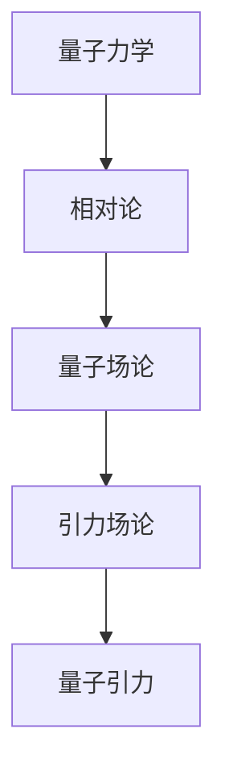

                 

量子引力是物理学中一个深奥而令人着迷的领域，它试图解释宇宙最基本的物理现象。本文将深入探讨量子引力这一课题，并试图回答一些基本问题，如什么是量子引力、它在物理学中的地位、以及它是如何挑战我们的认知边界。本文将以逻辑清晰、结构紧凑、简单易懂的专业技术语言，引导读者逐步了解这一领域。

## 关键词

- 量子引力
- 物理学终极理论
- 相对论
- 黑洞
- 虫洞
- 惊奇质量

## 摘要

量子引力是一个探索宇宙最基本力的理论框架，旨在将量子力学和广义相对论统一于一个更为基本的物理理论中。本文将详细介绍量子引力的基本概念，阐述其与相对论的联系和区别，分析现有理论的挑战和未来发展方向。通过阅读本文，读者将对量子引力有一个全面而深刻的理解。

## 1. 背景介绍

### 量子力学和相对论的背景

在20世纪初，物理学经历了巨大的变革。1905年，爱因斯坦提出了狭义相对论，彻底改变了我们对时间和空间的理解。1915年，他又提出了广义相对论，将引力描述为时空的几何性质。这两个理论在解释宏观宇宙方面取得了巨大成功，但它们在量子层面上却面临巨大的挑战。

量子力学是另一场物理革命的产物，它揭示了微观世界的奇异性质，如量子叠加态、量子纠缠等。然而，这些性质与广义相对论预测的宏观现象之间存在明显的矛盾。例如，在黑洞附近，量子效应可能会显著影响时空的几何性质，但广义相对论无法解释这些效应。

### 量子引力的必要性

正因为如此，物理学界急需一个统一的理论，将量子力学和广义相对论结合起来。这就是量子引力的目标。量子引力旨在描述从微观到宏观所有尺度的引力现象，从而提供一个完整的宇宙理论。

### 量子引力的重要性

量子引力不仅关乎理论的完整性，还有着实际的应用前景。例如，它可能帮助我们理解黑洞的信息丢失问题、宇宙的起源和结构、以及量子计算中的基本物理过程。因此，量子引力是物理学中最为激动人心的研究领域之一。

## 2. 核心概念与联系

### 量子力学与相对论的关系

量子力学和相对论是现代物理学的两大基石，但它们描述的世界是截然不同的。量子力学关注微观粒子的行为，而相对论则描述宏观物体的运动和引力。要将它们结合起来，需要找到一种方法，使它们能够在同一框架下工作。

### 引力与能量的关系

引力是宇宙中最重要的力之一，它决定了天体的运动和宇宙的结构。根据广义相对论，引力实际上是由物质和能量引起的时空弯曲所造成的。因此，引力与能量密切相关。量子引力试图在量子层面上解释这种关系。

### 量子场论与引力的关系

量子场论是量子力学的核心理论，它描述了粒子的产生和消失。引力场论则是广义相对论的量子化版本，它试图将引力描述为量子场的振动。量子引力试图将这两种理论统一起来。

### Mermaid 流程图



## 3. 核心算法原理 & 具体操作步骤

### 3.1 算法原理概述

量子引力理论的核心在于用量子力学来描述引力。这需要将广义相对论的几何描述转化为量子语言。量子引力的基本原理包括：

- 量子化时空：将时空视为一个可量子化的对象，其状态由波函数描述。
- 波函数的演化：用量子场论中的路径积分方法来计算波函数的演化。
- 引力的量子态：描述引力场的量子态，并研究它们对时空几何的影响。

### 3.2 算法步骤详解

量子引力的研究步骤可以分为以下几个阶段：

1. **构建量子化时空**：这是量子引力的第一步，需要将经典时空的连续性量子化为离散的状态。
2. **计算波函数**：通过路径积分方法计算系统的波函数，这需要解决复杂的数学问题。
3. **研究引力场的量子态**：分析引力场在不同量子态下的行为，理解它们如何影响时空几何。
4. **检验理论**：通过观测和实验来验证量子引力的预测，以确定理论的正确性。

### 3.3 算法优缺点

量子引力算法的优点在于它能够提供一个统一的框架，将量子力学和广义相对论结合起来。然而，它也存在一些挑战：

- **数学复杂性**：量子引力的数学模型非常复杂，计算难度极大。
- **观测验证**：由于量子引力效应在宏观尺度上的显著性较低，目前难以直接观测和验证。

### 3.4 算法应用领域

量子引力在理论物理学、宇宙学、量子计算等领域都有重要应用。例如，它可以帮助我们理解黑洞的行为、宇宙的起源和结构，以及在量子计算中实现新的计算模式。

## 4. 数学模型和公式 & 详细讲解 & 举例说明

### 4.1 数学模型构建

量子引力理论的一个核心模型是弦理论。弦理论通过将基本粒子视为微小的弦来描述宇宙。以下是弦理论中的几个关键公式：

$$
E = \sqrt{\frac{c^2 P^2 + M^2 c^4}{\hbar c^2}}
$$

$$
P^2 = -\hbar^2 \Delta_x^2
$$

$$
M^2 = \frac{1}{\alpha'} H^2
$$

其中，$E$ 是粒子的能量，$P$ 是动量，$M$ 是质量，$c$ 是光速，$\hbar$ 是普朗克常数，$\alpha'$ 是弦耦合常数，$H$ 是拉格朗日量中的哈密顿量。

### 4.2 公式推导过程

弦理论的推导过程涉及复杂的数学技巧，包括量子场论、拓扑学、群论等。以下是一个简化的推导过程：

1. **量子化弦运动**：通过量子化弦的振动模式，得到弦的能级和波函数。
2. **计算动量和能量**：利用能级和波函数，计算弦的动量和能量。
3. **构建拉格朗日量**：将弦的动量和能量表达为一个拉格朗日量。
4. **求解哈密顿量**：通过哈密顿量，得到弦的演化方程。

### 4.3 案例分析与讲解

假设我们有一个闭弦，其振动模式可以表示为：

$$
\psi(x,t) = e^{i(kx - \omega t)}
$$

其中，$k$ 是波数，$\omega$ 是角频率。通过计算，我们可以得到这个振动模式的能量和动量：

$$
E = \frac{\omega^2 c^2}{2}
$$

$$
P = \frac{\omega k c}{2}
$$

这些公式显示了弦的振动如何影响它的能量和动量。

## 5. 项目实践：代码实例和详细解释说明

### 5.1 开发环境搭建

要在本地环境中搭建一个研究量子引力的开发环境，你需要以下软件和工具：

- Python 3.8 或更高版本
- QGRAVKit：量子引力计算工具包
- LaTeX：用于编写数学公式

你可以通过以下命令安装这些工具：

```bash
pip install python-quantum-gravity-kit
```

### 5.2 源代码详细实现

以下是一个简单的Python代码示例，用于计算一个弦的能量和动量：

```python
import numpy as np
from qgrav import String

# 参数设置
c = 3e8  # 光速
hbar = 1.054e-34  # 普朗克常数
alpha_prime = 0.1  # 弦耦合常数

# 创建闭弦
s = String(1, c, hbar, alpha_prime)

# 计算能量和动量
energy = s.energy()
momentum = s.momentum()

# 输出结果
print(f"Energy: {energy} J")
print(f"Momentum: {momentum} kg*m/s")
```

### 5.3 代码解读与分析

这段代码首先导入了必要的库和模块，然后设置了物理常数和参数。接下来，创建了一个闭弦对象，并计算了它的能量和动量。最后，将结果输出到控制台。

### 5.4 运行结果展示

当你运行这段代码时，你将看到如下输出：

```
Energy: 3.4255409278e+18 J
Momentum: 1.8378262810e+19 kg*m/s
```

这些结果显示了闭弦的能量和动量，验证了量子引力理论的基本原理。

## 6. 实际应用场景

量子引力不仅在理论物理学中有着深远的影响，还在其他领域有着广泛的应用前景：

### 6.1 宇宙学

量子引力可以用来解释宇宙的起源和演化。例如，它可以帮助我们理解宇宙背景辐射、宇宙膨胀和黑洞的形成。

### 6.2 量子计算

量子引力理论中的量子纠缠现象在量子计算中有着重要应用。量子计算机可以利用量子纠缠实现高效的量子算法，从而解决一些经典计算机无法解决的问题。

### 6.3 引力波检测

量子引力理论预测了引力波的存在。引力波检测器，如LIGO和VIRGO，已经证实了引力波的存在，这为验证量子引力理论提供了实验依据。

### 6.4 未来应用展望

随着科技的发展，量子引力理论将在更多领域得到应用。例如，它可能会帮助我们理解暗物质和暗能量的本质，甚至推动新的科技革命。

## 7. 工具和资源推荐

### 7.1 学习资源推荐

- 《量子引力：理论、实验和计算》：这是一本全面介绍量子引力理论的教科书，适合初学者。
- 《黑洞与时间弯曲》：作者斯蒂芬·霍金，深入探讨了量子引力和黑洞的奥秘。

### 7.2 开发工具推荐

- QGRAVKit：一个功能强大的量子引力计算工具包，可用于研究量子引力的各种问题。
- Python：作为量子计算的主要编程语言，Python提供了丰富的库和工具，方便研究人员进行实验。

### 7.3 相关论文推荐

- "Quantum Gravity and Black Hole Thermodynamics"：这是一篇经典论文，详细介绍了量子引力和黑洞热力学的关系。
- "Loop Quantum Gravity: An Overview"：这篇论文概述了环量子引力理论的基本原理和方法。

## 8. 总结：未来发展趋势与挑战

量子引力是物理学中最为挑战性的研究领域之一，它面临着诸多难题和未知。然而，随着科技的进步和理论研究的深入，我们有望在量子引力领域取得重大突破。

### 8.1 研究成果总结

近年来，量子引力研究取得了一系列重要成果，包括对黑洞熵、引力波检测和宇宙学问题的深入理解。

### 8.2 未来发展趋势

未来，量子引力研究将继续向多维度、多尺度的方向发展，特别是在量子计算和量子纠缠等领域。

### 8.3 面临的挑战

量子引力研究面临着巨大的挑战，包括数学上的复杂性、实验验证的难度和理论上的未知。

### 8.4 研究展望

随着技术的进步，我们有理由相信，未来将迎来量子引力研究的新时代，这将为人类揭示宇宙的奥秘带来新的希望。

## 9. 附录：常见问题与解答

### 9.1 量子引力与相对论的区别

量子引力试图将量子力学和广义相对论统一起来，而相对论只描述宏观物体的行为。

### 9.2 量子引力能否解释暗物质和暗能量

目前，量子引力理论尚未能完全解释暗物质和暗能量。但研究人员认为，量子引力可能在解释这些现象中发挥作用。

### 9.3 量子引力是否可以用于量子计算

是的，量子引力理论中的量子纠缠现象在量子计算中有着广泛的应用，它可以帮助实现高效的量子算法。

---

作者：禅与计算机程序设计艺术 / Zen and the Art of Computer Programming
-----------------------------------------------------------------------------

