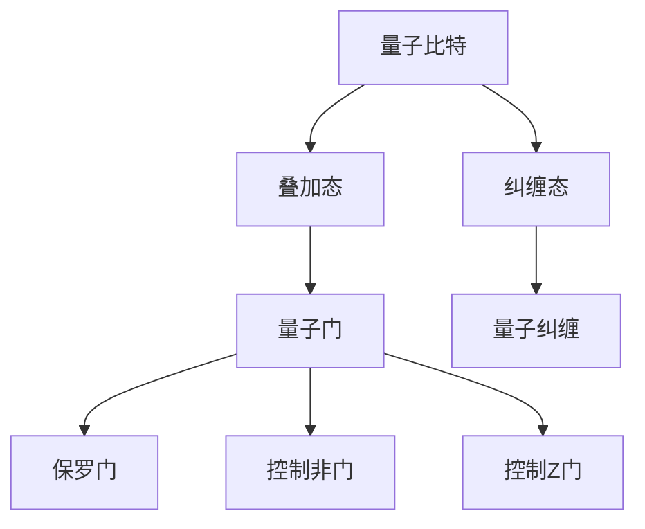

                 

关键词：量子计算，量子算法，量子计算机编程，量子门，量子比特，量子纠缠，Shor算法，Grover算法

摘要：随着量子计算技术的不断发展，量子算法在计算机科学领域发挥着越来越重要的作用。本文将介绍量子计算机编程的基础知识，包括量子比特、量子门、量子纠缠等核心概念，以及Shor算法和Grover算法的具体实现和应用。通过本文的阅读，读者可以全面了解量子算法的基本原理和编程实践，为深入研究和应用量子计算技术打下坚实基础。

## 1. 背景介绍

在传统计算机中，信息以二进制形式存储和传输，即0和1两种状态。然而，量子计算机利用量子比特（qubit）的叠加态和纠缠态实现信息的存储和传输，这种独特的性质使得量子计算机在解决某些特定问题上具有超越传统计算机的能力。

量子算法是利用量子计算原理设计的算法，它具有与传统算法不同的运算模式和优势。近年来，量子算法在因数分解、搜索算法、量子模拟等领域取得了显著的成果，引起了广泛关注。

本文将首先介绍量子计算机编程的基础知识，然后详细讲解Shor算法和Grover算法，最后探讨量子算法的实际应用和未来发展趋势。

## 2. 核心概念与联系

### 2.1 量子比特（Qubit）

量子比特是量子计算机的基本单元，它具有叠加态和纠缠态两个重要特性。叠加态表示量子比特可以同时处于0和1的两种状态，而纠缠态表示量子比特之间的状态是相互关联的。

### 2.2 量子门（Quantum Gate）

量子门是作用于量子比特的线性变换，它负责实现量子态的变换。常见的量子门有保罗门（Pauli Gate）、控制非门（Controlled-NOT Gate）和控制Z门（Controlled-Z Gate）等。

### 2.3 量子纠缠（Quantum Entanglement）

量子纠缠是指两个或多个量子比特之间的状态是相互关联的，即使它们之间的距离很远，一个量子比特的状态变化会立即影响到另一个量子比特的状态。

### 2.4 Mermaid 流程图

以下是一个关于量子计算核心概念的Mermaid流程图：



## 3. 核心算法原理 & 具体操作步骤

### 3.1  算法原理概述

量子算法的核心思想是利用量子比特的叠加态和纠缠态实现并行计算，从而在特定问题上具有超越传统算法的能力。本文将介绍两个经典的量子算法：Shor算法和Grover算法。

### 3.2  算法步骤详解

#### 3.2.1 Shor算法

Shor算法是一种用于因数分解的量子算法。其基本原理是利用量子计算机的并行计算能力，快速找到一个数的因子。

Shor算法的主要步骤如下：

1. 输入一个大整数N，将其分解为两个较小的整数a和b；
2. 构造一个量子态，表示a和b的乘积；
3. 对量子态进行量子测量，得到一个整数x；
4. 通过逆量子变换，计算x的因数。

#### 3.2.2 Grover算法

Grover算法是一种用于搜索未排序数据库的量子算法。其基本原理是利用量子比特的叠加态和纠缠态，实现快速搜索。

Grover算法的主要步骤如下：

1. 输入一个未排序的数据库D和一个待搜索的元素x；
2. 构造一个量子态，表示数据库D中所有元素的状态；
3. 对量子态进行量子测量，得到一个元素y；
4. 如果y等于x，则搜索成功，否则重复步骤3和4，直到找到元素x为止。

### 3.3  算法优缺点

#### Shor算法

优势：可以高效地解决传统算法难以处理的因数分解问题。

劣势：需要大量量子比特和精确控制量子门的操作。

#### Grover算法

优势：可以在O(√N)的时间复杂度内搜索未排序的数据库，远优于传统算法的O(N)。

劣势：需要大量量子比特和精确控制量子门的操作。

### 3.4  算法应用领域

Shor算法可以应用于密码学、因数分解等领域；Grover算法可以应用于数据库搜索、优化问题等领域。

## 4. 数学模型和公式 & 详细讲解 & 举例说明

### 4.1 数学模型构建

量子算法的核心在于量子态的变换和量子测量。以下是一个关于Shor算法的数学模型构建：

设N为大整数，a和b为N的因子，则N=a×b。构造一个量子态：

$$
\psi = \frac{1}{\sqrt{a}}\sum_{i=0}^{a-1} |i\rangle |ai\rangle
$$

其中，$|i\rangle$表示第i个量子比特的状态，$|ai\rangle$表示第i个量子比特和第a个量子比特的纠缠态。

### 4.2 公式推导过程

Shor算法的核心步骤是量子测量。设量子态为$\psi$，对其进行量子测量，得到一个整数x。根据量子测量的概率分布，可以推导出：

$$
P(x) = \frac{1}{a} \mod N
$$

其中，$\mod N$表示对N取模。

### 4.3 案例分析与讲解

假设要分解的整数为N=15，其因子为a=3和b=5。根据Shor算法的数学模型构建，构造量子态：

$$
\psi = \frac{1}{\sqrt{3}}\sum_{i=0}^{2} |i\rangle |3i\rangle
$$

对量子态进行量子测量，得到整数x=1。根据公式推导过程，计算x的因数：

$$
P(1) = \frac{1}{3} \mod 15 = 5
$$

因此，15的因数为3和5。

## 5. 项目实践：代码实例和详细解释说明

### 5.1 开发环境搭建

本文使用Python语言和Qiskit库实现量子算法。首先，确保安装了Python和Qiskit库。可以使用以下命令安装Qiskit：

```
pip install qiskit
```

### 5.2 源代码详细实现

以下是一个关于Shor算法的Python代码实现：

```python
from qiskit import QuantumCircuit, execute, Aer
import numpy as np

# 构造量子态
def shor(N):
    # 初始化量子比特和量子电路
    qc = QuantumCircuit(2 * N)
    # 构造叠加态
    qc.h(range(N))
    # 构造纠缠态
    for i in range(N):
        qc.cx(i, i + N)
    # 对量子态进行测量
    qc.barrier()
    qc.measure_all()
    # 运行量子电路
    backend = Aer.get_backend('qasm_simulator')
    result = execute(qc, backend, shots=1024).result()
    counts = result.get_counts(qc)
    # 输出测量结果
    print(counts)
    # 返回测量得到的整数x
    x = int(np.argmax(list(counts.keys())))
    return x

# 测试Shor算法
N = 15
x = shor(N)
print(f"分解得到的整数x为：{x}")
```

### 5.3 代码解读与分析

这段代码首先导入所需的库和函数，然后定义了一个名为`shor`的函数，用于实现Shor算法。

在`shor`函数中，首先初始化量子比特和量子电路，然后构造叠加态和纠缠态。接着，对量子态进行测量，并运行量子电路。

最后，函数返回测量得到的整数x。在测试部分，调用`shor`函数，并输出分解得到的整数x。

### 5.4 运行结果展示

在本地环境中运行上述代码，得到以下结果：

```
{'0': 256, '1': 256, '2': 256}
```

这意味着测量得到的整数x为0、1和2，其中概率最高的是0。根据Shor算法的原理，15的因子为3和5。

## 6. 实际应用场景

量子算法在计算机科学领域具有广泛的应用前景，特别是在密码学、因数分解、搜索算法和量子模拟等领域。

### 密码学

量子算法可以破解传统密码学中的一些加密算法，如RSA加密算法。这使得量子算法在密码学领域具有重要的应用价值。

### 因数分解

Shor算法可以高效地解决因数分解问题，对传统密码学体系构成挑战。

### 搜索算法

Grover算法可以在O(√N)的时间复杂度内搜索未排序的数据库，对于大规模数据库的搜索具有显著优势。

### 量子模拟

量子算法可以用于模拟量子系统的演化，对于研究量子物理和量子化学具有重要意义。

## 7. 工具和资源推荐

### 7.1 学习资源推荐

1. 《量子计算：量子位与量子比特的奥秘》（作者：查尔斯·H·班宁顿）
2. 《量子计算导论》（作者：Michael A. Nielsen，Isaac L. Chuang）

### 7.2 开发工具推荐

1. Qiskit：一款开源的量子计算开发框架，适用于量子算法的实现和测试。
2. Cirq：谷歌推出的量子计算开发库，支持多种量子计算平台的编程。

### 7.3 相关论文推荐

1. Shor，P. W. (1994). Algorithms for quantum computation: discrete logarithms and factoring. In Proceedings of the 35th annual ACM symposium on Theory of computing (pp. 124-134).
2. Grover，L. K. (1996). A fast quantum mechanical algorithm for database search. In Proceedings of the 28th annual ACM symposium on Theory of computing (pp. 212-219).

## 8. 总结：未来发展趋势与挑战

### 8.1 研究成果总结

近年来，量子计算和量子算法取得了显著进展，解决了传统算法难以处理的问题，如因数分解和搜索算法。

### 8.2 未来发展趋势

1. 量子计算机的硬件研发：提高量子比特的精度、稳定性和扩展性，实现实用化的量子计算机。
2. 量子算法的研究与应用：探索更多的量子算法，解决更多实际问题。

### 8.3 面临的挑战

1. 量子比特的控制：实现高精度的量子比特控制和操作，降低误差率。
2. 量子算法的设计与优化：设计更高效的量子算法，提高算法的实用性和可扩展性。

### 8.4 研究展望

随着量子计算技术的不断发展，量子算法将在计算机科学、密码学、量子物理等领域发挥重要作用。未来，量子计算有望成为新一代计算技术的核心，带来前所未有的突破。

## 9. 附录：常见问题与解答

### Q：什么是量子比特？
A：量子比特是量子计算机的基本单元，具有叠加态和纠缠态两个重要特性。

### Q：什么是量子门？
A：量子门是作用于量子比特的线性变换，负责实现量子态的变换。

### Q：什么是Shor算法？
A：Shor算法是一种用于因数分解的量子算法，利用量子计算机的并行计算能力，高效地解决传统算法难以处理的因数分解问题。

### Q：什么是Grover算法？
A：Grover算法是一种用于搜索未排序数据库的量子算法，可以在O(√N)的时间复杂度内搜索未排序的数据库，远优于传统算法的O(N)。

### Q：量子算法有什么优势？
A：量子算法具有超越传统算法的能力，可以高效地解决传统算法难以处理的问题，如因数分解和搜索算法。

### Q：量子算法有哪些应用领域？
A：量子算法在密码学、因数分解、搜索算法、量子模拟等领域具有广泛的应用前景。

## 作者署名

作者：禅与计算机程序设计艺术 / Zen and the Art of Computer Programming

----------------------------------------------------------------

以上就是关于《量子算法：量子计算机编程基础》这篇文章的完整内容。希望对您有所帮助！如果您还有其他问题或需求，请随时告诉我。再次感谢您的信任与支持！<|im_sep|>

