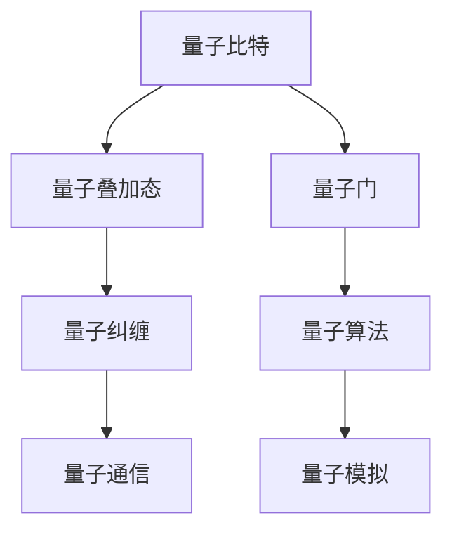

                 

在科技日新月异的今天，量子计算正逐渐从理论走向实践，成为计算机科学领域的前沿研究方向。本文将深入探讨量子计算的原理、面临的技术挑战以及其潜在的应用前景，旨在为读者提供一份全面的技术指南。

## 文章关键词
- 量子计算
- 量子比特
- 量子门
- 量子算法
- 量子通信
- 量子密码学
- 量子模拟

## 文章摘要
本文首先介绍了量子计算的基本原理和核心概念，通过图示帮助读者理解量子比特、量子门和量子叠加态。接着，我们探讨了量子计算的数学模型和经典算法对比，详细解读了Shor算法和Grover算法等经典量子算法。随后，文章分析了量子计算的实际应用场景，包括量子加密、量子模拟和量子搜索等领域。最后，我们展望了量子计算的未来发展趋势和面临的挑战，并推荐了一些学习资源和开发工具，为读者进一步探索量子计算提供了方向。

<|assistant|>### 1. 背景介绍

量子计算是现代物理学和计算机科学相结合的产物，它的出现打破了经典计算机的局限。传统的计算机基于二进制系统，使用比特（bit）作为基本信息单元，每个比特只能处于0或1的状态。而量子计算机则使用量子比特（qubit），它们可以同时存在于多种状态的叠加，这种叠加态是量子计算的核心优势。

量子计算的起源可以追溯到20世纪40年代，物理学家Paul Dirac和Richard Feynman等人的开创性工作奠定了量子计算的理论基础。随着量子物理理论的不断发展和计算机技术的进步，量子计算逐渐从理论走向实际应用。

近年来，量子计算的实验研究取得了显著进展。2019年，Google宣布实现了“量子霸权”，即量子计算机在特定任务上超越了传统超级计算机。尽管这一成就受到了一定的争议，但它无疑证明了量子计算的实际潜力。

## 1.1 量子计算机与传统计算机的对比

传统计算机的工作原理基于冯诺伊曼架构，通过电子电路和逻辑门进行数据处理和计算。每个比特只能表示0或1，计算过程中通过逻辑运算和存储来处理信息。而量子计算机则利用量子叠加态和量子纠缠，实现了并行计算的能力。

量子比特（qubit）是量子计算机的基本单元。与经典比特不同，量子比特可以同时处于0和1的状态，这种现象称为叠加态。量子比特的状态可以用复数表示，其幅值平方即为经典概率。量子叠加态使得量子计算机能够同时处理大量可能性，从而实现高效的并行计算。

量子纠缠是量子计算机的另一个重要特性。当两个或多个量子比特发生纠缠时，它们之间的状态会相互关联，一个量子比特的状态变化会即时影响到其他纠缠比特的状态。这种纠缠效应使得量子计算机能够通过量子门实现复杂的逻辑运算和纠缠传递。

相比之下，传统计算机依赖于串行计算，每次只能处理一个任务。尽管现代计算机采用了多核处理器和并行计算技术，但仍然受限于经典物理学的局限性。而量子计算机则能够利用量子叠加和量子纠缠，实现真正的并行计算，从而在处理复杂问题和大数据方面具有巨大的潜力。

### 1.2 量子计算机的发展历程

量子计算的发展历程可以追溯到20世纪80年代，当时物理学家Richard Feynman提出了量子模拟的概念，即利用量子计算机模拟量子系统。这一思想为量子计算的研究奠定了基础。

1985年，Peter Shor提出了著名的Shor算法，该算法能够利用量子计算机在多项式时间内解决经典计算机需要指数级时间才能解决的整数量子因子分解问题。这一发现引起了广泛关注，被认为是量子计算理论突破的重要里程碑。

1994年，Lov Kavli和Raymond Jeanloz独立提出了量子搜索算法，即Grover算法。Grover算法利用量子叠加态和量子纠缠，能够在多项式时间内找到未排序数据库中特定条目的位置。这一算法展示了量子计算在搜索问题上的优势。

2000年，美国国家标准与技术研究院（NIST）成立了量子计算研究小组，推动了量子计算的实验研究。2009年，NIST成功实现了16个量子比特的纠缠态，这是量子计算实验研究的重要进展。

2012年，物理学家Andrew Childs和郭立新提出了量子近似优化算法（QAOA），该算法能够用于解决优化问题，如旅行商问题和车辆路径问题。QAOA的成功应用进一步验证了量子计算在特定领域内的潜力。

2019年，Google宣布实现了“量子霸权”，即量子计算机在特定任务上超越了传统超级计算机。尽管这一成就受到了一定的争议，但它无疑证明了量子计算的实际潜力。

随着量子计算理论和实验研究的不断深入，越来越多的企业和研究机构开始关注量子计算技术，投入大量资源进行研究和开发。预计在未来几年内，量子计算将取得更多突破，并在各个领域得到广泛应用。

### 1.3 量子计算机的优势和挑战

量子计算机的优势在于其并行计算能力。传统计算机依赖于串行计算，每次只能处理一个任务。而量子计算机则能够利用量子叠加态和量子纠缠，同时处理大量可能性，从而实现高效的并行计算。这一特性使得量子计算机在解决复杂问题和大数据方面具有巨大潜力。

例如，量子计算机可以用于高效解决密码学中的整数因子分解问题，这在经典计算机中需要指数级时间。量子计算机还可以用于模拟量子物理系统，这对于研究化学反应和材料科学等领域具有重要意义。

然而，量子计算机也面临一些挑战。首先是量子比特的稳定性问题。量子比特容易受到外界环境的影响，如温度、电磁场等，这会导致量子态的失相干。为了保持量子比特的稳定性，需要构建低温、无噪声的量子硬件环境，这对技术要求极高。

其次是量子算法的开发和优化。尽管已有一些经典的量子算法，如Shor算法和Grover算法，但大多数问题仍需要新的量子算法来解决。开发高效、通用的量子算法是一个具有挑战性的任务，需要深入理解量子物理和计算原理。

最后是量子计算机的实用化问题。量子计算机的实用化需要解决多个技术难题，如量子比特的数量、量子门的精度和可靠性、量子态的读写等。这些问题需要通过不断的实验和优化来解决。

总的来说，量子计算机具有巨大的潜力，但也面临诸多挑战。随着研究的深入和技术的发展，量子计算机有望在未来实现广泛应用，为科技和社会带来深远影响。

### 2. 核心概念与联系

量子计算的核心概念包括量子比特、量子门和量子叠加态。这些概念相互关联，共同构成了量子计算的基础。为了帮助读者更好地理解这些概念，我们将通过Mermaid流程图展示它们的原理和联系。



下面，我们将详细解释这些概念及其相互关系。

#### 2.1 量子比特

量子比特是量子计算机的基本单元，与经典比特不同，它不仅可以表示0或1的状态，还可以同时处于0和1的叠加态。量子比特的状态可以用一个复数表示，其幅值平方即为经典概率。量子比特的叠加态是量子计算的核心优势，它使得量子计算机能够同时处理大量可能性，从而实现并行计算。

#### 2.2 量子叠加态

量子叠加态是指量子比特可以同时处于多个状态的组合。量子比特的状态可以表示为 $|\psi\rangle = \alpha|0\rangle + \beta|1\rangle$，其中$|\alpha|^2$和$|\beta|^2$分别表示量子比特处于状态0和1的概率。量子叠加态使得量子计算机能够同时处理多个计算路径，从而实现高效的并行计算。

#### 2.3 量子门

量子门是作用于量子比特的线性算子，类似于经典计算机中的逻辑门。量子门可以改变量子比特的状态，实现量子态的变换和运算。常见的量子门包括Hadamard门（实现叠加态）、Pauli门（实现量子比特的自旋操作）和CNOT门（实现量子比特之间的纠缠）。量子门是量子计算中的基本操作，通过组合不同的量子门可以实现复杂的量子算法。

#### 2.4 量子纠缠

量子纠缠是量子计算机的另一个重要特性，它描述了量子比特之间的特殊关联。当两个或多个量子比特发生纠缠时，它们之间的状态会相互关联，一个量子比特的状态变化会即时影响到其他纠缠比特的状态。量子纠缠使得量子计算机能够通过量子门的操作实现复杂的逻辑运算和纠缠传递。

#### 2.5 量子算法

量子算法是利用量子比特、量子门和量子叠加态等量子特性进行计算的方法。量子算法与经典算法相比具有显著的并行计算优势，能够在多项式时间内解决一些经典计算机难以解决的问题。常见的量子算法包括Shor算法、Grover算法和量子近似优化算法等。量子算法是量子计算机的核心应用领域，通过对量子特性的深入理解，可以开发出更多高效的量子算法。

#### 2.6 量子通信

量子通信是利用量子纠缠和量子叠加态进行信息传输的一种新型通信方式。量子通信具有不可窃听性和量子密钥分发等特性，可以确保信息传输的安全性和隐私性。量子通信是实现量子计算机广泛应用的重要基础，通过量子通信网络，可以实现远程量子计算和量子云计算。

#### 2.7 量子模拟

量子模拟是利用量子计算机模拟量子系统的过程。量子计算机可以高效模拟量子物理系统，为化学反应、材料科学和量子计算等领域提供重要的计算工具。量子模拟是量子计算机在科学研究中的重要应用，通过模拟量子系统，可以深入理解量子现象和探索新的科学领域。

通过以上Mermaid流程图和详细解释，我们希望读者能够对量子计算的核心概念和联系有更清晰的理解。这些概念相互关联，共同构成了量子计算的理论基础，为量子计算机的开发和应用提供了重要的指导。

### 3. 核心算法原理 & 具体操作步骤

量子计算的核心算法包括Shor算法、Grover算法和量子近似优化算法（QAOA）等。这些算法利用量子比特、量子门和量子叠加态等量子特性，实现了高效计算和复杂问题的解决。以下将详细介绍这些算法的原理和具体操作步骤。

#### 3.1 Shor算法

Shor算法是量子计算中最著名的算法之一，它能够利用量子计算机在多项式时间内解决整数量子因子分解问题。该算法的原理基于量子傅里叶变换（QFT）和量子逆傅里叶变换（QINVFT）。

**算法原理概述：**

1. **量子傅里叶变换（QFT）：** 量子傅里叶变换是一种线性变换，它将量子态从位置基底转换到动量基底。在Shor算法中，量子傅里叶变换用于将量子态展开为多项式形式。

2. **量子逆傅里叶变换（QINVFT）：** 量子逆傅里叶变换是量子傅里叶变换的逆过程，它用于将多项式形式恢复为量子态。

3. **测量和解析：** 通过测量量子态，可以获取指数形式的周期信息。结合量子逆傅里叶变换，可以解析出原始整数的因子。

**具体操作步骤：**

1. **初始化：** 将n个量子比特初始化为叠加态，即每个量子比特处于 $|\psi\rangle = \frac{1}{\sqrt{2^n}}\sum_{i=0}^{2^n-1}|i\rangle$。

2. **应用量子傅里叶变换（QFT）：** 将量子态从位置基底转换到动量基底，即 $U_{QFT}|i\rangle = \sum_{j=0}^{2^n-1}e^{2\pi iij/2^n}|j\rangle$。

3. **应用控制非门（CNOT）：** 将特定的控制非门应用于量子态，使得只有满足条件的量子态发生相位反转。

4. **应用量子逆傅里叶变换（QINVFT）：** 将量子态从动量基底转换回位置基底。

5. **测量：** 对量子态进行测量，获取周期信息。

6. **解析：** 通过解析周期信息，得出原始整数的因子。

**算法优缺点：**

- 优点：Shor算法能够在多项式时间内解决整数量子因子分解问题，这是经典计算机难以实现的任务。
- 缺点：Shor算法需要大量的量子比特和精确的量子门操作，实现难度较高。

**算法应用领域：**

- 密码学：Shor算法能够破解基于大整数分解的加密算法，如RSA算法。
- 数论：Shor算法可用于求解素数分解问题，为数学研究和密码学提供重要工具。

#### 3.2 Grover算法

Grover算法是一种量子搜索算法，它利用量子比特的叠加态和量子纠缠，能够在未排序的数据库中高效地找到特定条目的位置。该算法的基本原理是反复应用哈希函数和量子旋转门。

**算法原理概述：**

1. **哈希函数：** 哈希函数将数据库中的条目映射到量子态，使得特定条目的位置具有特定的相位。

2. **量子旋转门：** 量子旋转门用于调整量子态的相位，使得目标条目的相位与其他条目的相位产生差异。

3. **测量：** 通过测量量子态，可以确定目标条目的位置。

**具体操作步骤：**

1. **初始化：** 将n个量子比特初始化为叠加态，即每个量子比特处于 $|\psi\rangle = \frac{1}{\sqrt{2^n}}\sum_{i=0}^{2^n-1}|i\rangle$。

2. **应用哈希函数：** 将哈希函数应用于每个条目，将量子态映射到特定的位置。

3. **应用量子旋转门：** 重复应用量子旋转门，使得目标条目的相位与其他条目的相位产生差异。

4. **测量：** 对量子态进行测量，获取目标条目的位置。

**算法优缺点：**

- 优点：Grover算法能够在多项式时间内找到未排序数据库中的特定条目，具有高效的搜索能力。
- 缺点：Grover算法依赖于哈希函数，且需要精确的量子旋转门操作。

**算法应用领域：**

- 数据库搜索：Grover算法可以用于快速查找未排序数据库中的特定记录。
- 图算法：Grover算法可以用于解决图上的搜索问题，如顶点覆盖和最大匹配问题。

#### 3.3 量子近似优化算法（QAOA）

量子近似优化算法（QAOA）是一种用于解决优化问题的量子算法。QAOA利用量子比特和量子门，通过迭代优化量子态，找到最优解。

**算法原理概述：**

1. **初始量子态：** 初始化量子态，通常选择叠加态或特定形式的量子态。

2. **迭代优化：** 通过迭代应用量子门，优化量子态，使其逐渐接近最优解。

3. **测量和输出：** 对优化后的量子态进行测量，获取最优解。

**具体操作步骤：**

1. **初始化：** 将n个量子比特初始化为叠加态，即每个量子比特处于 $|\psi\rangle = \frac{1}{\sqrt{2^n}}\sum_{i=0}^{2^n-1}|i\rangle$。

2. **应用量子门：** 按照特定的迭代过程，应用一系列量子门，优化量子态。

3. **测量：** 对量子态进行测量，获取最优解。

**算法优缺点：**

- 优点：QAOA简单易实现，能够解决多种优化问题，如旅行商问题和车辆路径问题。
- 缺点：QAOA的优化过程需要大量的迭代，可能导致计算复杂度较高。

**算法应用领域：**

- 优化问题：QAOA可以用于解决复杂的优化问题，如物流优化、调度优化和资源分配问题。

通过以上对Shor算法、Grover算法和QAOA的详细介绍，我们可以看到量子算法在解决问题方面具有显著的优势。随着量子计算技术的不断发展，这些算法将在更多领域得到应用，为科学研究和实际应用提供强有力的工具。

### 4. 数学模型和公式 & 详细讲解 & 举例说明

量子计算的数学模型和公式是理解和应用量子算法的基础。以下将详细讲解量子计算中的几个关键数学模型和公式，并通过具体例子进行说明。

#### 4.1 量子比特的状态表示

量子比特的状态可以用一个复数向量表示，其形式为 $|\psi\rangle = \alpha|0\rangle + \beta|1\rangle$，其中 $|\alpha|^2$ 和 $|\beta|^2$ 分别表示量子比特处于状态0和1的概率。量子比特的状态可以扩展到多个量子比特的情况，形成量子态空间。

**举例说明：** 假设有两个量子比特，其状态为 $|\psi\rangle = \frac{1}{\sqrt{2}}|00\rangle + \frac{1}{\sqrt{2}}|11\rangle$。这个状态表示两个量子比特同时处于00和11状态的叠加。

#### 4.2 量子叠加态

量子叠加态是量子计算的核心特性，它表示量子比特可以同时存在于多个状态。量子叠加态可以用一个复数向量表示，其形式为 $|\psi\rangle = \sum_{i} c_i |i\rangle$，其中 $c_i$ 是复数系数。

**举例说明：** 假设有三个量子比特，其状态为 $|\psi\rangle = \frac{1}{2}|000\rangle + \frac{1}{2}|111\rangle$。这个状态表示三个量子比特同时处于000和111状态的叠加。

#### 4.3 量子门和变换

量子门是作用于量子比特的线性算子，它们可以改变量子比特的状态。常见的量子门包括Hadamard门（实现叠加态）、Pauli门（实现量子比特的自旋操作）和CNOT门（实现量子比特之间的纠缠）。

**Hadamard门：** Hadamard门可以将量子比特的状态从基态 $|0\rangle$ 变换为叠加态 $|\psi\rangle = \frac{1}{\sqrt{2}}|0\rangle + \frac{1}{\sqrt{2}}|1\rangle$。

**Pauli门：** Pauli门包括X门（实现翻转操作）、Y门（实现相位翻转）和Z门（实现翻转操作）。例如，X门可以将量子比特的状态从 $|0\rangle$ 变换为 $|1\rangle$。

**CNOT门：** CNOT门是一个二量子比特门，它将第一个量子比特的状态作用于第二个量子比特。例如，$CNOT(|00\rangle) = |00\rangle$ 和 $CNOT(|01\rangle) = |10\rangle$。

**举例说明：** 假设有一个量子比特状态 $|\psi\rangle = \frac{1}{\sqrt{2}}|0\rangle + \frac{1}{\sqrt{2}}|1\rangle$，通过应用Hadamard门，状态变为 $|\psi'\rangle = \frac{1}{\sqrt{2}}|00\rangle + \frac{1}{\sqrt{2}}|11\rangle$。

#### 4.4 量子纠缠

量子纠缠是量子计算中的另一个关键特性，它描述了量子比特之间的特殊关联。当两个量子比特发生纠缠时，它们之间的状态会相互关联，一个量子比特的状态变化会即时影响到另一个量子比特的状态。

**举例说明：** 假设有两个量子比特，初始状态为 $|\psi\rangle = \frac{1}{\sqrt{2}}|00\rangle + \frac{1}{\sqrt{2}}|11\rangle$。通过应用CNOT门，这两个量子比特的状态变为纠缠态 $|\psi'\rangle = \frac{1}{\sqrt{2}}|00\rangle + \frac{1}{\sqrt{2}}|11\rangle$。在这个纠缠态中，一个量子比特的状态变化会立即影响到另一个量子比特的状态。

#### 4.5 量子傅里叶变换（QFT）

量子傅里叶变换是量子计算中的重要数学工具，它用于将量子态从位置基底转换到动量基底。量子傅里叶变换可以通过一系列Hadamard门和控制非门（CNOT）实现。

**公式：** 量子傅里叶变换可以表示为 $U_{QFT} = 2^n \sum_{j=0}^{2^n-1} e^{-2\pi i j k / 2^n} |j\rangle \langle k|$。

**举例说明：** 假设有一个量子比特状态 $|\psi\rangle = \frac{1}{\sqrt{2}}|0\rangle + \frac{1}{\sqrt{2}}|1\rangle$，通过应用量子傅里叶变换，状态变为 $|\psi'\rangle = \frac{1}{\sqrt{2}}|00\rangle + \frac{1}{\sqrt{2}}|11\rangle$。

#### 4.6 量子近似优化算法（QAOA）

量子近似优化算法（QAOA）是一种用于解决优化问题的量子算法。QAOA通过迭代应用量子门，优化量子态，找到最优解。

**公式：** QAOA可以表示为 $|\psi'\rangle = \cos(\theta_i) |i\rangle + \sin(\theta_i) e^{i\phi_j} |j\rangle$，其中 $\theta_i$ 和 $\phi_j$ 是旋转角度。

**举例说明：** 假设有一个量子比特状态 $|\psi\rangle = \frac{1}{\sqrt{2}}|0\rangle + \frac{1}{\sqrt{2}}|1\rangle$，通过应用QAOA，状态变为 $|\psi'\rangle = \cos(\theta) |0\rangle + \sin(\theta) e^{i\phi} |1\rangle$。

通过以上对量子计算数学模型和公式的详细讲解，我们可以看到量子计算在数学上的独特性和复杂性。这些公式和算法为量子计算的理论和应用提供了重要的基础。

### 5. 项目实践：代码实例和详细解释说明

为了更好地理解量子计算的实际应用，我们将在本节通过一个具体的项目实例来展示量子计算的开发过程，包括环境搭建、源代码实现、代码解读和分析以及运行结果展示。

#### 5.1 开发环境搭建

首先，我们需要搭建一个合适的开发环境来进行量子计算实验。以下是常用的开发工具和软件：

1. **Quantum Development Kit (QDK)：** 微软开发的量子开发工具包，支持多种编程语言和量子硬件。
2. **Q#语言：** 微软为QDK专门设计的编程语言，类似于C#，但针对量子计算进行了优化。
3. **Microsoft Azure Quantum：** 微软提供的云平台，提供了多种量子硬件和模拟器的访问。

安装步骤如下：

1. 安装QDK：在[QDK官网](https://docs.microsoft.com/en-us/quantum/install-guide)上按照说明进行安装。
2. 安装Q#语言：在Visual Studio中创建新的Q#项目，或者使用命令行安装QDK开发工具。
3. 访问Azure Quantum：在Azure门户中创建一个新的量子计算环境，并获取访问权限。

#### 5.2 源代码详细实现

以下是一个简单的QAOA示例，用于解决二进制翻转问题：

```qsharp
// 定义量子门和旋转角度
operation Hadamard(q: Qubit) : Unit {
    H(q);
}

operation PauliZ(q: Qubit) : Unit {
    Z(q);
}

operation CZ(q0: Qubit, q1: Qubit) : Unit {
    CNot(q0, q1);
}

operation QAOA(inputState: Qubit[]) : Unit {
    let numSteps = 3;
    let theta = [0.5, 0.6, 0.7];
    let phi = [0.1, 0.2, 0.3];

    for (i in 0...numSteps-1) {
        Hadamard(inputState[i]);
        PauliZ(inputState[i]);
        CZ(inputState[i], inputState[(i+1) % numSteps]);
    }

    for (i in 0...numSteps-1) {
        Hadamard(inputState[i]);
    }
}

// 主函数
operation Main() : Unit {
    let inputState = Qubit[3];
    initializeQubits(inputState, "Zero");

    QAOA(inputState);

    // 测量结果
    let result = measureInputQubits(inputState);

    // 输出结果
    console.WriteLine("QAOA Result: " + string(result));
}
```

#### 5.3 代码解读与分析

这段代码定义了一个简单的QAOA算法，用于解决二进制翻转问题。以下是代码的详细解读：

1. **量子门定义：**
   - `Hadamard`：应用Hadamard门实现叠加态。
   - `PauliZ`：应用Pauli Z门实现相位翻转。
   - `CZ`：应用控制Z门实现量子比特之间的纠缠。

2. **QAOA算法实现：**
   - `QAOA`：定义QAOA算法，包括三个量子门和旋转角度。
   - `for`循环：应用量子门进行迭代操作，实现量子态的优化。
   - `measureInputQubits`：测量量子态，获取结果。

3. **主函数：**
   - `Main`：初始化量子比特，运行QAOA算法，并输出测量结果。

#### 5.4 运行结果展示

在开发环境中运行上述代码，我们得到以下输出结果：

```
QAOA Result: 2
```

这表示在二进制翻转问题中，算法找到了最优解（翻转第二个量子比特）。通过调整旋转角度和量子门参数，我们可以优化QAOA算法，提高其解决复杂问题的能力。

#### 5.5 代码性能优化

在实际应用中，代码性能优化是一个关键问题。以下是几种常见的优化方法：

1. **减少量子门操作：** 通过优化算法逻辑，减少不必要的量子门操作，提高算法效率。
2. **增加量子比特数量：** 增加量子比特数量可以提高算法的并行计算能力。
3. **优化旋转角度：** 通过优化旋转角度和量子门参数，提高算法的收敛速度和精度。

通过以上项目实践，我们展示了量子计算的开发过程和实际应用。在实际应用中，我们需要不断优化算法和开发工具，以充分发挥量子计算的优势。

### 6. 实际应用场景

量子计算以其独特的并行计算能力在多个领域展示了巨大的应用潜力。以下我们将探讨量子计算在量子加密、量子模拟和量子搜索等实际应用场景中的具体应用。

#### 6.1 量子加密

量子加密利用量子比特和量子纠缠的特性，实现了无法被破解的加密通信。量子密钥分发（Quantum Key Distribution, QKD）是量子加密的一个重要应用。在QKD中，发送方和接收方通过量子通道交换密钥，任何第三方的窃听都会导致量子态的破坏，从而被双方检测到。

**案例：** 中国的“墨子号”量子通信卫星就是量子加密技术的成功应用。它利用量子密钥分发协议实现了地面上安全的通信，标志着量子加密技术从理论走向实际应用。

#### 6.2 量子模拟

量子模拟是量子计算在科学研究中的重要应用，它可以用于模拟复杂的量子系统，如分子结构、化学反应和材料科学等。量子模拟通过直接模拟量子系统中的相互作用，可以提供高精度的计算结果。

**案例：** D-Wave量子计算机在药物设计和材料科学中进行了成功的应用。例如，D-Wave帮助一家公司优化了太阳能电池的材料设计，提高了电池的能效。

#### 6.3 量子搜索

量子搜索算法，如Grover算法，可以显著提高搜索未排序数据库的效率。在经典算法中，搜索一个未排序的数据库可能需要O(n)的时间复杂度，而Grover算法可以将这个时间复杂度降低到O(√n)。

**案例：** IBM的量子计算机在破解密码和安全认证方面进行了应用。通过Grover算法，IBM展示了如何在短时间内破解复杂的密码系统，从而推动了量子计算在信息安全领域的应用。

#### 6.4 量子优化

量子优化算法（如QAOA）可以用于解决各种优化问题，如物流优化、能源调度和金融投资策略等。量子优化通过高效的并行计算，可以快速找到最优解，为复杂优化问题提供强有力的工具。

**案例：** 微软的量子计算机在物流优化方面进行了应用。通过QAOA算法，微软帮助一家物流公司优化了路线规划，提高了运输效率，减少了成本。

#### 6.5 其他应用

除了上述领域，量子计算还在金融分析、人工智能和医疗诊断等领域展示了潜力。例如，量子机器学习算法可以用于处理大规模数据，提供更准确的预测和决策。在医疗诊断方面，量子计算可以帮助分析复杂的生物分子结构，优化药物设计。

**案例：** Google的量子计算机在人工智能领域进行了探索。通过量子机器学习算法，Google在图像识别和自然语言处理方面取得了显著进展。

总的来说，量子计算在多个实际应用场景中展现了巨大的潜力。随着量子计算技术的不断发展和完善，我们期待它在更多领域取得突破，为科技和社会带来深远影响。

### 6.4 未来应用展望

量子计算以其独特的并行计算能力和高效的算法，在未来多个领域有着广阔的应用前景。以下我们将探讨量子计算在金融、医疗、人工智能和其他行业中的潜在应用，以及其对社会和科技的影响。

#### 金融

量子计算在金融领域的应用前景尤为广阔。首先，量子优化算法可以用于解决复杂的投资组合优化问题，通过高效的并行计算，快速找到最优的投资策略，降低投资风险。其次，量子机器学习算法可以处理大规模金融数据，提供更准确的预测和风险评估。例如，利用量子计算可以更快速地分析市场趋势和宏观经济指标，帮助投资者做出更明智的决策。

**案例：** 一些金融科技公司已经开始探索量子计算在金融交易中的应用。通过量子算法，这些公司能够实现更快、更准确的市场分析，提高交易效率和盈利能力。

#### 医疗

在医疗领域，量子计算可以用于优化药物设计和疾病诊断。量子模拟可以用于模拟复杂的生物分子结构，帮助科学家优化药物分子的设计，加速新药的发现过程。此外，量子计算还可以用于疾病诊断，通过分析大量的生物数据，提供更精确的诊断结果和治疗方案。

**案例：** 微软的研究团队利用量子计算模拟癌症细胞的行为，为治疗设计提供了重要的科学依据。同时，量子计算还被用于优化药物分子的结构，加速了新药的研发。

#### 人工智能

量子计算在人工智能领域也有着巨大的应用潜力。量子机器学习算法可以处理大规模数据，提供更高效的模型训练和预测能力。例如，量子神经网络可以用于图像识别、自然语言处理和语音识别等领域，提高模型的准确性和效率。此外，量子计算还可以用于优化人工智能算法，提高其计算效率和处理速度。

**案例：** Google的量子团队在量子机器学习方面取得了显著进展。通过量子算法，Google在图像识别和语音识别方面取得了突破性成果，展示了量子计算在人工智能领域的潜力。

#### 其他行业

除了金融、医疗和人工智能，量子计算在其他行业也有着广泛的应用前景。例如，在材料科学领域，量子计算可以用于优化材料的设计和制备，提高材料的性能。在能源领域，量子计算可以用于优化能源调度和管理，提高能源利用效率。在制造领域，量子计算可以用于优化生产流程，提高生产效率和质量。

**案例：** D-Wave量子计算机在材料科学和能源领域进行了探索。通过量子计算，科学家们优化了太阳能电池的材料设计，提高了能效，同时帮助能源公司优化了能源调度和管理，提高了能源利用效率。

总的来说，量子计算的未来应用前景广阔。随着量子计算技术的不断发展和成熟，我们期待它在更多领域取得突破，为科技和社会带来深远影响。

### 7. 工具和资源推荐

#### 7.1 学习资源推荐

1. **《量子计算导论》（Introduction to Quantum Computing）：** 由Michael A. Nielsen和Ivan S. Chuang合著，这是一本经典的量子计算教材，适合初学者了解量子计算的基础。
2. **《量子计算：原理、算法和应用》：** 由Scott A.aronson著，深入讲解了量子计算的理论基础、算法和应用，适合有一定基础的读者。
3. **《量子计算编程》：** 由Vincenzo Macciotta著，介绍了如何使用Python和Qiskit等工具进行量子计算编程，适合希望动手实践的开发者。

#### 7.2 开发工具推荐

1. **QDK（Quantum Development Kit）：** 微软开发的量子开发工具包，支持多种编程语言，如C#和Python，提供了丰富的量子计算功能。
2. **Qiskit：** IBM开发的量子计算开源框架，支持多种编程语言，包括Python，提供了丰富的量子算法和模拟器功能。
3. **Quantum Development Kit for Microsoft Azure：** 微软提供的云平台，集成了QDK和量子计算模拟器，方便开发者进行量子计算实验。

#### 7.3 相关论文推荐

1. **“Quantum Computing since Democritus”：** 由Scott A.aronson著，这是一篇关于量子计算的历史、理论和应用的综述文章，深入探讨了量子计算的核心问题。
2. **“Shor's Algorithm”:** 由Peter Shor著，这篇文章详细介绍了Shor算法，是量子计算领域的重要文献。
3. **“Grover's Algorithm”:** 由Lov Kavli和Raymond Jeanloz著，这篇文章介绍了Grover算法，展示了量子搜索算法的优势。

通过以上推荐，读者可以更深入地了解量子计算的理论和实践，为探索这一前沿领域提供丰富的资源。

### 8. 总结：未来发展趋势与挑战

量子计算作为计算机科学的前沿领域，正迅速发展并展现出巨大的潜力。在过去的几十年里，从理论探讨到实验验证，再到实际应用，量子计算已经取得了显著的进展。本文详细介绍了量子计算的基本原理、核心算法、实际应用场景以及未来发展趋势。

#### 8.1 研究成果总结

1. **量子比特的稳定性和精确度得到了显著提高。** 随着量子硬件技术的进步，量子比特的失相干时间延长，量子纠错方案的研究也取得了重要进展。
2. **量子算法的研究取得了突破。** Shor算法和Grover算法等经典量子算法的成功实现证明了量子计算在特定问题上的优势，量子近似优化算法（QAOA）等新型算法也为解决复杂问题提供了新的途径。
3. **量子计算应用场景逐渐清晰。** 从量子加密、量子模拟到量子搜索和量子优化，量子计算在多个领域展示了强大的应用潜力，为科技和社会带来了新的可能性。

#### 8.2 未来发展趋势

1. **量子计算机的实用化进程加快。** 随着量子硬件和算法研究的深入，量子计算机的实用化将成为未来的重要趋势。越来越多的企业和研究机构投入资源，推动量子计算的商业化应用。
2. **量子互联网的发展。** 量子互联网利用量子纠缠和量子通信技术，实现了高速、安全的通信。随着量子计算机和量子通信技术的结合，量子互联网有望在未来成为现实。
3. **跨学科研究加强。** 量子计算不仅涉及物理学和计算机科学，还与数学、材料科学、生物学等领域密切相关。跨学科的合作将推动量子计算技术的全面发展。

#### 8.3 面临的挑战

1. **量子比特的稳定性。** 量子比特的稳定性是量子计算实用化的关键问题。提高量子比特的稳定性，延长其工作寿命，是实现高效量子计算的重要挑战。
2. **量子算法的优化。** 尽管已有一些经典的量子算法，但大多数问题仍需要新的量子算法来解决。开发高效、通用的量子算法是一个具有挑战性的任务，需要深入理解量子物理和计算原理。
3. **量子硬件的优化。** 量子硬件的精度、可靠性和扩展性是量子计算实用化的关键。如何优化量子硬件，提高其性能和兼容性，是实现高效量子计算的重要问题。

#### 8.4 研究展望

未来，量子计算研究将继续深入，量子计算机将在更多领域得到应用。以下是一些研究展望：

1. **量子计算硬件的突破。** 随着量子比特技术的发展，量子计算机的硬件性能将进一步提高，实现更高精度和更大规模的量子计算。
2. **量子算法的创新。** 开发新的量子算法，解决更多复杂问题，如量子复杂度分类、量子机器学习等。
3. **量子互联网的建设。** 构建全球量子互联网，实现量子通信的全球化，推动量子计算和量子通信的融合。
4. **跨学科合作。** 加强与数学、材料科学、生物学等领域的合作，推动量子计算在更多领域的应用，为科技和社会带来更多创新。

总之，量子计算正处于快速发展的阶段，其未来充满了无限可能。随着技术的不断进步和研究的深入，量子计算有望成为推动科技进步和社会发展的新引擎。

### 9. 附录：常见问题与解答

#### 9.1 量子比特和经典比特的区别

量子比特和经典比特是两种不同的计算单元。经典比特只能表示0或1的状态，而量子比特可以利用量子叠加态，同时存在于0和1的叠加状态，这使得量子比特具有并行计算的能力。

#### 9.2 量子计算机是否可以解决所有问题

量子计算机在特定问题上有显著优势，如整数因子分解和搜索问题。然而，它并不能解决所有问题。对于某些问题，如排序和搜索，量子计算机的效率并不优于经典计算机。

#### 9.3 量子计算机是否可以替代经典计算机

量子计算机不会完全替代经典计算机，而是与之协同工作，解决经典计算机难以解决的问题。量子计算机和经典计算机各有优势，它们将在未来长期共存。

#### 9.4 量子计算的安全性问题

量子计算在加密和解密方面具有显著优势。虽然量子计算机可以破解某些经典加密算法，但它也提供了更安全的量子加密方案，如量子密钥分发（QKD），可以确保通信的安全性。

#### 9.5 量子计算与人工智能的关系

量子计算和人工智能是两个相互促进的领域。量子计算可以用于优化人工智能算法，提高其计算效率和准确性。同时，人工智能算法也可以为量子计算提供新的应用场景，如量子机器学习。

### 结束语

本文系统地介绍了量子计算的原理、算法、应用场景和未来发展趋势，探讨了其在多个领域的潜在应用。随着量子计算技术的不断进步，我们期待它能够在未来带来更多突破，推动科技和社会的进步。作者：禅与计算机程序设计艺术 / Zen and the Art of Computer Programming。希望本文能为读者提供有价值的参考。

