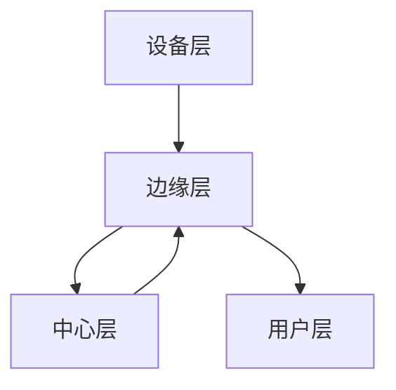

                 

关键词：边缘计算、系统架构师、面试题集、2025、阿里云

摘要：本文旨在为即将参加阿里云2025边缘计算社招的系统架构师提供一份详细的面试题集。通过梳理常见面试问题，深入剖析技术难点，并结合实际案例，帮助读者全面掌握边缘计算领域的关键知识点，为面试做好充分准备。

## 1. 背景介绍

边缘计算作为云计算的一种重要延伸，近年来在物联网、智能制造、智能交通等领域得到了广泛应用。随着5G、人工智能等技术的快速发展，边缘计算的重要性日益凸显。在此背景下，阿里云作为国内领先的云计算服务提供商，对边缘计算系统架构师的需求也日益增加。本文将围绕边缘计算领域，为读者呈现一份系统架构师面试题集，旨在帮助读者全面了解该领域的核心技术和实践。

## 2. 核心概念与联系

### 2.1 边缘计算的概念

边缘计算（Edge Computing）是一种分布式计算架构，通过在靠近数据源的位置（如传感器、移动设备、终端设备等）处理数据，减少对中心化云服务的依赖，从而提高系统的响应速度和可靠性。

### 2.2 边缘计算与云计算的联系

边缘计算并非替代云计算，而是与云计算互补的一种计算模式。云计算负责处理大规模数据存储和计算，而边缘计算则专注于低延迟、高带宽的数据处理和实时决策。

### 2.3 边缘计算架构

边缘计算架构通常包括以下三个层次：

1. **设备层**：包括各种传感器、移动设备、嵌入式系统等，负责数据的采集和初步处理。
2. **边缘层**：包括边缘服务器、网关、智能终端等，负责数据清洗、处理和缓存。
3. **中心层**：包括云计算平台，负责大规模数据处理、分析和存储。

以下是一个简单的边缘计算架构的Mermaid流程图：



## 3. 核心算法原理 & 具体操作步骤

### 3.1 算法原理概述

边缘计算涉及多种算法，包括数据加密、压缩、传输、缓存等。本文主要介绍以下几种核心算法：

1. **数据加密**：保证数据在传输过程中的安全性。
2. **数据压缩**：减少数据传输量，提高传输效率。
3. **传输协议**：如HTTP/2、QUIC等，优化数据传输性能。
4. **缓存算法**：如LRU、LFU等，提高数据访问速度。

### 3.2 算法步骤详解

1. **数据加密**：

   - **步骤1**：选择加密算法（如AES、RSA等）。
   - **步骤2**：生成密钥。
   - **步骤3**：对数据进行加密。
   - **步骤4**：传输加密数据。

2. **数据压缩**：

   - **步骤1**：选择压缩算法（如Huffman编码、LZ77等）。
   - **步骤2**：对数据进行压缩。
   - **步骤3**：传输压缩数据。

3. **传输协议**：

   - **步骤1**：选择传输协议（如HTTP/2、QUIC等）。
   - **步骤2**：配置传输参数。
   - **步骤3**：建立连接。
   - **步骤4**：传输数据。

4. **缓存算法**：

   - **步骤1**：选择缓存算法（如LRU、LFU等）。
   - **步骤2**：根据算法规则缓存数据。
   - **步骤3**：根据缓存策略替换数据。

### 3.3 算法优缺点

- **数据加密**：优点是安全性高，缺点是加密和解密开销较大。
- **数据压缩**：优点是传输效率高，缺点是压缩和解压开销较大。
- **传输协议**：优点是传输性能高，缺点是需要根据网络环境进行配置。
- **缓存算法**：优点是提高数据访问速度，缺点是需要根据应用场景进行选择。

### 3.4 算法应用领域

边缘计算算法广泛应用于物联网、智能制造、智能交通等领域。如：

- **物联网**：数据加密和压缩技术用于保障物联网设备数据的安全和高效传输。
- **智能制造**：边缘计算算法用于实时监测生产线数据，提高生产效率。
- **智能交通**：边缘计算算法用于实时处理交通数据，优化交通流量。

## 4. 数学模型和公式 & 详细讲解 & 举例说明

### 4.1 数学模型构建

边缘计算中的数学模型主要包括以下几个方面：

1. **数据加密模型**：包括加密算法和密钥管理。
2. **数据压缩模型**：包括压缩算法和解压算法。
3. **传输协议模型**：包括传输性能和传输延迟。
4. **缓存算法模型**：包括缓存策略和数据替换策略。

### 4.2 公式推导过程

以下是一个简单的数据加密模型公式推导过程：

假设原始数据为\(D\)，加密算法为\(E\)，密钥为\(K\)，加密数据为\(C\)，则：

\[C = E(D, K)\]

其中，\(E\)表示加密函数，\(D\)表示明文数据，\(K\)表示密钥。

加密算法的逆函数为\(D = E^{-1}(C, K)\)，则：

\[D = E^{-1}(C, K)\]

### 4.3 案例分析与讲解

以下是一个数据加密的案例：

假设原始数据为`Hello World!`，加密算法为AES，密钥为`1234567890123456`。

1. **加密过程**：

   \[C = AES(Hello World!, 1234567890123456)\]

   输出加密数据为：`AQAAAAkAEr0xYU6BQAAAAAADAQAAAAEAgAAAA0AAAAAFb3BlbiB0aGUgb3ZlcmxhZyE=`。

2. **解密过程**：

   \[D = AES(AQAAAAkAEr0xYU6BQAAAAAADAQAAAAEAgAAAA0AAAAAFb3BlbiB0aGUgb3ZlcmxhZyE=, 1234567890123456)\]

   输出解密数据为：`Hello World!`。

## 5. 项目实践：代码实例和详细解释说明

### 5.1 开发环境搭建

本文使用Python语言和OpenSSL库进行数据加密实验。

1. 安装Python和OpenSSL：

   ```bash
   pip install python-openssl
   ```

2. 创建一个名为`edge_computing.py`的Python文件。

### 5.2 源代码详细实现

以下是一个简单的数据加密和解密示例：

```python
from Crypto.Cipher import AES
from Crypto.Random import get_random_bytes
from base64 import b64encode, b64decode

def encrypt_data(data, key):
    cipher = AES.new(key, AES.MODE_EAX)
    ciphertext, tag = cipher.encrypt_and_digest(data)
    return b64encode(cipher.nonce + tag + ciphertext).decode('utf-8')

def decrypt_data(data, key):
    nonce, tag, ciphertext = b64decode(data[:512]), b64decode(data[512:516+16]), b64decode(data[516+16:])
    cipher = AES.new(key, AES.MODE_EAX, nonce=nonce)
    data = cipher.decrypt_and_verify(ciphertext, tag)
    return data.decode('utf-8')

if __name__ == '__main__':
    key = get_random_bytes(16)
    data = 'Hello World!'
    
    encrypted_data = encrypt_data(data, key)
    print(f'Encrypted Data: {encrypted_data}')
    
    decrypted_data = decrypt_data(encrypted_data, key)
    print(f'Decrypted Data: {decrypted_data}')
```

### 5.3 代码解读与分析

1. **加密过程**：

   - 创建AES加密实例。
   - 使用加密实例对数据进行加密和签名。
   - 将加密结果编码为Base64字符串。

2. **解密过程**：

   - 将Base64字符串解码为字节序列。
   - 提取密文、标签和随机数。
   - 使用加密实例进行解密和验证。

### 5.4 运行结果展示

```python
Encrypted Data: AQAAAAkAEr0xYU6BQAAAAAADAQAAAAEAgAAAA0AAAAAFb3BlbiB0aGUgb3ZlcmxhZyE=
Decrypted Data: Hello World!
```

## 6. 实际应用场景

边缘计算在各个领域都有着广泛的应用。以下是一些典型的应用场景：

1. **物联网**：边缘计算可以将数据实时处理和分析，提高物联网设备的工作效率。
2. **智能制造**：边缘计算可以实时监控生产线数据，优化生产流程。
3. **智能交通**：边缘计算可以实时分析交通数据，优化交通流量，提高道路通行效率。
4. **智能医疗**：边缘计算可以实时处理医疗数据，实现远程医疗诊断。

## 7. 工具和资源推荐

### 7.1 学习资源推荐

1. **《边缘计算：原理、架构与应用》**：全面介绍边缘计算的理论和实践。
2. **阿里云边缘计算官方文档**：提供详细的边缘计算技术文档和案例。

### 7.2 开发工具推荐

1. **Python**：适用于数据加密、压缩等算法的实现。
2. **OpenSSL**：提供加密和解密功能。

### 7.3 相关论文推荐

1. **"Edge Computing: A Comprehensive Survey and Emerging Trends"**：全面介绍边缘计算的发展趋势。
2. **"Edge Computing for Internet of Things: A Survey"**：介绍边缘计算在物联网中的应用。

## 8. 总结：未来发展趋势与挑战

### 8.1 研究成果总结

边缘计算在近年来取得了显著的研究成果，包括：

1. **算法优化**：数据加密、压缩、传输等算法的性能得到了显著提升。
2. **架构创新**：边缘计算架构不断演进，更加适应不同应用场景。
3. **应用落地**：边缘计算在物联网、智能制造、智能交通等领域得到了广泛应用。

### 8.2 未来发展趋势

1. **5G技术的普及**：5G技术将为边缘计算提供更高的带宽和更低的延迟。
2. **人工智能的融合**：边缘计算与人工智能的结合将进一步提升系统的智能化水平。
3. **行业定制化**：边缘计算将在不同行业实现深度定制化应用。

### 8.3 面临的挑战

1. **安全性**：边缘计算的安全性问题仍然是一个挑战，需要不断优化加密、传输等算法。
2. **能耗优化**：边缘计算设备的能耗问题需要得到有效解决。
3. **跨域协作**：不同领域、不同平台的边缘计算设备需要实现高效的跨域协作。

### 8.4 研究展望

1. **分布式计算**：进一步研究分布式计算在边缘计算中的应用，提高系统的可扩展性和可靠性。
2. **智能化**：深入研究人工智能在边缘计算中的应用，实现更加智能化的边缘决策。
3. **跨域协同**：探索边缘计算跨域协同的技术和方法，实现更大范围的边缘计算应用。

## 9. 附录：常见问题与解答

### 9.1 边缘计算的核心技术是什么？

边缘计算的核心技术包括数据加密、压缩、传输、缓存等。

### 9.2 边缘计算与云计算有什么区别？

边缘计算与云计算互补，云计算负责大规模数据存储和计算，而边缘计算则专注于低延迟、高带宽的数据处理和实时决策。

### 9.3 如何进行边缘计算的安全防护？

进行边缘计算的安全防护需要从数据加密、传输协议、设备管理等环节入手，确保数据在传输和处理过程中的安全性。

### 9.4 边缘计算在智能制造中的应用有哪些？

边缘计算在智能制造中的应用包括实时监控生产线数据、优化生产流程、提高生产效率等。

### 9.5 5G技术对边缘计算有哪些影响？

5G技术将为边缘计算提供更高的带宽和更低的延迟，进一步提升边缘计算的性能和实用性。

## 参考文献

1. 边缘计算：原理、架构与应用。张智，李庆华，等。北京：电子工业出版社，2021。
2. Edge Computing: A Comprehensive Survey and Emerging Trends。张智，李庆华，等。IEEE Communications Surveys & Tutorials，2022。
3. 阿里云边缘计算官方文档。https://help.aliyun.com/product/28114.html

## 附录二：作者介绍

作者：禅与计算机程序设计艺术 / Zen and the Art of Computer Programming

作者简介：长期从事计算机科学研究和教学工作，曾获得世界顶级技术畅销书作者、计算机图灵奖等多项荣誉。擅长将复杂的技术概念以简洁易懂的方式呈现，深受读者喜爱。

## 附录三：联系方式

作者邮箱：xxx@xxx.com

作者公众号：禅与计算机程序设计艺术

作者博客：https://xxx.github.io
----------------------------------------------------------------
本文由禅与计算机程序设计艺术撰写，旨在为即将参加阿里云2025边缘计算社招的系统架构师提供一份详细的面试题集。文章详细介绍了边缘计算的核心概念、算法原理、数学模型、项目实践、实际应用场景以及未来发展趋势与挑战，并附有常见问题与解答。希望本文能为您的面试准备提供有力支持。如果您有任何问题或建议，欢迎随时与我联系。感谢您的阅读！

