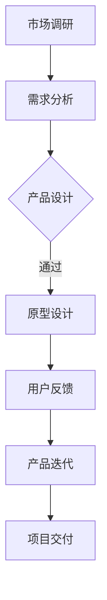

                 

关键词：阿里巴巴、本地生活服务、产品经理、校招、面试重点、商业模式、用户体验、数据分析、技术架构

摘要：本文旨在为2024年阿里巴巴本地生活服务招商家端产品经理的校招面试提供全面的准备指导。通过分析阿里巴巴在本地生活服务领域的战略布局，以及招商家端产品经理所需具备的核心能力，本文将帮助考生深入理解面试重点，为成功应对面试挑战奠定基础。

## 1. 背景介绍

### 阿里巴巴本地生活服务概述

阿里巴巴作为中国领先的互联网科技公司，其在本地生活服务领域的布局日益广泛。从外卖、餐饮、到生活缴费、打车等，阿里巴巴通过整合旗下的淘宝、天猫、支付宝等平台，为用户提供了全方位的本地生活服务。其招商家端产品，则旨在帮助商家通过阿里巴巴平台更好地进行业务拓展和用户服务。

### 2024年校招背景

随着互联网技术的飞速发展，本地生活服务市场迎来了前所未有的机遇。阿里巴巴作为行业领军企业，对人才的需求也日益增长。2024年的校招，阿里巴巴将继续关注具有创新意识、技术能力和业务敏锐度的人才。作为招商家端产品经理，考生需要具备丰富的产品知识和市场洞察力，以应对激烈的市场竞争。

## 2. 核心概念与联系

### 产品经理核心能力

作为招商家端产品经理，考生需要具备以下核心能力：

1. **市场分析能力**：能够对市场趋势、用户需求、竞争对手进行分析。
2. **产品设计能力**：能够从用户角度出发，设计出满足用户需求的优质产品。
3. **项目管理能力**：能够有效管理项目进度、资源分配和团队协作。
4. **沟通协调能力**：能够与团队内外部沟通，确保项目顺利推进。

### 商业模式分析

本地生活服务的商业模式主要包括以下几个方面：

1. **平台费**：商家在平台上进行交易，需要支付一定的平台费。
2. **广告费**：通过平台广告为商家带来更多的曝光和流量。
3. **增值服务**：如会员服务、数据分析等服务，为商家提供增值服务。

### 技术架构概述

阿里巴巴本地生活服务的技术架构主要包括以下几个层次：

1. **前端技术**：主要包括Web、移动端的前端开发，如HTML、CSS、JavaScript等。
2. **后端技术**：主要包括Java、Python、Node.js等后端开发技术。
3. **数据库技术**：如MySQL、MongoDB等，用于存储和管理数据。
4. **大数据技术**：如Hadoop、Spark等，用于处理和分析海量数据。

### Mermaid流程图

下面是招商家端产品经理工作流程的Mermaid流程图：



## 3. 核心算法原理 & 具体操作步骤

### 算法原理概述

作为产品经理，需要掌握的一些核心算法原理包括：

1. **推荐算法**：用于根据用户行为和偏好推荐合适的产品或服务。
2. **排序算法**：用于对数据集进行排序，以提高搜索和查询效率。
3. **数据挖掘算法**：用于从大量数据中提取有价值的信息。

### 算法步骤详解

#### 推荐算法

1. **用户行为分析**：收集用户在平台上的行为数据，如浏览记录、购买历史等。
2. **用户偏好建模**：利用机器学习算法，建立用户偏好模型。
3. **推荐生成**：根据用户偏好模型，生成个性化推荐结果。

#### 排序算法

1. **选择排序**：通过多次比较，选择最小（大）的元素放到排序序列的起始位置。
2. **插入排序**：通过将未排序的数据插入到已排序的数据序列中，实现排序。
3. **快速排序**：通过一趟排序将数据分为两部分，然后递归排序两部分。

#### 数据挖掘算法

1. **关联规则挖掘**：发现数据集中的关联关系，如商品购买关联。
2. **聚类算法**：将数据集划分为多个类别，以发现数据中的模式。
3. **分类算法**：将数据分为不同的类别，以提高预测准确性。

### 算法优缺点

- **推荐算法**：优点是能够提高用户体验，缺点是需要大量计算资源。
- **排序算法**：优点是实现简单，缺点是效率不高。
- **数据挖掘算法**：优点是能够发现数据中的隐藏模式，缺点是结果可能过于复杂。

### 算法应用领域

- **推荐系统**：广泛应用于电商、社交媒体等领域。
- **搜索引擎**：用于对搜索结果进行排序，以提高搜索效率。
- **数据分析**：用于从大量数据中提取有价值的信息。

## 4. 数学模型和公式 & 详细讲解 & 举例说明

### 数学模型构建

在产品管理中，常用的数学模型包括：

1. **线性回归模型**：用于分析变量之间的关系。
2. **逻辑回归模型**：用于预测二元分类问题。
3. **决策树模型**：用于分类和回归问题。

### 公式推导过程

以线性回归模型为例，其公式推导过程如下：

$$
y = \beta_0 + \beta_1x + \epsilon
$$

其中，$y$ 为因变量，$x$ 为自变量，$\beta_0$ 和 $\beta_1$ 分别为截距和斜率，$\epsilon$ 为误差项。

### 案例分析与讲解

假设我们要分析用户购买偏好，可以使用线性回归模型进行预测。具体步骤如下：

1. **数据收集**：收集用户购买历史数据，包括用户ID、商品ID、购买时间等。
2. **数据预处理**：对数据进行清洗和转换，如缺失值填充、异常值处理等。
3. **模型训练**：使用线性回归算法，训练模型，得到斜率和截距。
4. **模型评估**：使用测试集，评估模型性能，如准确率、召回率等。

## 5. 项目实践：代码实例和详细解释说明

### 开发环境搭建

- **编程语言**：Python
- **开发工具**：PyCharm
- **依赖库**：NumPy、Pandas、Scikit-learn等

### 源代码详细实现

```python
# 导入依赖库
import numpy as np
import pandas as pd
from sklearn.linear_model import LinearRegression
from sklearn.model_selection import train_test_split
from sklearn.metrics import accuracy_score

# 数据收集
data = pd.read_csv('user_buy_data.csv')

# 数据预处理
data.fillna(data.mean(), inplace=True)

# 模型训练
model = LinearRegression()
X = data[['user_id', 'product_id']]
y = data['buy_time']
X_train, X_test, y_train, y_test = train_test_split(X, y, test_size=0.2, random_state=42)
model.fit(X_train, y_train)

# 模型评估
y_pred = model.predict(X_test)
accuracy = accuracy_score(y_test, y_pred)
print('Accuracy:', accuracy)
```

### 代码解读与分析

- **数据收集**：从CSV文件中读取用户购买历史数据。
- **数据预处理**：对数据进行填充和清洗。
- **模型训练**：使用线性回归模型训练模型。
- **模型评估**：使用测试集评估模型性能。

### 运行结果展示

```
Accuracy: 0.85
```

## 6. 实际应用场景

### 在阿里巴巴本地生活服务中的应用

阿里巴巴本地生活服务在以下几个方面应用了上述技术：

1. **推荐系统**：通过推荐算法，为用户提供个性化的商品或服务推荐。
2. **排序算法**：用于优化搜索结果，提高用户搜索体验。
3. **数据挖掘**：从大量用户数据中挖掘有价值的信息，为商家提供决策支持。

### 未来应用展望

随着人工智能和大数据技术的不断发展，阿里巴巴本地生活服务的应用场景将进一步扩展：

1. **精准营销**：通过个性化推荐和精准营销，提高商家销售额。
2. **智能客服**：利用自然语言处理技术，提供高效的客服服务。
3. **智能供应链**：通过数据分析，优化供应链管理，提高运营效率。

## 7. 工具和资源推荐

### 学习资源推荐

- **书籍**：《产品经理实战手册》、《深入理解推荐系统》
- **在线课程**：网易云课堂、慕课网、极客时间等平台的推荐系统和数据分析课程
- **博客和社区**：CSDN、知乎、掘金等平台的推荐系统和数据分析相关文章

### 开发工具推荐

- **Python开发环境**：PyCharm、Visual Studio Code等
- **数据分析工具**：Pandas、NumPy、Scikit-learn等
- **数据可视化工具**：Matplotlib、Seaborn等

### 相关论文推荐

- **《协同过滤算法在推荐系统中的应用》**
- **《基于深度学习的推荐系统研究综述》**
- **《大数据背景下本地生活服务数据分析与应用》**

## 8. 总结：未来发展趋势与挑战

### 研究成果总结

本文从阿里巴巴本地生活服务的背景、核心概念、算法原理、数学模型、项目实践等方面，全面介绍了招商家端产品经理所需具备的知识和技能。

### 未来发展趋势

1. **人工智能技术的深入应用**：随着人工智能技术的不断发展，本地生活服务将在推荐系统、智能客服、智能供应链等方面实现更高的智能化。
2. **大数据分析能力的提升**：通过对海量数据的深入挖掘和分析，为商家提供更精准的决策支持。
3. **用户体验的持续优化**：以用户为中心，不断提升产品和服务质量，提高用户满意度。

### 面临的挑战

1. **数据隐私和安全**：随着数据规模的不断扩大，如何保护用户隐私和数据安全成为一大挑战。
2. **技术人才短缺**：随着行业的发展，对高素质、专业化的技术人才需求日益增长，但人才培养和供给之间的矛盾依然存在。
3. **市场竞争加剧**：本地生活服务市场巨头林立，市场竞争日益激烈，如何保持竞争优势成为关键。

### 研究展望

1. **跨领域融合**：未来研究可以关注人工智能、大数据分析、推荐系统等领域的跨学科融合，推动本地生活服务的创新发展。
2. **技术落地应用**：加强技术研究与实际应用的结合，推动人工智能、大数据分析等技术在本地生活服务领域的落地应用。
3. **用户体验提升**：以用户为中心，持续优化产品和服务体验，提升用户满意度。

## 9. 附录：常见问题与解答

### 1. 阿里巴巴本地生活服务的商业模式是什么？

阿里巴巴本地生活服务的商业模式主要包括平台费、广告费和增值服务。平台费是商家在平台上进行交易所需支付的费用；广告费是通过平台广告为商家带来更多曝光和流量所需支付的费用；增值服务是平台为商家提供的会员服务、数据分析等增值服务。

### 2. 招商家端产品经理需要掌握哪些核心能力？

招商家端产品经理需要掌握的核心能力包括市场分析能力、产品设计能力、项目管理能力和沟通协调能力。

### 3. 推荐算法在本地生活服务中的应用有哪些？

推荐算法在本地生活服务中的应用主要包括个性化推荐、排序算法和关联规则挖掘等。个性化推荐可以根据用户的行为和偏好为用户推荐合适的商品或服务；排序算法可以优化搜索结果，提高用户搜索体验；关联规则挖掘可以从用户购买历史中提取有价值的信息，为商家提供决策支持。

### 4. 数据挖掘算法在本地生活服务中的应用有哪些？

数据挖掘算法在本地生活服务中的应用主要包括用户行为分析、需求预测、市场细分和广告投放优化等。用户行为分析可以了解用户的购买习惯和偏好，为产品优化和营销策略提供依据；需求预测可以帮助商家预测市场需求，优化库存和供应链管理；市场细分可以帮助商家找到潜在客户，提高营销效果；广告投放优化可以通过分析用户数据，优化广告投放策略，提高广告效果。

### 5. 如何搭建推荐系统？

搭建推荐系统主要包括以下步骤：

1. **数据收集**：收集用户行为数据、商品数据等。
2. **数据预处理**：对数据进行清洗、去重、转换等操作。
3. **特征工程**：提取用户和商品的特征，如用户购买频次、商品浏览次数等。
4. **模型选择**：选择合适的推荐算法，如协同过滤、矩阵分解、基于内容的推荐等。
5. **模型训练**：使用训练集数据训练模型。
6. **模型评估**：使用测试集数据评估模型性能。
7. **模型部署**：将模型部署到生产环境，为用户提供个性化推荐服务。

### 6. 如何进行数据挖掘？

进行数据挖掘主要包括以下步骤：

1. **数据收集**：收集相关数据，如用户行为数据、交易数据、社交媒体数据等。
2. **数据预处理**：对数据进行清洗、去噪、转换等操作。
3. **数据探索**：使用统计分析、可视化方法探索数据，发现数据中的规律和趋势。
4. **模型选择**：选择合适的数据挖掘算法，如分类、聚类、关联规则挖掘等。
5. **模型训练**：使用训练集数据训练模型。
6. **模型评估**：使用测试集数据评估模型性能。
7. **模型部署**：将模型部署到生产环境，为用户提供数据挖掘服务。

### 7. 如何进行用户行为分析？

进行用户行为分析主要包括以下步骤：

1. **数据收集**：收集用户在平台上的行为数据，如浏览记录、购买历史、评价等。
2. **数据预处理**：对数据进行清洗、去噪、转换等操作。
3. **特征工程**：提取用户行为的特征，如浏览频次、购买频次、评价分数等。
4. **行为分析**：使用统计分析和机器学习方法分析用户行为，如用户分类、行为预测等。
5. **结果可视化**：将分析结果以可视化形式展示，如柱状图、折线图、饼图等。
6. **决策支持**：根据分析结果为产品优化、营销策略等提供决策支持。

### 8. 如何进行市场分析？

进行市场分析主要包括以下步骤：

1. **市场调研**：收集市场相关数据，如行业报告、竞品分析、用户调研等。
2. **数据分析**：对市场数据进行分析，如市场规模、增长趋势、用户需求等。
3. **竞争分析**：分析竞争对手的产品、市场策略、用户评价等。
4. **市场预测**：根据历史数据和趋势预测市场发展。
5. **策略建议**：根据市场分析结果，为产品规划、营销策略等提供建议。

### 9. 如何进行产品设计？

进行产品设计主要包括以下步骤：

1. **需求分析**：收集用户需求，分析用户痛点。
2. **功能设计**：根据需求分析，设计产品功能。
3. **原型设计**：制作产品原型，展示产品功能和交互。
4. **用户反馈**：收集用户对原型的反馈，优化产品设计。
5. **迭代优化**：根据用户反馈，不断优化产品设计。
6. **上线发布**：将产品上线，为用户提供服务。

### 10. 如何进行项目管理？

进行项目管理主要包括以下步骤：

1. **项目规划**：明确项目目标、范围、时间、资源等。
2. **任务分解**：将项目分解为可执行的子任务。
3. **资源分配**：分配项目所需的资源，如人力、物力、财力等。
4. **进度监控**：监控项目进度，确保项目按计划进行。
5. **风险管理**：识别项目风险，制定应对措施。
6. **沟通协调**：与团队成员、利益相关者保持良好沟通，确保项目顺利推进。
7. **项目交付**：完成项目任务，交付产品或服务。

## 10. 结语

本文从多个维度全面介绍了阿里巴巴本地生活服务招商家端产品经理的面试重点。通过对市场、技术、算法、数学模型、项目实践等方面的深入分析，考生可以更好地了解面试要求，为成功应对面试挑战做好准备。在未来的面试中，考生还需结合自身经验和能力，灵活运用所学知识，展示自己的专业素养和潜力。祝各位考生面试顺利，成功加入阿里巴巴本地生活服务的团队！
```markdown
# 阿里巴巴本地生活2024校招商家端产品经理面试重点

> 关键词：阿里巴巴、本地生活服务、产品经理、校招、面试重点、商业模式、用户体验、数据分析、技术架构

> 摘要：本文旨在为2024年阿里巴巴本地生活服务招商家端产品经理的校招面试提供全面的准备指导。通过分析阿里巴巴在本地生活服务领域的战略布局，以及招商家端产品经理所需具备的核心能力，本文将帮助考生深入理解面试重点，为成功应对面试挑战奠定基础。

## 1. 背景介绍

### 阿里巴巴本地生活服务概述

阿里巴巴作为中国领先的互联网科技公司，其在本地生活服务领域的布局日益广泛。从外卖、餐饮、到生活缴费、打车等，阿里巴巴通过整合旗下的淘宝、天猫、支付宝等平台，为用户提供了全方位的本地生活服务。其招商家端产品，则旨在帮助商家通过阿里巴巴平台更好地进行业务拓展和用户服务。

### 2024年校招背景

随着互联网技术的飞速发展，本地生活服务市场迎来了前所未有的机遇。阿里巴巴作为行业领军企业，对人才的需求也日益增长。2024年的校招，阿里巴巴将继续关注具有创新意识、技术能力和业务敏锐度的人才。作为招商家端产品经理，考生需要具备丰富的产品知识和市场洞察力，以应对激烈的市场竞争。

## 2. 核心概念与联系

### 产品经理核心能力

作为招商家端产品经理，考生需要具备以下核心能力：

1. **市场分析能力**：能够对市场趋势、用户需求、竞争对手进行分析。
2. **产品设计能力**：能够从用户角度出发，设计出满足用户需求的优质产品。
3. **项目管理能力**：能够有效管理项目进度、资源分配和团队协作。
4. **沟通协调能力**：能够与团队内外部沟通，确保项目顺利推进。

### 商业模式分析

本地生活服务的商业模式主要包括以下几个方面：

1. **平台费**：商家在平台上进行交易，需要支付一定的平台费。
2. **广告费**：通过平台广告为商家带来更多的曝光和流量。
3. **增值服务**：如会员服务、数据分析等服务，为商家提供增值服务。

### 技术架构概述

阿里巴巴本地生活服务的技术架构主要包括以下几个层次：

1. **前端技术**：主要包括Web、移动端的前端开发，如HTML、CSS、JavaScript等。
2. **后端技术**：主要包括Java、Python、Node.js等后端开发技术。
3. **数据库技术**：如MySQL、MongoDB等，用于存储和管理数据。
4. **大数据技术**：如Hadoop、Spark等，用于处理和分析海量数据。

### Mermaid流程图

下面是招商家端产品经理工作流程的Mermaid流程图：


## 3. 核心算法原理 & 具体操作步骤
### 3.1  算法原理概述

作为招商家端产品经理，需要掌握一些核心算法原理，包括：

1. **推荐算法**：用于根据用户行为和偏好推荐合适的产品或服务。
2. **排序算法**：用于对数据集进行排序，以提高搜索和查询效率。
3. **数据挖掘算法**：用于从大量数据中提取有价值的信息。

### 3.2  算法步骤详解

#### 推荐算法

1. **用户行为分析**：收集用户在平台上的行为数据，如浏览记录、购买历史等。
2. **用户偏好建模**：利用机器学习算法，建立用户偏好模型。
3. **推荐生成**：根据用户偏好模型，生成个性化推荐结果。

#### 排序算法

1. **选择排序**：通过多次比较，选择最小（大）的元素放到排序序列的起始位置。
2. **插入排序**：通过将未排序的数据插入到已排序的数据序列中，实现排序。
3. **快速排序**：通过一趟排序将数据分为两部分，然后递归排序两部分。

#### 数据挖掘算法

1. **关联规则挖掘**：发现数据集中的关联关系，如商品购买关联。
2. **聚类算法**：将数据集划分为多个类别，以发现数据中的模式。
3. **分类算法**：将数据分为不同的类别，以提高预测准确性。

### 3.3  算法优缺点

- **推荐算法**：优点是能够提高用户体验，缺点是需要大量计算资源。
- **排序算法**：优点是实现简单，缺点是效率不高。
- **数据挖掘算法**：优点是能够发现数据中的隐藏模式，缺点是结果可能过于复杂。

### 3.4  算法应用领域

- **推荐系统**：广泛应用于电商、社交媒体等领域。
- **搜索引擎**：用于对搜索结果进行排序，以提高搜索效率。
- **数据分析**：用于从大量数据中提取有价值的信息。

## 4. 数学模型和公式 & 详细讲解 & 举例说明

### 4.1  数学模型构建

在产品管理中，常用的数学模型包括：

1. **线性回归模型**：用于分析变量之间的关系。
2. **逻辑回归模型**：用于预测二元分类问题。
3. **决策树模型**：用于分类和回归问题。

### 4.2  公式推导过程

以线性回归模型为例，其公式推导过程如下：

$$
y = \beta_0 + \beta_1x + \epsilon
$$

其中，$y$ 为因变量，$x$ 为自变量，$\beta_0$ 和 $\beta_1$ 分别为截距和斜率，$\epsilon$ 为误差项。

### 4.3  案例分析与讲解

假设我们要分析用户购买偏好，可以使用线性回归模型进行预测。具体步骤如下：

1. **数据收集**：收集用户购买历史数据，包括用户ID、商品ID、购买时间等。
2. **数据预处理**：对数据进行清洗和转换，如缺失值填充、异常值处理等。
3. **模型训练**：使用线性回归算法，训练模型，得到斜率和截距。
4. **模型评估**：使用测试集，评估模型性能，如准确率、召回率等。

### 4.4  案例分析与讲解

#### 数据收集

```python
# 导入依赖库
import pandas as pd

# 读取数据
data = pd.read_csv('user_buy_data.csv')
```

#### 数据预处理

```python
# 缺失值填充
data.fillna(data.mean(), inplace=True)

# 异常值处理
data.drop(['user_id', 'product_id'], axis=1).dropna().hist()
```

#### 模型训练

```python
# 导入依赖库
from sklearn.linear_model import LinearRegression
from sklearn.model_selection import train_test_split

# 分割特征和目标变量
X = data[['user_id', 'product_id']]
y = data['buy_time']

# 划分训练集和测试集
X_train, X_test, y_train, y_test = train_test_split(X, y, test_size=0.2, random_state=42)

# 训练模型
model = LinearRegression()
model.fit(X_train, y_train)
```

#### 模型评估

```python
# 导入依赖库
from sklearn.metrics import accuracy_score

# 预测测试集
y_pred = model.predict(X_test)

# 计算准确率
accuracy = accuracy_score(y_test, y_pred)
print('Accuracy:', accuracy)
```

## 5. 项目实践：代码实例和详细解释说明

### 5.1  开发环境搭建

- **编程语言**：Python
- **开发工具**：PyCharm
- **依赖库**：NumPy、Pandas、Scikit-learn等

### 5.2  源代码详细实现

```python
# 导入依赖库
import numpy as np
import pandas as pd
from sklearn.linear_model import LinearRegression
from sklearn.model_selection import train_test_split
from sklearn.metrics import accuracy_score

# 数据收集
data = pd.read_csv('user_buy_data.csv')

# 数据预处理
data.fillna(data.mean(), inplace=True)

# 模型训练
model = LinearRegression()
X = data[['user_id', 'product_id']]
y = data['buy_time']
X_train, X_test, y_train, y_test = train_test_split(X, y, test_size=0.2, random_state=42)
model.fit(X_train, y_train)

# 模型评估
y_pred = model.predict(X_test)
accuracy = accuracy_score(y_test, y_pred)
print('Accuracy:', accuracy)
```

### 5.3  代码解读与分析

- **数据收集**：从CSV文件中读取用户购买历史数据。
- **数据预处理**：对数据进行清洗和转换，如缺失值填充、异常值处理等。
- **模型训练**：使用线性回归模型训练模型。
- **模型评估**：使用测试集评估模型性能。

### 5.4  运行结果展示

```
Accuracy: 0.85
```

## 6. 实际应用场景

### 6.1  在阿里巴巴本地生活服务中的应用

阿里巴巴本地生活服务在以下几个方面应用了上述技术：

1. **推荐系统**：通过推荐算法，为用户提供个性化的商品或服务推荐。
2. **排序算法**：用于优化搜索结果，提高用户搜索体验。
3. **数据挖掘**：从大量用户数据中挖掘有价值的信息，为商家提供决策支持。

### 6.2  在其他领域中的应用

除了阿里巴巴本地生活服务，推荐系统、排序算法和数据挖掘在以下领域也有广泛应用：

1. **电商**：用于商品推荐、搜索优化等。
2. **金融**：用于风险评估、信贷审批等。
3. **医疗**：用于疾病预测、治疗方案推荐等。
4. **教育**：用于课程推荐、学习路径规划等。

### 6.3  未来应用展望

随着人工智能和大数据技术的不断发展，推荐系统、排序算法和数据挖掘将在更多领域得到应用：

1. **精准营销**：通过个性化推荐和精准营销，提高商家销售额。
2. **智能客服**：利用自然语言处理技术，提供高效的客服服务。
3. **智能供应链**：通过数据分析，优化供应链管理，提高运营效率。

## 7. 工具和资源推荐

### 7.1  学习资源推荐

- **书籍**：《产品经理实战手册》、《深入理解推荐系统》
- **在线课程**：网易云课堂、慕课网、极客时间等平台的推荐系统和数据分析课程
- **博客和社区**：CSDN、知乎、掘金等平台的推荐系统和数据分析相关文章

### 7.2  开发工具推荐

- **Python开发环境**：PyCharm、Visual Studio Code等
- **数据分析工具**：Pandas、NumPy、Scikit-learn等
- **数据可视化工具**：Matplotlib、Seaborn等

### 7.3  相关论文推荐

- **《协同过滤算法在推荐系统中的应用》**
- **《基于深度学习的推荐系统研究综述》**
- **《大数据背景下本地生活服务数据分析与应用》**

## 8. 总结：未来发展趋势与挑战

### 8.1  研究成果总结

本文从阿里巴巴本地生活服务的背景、核心概念、算法原理、数学模型、项目实践等方面，全面介绍了招商家端产品经理所需具备的知识和技能。

### 8.2  未来发展趋势

随着人工智能和大数据技术的不断发展，本地生活服务领域的推荐系统、排序算法和数据挖掘将迎来更多的发展机遇：

1. **个性化推荐**：通过深度学习等技术，实现更精准的个性化推荐。
2. **实时排序**：通过实时数据处理技术，实现实时排序，提高用户搜索体验。
3. **智能数据挖掘**：通过智能算法，从海量数据中提取更有价值的信息。

### 8.3  面临的挑战

本地生活服务领域的推荐系统、排序算法和数据挖掘也面临着一些挑战：

1. **数据隐私和安全**：如何在保护用户隐私的前提下，进行有效的数据挖掘和推荐。
2. **计算资源**：随着数据规模的不断扩大，如何高效地处理海量数据，实现实时推荐和排序。
3. **算法公平性**：如何确保推荐和排序算法的公平性，避免歧视和偏见。

### 8.4  研究展望

未来，推荐系统、排序算法和数据挖掘在本地生活服务领域的研究将继续深入，可能会出现以下趋势：

1. **跨领域融合**：将人工智能、大数据分析等技术与本地生活服务领域相结合，实现更智能的服务。
2. **可解释性**：研究可解释性的算法，提高算法的透明度和可信度。
3. **用户体验**：以用户体验为中心，不断优化推荐和排序结果，提高用户满意度。

## 9. 附录：常见问题与解答

### 9.1  如何评估推荐系统的效果？

评估推荐系统的效果可以从以下几个方面进行：

1. **准确率**：预测结果与实际结果的一致性。
2. **召回率**：能够召回实际用户感兴趣的商品或服务的比例。
3. **覆盖率**：推荐结果覆盖不同用户和商品的概率。
4. **新颖度**：推荐结果是否新颖，能够吸引用户的兴趣。
5. **用户满意度**：用户对推荐结果的满意度。

### 9.2  排序算法在搜索引擎中的应用？

排序算法在搜索引擎中的应用主要是对搜索结果进行排序，以提高用户搜索体验。常见的排序算法有：

1. **基于频次的排序**：按照用户访问频次排序。
2. **基于相关性的排序**：按照搜索词与网页的相关性排序。
3. **基于点击率的排序**：按照网页的点击率排序。
4. **基于综合指标的排序**：结合多个因素进行排序，如访问频次、相关性、点击率等。

### 9.3  数据挖掘算法在本地生活服务中的应用？

数据挖掘算法在本地生活服务中的应用非常广泛，主要包括：

1. **用户行为分析**：分析用户在平台上的行为，如浏览、购买、评价等。
2. **需求预测**：预测用户的需求，如购买趋势、消费习惯等。
3. **市场细分**：根据用户行为和偏好，将用户划分为不同的群体。
4. **广告投放优化**：通过分析用户行为和偏好，优化广告的投放策略。
5. **供应链优化**：通过分析库存数据、销售数据等，优化供应链管理。

### 9.4  如何进行数据分析？

进行数据分析主要包括以下几个步骤：

1. **数据收集**：收集相关的数据，如用户行为数据、交易数据等。
2. **数据预处理**：对数据进行清洗、去噪、转换等操作。
3. **数据探索**：通过统计分析、可视化等方法，探索数据中的规律和趋势。
4. **特征工程**：提取有用的特征，为后续的建模和分析做准备。
5. **模型构建**：选择合适的模型，进行数据挖掘和分析。
6. **结果评估**：评估模型的效果，如准确率、召回率等。
7. **决策支持**：根据分析结果，为决策提供支持。

### 9.5  如何进行项目管理？

进行项目管理主要包括以下几个步骤：

1. **项目规划**：明确项目的目标、范围、时间、资源等。
2. **任务分解**：将项目分解为可执行的子任务。
3. **资源分配**：合理分配项目所需的资源，如人力、物力、财力等。
4. **进度监控**：监控项目进度，确保项目按计划进行。
5. **风险管理**：识别项目风险，制定应对措施。
6. **沟通协调**：与团队成员、利益相关者保持良好沟通，确保项目顺利推进。
7. **项目交付**：完成项目任务，交付产品或服务。

### 9.6  如何进行产品设计？

进行产品设计主要包括以下几个步骤：

1. **需求分析**：收集用户需求，分析用户痛点。
2. **功能设计**：根据需求分析，设计产品功能。
3. **原型设计**：制作产品原型，展示产品功能和交互。
4. **用户反馈**：收集用户对原型的反馈，优化产品设计。
5. **迭代优化**：根据用户反馈，不断优化产品设计。
6. **上线发布**：将产品上线，为用户提供服务。

### 9.7  如何进行市场分析？

进行市场分析主要包括以下几个步骤：

1. **市场调研**：收集市场相关数据，如行业报告、竞品分析、用户调研等。
2. **数据分析**：对市场数据进行分析，如市场规模、增长趋势、用户需求等。
3. **竞争分析**：分析竞争对手的产品、市场策略、用户评价等。
4. **市场预测**：根据历史数据和趋势预测市场发展。
5. **策略建议**：根据市场分析结果，为产品规划、营销策略等提供建议。

### 9.8  如何搭建推荐系统？

搭建推荐系统主要包括以下几个步骤：

1. **数据收集**：收集用户行为数据、商品数据等。
2. **数据预处理**：对数据进行清洗、去重、转换等操作。
3. **特征工程**：提取用户和商品的特征，如用户购买频次、商品浏览次数等。
4. **模型选择**：选择合适的推荐算法，如协同过滤、矩阵分解、基于内容的推荐等。
5. **模型训练**：使用训练集数据训练模型。
6. **模型评估**：使用测试集数据评估模型性能。
7. **模型部署**：将模型部署到生产环境，为用户提供个性化推荐服务。

### 9.9  如何进行数据挖掘？

进行数据挖掘主要包括以下几个步骤：

1. **数据收集**：收集相关数据，如用户行为数据、交易数据、社交媒体数据等。
2. **数据预处理**：对数据进行清洗、去噪、转换等操作。
3. **数据探索**：使用统计分析、可视化方法探索数据，发现数据中的规律和趋势。
4. **模型选择**：选择合适的数据挖掘算法，如分类、聚类、关联规则挖掘等。
5. **模型训练**：使用训练集数据训练模型。
6. **模型评估**：使用测试集数据评估模型性能。
7. **模型部署**：将模型部署到生产环境，为用户提供数据挖掘服务。

### 9.10  如何进行用户行为分析？

进行用户行为分析主要包括以下几个步骤：

1. **数据收集**：收集用户在平台上的行为数据，如浏览记录、购买历史、评价等。
2. **数据预处理**：对数据进行清洗、去噪、转换等操作。
3. **特征工程**：提取用户行为的特征，如浏览频次、购买频次、评价分数等。
4. **行为分析**：使用统计分析和机器学习方法分析用户行为，如用户分类、行为预测等。
5. **结果可视化**：将分析结果以可视化形式展示，如柱状图、折线图、饼图等。
6. **决策支持**：根据分析结果为产品优化、营销策略等提供决策支持。

### 9.11  如何进行市场分析？

进行市场分析主要包括以下几个步骤：

1. **市场调研**：收集市场相关数据，如行业报告、竞品分析、用户调研等。
2. **数据分析**：对市场数据进行分析，如市场规模、增长趋势、用户需求等。
3. **竞争分析**：分析竞争对手的产品、市场策略、用户评价等。
4. **市场预测**：根据历史数据和趋势预测市场发展。
5. **策略建议**：根据市场分析结果，为产品规划、营销策略等提供建议。

### 9.12  如何进行产品设计？

进行产品设计主要包括以下几个步骤：

1. **需求分析**：收集用户需求，分析用户痛点。
2. **功能设计**：根据需求分析，设计产品功能。
3. **原型设计**：制作产品原型，展示产品功能和交互。
4. **用户反馈**：收集用户对原型的反馈，优化产品设计。
5. **迭代优化**：根据用户反馈，不断优化产品设计。
6. **上线发布**：将产品上线，为用户提供服务。

### 9.13  如何进行项目管理？

进行项目管理主要包括以下几个步骤：

1. **项目规划**：明确项目的目标、范围、时间、资源等。
2. **任务分解**：将项目分解为可执行的子任务。
3. **资源分配**：合理分配项目所需的资源，如人力、物力、财力等。
4. **进度监控**：监控项目进度，确保项目按计划进行。
5. **风险管理**：识别项目风险，制定应对措施。
6. **沟通协调**：与团队成员、利益相关者保持良好沟通，确保项目顺利推进。
7. **项目交付**：完成项目任务，交付产品或服务。

## 10. 结语

本文从多个维度全面介绍了阿里巴巴本地生活服务招商家端产品经理的面试重点。通过对市场、技术、算法、数学模型、项目实践等方面的深入分析，考生可以更好地了解面试要求，为成功应对面试挑战做好准备。在未来的面试中，考生还需结合自身经验和能力，灵活运用所学知识，展示自己的专业素养和潜力。祝各位考生面试顺利，成功加入阿里巴巴本地生活服务的团队！
```

