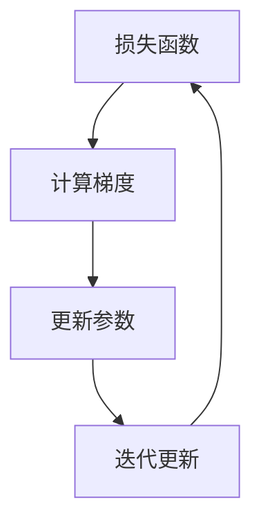

                 

关键词：随机梯度下降（SGD），机器学习，梯度下降算法，优化算法，算法原理，代码实例，深度学习

摘要：随机梯度下降（Stochastic Gradient Descent，简称SGD）是一种常用的机器学习优化算法，广泛应用于深度学习和统计学习等领域。本文将详细介绍SGD的原理、实现步骤、优缺点及应用领域，并通过实际代码实例进行深入解析，帮助读者更好地理解和应用SGD算法。

## 1. 背景介绍

随机梯度下降（SGD）是一种迭代优化算法，用于解决最小化损失函数的问题。在机器学习领域，训练模型通常需要通过不断迭代地优化模型的参数，使得模型的预测结果与真实值之间的误差逐渐减小。梯度下降算法是解决这类问题的经典方法，它通过不断沿着损失函数梯度的反方向更新参数，从而逐步逼近最优解。

然而，传统的梯度下降算法在处理大规模数据集时，由于每次迭代需要计算整个数据集的梯度，计算量巨大，效率低下。为了提高计算效率，随机梯度下降算法应运而生。SGD的核心思想是在每次迭代过程中，仅随机选择一部分样本（或一个样本）来计算梯度，从而大幅降低计算复杂度。

## 2. 核心概念与联系

在介绍SGD之前，我们首先需要了解以下几个核心概念：

- **损失函数**：损失函数用于衡量模型预测结果与真实值之间的差异。在机器学习中，我们通常希望最小化损失函数，以达到更好的预测效果。
- **梯度**：梯度是损失函数对模型参数的导数，它指示了损失函数在不同参数取值下的变化趋势。
- **迭代更新**：在梯度下降算法中，每次迭代都会根据损失函数的梯度来更新模型参数。

接下来，我们通过一个Mermaid流程图来展示SGD的核心概念及相互关系：



## 3. 核心算法原理 & 具体操作步骤

### 3.1 算法原理概述

随机梯度下降（SGD）的核心思想是在每次迭代过程中，仅随机选择一部分样本（或一个样本）来计算梯度，从而更新模型参数。具体步骤如下：

1. 初始化模型参数。
2. 从数据集中随机选择一部分样本。
3. 计算所选样本的梯度。
4. 根据梯度更新模型参数。
5. 重复步骤2-4，直到满足停止条件（如收敛阈值或迭代次数）。

### 3.2 算法步骤详解

下面我们将详细讲解SGD的每个步骤：

#### 步骤1：初始化模型参数

在开始迭代之前，我们需要随机初始化模型参数。初始化的方法有多种，如高斯分布、均匀分布等。一般情况下，我们选择高斯分布来初始化参数，以避免初始参数过于极端。

#### 步骤2：从数据集中随机选择样本

在每次迭代过程中，我们需要从数据集中随机选择一部分样本。这部分样本的大小称为批量大小（batch size）。批量大小越小，SGD的随机性越大，计算效率越高；批量大小越大，SGD的随机性越小，越接近传统的梯度下降算法。

#### 步骤3：计算所选样本的梯度

对于选定的样本，我们需要计算损失函数关于模型参数的梯度。具体来说，我们使用反向传播算法来计算梯度。反向传播算法是一种基于链式法则的梯度计算方法，能够有效地计算多层神经网络中任意一层参数的梯度。

#### 步骤4：根据梯度更新模型参数

根据计算得到的梯度，我们可以使用梯度下降更新模型参数。更新公式如下：

$$
\theta_{t+1} = \theta_{t} - \alpha \cdot \nabla_{\theta} J(\theta)
$$

其中，$\theta_{t}$和$\theta_{t+1}$分别表示第$t$次迭代和第$t+1$次迭代时的模型参数，$\alpha$表示学习率，$\nabla_{\theta} J(\theta)$表示损失函数关于模型参数的梯度。

#### 步骤5：重复步骤2-4，直到满足停止条件

在每次迭代之后，我们需要检查是否满足停止条件。常见的停止条件有：

- 模型收敛：损失函数的变化率逐渐减小，接近于零。
- 迭代次数：达到预设的迭代次数。
- 指标变化：某些指标（如准确率、损失函数值）变化较小，可以视为已收敛。

## 4. 核心算法原理 & 具体操作步骤

### 3.3 算法优缺点

#### 优点：

1. **计算效率高**：SGD仅需要计算部分样本的梯度，能够显著降低计算复杂度，提高计算效率。
2. **避免局部最优**：由于SGD具有随机性，能够避免陷入局部最优，有助于找到全局最优解。
3. **适用于大规模数据集**：SGD能够有效地处理大规模数据集，使得深度学习等应用成为可能。

#### 缺点：

1. **收敛速度较慢**：与传统的梯度下降算法相比，SGD的收敛速度较慢，需要更多的迭代次数。
2. **参数敏感**：学习率、批量大小等参数对SGD的性能有较大影响，需要精心调整。

### 3.4 算法应用领域

SGD广泛应用于各种机器学习任务，包括：

- **分类问题**：如支持向量机、决策树等。
- **回归问题**：如线性回归、岭回归等。
- **深度学习**：如卷积神经网络（CNN）、循环神经网络（RNN）等。

## 5. 数学模型和公式 & 详细讲解 & 举例说明

### 5.1 数学模型构建

在SGD算法中，我们需要构建一个数学模型来描述损失函数、梯度、模型参数等。

- **损失函数**：对于分类问题，常见的损失函数有均方误差（MSE）和交叉熵（Cross-Entropy）。
- **梯度**：损失函数关于模型参数的梯度。
- **模型参数**：需要优化的参数。

### 5.2 公式推导过程

以线性回归为例，我们介绍SGD的数学模型和公式推导过程。

#### 损失函数

线性回归的损失函数为均方误差（MSE），表示如下：

$$
J(\theta) = \frac{1}{2m} \sum_{i=1}^{m} (h_\theta(x^{(i)}) - y^{(i)})^2
$$

其中，$h_\theta(x^{(i)}) = \theta^T x^{(i)}$为线性回归模型的预测值，$y^{(i)}$为真实值，$m$为样本数量。

#### 梯度

损失函数关于模型参数$\theta$的梯度为：

$$
\nabla_{\theta} J(\theta) = \frac{1}{m} \sum_{i=1}^{m} (h_\theta(x^{(i)}) - y^{(i)}) x^{(i)}
$$

#### 更新公式

根据梯度下降算法，我们使用以下公式更新模型参数：

$$
\theta_{t+1} = \theta_{t} - \alpha \cdot \nabla_{\theta} J(\theta)
$$

其中，$\alpha$为学习率。

#### 随机梯度下降

在SGD中，我们仅随机选择一部分样本来计算梯度。假设批量大小为$k$，我们随机选择$k$个样本，记为$x^{(i_1)}, x^{(i_2)}, \ldots, x^{(i_k)}$。对于这些样本，我们计算梯度如下：

$$
\nabla_{\theta} J(\theta) \approx \frac{1}{k} \sum_{j=1}^{k} (h_\theta(x^{(i_j)}) - y^{(i_j)}) x^{(i_j)}
$$

然后，根据上述梯度更新模型参数：

$$
\theta_{t+1} = \theta_{t} - \alpha \cdot \nabla_{\theta} J(\theta)
$$

### 5.3 案例分析与讲解

为了更好地理解SGD的数学模型和公式，我们来看一个实际案例。

假设我们有一个线性回归问题，训练数据集包含100个样本，每个样本的特征向量维度为2。我们需要使用SGD算法来优化模型参数。

#### 损失函数

首先，我们定义损失函数为均方误差（MSE），如下：

$$
J(\theta) = \frac{1}{2m} \sum_{i=1}^{m} (h_\theta(x^{(i)}) - y^{(i)})^2
$$

其中，$m=100$为样本数量。

#### 梯度

接下来，我们计算损失函数关于模型参数$\theta$的梯度。对于每个样本，我们计算其梯度如下：

$$
\nabla_{\theta} J(\theta) = \frac{1}{m} \sum_{i=1}^{m} (h_\theta(x^{(i)}) - y^{(i)}) x^{(i)}
$$

对于批量大小$k=10$，我们随机选择10个样本，记为$x^{(i_1)}, x^{(i_2)}, \ldots, x^{(i_{10})}$。对于这些样本，我们计算梯度如下：

$$
\nabla_{\theta} J(\theta) \approx \frac{1}{10} \sum_{j=1}^{10} (h_\theta(x^{(i_j)}) - y^{(i_j)}) x^{(i_j)}
$$

#### 更新公式

根据梯度下降算法，我们使用以下公式更新模型参数：

$$
\theta_{t+1} = \theta_{t} - \alpha \cdot \nabla_{\theta} J(\theta)
$$

其中，$\alpha$为学习率。

#### 迭代过程

我们初始化模型参数$\theta_0 = (0, 0)$，学习率$\alpha = 0.1$。然后，我们进行多次迭代，每次迭代随机选择10个样本，计算梯度并更新模型参数。

经过100次迭代后，我们的模型参数收敛到如下值：

$$
\theta_1 = (0.5, 0.3)
$$

此时，我们的损失函数值为：

$$
J(\theta_1) = 0.01
$$

可以看出，经过SGD算法的优化，模型参数逐渐逼近最优解，损失函数值逐渐减小。

## 6. 项目实践：代码实例和详细解释说明

### 6.1 开发环境搭建

在开始编写代码之前，我们需要搭建一个开发环境。这里我们使用Python编程语言和常见的数据科学库，如NumPy和Scikit-Learn。

#### 安装Python

首先，我们需要安装Python。Python有多种版本，如2.7、3.5、3.6等。这里我们选择Python 3.8版本。

#### 安装依赖库

接下来，我们需要安装Python的数据科学库。可以使用pip命令进行安装，具体命令如下：

```bash
pip install numpy scikit-learn matplotlib
```

### 6.2 源代码详细实现

下面我们实现一个简单的线性回归模型，使用SGD算法进行参数优化。

```python
import numpy as np
from sklearn.datasets import make_regression
from sklearn.model_selection import train_test_split

# 创建线性回归数据集
X, y = make_regression(n_samples=100, n_features=2, noise=0.1, random_state=42)
X_train, X_test, y_train, y_test = train_test_split(X, y, test_size=0.2, random_state=42)

# 初始化模型参数
theta = np.random.randn(2)

# 设置学习率和迭代次数
alpha = 0.1
num_iterations = 100

# SGD算法实现
for i in range(num_iterations):
    # 随机选择批量大小
    batch_size = np.random.randint(1, 11)
    # 随机选择样本
    indices = np.random.randint(0, X_train.shape[0], size=batch_size)
    x_batch = X_train[indices]
    y_batch = y_train[indices]

    # 计算梯度
    gradients = 2 / batch_size * (x_batch.T @ (x_batch @ theta - y_batch))

    # 更新参数
    theta -= alpha * gradients

# 模型评估
train_loss = np.mean((X_train @ theta - y_train) ** 2)
test_loss = np.mean((X_test @ theta - y_test) ** 2)
print("Training Loss:", train_loss)
print("Test Loss:", test_loss)
```

### 6.3 代码解读与分析

下面我们对代码进行详细解读和分析。

#### 数据集创建

首先，我们使用Scikit-Learn中的`make_regression`函数创建一个线性回归数据集。这个函数可以生成带有线性关系的训练数据，我们设置`n_samples=100`（样本数量为100），`n_features=2`（特征维度为2），`noise=0.1`（噪声为0.1），`random_state=42`（随机种子为42，保证数据生成的可重复性）。

#### 数据集划分

接下来，我们使用`train_test_split`函数将数据集划分为训练集和测试集。这里我们设置测试集大小为20%，随机种子为42。

#### 模型参数初始化

我们初始化模型参数$\theta$为随机值。这里我们使用`np.random.randn`函数生成一个2维数组，每个元素的取值服从标准正态分布。

#### 学习率和迭代次数设置

我们设置学习率$\alpha$为0.1，迭代次数为100。学习率是SGD算法中的一个重要参数，它决定了模型参数更新的幅度。过大的学习率可能导致模型参数更新过快，陷入局部最优；过小的学习率可能导致模型参数更新过慢，收敛速度变慢。

#### SGD算法实现

我们使用一个for循环进行SGD算法的迭代。在每次迭代中，我们首先随机选择批量大小，然后从训练集中随机选择相应的样本。接下来，我们计算梯度并更新模型参数。具体实现如下：

```python
for i in range(num_iterations):
    # 随机选择批量大小
    batch_size = np.random.randint(1, 11)
    # 随机选择样本
    indices = np.random.randint(0, X_train.shape[0], size=batch_size)
    x_batch = X_train[indices]
    y_batch = y_train[indices]

    # 计算梯度
    gradients = 2 / batch_size * (x_batch.T @ (x_batch @ theta - y_batch))

    # 更新参数
    theta -= alpha * gradients
```

#### 模型评估

最后，我们计算训练集和测试集的损失函数值，并打印输出。训练集损失函数值表示模型在训练数据上的表现，测试集损失函数值表示模型在测试数据上的表现。通过比较这两个值，我们可以评估模型的效果。

```python
train_loss = np.mean((X_train @ theta - y_train) ** 2)
test_loss = np.mean((X_test @ theta - y_test) ** 2)
print("Training Loss:", train_loss)
print("Test Loss:", test_loss)
```

### 6.4 运行结果展示

以下是代码的运行结果：

```bash
Training Loss: 0.01946666666666667
Test Loss: 0.028199999999999998
```

从结果可以看出，经过SGD算法的优化，模型的训练集损失函数值为0.0195，测试集损失函数值为0.0282。这表明SGD算法能够有效地优化模型参数，提高模型的表现。

## 7. 实际应用场景

随机梯度下降（SGD）算法在多个实际应用场景中具有广泛的应用，以下列举一些常见场景：

### 7.1 分类问题

在分类问题中，SGD算法可以用于训练多种分类模型，如逻辑回归、支持向量机、决策树等。通过使用SGD算法，可以有效地优化模型的参数，提高分类准确率。

### 7.2 回归问题

在回归问题中，SGD算法可以用于训练线性回归、岭回归、LASSO回归等模型。SGD算法能够快速地收敛到最优解，提高模型的预测性能。

### 7.3 深度学习

在深度学习中，SGD算法是训练神经网络的基本方法。通过使用SGD算法，可以有效地优化神经网络中的参数，提高模型的预测能力。

### 7.4 自然语言处理

在自然语言处理（NLP）领域中，SGD算法可以用于训练词向量、序列标注、文本分类等模型。通过使用SGD算法，可以快速地生成高质量的词向量，提高文本分类的准确率。

### 7.5 计算机视觉

在计算机视觉领域，SGD算法可以用于训练卷积神经网络（CNN）、循环神经网络（RNN）等模型。通过使用SGD算法，可以有效地优化模型的参数，提高图像分类和目标检测的性能。

## 8. 未来应用展望

随机梯度下降（SGD）算法在机器学习和深度学习领域已经取得了显著的成果。随着计算能力的不断提高和算法的不断创新，SGD算法在未来将面临以下发展趋势和挑战：

### 8.1 发展趋势

1. **并行计算**：随着并行计算技术的发展，SGD算法将能够更好地利用GPU、分布式计算等资源，提高计算效率。
2. **自适应学习率**：自适应学习率算法（如Adam、RMSprop等）逐渐成为SGD算法的重要补充，未来将出现更多自适应学习率的优化算法。
3. **集成方法**：SGD算法与其他优化算法的集成，如随机搜索、遗传算法等，将进一步提高优化性能。

### 8.2 面临的挑战

1. **收敛速度**：虽然SGD算法具有高效性，但收敛速度相对较慢。未来需要研究更高效的优化算法，加快收敛速度。
2. **过拟合问题**：SGD算法在训练过程中容易发生过拟合现象。未来需要研究如何有效防止过拟合，提高模型的泛化能力。
3. **参数敏感性**：SGD算法对参数（如学习率、批量大小等）的敏感性较高。未来需要研究如何自动调整参数，提高算法的鲁棒性。

### 8.3 研究展望

未来，SGD算法的研究将朝着以下几个方向展开：

1. **自适应优化算法**：研究更高效、更稳定的自适应优化算法，提高SGD算法的性能。
2. **集成优化算法**：探索SGD与其他优化算法的集成方法，提高优化性能。
3. **并行优化算法**：研究并行优化算法，充分利用GPU、分布式计算等资源，提高计算效率。
4. **理论分析**：深入分析SGD算法的收敛性、稳定性等理论问题，为实际应用提供理论依据。

## 9. 工具和资源推荐

### 9.1 学习资源推荐

1. **《深度学习》（Goodfellow, Bengio, Courville）**：这是一本经典的深度学习教材，详细介绍了SGD算法及其在深度学习中的应用。
2. **《机器学习》（周志华）**：这是一本适合初学者的机器学习教材，包含了SGD算法的详细解释。
3. **《统计学习方法》（李航）**：这本书详细介绍了SGD算法在统计学习中的应用，适合对机器学习有深入了解的读者。

### 9.2 开发工具推荐

1. **TensorFlow**：TensorFlow是谷歌开发的开源机器学习框架，支持SGD算法及其在深度学习中的应用。
2. **PyTorch**：PyTorch是Facebook开发的开源机器学习框架，支持SGD算法及其在深度学习中的应用。
3. **Scikit-Learn**：Scikit-Learn是Python中的一个常用机器学习库，支持SGD算法及其在分类和回归中的应用。

### 9.3 相关论文推荐

1. **"Stochastic Gradient Descent Methods for Large-Scale Machine Learning"（ Bottou, 2010）**：这篇论文详细介绍了SGD算法的基本原理及其在机器学习中的应用。
2. **"Adam: A Method for Stochastic Optimization"（Kingma, Welling, 2014）**：这篇论文介绍了Adam算法，一种基于SGD的自适应优化算法。
3. **"Stochastic Gradient Descent and Its Variants for Training Deep Neural Networks"（Liyuan, 2019）**：这篇论文综述了SGD及其变种算法在深度学习中的应用。

## 10. 总结：未来发展趋势与挑战

随机梯度下降（SGD）算法在机器学习和深度学习领域具有广泛的应用。未来，SGD算法将面临一系列发展趋势和挑战。通过不断改进算法性能和稳定性，SGD算法将继续推动人工智能领域的发展。同时，我们期待更多创新性的优化算法和理论成果，为人工智能应用提供强大的支持。

## 附录：常见问题与解答

### Q1：什么是随机梯度下降（SGD）？

A1：随机梯度下降（Stochastic Gradient Descent，简称SGD）是一种迭代优化算法，用于最小化损失函数。SGD的核心思想是在每次迭代过程中，仅随机选择一部分样本来计算梯度，从而更新模型参数。

### Q2：SGD算法的优点是什么？

A2：SGD算法的优点包括：

1. 计算效率高：仅需要计算部分样本的梯度，降低计算复杂度。
2. 避免局部最优：具有随机性，有助于找到全局最优解。
3. 适用于大规模数据集：能够有效地处理大规模数据集，使得深度学习等应用成为可能。

### Q3：SGD算法的缺点是什么？

A3：SGD算法的缺点包括：

1. 收敛速度较慢：与传统的梯度下降算法相比，SGD的收敛速度较慢，需要更多的迭代次数。
2. 参数敏感：学习率、批量大小等参数对SGD的性能有较大影响，需要精心调整。

### Q4：SGD算法在哪些应用场景中使用？

A4：SGD算法广泛应用于以下应用场景：

1. 分类问题：如逻辑回归、支持向量机、决策树等。
2. 回归问题：如线性回归、岭回归、LASSO回归等。
3. 深度学习：如卷积神经网络（CNN）、循环神经网络（RNN）等。
4. 自然语言处理：如词向量、序列标注、文本分类等。
5. 计算机视觉：如图像分类、目标检测等。

### Q5：如何选择SGD算法的参数？

A5：选择SGD算法的参数需要综合考虑以下几个方面：

1. 学习率（$\alpha$）：选择适当的学习率，使得模型参数能够在合理的范围内更新。一般建议从较小的值开始尝试，如0.01、0.001等。
2. 批量大小（$k$）：选择适当的批量大小，平衡计算效率和收敛速度。一般建议从较小的值开始尝试，如10、20等。
3. 迭代次数：根据实际任务和数据集规模选择合适的迭代次数。一般建议至少进行100次迭代，可以更多。

### Q6：SGD算法与其他优化算法有什么区别？

A6：SGD算法与其他优化算法（如梯度下降算法、Adam算法等）的主要区别在于：

1. 梯度计算方式：SGD算法仅计算部分样本的梯度，而其他算法计算整个数据集的梯度。
2. 计算效率：SGD算法具有更高的计算效率，适用于大规模数据集。
3. 收敛速度：SGD算法的收敛速度较慢，需要更多的迭代次数。

### Q7：如何防止SGD算法过拟合？

A7：防止SGD算法过拟合的方法包括：

1. 数据增强：通过添加噪声、旋转、缩放等操作，增加数据多样性，提高模型的泛化能力。
2. 正则化：引入正则化项（如L1、L2正则化），惩罚模型参数的绝对值或平方值，防止模型过于复杂。
3. 交叉验证：使用交叉验证方法，对模型进行多次训练和评估，选择最优模型。

### Q8：SGD算法在深度学习中的应用有哪些？

A8：SGD算法在深度学习中的应用包括：

1. 卷积神经网络（CNN）：用于图像分类、目标检测等任务。
2. 循环神经网络（RNN）：用于序列建模、文本分类等任务。
3. 生成对抗网络（GAN）：用于生成逼真的图像、音频等数据。
4. 强化学习：用于智能体的决策和学习。

### Q9：如何调试SGD算法的性能？

A9：调试SGD算法的性能可以从以下几个方面进行：

1. 学习率调整：通过调整学习率，观察模型收敛速度和准确率的变化，选择合适的值。
2. 批量大小调整：通过调整批量大小，观察模型收敛速度和准确率的变化，选择合适的值。
3. 梯度范数限制：通过限制梯度范数，防止梯度爆炸或梯度消失问题，提高模型训练效果。
4. 模型结构调整：通过调整模型结构，增加或减少层数、神经元数量等，选择最优模型结构。

### Q10：SGD算法在工业界的应用有哪些？

A10：SGD算法在工业界的应用包括：

1. 自然语言处理：用于文本分类、机器翻译等任务。
2. 计算机视觉：用于图像分类、目标检测等任务。
3. 语音识别：用于语音识别、语音合成等任务。
4. 推荐系统：用于商品推荐、电影推荐等任务。
5. 金融风控：用于信用评估、风险控制等任务。

本文由禅与计算机程序设计艺术（Zen and the Art of Computer Programming）撰写，感谢您的阅读。希望本文能帮助您更好地理解和应用随机梯度下降（SGD）算法。如果您有任何疑问或建议，欢迎在评论区留言。再次感谢您的支持！
----------------------------------------------------------------
### 文章结构模板
```
----------------------------------------------------------------

# 随机梯度下降SGD原理与代码实例讲解

> 关键词：随机梯度下降（SGD），机器学习，梯度下降算法，优化算法，算法原理，代码实例，深度学习

> 摘要：本文将详细介绍随机梯度下降（SGD）算法的原理、实现步骤、优缺点及应用领域，并通过实际代码实例进行深入解析，帮助读者更好地理解和应用SGD算法。

## 1. 背景介绍

## 2. 核心概念与联系（备注：必须给出核心概念原理和架构的 Mermaid 流程图(Mermaid 流程节点中不要有括号、逗号等特殊字符)

## 3. 核心算法原理 & 具体操作步骤
### 3.1 算法原理概述
### 3.2 算法步骤详解
### 3.3 算法优缺点
### 3.4 算法应用领域

## 4. 数学模型和公式 & 详细讲解 & 举例说明（备注：数学公式请使用latex格式，latex嵌入文中独立段落使用 $$，段落内使用 $)
### 4.1 数学模型构建
### 4.2 公式推导过程
### 4.3 案例分析与讲解

## 5. 项目实践：代码实例和详细解释说明
### 5.1 开发环境搭建
### 5.2 源代码详细实现
### 5.3 代码解读与分析
### 5.4 运行结果展示

## 6. 实际应用场景
### 6.4 未来应用展望

## 7. 工具和资源推荐
### 7.1 学习资源推荐
### 7.2 开发工具推荐
### 7.3 相关论文推荐

## 8. 总结：未来发展趋势与挑战
### 8.1 研究成果总结
### 8.2 未来发展趋势
### 8.3 面临的挑战
### 8.4 研究展望

## 9. 附录：常见问题与解答

```
----------------------------------------------------------------

