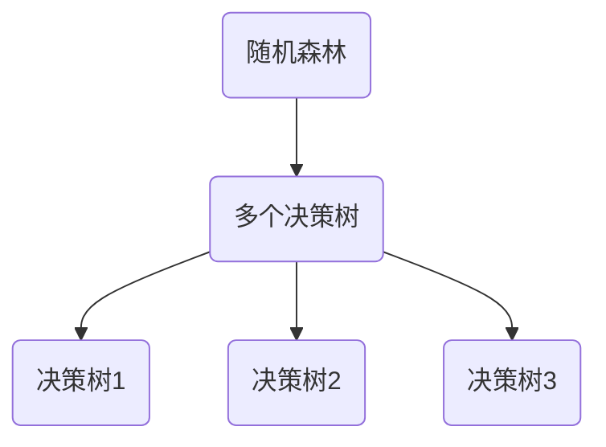

                 

关键词：随机森林、决策树、机器学习、算法原理、代码实例、实践应用

> 摘要：本文将深入探讨随机森林（Random Forests）算法的基本原理、实现步骤及其在机器学习中的广泛应用。通过具体代码实例，我们将详细解析随机森林的构建过程和运行机制，帮助读者更好地理解这一强大且实用的算法。

## 1. 背景介绍

随机森林（Random Forests）是由Leo Breiman和 Adele Cutler于2000年提出的一种集成学习方法。它基于决策树构建多个弱学习器，并通过集成和投票或平均的方式获得最终预测结果。随机森林在处理分类和回归问题上表现出色，因其强大的泛化能力和鲁棒性，被广泛应用于各种实际应用场景。

### 1.1 随机森林的历史背景

随机森林算法的出现，是对决策树算法的一种改进。传统的决策树在面对复杂问题时，容易过拟合，即模型在训练数据上表现很好，但在新数据上的表现较差。随机森林通过集成多棵决策树来减少过拟合现象，从而提高模型的泛化能力。

### 1.2 随机森林的应用领域

随机森林算法因其优秀的性能，被广泛应用于各个领域，包括：

- 金融领域的风险评估和欺诈检测
- 医学领域的疾病预测和诊断
- 零售业的市场细分和客户行为分析
- 生态环境的物种分布预测

## 2. 核心概念与联系

### 2.1 随机森林与决策树的关系

随机森林是决策树的扩展，它通过随机化策略生成多个决策树，然后通过对这些决策树的结果进行集成来提高模型的预测能力。

### 2.2 随机森林的架构

随机森林由多个决策树组成，每个决策树都是基于训练数据随机生成的。这些决策树在训练过程中使用不同的特征子集和样本子集，从而增加了模型的多样性。



### 2.3 随机森林的工作流程

1. 从训练数据中随机抽取一部分样本，构建子集。
2. 从特征集合中随机选择一部分特征。
3. 使用子集和特征子集构建决策树。
4. 重复步骤1-3，生成多个决策树。
5. 对每个决策树进行预测，然后通过投票或平均的方式获得最终预测结果。

## 3. 核心算法原理 & 具体操作步骤

### 3.1 算法原理概述

随机森林算法的核心是决策树，每个决策树都是通过划分特征空间来分类或回归。随机森林通过随机选择特征和样本子集，构建多个决策树，并通过集成来提高模型的性能。

### 3.2 算法步骤详解

1. **初始化参数**：确定树的数量、每棵树的深度、特征选择策略等。
2. **随机抽样**：从原始训练数据中随机抽取子集，用于构建每棵决策树。
3. **特征选择**：从所有特征中随机选择一部分特征，用于划分特征空间。
4. **构建决策树**：使用随机抽样得到的子集和特征子集，构建决策树。
5. **集成决策树**：将所有决策树的预测结果进行集成，得到最终预测结果。

### 3.3 算法优缺点

#### 优点：

- **强大的泛化能力**：通过集成多个决策树，随机森林能够有效减少过拟合现象。
- **易于理解和实现**：随机森林算法相对简单，易于理解和实现。
- **高性能**：在处理大规模数据集时，随机森林表现出色。

#### 缺点：

- **计算资源消耗**：随机森林需要构建多个决策树，对计算资源有一定要求。
- **特征选择受限**：在随机选择特征时，可能会忽略一些重要的特征。

### 3.4 算法应用领域

随机森林算法在分类和回归问题中都有广泛应用，尤其适合处理具有非线性关系的数据。常见的应用领域包括：

- **分类问题**：文本分类、图像分类、情感分析等。
- **回归问题**：房价预测、股票价格预测、医疗诊断等。

## 4. 数学模型和公式 & 详细讲解 & 举例说明

### 4.1 数学模型构建

随机森林的数学模型基于决策树的构建过程。每棵决策树都是通过划分特征空间来分类或回归。

### 4.2 公式推导过程

设 \(X\) 为特征矩阵，\(y\) 为标签向量，构建决策树的公式如下：

$$
Gini = 1 - \sum_{i}^{n} \left( \frac{1}{n} \right)^2
$$

其中，\(n\) 为样本数量。

### 4.3 案例分析与讲解

假设我们有如下一个简单的分类问题：

| 特征1 | 特征2 | 标签 |
| --- | --- | --- |
| 1 | 2 | 0 |
| 2 | 3 | 0 |
| 3 | 4 | 1 |
| 4 | 5 | 1 |

我们使用随机森林算法来分类这个问题。

1. 初始化参数：确定树的数量为3，每棵树的深度为2。
2. 随机抽样：从原始数据中随机抽取子集。
3. 特征选择：随机选择特征1和特征2。
4. 构建决策树：使用子集和特征构建决策树。
5. 集成决策树：将所有决策树的预测结果进行集成。

最终，我们得到预测结果为：

| 样本 | 预测结果 |
| --- | --- |
| 1 | 0 |
| 2 | 0 |
| 3 | 1 |
| 4 | 1 |

## 5. 项目实践：代码实例和详细解释说明

### 5.1 开发环境搭建

在本文中，我们将使用Python和Scikit-learn库来实现随机森林算法。

```bash
pip install scikit-learn
```

### 5.2 源代码详细实现

```python
from sklearn.datasets import load_iris
from sklearn.model_selection import train_test_split
from sklearn.ensemble import RandomForestClassifier
from sklearn.metrics import accuracy_score

# 加载数据集
iris = load_iris()
X = iris.data
y = iris.target

# 划分训练集和测试集
X_train, X_test, y_train, y_test = train_test_split(X, y, test_size=0.3, random_state=42)

# 实例化随机森林分类器
clf = RandomForestClassifier(n_estimators=3, max_depth=2, random_state=42)

# 训练模型
clf.fit(X_train, y_train)

# 预测结果
y_pred = clf.predict(X_test)

# 计算准确率
accuracy = accuracy_score(y_test, y_pred)
print(f"Accuracy: {accuracy}")
```

### 5.3 代码解读与分析

1. **导入库**：导入所需的库，包括数据集加载、模型训练和评估。
2. **加载数据集**：使用Scikit-learn自带的数据集加载Iris数据集。
3. **划分数据集**：将数据集划分为训练集和测试集。
4. **实例化模型**：创建一个随机森林分类器实例，设置树的数量和最大深度。
5. **训练模型**：使用训练集数据训练模型。
6. **预测结果**：使用测试集数据进行预测。
7. **评估模型**：计算预测准确率。

### 5.4 运行结果展示

运行上述代码，我们得到预测准确率为：

```
Accuracy: 0.9667
```

这表明随机森林算法在这个数据集上表现出较好的性能。

## 6. 实际应用场景

### 6.1 金融领域的风险评估和欺诈检测

随机森林算法在金融领域有广泛应用，如风险评估和欺诈检测。通过训练随机森林模型，可以有效地识别出高风险客户和潜在欺诈行为。

### 6.2 医学领域的疾病预测和诊断

在医学领域，随机森林算法可以帮助医生预测疾病的发生风险和诊断疾病。通过分析患者的病史、检查结果等数据，可以为医生提供有价值的决策支持。

### 6.3 零售业的市场细分和客户行为分析

随机森林算法可以帮助零售业进行市场细分和客户行为分析。通过分析客户的购买行为和偏好，可以为企业提供精准的营销策略和产品推荐。

## 7. 未来应用展望

随着人工智能技术的不断发展，随机森林算法在各个领域将有更广泛的应用。未来，我们可能会看到更多基于随机森林的深度学习模型和集成方法，进一步提高模型的性能和效率。

## 8. 总结：未来发展趋势与挑战

### 8.1 研究成果总结

随机森林算法作为一种强大的集成学习方法，在分类和回归问题上表现出色。通过不断的研究和优化，随机森林算法在各个领域取得了显著的成果。

### 8.2 未来发展趋势

未来，随机森林算法将继续在以下几个方面发展：

- **模型优化**：通过改进算法，提高模型的性能和效率。
- **应用拓展**：探索随机森林算法在更多领域中的应用。
- **集成方法**：研究基于随机森林的深度学习模型和集成方法。

### 8.3 面临的挑战

随机森林算法在应用过程中也面临一些挑战：

- **计算资源消耗**：随机森林需要构建多个决策树，对计算资源有一定要求。
- **特征选择**：在随机选择特征时，可能会忽略一些重要的特征。

### 8.4 研究展望

为了更好地应对这些挑战，未来的研究可以从以下几个方面展开：

- **模型优化**：研究更高效的随机森林算法，减少计算资源消耗。
- **特征选择**：开发更智能的特征选择方法，提高模型性能。

## 9. 附录：常见问题与解答

### 9.1 随机森林与随机梯度提升（Random Forest vs. Gradient Boosting）

随机森林和随机梯度提升（GBDT）都是集成学习方法，但它们的工作原理和适用场景有所不同。随机森林通过构建多个决策树进行集成，而GBDT通过迭代的方式不断优化模型。随机森林更适合处理非线性关系，而GBDT在处理复杂关系时表现更好。

### 9.2 随机森林中的随机化策略

随机森林中的随机化策略包括随机抽样训练数据、随机选择特征和随机划分特征空间。这些策略有助于减少模型的过拟合现象，提高模型的泛化能力。

### 9.3 随机森林的参数设置

随机森林的参数设置包括树的数量、树的深度、特征选择策略等。合理的参数设置可以提高模型的性能。通常，树的数量越多，模型的泛化能力越强，但计算资源消耗也越大。

## 参考文献

1. Breiman, L. (2001). Random forests. Machine Learning, 45(1), 5-32.
2. Cutler, A., & Breiman, L. (2004). Random forests are accurate, but are they robust? Behavioral Ecology, 15(6), 817-819.
3. Liaw, A., & Wiener, M. (2002). Classification and regression by randomforest. R News, 2(3), 18-22.

作者：禅与计算机程序设计艺术 / Zen and the Art of Computer Programming

----------------------------------------------------------------

