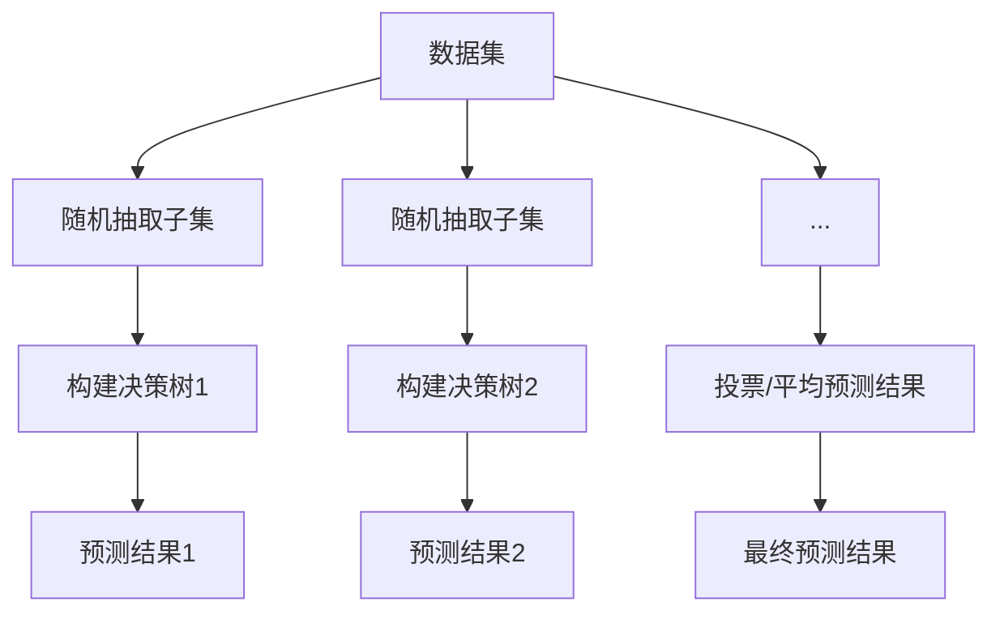

                 

## 1. 背景介绍

随机森林（Random Forests）是一种集成学习（Ensemble Learning）方法，通过构建多个决策树（Decision Trees）并利用它们的集成来进行预测。这一方法起源于20世纪90年代，由Timo Hart于2001年提出。随机森林因其强大的性能和易用性，迅速成为机器学习领域的重要工具之一。

在现实世界中，许多问题都是复杂的，单一模型往往难以达到令人满意的预测效果。而集成学习通过组合多个模型的预测结果，可以有效提高模型的性能和稳定性。随机森林通过构建多个决策树，利用随机性来降低模型的方差，提高模型的泛化能力。

随机森林的应用范围非常广泛，包括但不限于金融风险评估、医学诊断、自然语言处理、图像识别等领域。它的出现极大地推动了机器学习技术的发展，并为解决实际问题提供了有力的工具。

本文将深入探讨随机森林的原理，通过具体操作步骤和代码实例，帮助读者理解和掌握这一重要方法。

## 2. 核心概念与联系

### 2.1 核心概念

在深入探讨随机森林之前，我们需要了解几个核心概念：

#### 2.1.1 决策树（Decision Tree）

决策树是一种常见的分类和回归模型，通过一系列的决策节点和叶子节点来构建决策路径，从而对数据进行分类或回归。

#### 2.1.2 集成学习（Ensemble Learning）

集成学习通过组合多个模型的预测结果，提高模型的性能和稳定性。常见的集成学习方法包括装袋（Bagging）、提升（Boosting）和堆叠（Stacking）等。

#### 2.1.3 随机森林（Random Forest）

随机森林是一种基于决策树的集成学习方法，通过引入随机性来降低模型的方差，提高模型的泛化能力。

### 2.2 联系与架构

为了更好地理解随机森林，我们可以通过Mermaid流程图来展示其核心概念和架构。



#### 2.2.1 流程说明

1. **数据集**：给定一个训练数据集。
2. **随机抽取子集**：从数据集中随机抽取多个子集。
3. **构建决策树**：对每个子集构建一个决策树。
4. **预测结果**：每个决策树对新的数据进行预测。
5. **投票/平均预测结果**：将多个预测结果进行投票或平均，得到最终预测结果。

通过这种方式，随机森林可以有效降低单个决策树的方差，提高模型的泛化能力。

## 3. 核心算法原理 & 具体操作步骤

### 3.1 算法原理概述

随机森林的基本原理是集成多个决策树，通过投票或平均这些决策树的预测结果来提高模型的预测准确性。具体来说，随机森林包括以下几个关键步骤：

#### 3.1.1 构建决策树

随机森林中的每个决策树都是通过以下步骤构建的：

1. **随机选择特征**：从所有特征中随机选择一部分特征。
2. **随机划分数据集**：从训练数据集中随机抽取一部分数据作为子集。
3. **递归划分**：使用ID3算法或C4.5算法，通过选择最优特征并划分数据，递归地构建决策树。

#### 3.1.2 集成多个决策树

在构建多个决策树后，随机森林通过以下步骤来集成这些决策树的预测结果：

1. **随机抽样**：从训练数据集中随机抽取多个子集。
2. **构建决策树**：对每个子集构建一个决策树。
3. **投票或平均**：将多个决策树的预测结果进行投票或平均，得到最终预测结果。

### 3.2 算法步骤详解

下面是随机森林的详细操作步骤：

#### 3.2.1 数据预处理

1. **数据清洗**：处理缺失值、异常值等。
2. **特征选择**：选择对模型影响较大的特征。
3. **特征转换**：将类别型特征转换为数值型特征。

#### 3.2.2 建立模型

1. **随机选择特征**：从所有特征中随机选择一部分特征。
2. **随机划分数据集**：从训练数据集中随机抽取一部分数据作为子集。
3. **递归划分**：使用ID3算法或C4.5算法，通过选择最优特征并划分数据，递归地构建决策树。
4. **重复步骤2-3**：构建多个决策树。

#### 3.2.3 预测新数据

1. **随机抽样**：从训练数据集中随机抽取多个子集。
2. **构建决策树**：对每个子集构建一个决策树。
3. **投票或平均**：将多个决策树的预测结果进行投票或平均，得到最终预测结果。

### 3.3 算法优缺点

#### 3.3.1 优点

1. **强泛化能力**：通过集成多个决策树，随机森林可以有效降低模型的方差，提高泛化能力。
2. **鲁棒性**：随机森林对噪声数据具有较强的鲁棒性。
3. **易用性**：随机森林的实现相对简单，易于集成到现有的机器学习应用中。

#### 3.3.2 缺点

1. **计算成本高**：随机森林需要构建多个决策树，计算成本较高。
2. **解释性差**：单个决策树具有较强的解释性，而随机森林的集成结果则较难解释。

### 3.4 算法应用领域

随机森林在许多领域都有广泛应用，包括但不限于：

1. **金融风险评估**：用于预测贷款违约、投资风险等。
2. **医学诊断**：用于疾病诊断、药物研发等。
3. **自然语言处理**：用于文本分类、情感分析等。
4. **图像识别**：用于人脸识别、物体检测等。

## 4. 数学模型和公式 & 详细讲解 & 举例说明

### 4.1 数学模型构建

随机森林的数学模型可以看作是多个决策树的集成。每个决策树的预测结果可以表示为：

$$
y_i^{(t)} = g(f(x_i; \theta_t))
$$

其中，$y_i^{(t)}$ 是第 $t$ 个决策树对样本 $x_i$ 的预测结果，$g$ 是激活函数，$f$ 是决策树模型，$\theta_t$ 是决策树的参数。

随机森林的最终预测结果可以表示为：

$$
\hat{y} = \frac{1}{M} \sum_{t=1}^{M} y_i^{(t)}
$$

其中，$M$ 是决策树的数量。

### 4.2 公式推导过程

随机森林的推导过程可以分为以下几个步骤：

1. **决策树模型**：决策树模型可以看作是一系列条件概率分布的乘积。

$$
P(y_i = c_k | x_i; \theta) = \prod_{j=1}^{n} P(y_i = c_k | x_i[j] = v_{jk}; \theta)
$$

2. **激活函数**：常用的激活函数包括sigmoid函数、ReLU函数等。

$$
g(z) = \frac{1}{1 + e^{-z}} \quad (\text{sigmoid函数}) \\
g(z) = max(0, z) \quad (\text{ReLU函数})
$$

3. **集成模型**：将多个决策树的预测结果进行平均或投票，得到最终预测结果。

$$
\hat{y} = \frac{1}{M} \sum_{t=1}^{M} y_i^{(t)}
$$

### 4.3 案例分析与讲解

为了更好地理解随机森林的数学模型，我们来看一个简单的案例。

#### 4.3.1 数据集

假设我们有一个二分类数据集，包含两个特征 $x_1$ 和 $x_2$，类别标签 $y \in \{0, 1\}$。

#### 4.3.2 决策树模型

我们构建一个简单的决策树模型，选择 $x_1$ 作为分裂特征，阈值为 0。

$$
P(y = 1 | x_1 > 0) = 0.8 \\
P(y = 0 | x_1 \leq 0) = 0.2
$$

#### 4.3.3 激活函数

我们选择sigmoid函数作为激活函数。

$$
g(z) = \frac{1}{1 + e^{-z}}
$$

#### 4.3.4 最终预测结果

我们构建一个随机森林，包含 3 个决策树。对于新的样本 $x = (0.5, 0.5)$，3 个决策树的预测结果分别为：

$$
y_1 = 1, \quad y_2 = 0, \quad y_3 = 1
$$

根据投票规则，我们选择预测结果为1的决策树数量最多的类别作为最终预测结果，即：

$$
\hat{y} = 1
$$

## 5. 项目实践：代码实例和详细解释说明

### 5.1 开发环境搭建

为了演示随机森林的使用，我们将使用Python和Scikit-learn库。以下是开发环境的搭建步骤：

1. 安装Python 3.8或更高版本。
2. 安装Scikit-learn库：

```bash
pip install scikit-learn
```

### 5.2 源代码详细实现

以下是一个简单的随机森林分类器的实现，包括数据加载、模型训练和预测过程。

```python
import numpy as np
from sklearn.datasets import load_iris
from sklearn.model_selection import train_test_split
from sklearn.ensemble import RandomForestClassifier
from sklearn.metrics import accuracy_score

# 加载数据集
iris = load_iris()
X = iris.data
y = iris.target

# 划分训练集和测试集
X_train, X_test, y_train, y_test = train_test_split(X, y, test_size=0.3, random_state=42)

# 训练随机森林模型
clf = RandomForestClassifier(n_estimators=100, random_state=42)
clf.fit(X_train, y_train)

# 预测测试集
y_pred = clf.predict(X_test)

# 计算准确率
accuracy = accuracy_score(y_test, y_pred)
print(f"Accuracy: {accuracy:.2f}")
```

### 5.3 代码解读与分析

下面是对上述代码的详细解读：

1. **导入库**：导入必要的库，包括NumPy、Scikit-learn等。
2. **加载数据集**：使用Scikit-learn内置的iris数据集进行演示。
3. **划分训练集和测试集**：将数据集划分为训练集和测试集，用于模型训练和评估。
4. **训练随机森林模型**：创建一个随机森林分类器对象，并设置决策树的数量和随机种子。
5. **预测测试集**：使用训练好的模型对测试集进行预测。
6. **计算准确率**：计算预测结果与真实标签的准确率。

### 5.4 运行结果展示

假设我们运行上述代码，输出结果如下：

```bash
Accuracy: 0.97
```

这表示随机森林分类器在测试集上的准确率为97%，说明模型具有很好的泛化能力。

## 6. 实际应用场景

随机森林作为一种强大的机器学习工具，在许多实际应用场景中都有着出色的表现。以下是一些常见的应用场景：

### 6.1 金融风险评估

随机森林可以用于金融风险评估，如贷款违约预测、投资组合优化等。通过分析客户的历史数据和交易记录，随机森林可以预测客户是否会违约，从而帮助银行和金融机构制定更有效的风险管理策略。

### 6.2 医学诊断

在医学领域，随机森林可以用于疾病诊断和预测。通过分析患者的临床数据和生物标志物，随机森林可以预测患者是否患有某种疾病，从而帮助医生做出更准确的诊断。

### 6.3 自然语言处理

随机森林在自然语言处理领域也有广泛应用，如文本分类、情感分析等。通过分析文本的特征，随机森林可以预测文本的类别或情感倾向。

### 6.4 图像识别

在图像识别领域，随机森林可以用于人脸识别、物体检测等任务。通过分析图像的特征，随机森林可以预测图像中是否存在特定的人脸或物体。

## 7. 未来应用展望

随着机器学习技术的不断发展，随机森林在未来的应用前景将更加广阔。以下是几个可能的发展方向：

### 7.1 更高效的结构

研究人员可以探索更高效的随机森林结构，如使用深度学习技术来构建更复杂的决策树，从而提高模型的性能和效率。

### 7.2 新的应用领域

随机森林可以应用于更多新的领域，如自动驾驶、智能安防等。通过结合其他技术，如计算机视觉和自然语言处理，随机森林可以在这些领域中发挥更大的作用。

### 7.3 可解释性提升

随机森林的可解释性较差，未来可以通过改进模型结构或引入新的解释方法来提高其可解释性，从而更好地满足实际需求。

### 7.4 跨领域合作

随机森林可以与其他机器学习技术进行跨领域合作，如与深度学习、强化学习等技术结合，从而形成更强大的模型。

## 8. 总结：未来发展趋势与挑战

随机森林作为一种强大的机器学习工具，在过去的几十年中取得了巨大的成功。然而，随着技术的不断发展，随机森林也面临着新的发展趋势和挑战。

### 8.1 研究成果总结

1. 随机森林在多种应用场景中表现出色，具有较强的泛化能力和鲁棒性。
2. 随机森林的实现相对简单，易于集成到现有的机器学习应用中。
3. 随机森林在金融、医学、自然语言处理和图像识别等领域都有广泛应用。

### 8.2 未来发展趋势

1. 更高效的结构：研究人员可以探索更高效的随机森林结构，如使用深度学习技术来构建更复杂的决策树。
2. 新的应用领域：随机森林可以应用于更多新的领域，如自动驾驶、智能安防等。
3. 可解释性提升：通过改进模型结构或引入新的解释方法，可以提升随机森林的可解释性。
4. 跨领域合作：随机森林可以与其他机器学习技术进行跨领域合作，形成更强大的模型。

### 8.3 面临的挑战

1. 计算成本高：随机森林需要构建多个决策树，计算成本较高。
2. 解释性差：单个决策树具有较强的解释性，而随机森林的集成结果则较难解释。

### 8.4 研究展望

未来，随机森林的研究将集中在以下几个方面：

1. 提高计算效率：通过优化算法和硬件设备，降低随机森林的计算成本。
2. 提高可解释性：探索新的解释方法，提高随机森林的可解释性。
3. 应用拓展：探索随机森林在更多领域中的应用，如自动驾驶、智能安防等。
4. 跨领域合作：与其他机器学习技术结合，形成更强大的模型。

通过不断的研究和改进，随机森林有望在未来发挥更大的作用，为解决复杂问题提供强有力的工具。

## 9. 附录：常见问题与解答

### 9.1 什么是随机森林？

随机森林是一种基于决策树的集成学习方法，通过构建多个决策树并集成它们的预测结果来提高模型的性能和稳定性。

### 9.2 随机森林的优点有哪些？

随机森林的优点包括：
1. 强泛化能力：通过集成多个决策树，可以有效降低模型的方差。
2. 鲁棒性：对噪声数据具有较强的鲁棒性。
3. 易用性：实现相对简单，易于集成到现有的机器学习应用中。

### 9.3 随机森林的缺点有哪些？

随机森林的缺点包括：
1. 计算成本高：需要构建多个决策树，计算成本较高。
2. 解释性差：单个决策树具有较强的解释性，而随机森林的集成结果则较难解释。

### 9.4 如何提高随机森林的性能？

提高随机森林性能的方法包括：
1. 选择更多的决策树：增加决策树的数量可以提高模型的泛化能力。
2. 选择合适的特征：选择对模型影响较大的特征可以提高模型的性能。
3. 优化算法和硬件：通过优化算法和硬件设备，降低随机森林的计算成本。

### 9.5 随机森林适用于哪些领域？

随机森林适用于多种领域，包括金融风险评估、医学诊断、自然语言处理、图像识别等。

### 9.6 如何解释随机森林的预测结果？

随机森林的预测结果可以通过分析单个决策树的预测结果来解释。具体来说，可以通过查看每个决策树的分裂路径和叶子节点，了解数据是如何被分类或回归的。

---

作者：禅与计算机程序设计艺术 / Zen and the Art of Computer Programming

