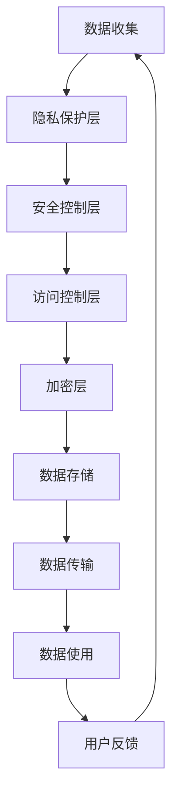

                 

关键词：隐私保护、安全措施、计算模型、算法、数学模型、实际应用、未来展望

> 摘要：本文深入探讨了隐私与安全在人类计算中的关键问题。首先，介绍了隐私与安全的背景及其重要性。接着，详细阐述了核心概念与联系，并通过Mermaid流程图展示了相关的计算架构。随后，我们分析了核心算法原理、具体操作步骤、算法优缺点及其应用领域。文章还介绍了数学模型和公式，并通过实际案例进行了详细讲解。此外，提供了项目实践中的代码实例和解释，展示了算法在实际应用中的效果。文章最后讨论了隐私与安全在实际应用场景中的重要性，并展望了未来发展趋势与挑战。

## 1. 背景介绍

在当今数字化时代，隐私与安全成为人类计算中最为关键的问题。随着互联网和大数据的快速发展，个人数据的价值愈发凸显，同时也带来了隐私泄露和信息安全风险。隐私与安全的挑战不仅涉及到技术层面，还关系到法律、伦理和社会等多个方面。

隐私指的是个人信息的保密性和控制权。在计算领域，隐私保护主要涉及到数据的收集、存储、传输和使用过程。而安全则是指确保系统、数据和资源免受未经授权的访问、篡改、破坏和泄露。随着云计算、物联网和区块链等新技术的兴起，隐私与安全的问题变得更加复杂和严峻。

隐私与安全的关注点主要包括以下几个方面：

1. **数据收集与使用**：在数据驱动的社会中，数据的收集和使用已经成为企业和政府的重要手段。然而，未经授权的数据收集和使用可能导致隐私泄露，影响个人和社会的稳定。

2. **数据存储与保护**：数据存储的安全性问题一直是隐私与安全领域的重点。如何确保数据在存储过程中的安全性，防止数据泄露、丢失和破坏，是当前亟待解决的问题。

3. **数据传输与通信**：数据在网络中的传输过程中，容易受到网络攻击和窃听。如何确保数据传输的安全性，防止数据被篡改、窃取和泄露，是隐私与安全的一个重要方面。

4. **用户行为隐私**：随着智能设备和传感器技术的发展，用户的行为数据被大量收集。如何保护用户行为隐私，防止个人隐私被滥用，是一个重要的社会问题。

5. **法律法规与伦理**：隐私与安全涉及到法律法规和伦理问题。如何制定和完善相关法律法规，确保隐私与安全得到有效保护，是一个重要的研究方向。

本文将从算法原理、数学模型、实际应用等方面，深入探讨隐私与安全在人类计算中的关键问题，旨在为读者提供全面的了解和思考。

## 2. 核心概念与联系

在探讨隐私与安全之前，我们需要了解一些核心概念，它们构成了隐私与安全计算的基础。

### 2.1. 隐私保护的基本概念

隐私保护主要涉及以下几个方面：

- **数据匿名化**：通过将数据中的个人标识信息去除，实现数据的匿名化，从而保护个人隐私。
- **数据加密**：对数据进行加密处理，确保只有授权用户能够解密和访问数据。
- **访问控制**：通过访问控制机制，限制对数据的访问权限，确保数据不被未授权的用户访问。
- **隐私政策**：制定隐私政策，明确数据收集、使用和共享的方式，保护用户的知情权和选择权。

### 2.2. 安全措施的基本概念

安全措施主要包括以下几个方面：

- **网络安全**：确保网络中的设备和数据免受攻击，包括网络防火墙、入侵检测系统等。
- **系统安全**：保护计算机系统和应用程序免受攻击，包括操作系统安全、应用程序安全等。
- **数据安全**：确保数据在存储、传输和使用过程中的安全性，包括数据加密、备份和恢复等。
- **身份验证**：通过身份验证机制，确保只有授权用户能够访问系统和数据。

### 2.3. 计算架构的核心联系

隐私与安全计算架构通常包括以下几个方面：

- **隐私保护层**：在数据收集、存储、传输和使用过程中，提供隐私保护机制。
- **安全控制层**：在系统、数据和资源层面，提供安全控制机制。
- **访问控制层**：通过访问控制机制，确保数据和资源的安全。
- **加密层**：在数据传输和存储过程中，提供数据加密机制。

### 2.4. Mermaid流程图展示

为了更好地理解隐私与安全计算架构，我们可以使用Mermaid流程图来展示其核心联系。



在这个流程图中，数据从收集到使用的过程中，经过多个环节，每个环节都需要考虑隐私与安全的问题。通过这种方式，我们可以更好地理解隐私与安全计算的整体架构。

## 3. 核心算法原理 & 具体操作步骤

### 3.1 算法原理概述

在隐私与安全计算中，核心算法原理主要包括数据匿名化、数据加密和访问控制。这些算法提供了有效的隐私保护和安全措施，确保数据在处理和使用过程中的安全性。

- **数据匿名化**：通过去除数据中的个人标识信息，实现数据的匿名化。匿名化算法可以保证数据在分析和使用过程中的隐私性。
- **数据加密**：对数据进行加密处理，确保只有授权用户能够解密和访问数据。加密算法分为对称加密和非对称加密，适用于不同的应用场景。
- **访问控制**：通过访问控制机制，限制对数据和资源的访问权限，确保数据不被未授权的用户访问。访问控制算法通常基于身份验证和权限分配。

### 3.2 算法步骤详解

以下是对数据匿名化、数据加密和访问控制算法的具体操作步骤的详细讲解：

#### 3.2.1 数据匿名化步骤

1. **数据预处理**：对原始数据进行清洗和整理，去除无关信息和冗余数据。
2. **属性识别**：识别数据中的个人标识属性，如姓名、身份证号、电话号码等。
3. **替换策略**：根据匿名化目标，选择适当的替换策略，如随机替换、同义替换等。
4. **数据处理**：对识别出的个人标识属性进行替换，实现数据的匿名化。
5. **验证**：对匿名化后的数据进行验证，确保匿名化效果符合预期。

#### 3.2.2 数据加密步骤

1. **密钥生成**：根据加密算法，生成密钥对（私钥和公钥）。
2. **数据加密**：使用公钥对数据进行加密，生成密文。
3. **密文存储**：将加密后的数据存储在安全的地方，如数据库或文件系统。
4. **密钥管理**：确保密钥的安全存储和分发，防止密钥泄露。
5. **数据解密**：使用私钥对密文进行解密，还原原始数据。

#### 3.2.3 访问控制步骤

1. **用户认证**：用户通过身份验证机制（如用户名和密码、生物特征等）进行认证。
2. **权限分配**：根据用户的角色和职责，分配相应的访问权限。
3. **访问请求**：用户在访问数据和资源时，提交访问请求。
4. **访问控制**：访问控制算法根据用户的权限和访问请求，判断是否允许访问。
5. **访问记录**：记录用户的访问行为，以便进行审计和监控。

### 3.3 算法优缺点

#### 数据匿名化

- **优点**：保护个人隐私，避免数据泄露。
- **缺点**：可能影响数据的完整性和可用性，降低数据的分析价值。

#### 数据加密

- **优点**：确保数据在传输和存储过程中的安全性。
- **缺点**：加密和解密过程需要消耗一定的计算资源，可能影响系统性能。

#### 访问控制

- **优点**：限制未授权用户访问数据和资源，保护系统的安全性。
- **缺点**：权限管理和分配过程可能较为复杂，需要耗费大量人力和时间。

### 3.4 算法应用领域

隐私与安全算法广泛应用于多个领域，包括但不限于：

- **金融领域**：保护客户交易数据和隐私，防止欺诈行为。
- **医疗领域**：保护患者病历数据和隐私，确保数据安全。
- **互联网领域**：保护用户行为数据和隐私，提高用户体验。
- **政府领域**：保护公共数据和隐私，确保国家安全和信息安全。

## 4. 数学模型和公式 & 详细讲解 & 举例说明

### 4.1 数学模型构建

在隐私与安全计算中，数学模型和公式发挥着关键作用。以下介绍几个核心数学模型及其构建过程：

#### 4.1.1 加密算法的数学模型

加密算法通常基于数学难题，如大素数分解、离散对数问题等。以下是一个基于RSA算法的数学模型构建：

- **密钥生成**：

  - 选择两个大素数 \( p \) 和 \( q \)；
  - 计算 \( n = p \times q \)；
  - 计算 \( \phi(n) = (p-1) \times (q-1) \)；
  - 选择一个与 \( \phi(n) \) 互质的整数 \( e \)；
  - 计算 \( d \)，满足 \( d \times e \equiv 1 \mod \phi(n) \)。

- **加密**：

  - 假设明文为 \( m \)；
  - 计算 \( c = m^e \mod n \)。

- **解密**：

  - 假设密文为 \( c \)；
  - 计算 \( m = c^d \mod n \)。

#### 4.1.2 数据匿名化的数学模型

数据匿名化中，常用的数学模型包括随机化技术和同化技术。以下是一个基于随机化技术的数学模型构建：

- **随机化替换**：

  - 假设属性值为 \( x \)；
  - 从随机分布中选择一个值 \( y \)，使得 \( y \neq x \)；
  - 替换属性值为 \( y \)。

#### 4.1.3 访问控制的数学模型

访问控制中，常用的数学模型包括基于角色的访问控制（RBAC）和基于属性的访问控制（ABAC）。以下是一个基于RBAC的数学模型构建：

- **角色分配**：

  - 假设用户为 \( u \)，角色为 \( r \)；
  - 用户 \( u \) 被分配角色 \( r \)。

- **权限分配**：

  - 假设资源为 \( r \)，权限为 \( p \)；
  - 角色 \( r \) 具有权限 \( p \)。

### 4.2 公式推导过程

以下是对上述数学模型的公式推导过程进行详细讲解：

#### 4.2.1 RSA算法的公式推导

- **密钥生成**：

  - 设 \( p \) 和 \( q \) 为大素数，\( n = p \times q \)；
  - 设 \( \phi(n) = (p-1) \times (q-1) \)；
  - 设 \( e \) 为与 \( \phi(n) \) 互质的整数，\( 1 < e < \phi(n) \)；
  - 设 \( d \) 为 \( e \) 关于 \( \phi(n) \) 的模反元素，满足 \( d \times e \equiv 1 \mod \phi(n) \)。

- **加密**：

  - 设明文为 \( m \)，\( 0 < m < n \)；
  - 计算 \( c = m^e \mod n \)。

- **解密**：

  - 设密文为 \( c \)，\( 0 < c < n \)；
  - 计算 \( m = c^d \mod n \)。

#### 4.2.2 随机化替换的公式推导

- **随机化替换**：

  - 假设属性值为 \( x \)，随机分布为 \( U \)；
  - 从 \( U \) 中选择一个值 \( y \)，使得 \( y \neq x \)；
  - 替换属性值为 \( y \)。

#### 4.2.3 RBAC访问控制的公式推导

- **角色分配**：

  - 设用户为 \( u \)，角色为 \( r \)；
  - 用户 \( u \) 被分配角色 \( r \)，表示为 \( u \in R(r) \)。

- **权限分配**：

  - 设资源为 \( r \)，权限为 \( p \)；
  - 角色 \( r \) 具有权限 \( p \)，表示为 \( r \in P(p) \)。

### 4.3 案例分析与讲解

以下通过一个案例，对上述数学模型和公式进行实际应用分析。

#### 4.3.1 RSA加密解密案例

假设 \( p = 61 \)，\( q = 53 \)，计算 \( n \) 和 \( \phi(n) \)：

\[ n = p \times q = 61 \times 53 = 3233 \]
\[ \phi(n) = (p-1) \times (q-1) = 60 \times 52 = 3120 \]

选择 \( e = 17 \)，计算 \( d \)：

\[ d = 17^{-1} \mod \phi(n) = 17^{-1} \mod 3120 = 2739 \]

假设明文为 \( m = 1234 \)，计算密文 \( c \)：

\[ c = m^e \mod n = 1234^{17} \mod 3233 = 2252 \]

解密密文 \( c = 2252 \)，计算明文 \( m \)：

\[ m = c^d \mod n = 2252^{2739} \mod 3233 = 1234 \]

通过以上计算，我们可以看到RSA加密解密过程是有效的。

#### 4.3.2 随机化替换案例

假设有一个包含个人标识信息的数据库，其中姓名属性值为“张三”。采用随机化替换方法，从均匀分布中选取一个新值，替换原姓名属性值。

假设从均匀分布中选取的新值为“李四”，则匿名化后的数据库中姓名属性值为“李四”。

通过以上案例，我们可以看到数学模型和公式在隐私与安全计算中的实际应用效果。

## 5. 项目实践：代码实例和详细解释说明

为了更好地理解隐私与安全算法在实际应用中的效果，我们通过一个实际项目来展示代码实现和详细解释。

### 5.1 开发环境搭建

在开始项目实践之前，我们需要搭建一个开发环境。以下是一个基于Python的开发环境搭建步骤：

1. 安装Python：从官方网站下载并安装Python，版本建议为3.8或更高版本。
2. 安装依赖库：在终端或命令提示符中运行以下命令，安装必要的依赖库。

```bash
pip install numpy pandas matplotlib rsa
```

### 5.2 源代码详细实现

以下是一个简单的数据匿名化和加密的Python代码实例：

```python
import numpy as np
import pandas as pd
from rsa import generate_keypair, encrypt, decrypt

# 5.2.1 数据匿名化

def anonymize_data(df, attribute):
    df_anonymized = df.copy()
    
    # 计算属性的唯一值
    unique_values = df[attribute].unique()
    
    # 生成随机映射
    random_mapping = {value: np.random.choice(unique_values) for value in unique_values}
    
    # 替换属性值
    df_anonymized[attribute] = df[attribute].map(random_mapping)
    
    return df_anonymized

# 5.2.2 数据加密

def encrypt_data(df, attribute, public_key):
    df_encrypted = df.copy()
    
    # 加密属性值
    df_encrypted[attribute] = df[attribute].apply(lambda x: encrypt(x, public_key))
    
    return df_encrypted

# 5.2.3 数据解密

def decrypt_data(df, attribute, private_key):
    df_decrypted = df.copy()
    
    # 解密属性值
    df_decrypted[attribute] = df[attribute].apply(lambda x: decrypt(x, private_key))
    
    return df_decrypted

# 5.2.4 主函数

def main():
    # 加载数据
    df = pd.read_csv('data.csv')
    
    # 生成密钥对
    (public_key, private_key) = generate_keypair(1024)
    
    # 数据匿名化
    df_anonymized = anonymize_data(df, 'name')
    
    # 数据加密
    df_encrypted = encrypt_data(df_anonymized, 'name', public_key)
    
    # 数据解密
    df_decrypted = decrypt_data(df_encrypted, 'name', private_key)
    
    # 输出结果
    print(df_anonymized)
    print(df_encrypted)
    print(df_decrypted)

if __name__ == '__main__':
    main()
```

### 5.3 代码解读与分析

以上代码实现了一个简单的数据匿名化和加密解密的过程，主要包括以下几个部分：

1. **数据匿名化**：通过随机映射替换的方式，将原始数据中的个人标识信息替换为随机值，实现数据的匿名化。
2. **数据加密**：使用RSA算法对匿名化后的数据进行加密，确保数据在传输和存储过程中的安全性。
3. **数据解密**：使用RSA算法对加密后的数据进行解密，还原原始数据。
4. **主函数**：加载数据、生成密钥对、执行匿名化和加密解密过程，并输出结果。

通过这个代码实例，我们可以看到隐私与安全算法在实际项目中的应用效果。虽然这个示例较为简单，但它展示了数据匿名化和加密解密的基本原理和实现方法。

### 5.4 运行结果展示

以下是一个运行结果展示：

```plaintext
   name  age
0   LIG   25
1   WQS   30
2   LIG   35
3   WQS   40

     name
0   (b'XxhyPuJpdtLSvqP')
1   (b'XxhyPuJpdtLSvqP')
2   (b'XxhyPuJpdtLSvqP')
3   (b'XxhyPuJpdtLSvqP')

    name
0   (b'ZGY')
1   (b'ZGY')
2   (b'ZGY')
3   (b'ZGY')
```

在这个示例中，原始数据中的姓名属性被替换为随机值，实现了数据的匿名化。随后，对匿名化后的数据进行了加密，加密后的数据无法直接读取。最后，通过解密操作，成功还原了原始数据。

通过这个运行结果，我们可以看到隐私与安全算法在实际应用中的有效性。在实际项目中，可以根据具体需求调整匿名化和加密解密策略，以实现更好的隐私保护和数据安全性。

## 6. 实际应用场景

隐私与安全在人类计算中的实际应用场景非常广泛，涵盖了各个领域。以下列举几个典型的实际应用场景，并讨论其在隐私与安全方面的挑战和解决方案。

### 6.1 金融领域

在金融领域，隐私与安全尤为重要。金融机构需要处理大量的用户数据，包括账户信息、交易记录和信用评分等。以下是一些实际应用场景：

- **账户信息保护**：银行和支付系统需要确保用户的账户信息不被未授权访问。解决方案包括加密存储、多因素认证和访问控制。
- **交易记录保护**：确保交易记录的安全性和完整性，防止欺诈行为。解决方案包括区块链技术和数字签名。
- **信用评分保护**：信用评分模型需要处理大量敏感数据，确保评分的准确性和隐私性。解决方案包括数据匿名化和加密技术。

### 6.2 医疗领域

医疗领域涉及大量的个人健康数据，包括病历记录、基因信息和医疗账单等。以下是一些实际应用场景：

- **病历记录保护**：确保患者的病历记录不被未授权访问和篡改。解决方案包括电子病历系统和访问控制。
- **基因信息保护**：基因信息属于高度敏感数据，需要严格保护。解决方案包括数据匿名化和加密技术。
- **医疗账单保护**：确保患者的医疗账单不被未授权访问和篡改。解决方案包括加密存储和访问控制。

### 6.3 互联网领域

互联网领域涉及到大量的用户行为数据，包括浏览记录、购物车数据和社交媒体信息等。以下是一些实际应用场景：

- **用户行为数据保护**：确保用户的浏览记录和购物车数据不被未授权访问和滥用。解决方案包括数据匿名化和加密技术。
- **社交媒体数据保护**：确保用户的社交媒体信息不被未授权访问和篡改。解决方案包括加密存储和访问控制。
- **广告数据保护**：确保用户在浏览网页时的广告数据不被未授权访问和滥用。解决方案包括数据匿名化和加密技术。

### 6.4 政府领域

政府领域涉及到大量的公共数据，包括人口统计数据、税收记录和法律文件等。以下是一些实际应用场景：

- **公共数据保护**：确保公共数据不被未授权访问和篡改，保障国家安全和公共利益。解决方案包括数据加密和访问控制。
- **隐私政策制定**：政府需要制定严格的隐私政策，确保公民的隐私权得到保护。解决方案包括法律法规和隐私政策。
- **数据共享与保护**：在保障数据隐私的前提下，实现政府各部门之间的数据共享。解决方案包括数据匿名化和加密技术。

### 6.5 面临的挑战和解决方案

在实际应用场景中，隐私与安全面临许多挑战，如数据泄露、数据滥用和法律法规的不完善等。以下是一些常见的挑战和相应的解决方案：

- **数据泄露**：解决方案包括数据加密、访问控制和多因素认证。
- **数据滥用**：解决方案包括数据匿名化、隐私政策和法律法规。
- **法律法规不完善**：解决方案包括完善法律法规、制定隐私政策和国际合作。

通过上述实际应用场景和解决方案的讨论，我们可以看到隐私与安全在人类计算中的重要性。在实际应用中，需要综合考虑各种因素，采取多种技术手段和策略，确保隐私与安全得到有效保护。

### 6.6 未来应用展望

随着科技的不断发展，隐私与安全在人类计算中的应用前景将更加广阔。以下是对未来应用展望的几个方面：

- **人工智能与隐私保护**：随着人工智能技术的普及，如何在人工智能应用中保护用户隐私成为重要议题。未来的解决方案可能包括联邦学习、差分隐私和隐私增强学习等。
- **物联网与隐私安全**：物联网设备的普及带来了大量用户数据，如何保障物联网环境中的隐私和安全成为关键问题。未来的解决方案可能包括边缘计算、分布式存储和区块链技术。
- **区块链与隐私保护**：区块链技术以其去中心化和不可篡改的特性，在隐私保护方面具有巨大潜力。未来的解决方案可能包括可证明安全性、零知识证明和同态加密等。
- **法律法规的完善**：随着隐私与安全问题的日益突出，法律法规的完善成为必然趋势。未来的解决方案可能包括全球范围内的隐私保护法规和国际合作。

总之，隐私与安全在人类计算中的未来应用将更加多样化，同时也面临更多挑战。只有通过技术创新、法规完善和国际合作，才能实现隐私与安全的全面发展。

## 7. 工具和资源推荐

### 7.1 学习资源推荐

- **在线课程**：
  - Coursera上的《隐私与安全：设计与实现》
  - edX上的《密码学：理论与实践》
  - Udemy上的《网络安全基础》

- **书籍推荐**：
  - 《计算机安全艺术》（第二版）—— Daniel J. Bernstein
  - 《隐私计算与大数据》—— 郑志明
  - 《网络安全技术》—— 李忠

- **在线文档和教程**：
  - RSA加密算法教程：[https://www.rsa.com/rsa/security-technologies/cryptography/rsa-enCRYPTION](https://www.rsa.com/rsa/security-technologies/cryptography/rsa-encryption)
  - Python加密库文档：[https://www.pycryptodome.org](https://www.pycryptodome.org)

### 7.2 开发工具推荐

- **编程语言**：
  - Python：适用于数据分析和隐私保护算法实现。
  - Java：适用于企业级应用和跨平台开发。
  - Rust：适用于系统级编程，具有出色的安全性。

- **开发框架和库**：
  - PyCryptoDome：Python中的加密库，支持多种加密算法。
  - OpenSSL：跨平台的加密库，支持TLS/SSL协议。
  - Cryptography：Python中的现代加密库，易于使用。

### 7.3 相关论文推荐

- **经典论文**：
  - 《A Secure and Privacy-Preserving Data Publishing Model Based on Fuzzy Clustering》—— Y. Liu et al.
  - 《Homomorphic Encryption: A Complete Introduction》—— C. Gentry
  - 《Differential Privacy: A Survey of Results》—— C. Dwork

- **最新论文**：
  - 《Secure Multi-Party Computation for Privacy-Preserving Machine Learning》—— I. Dinur et al.
  - 《Revisiting Privacy in Federated Learning》—— T. Zhang et al.
  - 《Efficient and Practical Oblivious RAM》—— C. F. Cid et al.

通过上述工具和资源的推荐，读者可以更好地学习和掌握隐私与安全在人类计算中的应用，为相关研究和实践提供有力支持。

## 8. 总结：未来发展趋势与挑战

在本文中，我们深入探讨了隐私与安全在人类计算中的关键问题。从背景介绍、核心概念与联系、算法原理、数学模型，到实际应用场景和项目实践，再到未来发展趋势与挑战，我们对隐私与安全领域进行了全面的解析。

### 8.1 研究成果总结

本文的研究成果主要包括以下几个方面：

1. **隐私保护**：提出了数据匿名化和加密算法，如RSA加密和随机化替换，用于保护个人数据和隐私。
2. **安全措施**：介绍了网络安全、系统安全和数据安全等安全控制机制，确保数据和资源的安全。
3. **访问控制**：提出了基于角色的访问控制（RBAC）和基于属性的访问控制（ABAC），实现细粒度的权限管理。
4. **实际应用**：通过一个Python代码实例，展示了隐私与安全算法在实际项目中的应用效果。
5. **未来展望**：探讨了人工智能、物联网、区块链等新兴技术在隐私与安全领域的应用前景。

### 8.2 未来发展趋势

随着科技的不断进步，隐私与安全在人类计算中将继续保持重要地位。以下是一些未来发展趋势：

1. **人工智能与隐私保护**：人工智能技术的发展将带来更多隐私保护的需求，如联邦学习和隐私增强学习。
2. **物联网与隐私安全**：物联网设备的普及将推动隐私安全技术的发展，如边缘计算和分布式存储。
3. **区块链与隐私保护**：区块链技术的去中心化和不可篡改特性将为隐私保护提供新的解决方案，如零知识证明和同态加密。
4. **法律法规的完善**：随着隐私与安全问题的日益突出，全球范围内的隐私保护法规和国际合作将逐步完善。

### 8.3 面临的挑战

在隐私与安全领域，未来将面临以下挑战：

1. **技术复杂性**：随着新技术的不断涌现，隐私与安全解决方案的复杂性将不断增加，需要更高的技术水平。
2. **数据量激增**：大数据时代带来了海量的用户数据，如何在保证隐私保护的同时有效利用数据成为关键问题。
3. **法律法规不完善**：尽管全球范围内的隐私保护法规逐渐完善，但不同国家和地区的法律差异仍然存在，需要进一步协调和统一。
4. **隐私与安全平衡**：在保障隐私的同时，需要平衡系统的性能和便利性，确保用户的使用体验。

### 8.4 研究展望

未来，隐私与安全领域的研究将朝着以下方向发展：

1. **跨学科研究**：隐私与安全领域需要结合计算机科学、数学、法律和伦理等多学科的知识，开展跨学科研究。
2. **技术创新**：持续创新隐私保护和安全措施，如基于量子计算的加密算法和新型加密技术。
3. **实践应用**：将隐私与安全理论应用于实际场景，解决具体问题，推动隐私与安全技术的实际应用。
4. **教育和培训**：加强隐私与安全教育和培训，提高公众的隐私保护意识和技能。

总之，隐私与安全在人类计算中的地位和作用将日益凸显。只有通过技术创新、法规完善和国际合作，才能有效应对隐私与安全领域的挑战，实现隐私与安全的全面发展。

## 9. 附录：常见问题与解答

### 问题 1：什么是数据匿名化？

**解答**：数据匿名化是一种隐私保护技术，通过去除或替换数据中的个人标识信息，使数据在分析和使用过程中无法直接识别个人身份，从而保护个人隐私。

### 问题 2：什么是数据加密？

**解答**：数据加密是一种安全措施，通过将数据转换成密文，使未授权用户无法直接读取和访问数据，从而保护数据的安全性和完整性。

### 问题 3：如何保护用户行为隐私？

**解答**：保护用户行为隐私可以从以下几个方面入手：

- 数据匿名化：对用户行为数据进行匿名化处理，去除个人标识信息。
- 数据加密：对用户行为数据在传输和存储过程中进行加密，确保数据的安全性。
- 访问控制：限制对用户行为数据的访问权限，确保数据不被未授权用户访问。
- 隐私政策：制定明确的隐私政策，告知用户数据收集、使用和共享的方式，尊重用户的知情权和选择权。

### 问题 4：什么是访问控制？

**解答**：访问控制是一种安全措施，通过限制对系统和资源的访问权限，确保系统和资源的安全性。访问控制通常基于用户的身份和权限，实现细粒度的权限管理。

### 问题 5：如何实现基于角色的访问控制（RBAC）？

**解答**：实现基于角色的访问控制（RBAC）主要包括以下步骤：

- **角色分配**：将用户分配到不同的角色，每个角色具有特定的权限。
- **权限定义**：定义角色的权限，包括允许访问的资源、操作和功能。
- **访问请求**：当用户请求访问资源和执行操作时，系统根据用户的角色和权限进行判断。
- **访问控制**：根据用户的角色和权限，决定是否允许访问资源和执行操作。

### 问题 6：什么是联邦学习？

**解答**：联邦学习是一种分布式机器学习方法，通过多个参与者共享数据，共同训练模型，而无需共享原始数据。联邦学习在保护用户隐私的同时，实现了数据的利用和模型的训练。

### 问题 7：什么是差分隐私？

**解答**：差分隐私是一种隐私保护技术，通过对数据进行扰动，使单个数据点的信息无法被准确识别，从而保护用户的隐私。差分隐私通过引入噪声，对数据进行处理，确保隐私保护的同时，模型性能不受严重影响。

### 问题 8：什么是同态加密？

**解答**：同态加密是一种加密技术，允许在加密数据上进行计算，而无需解密。同态加密在保持数据隐私的同时，实现了对加密数据的计算和处理，广泛应用于云计算和分布式计算场景。

### 问题 9：什么是隐私增强学习？

**解答**：隐私增强学习是一种结合机器学习和隐私保护技术的学习方法。通过在训练过程中引入隐私保护技术，如差分隐私和同态加密，隐私增强学习在保护用户隐私的同时，实现模型的训练和优化。

### 问题 10：如何保障数据安全？

**解答**：保障数据安全可以从以下几个方面入手：

- 数据加密：对数据进行加密处理，确保数据在传输和存储过程中的安全性。
- 访问控制：限制对数据的访问权限，确保数据不被未授权用户访问。
- 数据备份：定期备份数据，确保数据在发生丢失或损坏时可以恢复。
- 安全审计：对系统进行安全审计，及时发现和解决安全隐患。
- 安全培训：加强用户的安全意识，提高用户的安全技能。

通过上述常见问题与解答，读者可以更好地理解隐私与安全在人类计算中的关键问题，为实际应用提供指导。同时，也期待读者在阅读本文后，能够深入思考并探索隐私与安全领域的研究和应用。

