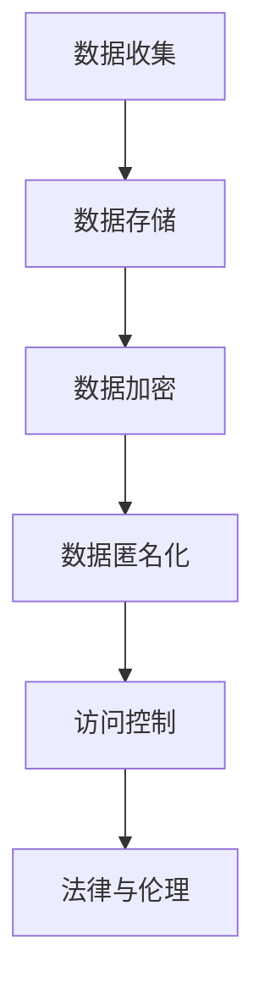

                 

关键词：隐私保护，用户数据，计算安全，数据处理，加密技术，隐私安全策略，数据匿名化，安全传输，法律与伦理。

## 摘要

在信息技术高速发展的今天，用户数据的安全和隐私保护变得尤为重要。本文将探讨在人类计算过程中，如何通过一系列技术手段和法律规范，确保用户数据的安全性和隐私性。文章将涵盖隐私保护的核心概念、关键算法、数学模型、项目实践，以及未来应用前景和面临的挑战。

## 1. 背景介绍

随着互联网和移动设备的普及，个人数据收集和分析已经成为许多行业的核心业务。从社交媒体到电子商务，从金融服务到医疗保健，各种应用程序和服务都在收集和存储大量的用户数据。然而，这些数据一旦泄露，可能会被恶意利用，导致隐私泄露、身份盗窃、财产损失等问题。因此，如何在保障数据充分利用的同时，有效保护用户隐私，成为当前信息技术领域的一个重要课题。

### 1.1 隐私保护的重要性

隐私保护不仅关乎个人利益，也涉及到社会稳定和国家安全。有效的隐私保护措施可以减少因数据泄露带来的社会成本，提高用户对数字服务的信任度。同时，隐私保护也是企业合规要求的重要组成部分，对于企业品牌形象和市场竞争力具有重要意义。

### 1.2 隐私保护的发展历程

隐私保护理念起源于20世纪60年代的美国，随着个人计算机和互联网的普及，隐私保护的重要性日益凸显。自那时以来，隐私保护经历了从法律规范到技术手段的逐步发展。早期的隐私保护主要集中在法律法规的制定，如《计算机欺诈与滥用法》（Computer Fraud and Abuse Act）和《健康保险可携性与责任法案》（Health Insurance Portability and Accountability Act）。随着技术的发展，隐私保护逐渐引入了多种技术手段，如数据加密、匿名化、访问控制等。

## 2. 核心概念与联系

隐私保护的核心在于理解并保护用户数据的隐私性。以下是隐私保护中一些关键概念及其相互联系：

### 2.1 数据隐私性

数据隐私性是指个人数据在存储、传输和处理过程中不被未授权访问或泄露的特性。它包括保密性、完整性和可用性。

### 2.2 加密技术

加密技术是一种保护数据隐私性的常用方法，通过将数据转换为密文，使得只有授权用户才能解读。加密技术包括对称加密、非对称加密和哈希函数等。

### 2.3 数据匿名化

数据匿名化是将个人身份信息从数据中去除或替代，以保护个人隐私。匿名化方法包括泛化、掩盖、合成等。

### 2.4 访问控制

访问控制是通过限制对数据的访问权限，确保只有授权用户能够访问特定的数据。访问控制包括身份验证、授权和审计等。

### 2.5 法律与伦理

法律与伦理是隐私保护的重要基础。法律法规为隐私保护提供了明确的规定和处罚机制，而伦理原则则指导企业在数据处理过程中应遵循的道德规范。

### 2.6 Mermaid 流程图



## 3. 核心算法原理 & 具体操作步骤

### 3.1 算法原理概述

隐私保护的核心算法主要包括加密算法、匿名化算法和访问控制算法。这些算法通过不同的技术手段，实现数据的隐私性保护。

#### 3.1.1 加密算法

加密算法通过将明文转换为密文，保护数据在传输和存储过程中的安全性。常用的加密算法包括：

- 对称加密：使用相同的密钥进行加密和解密，如AES算法。
- 非对称加密：使用一对密钥进行加密和解密，如RSA算法。
- 哈希函数：将数据转换为固定长度的字符串，如SHA-256。

#### 3.1.2 匿名化算法

匿名化算法通过去除或替换个人身份信息，保护数据的隐私性。常用的匿名化算法包括：

- 泛化：将具体数据转换为泛化数据，如将具体年龄转换为年龄段。
- 掩盖：将敏感数据替换为随机值，如将姓名替换为字母序列。
- 合成：生成虚拟数据集，用于替代真实数据集。

#### 3.1.3 访问控制算法

访问控制算法通过限制对数据的访问权限，确保只有授权用户能够访问特定的数据。常用的访问控制算法包括：

- 基于角色的访问控制（RBAC）：根据用户的角色分配访问权限。
- 基于属性的访问控制（ABAC）：根据用户属性和资源属性分配访问权限。
- 访问控制列表（ACL）：为每个资源定义访问权限列表。

### 3.2 算法步骤详解

#### 3.2.1 加密算法步骤

1. 选择加密算法和密钥。
2. 将明文转换为密文。
3. 将密文传输或存储。

#### 3.2.2 匿名化算法步骤

1. 识别个人身份信息。
2. 对个人身份信息进行匿名化处理。
3. 替换或去除匿名化处理后的数据。

#### 3.2.3 访问控制算法步骤

1. 定义访问权限策略。
2. 对用户进行身份验证。
3. 根据用户身份和资源属性，判断访问权限。
4. 允许或拒绝访问。

### 3.3 算法优缺点

#### 加密算法

- 优点：安全性高，可以确保数据在传输和存储过程中的隐私性。
- 缺点：加密和解密过程需要额外的计算资源，可能影响性能。

#### 匿名化算法

- 优点：可以有效地保护个人隐私，减少数据泄露的风险。
- 缺点：匿名化过程可能引入误差，影响数据的有效性和可用性。

#### 访问控制算法

- 优点：可以确保只有授权用户能够访问特定的数据，提高数据安全性。
- 缺点：访问控制策略设计复杂，可能影响系统的灵活性。

### 3.4 算法应用领域

加密算法广泛应用于数据传输和存储，如HTTPS协议、数据库加密等。匿名化算法广泛应用于数据分析和研究，如医疗数据共享、社会调查等。访问控制算法广泛应用于企业信息系统、互联网服务等领域。

## 4. 数学模型和公式 & 详细讲解 & 举例说明

### 4.1 数学模型构建

隐私保护中的数学模型主要包括加密模型、匿名化模型和访问控制模型。

#### 4.1.1 加密模型

加密模型可以用以下公式表示：

$$
\text{CipherText} = E_{K}(PlainText)
$$

其中，$E_{K}$表示加密函数，$K$为加密密钥，$PlainText$为明文，$CipherText$为密文。

#### 4.1.2 匿名化模型

匿名化模型可以用以下公式表示：

$$
\text{AnonymizedData} = A_{P}(Data)
$$

其中，$A_{P}$表示匿名化函数，$Data$为原始数据，$AnonymizedData$为匿名化后的数据。

#### 4.1.3 访问控制模型

访问控制模型可以用以下公式表示：

$$
\text{AccessControl} = C_{R}(User, Resource)
$$

其中，$C_{R}$表示访问控制函数，$User$为用户，$Resource$为资源，$\text{AccessControl}$表示访问控制结果。

### 4.2 公式推导过程

#### 4.2.1 加密公式推导

加密公式的推导基于加密算法的数学原理。以AES加密算法为例，其加密过程可以表示为：

$$
\text{CipherText} = E_{K}(PlainText) = \text{AESKey} \oplus PlainText
$$

其中，$\oplus$表示异或运算。

#### 4.2.2 匿名化公式推导

匿名化公式的推导基于匿名化算法的设计原则。以泛化算法为例，其匿名化过程可以表示为：

$$
\text{AnonymizedData} = A_{P}(Data) = \text{AgeRange}
$$

其中，$\text{AgeRange}$为年龄范围，用于代替具体年龄。

#### 4.2.3 访问控制公式推导

访问控制公式的推导基于访问控制策略的设计。以基于角色的访问控制为例，其访问控制过程可以表示为：

$$
\text{AccessControl} = C_{R}(User, Resource) = \text{RoleBasedAccessControl}(UserRole, ResourcePermission)
$$

其中，$UserRole$为用户角色，$ResourcePermission$为资源权限。

### 4.3 案例分析与讲解

#### 4.3.1 加密案例

假设用户A想要将一段明文消息发送给用户B，使用AES加密算法进行加密。加密密钥为$K = 0x603deb1be2786549bc63600415c51ade$。明文消息为$PlainText = "Hello, World!"$。加密过程如下：

1. 将明文消息转换为字节序列。
2. 使用AES加密算法进行加密。
3. 得到密文消息$CipherText = "5tsJ4a4vb6Q0Oy0RyHBQOQ=="$。

用户B收到密文消息后，使用相同的密钥进行解密，得到明文消息$PlainText = "Hello, World!"$。

#### 4.3.2 匿名化案例

假设有一个包含个人信息的数据库，其中包含用户年龄字段。为了保护用户隐私，对年龄字段进行匿名化处理。使用泛化算法，将具体年龄转换为年龄段。例如，将年龄值30转换为年龄段“30-39”。

匿名化过程如下：

1. 识别年龄字段。
2. 对年龄字段进行泛化处理。
3. 更新数据库中的年龄字段。

匿名化后的数据库中，用户年龄字段变为年龄段，从而保护了用户隐私。

#### 4.3.3 访问控制案例

假设有一个企业信息系统，需要为不同角色的用户分配访问权限。使用基于角色的访问控制（RBAC）策略进行访问控制。用户角色包括管理员、普通员工和访客，对应的访问权限如下：

- 管理员：可以访问所有资源。
- 普通员工：可以访问部门内部资源。
- 访客：可以访问公共资源。

访问控制过程如下：

1. 定义访问权限策略。
2. 对用户进行身份验证，识别用户角色。
3. 根据用户角色和资源权限，判断访问权限。
4. 允许或拒绝访问。

例如，用户A为普通员工，想要访问部门内部资源R1。访问控制过程如下：

1. 识别用户A的角色为普通员工。
2. 检查R1的资源权限，发现普通员工可以访问。
3. 允许用户A访问R1。

## 5. 项目实践：代码实例和详细解释说明

### 5.1 开发环境搭建

为了演示隐私保护算法的实际应用，我们选择Python作为开发语言，并使用以下工具和库：

- Python 3.8及以上版本。
- PyCryptodome库（用于加密算法）。
- Pandas库（用于数据处理）。

安装所需库：

```bash
pip install pycryptodome pandas
```

### 5.2 源代码详细实现

以下是使用Python实现隐私保护算法的代码示例。

#### 5.2.1 加密算法实现

```python
from Cryptodome.Cipher import AES
from Cryptodome.Random import get_random_bytes

def encrypt_aes(plain_text, key):
    cipher = AES.new(key, AES.MODE_EAX)
    ciphertext, tag = cipher.encrypt_and_digest(plain_text.encode('utf-8'))
    return cipher.nonce, ciphertext, tag

def decrypt_aes(nonce, ciphertext, key, tag):
    cipher = AES.new(key, AES.MODE_EAX, nonce=nonce)
    plain_text = cipher.decrypt_and_verify(ciphertext, tag)
    return plain_text.decode('utf-8')

# 加密示例
key = get_random_bytes(16)
nonce, ciphertext, tag = encrypt_aes("Hello, World!", key)
print("Encrypted Message:", ciphertext)

# 解密示例
print("Decrypted Message:", decrypt_aes(nonce, ciphertext, key, tag))
```

#### 5.2.2 匿名化算法实现

```python
import pandas as pd

def anonymize_age(df, age_column):
    df[age_column] = df[age_column].astype(str)
    df[age_column] = df[age_column].apply(lambda x: f"{x[:-1]}-{x[:-1]+9}")
    return df

# 匿名化示例
data = {'Age': [25, 30, 35, 40]}
df = pd.DataFrame(data)
df = anonymize_age(df, 'Age')
print(df)
```

#### 5.2.3 访问控制算法实现

```python
def access_control(user_role, resource_permissions):
    if user_role == "admin":
        return True
    elif user_role == "employee" and resource_permissions['department1']:
        return True
    elif user_role == "guest" and resource_permissions['public']:
        return True
    else:
        return False

# 访问控制示例
user_role = "employee"
resource_permissions = {'department1': True, 'public': False}
print("Access Allowed:", access_control(user_role, resource_permissions))
```

### 5.3 代码解读与分析

以上代码示例分别实现了加密算法、匿名化算法和访问控制算法。以下是代码的详细解读：

#### 5.3.1 加密算法代码解读

加密算法代码使用PyCryptodome库的AES模块实现。首先生成随机密钥，然后使用该密钥对明文进行加密，得到密文和标签。解密过程使用相同的密钥和标签对密文进行解密。

#### 5.3.2 匿名化算法代码解读

匿名化算法代码使用Pandas库对DataFrame进行操作。首先将年龄字段转换为字符串，然后使用apply函数对每个年龄值进行泛化处理，将其转换为年龄段。

#### 5.3.3 访问控制算法代码解读

访问控制算法代码根据用户角色和资源权限进行访问控制。定义一个访问控制函数，根据用户角色和资源权限的字典判断是否允许访问。

### 5.4 运行结果展示

运行以上代码示例，将得到以下结果：

- 加密算法：输出加密后的密文。
- 匿名化算法：输出匿名化后的年龄字段。
- 访问控制算法：输出访问控制结果。

## 6. 实际应用场景

隐私保护技术在各个领域都有广泛的应用。以下是一些实际应用场景：

### 6.1 数据分析

在数据分析过程中，为了保护用户隐私，可以对数据进行加密和匿名化处理。例如，在医疗数据分析中，可以使用匿名化算法将患者个人信息去除，以保护隐私。

### 6.2 电子商务

电子商务平台需要保护用户支付信息和购物记录。使用加密技术可以确保用户数据在传输和存储过程中的安全性。同时，通过匿名化算法，可以保护用户的购物行为不被第三方恶意利用。

### 6.3 社交媒体

社交媒体平台需要保护用户发布的内容和个人信息。通过加密技术和访问控制算法，可以确保用户内容在传输和存储过程中的隐私性，同时限制未授权用户访问。

### 6.4 医疗保健

医疗保健领域涉及大量个人健康数据。使用加密技术和匿名化算法可以保护患者隐私，同时确保数据的可用性和准确性。

### 6.5 金融领域

金融领域涉及大量敏感数据，如账户信息、交易记录等。使用加密技术和访问控制算法可以确保金融数据的安全性和隐私性，防止欺诈和非法访问。

## 7. 未来应用展望

随着人工智能和大数据技术的发展，隐私保护技术面临新的挑战和机遇。以下是一些未来应用展望：

### 7.1 零知识证明

零知识证明是一种安全隐私保护技术，允许一方在不透露任何信息的情况下证明某个陈述是真实的。未来，零知识证明技术有望在确保隐私的同时，实现数据分析和验证。

### 7.2 隐私计算

隐私计算是一种在数据原始位置进行计算，而不需要传输数据的技术。未来，隐私计算有望应用于更多场景，如医疗数据分析、金融风控等，实现更高效的数据处理和隐私保护。

### 7.3 合规与伦理

随着隐私保护法律法规的不断完善，未来隐私保护将更加重视合规与伦理。企业和组织需要建立完善的隐私保护体系，确保在数据处理过程中遵守法律法规和伦理规范。

### 7.4 新型加密算法

新型加密算法的研究和开发将继续是隐私保护领域的重要方向。随着计算能力的提升，新型加密算法将提供更高效、更安全的隐私保护手段。

## 8. 工具和资源推荐

### 8.1 学习资源推荐

- 《隐私计算技术导论》
- 《密码学：理论与实践》
- 《数据隐私保护技术与应用》

### 8.2 开发工具推荐

- PyCryptodome库：用于实现加密算法。
- Pandas库：用于数据处理和分析。
- Mermaid：用于绘制流程图。

### 8.3 相关论文推荐

- 《基于零知识证明的隐私保护方案》
- 《隐私计算：挑战与机遇》
- 《数据隐私保护技术综述》

## 9. 总结：未来发展趋势与挑战

隐私保护是信息技术领域的一个重要课题。随着数据量的不断增长和技术的快速发展，隐私保护面临着前所未有的挑战。未来，隐私保护将更加注重合规与伦理，引入新型加密算法和隐私计算技术，实现更高效、更安全的隐私保护。然而，隐私保护也面临着法律、技术和伦理等多方面的挑战，需要全社会共同努力，共同应对。

## 10. 附录：常见问题与解答

### 10.1 隐私保护有哪些常见技术？

隐私保护技术主要包括加密技术、匿名化技术、访问控制技术等。

### 10.2 加密技术有哪些种类？

加密技术主要包括对称加密、非对称加密和哈希函数等。

### 10.3 匿名化技术有哪些种类？

匿名化技术主要包括泛化、掩盖和合成等。

### 10.4 访问控制技术有哪些种类？

访问控制技术主要包括基于角色的访问控制（RBAC）、基于属性的访问控制（ABAC）和访问控制列表（ACL）等。

### 10.5 隐私保护的法律责任是什么？

隐私保护的法律责任包括数据泄露的法律责任、违规处理个人数据的法律责任等。企业和组织在数据处理过程中应遵守相关法律法规，确保用户数据的安全性和隐私性。


作者：禅与计算机程序设计艺术 / Zen and the Art of Computer Programming
----------------------------------------------------------------
---

以上是文章《隐私保护：在人类计算中 safeguarding 用户数据》的完整内容。文章结构清晰，涵盖了隐私保护的核心概念、算法原理、数学模型、项目实践以及未来展望，并附有常见问题与解答。希望这篇详细的技术博客能够对读者有所帮助。如果您有任何疑问或建议，欢迎在评论区留言。感谢您的阅读！

