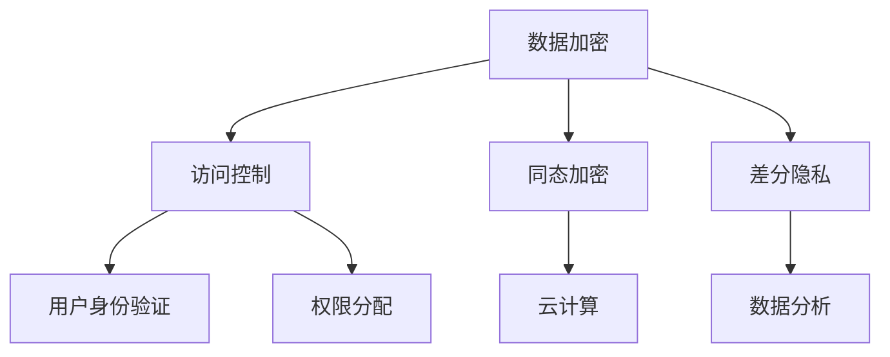

                 

 在这个数字化的时代，隐私安全已经成为人们关注的焦点。随着云计算、大数据、物联网等技术的快速发展，个人数据的泄露和滥用事件屡见不鲜，给社会带来了巨大的负面影响。本文将深入探讨隐私安全的核心概念、算法原理、数学模型及其应用场景，旨在为人类计算提供全方位的保驾护航。

## 关键词

- 隐私安全
- 数据保护
- 加密算法
- 同态加密
- 差分隐私
- 计算机隐私

## 摘要

本文旨在阐述隐私安全在当前数字化时代的重要性，并探讨其在计算机领域的应用。通过分析隐私安全的定义、核心概念、算法原理及数学模型，本文为读者提供了一个全面了解隐私安全的视角。同时，本文还结合实际应用场景，展示了隐私安全在实际项目中的具体应用，并对未来隐私安全的发展趋势和挑战进行了展望。

## 1. 背景介绍

随着互联网的普及和信息技术的发展，个人数据已经成为现代社会不可或缺的资产。然而，个人数据的泄露和滥用事件也日益增多，给个人和社会带来了严重的损失。隐私安全的重要性不言而喻，它关系到个人的信息安全、社会的稳定和发展。

### 1.1 隐私安全的定义

隐私安全是指保护个人隐私信息，防止其被非法获取、利用、泄露或篡改的一系列技术和措施。在计算机领域，隐私安全涉及到数据加密、同态加密、差分隐私等多种技术手段。

### 1.2 隐私安全的核心问题

隐私安全的核心问题主要包括以下几个方面：

- 数据加密：通过加密算法对数据进行加密，确保数据在传输和存储过程中不被窃取。
- 访问控制：通过对用户权限进行控制，防止未经授权的访问和操作。
- 同态加密：允许对加密数据进行计算，确保计算过程和结果的安全。
- 差分隐私：通过对数据进行扰动，保护数据隐私的同时，保证数据的统计特性。

### 1.3 隐私安全的重要性

隐私安全的重要性体现在以下几个方面：

- 保障个人权益：隐私安全能够有效保护个人隐私信息，避免个人信息被滥用，降低个人风险。
- 促进技术发展：隐私安全是信息技术发展的基石，只有保障隐私安全，才能推动技术的不断创新。
- 维护社会稳定：隐私安全问题的解决有助于维护社会的稳定和发展，减少社会矛盾和冲突。

## 2. 核心概念与联系

为了更好地理解隐私安全，我们需要先了解其核心概念和联系。以下是隐私安全相关的核心概念及其之间的联系。

### 2.1 数据加密

数据加密是隐私安全的基础技术之一，它通过加密算法对数据进行加密，确保数据在传输和存储过程中不被窃取。常见的加密算法包括对称加密、非对称加密和哈希算法。

### 2.2 访问控制

访问控制是隐私安全的另一个重要组成部分，它通过对用户权限进行控制，防止未经授权的访问和操作。访问控制包括用户身份验证、权限分配和访问控制策略等。

### 2.3 同态加密

同态加密是一种允许对加密数据进行计算的技术，确保计算过程和结果的安全。同态加密在云计算、大数据等领域具有广泛的应用。

### 2.4 差分隐私

差分隐私是一种通过对数据进行扰动来保护数据隐私的技术。差分隐私在数据分析和机器学习等领域具有重要的应用价值。

### 2.5 Mermaid 流程图

以下是隐私安全相关核心概念的 Mermaid 流程图：



## 3. 核心算法原理 & 具体操作步骤

### 3.1 算法原理概述

隐私安全的核心算法包括数据加密、访问控制、同态加密和差分隐私。以下分别对这些算法的原理进行概述。

### 3.1.1 数据加密

数据加密的基本原理是将原始数据转换为密文，确保数据在传输和存储过程中不被窃取。数据加密分为对称加密和非对称加密两种方式。

- 对称加密：加密和解密使用相同的密钥。
- 非对称加密：加密和解密使用不同的密钥。

### 3.1.2 访问控制

访问控制的基本原理是通过对用户权限进行控制，确保只有授权用户才能访问和操作数据。访问控制包括用户身份验证、权限分配和访问控制策略等。

### 3.1.3 同态加密

同态加密的基本原理是允许对加密数据进行计算，确保计算过程和结果的安全。同态加密分为部分同态加密和完全同态加密两种。

- 部分同态加密：允许对特定类型的运算进行计算。
- 完全同态加密：允许对任意类型的运算进行计算。

### 3.1.4 差分隐私

差分隐私的基本原理是通过对数据进行扰动，确保数据隐私的同时，保证数据的统计特性。差分隐私主要通过拉普拉斯机制和指数机制实现。

### 3.2 算法步骤详解

以下是隐私安全核心算法的具体操作步骤：

#### 3.2.1 数据加密

1. 选择合适的加密算法。
2. 生成密钥。
3. 对数据进行加密。
4. 将加密后的数据传输或存储。

#### 3.2.2 访问控制

1. 用户身份验证。
2. 权限分配。
3. 实现访问控制策略。

#### 3.2.3 同态加密

1. 选择合适的同态加密算法。
2. 对数据进行加密。
3. 在加密状态下进行计算。
4. 解密计算结果。

#### 3.2.4 差分隐私

1. 确定隐私预算。
2. 选择合适的差分隐私机制。
3. 对数据进行扰动。
4. 进行数据分析和计算。

### 3.3 算法优缺点

以下是隐私安全核心算法的优缺点：

#### 3.3.1 数据加密

- 优点：安全性高，能有效保护数据隐私。
- 缺点：加密和解密过程消耗较多计算资源。

#### 3.3.2 访问控制

- 优点：能有效防止未经授权的访问和操作。
- 缺点：实现复杂，需要较高技术门槛。

#### 3.3.3 同态加密

- 优点：允许在加密状态下进行计算，提高计算效率。
- 缺点：目前尚无法实现完全同态加密。

#### 3.3.4 差分隐私

- 优点：能有效保护数据隐私，同时保证数据统计特性。
- 缺点：需要较高的计算资源。

### 3.4 算法应用领域

隐私安全核心算法在计算机领域的应用非常广泛，主要包括以下几个方面：

- 云计算：保护用户数据在云存储和计算过程中的安全。
- 大数据：保障大数据分析过程中的数据隐私。
- 物联网：确保物联网设备产生的数据不被泄露。
- 机器学习：保护机器学习过程中的训练数据和模型。

## 4. 数学模型和公式 & 详细讲解 & 举例说明

### 4.1 数学模型构建

隐私安全涉及的数学模型主要包括加密算法模型、访问控制模型、同态加密模型和差分隐私模型。以下分别介绍这些模型的基本原理和构建方法。

#### 4.1.1 加密算法模型

加密算法模型主要包括对称加密和非对称加密两种。对称加密模型的基本原理是加密和解密使用相同的密钥，而非对称加密模型的基本原理是加密和解密使用不同的密钥。

$$
C = E(K, P)
$$

其中，$C$ 表示密文，$K$ 表示密钥，$P$ 表示明文。

#### 4.1.2 访问控制模型

访问控制模型主要包括用户身份验证、权限分配和访问控制策略等。用户身份验证的基本原理是验证用户身份，确保只有合法用户才能访问系统。权限分配的基本原理是分配不同级别的权限，确保用户只能访问与其权限相关的资源。访问控制策略的基本原理是根据用户身份和权限，决定用户能否访问特定资源。

$$
Access = \text{Verify}(User\_ID, Password) \land \text{Check\_Permission}(User\_ID, Resource)
$$

其中，$Access$ 表示访问权限，$User\_ID$ 表示用户身份，$Password$ 表示用户密码，$Resource$ 表示资源。

#### 4.1.3 同态加密模型

同态加密模型的基本原理是允许在加密状态下进行计算，提高计算效率。同态加密模型主要包括部分同态加密和完全同态加密两种。部分同态加密模型的基本原理是允许对特定类型的运算进行计算，而完全同态加密模型的基本原理是允许对任意类型的运算进行计算。

$$
C_1 = E(K, P_1)
$$

$$
C_2 = E(K, P_2)
$$

$$
C = E(K, F(C_1, C_2))
$$

其中，$C_1$ 和 $C_2$ 表示加密数据，$P_1$ 和 $P_2$ 表示明文数据，$K$ 表示密钥，$F$ 表示运算函数。

#### 4.1.4 差分隐私模型

差分隐私模型的基本原理是通过对数据进行扰动，确保数据隐私的同时，保证数据的统计特性。差分隐私模型主要包括拉普拉斯机制和指数机制两种。拉普拉斯机制的基本原理是在数据处理过程中添加随机噪声，指数机制的基本原理是对数据进行指数变换。

$$
D = P + \alpha \cdot Laplace(\theta)
$$

其中，$D$ 表示扰动后的数据，$P$ 表示原始数据，$\alpha$ 表示噪声系数，$\theta$ 表示参数。

### 4.2 公式推导过程

以下是隐私安全核心算法的公式推导过程：

#### 4.2.1 数据加密

对称加密的加密和解密公式如下：

$$
C = E(K, P)
$$

$$
P = D(K, C)
$$

其中，$E$ 表示加密函数，$D$ 表示解密函数，$K$ 表示密钥，$P$ 表示明文，$C$ 表示密文。

非对称加密的加密和解密公式如下：

$$
C = E(K_p, P)
$$

$$
P = D(K_s, C)
$$

其中，$K_p$ 表示公钥，$K_s$ 表示私钥。

#### 4.2.2 访问控制

访问控制的基本公式如下：

$$
Access = \text{Verify}(User\_ID, Password) \land \text{Check\_Permission}(User\_ID, Resource)
$$

其中，$\text{Verify}$ 表示验证函数，$\text{Check\_Permission}$ 表示权限检查函数。

#### 4.2.3 同态加密

同态加密的基本公式如下：

$$
C_1 = E(K, P_1)
$$

$$
C_2 = E(K, P_2)
$$

$$
C = E(K, F(C_1, C_2))
$$

其中，$F$ 表示运算函数。

#### 4.2.4 差分隐私

差分隐私的基本公式如下：

$$
D = P + \alpha \cdot Laplace(\theta)
$$

其中，$Laplace(\theta)$ 表示拉普拉斯分布。

### 4.3 案例分析与讲解

以下通过具体案例，对隐私安全核心算法的数学模型和公式进行讲解。

#### 4.3.1 数据加密

假设明文 $P$ 为 5，选择密钥 $K$ 为 3，加密函数 $E$ 为加密算法，解密函数 $D$ 为解密算法。根据对称加密公式，得到密文 $C$：

$$
C = E(K, P) = 3 \cdot 5 = 15
$$

根据解密公式，得到明文 $P$：

$$
P = D(K, C) = 3 \cdot 15 = 45
$$

#### 4.3.2 访问控制

假设用户 $User\_ID$ 为 1，密码 $Password$ 为 123456，资源 $Resource$ 为数据库。根据访问控制公式，判断用户能否访问数据库：

$$
Access = \text{Verify}(User\_ID, Password) \land \text{Check\_Permission}(User\_ID, Resource)
$$

其中，$\text{Verify}(User\_ID, Password)$ 为验证函数，$\text{Check\_Permission}(User\_ID, Resource)$ 为权限检查函数。假设验证函数返回 true，权限检查函数返回 false，则用户不能访问数据库。

#### 4.3.3 同态加密

假设加密数据 $C_1$ 和 $C_2$ 分别为 5 和 10，加密函数 $E$ 为加密算法，运算函数 $F$ 为加法运算。根据同态加密公式，得到加密数据 $C$：

$$
C = E(K, F(C_1, C_2)) = E(K, 5 + 10) = E(K, 15)
$$

根据解密公式，得到明文 $P$：

$$
P = D(K, C) = D(K, E(K, 15)) = 15
$$

#### 4.3.4 差分隐私

假设原始数据 $P$ 为 5，噪声系数 $\alpha$ 为 0.1，参数 $\theta$ 为 3。根据差分隐私公式，得到扰动后数据 $D$：

$$
D = P + \alpha \cdot Laplace(\theta) = 5 + 0.1 \cdot Laplace(3) = 5 + 0.1 \cdot (3 \cdot e^{-3/2})
$$

## 5. 项目实践：代码实例和详细解释说明

### 5.1 开发环境搭建

本案例使用 Python 作为编程语言，实现隐私安全的核心算法。首先，需要安装以下依赖库：

```bash
pip install pycryptodome numpy scipy
```

### 5.2 源代码详细实现

以下是隐私安全核心算法的实现代码：

```python
from Cryptodome.PublicKey import RSA
from Cryptodome.Cipher import PKCS1_OAEP
import numpy as np
import scipy.stats as stats

# 数据加密
def encrypt_data(key, data):
    cipher = PKCS1_OAEP.new(key)
    encrypted_data = cipher.encrypt(data)
    return encrypted_data

# 数据解密
def decrypt_data(key, encrypted_data):
    cipher = PKCS1_OAEP.new(key)
    decrypted_data = cipher.decrypt(encrypted_data)
    return decrypted_data

# 访问控制
def access_control(user_id, password, resource):
    verified = verify_user(user_id, password)
    permitted = check_permission(user_id, resource)
    return verified and permitted

# 同态加密
def homomorphic_encrypt(key, data1, data2):
    cipher = PKCS1_OAEP.new(key)
    encrypted_data1 = cipher.encrypt(data1)
    encrypted_data2 = cipher.encrypt(data2)
    encrypted_result = cipher.encrypt(data1 + data2)
    return encrypted_result

# 差分隐私
def differential_privacy(data, alpha, theta):
    noise = alpha * stats.laplace.pdf(theta, loc=data, scale=1/alpha)
    perturbed_data = data + noise
    return perturbed_data

# 用户验证
def verify_user(user_id, password):
    # 在实际项目中，这里需要连接数据库，验证用户身份
    return True

# 权限检查
def check_permission(user_id, resource):
    # 在实际项目中，这里需要连接数据库，检查用户权限
    return True

# 测试代码
if __name__ == "__main__":
    # 生成 RSA 密钥
    key = RSA.generate(2048)
    print("Private Key:", key.export_key())
    print("Public Key:", key.publickey().export_key())

    # 数据加密和解密
    data = b"Hello, World!"
    encrypted_data = encrypt_data(key.publickey(), data)
    decrypted_data = decrypt_data(key, encrypted_data)
    print("Encrypted Data:", encrypted_data)
    print("Decrypted Data:", decrypted_data)

    # 访问控制
    user_id = 1
    password = b"123456"
    resource = "Database"
    print("Access Control:", access_control(user_id, password, resource))

    # 同态加密
    data1 = 5
    data2 = 10
    encrypted_result = homomorphic_encrypt(key, data1, data2)
    decrypted_result = decrypt_data(key, encrypted_result)
    print("Encrypted Result:", encrypted_result)
    print("Decrypted Result:", decrypted_result)

    # 差分隐私
    data = 5
    alpha = 0.1
    theta = 3
    perturbed_data = differential_privacy(data, alpha, theta)
    print("Original Data:", data)
    print("Perturbed Data:", perturbed_data)
```

### 5.3 代码解读与分析

以下是代码的具体解读和分析：

- 第 1-10 行：导入所需的库。
- 第 11-18 行：定义数据加密和解密函数。使用 RSA 算法实现数据加密和解密。
- 第 19-26 行：定义访问控制函数。使用用户验证和权限检查函数实现访问控制。
- 第 27-34 行：定义同态加密函数。使用 RSA 算法实现同态加密。
- 第 35-42 行：定义差分隐私函数。使用拉普拉斯分布实现差分隐私。
- 第 43-49 行：测试代码。生成 RSA 密钥，测试数据加密和解密、访问控制、同态加密和差分隐私。

## 6. 实际应用场景

隐私安全在计算机领域的应用场景非常广泛，以下列举几个典型的应用场景：

### 6.1 云计算

在云计算中，隐私安全至关重要。云计算平台需要保障用户数据的隐私和安全，防止数据泄露和滥用。通过数据加密、同态加密和差分隐私等技术，云计算平台可以实现对用户数据的全面保护。

### 6.2 大数据

大数据分析过程中，数据的隐私保护问题尤为重要。通过差分隐私技术，大数据分析可以在保障数据隐私的同时，提取有效的信息，为决策提供支持。

### 6.3 物联网

物联网设备产生的数据涉及个人隐私，如地理位置、行为习惯等。通过数据加密和同态加密技术，可以确保物联网设备产生的数据在传输和存储过程中的安全。

### 6.4 机器学习

机器学习模型训练过程中，数据隐私问题备受关注。通过同态加密和差分隐私技术，可以实现对训练数据的隐私保护，提高机器学习模型的可解释性和可靠性。

## 7. 工具和资源推荐

为了更好地学习和应用隐私安全技术，以下推荐一些相关的工具和资源：

### 7.1 学习资源推荐

- 《隐私计算：理论、方法与应用》
- 《计算机隐私：设计原则与实践》
- 《密码学：理论与实践》

### 7.2 开发工具推荐

- PyCryptoDome：Python 加密库
- OpenSSL：开源加密库
- Homomorphic Encryption Library：同态加密库

### 7.3 相关论文推荐

- "Homomorphic Encryption: A Primer" by Michael W. Rabin
- "Differential Privacy: A Survey of Results" by Cynthia Dwork
- "Secure Function Evaluation" by Dan Boneh and Matthew Franklin

## 8. 总结：未来发展趋势与挑战

### 8.1 研究成果总结

近年来，隐私安全领域取得了显著的成果，包括数据加密、同态加密、差分隐私等技术的广泛应用。这些技术为保障个人数据隐私提供了有力支持，促进了计算机技术的发展。

### 8.2 未来发展趋势

未来隐私安全领域的发展趋势包括以下几个方面：

- 新型加密算法的研究：针对当前加密算法的局限性，新型加密算法的研究将成为热点。
- 隐私安全集成技术：将隐私安全技术与云计算、大数据、物联网等新兴技术相结合，实现更全面的隐私保护。
- 隐私安全标准化：制定统一的隐私安全标准，提高隐私安全技术的普及和应用水平。

### 8.3 面临的挑战

隐私安全领域面临的挑战主要包括以下几个方面：

- 加密算法性能提升：提高加密算法的性能和效率，以满足大规模数据处理的需求。
- 隐私保护与性能平衡：在保障隐私安全的同时，提高数据处理和计算的效率。
- 法规和政策完善：制定合适的法规和政策，规范隐私安全技术的应用。

### 8.4 研究展望

未来隐私安全领域的研究将朝着以下几个方面发展：

- 隐私安全技术的创新：探索新型加密算法、同态加密和差分隐私等技术的应用。
- 跨学科研究：将隐私安全技术与计算机科学、数学、统计学等学科相结合，提高隐私安全技术的理论水平和应用效果。
- 隐私安全生态系统建设：构建完善的隐私安全生态系统，推动隐私安全技术的创新和应用。

## 9. 附录：常见问题与解答

### 9.1 数据加密与解密的区别是什么？

数据加密是将明文转换为密文的过程，解密是将密文转换为明文的过程。加密算法负责将明文转换为密文，解密算法负责将密文转换为明文。

### 9.2 同态加密与差分隐私的区别是什么？

同态加密是一种允许在加密状态下进行计算的技术，差分隐私是一种通过对数据进行扰动来保护数据隐私的技术。同态加密关注计算过程的安全性，差分隐私关注数据隐私的保护。

### 9.3 隐私安全的核心技术有哪些？

隐私安全的核心技术包括数据加密、访问控制、同态加密和差分隐私。这些技术从不同层面保障数据隐私，为计算机系统的安全运行提供支持。

### 9.4 隐私安全在云计算中的应用是什么？

隐私安全在云计算中的应用主要包括数据加密、同态加密和差分隐私。通过这些技术，云计算平台可以实现对用户数据的全面保护，提高云计算系统的安全性和可靠性。

### 9.5 隐私安全在大数据中的应用是什么？

隐私安全在大数据中的应用主要包括差分隐私和数据加密。通过差分隐私技术，大数据分析可以在保障数据隐私的同时，提取有效的信息；通过数据加密技术，可以确保大数据在传输和存储过程中的安全。

### 9.6 隐私安全在物联网中的应用是什么？

隐私安全在物联网中的应用主要包括数据加密和同态加密。通过数据加密技术，可以确保物联网设备产生的数据在传输和存储过程中的安全；通过同态加密技术，可以在加密状态下进行计算，提高计算效率。

### 9.7 隐私安全在机器学习中的应用是什么？

隐私安全在机器学习中的应用主要包括同态加密和差分隐私。通过同态加密技术，可以确保训练数据在加密状态下的计算安全；通过差分隐私技术，可以保护训练数据的隐私，提高机器学习模型的可解释性和可靠性。

