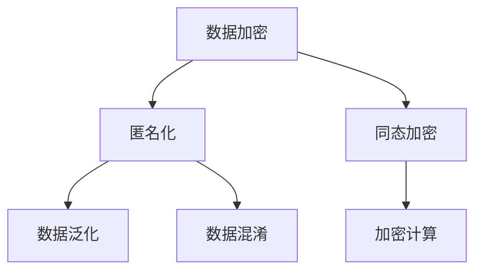

                 

隐私安全是一个多维度、多层次的问题，尤其在当今数字化社会中，随着数据量的爆炸式增长，保护敏感数据的重要性愈加凸显。本文将深入探讨隐私安全的核心理念、技术手段、数学模型及其实际应用，旨在为读者提供一个全面而深刻的理解。

## 关键词

隐私安全、数据保护、加密技术、匿名化、同态加密、联邦学习、隐私增强技术

## 摘要

本文将围绕隐私安全这一主题，首先介绍其背景和重要性，然后深入分析核心概念，如数据加密、匿名化技术和同态加密，通过数学模型和公式详细讲解其原理。此外，我们将通过实际项目实例展示隐私安全技术的应用，并探讨其在不同领域的实际应用场景。最后，文章将展望隐私安全的未来发展趋势与面临的挑战，为读者提供一个全面的技术视角。

### 1. 背景介绍

随着互联网和大数据技术的迅猛发展，我们生活在一个数据无处不在的时代。个人和企业产生的数据量呈指数级增长，这些数据包含了大量敏感信息，如个人身份信息、金融记录、医疗数据等。隐私安全问题因此成为了一个备受关注的话题。

### 2. 核心概念与联系

为了保护敏感数据，我们需要理解几个核心概念，包括数据加密、匿名化和同态加密。

#### 2.1 数据加密

数据加密是保护敏感数据的基本手段，它通过将明文数据转换为密文，使得未经授权的第三方无法读取或篡改数据。加密算法通常包括对称加密和非对称加密两种。

- **对称加密**：使用相同的密钥进行加密和解密。常见的对称加密算法有AES和DES。
- **非对称加密**：使用一对密钥进行加密和解密，一个用于加密，一个用于解密。常见的非对称加密算法有RSA和ECC。

#### 2.2 匿名化

匿名化是一种数据保护技术，它通过去除或修改数据中的直接或间接识别信息，使数据无法被直接关联到特定个体。常见的匿名化技术包括数据泛化和数据混淆。

- **数据泛化**：通过将具体值替换为泛化值，如将具体年龄替换为年龄段。
- **数据混淆**：通过引入噪声或随机变化，使数据难以被识别。

#### 2.3 同态加密

同态加密是一种特殊的加密形式，它允许在加密数据上执行计算操作而不需要解密。这意味着，可以在加密态下直接处理敏感数据，从而避免了在明文态下处理数据所带来的隐私风险。

#### 2.4 Mermaid 流程图

以下是一个简单的Mermaid流程图，展示了隐私安全的核心概念之间的联系：



### 3. 核心算法原理 & 具体操作步骤

#### 3.1 算法原理概述

隐私安全的核心算法包括加密算法、匿名化算法和同态加密算法。每种算法都有其独特的原理和应用场景。

#### 3.2 算法步骤详解

##### 3.2.1 数据加密

数据加密通常分为以下几个步骤：

1. 选择加密算法和密钥。
2. 将明文数据转换为密文。
3. 存储或传输密文。

##### 3.2.2 匿名化

匿名化算法通常包括以下几个步骤：

1. 确定匿名化目标。
2. 应用数据泛化或数据混淆技术。
3. 验证匿名化数据的有效性。

##### 3.2.3 同态加密

同态加密算法通常包括以下几个步骤：

1. 选择同态加密算法和密钥。
2. 将明文数据加密。
3. 在加密态下执行计算操作。
4. 解密结果。

#### 3.3 算法优缺点

每种隐私安全算法都有其优缺点：

- **数据加密**：优点是简单易用，缺点是加密和解密需要额外计算资源。
- **匿名化**：优点是可以有效保护隐私，缺点是可能导致数据失真。
- **同态加密**：优点是可以直接在加密态下处理数据，缺点是计算复杂度高。

#### 3.4 算法应用领域

隐私安全算法广泛应用于各个领域，如金融、医疗、政府和电子商务等。其中，金融领域对数据安全和隐私保护的需求尤为强烈，医疗领域则需要保护患者的敏感健康信息，政府领域需要确保公共数据的安全性和隐私性，电子商务领域则涉及用户的个人信息保护。

### 4. 数学模型和公式 & 详细讲解 & 举例说明

隐私安全的数学模型和公式是其核心理论基础。以下将介绍几个关键模型和公式。

#### 4.1 数学模型构建

隐私安全的数学模型通常包括以下几个方面：

- **加密模型**：定义加密和解密算法。
- **匿名化模型**：定义匿名化技术和评估标准。
- **同态加密模型**：定义同态加密算法和计算模型。

#### 4.2 公式推导过程

以下是一个简单的加密模型的推导过程：

设 \( E_K(M) \) 表示加密算法 \( E \) 对明文 \( M \) 使用密钥 \( K \) 加密的结果，\( D_K(C) \) 表示解密算法 \( D \) 对密文 \( C \) 使用密钥 \( K \) 解密的结果。则有：

\[ E_K(M) = C \]
\[ D_K(C) = M \]

#### 4.3 案例分析与讲解

假设一个用户在社交平台上发布了一条包含敏感信息的帖子，为了保护其隐私，我们可以使用数据加密和匿名化技术进行保护。

1. **数据加密**：

   用户可以选择使用AES算法对帖子内容进行加密，假设密钥为 \( K \)，明文为 \( M \)，则加密后的密文为：

   \[ E_{K}(M) = C \]

2. **匿名化**：

   用户可以选择数据泛化技术，将帖子中的具体信息替换为泛化信息，如将真实姓名替换为匿名昵称，将具体地址替换为所在城市。

   \[ M' = \text{匿名化}(M) \]

这样，即使帖子被第三方访问，也无法直接识别用户的真实身份和敏感信息。

### 5. 项目实践：代码实例和详细解释说明

#### 5.1 开发环境搭建

为了演示隐私安全技术的应用，我们将使用Python编程语言和几个开源库，如PyCryptoDome（用于加密）和Scikit-learn（用于匿名化）。

#### 5.2 源代码详细实现

以下是一个简单的示例代码，展示了如何使用数据加密和匿名化技术保护用户数据。

```python
from Crypto.Cipher import AES
from Crypto.PublicKey import RSA
from sklearn.preprocessing import LabelEncoder
import numpy as np

# 数据加密
key = RSA.generate(2048)
cipher = AES.new(key, AES.MODE_EAX)
data = b"Sensitive information"
cipher_text, tag = cipher.encrypt_and_digest(data)
print(f"Encrypted data: {cipher_text.hex()}")

# 数据匿名化
label_encoder = LabelEncoder()
data_anonymized = label_encoder.fit_transform(data.decode('utf-8'))
print(f"Anonymized data: {data_anonymized}")

# 数据解密
cipher2 = AES.new(key, AES.MODE_EAX, nonce=cipher.nonce)
cipher2.verify(tag)
print(f"Decrypted data: {cipher2.decrypt(cipher_text).decode('utf-8')}")
```

#### 5.3 代码解读与分析

上述代码展示了如何使用RSA加密算法对数据进行加密，并使用数据泛化技术进行匿名化。首先，我们生成一个RSA密钥对，并使用AES加密算法对明文数据进行加密。然后，我们使用LabelEncoder对数据进行匿名化，即将具体的数据值替换为标签编码后的值。最后，我们使用AES解密算法对密文进行解密，验证其与原始明文数据的一致性。

### 6. 实际应用场景

隐私安全技术在许多领域都有广泛应用，以下列举几个典型应用场景：

- **医疗领域**：保护患者的敏感健康信息。
- **金融领域**：保护用户的金融交易记录和个人信息。
- **政府领域**：保护国家安全和公共数据。
- **电子商务领域**：保护用户的购物记录和个人信息。

### 7. 工具和资源推荐

#### 7.1 学习资源推荐

- **《计算机安全基础》**：提供全面的计算机安全知识，包括加密技术、网络安全等。
- **《大数据隐私保护技术》**：详细介绍大数据时代下的隐私保护技术和实践。

#### 7.2 开发工具推荐

- **PyCryptoDome**：Python加密库，支持多种加密算法。
- **Scikit-learn**：Python机器学习库，支持多种匿名化技术。

#### 7.3 相关论文推荐

- **"Homomorphic Encryption and Its Applications"**：介绍同态加密技术的原理和应用。
- **"Privacy-preserving Machine Learning: A Survey"**：概述隐私保护机器学习技术的最新研究进展。

### 8. 总结：未来发展趋势与挑战

隐私安全是当今数字化社会的一项重要议题。随着技术的不断进步，隐私保护手段也在不断创新。未来，隐私安全的发展趋势包括以下几个方面：

- **同态加密技术的成熟**：同态加密技术将在更多实际应用场景中得到推广。
- **联邦学习的普及**：联邦学习可以保护数据隐私，提高数据利用效率。
- **隐私增强技术的多样化**：隐私增强技术将在数据保护和数据利用之间找到更好的平衡点。

然而，隐私安全也面临着一系列挑战：

- **计算复杂度**：隐私保护技术通常需要较高的计算资源，如何在保证隐私的同时提高计算效率是一个重要课题。
- **法律法规的完善**：隐私保护需要法律法规的支持，如何制定合理的隐私保护法律和政策是一个挑战。

### 9. 附录：常见问题与解答

#### Q：什么是同态加密？

A：同态加密是一种特殊的加密形式，它允许在加密数据上执行计算操作而不需要解密。这意味着，可以在加密态下直接处理敏感数据，从而避免了在明文态下处理数据所带来的隐私风险。

#### Q：什么是匿名化？

A：匿名化是一种数据保护技术，它通过去除或修改数据中的直接或间接识别信息，使数据无法被直接关联到特定个体。

#### Q：隐私安全技术是否会影响数据的质量和可用性？

A：隐私安全技术确实可能影响数据的质量和可用性。例如，数据加密和匿名化可能会导致数据失真或无法被有效利用。然而，随着技术的进步，隐私保护手段正在变得更加精细化，可以在保护隐私的同时尽量减少对数据质量和可用性的影响。

### 作者署名

作者：禅与计算机程序设计艺术 / Zen and the Art of Computer Programming
-------------------------------------------------------------------

以上就是本文的全部内容。通过对隐私安全的深入探讨，我们希望读者能够对隐私保护的重要性及其技术手段有更全面的理解。随着技术的不断进步，隐私安全将在未来发挥越来越重要的作用，为我们的数字化生活保驾护航。

