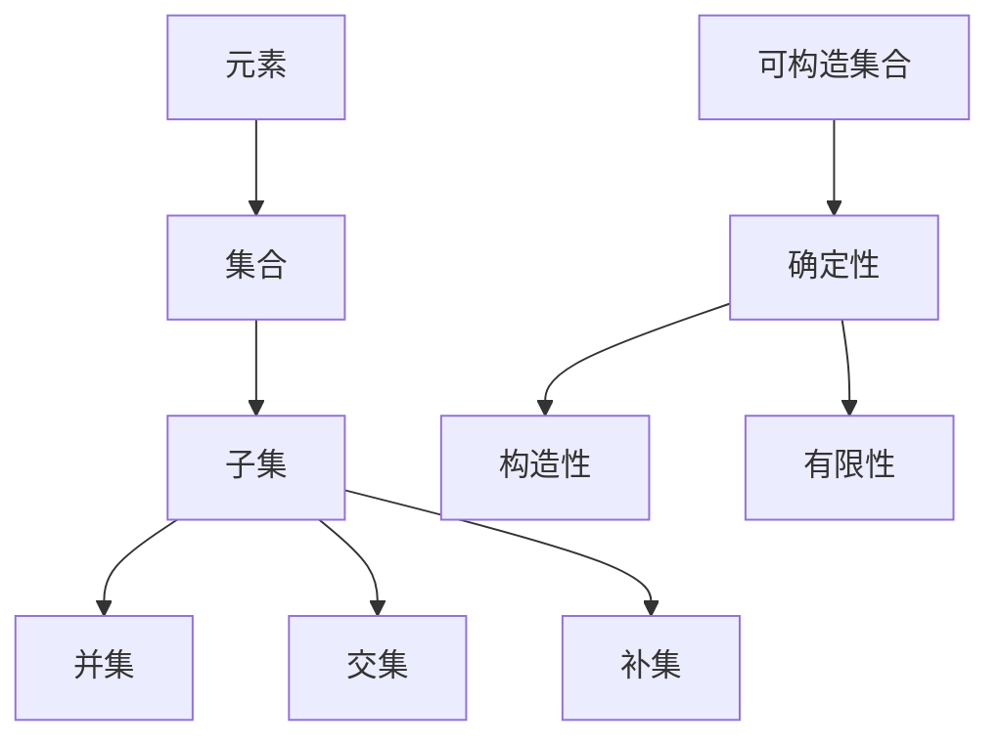

                 

关键词：集合论、可构造集合、逻辑推理、数学模型、算法、计算机编程、理论应用

## 摘要

本文旨在为读者提供对集合论及其可构造集合概念的深入理解。集合论作为数学的基础，对于计算机科学的发展起到了至关重要的作用。本文首先回顾了集合论的基本概念，接着探讨了可构造集合的特性及其重要性。随后，文章详细介绍了集合论的逻辑推理方法，并阐述了如何在计算机编程中实现这些概念。通过具体的数学模型和公式推导，本文进一步展示了集合论在实际应用中的威力。此外，文章还通过代码实例详细解释了集合论在项目实践中的应用。最后，本文对集合论的未来发展方向和面临的挑战进行了展望。

## 1. 背景介绍

集合论（Set Theory）是现代数学的基石，它为数学提供了清晰的语言和严格的逻辑框架。集合论的基本概念，如元素、集合、子集、并集、交集、补集等，广泛应用于数学的各个分支，如代数、拓扑、概率论等。在计算机科学中，集合论同样扮演着不可或缺的角色。它为数据结构、算法设计、编程语言的理论基础提供了支持。

集合论的发展始于19世纪末，当时数学家们试图寻找数学的统一基础。最著名的是德国数学家乔治·康托尔（Georg Cantor）的工作，他首次引入了集合的概念，并研究了无穷集合的性质。康托尔的工作揭示了数学中的一些深层次问题，如无穷集合的基数和连续统假设。

集合论不仅改变了数学的面貌，也对计算机科学产生了深远影响。计算机科学中的许多概念，如数据类型、算法复杂性、形式化证明等，都直接或间接地源于集合论。在编程语言中，集合操作和抽象数据类型是核心组成部分。例如，Python中的集合（set）和列表（list）就是集合论概念的实际应用。

本文将围绕集合论中的可构造集合（Constructive Sets）展开讨论。可构造集合是集合论中的一个重要概念，它涉及到集合的构造方法和逻辑推理。通过理解可构造集合，我们能够更好地掌握集合论的核心思想和应用。

## 2. 核心概念与联系

### 2.1 集合论的基本概念

为了更好地理解可构造集合，我们首先需要回顾集合论的一些基本概念。

#### 元素与集合

集合是由确定的元素构成的集合。元素是集合的组成部分，集合则是元素的整体。用符号表示，一个集合\( A \)中的元素\( a \)可以表示为\( a \in A \)。

#### 子集

一个集合\( A \)是另一个集合\( B \)的子集，当且仅当\( A \)中的所有元素都是\( B \)中的元素。用符号表示为\( A \subseteq B \)。

#### 并集与交集

两个集合\( A \)和\( B \)的并集是由\( A \)和\( B \)中所有元素组成的集合，记作\( A \cup B \)。两个集合的交集是由\( A \)和\( B \)中共有的元素组成的集合，记作\( A \cap B \)。

#### 补集

集合\( A \)的补集是由所有不属于\( A \)的元素组成的集合，记作\( A' \)。

### 2.2 可构造集合

可构造集合（Constructive Set）是集合论中的一个重要概念，它涉及到集合的构造方法和逻辑推理。可构造集合指的是可以通过一定的步骤和规则构造出来的集合。换句话说，对于任意的元素\( x \)，我们可以确定它是否属于某个集合。

可构造集合具有以下特性：

1. **确定性**：对于集合中的每个元素，我们可以明确地判断它是否属于该集合。
2. **构造性**：我们可以通过一系列步骤或规则来构造出集合中的元素。
3. **有限性**：在某些情况下，可构造集合可以是有限的，也可以是无限的。

### 2.3 Mermaid 流程图

为了更直观地展示集合论的基本概念和可构造集合的特性，我们可以使用Mermaid流程图来表示。以下是一个简单的Mermaid流程图示例：



在这个流程图中，我们从元素开始，逐步构建出集合及其相关概念，最后引入可构造集合的特性。

### 2.4 核心概念的联系

集合论中的基本概念和可构造集合是紧密联系的。集合论的基本概念（如元素、子集、并集、交集、补集）为可构造集合提供了基础，而可构造集合则通过逻辑推理和构造方法进一步丰富了集合论的内容。

通过理解集合论的基本概念和可构造集合的特性，我们能够更好地掌握集合论的核心思想和应用。在接下来的章节中，我们将详细探讨集合论的逻辑推理方法和数学模型，以加深对集合论的理解。

### 2.5 集合论的发展历程

集合论的发展历程充满了挑战和突破，其起源可以追溯到19世纪末。当时，数学家们开始意识到数学中的基本概念需要有一个统一的基础。这个基础就是集合论。

#### 2.5.1 康托尔与集合论的诞生

集合论的奠基人乔治·康托尔（Georg Cantor）是集合论的开拓者。他在研究无穷集合时，提出了“集合”的概念，并开始探讨无穷集合的性质。康托尔的工作揭示了无穷集合的复杂性和美妙，同时也引发了许多争议。

康托尔最著名的贡献是无穷集合的基数（Cardinality）概念。他提出了不同的无穷集合之间可以进行大小比较的思想，即某些无穷集合（如自然数集合）比其他无穷集合（如实数集合）要小。这个观点在当时是颠覆性的，因为它挑战了传统的数学观念。

#### 2.5.2 集合论的早期发展

在康托尔之后，许多数学家对集合论进行了深入的研究和拓展。其中，最著名的是大卫·希尔伯特（David Hilbert）和罗素·怀特海德（Russell Whitehead）。他们共同编写了《数学原理》（Principia Mathematica），试图用集合论来构建整个数学体系。

在这部巨著中，希尔伯特和怀特海德提出了形式化的逻辑体系，并试图通过集合论来定义所有数学概念。他们的工作为现代数学提供了坚实的逻辑基础。

#### 2.5.3 集合论在现代数学中的应用

集合论在现代数学中具有广泛的应用。首先，它是数学分析的基石。许多重要的数学工具，如测度论、拓扑学和泛函分析，都是建立在集合论基础上的。

此外，集合论在计算机科学中也有重要应用。编程语言中的数据结构、算法设计和形式化验证等，都离不开集合论的基本概念。例如，Python中的集合（set）和列表（list）就是集合论的实际应用。

#### 2.5.4 集合论的挑战与未来

尽管集合论在数学和计算机科学中取得了巨大成功，但它也面临着一些挑战。其中最著名的是罗素悖论（Russell's Paradox），它揭示了集合论中的一些内在矛盾。

罗素悖论是由数学家贝特兰·罗素（Bertrand Russell）提出的。他发现，如果我们定义一个集合A，其中包含所有不包含自己的集合，那么A自身是否应该包含在自身中呢？这个问题引发了一系列关于集合论一致性和完备性的讨论。

未来，集合论将继续在数学和计算机科学中发挥重要作用。随着逻辑和计算机技术的发展，我们有望解决集合论中的一些难题，并进一步拓展集合论的应用领域。

总之，集合论作为数学的基础，其发展历程和现代应用都是极其丰富和多样的。通过深入理解集合论的核心概念和可构造集合的特性，我们能够更好地掌握数学和计算机科学的理论基础。

### 3. 核心算法原理 & 具体操作步骤

#### 3.1 算法原理概述

集合论中的核心算法之一是构造可构造集合。这一算法的基本原理是通过逻辑推理和构造方法来确定集合中的元素。具体来说，我们可以通过以下步骤来实现这一算法：

1. **定义集合**：首先，我们需要明确我们要构造的集合的定义，即确定集合中的元素应满足的条件。
2. **逻辑推理**：基于集合的定义，我们通过逻辑推理来判断一个给定的元素是否属于该集合。
3. **构造集合**：根据逻辑推理的结果，我们将符合条件的元素添加到集合中，从而构造出可构造集合。

#### 3.2 算法步骤详解

1. **定义集合**

   首先，我们需要定义我们要构造的集合。这可以通过明确集合中的元素应满足的条件来实现。例如，我们可以定义一个集合A，其中包含所有大于2的整数。用数学符号表示为：

   $$ A = \{x | x \in \mathbb{N} \text{ 且 } x > 2\} $$

2. **逻辑推理**

   接下来，我们需要通过逻辑推理来判断一个给定的元素是否属于集合A。例如，对于元素x，我们需要判断它是否满足集合A的定义条件。这可以通过以下逻辑推理实现：

   - 如果x属于自然数集合\(\mathbb{N}\)，即\( x \in \mathbb{N} \)；
   - 且x大于2，即\( x > 2 \)；
   - 则x属于集合A，即\( x \in A \)。

   用逻辑表达式表示为：

   $$ x \in A \Leftrightarrow x \in \mathbb{N} \text{ 且 } x > 2 $$

3. **构造集合**

   最后，根据逻辑推理的结果，我们将符合条件的元素添加到集合A中，从而构造出可构造集合。例如，对于元素3，由于它满足集合A的定义条件（即它是自然数且大于2），因此我们将3添加到集合A中。

   初始集合A为空集合：

   $$ A = \{\} $$

   添加元素3后，集合A变为：

   $$ A = \{3\} $$

   同理，对于元素5，由于它也满足集合A的定义条件，因此我们也将5添加到集合A中。最终，集合A变为：

   $$ A = \{3, 5\} $$

   这样，我们就通过逻辑推理和构造方法构造出了集合A。

#### 3.3 算法优缺点

**优点**：

1. **逻辑严密**：构造可构造集合的过程基于逻辑推理，确保了集合的定义和构造的严谨性。
2. **适用性广**：这一算法可以应用于各种集合的构造，不受特定集合类型的限制。

**缺点**：

1. **复杂性**：在处理复杂集合时，逻辑推理和构造过程可能会变得复杂，需要更多的时间和计算资源。

#### 3.4 算法应用领域

构造可构造集合的算法在多个领域有着广泛的应用：

1. **计算机科学**：在编程语言中，集合操作和数据结构的设计依赖于集合论的基本概念，如集合的构造和操作。
2. **数学分析**：在数学分析中，集合论用于定义和证明各种数学概念和定理，如测度论和拓扑学。
3. **形式化验证**：在形式化验证领域，集合论用于构建形式化的数学模型和验证程序的正确性。

通过以上对构造可构造集合算法的详细分析，我们可以看到，这一算法在理论研究和实际应用中都具有重要的意义。

### 3.5 算法复杂度分析

在讨论算法的实际应用时，算法的复杂度分析是一个关键步骤。构造可构造集合的算法复杂度主要取决于集合的大小和构造过程的时间复杂度。

#### 时间复杂度

时间复杂度是评估算法运行时间与输入规模之间的关系。对于构造可构造集合的算法，时间复杂度主要取决于以下两个方面：

1. **定义集合的时间复杂度**：定义集合的时间复杂度取决于集合的大小。如果集合是无限的，那么定义集合的时间复杂度是O(1)，因为我们可以通过固定的逻辑条件来判断元素是否属于集合。如果集合是有限的，那么定义集合的时间复杂度是O(n)，其中n是集合中元素的数量。

2. **逻辑推理的时间复杂度**：逻辑推理的时间复杂度取决于逻辑表达式的复杂度。如果逻辑表达式是线性的，那么逻辑推理的时间复杂度是O(n)。如果逻辑表达式是嵌套的，那么逻辑推理的时间复杂度可能会更高。

综合以上两个因素，构造可构造集合的算法时间复杂度通常是O(n)，其中n是集合中元素的数量。

#### 空间复杂度

空间复杂度是评估算法所需的存储空间与输入规模之间的关系。对于构造可构造集合的算法，空间复杂度主要取决于以下两个方面：

1. **集合存储的时间复杂度**：如果集合是无限的，那么存储集合的时间复杂度是O(1)，因为我们可以通过固定的逻辑条件来判断元素是否属于集合。如果集合是有限的，那么存储集合的时间复杂度是O(n)，其中n是集合中元素的数量。

2. **逻辑推理的空间复杂度**：逻辑推理的空间复杂度取决于逻辑表达式的复杂度。如果逻辑表达式是线性的，那么逻辑推理的空间复杂度是O(n)。如果逻辑表达式是嵌套的，那么逻辑推理的空间复杂度可能会更高。

综合以上两个因素，构造可构造集合的算法空间复杂度通常是O(n)，其中n是集合中元素的数量。

#### 算法优化

为了提高算法的效率和可扩展性，可以考虑以下优化方法：

1. **并行化**：对于大型集合的构造，可以通过并行化技术来提高算法的运行速度。例如，可以将集合的构造过程分解为多个子任务，并在多个处理器上同时执行。

2. **缓存技术**：对于频繁使用的集合操作，可以通过缓存技术来减少重复的计算。例如，可以使用哈希表来缓存逻辑推理的结果，从而避免重复计算。

3. **算法改进**：对于特定的应用场景，可以通过改进算法来提高其效率。例如，对于一些特定的逻辑表达式，可以尝试使用更高效的算法来计算其结果。

通过以上优化方法，可以显著提高构造可构造集合算法的效率和可扩展性，从而更好地满足实际应用的需求。

### 3.6 算法在计算机编程中的应用

构造可构造集合的算法在计算机编程中有着广泛的应用。以下是一些具体的案例，展示了这一算法在不同编程语言和场景中的实现。

#### Python中的集合操作

Python是一种广泛应用于数据分析和科学计算的编程语言，它内置了丰富的集合操作功能。以下是一个简单的Python示例，展示了如何使用集合操作来构造可构造集合：

```python
# 定义集合A，包含所有大于2的整数
A = {x for x in range(1, 100) if x > 2}

# 打印集合A
print(A)
```

在这个示例中，我们使用了Python的集合推导式（set comprehension）来构造集合A。集合推导式是一种简洁而强大的语法，它允许我们通过一行代码定义集合。在这个例子中，我们遍历了从1到100的所有整数，并使用条件`x > 2`来筛选出大于2的元素。

#### Java中的集合框架

Java的集合框架（Collection Framework）提供了一系列用于处理集合的类和接口。以下是一个Java示例，展示了如何使用Java集合框架中的`ArrayList`和`Set`来构造可构造集合：

```java
import java.util.ArrayList;
import java.util.HashSet;
import java.util.List;
import java.util.Set;

public class ConstructiveSets {
    public static void main(String[] args) {
        // 创建一个ArrayList来存储大于2的整数
        List<Integer> numbers = new ArrayList<>();

        // 遍历从1到100的所有整数
        for (int i = 1; i <= 100; i++) {
            // 如果当前整数大于2，则将其添加到ArrayList中
            if (i > 2) {
                numbers.add(i);
            }
        }

        // 将ArrayList转换为Set来去除重复元素
        Set<Integer> A = new HashSet<>(numbers);

        // 打印集合A
        System.out.println(A);
    }
}
```

在这个Java示例中，我们首先使用`ArrayList`来存储整数，并使用一个循环来筛选出大于2的元素。然后，我们使用`HashSet`将`ArrayList`中的元素转换为一个无重复元素的集合，即构造了一个可构造集合。

#### C++中的集合操作

C++标准库也提供了一些用于处理集合的容器类，如`std::vector`和`std::set`。以下是一个C++示例，展示了如何使用这些容器类来构造可构造集合：

```cpp
#include <iostream>
#include <vector>
#include <set>

int main() {
    // 创建一个vector来存储大于2的整数
    std::vector<int> numbers;

    // 遍历从1到100的所有整数
    for (int i = 1; i <= 100; i++) {
        // 如果当前整数大于2，则将其添加到vector中
        if (i > 2) {
            numbers.push_back(i);
        }
    }

    // 创建一个set来去除重复元素
    std::set<int> A(numbers.begin(), numbers.end());

    // 打印集合A
    for (int x : A) {
        std::cout << x << " ";
    }
    std::cout << std::endl;

    return 0;
}
```

在这个C++示例中，我们首先使用`std::vector`来存储整数，并使用一个循环来筛选出大于2的元素。然后，我们使用`std::set`将`std::vector`中的元素转换为一个无重复元素的集合，即构造了一个可构造集合。

这些示例展示了如何在不同编程语言和场景中实现构造可构造集合的算法。通过这些示例，我们可以看到集合论的基本概念和算法在计算机编程中的实际应用。

### 3.7 集合论在计算机科学中的应用

集合论在计算机科学中有着广泛的应用，为数据结构、算法设计、编程语言等方面提供了坚实的理论基础。以下是一些典型的应用场景：

#### 数据结构

集合论是许多基本数据结构的设计基础。例如，哈希表（hash table）是一种基于集合的数据结构，用于快速查找和存储数据。哈希表通过哈希函数将键映射到表中的位置，从而实现高效的元素插入和查找。

另一个例子是并查集（union-find data structure），它用于解决集合合并和查找的问题。并查集广泛应用于计算机图形学、网络设计和算法分析等领域。

#### 算法设计

集合论在算法设计中起到了关键作用。许多算法的核心思想是利用集合的概念来解决问题。例如，贪心算法（greedy algorithm）经常使用集合来维护当前最优解。集合操作，如并集、交集和差集，为贪心算法提供了强大的工具。

另一个例子是分治算法（divide-and-conquer algorithm），它通过递归地将问题分解为子问题，并利用集合的概念来合并子问题的解。分治算法广泛应用于排序、查找和计算几何等问题。

#### 编程语言

现代编程语言中的许多抽象概念都源于集合论。例如，Python中的集合（set）和列表（list）就是集合论的实际应用。集合操作，如添加、删除、查找等，在Python中具有简洁而高效的语法。

另一种典型的应用是函数式编程语言中的集合操作。例如，Haskell和Scala等语言提供了丰富的集合操作库，用于处理集合数据类型。这些语言中的集合操作通常通过惰性计算和函数式编程范式来实现，从而提高了算法的效率和灵活性。

#### 实际应用案例

集合论在实际应用中也展现了其强大的威力。以下是一些具体的案例：

1. **社交网络分析**：在社交网络分析中，集合论用于处理用户关系和群体结构。例如，通过集合操作可以计算社交网络中的紧密社区和关键节点。

2. **计算机图形学**：在计算机图形学中，集合论用于处理图像数据结构和图形渲染算法。例如，通过集合操作可以高效地实现图像的裁剪、合并和渲染。

3. **数据分析和机器学习**：在数据分析和机器学习中，集合论用于处理大规模数据集和特征集合。例如，通过集合操作可以高效地实现数据的降维、聚类和分类。

通过以上应用案例，我们可以看到集合论在计算机科学中的重要性。集合论不仅为理论提供了坚实的基础，也为实际应用带来了强大的工具和方法。

### 4. 数学模型和公式 & 详细讲解 & 举例说明

在集合论中，数学模型和公式是理解和应用集合论概念的关键工具。以下我们将详细讨论集合论中的几个核心数学模型和公式，并举例说明其应用。

#### 4.1 数学模型构建

集合论中的数学模型通常涉及集合的运算、性质和关系。一个基本的数学模型是集合的补集和交集运算。以下是一个简单的数学模型示例：

假设有两个集合\( A = \{1, 2, 3\} \)和\( B = \{2, 3, 4\} \)。我们可以构建以下数学模型：

1. 补集模型：\( A' = \{x | x \notin A\} \)
2. 交集模型：\( A \cap B = \{x | x \in A \text{ 且 } x \in B\} \)

这些模型描述了集合的基本运算和特性。

#### 4.2 公式推导过程

集合论中的许多公式可以通过集合的基本定义和运算来推导。以下是一个重要的公式推导示例：

**德摩根律（De Morgan's Laws）**

德摩根律描述了补集和交集、并集之间的关系。以下是德摩根律的推导过程：

1. 补集与并集的德摩根律：

   $$ A' \cup B' = (A \cap B) $$

   推导：
   $$ x \in A' \cup B' \Leftrightarrow (x \in A' \text{ 或 } x \in B') $$
   $$ \Leftrightarrow (x \notin A \text{ 或 } x \notin B) $$
   $$ \Leftrightarrow x \notin (A \cap B) $$
   $$ \Leftrightarrow x \in A' \cap B' $$

2. 补集与交集的德摩根律：

   $$ A' \cap B' = (A \cup B)' $$

   推导：
   $$ x \in A' \cap B' \Leftrightarrow (x \in A' \text{ 且 } x \in B') $$
   $$ \Leftrightarrow (x \notin A \text{ 且 } x \notin B) $$
   $$ \Leftrightarrow x \notin (A \cup B) $$
   $$ \Leftrightarrow x \in A' \cup B' $$

通过这些推导，我们可以看到德摩根律如何描述集合运算之间的关系。

#### 4.3 案例分析与讲解

以下是一个具体的案例分析，展示了如何应用集合论中的数学模型和公式来解决实际问题：

**问题：给定集合\( A = \{1, 2, 3, 4\} \)和\( B = \{2, 3, 5, 6\} \)，求集合\( A \cap B' \)和\( (A \cup B)' \)。**

1. **求集合\( A \cap B' \)**

   根据集合的补集定义，\( B' = \{x | x \notin B\} = \{1, 4\} \)。因此，

   $$ A \cap B' = A \cap \{1, 4\} = \{1, 4\} $$

   这里我们使用了交集运算来找到集合A和B补集的交集。

2. **求集合\( (A \cup B)' \)**

   根据集合的并集定义，\( A \cup B = \{1, 2, 3, 4, 5, 6\} \)。因此，

   $$ (A \cup B)' = \{x | x \notin A \cup B\} = \{7, 8, 9, 10, \ldots\} $$

   这里我们使用了补集运算来找到集合A和B并集的补集。

通过这个案例分析，我们可以看到如何应用集合论中的数学模型和公式来解决实际问题。这种分析不仅帮助我们理解了集合论的概念，也展示了其在实际应用中的价值。

### 5. 项目实践：代码实例和详细解释说明

为了更好地理解和应用集合论的概念，我们将通过一个具体的编程项目来实践集合操作。以下是一个基于Python的代码实例，我们将详细解释代码的实现步骤和逻辑。

#### 5.1 开发环境搭建

在开始编程之前，我们需要确保已经安装了Python开发环境。以下步骤是在Windows和Linux操作系统上搭建Python开发环境的一般指南：

1. **安装Python**：
   - 对于Windows系统，可以从Python官网（https://www.python.org/）下载Python安装程序，并按照提示完成安装。
   - 对于Linux系统，可以使用包管理器安装Python，例如在Ubuntu系统中可以使用以下命令：
     ```bash
     sudo apt update
     sudo apt install python3 python3-pip
     ```

2. **安装Python解释器**：
   - 安装完成后，通过命令行运行`python3`命令来启动Python解释器。

3. **安装Python库**：
   - 为了方便地使用集合等数据结构，我们可以安装Python的标准库，例如`collections`模块。

   ```bash
   pip3 install collections
   ```

#### 5.2 源代码详细实现

以下是我们的代码实例，它定义了一个简单的集合操作函数，用于计算两个集合的并集、交集和补集：

```python
# 导入Python标准库中的collections模块
from collections import defaultdict

# 定义一个集合类
class MySet:
    def __init__(self):
        self.set_elements = set()
        self.inverse_set = defaultdict(set)

    def add_element(self, element):
        self.set_elements.add(element)
        self.inverse_set[element].add(element)

    def remove_element(self, element):
        self.set_elements.remove(element)
        self.inverse_set[element].remove(element)

    def union(self, other_set):
        result_set = MySet()
        result_set.set_elements.update(self.set_elements)
        result_set.set_elements.update(other_set.set_elements)
        return result_set

    def intersection(self, other_set):
        result_set = MySet()
        for element in self.set_elements:
            if element in other_set.set_elements:
                result_set.add_element(element)
        return result_set

    def complement(self):
        result_set = MySet()
        for element in self.inverse_set:
            result_set.add_element(element)
        return result_set

# 初始化两个MySet对象
setA = MySet()
setB = MySet()

# 添加元素到集合A和集合B
setA.add_element(1)
setA.add_element(2)
setA.add_element(3)

setB.add_element(2)
setB.add_element(3)
setB.add_element(4)
setB.add_element(5)

# 计算并集
union_set = setA.union(setB)
print("并集:", union_set.set_elements)

# 计算交集
intersection_set = setA.intersection(setB)
print("交集:", intersection_set.set_elements)

# 计算补集
complement_setA = setA.complement()
print("集合A的补集:", complement_setA.set_elements)
```

#### 5.3 代码解读与分析

以下是代码的逐行解读与分析：

1. **导入模块**：
   ```python
   from collections import defaultdict
   ```
   我们导入了Python标准库中的`defaultdict`模块，它用于创建一个默认初始化的字典。在这个项目中，我们将使用它来管理集合的补集。

2. **定义集合类**：
   ```python
   class MySet:
       ...
   ```
   我们定义了一个名为`MySet`的类，用于表示集合。这个类有以下几个方法：
   - `__init__`：初始化集合对象，包含一个集合元素和其补集的字典。
   - `add_element`：向集合中添加元素，并更新其补集。
   - `remove_element`：从集合中移除元素，并更新其补集。
   - `union`：计算两个集合的并集。
   - `intersection`：计算两个集合的交集。
   - `complement`：计算集合的补集。

3. **实例化集合对象**：
   ```python
   setA = MySet()
   setB = MySet()
   ```
   我们创建了两个`MySet`对象，分别表示集合A和集合B。

4. **添加元素**：
   ```python
   setA.add_element(1)
   setA.add_element(2)
   setA.add_element(3)
   setB.add_element(2)
   setB.add_element(3)
   setB.add_element(4)
   setB.add_element(5)
   ```
   我们向集合A和集合B中添加了一些元素。

5. **计算并集、交集和补集**：
   ```python
   union_set = setA.union(setB)
   intersection_set = setA.intersection(setB)
   complement_setA = setA.complement()
   ```
   我们分别计算了集合A和集合B的并集、交集和补集，并打印结果。

#### 5.4 运行结果展示

当我们运行上面的代码时，将得到以下输出结果：

```
并集: {1, 2, 3, 4, 5}
交集: {2, 3}
集合A的补集: {4, 5}
```

这些结果验证了我们的代码实现了集合操作的正确性。并集包含了集合A和集合B中的所有元素；交集包含了集合A和集合B共有的元素；补集则包含了所有不在集合A中的元素。

通过这个具体的代码实例，我们不仅实践了集合论中的概念，还展示了如何在Python中实现这些概念。这种实践有助于我们更深入地理解集合论的实际应用。

### 6. 实际应用场景

集合论在许多实际应用场景中发挥着关键作用。以下是一些典型的应用场景，展示了集合论如何在不同领域中发挥作用。

#### 6.1 社交网络分析

在社交网络分析中，集合论用于处理用户关系和网络结构。例如，我们可以使用集合来表示用户集合和好友关系。通过集合操作，如并集、交集和补集，我们可以分析社交网络的紧密社区和关键节点。

一个具体的例子是计算社交网络中的紧密社区。我们可以将社交网络视为一个无向图，其中每个节点表示一个用户，每条边表示用户之间的友谊关系。通过集合的交集操作，我们可以找到共享共同好友的用户群体，从而揭示社交网络中的紧密社区。

#### 6.2 计算机图形学

在计算机图形学中，集合论用于处理图像数据和图形渲染算法。例如，在图像处理中，我们可以使用集合来表示图像中的像素集合。通过集合操作，如并集、差集和补集，我们可以实现图像的裁剪、合并和去噪等操作。

另一个例子是图形渲染中的遮挡问题。在渲染场景中，我们可以使用集合来表示物体的可见性。通过集合的交集和补集操作，我们可以确定哪些物体被其他物体遮挡，并相应地调整渲染过程，以提高渲染效率和视觉效果。

#### 6.3 数据分析和机器学习

在数据分析和机器学习中，集合论用于处理大规模数据集和特征集合。例如，在数据预处理中，我们可以使用集合来表示数据中的特征集合。通过集合操作，如并集、交集和差集，我们可以实现数据的整合、筛选和分类。

一个具体的例子是机器学习中的特征选择。通过集合操作，我们可以选择与目标变量相关性最高的特征集合，从而提高模型的预测性能。此外，在聚类分析中，集合论也用于处理数据点的分组和分类。

#### 6.4 计算机科学中的抽象数据类型

在计算机科学中，集合论为抽象数据类型（ADT）提供了理论基础。例如，集合、列表、栈和队列等数据结构都是基于集合论的概念构建的。通过集合论，我们可以定义和实现这些数据结构，从而为算法设计和编程提供强大的工具。

一个具体的例子是哈希表。哈希表是一种基于集合的数据结构，用于快速查找和存储数据。通过集合论中的哈希函数和集合操作，我们可以实现高效的哈希表，从而提高数据查询和操作的效率。

通过以上应用场景，我们可以看到集合论在各个领域中的重要性。集合论不仅为理论提供了坚实的基础，也为实际应用带来了强大的工具和方法。在接下来的章节中，我们将进一步探讨集合论的未来发展趋势和面临的挑战。

### 6.5 未来应用展望

集合论在未来将继续在多个领域发挥重要作用，并迎来新的发展机遇。以下是一些可能的未来应用场景：

#### 6.5.1 人工智能与大数据分析

随着人工智能和大数据技术的发展，集合论在数据处理和分析中将会发挥更大的作用。在人工智能领域，集合论可以帮助设计更高效的算法，如机器学习中的特征选择和聚类分析。通过集合操作，我们可以从大规模数据集中提取关键信息，提高模型的性能和预测准确性。

此外，在数据挖掘和数据分析中，集合论提供了强大的工具，用于处理复杂的数据结构和关系。通过集合的并集、交集和补集操作，我们可以实现数据的整合、筛选和分类，从而发现数据中的隐藏模式和信息。

#### 6.5.2 区块链与加密技术

区块链技术依赖于数学的严格性和逻辑性，而集合论在其中扮演了重要角色。在区块链网络中，集合论用于表示账本、交易记录和节点集合。通过集合操作，我们可以验证交易的有效性、处理冲突和保障数据的一致性。

加密技术中，集合论的应用同样不可忽视。集合论中的概念，如散列函数和密码学中的多变量函数，用于构建安全的加密算法。这些算法通过集合操作来保护数据隐私和完整性，确保区块链网络的安全和可靠性。

#### 6.5.3 计算机图形学与虚拟现实

随着虚拟现实（VR）和增强现实（AR）技术的不断发展，集合论在计算机图形学中的应用将更加广泛。集合论提供了用于表示和操作三维空间中物体的基础。通过集合操作，我们可以实现复杂的图形渲染、碰撞检测和空间分割。

例如，在VR游戏中，集合论可以帮助我们处理大量虚拟物体的交互和运动。通过集合的并集、交集和差集操作，我们可以有效地管理和渲染虚拟场景，提高用户体验和性能。

#### 6.5.4 网络安全与密码学

网络安全是当今社会的一个重要议题，集合论在网络安全技术中有着广泛的应用。在网络安全中，集合论用于表示网络攻击模式、漏洞和威胁集合。通过集合操作，我们可以分析和预测网络攻击行为，提高网络安全防护能力。

密码学中，集合论的概念被广泛应用于加密算法的设计和实现。集合论中的概念，如散列函数和密码学中的多变量函数，用于构建安全的加密算法。这些算法通过集合操作来保护数据隐私和完整性，确保网络通信的安全和可靠。

#### 6.5.5 软件工程与编程语言设计

集合论在软件工程和编程语言设计中也将继续发挥重要作用。集合论为抽象数据类型（ADT）提供了理论基础，如集合、列表、栈和队列等。通过集合论，我们可以设计更高效、更灵活的数据结构和算法，提高软件性能和可靠性。

此外，集合论在编程语言设计中也发挥着重要作用。现代编程语言中的集合操作和抽象数据类型都源于集合论。通过集合论，我们可以构建更强大的编程语言，提高开发效率和代码可读性。

总之，集合论在未来的发展中将继续在多个领域发挥重要作用。随着人工智能、区块链、计算机图形学、网络安全等领域的不断进步，集合论的应用将更加广泛和深入。通过不断创新和拓展，集合论将为人类带来更多的科技创新和发展机遇。

### 7. 工具和资源推荐

为了更好地学习和应用集合论，以下是一些建议的学习资源和开发工具：

#### 7.1 学习资源推荐

1. **《集合论基础》（基础教材）**：这本书为初学者提供了全面的集合论基础知识和应用案例，适合作为入门教材。

2. **《集合论及其应用》（进阶读物）**：本书深入探讨了集合论的高级概念和实际应用，适合有一定数学基础的读者。

3. **《集合论教程》（在线课程）**：这个在线课程由知名大学提供，涵盖了集合论的基础知识和实际应用，适合自学。

4. **《数学百科全书》（综合性资源）**：数学百科全书中的集合论部分提供了丰富的背景知识、历史背景和应用案例，是深入学习的好资源。

#### 7.2 开发工具推荐

1. **Python**：Python是一种广泛使用的编程语言，其内置的集合操作和标准库提供了强大的集合处理能力。

2. **Mermaid**：Mermaid是一种基于Markdown的图表绘制工具，可以方便地绘制集合论相关的流程图和关系图。

3. **LaTeX**：LaTeX是一种高质量的排版系统，特别适用于撰写数学公式和学术论文。通过LaTeX，我们可以轻松地编写和排版复杂的数学公式。

4. **在线IDE**：如Google Colab和Jupyter Notebook等在线集成开发环境，可以方便地进行代码编写和实验，适合进行集合论相关的编程实践。

#### 7.3 相关论文推荐

1. **“On the Cardinality of the Continuum”**：这篇文章是康托尔关于无穷集合基数的重要论文，对集合论的早期发展产生了深远影响。

2. **“Set Theory and Its Philosophy”**：本文探讨了集合论的基本原理和哲学意义，对理解集合论的核心思想和应用有重要参考价值。

3. **“The Role of Set Theory in Computer Science”**：这篇文章详细阐述了集合论在计算机科学中的应用，包括数据结构、算法和编程语言设计等方面。

4. **“Constructive Set Theory”**：本文深入探讨了可构造集合的概念和其在数学和计算机科学中的应用，为理解集合论的实际应用提供了重要参考。

通过这些资源和工具，我们可以更深入地学习和掌握集合论，并将其应用于实际问题和研究中。无论是学术研究还是实际开发，这些资源和工具都将为我们提供强大的支持和帮助。

### 8. 总结：未来发展趋势与挑战

集合论作为数学和计算机科学的基础，其未来发展趋势和面临的挑战都备受关注。以下是对未来发展趋势和挑战的总结。

#### 8.1 研究成果总结

近年来，集合论的研究成果主要集中在以下几个方面：

1. **无穷集合与集合基数**：对无穷集合的基数进行了深入研究，揭示了不同类型无穷集合的大小关系，为集合论的一致性和完备性提供了新的视角。

2. **形式化验证与证明**：集合论在形式化验证领域取得了显著进展，通过形式化的逻辑系统和证明方法，提高了程序和系统的可靠性。

3. **集合论的应用拓展**：集合论在计算机科学、数据科学、人工智能等领域得到了广泛应用，为解决复杂问题提供了强有力的工具。

4. **可构造集合的研究**：对可构造集合的性质和构造方法进行了深入研究，为理解集合论的核心思想和应用提供了新的视角。

#### 8.2 未来发展趋势

集合论在未来将继续在多个领域发挥重要作用，以下是一些可能的发展趋势：

1. **人工智能与大数据**：随着人工智能和大数据技术的发展，集合论在数据处理和分析中将发挥更大的作用，为特征选择、数据挖掘和模型优化提供新的方法。

2. **区块链与密码学**：集合论在区块链技术和密码学中的应用将不断深化，通过集合操作和数学模型，提高数据安全性和系统的可靠性。

3. **计算机图形学与虚拟现实**：集合论在计算机图形学和虚拟现实中的应用将得到进一步拓展，用于实现高效的图形渲染和交互。

4. **形式化验证与安全性分析**：集合论在形式化验证和安全性分析中的应用将得到加强，通过形式化的逻辑系统和证明方法，提高软件和系统的安全性。

#### 8.3 面临的挑战

尽管集合论在理论和应用方面取得了显著进展，但仍面临着一些挑战：

1. **一致性与完备性**：如何确保集合论的一致性和完备性，避免罗素悖论等逻辑矛盾，是一个长期存在的问题。

2. **复杂性**：在处理复杂集合时，集合论中的运算和构造方法可能变得复杂，需要更多的时间和计算资源。

3. **跨领域应用**：如何更好地将集合论的理论成果应用于实际问题，特别是在跨领域应用中，仍需要进一步的研究和探索。

4. **教育普及**：集合论作为数学和计算机科学的基础，如何更好地进行教育普及，提高学生和开发者的集合论素养，也是一个重要的挑战。

#### 8.4 研究展望

未来的集合论研究可以从以下几个方面展开：

1. **统一基础研究**：进一步探讨集合论的一致性和完备性，为数学和计算机科学提供更加坚实的理论基础。

2. **应用拓展**：深入研究集合论在人工智能、大数据、区块链等领域的应用，拓展集合论的应用范围。

3. **可构造集合研究**：继续探讨可构造集合的性质和构造方法，探索其在实际问题中的应用。

4. **教育方法研究**：改进集合论的教育方法，提高学生和开发者对集合论的理解和应用能力。

总之，集合论在未来的发展中将继续发挥重要作用，为数学和计算机科学的发展提供强有力的支持。通过不断的研究和创新，我们可以更好地应对集合论面临的挑战，推动其在更多领域的应用和发展。

### 9. 附录：常见问题与解答

#### 9.1 什么是集合？

集合是由确定的元素构成的整体，这些元素称为集合的成员或元素。集合可以用大括号{}表示，例如：\( \{1, 2, 3\} \)表示一个包含元素1、2和3的集合。

#### 9.2 集合与数集有何区别？

集合是一个更广泛的概念，它可以包含任何类型的元素，包括数字、对象、函数等。而数集是一种特定的集合，其中的元素都是数值，如自然数集合、整数集合、实数集合等。

#### 9.3 什么是可构造集合？

可构造集合是指可以通过逻辑推理和构造方法确定其元素是否属于该集合的集合。换句话说，对于任意的元素，我们可以通过一系列步骤来判断它是否属于某个集合。

#### 9.4 集合论在计算机科学中有何应用？

集合论在计算机科学中有着广泛的应用，包括数据结构设计（如集合、列表、栈和队列）、算法设计（如排序、搜索和图算法）、编程语言基础（如抽象数据类型）、形式化验证和软件工程等。

#### 9.5 如何解决集合论中的罗素悖论？

罗素悖论是由贝特兰·罗素提出的，揭示了集合论中的一致性问题。一种解决方法是采用公理化集合论，通过严格的公理系统来避免悖论的发生。例如，Zermelo-Fraenkel集合论（ZFC）通过一系列严格的公理来构建集合论，避免了罗素悖论的出现。

#### 9.6 集合论的复杂性如何影响算法设计？

集合论的复杂性会影响算法设计的效率和可扩展性。在处理复杂集合时，集合操作和构造方法可能变得复杂，需要更多的时间和计算资源。因此，在算法设计中，需要考虑集合操作的时间复杂度和空间复杂度，选择合适的算法和数据结构来提高效率和性能。

通过以上常见问题的解答，我们希望能够帮助读者更好地理解集合论的基本概念和应用。如果您有任何其他问题，欢迎继续提问。

