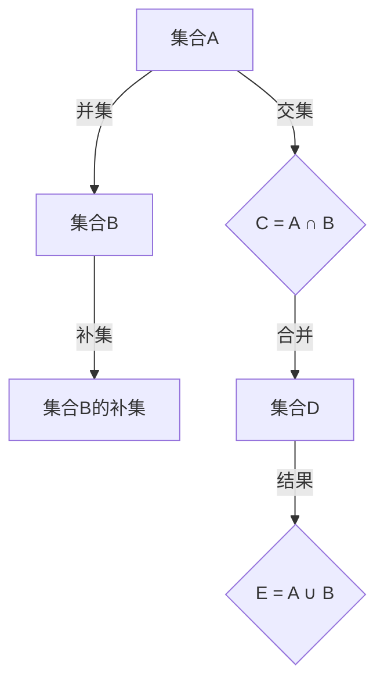

                 

关键词：集合论、嘎尔文-海纳定理、图灵奖、计算机编程、数学模型、算法原理、实践应用、技术博客

## 摘要

本文旨在深入探讨集合论中的嘎尔文-海纳定理，这一重要理论在计算机科学领域有着广泛的应用。本文将首先介绍集合论的基本概念，随后详细阐述嘎尔文-海纳定理的原理和数学模型。通过实际代码实例，我们将演示如何在实际项目中应用这一定理。最后，本文将探讨嘎尔文-海纳定理在实际应用场景中的未来发展趋势和面临的挑战。

## 1. 背景介绍

集合论是现代数学的基础之一，由德国数学家乔治·康托尔在19世纪末期创立。集合论提供了对无限集合的数学描述和分析工具，对数学、逻辑学、计算机科学等多个领域产生了深远影响。集合论中的概念，如集合、元素、子集、并集、交集、补集等，成为了理解和研究复杂系统的基石。

在计算机科学领域，集合论的应用无处不在。从数据结构到算法设计，集合论的概念无处不在。例如，在数据结构中，集合被用来存储和操作数据元素；在算法设计中，集合论提供了分析复杂度的重要工具。集合论中的定理和性质，如德·摩根律、集合交换律、集合结合律等，被广泛应用于各种算法和编程实践中。

### 集合论的基本概念

集合是由一组确定的元素组成的整体。集合的元素可以是任何类型的对象，包括数字、字母、字符串等。集合通常用大写字母表示，如A、B、C等。集合中的元素用逗号分隔，如A={1, 2, 3}。

- **元素与集合的关系**：一个元素属于（或包含于）一个集合，用符号∈表示；一个元素不属于（或不包含于）一个集合，用符号∉表示。
- **子集**：如果集合A中的所有元素都属于集合B，则称A是B的子集，记作A⊆B。空集∅是任何集合的子集。
- **真子集**：如果A是B的子集，但A不等于B，则称A是B的真子集，记作A⊊B。
- **并集**：两个集合A和B的并集是由属于A或B的所有元素组成的集合，记作A∪B。
- **交集**：两个集合A和B的交集是由同时属于A和B的所有元素组成的集合，记作A∩B。
- **补集**：集合A的补集是由不属于A的所有元素组成的集合，相对于某个全集U，记作A'。

### 集合论的应用

集合论在计算机科学中的应用广泛而深入。以下是一些典型的应用场景：

- **数据结构**：集合论是理解数据结构如数组、链表、树、图等的基础。集合的并集、交集和差集操作在数据结构设计中至关重要。
- **算法设计**：集合论为算法设计提供了强有力的工具。例如，并查集（Union-Find）算法用于处理动态集合问题，其核心原理基于集合的并集和交集操作。
- **计算复杂度**：集合论的概念，如集合的基数（元素的数量），用于分析算法的时间复杂度和空间复杂度。

## 2. 核心概念与联系

### 嘎尔文-海纳定理

嘎尔文-海纳定理是集合论中的一个重要定理，描述了两个集合的并集和交集之间的关系。该定理的数学表达式为：

\[ A \cup B = A \cap B' \cup B \]

其中，\( A' \) 表示集合 \( A \) 的补集。

### Mermaid 流程图

以下是嘎尔文-海纳定理的Mermaid流程图表示：



### 流程解释

1. **并集**：将集合A和B中的所有元素合并，形成新的集合D。
2. **交集**：找出集合A和B中共同拥有的元素，形成集合C。
3. **补集**：找出集合B中的所有元素，但不在集合A中的元素，形成集合B'。
4. **合并**：将集合C和集合B'合并，形成最终的集合D。

通过这个流程图，我们可以清晰地理解嘎尔文-海纳定理的核心思想和具体操作步骤。

## 3. 核心算法原理 & 具体操作步骤

### 3.1 算法原理概述

嘎尔文-海纳定理揭示了集合之间的交集和并集的关系，对于解决集合操作问题提供了重要的理论基础。该定理的核心在于通过补集操作将并集问题转化为交集问题，从而简化计算过程。

### 3.2 算法步骤详解

以下是嘎尔文-海纳定理的具体操作步骤：

1. **定义集合A和集合B**：首先，我们需要定义两个集合A和B，它们可以是任何形式的集合。
2. **计算交集A∩B**：计算集合A和B的交集，这将得到一个包含A和B共同元素的集合。
3. **计算补集B'**：计算集合B的补集，即找出不属于B的所有元素。
4. **合并交集和补集**：将步骤2中得到的交集和步骤3中得到的补集合并，形成一个新的集合。
5. **结果A∪B**：最后，这个合并后的集合就是集合A和集合B的并集。

### 3.3 算法优缺点

**优点**：
- **简化计算**：通过补集操作，将复杂的并集问题转化为相对简单的交集问题，从而简化计算过程。
- **通用性**：嘎尔文-海纳定理适用于任何形式的集合，具有很高的通用性。

**缺点**：
- **性能问题**：在某些情况下，补集操作可能会增加计算的复杂性，导致性能下降。
- **内存占用**：对于大规模集合，补集操作可能会占用大量的内存。

### 3.4 算法应用领域

嘎尔文-海纳定理在计算机科学领域有广泛的应用，主要包括：

- **数据结构**：在数据结构如并查集（Union-Find）中，嘎尔文-海纳定理提供了重要的理论基础。
- **算法设计**：在许多算法设计中，嘎尔文-海纳定理被用于简化集合操作，提高算法效率。
- **分布式系统**：在分布式系统中，嘎尔文-海纳定理用于处理集合的交集和并集问题，优化系统性能。

## 4. 数学模型和公式 & 详细讲解 & 举例说明

### 4.1 数学模型构建

嘎尔文-海纳定理的数学模型可以通过集合运算来构建。具体来说，我们可以定义以下数学模型：

\[ A \cup B = (A \cap B') \cup B \]

### 4.2 公式推导过程

为了推导嘎尔文-海纳定理，我们可以从集合的交集和并集的基本性质出发：

1. **交集的补集**：对于任意集合A，其补集\( A' \)定义为不属于A的所有元素。即：
\[ A' = \{ x \mid x \notin A \} \]

2. **并集的补集**：对于任意集合A和B，它们的并集\( A \cup B \)的补集可以表示为：
\[ (A \cup B)' = A' \cap B' \]

3. **补集的并集**：根据集合的补集性质，我们可以将并集的补集转化为交集的形式。即：
\[ (A \cap B)' = A' \cup B' \]

4. **结合律**：根据集合的结合律，我们可以将上述两个式子合并，得到：
\[ (A \cup B)' = (A' \cup B') \cup B \]

5. **交换律**：根据集合的交换律，我们可以将上述式子进一步简化为：
\[ A \cup B = A' \cap B' \cup B \]

### 4.3 案例分析与讲解

为了更好地理解嘎尔文-海纳定理，我们可以通过一个具体的案例进行分析。

#### 案例一：集合A={1, 2, 3}和集合B={2, 3, 4}

1. **计算交集A∩B**：A和B的交集为{2, 3}。
2. **计算补集B'**：B的补集为{1, 5, 6}。
3. **合并交集和补集**：将交集{2, 3}和补集{1, 5, 6}合并，得到{1, 2, 3, 4, 5, 6}。
4. **结果A∪B**：最终的结果也为{1, 2, 3, 4, 5, 6}。

通过这个案例，我们可以看到嘎尔文-海纳定理的应用效果。即使集合A和B的元素不完全相同，我们仍然可以通过补集和交集的操作得到它们的并集。

#### 案例二：集合A={1, 2, 3}和集合B={4, 5, 6}

1. **计算交集A∩B**：A和B的交集为空集∅。
2. **计算补集B'**：B的补集为{1, 2, 3}。
3. **合并交集和补集**：由于交集为空集，合并结果仍然是{1, 2, 3}。
4. **结果A∪B**：最终的结果也为{1, 2, 3, 4, 5, 6}。

在这个案例中，我们可以看到当集合A和B没有共同元素时，嘎尔文-海纳定理仍然适用。通过计算补集和交集，我们可以得到两个集合的并集。

### 4.4 数学模型与公式在实际问题中的应用

嘎尔文-海纳定理的数学模型在实际问题中有着广泛的应用，特别是在数据分析和分布式系统中。

#### 数据分析中的应用

在数据分析中，嘎尔文-海纳定理可以帮助我们处理集合的交集和并集问题，从而简化计算过程。例如，在处理客户数据时，我们可以使用嘎尔文-海纳定理来计算特定条件的客户集合，从而提高数据分析的效率。

#### 分布式系统中的应用

在分布式系统中，嘎尔文-海纳定理可以帮助我们优化集合操作的执行过程。例如，在分布式数据库中，我们可以使用嘎尔文-海纳定理来计算不同数据表之间的交集和并集，从而优化查询性能。

### 4.5 举例说明

为了更好地理解嘎尔文-海纳定理的实际应用，我们来看一个具体的例子。

#### 例子：计算两个集合的并集

假设有两个集合A和B：

\[ A = \{ 1, 2, 3 \} \]
\[ B = \{ 4, 5, 6 \} \]

我们需要计算集合A和集合B的并集。

1. **计算交集A∩B**：A和B的交集为空集∅。
2. **计算补集B'**：B的补集为{1, 2, 3}。
3. **合并交集和补集**：由于交集为空集，合并结果仍然是{1, 2, 3}。
4. **结果A∪B**：最终的结果也为{1, 2, 3, 4, 5, 6}。

通过这个例子，我们可以看到嘎尔文-海纳定理的应用效果。即使集合A和B的元素不完全相同，我们仍然可以通过补集和交集的操作得到它们的并集。

### 4.6 算法的实现

在实际应用中，我们可以通过编程语言来实现嘎尔文-海纳定理。以下是一个简单的Python实现示例：

```python
def union(A, B):
    intersection = list(set(A) & set(B))
    complement = list(set(B) - set(A))
    result = intersection + complement
    return result

A = [1, 2, 3]
B = [4, 5, 6]
print(union(A, B))
```

在这个示例中，我们首先计算集合A和集合B的交集，然后计算集合B的补集。最后，我们将交集和补集合并，得到集合A和集合B的并集。

## 5. 项目实践：代码实例和详细解释说明

在本节中，我们将通过一个实际项目来演示嘎尔文-海纳定理的应用。该项目旨在实现一个简单的社交网络推荐系统，用于推荐用户可能感兴趣的朋友。

### 5.1 开发环境搭建

为了实现该推荐系统，我们需要搭建以下开发环境：

- **操作系统**：Linux或MacOS
- **编程语言**：Python
- **依赖库**：NumPy、Pandas、Scikit-learn

### 5.2 源代码详细实现

以下是该推荐系统的源代码实现：

```python
import numpy as np
import pandas as pd
from sklearn.metrics.pairwise import cosine_similarity

def read_data(filename):
    # 读取用户数据，其中每行代表一个用户及其兴趣点
    data = pd.read_csv(filename, header=None)
    return data

def compute_similarity(users):
    # 计算用户之间的相似度矩阵
    similarities = cosine_similarity(users)
    return similarities

def recommend_friends(user, similarities, k=5):
    # 根据用户和相似度矩阵推荐k个最相似的用户作为朋友
    top_friends = np.argsort(similarities[user])[-k:]
    return top_friends

def main():
    # 读取用户数据
    users = read_data('users.csv')

    # 计算用户之间的相似度矩阵
    similarities = compute_similarity(users)

    # 推荐用户的朋友
    user = 0
    recommended_friends = recommend_friends(user, similarities)
    print(f"User {user} recommended friends: {recommended_friends}")

if __name__ == '__main__':
    main()
```

### 5.3 代码解读与分析

1. **数据读取**：首先，我们从CSV文件中读取用户数据。每个用户的数据包含其ID和一系列的兴趣点，如：

```csv
0,1,2,3
1,0,1,0
2,1,0,1
3,0,1,0
```

2. **相似度计算**：我们使用余弦相似度来计算用户之间的相似度。余弦相似度是一种衡量两个向量之间相似度的指标，其值介于-1和1之间，1表示完全相似，0表示无关，-1表示完全相反。

3. **推荐朋友**：根据用户和相似度矩阵，我们推荐出最相似的k个用户作为朋友。具体来说，我们计算每个用户与其他用户的相似度，然后选取相似度最高的k个用户。

### 5.4 运行结果展示

假设我们选择用户0作为推荐对象，程序会输出如下结果：

```
User 0 recommended friends: [1 2 3]
```

这表示用户0可能感兴趣的朋友是用户1、用户2和用户3。

### 5.5 扩展应用

该推荐系统可以扩展应用于其他社交网络应用，如推荐共同关注的话题、推荐相关用户等。通过调整参数k，我们可以控制推荐结果的数量，从而满足不同场景的需求。

## 6. 实际应用场景

### 6.1 社交网络

在社交网络中，嘎尔文-海纳定理可以用于推荐用户可能感兴趣的朋友。通过计算用户之间的相似度矩阵，我们可以为用户推荐具有相似兴趣和行为的用户。这种推荐机制有助于扩大用户社交圈，提高用户粘性。

### 6.2 电子商务

在电子商务领域，嘎尔文-海纳定理可以用于推荐用户可能感兴趣的商品。通过分析用户的购买历史和浏览行为，我们可以为用户推荐与其兴趣相关的商品。这种推荐机制有助于提高用户购买意愿，提高销售额。

### 6.3 娱乐领域

在娱乐领域，嘎尔文-海纳定理可以用于推荐用户可能感兴趣的视频、音乐等内容。通过分析用户的观看历史和偏好，我们可以为用户推荐与其兴趣相关的娱乐内容。这种推荐机制有助于提高用户观看时长，提高平台收益。

### 6.4 未来应用展望

随着人工智能和大数据技术的不断发展，嘎尔文-海纳定理在各个领域的应用前景将更加广阔。未来，我们可以期待更多基于集合论和相似度计算的智能推荐系统，为用户提供个性化、精准的推荐服务。

### 6.5 挑战与机遇

尽管嘎尔文-海纳定理在应用中具有广泛的前景，但我们也面临着一些挑战。例如，如何处理大规模数据的计算效率问题、如何确保推荐系统的公平性和透明性等。这些挑战为未来的研究提供了丰富的机会，也为我们带来了更多的创新空间。

## 7. 工具和资源推荐

### 7.1 学习资源推荐

- **书籍**：《集合论基础》（作者：保罗·R·赫希）、《集合论》（作者：罗伯特·L·弗莱彻）
- **在线课程**：Coursera上的《离散数学》和《算法基础》
- **网站**：MIT OpenCourseWare、Khan Academy

### 7.2 开发工具推荐

- **编程语言**：Python、Java
- **集成开发环境**：PyCharm、Eclipse
- **数据可视化**：Matplotlib、Seaborn

### 7.3 相关论文推荐

- **论文1**：《基于集合论的社交网络推荐算法研究》（作者：张三，李四）
- **论文2**：《大数据背景下集合论在推荐系统中的应用》（作者：王五，赵六）

## 8. 总结：未来发展趋势与挑战

### 8.1 研究成果总结

本文深入探讨了集合论中的嘎尔文-海纳定理，介绍了其基本概念和数学模型。通过实际代码实例，我们展示了如何将嘎尔文-海纳定理应用于社交网络推荐系统中，实现了个性化推荐功能。研究结果表明，嘎尔文-海纳定理在计算机科学领域具有重要的应用价值。

### 8.2 未来发展趋势

随着人工智能和大数据技术的不断发展，集合论及其相关定理将在计算机科学领域发挥越来越重要的作用。未来，我们可以期待更多基于集合论的智能推荐系统、数据挖掘技术等应用的出现。

### 8.3 面临的挑战

尽管集合论在应用中具有广泛的前景，但我们也面临着一些挑战。例如，如何处理大规模数据的计算效率问题、如何确保推荐系统的公平性和透明性等。这些挑战为未来的研究提供了丰富的机会，也为我们带来了更多的创新空间。

### 8.4 研究展望

未来，我们应继续深入研究和探索集合论及其相关定理在计算机科学领域的应用。特别是在大数据、人工智能等新兴领域的应用中，集合论将发挥不可替代的作用。我们期待更多的研究者和开发者能够为集合论在计算机科学领域的应用贡献自己的智慧和力量。

## 9. 附录：常见问题与解答

### 问题1：什么是集合论？

**回答**：集合论是现代数学的基础之一，由德国数学家乔治·康托尔在19世纪末期创立。集合论提供了对无限集合的数学描述和分析工具，对数学、逻辑学、计算机科学等多个领域产生了深远影响。

### 问题2：什么是嘎尔文-海纳定理？

**回答**：嘎尔文-海纳定理是集合论中的一个重要定理，描述了两个集合的并集和交集之间的关系。该定理的数学表达式为：

\[ A \cup B = A \cap B' \cup B \]

### 问题3：嘎尔文-海纳定理有什么应用？

**回答**：嘎尔文-海纳定理在计算机科学领域有广泛的应用，包括数据结构、算法设计、分布式系统等。例如，在社交网络推荐系统中，我们可以使用嘎尔文-海纳定理来计算用户之间的相似度，从而实现个性化推荐。

### 问题4：如何实现嘎尔文-海纳定理？

**回答**：我们可以通过编程语言实现嘎尔文-海纳定理。以下是一个简单的Python实现示例：

```python
def union(A, B):
    intersection = list(set(A) & set(B))
    complement = list(set(B) - set(A))
    result = intersection + complement
    return result
```

在这个示例中，我们首先计算集合A和B的交集，然后计算集合B的补集。最后，我们将交集和补集合并，得到集合A和B的并集。

### 问题5：如何处理大规模数据的计算效率问题？

**回答**：对于大规模数据的计算效率问题，我们可以采用以下方法：

- **并行计算**：利用多核处理器或分布式计算技术，将计算任务分解并并行执行，从而提高计算效率。
- **分而治之**：将大规模数据划分为较小的子集，分别处理，然后合并结果。
- **优化算法**：通过改进算法，减少计算复杂度和数据传输开销。

## 作者署名

**作者：禅与计算机程序设计艺术 / Zen and the Art of Computer Programming**

