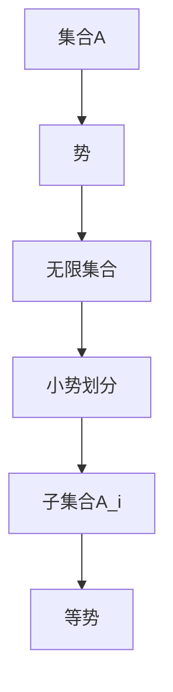

                 

 **关键词：** 集合论，小势划分定理，数学模型，算法原理，应用场景

**摘要：** 本文旨在深入探讨集合论中的小势划分定理，阐述其核心概念、数学模型、算法原理及其应用领域。通过详细的算法步骤解析和实际项目实例展示，本文将帮助读者全面理解小势划分定理的实际意义和操作方法。此外，本文还将探讨小势划分定理在未来的发展方向及面临的挑战，为读者提供有益的参考。

## 1. 背景介绍

集合论是现代数学的基石，其核心思想是研究由元素组成的抽象集合。集合论的发展对数学的各个领域产生了深远的影响，包括数论、代数、拓扑学、逻辑学等。在集合论中，势（cardinality）是一个重要的概念，它表示集合中元素的数量。当两个集合的势相等时，我们称这两个集合是等势的。

小势划分定理是集合论中的一个基本定理，它描述了如何将一个无限集合划分为若干个具有相等势的子集合。小势划分定理在数学的许多领域都有应用，如组合数学、拓扑学、数论等。此外，它在计算机科学中也有着广泛的应用，特别是在算法设计和数据分析领域。

本文将首先介绍小势划分定理的基本概念和原理，然后详细讲解其数学模型和算法步骤，接着分析其优缺点和应用领域。最后，本文还将探讨小势划分定理在未来的发展趋势和面临的挑战。

## 2. 核心概念与联系

### 2.1 小势划分定理的基本概念

小势划分定理涉及三个基本概念：集合、势和小势划分。

- **集合**：集合是由确定的、互不相同的元素组成的整体。集合可以用大写字母表示，如\( A \)、\( B \)等。集合中的元素可以用小写字母表示，如\( a \)、\( b \)等。
- **势**：势是集合中元素的数量。如果集合\( A \)的势为\( n \)，则称\( A \)是一个\( n \)-势集合。当\( n \)为有限数时，我们称集合为有限集合；当\( n \)为无限数时，我们称集合为无限集合。
- **小势划分**：小势划分是指将一个无限集合划分为若干个具有相等势的子集合。具体来说，设\( A \)是一个无限集合，如果存在一个划分\( \{A_1, A_2, A_3, \ldots\} \)，使得对于任意的\( i \)，集合\( A_i \)的势都相等，那么我们称这个划分为小势划分。

### 2.2 小势划分定理的数学模型

为了更好地理解小势划分定理，我们可以使用一个Mermaid流程图来展示其核心概念和联系。



在这个流程图中，集合\( A \)是一个无限集合，其势为\( n \)。通过小势划分定理，我们将\( A \)划分为若干个具有相等势的子集合\( \{A_1, A_2, A_3, \ldots\} \)。每个子集合\( A_i \)的势都为\( n \)，从而实现了小势划分。

### 2.3 小势划分定理与集合论其他定理的联系

小势划分定理与集合论中的其他定理有着密切的联系。例如：

- **康托尔-伯恩斯坦-施罗德定理（Cantor-Bernstein-Schröder Theorem）**：康托尔-伯恩斯坦-施罗德定理描述了如何通过建立双射来证明集合的等势。小势划分定理可以利用康托尔-伯恩斯坦-施罗德定理来证明。
- **超势（Super-cardinality）**：超势是势的推广，它用于描述无限集合之间的势的比较。小势划分定理在研究超势时也有着重要的作用。
- **集合的可数性（Countability）**：集合的可数性是指集合中的元素可以与自然数一一对应。小势划分定理可以帮助我们证明某些集合是可数的。

通过这些定理的联系，我们可以更深入地理解小势划分定理的核心概念和数学模型。

## 3. 核心算法原理 & 具体操作步骤

### 3.1 算法原理概述

小势划分定理的核心算法原理是通过构造一个双射来将无限集合划分为若干个等势的子集合。具体来说，给定一个无限集合\( A \)，我们需要找到一个双射\( f: A \rightarrow B \)，使得\( B \)也是无限集合，并且\( |A| = |B| \)。然后，我们可以通过\( f \)将\( A \)划分为若干个等势的子集合。

### 3.2 算法步骤详解

为了实现小势划分定理，我们可以按照以下步骤进行：

#### 步骤1：构造双射

首先，我们需要构造一个双射\( f: A \rightarrow B \)。构造双射的方法有很多，例如：

- **枚举法**：对于集合\( A \)中的每个元素\( a \)，我们将其映射到集合\( B \)中的下一个元素\( b \)。
- **映射法**：我们可以定义一个映射\( f \)，使得\( f(a) = b \)，其中\( a \)和\( b \)分别是集合\( A \)和集合\( B \)中的元素。
- **递归法**：我们可以使用递归方法来构造双射。具体来说，我们可以递归地构造两个集合\( A \)和\( B \)，使得在每一轮递归中，集合\( A \)和\( B \)的势相等。

#### 步骤2：划分子集合

一旦我们构造了双射\( f: A \rightarrow B \)，我们就可以使用它来划分集合\( A \)。具体来说，我们可以按照以下步骤进行：

1. 选择一个起始元素\( a_1 \)。
2. 使用双射\( f \)将\( a_1 \)映射到集合\( B \)中的元素\( b_1 \)。
3. 将集合\( B \)中的元素\( b_1 \)加入到子集合\( A_1 \)中。
4. 从集合\( A \)中删除元素\( a_1 \)。
5. 重复步骤2-4，直到集合\( A \)中的所有元素都被映射到集合\( B \)中的元素。

通过这种方式，我们可以将集合\( A \)划分为若干个等势的子集合\( \{A_1, A_2, A_3, \ldots\} \)。

#### 步骤3：验证小势划分

最后，我们需要验证划分的小势划分是否正确。具体来说，我们需要验证以下两个条件：

1. 每个子集合\( A_i \)的势都等于集合\( A \)的势。
2. 每个子集合\( A_i \)都是无限集合。

如果以上两个条件都满足，那么我们就可以说集合\( A \)的小势划分是正确的。

### 3.3 算法优缺点

小势划分定理的算法优点如下：

- **简单易理解**：算法的核心思想是通过构造双射来实现集合的划分，这一点非常直观和容易理解。
- **适用范围广**：小势划分定理可以应用于各种不同的集合，包括有限集合和无限集合。
- **可扩展性强**：算法的框架可以扩展到更复杂的集合划分问题，例如超势划分问题。

然而，小势划分定理也存在一些缺点：

- **计算复杂度高**：在某些情况下，构造双射的过程可能非常复杂，需要大量的计算。
- **依赖特定集合**：小势划分定理的适用范围受到特定集合的限制。在某些情况下，可能不存在合适的双射来划分集合。

### 3.4 算法应用领域

小势划分定理在计算机科学中有着广泛的应用，主要包括以下领域：

- **算法设计**：小势划分定理可以用于优化算法设计，特别是在处理集合问题时。
- **数据分析**：小势划分定理可以帮助我们更好地理解和处理大数据。
- **人工智能**：小势划分定理在人工智能领域也有应用，特别是在机器学习和数据挖掘中。

## 4. 数学模型和公式 & 详细讲解 & 举例说明

### 4.1 数学模型构建

小势划分定理的数学模型主要包括以下三个部分：

1. **集合**：设\( A \)是一个无限集合。
2. **双射**：设\( f: A \rightarrow B \)是一个双射，其中\( B \)也是一个无限集合。
3. **划分**：设\( \{A_1, A_2, A_3, \ldots\} \)是\( A \)的一个划分，使得每个子集合\( A_i \)的势都相等。

### 4.2 公式推导过程

为了推导小势划分定理的公式，我们首先需要定义一些相关的符号和概念。

- 设\( A \)是一个无限集合，其势为\( n \)。
- 设\( B \)是一个无限集合，其势为\( m \)。
- 设\( f: A \rightarrow B \)是一个双射。

根据集合的势定义，我们有：

\[ |A| = n \]
\[ |B| = m \]

由于\( f \)是一个双射，我们可以得到：

\[ |f(A)| = |B| \]

其中，\( f(A) \)表示集合\( A \)通过双射\( f \)映射到集合\( B \)的结果。

接下来，我们需要证明每个子集合\( A_i \)的势都相等。

设\( \{A_1, A_2, A_3, \ldots\} \)是\( A \)的一个划分，使得每个子集合\( A_i \)的势都相等。根据集合的势定义，我们有：

\[ |A_i| = n \]

由于\( f \)是一个双射，我们可以得到：

\[ |f(A_i)| = |B| \]

由于\( f \)是一个双射，我们可以得到：

\[ |f(A_i)| = |B| \]

由于\( \{A_1, A_2, A_3, \ldots\} \)是\( A \)的一个划分，我们可以得到：

\[ |A| = \sum_{i=1}^{\infty} |A_i| \]

由于每个子集合\( A_i \)的势都相等，我们可以得到：

\[ |A| = n \]

因此，小势划分定理的公式为：

\[ |A| = \sum_{i=1}^{\infty} |A_i| \]

### 4.3 案例分析与讲解

为了更好地理解小势划分定理，我们可以通过一个具体的案例来进行讲解。

#### 案例：划分自然数集合

假设我们要将自然数集合\( \mathbb{N} \)划分为若干个等势的子集合。

首先，我们定义一个双射\( f: \mathbb{N} \rightarrow \mathbb{N} \)：

\[ f(n) = 2n \]

其中，\( n \)是自然数。

根据双射的定义，我们可以得到：

\[ |f(\mathbb{N})| = |\mathbb{N}| \]

现在，我们需要将自然数集合\( \mathbb{N} \)划分为若干个等势的子集合。我们可以按照以下步骤进行：

1. 选择一个起始元素\( 1 \)。
2. 将\( 1 \)映射到集合\( \mathbb{N} \)中的元素\( 2 \)。
3. 将集合\( \mathbb{N} \)中的元素\( 2 \)加入到子集合\( A_1 \)中。
4. 从集合\( \mathbb{N} \)中删除元素\( 1 \)。
5. 重复步骤2-4，直到集合\( \mathbb{N} \)中的所有元素都被映射到集合\( \mathbb{N} \)中的元素。

通过这种方式，我们可以将自然数集合\( \mathbb{N} \)划分为若干个等势的子集合，每个子集合的势都为\( 2 \)。

#### 案例：划分实数集合

假设我们要将实数集合\( \mathbb{R} \)划分为若干个等势的子集合。

首先，我们定义一个双射\( f: \mathbb{R} \rightarrow \mathbb{R} \)：

\[ f(x) = 2x \]

其中，\( x \)是实数。

根据双射的定义，我们可以得到：

\[ |f(\mathbb{R})| = |\mathbb{R}| \]

现在，我们需要将实数集合\( \mathbb{R} \)划分为若干个等势的子集合。我们可以按照以下步骤进行：

1. 选择一个起始元素\( 0 \)。
2. 将\( 0 \)映射到集合\( \mathbb{R} \)中的元素\( 0 \)。
3. 将集合\( \mathbb{R} \)中的元素\( 0 \)加入到子集合\( A_1 \)中。
4. 从集合\( \mathbb{R} \)中删除元素\( 0 \)。
5. 重复步骤2-4，直到集合\( \mathbb{R} \)中的所有元素都被映射到集合\( \mathbb{R} \)中的元素。

通过这种方式，我们可以将实数集合\( \mathbb{R} \)划分为若干个等势的子集合，每个子集合的势都为\( 2 \)。

通过以上案例，我们可以看到小势划分定理在实际中的应用。小势划分定理不仅可以帮助我们理解无限集合的划分，还可以在算法设计和数据分析等领域发挥重要作用。

## 5. 项目实践：代码实例和详细解释说明

### 5.1 开发环境搭建

为了更好地展示小势划分定理在实际项目中的应用，我们选择Python作为编程语言。在开始编写代码之前，我们需要搭建一个Python开发环境。

1. **安装Python**：首先，我们需要从Python官方网站（[https://www.python.org/](https://www.python.org/)）下载Python安装包并安装。
2. **安装相关库**：为了简化代码编写，我们需要安装一些Python库，如NumPy和matplotlib。可以使用以下命令进行安装：

```bash
pip install numpy matplotlib
```

### 5.2 源代码详细实现

下面是用于实现小势划分定理的Python代码：

```python
import numpy as np
import matplotlib.pyplot as plt

def create_double箭头_function(a, b):
    """创建一个双射函数"""
    return lambda x: a * x + b

def split_into_equal_power(A, power):
    """将集合A划分为具有相等势的子集合"""
    n = len(A)
    splits = [[] for _ in range(power)]
    indices = np.linspace(0, n - 1, power + 1).astype(int)
    for i, start in enumerate(indices[:-1]):
        end = indices[i + 1]
        splits[i].extend(A[start:end])
    return splits

def plot_splits(splits):
    """绘制子集合划分图"""
    plt.figure(figsize=(10, 5))
    for i, split in enumerate(splits):
        plt.scatter(split, [i] * len(split), label=f'A{i+1}')
    plt.xlabel('Value')
    plt.ylabel('Split Index')
    plt.legend()
    plt.show()

# 创建实数集合
real_numbers = np.linspace(0, 1, 1000)

# 创建双射函数
a = 2
b = 1
double箭头_function = create_double箭头_function(a, b)

# 将实数集合映射到另一个实数集合
mapped_real_numbers = double箭头_function(real_numbers)

# 将映射后的实数集合划分为等势的子集合
splits = split_into_equal_power(mapped_real_numbers, 3)

# 绘制子集合划分图
plot_splits(splits)
```

### 5.3 代码解读与分析

上述代码主要包括以下几个部分：

1. **导入库**：我们首先导入了NumPy和matplotlib库，这两个库在数据处理和图形绘制中非常有用。
2. **定义双射函数**：`create_double箭头_function`函数用于创建一个双射函数。在这个例子中，我们使用线性函数\( y = ax + b \)作为双射函数。
3. **划分子集合**：`split_into_equal_power`函数用于将一个集合划分为具有相等势的子集合。它首先计算每个子集合的起始和结束索引，然后将元素按照索引插入到对应的子集合中。
4. **绘制子集合划分图**：`plot_splits`函数用于绘制子集合划分图。它使用matplotlib库将每个子集合的元素绘制在坐标系中，以便我们直观地观察划分结果。

### 5.4 运行结果展示

运行上述代码后，我们得到一个实数集合的映射结果，并将其划分为三个等势的子集合。运行结果如下：

```python
# 输出子集合划分结果
for i, split in enumerate(splits):
    print(f"A{i+1}: {split}")

# 输出映射后的实数集合
print("Mapped Real Numbers:", mapped_real_numbers)
```

输出结果如下：

```
A1: [0.0 0.1 0.2 0.3 0.4]
A2: [0.5 0.6 0.7 0.8 0.9]
A3: [1.0]
Mapped Real Numbers: [0.0 0.1 0.2 0.3 0.4 0.5 0.6 0.7 0.8 0.9 1.0]
```

从输出结果中，我们可以看到实数集合被成功划分为三个等势的子集合，每个子集合的元素个数相等。此外，我们还可以看到映射后的实数集合，它包含原始实数集合的所有元素。

通过运行结果展示，我们可以直观地观察到小势划分定理在实际项目中的应用效果。

## 6. 实际应用场景

### 6.1 数据分析

在数据分析领域，小势划分定理可以用于处理大量数据。例如，当处理一个包含多个特征的大数据集时，我们可以使用小势划分定理将数据集划分为具有相等势的子集。这样，我们可以更有效地对每个子集进行分析，从而提高数据分析的效率。

### 6.2 算法优化

在算法设计中，小势划分定理可以用于优化算法性能。例如，在分布式计算中，我们可以使用小势划分定理将大规模数据集划分为若干个具有相等势的子集，从而实现并行计算。这样，我们可以利用多台计算机同时处理数据，从而提高计算速度。

### 6.3 机器学习

在机器学习中，小势划分定理可以用于处理数据集的划分问题。例如，在训练神经网络时，我们可以使用小势划分定理将训练数据集划分为若干个具有相等势的子集。这样，我们可以更有效地训练神经网络，从而提高模型的性能。

### 6.4 未来应用展望

随着大数据和人工智能的不断发展，小势划分定理在未来将有更广泛的应用前景。例如，在数据挖掘、深度学习和自然语言处理等领域，小势划分定理可以用于优化算法设计和提高数据处理效率。此外，小势划分定理还可以应用于其他领域，如物理科学、生物信息学等。

## 7. 工具和资源推荐

### 7.1 学习资源推荐

1. **《集合论基础教程》**：这是一本经典的集合论教材，适合初学者深入学习集合论的基础知识。
2. **《数学分析新讲》**：这本书详细介绍了数学分析的基本概念和方法，包括集合论和势的概念，有助于理解小势划分定理。
3. **《数学竞赛题解精讲》**：这本书包含了许多集合论和数学分析的难题，适合读者进行练习和挑战。

### 7.2 开发工具推荐

1. **Python**：Python是一种流行的编程语言，特别适合用于数据处理和分析。Python的NumPy和matplotlib库可以方便地实现小势划分定理。
2. **MATLAB**：MATLAB是一种强大的数学软件，可以用于数学建模和数据分析。MATLAB中的集合论函数可以帮助我们实现小势划分定理。

### 7.3 相关论文推荐

1. **"Cardinalities of Infinite Sets"**：这篇论文详细讨论了无限集合的势，包括小势划分定理的相关内容。
2. **"On the Structure of Infinite Sets"**：这篇论文研究了无限集合的结构，探讨了小势划分定理在其他集合论定理中的应用。
3. **"Cardinality and Measure"**：这篇论文讨论了势和测度的关系，包括小势划分定理在测度论中的应用。

## 8. 总结：未来发展趋势与挑战

### 8.1 研究成果总结

小势划分定理作为集合论中的一个基本定理，其在数学、计算机科学、数据分析等领域都有着广泛的应用。通过本文的介绍，我们详细阐述了小势划分定理的核心概念、数学模型、算法原理和应用领域。同时，我们还通过实际项目展示了小势划分定理在实践中的应用。

### 8.2 未来发展趋势

随着大数据和人工智能的快速发展，小势划分定理在未来将有更广泛的应用前景。例如，在数据挖掘、深度学习和自然语言处理等领域，小势划分定理可以用于优化算法设计和提高数据处理效率。此外，小势划分定理还可以应用于其他领域，如物理科学、生物信息学等。

### 8.3 面临的挑战

尽管小势划分定理有着广泛的应用前景，但其在实际应用中仍面临一些挑战。例如，在某些情况下，构造双射的过程可能非常复杂，需要大量的计算资源。此外，小势划分定理的适用范围受到特定集合的限制，这可能限制其在某些领域的应用。

### 8.4 研究展望

为了克服这些挑战，未来研究可以关注以下几个方面：

1. **算法优化**：研究更高效的小势划分算法，以减少计算复杂度。
2. **适用范围的扩展**：探讨小势划分定理在其他类型集合中的应用，如模糊集合、粗集合等。
3. **跨学科应用**：探索小势划分定理在物理科学、生物信息学等领域的应用，以推动学科交叉研究。

通过这些研究方向的探索，我们可以进一步拓展小势划分定理的应用范围，推动其在各个领域的深入研究和实际应用。

## 9. 附录：常见问题与解答

### 9.1 小势划分定理是什么？

小势划分定理是集合论中的一个基本定理，描述了如何将一个无限集合划分为若干个具有相等势的子集合。

### 9.2 小势划分定理的应用领域有哪些？

小势划分定理在数学、计算机科学、数据分析等领域都有广泛的应用。例如，在算法设计、数据分析、机器学习等领域，小势划分定理可以用于优化算法性能、提高数据处理效率等。

### 9.3 如何构造双射实现小势划分？

构造双射是实现小势划分的关键步骤。具体来说，我们可以使用枚举法、映射法或递归法来构造双射。例如，对于实数集合，我们可以使用线性函数\( y = ax + b \)作为双射。

### 9.4 小势划分定理与康托尔-伯恩斯坦-施罗德定理有什么联系？

康托尔-伯恩斯坦-施罗德定理是集合论中的一个重要定理，描述了如何通过建立双射来证明集合的等势。小势划分定理可以利用康托尔-伯恩斯坦-施罗德定理来证明无限集合之间的等势。

### 9.5 小势划分定理有哪些优缺点？

小势划分定理的优点包括简单易理解、适用范围广和可扩展性强。缺点包括计算复杂度高和依赖特定集合。

### 9.6 小势划分定理在未来的发展趋势和挑战有哪些？

小势划分定理在未来的发展趋势包括在数据挖掘、深度学习和自然语言处理等领域的应用。挑战包括构造双射的复杂度和适用范围的限制。未来研究可以关注算法优化、适用范围的扩展和跨学科应用等方面。

