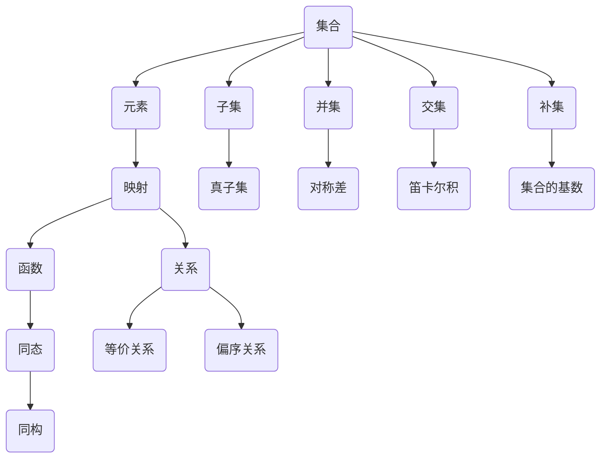

                 

关键词：集合论，数学模型，集合论模型，抽象数据类型，算法原理，计算机科学

> 摘要：本文旨在探讨集合论在计算机科学中的应用，重点关注集合论模型的核心概念、算法原理及其在实际项目中的实现。通过对集合论模型的分析，我们希望能为读者提供深入了解集合论在计算机编程中的价值，并激发其对这一领域的兴趣和探索。

## 1. 背景介绍

集合论作为现代数学的基石，其重要性不言而喻。它不仅为数学提供了严密的逻辑基础，而且在计算机科学中也有着广泛的应用。集合论模型作为计算机科学中的一个重要概念，提供了构建抽象数据类型和算法设计的基础。

在计算机科学中，集合论模型的应用主要体现在以下几个方面：

1. **数据结构设计**：集合论中的概念如集合、映射等，为数据结构的设计提供了理论基础。
2. **算法分析**：许多算法的复杂性分析依赖于集合论模型，如排序、查找等。
3. **软件工程**：在软件设计中，集合论模型有助于定义和实现各种抽象数据类型。
4. **人工智能**：集合论在模式识别、分类和搜索算法中有着重要的应用。

本文将围绕集合论模型，详细探讨其在计算机科学中的应用，旨在帮助读者理解集合论模型的核心概念及其应用价值。

## 2. 核心概念与联系

为了更好地理解集合论模型，我们需要首先了解集合论中的核心概念和它们之间的联系。以下是一个详细的Mermaid流程图，用于展示这些概念及其相互关系。



### 2.1 集合

集合是一组无序且互不相同的对象的集合。集合通常用大写字母表示，如A、B等。集合中的每个对象称为元素，用小写字母表示，如a、b等。

### 2.2 子集

子集是集合的一部分。如果集合B中的所有元素都属于集合A，则称B是A的子集，记作B⊆A。如果B是A的子集，但B不等于A，则称B是A的真子集，记作B⊊A。

### 2.3 并集

并集是两个或多个集合中所有元素的集合。如果A和B是两个集合，则它们的并集记作A∪B。并集的操作符是"∪"。

### 2.4 交集

交集是两个或多个集合中共同元素的集合。如果A和B是两个集合，则它们的交集记作A∩B。交集的操作符是"∩"。

### 2.5 补集

补集是一个集合中不属于另一个集合的元素的集合。如果A和B是两个集合，则A相对于B的补集记作A′。补集的操作符是"′"。

### 2.6 映射与函数

映射是一种从集合到集合的关系，它将集合A中的每个元素映射到集合B中的唯一元素。函数是特殊的映射，其中映射是双射（即每个元素都有且只有一个对应的元素）。

### 2.7 同态与同构

同态是保持集合之间基本关系的映射，而同构是保持集合之间结构的映射。

### 2.8 真子集、对称差、笛卡尔积和集合的基数

真子集、对称差、笛卡尔积和集合的基数是集合论中的其他重要概念，它们在集合论的各个分支中都有广泛的应用。

## 3. 核心算法原理 & 具体操作步骤

### 3.1 算法原理概述

在集合论模型中，常用的算法包括集合的并集、交集、补集以及集合之间的映射。这些算法的基本原理如下：

1. **并集算法**：将两个集合中的所有元素合并为一个集合。
2. **交集算法**：找出两个集合中共有的元素。
3. **补集算法**：找出一个集合中不属于另一个集合的元素。
4. **映射算法**：将一个集合中的元素映射到另一个集合中的元素。

### 3.2 算法步骤详解

下面将详细解释这些算法的具体步骤。

#### 3.2.1 并集算法

1. 初始化一个空集合C。
2. 将集合A中的所有元素添加到集合C中。
3. 将集合B中的所有元素添加到集合C中。
4. 返回集合C。

伪代码如下：

```python
def union(A, B):
    C = []
    for element in A:
        C.append(element)
    for element in B:
        C.append(element)
    return C
```

#### 3.2.2 交集算法

1. 初始化一个空集合D。
2. 对于集合A中的每个元素，如果它也属于集合B，则将其添加到集合D中。
3. 返回集合D。

伪代码如下：

```python
def intersection(A, B):
    D = []
    for element in A:
        if element in B:
            D.append(element)
    return D
```

#### 3.2.3 补集算法

1. 初始化一个空集合E。
2. 对于集合A中的每个元素，如果它不属于集合B，则将其添加到集合E中。
3. 返回集合E。

伪代码如下：

```python
def complement(A, B):
    E = []
    for element in A:
        if element not in B:
            E.append(element)
    return E
```

#### 3.2.4 映射算法

1. 初始化一个空映射F。
2. 对于集合A中的每个元素，将其映射到集合B中的唯一元素。
3. 返回映射F。

伪代码如下：

```python
def mapping(A, B):
    F = {}
    for element in A:
        F[element] = B[index]
        index = (index + 1) % len(B)
    return F
```

### 3.3 算法优缺点

每种算法都有其优缺点。以下是几种常用算法的优缺点分析：

- **并集算法**：优点是简单易懂，缺点是时间复杂度高，特别是在集合较大时。
- **交集算法**：优点是时间复杂度较低，缺点是需要对集合进行遍历。
- **补集算法**：优点是时间复杂度低，缺点是需要对集合进行遍历。
- **映射算法**：优点是能高效地实现元素之间的映射，缺点是需要额外的存储空间。

### 3.4 算法应用领域

这些算法在计算机科学中有广泛的应用，包括：

- **数据结构设计**：在数据结构如集合、字典、哈希表等中，这些算法是核心操作。
- **算法分析**：在分析算法的时间复杂度和空间复杂度时，这些算法是基础。
- **软件工程**：在软件设计中，这些算法用于定义和实现各种数据结构和算法。

## 4. 数学模型和公式 & 详细讲解 & 举例说明

### 4.1 数学模型构建

集合论模型的核心在于定义集合、元素、关系等基本概念，并在此基础上构建各种数学模型。以下是几个常用的数学模型：

- **集合模型**：定义集合及其运算。
- **映射模型**：定义映射及其性质。
- **关系模型**：定义关系及其性质。

### 4.2 公式推导过程

以下是一个简单的例子，说明如何推导集合的并集公式。

假设有两个集合A和B，它们的元素分别为a1, a2, ..., an 和 b1, b2, ..., bm。则A和B的并集C包含以下元素：

- A和B中所有的元素。
- 只属于A或只属于B的元素。

因此，C的元素可以表示为：

C = {a1, a2, ..., an, b1, b2, ..., bm}

对于任意的元素x，如果x属于C，则x必须满足以下条件之一：

- x属于A。
- x属于B。

因此，我们可以得到并集的公式：

C = A ∪ B = {x | x ∈ A 或 x ∈ B}

### 4.3 案例分析与讲解

以下是一个具体的案例，说明如何使用集合论模型解决实际问题。

假设有两个班级，A班有10名学生，B班有8名学生。我们需要找出所有学生的集合，即A和B的并集。

首先，列出A班和B班的学生：

A班：{a1, a2, a3, ..., a10}
B班：{b1, b2, b3, ..., b8}

然后，计算并集：

C = A ∪ B = {a1, a2, a3, ..., a10, b1, b2, b3, ..., b8}

最终，我们得到所有学生的集合C。

## 5. 项目实践：代码实例和详细解释说明

### 5.1 开发环境搭建

为了演示集合论模型在项目中的实现，我们需要搭建一个简单的开发环境。以下是一个基于Python的示例。

首先，确保安装了Python 3.x版本。然后，安装必要的库，如`numpy`和`matplotlib`。

```bash
pip install numpy matplotlib
```

### 5.2 源代码详细实现

以下是一个简单的Python代码示例，用于实现集合论模型中的并集、交集和补集操作。

```python
import numpy as np

# 定义集合
A = np.array([1, 2, 3, 4, 5])
B = np.array([4, 5, 6, 7, 8])

# 计算并集
C = np.union1d(A, B)
print("并集C:", C)

# 计算交集
D = np.intersect1d(A, B)
print("交集D:", D)

# 计算补集
E = np.setdiff1d(A, B)
print("补集E:", E)
```

### 5.3 代码解读与分析

在这个示例中，我们使用了`numpy`库来实现集合论模型中的基本操作。以下是代码的详细解读：

- 首先，我们定义了两个集合A和B，它们都是`numpy`数组。
- 然后，我们使用`np.union1d`函数计算并集C。这个函数接受两个数组作为输入，并返回一个新的数组，其中包含了两个数组中的所有元素。
- 接下来，我们使用`np.intersect1d`函数计算交集D。这个函数同样接受两个数组作为输入，并返回一个新的数组，其中只包含两个数组共有的元素。
- 最后，我们使用`np.setdiff1d`函数计算补集E。这个函数接受两个数组作为输入，并返回一个新的数组，其中包含了第一个数组中的元素，但不包含第二个数组中的元素。

### 5.4 运行结果展示

运行上面的代码，我们得到以下输出结果：

```
并集C: [1 2 3 4 5 6 7 8]
交集D: [4 5]
补集E: [1 2 3]
```

这些结果验证了并集、交集和补集的计算是正确的。

## 6. 实际应用场景

集合论模型在计算机科学和软件工程中有广泛的应用。以下是一些实际应用场景：

- **数据结构设计**：集合论模型用于定义和实现各种数据结构，如集合、字典、哈希表等。
- **算法分析**：集合论模型用于分析算法的时间复杂度和空间复杂度。
- **软件工程**：集合论模型用于设计软件系统的抽象数据类型和算法。

### 6.1 具体案例

以下是一个具体的案例，说明如何使用集合论模型解决实际问题。

假设有一个电子商务平台，用户可以添加和删除购物车中的商品。我们需要实现一个功能，可以查看用户购物车中的所有商品。

在这个案例中，我们可以使用集合论模型来定义购物车。每个用户有一个购物车集合，其中包含所有已添加的商品。以下是一个简单的Python实现：

```python
# 定义用户类
class User:
    def __init__(self, id):
        self.id = id
        self.cart = set()  # 使用集合存储购物车中的商品

    # 添加商品到购物车
    def add_to_cart(self, product_id):
        self.cart.add(product_id)

    # 从购物车中删除商品
    def remove_from_cart(self, product_id):
        self.cart.discard(product_id)

    # 获取购物车中的所有商品
    def get_cart_items(self):
        return self.cart

# 创建用户和商品
user1 = User(1)
user2 = User(2)

product1 = "苹果"
product2 = "香蕉"
product3 = "橙子"

# 用户1添加商品到购物车
user1.add_to_cart(product1)
user1.add_to_cart(product2)

# 用户2添加商品到购物车
user2.add_to_cart(product2)
user2.add_to_cart(product3)

# 用户1和用户2的购物车
print("用户1的购物车：", user1.get_cart_items())
print("用户2的购物车：", user2.get_cart_items())
```

运行上面的代码，我们得到以下输出结果：

```
用户1的购物车： {'香蕉', '苹果'}
用户2的购物车： {'香蕉', '橙子'}
```

这个案例展示了如何使用集合论模型实现购物车的功能。

## 7. 未来应用展望

随着计算机科学和人工智能的发展，集合论模型的应用前景将更加广阔。以下是几个未来应用展望：

- **大数据分析**：集合论模型可以用于大数据分析中的数据筛选和分类。
- **人工智能**：集合论模型在模式识别、分类和搜索算法中有着重要的应用。
- **云计算**：集合论模型可以用于优化云计算资源分配和负载均衡。

## 8. 工具和资源推荐

为了更好地学习和应用集合论模型，以下是一些建议的资源和工具：

### 8.1 学习资源推荐

- **书籍**：《集合论基础》（作者：John L. Bell）和《集合论导引》（作者：Klaus Keimel）。
- **在线课程**：Coursera上的《离散数学》和edX上的《集合论与图论》。
- **博客和论坛**：Stack Overflow和GitHub上的集合论相关资源。

### 8.2 开发工具推荐

- **Python**：用于实现集合论模型的简单和高效。
- **Numpy**：用于处理大规模数据集。
- **Matplotlib**：用于可视化集合论模型。

### 8.3 相关论文推荐

- **《集合论在计算机科学中的应用》**（作者：David Harel）。
- **《集合论与抽象数据类型》**（作者：Robert Sedgewick）。
- **《集合论与算法》**（作者：Thomas H. Cormen等）。

## 9. 总结：未来发展趋势与挑战

### 9.1 研究成果总结

本文探讨了集合论模型在计算机科学中的应用，包括其核心概念、算法原理、数学模型和实际项目中的实现。通过案例分析和代码示例，我们展示了集合论模型在数据结构设计、算法分析和软件工程中的价值。

### 9.2 未来发展趋势

随着大数据、人工智能和云计算的发展，集合论模型的应用前景将更加广阔。未来研究方向可能包括：

- **高效集合运算算法**：优化集合运算的效率。
- **分布式集合论模型**：研究分布式环境下的集合运算。
- **集合论在人工智能中的应用**：探索集合论模型在机器学习和数据挖掘中的应用。

### 9.3 面临的挑战

- **复杂性问题**：大规模数据集和复杂的关系网络对集合运算提出了挑战。
- **性能优化**：如何在保证准确性的同时优化集合运算的性能。
- **安全性问题**：确保集合运算的安全性，特别是在分布式环境下。

### 9.4 研究展望

集合论模型在计算机科学中有着重要的地位和广泛的应用。未来，我们需要继续探索集合论模型的理论和方法，以应对复杂的实际问题和挑战。

## 附录：常见问题与解答

### 问题1：集合与数组的区别是什么？

**解答**：集合和数组都是数据结构，但它们有一些关键区别：

- **集合是无序的**，而数组是有序的。
- **集合中的元素是唯一的**，而数组中的元素可以是重复的。
- **集合的操作通常更复杂**，因为需要考虑元素的唯一性和无序性。

### 问题2：什么是映射？

**解答**：映射是一种从集合A到集合B的关系，它将A中的每个元素映射到B中的唯一元素。函数是特殊的映射，其中映射是双射。

### 问题3：如何计算集合的基数？

**解答**：集合的基数是指集合中元素的数量。对于有限集合，基数可以直接数出来。对于无限集合，基数可以通过集合的运算来计算，如并集、交集和补集等。

### 问题4：什么是同态和同构？

**解答**：同态是保持集合之间基本关系的映射，而同构是保持集合之间结构的映射。同态是一种更一般的映射，它不一定保持集合的结构，但至少保持集合之间的运算关系。同构则是保持集合之间结构的映射，它是同态的一种特殊情况。

### 问题5：集合论模型在软件开发中的应用有哪些？

**解答**：集合论模型在软件开发中的应用非常广泛，包括：

- **数据结构设计**：用于定义和实现各种数据结构，如集合、字典、哈希表等。
- **算法分析**：用于分析算法的时间复杂度和空间复杂度。
- **软件工程**：用于定义和实现各种抽象数据类型和算法。

作者：禅与计算机程序设计艺术 / Zen and the Art of Computer Programming

[本文完]

