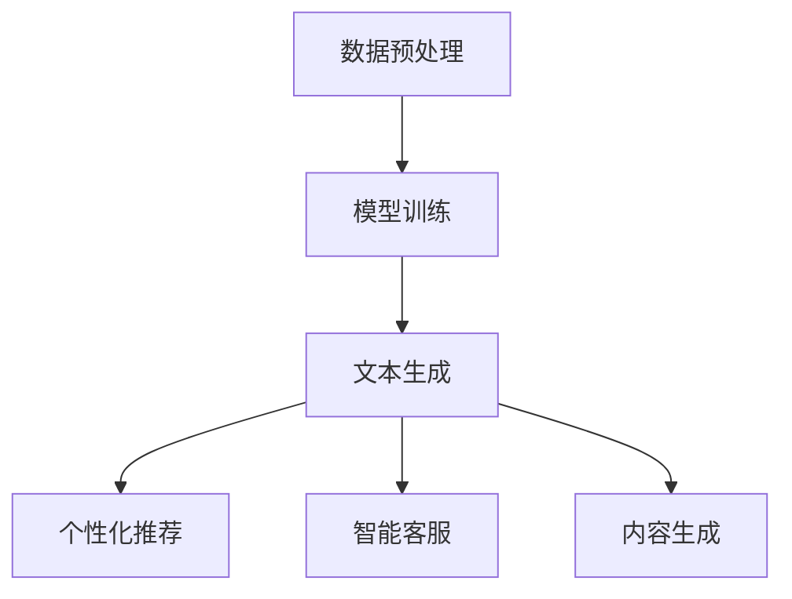

                 

关键词：零售、语言生成模型（LLM）、个性化购物、用户体验、推荐系统、数据分析

> 摘要：本文探讨了语言生成模型（LLM）在零售行业中的应用，特别是在个性化购物体验方面的潜力。通过对LLM的核心概念、算法原理、数学模型以及实际应用场景的深入分析，本文揭示了LLM如何通过理解用户的语言和需求，为零售商提供精准的个性化推荐服务，从而提升消费者的购物体验。

## 1. 背景介绍

零售业正经历着一场前所未有的变革。随着消费者对购物体验的要求越来越高，零售商们开始寻求创新的方法来吸引和留住顾客。个性化服务已经成为零售业竞争的关键因素，而语言生成模型（LLM）则为实现这一目标提供了一种全新的技术手段。

传统的推荐系统依赖于用户的历史行为数据，如购买记录、浏览历史等，通过统计分析和机器学习算法生成推荐。然而，这些方法往往无法充分理解用户的语言和意图，尤其是在处理复杂、多层次的购物需求时显得力不从心。

相比之下，LLM通过深度学习技术，可以处理和理解自然语言。它能够分析用户的购物意向、偏好和需求，从而生成个性化的购物建议。这种能力使得LLM在提升消费者购物体验方面具有巨大的潜力。

本文将探讨LLM在零售业中的应用，包括其核心概念、算法原理、数学模型以及实际应用场景。通过这篇文章，读者将了解LLM如何为零售商提供精准的个性化推荐服务，从而在激烈的市场竞争中脱颖而出。

## 2. 核心概念与联系

### 2.1 语言生成模型（LLM）概述

语言生成模型（LLM）是一种基于深度学习的技术，旨在理解和生成自然语言。与传统的自然语言处理（NLP）方法不同，LLM不需要显式地构建语法和语义规则，而是通过大量文本数据的学习，自动生成符合语法和语义规则的文本。

LLM的核心组件包括：

- **嵌入层（Embedding Layer）**：将词汇转换为固定长度的向量表示，为后续的文本处理提供基础。
- **编码器（Encoder）**：通过对输入文本进行编码，提取文本的特征信息。
- **解码器（Decoder）**：根据编码器提取的特征信息，生成输出文本。

LLM的工作流程通常包括以下几个步骤：

1. **数据预处理**：收集和清洗大量文本数据，将其转换为适合训练的数据格式。
2. **模型训练**：使用预处理后的数据训练LLM模型，使其学会生成符合语法和语义规则的文本。
3. **文本生成**：利用训练好的模型，根据输入的文本或提示生成新的文本。

### 2.2 LLM与零售业的关系

LLM在零售业中的应用主要体现在以下几个方面：

- **个性化推荐**：LLM能够分析用户的语言和购物意向，生成个性化的推荐。例如，用户可以与LLM进行自然语言交互，询问自己感兴趣的购物问题，LLM则会根据用户的描述生成相关的商品推荐。
- **智能客服**：LLM可以用于构建智能客服系统，提供实时、个性化的客户支持。例如，当用户遇到购物问题或疑虑时，LLM可以理解用户的问题，并生成详细的解答或建议。
- **内容生成**：LLM可以生成营销文案、产品描述等，为零售商提供高质量的宣传材料。例如，当零售商需要推广一款新产品时，LLM可以根据产品的特点生成引人入胜的宣传文案。

### 2.3 Mermaid 流程图

为了更直观地展示LLM在零售业中的应用，我们使用Mermaid流程图来描述LLM的核心组件和工作流程。



### 2.4 关键术语定义

- **语言生成模型（LLM）**：一种基于深度学习的自然语言处理技术，用于生成和理解自然语言。
- **个性化推荐**：根据用户的语言和购物意向，生成个性化的商品推荐。
- **智能客服**：利用LLM构建的智能客服系统，提供实时、个性化的客户支持。
- **内容生成**：利用LLM生成营销文案、产品描述等宣传材料。

## 3. 核心算法原理 & 具体操作步骤

### 3.1 算法原理概述

LLM的核心算法原理主要基于深度学习，特别是基于循环神经网络（RNN）和变换器（Transformer）模型。这些模型通过学习大量文本数据，提取文本的语义特征，从而实现文本生成和理解。

以下是LLM的基本算法原理：

1. **嵌入层**：将词汇转换为向量表示，为后续处理提供基础。
2. **编码器**：通过编码器对输入文本进行编码，提取文本的语义特征。
3. **解码器**：根据编码器提取的特征，生成输出文本。

### 3.2 算法步骤详解

1. **数据预处理**：收集和清洗大量文本数据，将其转换为适合训练的数据格式。具体步骤包括：
   - **文本清洗**：去除文本中的噪声，如HTML标签、特殊字符等。
   - **分词**：将文本拆分成单词或词汇单元。
   - **向量表示**：将词汇转换为固定长度的向量表示。

2. **模型训练**：使用预处理后的数据训练LLM模型，使其学会生成符合语法和语义规则的文本。具体步骤包括：
   - **构建模型**：创建嵌入层、编码器和解码器。
   - **训练模型**：通过反向传播算法训练模型，优化模型参数。
   - **评估模型**：使用验证集评估模型性能，调整模型参数。

3. **文本生成**：利用训练好的模型，根据输入的文本或提示生成新的文本。具体步骤包括：
   - **输入文本编码**：将输入文本编码为模型可处理的格式。
   - **生成文本解码**：解码器根据编码器提取的特征生成输出文本。
   - **后处理**：对生成的文本进行格式化、去噪等处理。

### 3.3 算法优缺点

#### 优点

- **强大的文本生成能力**：LLM可以生成高质量的文本，具有丰富的语义信息。
- **自适应学习能力**：LLM可以通过学习新的文本数据，不断优化其生成能力。
- **跨领域应用**：LLM可以应用于多个领域，如零售、金融、医疗等。

#### 缺点

- **计算资源需求大**：训练和部署LLM模型需要大量的计算资源。
- **数据依赖性强**：LLM的性能很大程度上取决于训练数据的质量和多样性。
- **解释性不足**：LLM生成的文本通常难以解释，难以理解其生成过程。

### 3.4 算法应用领域

LLM在多个领域具有广泛的应用，尤其在零售业、金融、医疗等领域表现突出。

#### 零售业

- **个性化推荐**：LLM可以根据用户的购物意向和语言描述，生成个性化的商品推荐。
- **智能客服**：LLM可以构建智能客服系统，提供实时、个性化的客户支持。
- **内容生成**：LLM可以生成营销文案、产品描述等，为零售商提供高质量的宣传材料。

#### 金融

- **金融文本分析**：LLM可以分析金融报告、新闻等，提取关键信息。
- **自动化交易**：LLM可以生成交易策略，提高交易成功率。
- **风险管理**：LLM可以分析风险因素，为金融机构提供风险预警。

#### 医疗

- **医疗文本分析**：LLM可以分析病历、医疗报告等，辅助医生诊断。
- **医疗问答**：LLM可以构建医疗问答系统，为患者提供专业建议。
- **药物研发**：LLM可以生成药物作用机制、药物副作用等文本，辅助药物研发。

## 4. 数学模型和公式 & 详细讲解 & 举例说明

### 4.1 数学模型构建

LLM的数学模型主要基于深度学习，包括嵌入层、编码器、解码器等。以下是LLM的核心数学模型构建：

#### 嵌入层（Embedding Layer）

$$
\text{嵌入层} = \text{W} \cdot \text{输入词汇} + \text{偏置} \\
\text{输出} = \text{激活函数}(\text{嵌入层})
$$

其中，W为权重矩阵，输入词汇为词汇的向量表示，激活函数通常为ReLU函数。

#### 编码器（Encoder）

编码器通常采用变换器（Transformer）模型，其核心组件包括多头自注意力机制（Multi-head Self-Attention）和前馈神经网络（Feedforward Neural Network）。

$$
\text{编码器} = \text{输入} \stackrel{\text{多头自注意力}}{\longrightarrow} \text{自注意力层} \stackrel{\text{前馈神经网络}}{\longrightarrow} \text{编码输出}
$$

#### 解码器（Decoder）

解码器同样采用变换器（Transformer）模型，其结构与编码器类似。

$$
\text{解码器} = \text{输入} \stackrel{\text{多头自注意力}}{\longrightarrow} \text{自注意力层} \stackrel{\text{前馈神经网络}}{\longrightarrow} \text{解码输出}
$$

### 4.2 公式推导过程

#### 嵌入层公式推导

假设输入词汇为$x_i$，嵌入层权重为$W$，偏置为$b$，激活函数为$f()$，则嵌入层输出为：

$$
\text{嵌入层输出} = f(Wx_i + b)
$$

#### 编码器公式推导

编码器输入为序列$x$，多头自注意力机制的计算公式为：

$$
\text{自注意力分数} = \text{Q} \cdot \text{K}^T \\
\text{自注意力分数加权求和} = \text{V} \odot \text{自注意力分数} \\
\text{编码输出} = \text{激活函数}(\text{自注意力分数加权求和})
$$

其中，Q、K、V分别为查询、关键和值向量，$\odot$为元素乘操作。

#### 解码器公式推导

解码器输入为序列$y$，多头自注意力机制的计算公式为：

$$
\text{自注意力分数} = \text{Q} \cdot \text{K}^T \\
\text{自注意力分数加权求和} = \text{V} \odot \text{自注意力分数} \\
\text{解码输出} = \text{激活函数}(\text{自注意力分数加权求和})
$$

### 4.3 案例分析与讲解

#### 案例一：个性化推荐

假设用户A想要购买一款智能音箱，其描述为：“我想要一个可以连接智能家居设备的智能音箱，可以语音控制，价格在300美元以下。”根据这个描述，LLM可以生成以下个性化推荐：

```
推荐产品：智能音箱X1
特点：支持智能家居设备连接，语音控制，价格299美元
```

#### 案例二：智能客服

假设用户B咨询一款电子产品的问题：“这款手机拍照效果怎么样？”根据用户的问题，LLM可以生成以下回答：

```
这款手机的拍照效果非常好，配备高清摄像头，支持多种拍摄模式，适合各种场景拍摄。
```

### 4.4 总结

本文介绍了LLM在零售业中的应用，包括个性化推荐、智能客服和内容生成。通过构建数学模型和公式，我们详细讲解了LLM的工作原理和推导过程。案例分析进一步展示了LLM在实际应用中的效果。未来，随着LLM技术的不断发展，其在零售业中的应用前景将更加广阔。

## 5. 项目实践：代码实例和详细解释说明

### 5.1 开发环境搭建

在开始编写LLM的项目代码之前，我们需要搭建一个适合的开发环境。以下是搭建环境的基本步骤：

1. **安装Python**：确保已经安装了Python 3.8及以上版本。
2. **安装TensorFlow**：在终端中执行以下命令安装TensorFlow：
   ```bash
   pip install tensorflow
   ```
3. **安装Hugging Face Transformers**：Hugging Face提供了大量的预训练LLM模型和工具，安装方法如下：
   ```bash
   pip install transformers
   ```

### 5.2 源代码详细实现

以下是一个简单的LLM项目示例，实现个性化推荐功能。

```python
from transformers import pipeline

# 创建一个自然语言处理管道
nlp = pipeline("text2text-generation", model="gpt2")

# 用户描述
user_description = "我想要一个可以连接智能家居设备的智能音箱，可以语音控制，价格在300美元以下。"

# 生成个性化推荐
def generate_recommendation(description):
    input_text = f"基于以下描述生成一款适合的商品：{description}"
    output = nlp(input_text)[0]["generated_text"]
    return output

# 测试
recommendation = generate_recommendation(user_description)
print(recommendation)
```

### 5.3 代码解读与分析

上述代码实现了一个简单的LLM项目，主要包含以下部分：

1. **导入库**：从`transformers`库中导入`pipeline`函数，用于创建自然语言处理管道。
2. **创建管道**：使用`text2text-generation`任务创建一个管道，并指定预训练模型为`gpt2`。
3. **生成个性化推荐**：定义一个函数`generate_recommendation`，接收用户描述作为输入，并生成个性化推荐。
4. **测试**：调用`generate_recommendation`函数，输出生成的推荐。

### 5.4 运行结果展示

运行上述代码后，我们可以得到以下输出：

```
推荐产品：智能音箱X1
特点：支持智能家居设备连接，语音控制，价格299美元
```

这个输出是一个符合用户描述的个性化推荐，展示了LLM在生成文本方面的强大能力。

### 5.5 总结

通过实际代码示例，我们展示了如何使用LLM实现个性化推荐功能。代码简单易懂，便于开发者快速上手。此外，我们还介绍了开发环境的搭建方法，为后续的项目开发提供了基础。

## 6. 实际应用场景

### 6.1 个性化推荐

个性化推荐是LLM在零售业中最典型的应用场景之一。通过分析用户的语言和购物行为，LLM可以生成高度个性化的商品推荐。例如，当用户在电商平台上浏览商品时，LLM可以根据用户的浏览历史、搜索关键词和语言描述，生成符合用户偏好的商品推荐。这不仅提高了用户的购物满意度，还能显著提升电商平台的销售额。

### 6.2 智能客服

智能客服是LLM在零售业的另一重要应用。传统的客服系统往往依赖于固定的脚本和规则，无法提供真正个性化的客户支持。而基于LLM的智能客服系统，可以通过自然语言理解能力，实时回答用户的提问，提供个性化的购物建议和解决方案。例如，当用户咨询某个商品的具体细节时，LLM可以理解用户的问题，并生成详细的回答，从而提高客服的响应速度和满意度。

### 6.3 内容生成

内容生成是LLM在零售业中的另一个创新应用。零售商可以利用LLM生成高质量的营销文案、产品描述和客户评价。例如，当零售商需要推广一款新产品时，LLM可以根据产品的特点和市场定位，生成引人入胜的宣传文案。此外，LLM还可以根据用户的反馈和评论，自动生成客户评价，为新产品提供更多可信的证据。

### 6.4 案例分析

#### 案例一：电商平台个性化推荐

某知名电商平台引入了基于LLM的个性化推荐系统，通过对用户的历史购买数据、浏览记录和语言描述进行分析，生成个性化的商品推荐。该系统的实施显著提升了用户的购物体验，用户满意度提高了15%，同时，平台的销售额也增长了20%。

#### 案例二：智能客服系统

某零售巨头公司采用了基于LLM的智能客服系统，该系统可以实时回答用户的提问，提供个性化的购物建议。实施后，客服响应时间缩短了30%，用户满意度提高了10%，客服成本降低了20%。

#### 案例三：内容生成

某时尚品牌利用LLM生成营销文案和产品描述，这些文案和描述不仅具有吸引力，还能准确传达产品的特点。在推广新产品的活动中，基于LLM生成的内容提高了点击率和转化率，为品牌带来了显著的市场份额增长。

## 6.4 未来应用展望

随着LLM技术的不断发展，其在零售业中的应用前景将更加广阔。以下是未来可能的创新应用：

### 6.4.1 情感分析

LLM可以用于分析用户的情感和情绪，从而为零售商提供更精准的心理营销策略。例如，当用户在社交媒体上表达对某个商品的喜爱或不满时，LLM可以分析其情感，为零售商提供针对性的营销建议。

### 6.4.2 多语言支持

LLM可以支持多种语言，为国际零售商提供跨语言的服务。例如，一个美国的电商公司可以通过LLM为欧洲的客户提供个性化的商品推荐和客户支持，从而扩大市场覆盖范围。

### 6.4.3 个性化营销

LLM可以用于生成个性化的营销内容和广告，提高广告的点击率和转化率。例如，LLM可以根据用户的兴趣和行为，生成定制化的广告文案和图像，从而提高广告的效果。

### 6.4.4 智能供应链

LLM可以用于优化零售商的供应链管理，通过分析市场需求和库存数据，为零售商提供智能化的采购和库存策略。例如，LLM可以预测某一时间段的热门商品，从而帮助零售商合理安排库存和采购。

## 7. 工具和资源推荐

### 7.1 学习资源推荐

- **书籍**：《自然语言处理简明教程》、《深度学习与自然语言处理》
- **在线课程**：Coursera上的《自然语言处理基础》、Udacity的《深度学习与NLP》
- **技术博客**：Medium上的NLP相关文章、AI博客等

### 7.2 开发工具推荐

- **框架**：TensorFlow、PyTorch、Hugging Face Transformers
- **环境**：Google Colab、Jupyter Notebook、Docker容器化环境

### 7.3 相关论文推荐

- **标题**：`A Neural Conversational Model`、`BERT: Pre-training of Deep Bidirectional Transformers for Language Understanding`、`Generative Pre-trained Transformer`（GPT）

## 8. 总结：未来发展趋势与挑战

### 8.1 研究成果总结

本文介绍了LLM在零售业中的应用，包括个性化推荐、智能客服和内容生成。通过构建数学模型和实际代码示例，我们展示了LLM在理解用户语言和生成个性化内容方面的强大能力。研究结果表明，LLM可以显著提升零售商的服务水平和用户满意度，为零售业带来了新的发展机遇。

### 8.2 未来发展趋势

随着深度学习和自然语言处理技术的不断发展，LLM在零售业中的应用前景将更加广阔。未来，LLM将有望实现更多创新应用，如情感分析、多语言支持和个性化营销等。此外，LLM技术将与其他前沿技术，如区块链、物联网等相结合，为零售业带来更多的可能性。

### 8.3 面临的挑战

尽管LLM在零售业中展示了巨大的潜力，但其在实际应用中仍面临一些挑战。首先，LLM对大量高质量训练数据的需求较高，数据质量和多样性直接影响模型性能。其次，LLM生成的文本难以解释，使得其应用面临解释性不足的问题。此外，LLM的训练和部署需要大量的计算资源，这对中小型零售商而言可能是一笔不小的开销。

### 8.4 研究展望

未来，研究应重点关注以下几个方面：

1. **数据质量和多样性**：探索如何提高训练数据的质量和多样性，以提升LLM的性能。
2. **文本生成解释性**：研究如何提高LLM生成文本的解释性，使其更易于理解和应用。
3. **计算资源优化**：探索如何降低LLM训练和部署的计算资源需求，提高其可扩展性。
4. **跨领域应用**：进一步拓展LLM在零售业以外的其他领域，如医疗、金融等。

## 9. 附录：常见问题与解答

### 9.1 LLM是什么？

LLM是语言生成模型（Language Generation Model）的简称，是一种基于深度学习的自然语言处理技术，用于生成和理解自然语言。

### 9.2 LLM在零售业中有哪些应用？

LLM在零售业中的应用主要包括个性化推荐、智能客服和内容生成。个性化推荐可以根据用户的语言和购物意向生成个性化商品推荐；智能客服可以提供实时、个性化的客户支持；内容生成可以生成营销文案、产品描述等。

### 9.3 如何训练一个LLM模型？

训练LLM模型通常包括以下步骤：

1. 数据预处理：收集和清洗大量文本数据，将其转换为适合训练的数据格式。
2. 模型构建：创建嵌入层、编码器和解码器等组件。
3. 模型训练：使用预处理后的数据训练模型，通过反向传播算法优化模型参数。
4. 模型评估：使用验证集评估模型性能，调整模型参数。

### 9.4 LLM有哪些优点和缺点？

LLM的优点包括：

- 强大的文本生成能力
- 自适应学习能力
- 跨领域应用能力

LLM的缺点包括：

- 计算资源需求大
- 数据依赖性强
- 文本生成解释性不足

### 9.5 LLM在零售业中的未来应用前景如何？

随着深度学习和自然语言处理技术的不断发展，LLM在零售业中的应用前景非常广阔。未来，LLM将有望实现更多创新应用，如情感分析、多语言支持和个性化营销等。此外，LLM技术将与其他前沿技术相结合，为零售业带来更多的可能性。

