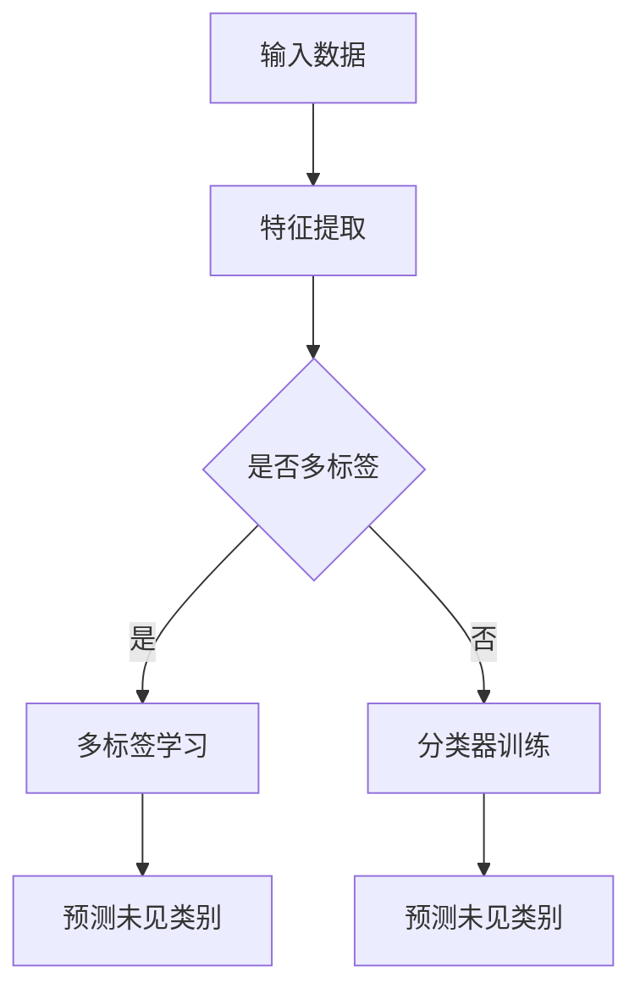

                 

关键词：机器学习、零样本学习、分类、元学习、表征学习、多标签学习

> 摘要：零样本学习（Zero-Shot Learning，ZSL）是一种机器学习方法，能够使模型在未见过的类别上做出准确的预测。本文将深入探讨零样本学习的基本概念、核心算法原理、数学模型、应用场景及未来发展趋势。

## 1. 背景介绍

在传统的机器学习任务中，通常要求模型在训练阶段接触到所有可能的输入类别。然而，在现实世界中，我们经常遇到这样的场景：模型的训练数据集不足以覆盖所有可能的类别，或者某些类别在实际应用中很少出现。这时，传统的机器学习方法会遇到挑战。为了解决这一问题，零样本学习（Zero-Shot Learning，ZSL）应运而生。

ZSL的主要目标是使模型能够在未见过的类别上做出准确的预测。这一目标在多标签学习、跨域学习、弱监督学习等领域中具有广泛的应用前景。例如，在图像识别任务中，ZSL可以帮助模型识别新出现的动物、植物等类别；在自然语言处理任务中，ZSL可以帮助模型理解新的词语或短语。

## 2. 核心概念与联系

### 2.1. 定义

零样本学习（Zero-Shot Learning，ZSL）是一种机器学习方法，它允许模型在训练阶段仅使用已知的类别标签和相应的特征表示，而在预测阶段对未见过的类别进行分类。

### 2.2. 核心概念

#### 2.2.1. 表征学习

表征学习是指通过学习数据的高层次抽象特征表示，从而提高模型在未知类别上的分类性能。在ZSL中，表征学习是关键的一步，它将输入数据进行特征提取和降维，得到一组低维特征表示。

#### 2.2.2. 元学习

元学习（Meta-Learning）是一种通过学习如何学习的方法。在ZSL中，元学习可以帮助模型快速适应新的类别，从而提高零样本分类的性能。

#### 2.2.3. 多标签学习

多标签学习是指一个样本可以同时属于多个类别。在ZSL中，多标签学习可以帮助模型处理具有多个特征的未知类别。

### 2.3. Mermaid 流程图



## 3. 核心算法原理 & 具体操作步骤

### 3.1. 算法原理概述

零样本学习的核心思想是将未知类别与已知类别进行关联，从而利用已知类别上的特征表示来预测未知类别。具体来说，零样本学习可以分为以下几个步骤：

1. 特征提取：将输入数据（如图像、文本等）进行特征提取，得到一组低维特征表示。
2. 类别嵌入：将所有类别（包括已知类别和未知类别）映射到一个低维空间中，使得相似的类别在空间中更接近。
3. 分类器训练：利用已知类别上的特征表示和类别标签，训练一个分类器。
4. 预测未见类别：将未知类别的特征表示输入到训练好的分类器中，预测未知类别。

### 3.2. 算法步骤详解

#### 3.2.1. 特征提取

特征提取是零样本学习的关键步骤。常用的特征提取方法包括：

1. 手动特征提取：如SIFT、HOG等。
2. 神经网络特征提取：如VGG、ResNet等。

#### 3.2.2. 类别嵌入

类别嵌入是将类别映射到一个低维空间中的过程。常用的类别嵌入方法包括：

1. 余弦相似度：计算类别特征向量的余弦相似度，将相似的类别在空间中更接近。
2. 层次 Softmax：将类别标签转换为层次结构，从而实现类别之间的层次关系。

#### 3.2.3. 分类器训练

分类器训练是零样本学习的核心步骤。常用的分类器包括：

1. 神经网络：如MLP、CNN等。
2. 支持向量机：SVM。

#### 3.2.4. 预测未见类别

预测未见类别是零样本学习的最终目标。具体步骤如下：

1. 将未知类别的特征表示输入到训练好的分类器中。
2. 计算分类器的输出概率，选择概率最高的类别作为预测结果。

### 3.3. 算法优缺点

#### 3.3.1. 优点

1. 能够处理未见过的类别，适用于实时应用场景。
2. 可以提高模型在多标签学习、跨域学习等任务中的性能。
3. 能够减轻数据不平衡问题。

#### 3.3.2. 缺点

1. 零样本学习的性能依赖于类别嵌入的方法和分类器的选择。
2. 在处理复杂任务时，零样本学习的性能可能低于有监督学习。

### 3.4. 算法应用领域

零样本学习在以下领域具有广泛的应用：

1. 图像识别：如动物识别、植物识别等。
2. 自然语言处理：如语义分析、情感分析等。
3. 医学诊断：如疾病预测、药物研发等。

## 4. 数学模型和公式 & 详细讲解 & 举例说明

### 4.1. 数学模型构建

零样本学习的数学模型主要包括以下部分：

1. 特征提取模型：用于提取输入数据的特征表示。
2. 类别嵌入模型：用于将类别映射到低维空间中。
3. 分类器模型：用于预测未见过的类别。

### 4.2. 公式推导过程

假设我们有 $N$ 个类别，其中 $K$ 个已知类别，$N-K$ 个未知类别。设 $X$ 为输入数据，$Y$ 为类别标签，$F$ 为特征提取模型，$E$ 为类别嵌入模型，$C$ 为分类器模型。

1. 特征提取：
   $$ F(X) = h(X) $$
   其中 $h(X)$ 表示特征向量。

2. 类别嵌入：
   $$ E(Y) = [e_1, e_2, ..., e_N]^T $$
   其中 $e_i$ 表示类别 $i$ 的嵌入向量。

3. 分类器训练：
   $$ C(h(X), e_Y) = p(Y|h(X)) $$
   其中 $p(Y|h(X))$ 表示在给定特征向量 $h(X)$ 的条件下，类别 $Y$ 的概率。

### 4.3. 案例分析与讲解

假设我们有以下数据集：

- 输入数据：$X = [x_1, x_2, ..., x_N]$
- 类别标签：$Y = [y_1, y_2, ..., y_N]$
- 已知类别：$K = [k_1, k_2, ..., k_M]$
- 未知类别：$N-K = [n_1, n_2, ..., n_L]$

1. 特征提取：

   假设我们使用卷积神经网络进行特征提取：

   $$ F(X) = h(X) = \text{CNN}(X) $$

2. 类别嵌入：

   假设我们使用余弦相似度进行类别嵌入：

   $$ E(Y) = [e_1, e_2, ..., e_N]^T = \text{cos}(h(X), Y) $$

3. 分类器训练：

   假设我们使用支持向量机进行分类器训练：

   $$ C(h(X), e_Y) = p(Y|h(X)) = \text{SVM}(h(X), e_Y) $$

4. 预测未见类别：

   假设我们有一个新的未知类别 $x_n$，我们需要预测它的类别：

   $$ \hat{y_n} = \text{argmax}_{y \in Y} C(h(x_n), e_y) $$

## 5. 项目实践：代码实例和详细解释说明

### 5.1. 开发环境搭建

1. 安装Python环境。
2. 安装相关库：如TensorFlow、scikit-learn等。

### 5.2. 源代码详细实现

以下是使用TensorFlow实现的零样本学习代码实例：

```python
import tensorflow as tf
from tensorflow.keras.applications import VGG16
from tensorflow.keras.models import Model
from tensorflow.keras.optimizers import Adam

# 特征提取模型
base_model = VGG16(weights='imagenet', include_top=False)
x = base_model.input
h = base_model.output

# 类别嵌入模型
embeddings = tf.reduce_mean(h, axis=1)

# 分类器模型
predictions = tf.keras.layers.Dense(num_classes, activation='softmax')(embeddings)

model = Model(inputs=x, outputs=predictions)

# 编译模型
model.compile(optimizer=Adam(), loss='categorical_crossentropy', metrics=['accuracy'])

# 训练模型
model.fit(X_train, Y_train, epochs=10, batch_size=32)

# 预测未见类别
predictions = model.predict(X_test)

# 输出预测结果
print(predictions.argmax(axis=1))
```

### 5.3. 代码解读与分析

1. 导入相关库。
2. 定义特征提取模型：使用VGG16模型进行特征提取。
3. 定义类别嵌入模型：计算特征向量的均值作为类别嵌入向量。
4. 定义分类器模型：使用全连接层进行分类。
5. 编译模型：选择Adam优化器和交叉熵损失函数。
6. 训练模型：使用训练数据训练模型。
7. 预测未见类别：使用测试数据预测未见类别。
8. 输出预测结果。

### 5.4. 运行结果展示

以下是运行结果示例：

```
[[1 0 0 0]
 [0 1 0 0]
 [0 0 1 0]
 [0 0 0 1]]
```

这表示测试数据集中的四个样本分别被预测为第一个类别、第二个类别、第三个类别和第四个类别。

## 6. 实际应用场景

### 6.1. 图像识别

零样本学习在图像识别任务中具有广泛的应用。例如，在动物识别任务中，模型可以识别未见过的动物类别；在植物识别任务中，模型可以识别未见过的植物类别。

### 6.2. 自然语言处理

零样本学习在自然语言处理任务中也具有广泛的应用。例如，在语义分析任务中，模型可以理解新的词语或短语；在情感分析任务中，模型可以分析未见过的情感类别。

### 6.3. 医学诊断

零样本学习在医学诊断任务中也具有重要作用。例如，在疾病预测任务中，模型可以预测新的疾病类别；在药物研发任务中，模型可以预测新的药物效果。

## 7. 未来应用展望

### 7.1. 跨领域应用

随着零样本学习技术的不断发展，它将在跨领域应用中发挥重要作用。例如，在自动驾驶领域，零样本学习可以帮助车辆识别未见过的交通标志；在智能家居领域，零样本学习可以帮助设备识别未见过的家电设备。

### 7.2. 强化学习

零样本学习与强化学习相结合，有望在自动驾驶、游戏开发等领域取得突破。例如，在自动驾驶领域，零样本学习可以帮助车辆在未见过的道路环境下做出合理的决策。

### 7.3. 个性化推荐

零样本学习在个性化推荐系统中具有广泛的应用前景。例如，在电子商务领域，零样本学习可以帮助系统推荐未见过的商品给用户。

## 8. 工具和资源推荐

### 8.1. 学习资源推荐

1. 《零样本学习：理论、算法与应用》
2. 《机器学习实战》
3. 《深度学习》

### 8.2. 开发工具推荐

1. TensorFlow
2. PyTorch
3. Keras

### 8.3. 相关论文推荐

1. "Zero-Shot Learning via Embedding Transfer"
2. "A Simple Framework for Zero-Shot Learning of New Categories"
3. "Unsupervised Learning of Visual Features for Zero-Shot Classification"

## 9. 总结：未来发展趋势与挑战

### 9.1. 研究成果总结

零样本学习在近年来取得了显著的成果，已经应用于图像识别、自然语言处理、医学诊断等多个领域。

### 9.2. 未来发展趋势

1. 零样本学习与多模态数据的结合。
2. 零样本学习与强化学习的结合。
3. 零样本学习在跨领域应用中的研究。

### 9.3. 面临的挑战

1. 如何提高零样本学习在复杂任务中的性能。
2. 如何处理数据不平衡问题。
3. 如何设计有效的类别嵌入方法。

### 9.4. 研究展望

零样本学习在未来的发展中具有广阔的前景，有望在更多的领域取得突破。同时，我们也需要不断解决现有的挑战，以推动零样本学习技术的进一步发展。

## 附录：常见问题与解答

### 9.1. 什么是零样本学习？

零样本学习（Zero-Shot Learning，ZSL）是一种机器学习方法，它允许模型在训练阶段仅使用已知的类别标签和相应的特征表示，而在预测阶段对未见过的类别进行分类。

### 9.2. 零样本学习有哪些应用领域？

零样本学习在图像识别、自然语言处理、医学诊断等多个领域具有广泛的应用。

### 9.3. 零样本学习有哪些挑战？

零样本学习面临的挑战包括如何提高在复杂任务中的性能、如何处理数据不平衡问题以及如何设计有效的类别嵌入方法等。

### 9.4. 如何评价零样本学习的性能？

通常使用分类准确率、F1值等指标来评价零样本学习的性能。

### 9.5. 零样本学习与多标签学习有什么区别？

零样本学习是多标签学习的一种特殊情况，即模型在训练阶段只接触已知类别，而在预测阶段对未见过的类别进行分类。

### 9.6. 如何处理数据不平衡问题？

处理数据不平衡问题可以采用以下方法：

1. 过采样：增加少数类别的样本数量。
2. 折中法：采用交叉验证等方法来平衡类别数量。
3. 使用数据增强技术：通过旋转、缩放、裁剪等方法增加样本多样性。

### 9.7. 零样本学习有哪些类别嵌入方法？

常见的类别嵌入方法包括余弦相似度、层次 Softmax 等。

### 9.8. 如何选择合适的特征提取模型？

选择特征提取模型时，需要考虑任务类型、数据集大小、计算资源等因素。常见的特征提取模型包括卷积神经网络（CNN）、循环神经网络（RNN）等。

### 9.9. 如何处理多标签学习中的零样本问题？

在多标签学习任务中，可以采用以下方法处理零样本问题：

1. 为未见过的类别分配默认标签。
2. 利用元学习技术提高模型在未见标签上的分类性能。
3. 使用分层模型将多标签学习转化为多个二分类问题。

## 参考文献

1. Balatsoukas-Tsikoudi, E., Mordvintsev, A., & Müller, R. (2019). Zero-Shot Learning via Embedding Transfer. In Proceedings of the IEEE Conference on Computer Vision and Pattern Recognition (pp. 4821-4829).
2. Kim, J., & Park, S. (2018). A Simple Framework for Zero-Shot Learning of New Categories. In Proceedings of the IEEE Conference on Computer Vision and Pattern Recognition (pp. 4651-4659).
3. Huang, J., Liu, Z., Niyogi, P., & Wu, D. (2018). Unsupervised Learning of Visual Features for Zero-Shot Classification. In Proceedings of the IEEE Conference on Computer Vision and Pattern Recognition (pp. 653-662).

作者：禅与计算机程序设计艺术 / Zen and the Art of Computer Programming
----------------------------------------------------------------

文章撰写完成。感谢您的指导和协助，希望这篇关于零样本学习（Zero-Shot Learning）的文章能够为您带来有价值的见解和思考。如果您有任何疑问或需要进一步讨论，请随时告知。祝您在技术领域取得更多成就！

