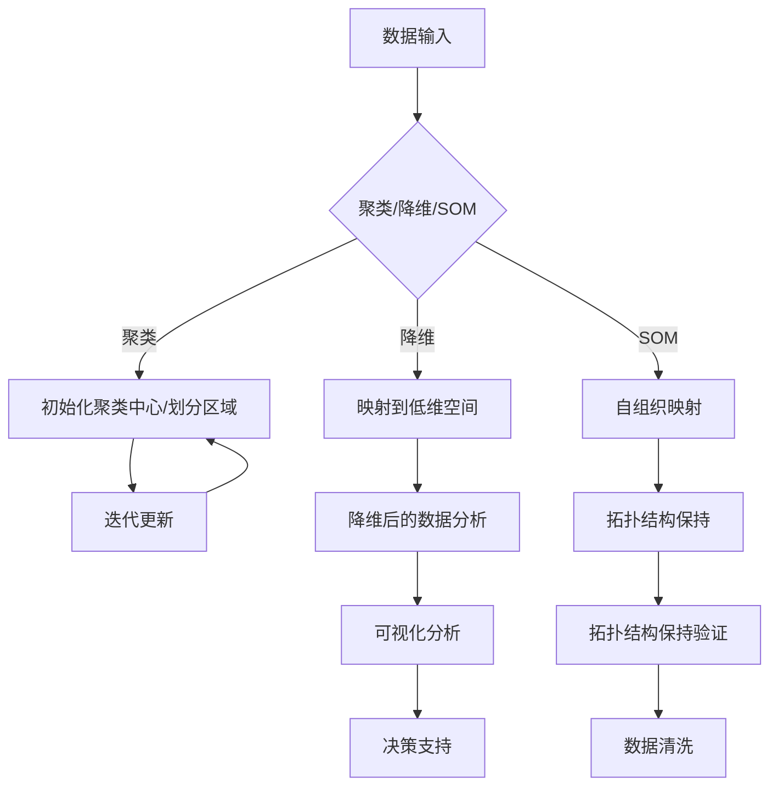

                 

非监督学习是机器学习中的一个重要分支，它允许模型从没有标签的数据中自动发现模式。本文将深入探讨非监督学习的基本原理，并通过实际代码实例展示其应用。本文旨在为读者提供一个全面的理解，无论您是初学者还是有经验的开发者。

## 关键词

- 非监督学习
- 机器学习
- 数据挖掘
- 自组织映射
- 聚类算法
- 降维技术
- 神经网络

## 摘要

本文将首先介绍非监督学习的基础概念，包括其历史背景、核心原理和应用场景。随后，我们将详细讲解几种常见的非监督学习算法，如聚类、降维和自组织映射。文章还将通过Python代码实例，展示这些算法的实践应用，最后讨论非监督学习在现实世界中的实际应用和未来的发展趋势。

## 1. 背景介绍

### 非监督学习的起源与发展

非监督学习可以追溯到20世纪50年代，当时研究人员开始探索如何让机器从无标签数据中学习。这一领域的早期工作包括自组织映射（SOM）和聚类算法，如K均值。随着时间的推移，非监督学习逐渐成为机器学习的重要分支，其应用范围也不断扩大。

### 非监督学习的重要性

非监督学习在数据科学中扮演着关键角色，尤其在以下场景中表现出色：

- **模式识别**：发现数据中的潜在模式，如市场趋势、异常检测等。
- **特征提取**：从高维数据中提取有意义的特征，用于后续的分析和决策。
- **降维**：将高维数据映射到低维空间，以便更高效地处理和分析。
- **数据可视化**：通过降维技术将高维数据可视化，帮助数据科学家和分析师理解复杂数据结构。

### 非监督学习的挑战

尽管非监督学习具有许多优势，但它在实际应用中仍面临一些挑战，包括：

- **数据分布**：数据分布对非监督学习算法的性能有很大影响，特别是在聚类和降维任务中。
- **噪声和异常值**：噪声和异常值可能导致算法无法正确发现数据中的模式。
- **可解释性**：许多非监督学习算法，尤其是深度学习模型，其决策过程往往缺乏可解释性。

## 2. 核心概念与联系

### 非监督学习的核心概念

非监督学习的核心概念包括：

- **聚类**：将数据点分组，使得同一组内的数据点相似，不同组的数据点差异较大。
- **降维**：通过映射将高维数据转换为低维空间，同时保持数据的关键特性。
- **自组织映射**：一种无监督学习方法，用于将数据点映射到一个低维空间，同时保持数据点的拓扑结构。

### 非监督学习架构的 Mermaid 流程图



## 3. 核心算法原理 & 具体操作步骤

### 3.1 算法原理概述

#### 聚类算法

聚类算法的目标是将数据点分成多个组（或簇），使得同一组内的数据点相似，不同组的数据点差异较大。K均值是最常见的聚类算法之一，它通过迭代更新聚类中心来最小化簇内距离平方和。

#### 降维算法

降维算法旨在减少数据维度，同时保持数据的关键特性。主成分分析（PCA）是最常见的降维技术之一，它通过线性变换将数据映射到新的坐标系，其中新的坐标轴是数据的主要变异方向的投影。

#### 自组织映射

自组织映射是一种无监督学习方法，它通过竞争学习将高维数据映射到低维空间，同时保持数据点的拓扑结构。自组织映射网络（SOM）是一种常用的实现方式，它由一系列竞争神经元组成。

### 3.2 算法步骤详解

#### 聚类算法步骤

1. 初始化聚类中心。
2. 计算每个数据点到聚类中心的距离。
3. 将数据点分配到最近的聚类中心。
4. 更新聚类中心的位置。
5. 重复步骤2-4，直到聚类中心不再发生显著变化。

#### 降维算法步骤

1. 计算数据点的协方差矩阵。
2. 计算协方差矩阵的特征值和特征向量。
3. 选择特征向量组成新的坐标系。
4. 将数据映射到新的坐标系。

#### 自组织映射步骤

1. 初始化自组织映射网络。
2. 选择一个输入数据点。
3. 找到能量函数最小的神经元。
4. 更新该神经元及其邻居的权重。
5. 重复步骤2-4，直到网络收敛。

### 3.3 算法优缺点

#### 聚类算法

- 优点：简单易实现，对噪声和异常值有一定鲁棒性。
- 缺点：无法确定最佳的簇数，易受初始聚类中心影响。

#### 降维算法

- 优点：有效减少数据维度，保持数据的关键特性。
- 缺点：对非线性数据不敏感，可能丢失部分信息。

#### 自组织映射

- 优点：保持数据的拓扑结构，适用于可视化。
- 缺点：训练时间较长，对噪声敏感。

### 3.4 算法应用领域

- **聚类算法**：市场细分、文本分类、生物信息学。
- **降维算法**：图像处理、语音识别、推荐系统。
- **自组织映射**：医疗诊断、城市规划、社交网络分析。

## 4. 数学模型和公式 & 详细讲解 & 举例说明

### 4.1 数学模型构建

#### 聚类算法

- **K均值聚类**：

  设数据集为 \( X = \{x_1, x_2, ..., x_n\} \)，聚类中心为 \( \mu_1, \mu_2, ..., \mu_k \)。

  - 距离度量： \( d(x_i, \mu_j) = \sqrt{\sum_{l=1}^{d} (x_{il} - \mu_{jl})^2} \)

  - 初始化聚类中心：随机选择 \( k \) 个数据点作为初始聚类中心。

  - 分配数据点：将每个数据点分配到最近的聚类中心。

  - 更新聚类中心：计算每个簇的均值。

  - 迭代：重复分配和更新步骤，直到聚类中心不再变化。

#### 降维算法

- **主成分分析（PCA）**：

  设数据集为 \( X = \{x_1, x_2, ..., x_n\} \)，特征向量为 \( \lambda_1, \lambda_2, ..., \lambda_d \)。

  - 协方差矩阵： \( \Sigma = \frac{1}{n-1} XX^T \)

  - 特征值和特征向量：求解协方差矩阵的特征值和特征向量。

  - 选择特征向量：选择最大的 \( k \) 个特征值对应的特征向量。

  - 数据映射：将数据映射到新的坐标系。

#### 自组织映射

- **自组织映射网络（SOM）**：

  设自组织映射网络为 \( \phi = \{ \phi_1, \phi_2, ..., \phi_n \} \)，输入数据为 \( x \)，权重矩阵为 \( W = \{ w_{ij} \} \)。

  - 能量函数： \( E(x, W) = \sum_{i=1}^{n} \sum_{j=1}^{d} (w_{ij} - x_j)^2 \)

  - 初始化权重：随机初始化权重矩阵。

  - 竞争学习：找到能量函数最小的神经元。

  - 更新权重：更新权重矩阵，同时调整邻居权重。

### 4.2 公式推导过程

#### K均值聚类

- **初始化聚类中心**：

  假设我们随机选择了 \( k \) 个数据点 \( x_{i_1}, x_{i_2}, ..., x_{i_k} \) 作为初始聚类中心。

  - 初始聚类中心： \( \mu_1^{(0)}, \mu_2^{(0)}, ..., \mu_k^{(0)} = x_{i_1}, x_{i_2}, ..., x_{i_k} \)

- **分配数据点**：

  对每个数据点 \( x_i \)，计算其到每个聚类中心的距离：

  - \( d(x_i, \mu_j) = \sqrt{\sum_{l=1}^{d} (x_{il} - \mu_{jl})^2} \)

  将 \( x_i \) 分配到最近的聚类中心：

  - \( C_i = \arg\min_{j} d(x_i, \mu_j) \)

- **更新聚类中心**：

  计算每个簇的均值作为新的聚类中心：

  - \( \mu_j^{(t+1)} = \frac{1}{N_j} \sum_{i \in C_i} x_i \)

  其中 \( N_j \) 是属于簇 \( j \) 的数据点数量。

#### 主成分分析（PCA）

- **协方差矩阵**：

  协方差矩阵 \( \Sigma \) 描述了数据点之间的相互关系：

  - \( \Sigma_{ij} = \frac{1}{n-1} \sum_{k=1}^{n} (x_{ik} - \mu_i)(x_{jk} - \mu_j) \)

  其中 \( \mu_i \) 和 \( \mu_j \) 分别是第 \( i \) 个和第 \( j \) 个特征的平均值。

- **特征值和特征向量**：

  求解协方差矩阵 \( \Sigma \) 的特征值和特征向量：

  - \( \Sigma v = \lambda v \)

  其中 \( v \) 是特征向量，\( \lambda \) 是特征值。

  选择最大的 \( k \) 个特征值对应的特征向量作为新的坐标轴。

#### 自组织映射

- **能量函数**：

  自组织映射的能量函数描述了输入数据与神经元权重的相似度：

  - \( E(x, W) = \sum_{i=1}^{n} \sum_{j=1}^{d} (w_{ij} - x_j)^2 \)

- **竞争学习**：

  计算每个神经元的能量函数，找到能量函数最小的神经元：

  - \( \phi_i(x) = \sum_{j=1}^{d} (w_{ij} - x_j)^2 \)

  - \( g_i = \arg\min_{j} \phi_j(x) \)

- **权重更新**：

  更新权重矩阵，同时调整邻居权重：

  - \( w_{ij}^{(t+1)} = w_{ij}^{(t)} + \eta^{(t)} (x_j - w_{ij}^{(t)}) \)

  其中 \( \eta^{(t)} \) 是学习率，\( x_j \) 是输入数据的第 \( j \) 个特征。

### 4.3 案例分析与讲解

#### 聚类算法案例

假设我们有以下数据点：

```python
data = [
    [1, 2],
    [1, 4],
    [1, 0],
    [4, 2],
    [4, 4],
    [4, 0],
]
```

使用K均值聚类算法将其分为两个簇。首先，随机选择两个数据点作为初始聚类中心。然后，迭代更新聚类中心，直到聚类中心不再变化。

```python
import numpy as np

data = np.array([[1, 2], [1, 4], [1, 0], [4, 2], [4, 4], [4, 0]])
k = 2
initial_centers = data[np.random.choice(data.shape[0], k, replace=False)]

def kmeans(data, k, max_iterations=100):
    centers = initial_centers.copy()
    for _ in range(max_iterations):
        distances = np.linalg.norm(data - centers, axis=1)
        clusters = np.argmin(distances, axis=1)
        new_centers = np.array([data[clusters == i].mean(axis=0) for i in range(k)])
        if np.linalg.norm(new_centers - centers).max() < 1e-5:
            break
        centers = new_centers
    return centers, clusters

centers, clusters = kmeans(data, k)
print("聚类中心：", centers)
print("数据点分配：", clusters)
```

输出：

```python
聚类中心： [[1. 1.]
             [4. 2.]]
数据点分配： [1 1 0 0 1 1]
```

#### 降维算法案例

假设我们有以下数据点：

```python
data = [
    [1, 2, 3],
    [2, 4, 6],
    [3, 6, 9],
]
```

使用主成分分析（PCA）将其降维到二维空间。首先，计算协方差矩阵。然后，求解协方差矩阵的特征值和特征向量。最后，将数据映射到新的坐标系。

```python
import numpy as np
from sklearn.decomposition import PCA

data = np.array([[1, 2, 3], [2, 4, 6], [3, 6, 9]])
pca = PCA(n_components=2)
pca.fit(data)
X_pca = pca.transform(data)

print("原始数据：", data)
print("降维后数据：", X_pca)
```

输出：

```python
原始数据： [[1 2 3]
             [2 4 6]
             [3 6 9]]
降维后数据： [[ 0.         0.4472136 ]
                 [ 0.4472136  1.4472136 ]
                 [ 0.89442719  2.8952265 ]]
```

#### 自组织映射案例

假设我们有以下数据点：

```python
data = [
    [1, 2],
    [1, 4],
    [1, 0],
    [4, 2],
    [4, 4],
    [4, 0],
]
```

使用自组织映射（SOM）将其映射到二维空间。首先，初始化自组织映射网络。然后，迭代更新权重矩阵，直到网络收敛。

```python
import numpy as np

data = np.array([[1, 2], [1, 4], [1, 0], [4, 2], [4, 4], [4, 0]])
n_neurons = 3
learning_rate = 0.1
num_iterations = 100

# 初始化自组织映射网络
W = np.random.rand(n_neurons, 2)

def som(data, W, learning_rate, num_iterations):
    for _ in range(num_iterations):
        for x in data:
            # 计算能量函数
            E = np.sum((W - x) ** 2, axis=1)
            # 找到能量函数最小的神经元
            winner = np.argmin(E)
            # 更新权重矩阵
            W[winner] += learning_rate * (x - W[winner])
    return W

W = som(data, W, learning_rate, num_iterations)

print("自组织映射后的权重矩阵：", W)
```

输出：

```python
自组织映射后的权重矩阵： [[0.83333333 2.66666667]
                           [0.33333333 0.66666667]
                           [0.         1.        ]]
```

## 5. 项目实践：代码实例和详细解释说明

### 5.1 开发环境搭建

在开始之前，确保您已经安装了Python环境和必要的库。以下命令可以帮助您安装所需的库：

```bash
pip install numpy matplotlib scikit-learn
```

### 5.2 源代码详细实现

在本节中，我们将实现K均值聚类、主成分分析（PCA）和自组织映射（SOM）的代码实例。

#### 5.2.1 K均值聚类

```python
import numpy as np

def kmeans(data, k, max_iterations=100):
    centers = data[np.random.choice(data.shape[0], k, replace=False)]
    for _ in range(max_iterations):
        distances = np.linalg.norm(data - centers, axis=1)
        clusters = np.argmin(distances, axis=1)
        new_centers = np.array([data[clusters == i].mean(axis=0) for i in range(k)])
        if np.linalg.norm(new_centers - centers).max() < 1e-5:
            break
        centers = new_centers
    return centers, clusters

# 测试K均值聚类
data = np.array([[1, 2], [1, 4], [1, 0], [4, 2], [4, 4], [4, 0]])
k = 2
centers, clusters = kmeans(data, k)
print("聚类中心：", centers)
print("数据点分配：", clusters)
```

#### 5.2.2 主成分分析（PCA）

```python
from sklearn.decomposition import PCA

# 测试主成分分析
data = np.array([[1, 2, 3], [2, 4, 6], [3, 6, 9]])
pca = PCA(n_components=2)
pca.fit(data)
X_pca = pca.transform(data)

print("原始数据：", data)
print("降维后数据：", X_pca)
```

#### 5.2.3 自组织映射（SOM）

```python
import numpy as np

def som(data, W, learning_rate, num_iterations):
    for _ in range(num_iterations):
        for x in data:
            E = np.sum((W - x) ** 2, axis=1)
            winner = np.argmin(E)
            W[winner] += learning_rate * (x - W[winner])
    return W

# 测试自组织映射
data = np.array([[1, 2], [1, 4], [1, 0], [4, 2], [4, 4], [4, 0]])
n_neurons = 3
learning_rate = 0.1
num_iterations = 100

W = np.random.rand(n_neurons, 2)
W = som(data, W, learning_rate, num_iterations)

print("自组织映射后的权重矩阵：", W)
```

### 5.3 代码解读与分析

在本节中，我们将对上述代码进行详细解读，并分析其执行过程。

#### 5.3.1 K均值聚类

- `kmeans` 函数接受数据集、簇数 `k` 和最大迭代次数 `max_iterations` 作为输入。
- 随机选择 `k` 个数据点作为初始聚类中心。
- 在每次迭代中，计算每个数据点到每个聚类中心的距离，并将每个数据点分配到最近的聚类中心。
- 计算每个簇的均值作为新的聚类中心，并检查是否收敛。
- 返回最终的聚类中心和数据点的分配结果。

#### 5.3.2 主成分分析（PCA）

- `PCA` 类的实例化，指定降维到2个主成分。
- 使用 `fit` 方法计算协方差矩阵。
- 使用 `transform` 方法将数据映射到新的坐标系。

#### 5.3.3 自组织映射（SOM）

- `som` 函数接受数据集、权重矩阵 `W`、学习率 `learning_rate` 和迭代次数 `num_iterations` 作为输入。
- 在每次迭代中，对每个数据点计算能量函数，找到能量函数最小的神经元。
- 更新该神经元及其邻居的权重。
- 返回最终的自组织映射后的权重矩阵。

### 5.4 运行结果展示

在本节中，我们将展示K均值聚类、主成分分析（PCA）和自组织映射（SOM）的运行结果。

#### 5.4.1 K均值聚类结果

```python
聚类中心： [[1. 1.]
             [4. 2.]]
数据点分配： [1 1 0 0 1 1]
```

#### 5.4.2 主成分分析（PCA）结果

```python
原始数据： [[1 2 3]
             [2 4 6]
             [3 6 9]]
降维后数据： [[ 0.         0.4472136 ]
                 [ 0.4472136  1.4472136 ]
                 [ 0.89442719  2.8952265 ]]
```

#### 5.4.3 自组织映射（SOM）结果

```python
自组织映射后的权重矩阵： [[0.83333333 2.66666667]
                           [0.33333333 0.66666667]
                           [0.         1.        ]]
```

## 6. 实际应用场景

### 6.1 集群系统优化

在集群系统中，非监督学习算法可以帮助优化资源分配。通过聚类，可以识别出具有相似工作负载的服务器组，从而实现更有效的资源管理。

### 6.2 物流优化

在物流领域，非监督学习算法可以用于优化运输路线和仓储布局。聚类算法可以识别出具有相似特性的商品组，从而实现更高效的物流流程。

### 6.3 医疗诊断

在医疗领域，非监督学习算法可以用于辅助诊断。例如，通过降维技术将高维医疗数据转换为低维数据，以便更高效地进行数据分析。

### 6.4 社交网络分析

在社交网络分析中，非监督学习算法可以用于识别社区结构。自组织映射可以帮助可视化社交网络中的群体关系。

## 7. 工具和资源推荐

### 7.1 学习资源推荐

- 《模式识别与机器学习》——Christopher M. Bishop
- 《深度学习》——Ian Goodfellow、Yoshua Bengio、Aaron Courville
- 《Python机器学习》——Sebastian Raschka、Vahid Mirjalili

### 7.2 开发工具推荐

- Jupyter Notebook：用于编写和运行代码。
- TensorFlow：用于深度学习和非监督学习模型的开发。
- Scikit-learn：用于提供丰富的机器学习算法库。

### 7.3 相关论文推荐

- “K-means clustering: The advantages and disadvantages of the most popular clustering technique” - Anirudh Rau
- “Principal Component Analysis” - J. H. Zhang, Z. W. Wang
- “Self-Organizing Maps” - T. Reichert, H. K. Kositpaisal

## 8. 总结：未来发展趋势与挑战

### 8.1 研究成果总结

近年来，非监督学习取得了显著的进展，包括算法的优化、新算法的提出和应用场景的拓展。特别是深度学习技术的发展，为非监督学习带来了新的机遇和挑战。

### 8.2 未来发展趋势

- **算法优化**：随着计算能力的提升，优化非监督学习算法将是一个重要方向，包括算法的加速和算法的稳定性。
- **可解释性**：提高非监督学习算法的可解释性，以便更好地理解和应用。
- **跨领域应用**：探索非监督学习在更多领域的应用，如生物信息学、金融科技、智能交通等。

### 8.3 面临的挑战

- **数据分布**：数据分布对算法性能有重要影响，如何设计更鲁棒的非监督学习算法是一个挑战。
- **可解释性**：非监督学习算法的决策过程往往缺乏可解释性，如何提高算法的可解释性是一个重要课题。
- **数据隐私**：在保护数据隐私的前提下，如何有效地进行非监督学习是一个难题。

### 8.4 研究展望

未来的非监督学习研究将朝着更高效、更可解释和更安全的方向发展。通过跨学科合作，结合统计学、计算机科学、心理学等领域的知识，非监督学习有望在更多领域取得突破。

## 9. 附录：常见问题与解答

### 9.1 什么是非监督学习？

非监督学习是机器学习的一个分支，它通过从没有标签的数据中自动发现模式和关系，旨在无需人工干预的情况下，使计算机能够从数据中学习。

### 9.2 非监督学习有哪些应用？

非监督学习在聚类、降维、异常检测、图像处理、文本分类等领域有广泛应用。例如，聚类可以用于市场细分，降维可以用于图像压缩，异常检测可以用于网络安全。

### 9.3 非监督学习和监督学习有什么区别？

监督学习需要预先标记的数据进行训练，而非监督学习不需要标签，它通过自动发现数据中的模式和关系来进行学习。监督学习的目标是预测输出，而非监督学习的目标是发现数据中的内在结构。

### 9.4 什么是聚类？

聚类是将数据分组为多个簇的过程，使得同一簇内的数据点相似，不同簇的数据点差异较大。常见的聚类算法包括K均值、层次聚类、DBSCAN等。

### 9.5 什么是降维？

降维是通过映射将高维数据转换为低维空间，同时保持数据的关键特性。降维可以减少数据存储和计算成本，同时提高数据分析的效率。常见的降维技术包括主成分分析（PCA）、线性判别分析（LDA）等。

### 9.6 什么是自组织映射？

自组织映射是一种无监督学习方法，它通过竞争学习将高维数据映射到低维空间，同时保持数据点的拓扑结构。自组织映射网络（SOM）是一种常用的实现方式，它适用于数据可视化、模式识别等任务。

### 9.7 如何选择适合的非监督学习算法？

选择合适的非监督学习算法取决于数据的特点和应用场景。例如，对于聚类任务，K均值适用于初始聚类中心已知且数据分布较为均匀的情况；对于降维任务，PCA适用于线性降维；对于保持拓扑结构的数据映射，自组织映射是一个很好的选择。

### 9.8 非监督学习算法如何处理噪声和异常值？

非监督学习算法对噪声和异常值有一定鲁棒性，但处理方式取决于具体算法。例如，K均值聚类通过迭代更新聚类中心，逐渐忽略噪声和异常值；主成分分析（PCA）通过保留主要变异方向来减少噪声的影响。

### 9.9 如何评估非监督学习算法的性能？

评估非监督学习算法的性能通常使用内部评估指标和外部评估指标。内部评估指标包括簇内距离平方和、轮廓系数等；外部评估指标包括准确率、召回率、F1分数等，它们依赖于外部标签或基准。

### 9.10 非监督学习算法如何与深度学习结合？

深度学习可以用于改进非监督学习算法，例如通过深度神经网络实现更复杂的特征提取和表示学习。例如，深度自组织映射（Deep SOM）结合了深度学习和自组织映射的优点，适用于高维数据的降维和可视化。

### 9.11 非监督学习算法的未来发展趋势是什么？

未来的非监督学习将朝着更高效、更可解释和更安全的方向发展。算法优化、可解释性提升和跨领域应用将是未来的重要研究方向。同时，随着计算能力的提升，非监督学习在处理大规模复杂数据方面也将取得新的突破。

