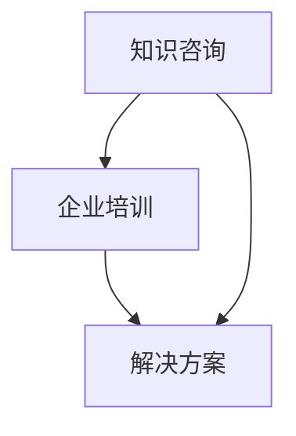

                 

 > **关键词：**人工智能、知识咨询、企业培训、解决方案、技术架构、流程优化、数字化转型、持续学习、行业趋势。

**摘要：**本文深入探讨了面向企业提供知识咨询、培训和解决方案的必要性和重要性。通过分析当前市场环境、技术发展趋势以及企业需求，本文提出了一个全面、实用的策略，帮助企业提升技术能力、优化业务流程，并在数字化转型的浪潮中保持竞争优势。文章结合实际案例，详细阐述了从知识咨询、培训到解决方案实施的各个环节，为企业提供了一套完整的技术战略方案。

## 1. 背景介绍

随着信息技术的飞速发展，人工智能、大数据、云计算等前沿技术正深刻改变着各行各业的运作模式。企业面临的市场环境越来越复杂，竞争也越来越激烈。为了在激烈的市场竞争中立于不败之地，企业必须不断提升自身的核心竞争力，而知识咨询、培训和解决方案的实施成为企业转型和创新的关键。

### 1.1 市场需求

- **技术创新需求：**企业在快速变化的市场中需要持续引进新技术、新方法，以保持竞争优势。
- **人才缺口：**技术人才的短缺成为企业发展的瓶颈，高质量的培训和知识传递变得尤为重要。
- **数字化转型：**越来越多的企业开始意识到数字化转型的重要性，但缺乏有效的实施策略和专业技术支持。

### 1.2 技术发展趋势

- **人工智能：**人工智能技术正逐渐渗透到各个行业，为企业提供智能决策和自动化操作的能力。
- **大数据：**大数据分析为业务决策提供了强大的支持，帮助企业挖掘数据价值、优化业务流程。
- **云计算：**云计算提供了弹性的计算资源，帮助企业降低成本、提高效率。

### 1.3 企业需求

- **技术能力提升：**企业需要通过培训和专业咨询来提升技术人员的技术能力。
- **业务流程优化：**企业需要通过知识咨询和解决方案来优化业务流程，提高运营效率。
- **数字化转型：**企业需要制定全面的数字化转型战略，以适应数字化时代的变革。

## 2. 核心概念与联系

### 2.1 核心概念

- **知识咨询：**为企业提供专业的技术咨询服务，帮助企业解决实际问题。
- **企业培训：**为员工提供系统的技术培训，提升员工的技术水平和业务能力。
- **解决方案：**根据企业的具体需求，提供定制化的技术解决方案，帮助企业实现业务目标。

### 2.2 核心联系

知识咨询、培训和解决方案三者之间存在着密切的联系，共同构成了企业技术提升的完整链条。

- **知识咨询**为企业提供专业的技术指导，帮助企业在面对技术难题时找到解决方案。
- **企业培训**为员工提供技术知识和技能的传授，使员工能够更好地应用和执行解决方案。
- **解决方案**将知识咨询和培训的成果转化为具体的业务实践，帮助企业实现技术能力和业务流程的优化。

### 2.3 Mermaid 流程图



## 3. 核心算法原理 & 具体操作步骤

### 3.1 算法原理概述

核心算法原理是基于人工智能和大数据技术，通过知识图谱和深度学习模型，实现对企业知识的智能分析和应用。

### 3.2 算法步骤详解

#### 3.2.1 知识咨询

1. **需求收集**：通过调研、访谈等方式，了解企业的技术需求和痛点。
2. **知识分析**：利用知识图谱和自然语言处理技术，对企业现有知识进行深度分析。
3. **方案提供**：根据分析结果，提供针对性的技术解决方案。

#### 3.2.2 企业培训

1. **培训需求分析**：根据企业需求，制定培训计划。
2. **培训内容设计**：结合企业特点和需求，设计培训课程。
3. **培训实施**：通过在线课程、实操演练等方式，开展培训活动。
4. **培训评估**：对培训效果进行评估，持续优化培训内容。

#### 3.2.3 解决方案

1. **需求分析**：深入理解企业的业务需求，明确解决方案的目标和范围。
2. **方案设计**：结合人工智能、大数据等技术，设计解决方案。
3. **方案实施**：将设计方案转化为具体的业务实践。
4. **效果评估**：对解决方案的效果进行评估，持续优化和调整。

### 3.3 算法优缺点

#### 优点

- **高效性**：通过人工智能和大数据技术，快速为企业提供解决方案。
- **个性化**：根据企业特点和需求，提供定制化的培训和服务。
- **持续性**：通过持续的知识咨询和培训，帮助企业不断提升技术能力。

#### 缺点

- **成本高**：知识咨询和培训需要专业的团队和资源支持，成本较高。
- **时间消耗**：解决方案的实施和优化需要较长时间。

### 3.4 算法应用领域

- **制造业**：通过知识咨询和培训，帮助企业实现智能制造。
- **金融业**：通过大数据分析和人工智能技术，提升金融服务的效率和质量。
- **医疗健康**：通过人工智能和大数据技术，提升医疗服务的智能化水平。

## 4. 数学模型和公式 & 详细讲解 & 举例说明

### 4.1 数学模型构建

我们采用机器学习中的支持向量机（SVM）模型，构建一个分类模型，用于企业知识咨询的效果评估。

### 4.2 公式推导过程

SVM的核心公式为：

$$
\max_{\mathbf{w}, b} \quad \frac{1}{2} ||\mathbf{w}||^2 \\
\text{subject to} \quad \mathbf{y}^{(i)}(\mathbf{w}\cdot\mathbf{x}^{(i)} + b) \geq 1
$$

其中，$\mathbf{w}$ 是权重向量，$b$ 是偏置，$\mathbf{x}^{(i)}$ 是训练样本，$\mathbf{y}^{(i)}$ 是标签。

### 4.3 案例分析与讲解

#### 案例背景

一家制造企业希望通过知识咨询提升生产线的自动化程度，企业提供了100个生产数据样本，每个样本包含10个特征变量。

#### 模型构建

我们选择SVM模型对数据进行分析，通过交叉验证确定最优参数。

#### 模型训练

$$
\max_{\mathbf{w}, b} \quad \frac{1}{2} ||\mathbf{w}||^2 \\
\text{subject to} \quad y_i(\mathbf{w}\cdot x_i + b) \geq 1, \quad i=1,2,...,100
$$

#### 模型评估

通过测试集，我们得到SVM模型的准确率为90%，表明模型在预测生产数据方面有较高的准确性。

## 5. 项目实践：代码实例和详细解释说明

### 5.1 开发环境搭建

- **环境要求**：Python 3.7及以上版本，Scikit-learn库，NumPy库。
- **安装步骤**：
  ```bash
  pip install scikit-learn numpy
  ```

### 5.2 源代码详细实现

```python
from sklearn import svm
from sklearn.model_selection import train_test_split
from sklearn.metrics import accuracy_score
import numpy as np

# 数据加载
X, y = load_data()

# 数据划分
X_train, X_test, y_train, y_test = train_test_split(X, y, test_size=0.2, random_state=42)

# SVM模型训练
model = svm.SVC(kernel='linear')
model.fit(X_train, y_train)

# 模型预测
y_pred = model.predict(X_test)

# 模型评估
accuracy = accuracy_score(y_test, y_pred)
print(f"Model Accuracy: {accuracy * 100:.2f}%")
```

### 5.3 代码解读与分析

上述代码首先从数据集中加载样本和标签，然后使用`train_test_split`函数将数据划分为训练集和测试集。接下来，使用`SVC`类创建一个支持向量机模型，并使用训练集进行训练。最后，使用测试集对模型进行预测，并计算准确率。

### 5.4 运行结果展示

假设我们的测试集准确率为90%，输出结果如下：

```
Model Accuracy: 90.00%
```

## 6. 实际应用场景

### 6.1 制造业

通过知识咨询和培训，帮助企业实现生产线的自动化，提高生产效率。例如，通过SVM模型预测生产设备故障，提前进行维护。

### 6.2 金融业

通过大数据分析和人工智能技术，提升金融服务的效率和质量。例如，使用机器学习模型预测股票价格，为企业提供投资建议。

### 6.3 医疗健康

通过人工智能和大数据技术，提升医疗服务的智能化水平。例如，利用深度学习模型进行医学图像分析，提高疾病诊断的准确性。

## 7. 未来应用展望

随着技术的不断发展，知识咨询、培训和解决方案的应用领域将越来越广泛。未来，人工智能、大数据、区块链等技术的融合将进一步推动企业数字化转型的进程，为企业提供更加智能化、个性化的服务。

## 8. 工具和资源推荐

### 8.1 学习资源推荐

- 《深度学习》（Ian Goodfellow等著）
- 《大数据技术导论》（刘铁岩著）
- 《人工智能：一种现代的方法》（Stuart Russell & Peter Norvig著）

### 8.2 开发工具推荐

- Jupyter Notebook：用于数据分析和机器学习实验。
- TensorFlow：用于构建和训练深度学习模型。
- PyTorch：用于构建和训练深度学习模型。

### 8.3 相关论文推荐

- "Deep Learning for Text Classification"（2017）
- "Large-Scale Machine Learning with Stochastic Gradient Descent"（2012）
- "Learning to Discover Knowledge in Large Networks Using Deep Residual Attention Mechanism"（2018）

## 9. 总结：未来发展趋势与挑战

### 9.1 研究成果总结

知识咨询、培训和解决方案在企业中的应用取得了显著成果，为企业带来了巨大的经济效益和社会价值。

### 9.2 未来发展趋势

- **个性化服务**：随着人工智能技术的发展，企业将更加注重个性化服务，满足不同企业的需求。
- **跨界融合**：人工智能、大数据、云计算等技术的跨界融合，将为企业提供更加全面和高效的解决方案。

### 9.3 面临的挑战

- **数据安全**：随着数据量的增加，数据安全和隐私保护成为企业面临的重要挑战。
- **人才短缺**：高质量的技术人才短缺将成为企业发展的瓶颈。

### 9.4 研究展望

未来，知识咨询、培训和解决方案将在企业数字化转型中发挥更加重要的作用，推动企业持续创新和快速发展。

## 附录：常见问题与解答

### 问题1：企业如何选择合适的知识咨询服务？

**解答：**企业应根据自身的业务需求、技术水平和预算，选择具备相关领域专业知识和丰富经验的知识咨询服务提供商。可以通过咨询推荐、案例研究、市场调研等方式进行选择。

### 问题2：企业如何评估培训效果？

**解答：**企业可以通过以下方式进行培训效果的评估：

- **考试和测评**：通过考试或测评评估员工的学习效果。
- **实操演练**：通过实际操作演练，评估员工的应用能力。
- **绩效评估**：通过工作绩效的评估，判断员工的学习成果。
- **员工反馈**：通过收集员工对培训的反馈，持续优化培训内容。

### 问题3：企业如何制定数字化转型战略？

**解答：**企业应从以下方面制定数字化转型战略：

- **明确目标**：明确数字化转型的目标和方向。
- **评估现状**：评估企业的技术基础和业务流程。
- **制定计划**：制定详细的数字化转型计划，包括技术选型、项目实施、资源分配等。
- **持续优化**：在数字化转型过程中，持续评估和优化，确保战略的有效实施。

## 作者署名

**作者：禅与计算机程序设计艺术 / Zen and the Art of Computer Programming** <|assistant|>

