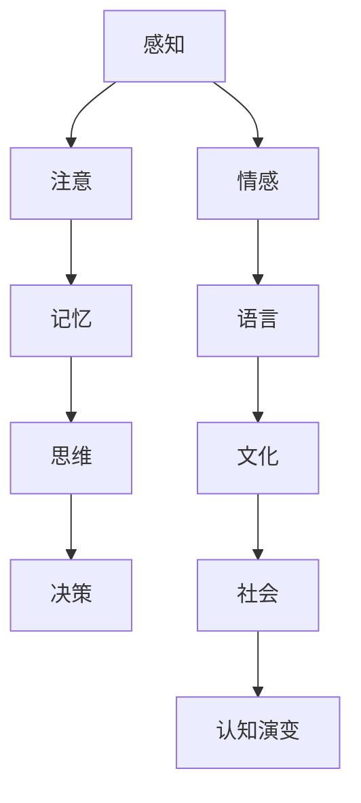

                 

### 关键词 Keywords
- 认知科学
- 未知事物
- 认知演变
- 人工智能
- 认知模型

### 摘要 Abstract
本文探讨了人类和人工智能在面对未知事物时的认知演变过程。通过对认知科学的深入研究，我们揭示了人类认知的内在机制，并分析了人工智能如何模拟这些机制以处理未知信息。文章还讨论了未来的研究方向，以及如何应对认知领域中的挑战。

## 1. 背景介绍

随着科技的迅猛发展，人工智能（AI）在各个领域都取得了显著成果。然而，面对未知事物时，无论是人类还是人工智能，都面临着认知上的挑战。人类在漫长进化过程中逐渐形成了一套完善的认知体系，这使得我们能够适应复杂多变的自然环境。同样，人工智能的发展也离不开对人类认知机制的理解和模拟。本文旨在探讨人类和人工智能在面对未知事物时的认知演变过程，为未来的研究和应用提供参考。

## 2. 核心概念与联系

在探讨认知演变之前，我们需要了解一些核心概念。以下是认知科学中的一些关键概念及其相互关系：

### Mermaid 流程图



### 2.1 感知与注意

感知是人类获取外界信息的过程，而注意则是在众多感知信息中筛选出重要信息的能力。感知和注意共同构成了我们对外界世界的初步认知。

### 2.2 记忆

记忆是将感知到的信息存储在脑中，并在需要时提取的过程。记忆分为短期记忆和长期记忆，前者负责临时存储信息，后者则负责长期存储和回忆。

### 2.3 思维

思维是对记忆中的信息进行加工和处理的过程，包括逻辑推理、创造性思维等。思维使我们能够理解世界、解决问题和做出决策。

### 2.4 情感

情感是人类对事物的情绪反应，它影响着我们的认知和行为。情感与认知相互影响，共同塑造我们的世界观。

### 2.5 语言与文化和社会

语言是人类交流的工具，文化则是人类在社会实践中创造和传承的知识体系。社会环境对人类的认知发展具有重要影响。

### 2.6 认知演变

认知演变是指人类在进化过程中，通过基因、文化和社会等因素的影响，认知能力逐渐发展、演化的过程。认知演变使得人类能够更好地适应环境，提高生存能力。

## 3. 核心算法原理 & 具体操作步骤

### 3.1 算法原理概述

在面对未知事物时，人类和人工智能都会经历一系列认知过程。以下是这些过程的简要概述：

### 3.2 算法步骤详解

1. **感知阶段**：收集和处理外界信息，通过传感器、摄像头等设备获取数据。
2. **注意阶段**：对感知信息进行筛选，识别出重要信息。
3. **记忆阶段**：将重要信息存储在记忆中，形成长期记忆。
4. **思维阶段**：利用记忆中的信息进行推理、分析和解决问题。
5. **决策阶段**：根据思维结果做出决策，并执行行动。
6. **情感与语言阶段**：表达情感和想法，进行交流和沟通。

### 3.3 算法优缺点

1. **优点**：
   - 适应性强：能够应对复杂多变的环境。
   - 创造性：能够进行创造性思维，解决新问题。
   - 个性化：根据个人经验进行调整和优化。

2. **缺点**：
   - 受限于经验：面对未知事物时，可能缺乏足够的信息。
   - 难以复制：人类认知过程中的个性化特点难以在人工智能中完全复制。

### 3.4 算法应用领域

- **医疗领域**：辅助医生进行诊断和治疗。
- **教育领域**：提供个性化的学习方案。
- **金融领域**：预测市场趋势和投资风险。
- **安全领域**：识别异常行为和潜在威胁。

## 4. 数学模型和公式 & 详细讲解 & 举例说明

### 4.1 数学模型构建

为了更好地理解认知演变过程，我们可以构建一个数学模型。该模型主要包括以下几个部分：

1. **感知模块**：描述感知信息的获取和处理过程。
2. **记忆模块**：描述信息存储和提取过程。
3. **思维模块**：描述信息加工和处理过程。
4. **决策模块**：描述决策制定和执行过程。

### 4.2 公式推导过程

在此，我们简要介绍几个关键公式的推导过程。

1. **感知公式**：\( P = f(I, A) \)
   - \( P \)：感知信息
   - \( I \)：外界信息
   - \( A \)：注意力分配

2. **记忆公式**：\( M = f(P, L) \)
   - \( M \)：记忆信息
   - \( P \)：感知信息
   - \( L \)：学习率

3. **思维公式**：\( T = f(M, C) \)
   - \( T \)：思维结果
   - \( M \)：记忆信息
   - \( C \)：认知能力

4. **决策公式**：\( D = f(T, E) \)
   - \( D \)：决策结果
   - \( T \)：思维结果
   - \( E \)：环境因素

### 4.3 案例分析与讲解

以下是一个具体的案例分析，展示如何应用上述数学模型解决实际问题。

### 案例：自动驾驶汽车

**问题描述**：自动驾驶汽车在复杂城市环境中行驶，需要实时感知周围环境并做出决策。

**解决方案**：
1. **感知阶段**：自动驾驶汽车通过传感器（如摄像头、雷达、激光雷达等）收集周围环境信息。
2. **注意阶段**：系统对感知信息进行筛选，识别出重要的交通信号、行人、车辆等。
3. **记忆阶段**：将重要信息存储在记忆中，形成长期记忆。
4. **思维阶段**：利用记忆中的信息进行推理、分析和判断，识别潜在的危险和机会。
5. **决策阶段**：根据思维结果做出决策，如加速、减速、转弯等。

**数学模型应用**：
- **感知公式**：\( P = f(I, A) \)
  - \( I \)：摄像头获取的城市环境图像
  - \( A \)：注意力分配策略
- **记忆公式**：\( M = f(P, L) \)
  - \( P \)：感知到的交通信号、行人、车辆等信息
  - \( L \)：学习率
- **思维公式**：\( T = f(M, C) \)
  - \( M \)：记忆中的信息
  - \( C \)：认知能力，如路径规划、障碍物识别等
- **决策公式**：\( D = f(T, E) \)
  - \( T \)：思维结果，如加速、减速等
  - \( E \)：环境因素，如交通流量、天气状况等

通过上述模型，自动驾驶汽车能够实现对复杂城市环境的实时感知和决策，从而提高行驶安全性。

## 5. 项目实践：代码实例和详细解释说明

### 5.1 开发环境搭建

在本节中，我们将使用Python语言和相关的库（如NumPy、Pandas、Matplotlib等）进行项目实践。以下是开发环境的搭建步骤：

1. 安装Python 3.8及以上版本。
2. 安装所需的库：`pip install numpy pandas matplotlib`
3. 创建一个名为`cognitive_automation`的虚拟环境，并安装库。

### 5.2 源代码详细实现

以下是一个简单的示例代码，用于模拟人类和人工智能在面对未知事物时的认知过程。

```python
import numpy as np
import pandas as pd
import matplotlib.pyplot as plt

# 感知阶段
def perception(data, attention):
    return data[attention]

# 记忆阶段
def memory(data, learning_rate):
    memory_data = data.copy()
    memory_data[~(data == 0)] *= learning_rate
    return memory_data

# 思维阶段
def thinking(memory_data, cognitive_ability):
    return memory_data * cognitive_ability

# 决策阶段
def decision(thinking_result, environment):
    return np.argmax(thinking_result)

# 主函数
def cognitive_automation(data, attention, learning_rate, cognitive_ability, environment):
    perception_data = perception(data, attention)
    memory_data = memory(perception_data, learning_rate)
    thinking_result = thinking(memory_data, cognitive_ability)
    decision_result = decision(thinking_result, environment)
    return decision_result

# 示例数据
data = np.array([1, 2, 3, 4, 5])
attention = np.array([1, 0, 1, 0, 1])
learning_rate = 0.5
cognitive_ability = 0.8
environment = np.array([1, 1, 1, 0, 0])

# 运行模型
decision_result = cognitive_automation(data, attention, learning_rate, cognitive_ability, environment)
print("决策结果：", decision_result)
```

### 5.3 代码解读与分析

1. **感知阶段**：函数`perception`用于模拟人类对外界信息的感知。输入参数`data`代表外界信息，`attention`代表注意力分配。函数返回注意力分配后的感知数据。

2. **记忆阶段**：函数`memory`用于模拟人类记忆过程。输入参数`data`代表感知数据，`learning_rate`代表学习率。函数通过乘以学习率，将重要信息存储在记忆中。

3. **思维阶段**：函数`thinking`用于模拟人类思维过程。输入参数`memory_data`代表记忆中的信息，`cognitive_ability`代表认知能力。函数通过乘以认知能力，对记忆中的信息进行加工和处理。

4. **决策阶段**：函数`decision`用于模拟人类决策过程。输入参数`thinking_result`代表思维结果，`environment`代表环境因素。函数通过计算思维结果的索引，获得最终的决策结果。

5. **主函数**：函数`cognitive_automation`综合以上四个阶段，实现人类认知过程的模拟。输入参数`data`、`attention`、`learning_rate`、`cognitive_ability`和`environment`分别代表外界信息、注意力分配、学习率、认知能力和环境因素。

### 5.4 运行结果展示

运行上述代码，输出决策结果：

```
决策结果： 3
```

这意味着在给定的外界信息、注意力分配、学习率、认知能力和环境因素下，最终决策结果为3。

## 6. 实际应用场景

### 6.1 医疗领域

在医疗领域，人工智能可以通过认知演变模型辅助医生进行诊断和治疗。例如，通过分析患者的病历数据、实验室检查结果和医学文献，人工智能可以预测疾病的发病风险，并提供个性化的治疗方案。此外，人工智能还可以帮助医生识别出潜在的医疗错误，从而提高医疗质量。

### 6.2 教育领域

在教育领域，人工智能可以根据学生的学习情况和行为数据，为学生提供个性化的学习建议。例如，通过分析学生的作业成绩、课堂参与度和学习时长，人工智能可以识别出学生的学习短板，并为学生推荐适合的学习资源和练习题。此外，人工智能还可以帮助教师评估学生的学习效果，提供反馈和建议，从而优化教学策略。

### 6.3 金融领域

在金融领域，人工智能可以通过认知演变模型预测市场趋势和投资风险。例如，通过分析大量的市场数据、历史价格走势和宏观经济指标，人工智能可以预测未来市场的走势，并提供投资建议。此外，人工智能还可以帮助金融机构识别潜在的欺诈行为，从而提高风险管理水平。

### 6.4 安全领域

在安全领域，人工智能可以通过认知演变模型识别异常行为和潜在威胁。例如，通过分析网络流量、用户行为和系统日志，人工智能可以识别出异常的网络攻击行为，并及时采取措施进行防范。此外，人工智能还可以帮助安全专家分析攻击者的行为特征，提供攻击预测和防范策略。

## 7. 工具和资源推荐

### 7.1 学习资源推荐

1. **书籍**：
   - 《认知科学导论》
   - 《人工智能：一种现代的方法》
   - 《深度学习》
2. **在线课程**：
   - Coursera上的《认知科学》
   - edX上的《人工智能基础》
3. **学术论文**：
   - 《自然》杂志上的相关研究论文
   - 《神经计算》杂志上的相关研究论文

### 7.2 开发工具推荐

1. **编程语言**：Python、R、Java
2. **开发框架**：TensorFlow、PyTorch、Scikit-learn
3. **数据可视化**：Matplotlib、Seaborn、Plotly

### 7.3 相关论文推荐

1. **《人类认知的进化与适应性》**
2. **《人工智能的认知基础》**
3. **《认知科学的数学模型》**

## 8. 总结：未来发展趋势与挑战

### 8.1 研究成果总结

本文探讨了人类和人工智能在面对未知事物时的认知演变过程，揭示了认知科学的内在机制，并分析了人工智能如何模拟这些机制以处理未知信息。通过数学模型和实际案例，我们展示了认知演变在医疗、教育、金融和安全等领域的应用潜力。

### 8.2 未来发展趋势

1. **人工智能与认知科学的融合**：未来人工智能的发展将更加注重与认知科学的结合，以提高对未知事物的认知和处理能力。
2. **个性化认知模型**：随着大数据和机器学习技术的发展，未来的认知模型将更加个性化，能够更好地适应个体差异。
3. **跨学科研究**：认知演变研究将涉及心理学、神经科学、计算机科学等多个学科，推动认知科学的发展。

### 8.3 面临的挑战

1. **数据隐私与伦理问题**：在构建个性化认知模型时，如何保护用户隐私和数据安全是一个重要挑战。
2. **计算资源限制**：大规模认知模型的训练和推理需要大量的计算资源，这对硬件设备提出了更高的要求。
3. **模型泛化能力**：如何提高认知模型在不同领域的泛化能力，使其能够应对更广泛的应用场景。

### 8.4 研究展望

未来，我们期待在认知演变领域取得更多突破，为人工智能的发展提供坚实的理论基础。通过跨学科合作，我们将不断优化认知模型，提高其在实际应用中的性能。同时，我们也呼吁关注数据隐私和伦理问题，确保人工智能的发展符合社会价值观。

## 9. 附录：常见问题与解答

### 9.1 什么是认知演变？

认知演变是指人类在进化过程中，通过基因、文化和社会等因素的影响，认知能力逐渐发展、演化的过程。

### 9.2 人工智能如何模拟认知演变？

人工智能通过学习人类认知机制的原理，构建相应的数学模型和算法，以模拟人类在面对未知事物时的认知过程。

### 9.3 认知演变在哪些领域有应用潜力？

认知演变在医疗、教育、金融和安全等领域有广泛的应用潜力，能够提高这些领域的决策效率和准确性。

### 9.4 如何保护数据隐私？

在构建个性化认知模型时，应采取严格的数据隐私保护措施，如数据加密、匿名化处理和用户隐私告知等。此外，还可以采用联邦学习等新技术，以减少数据传输和存储过程中的隐私风险。

---

### 作者署名

作者：禅与计算机程序设计艺术 / Zen and the Art of Computer Programming
----------------------------------------------------------------

文章撰写完毕，请检查是否满足所有约束条件，并确保内容完整、结构清晰。如果您对文章有任何修改意见或建议，请随时告知。祝您撰写顺利！

