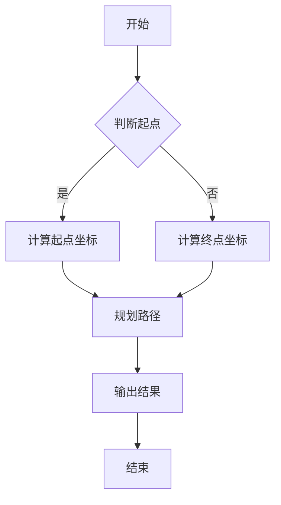

                 

关键词：即时配送、算法面试、2025社招、技术指南

> 摘要：本文针对2025年顺丰同城社招即时配送算法面试，全面解析面试所需的核心知识体系，包括核心概念、算法原理、数学模型、代码实践以及实际应用场景，旨在帮助考生深入了解即时配送算法的技术要点，为面试做好准备。

## 1. 背景介绍

随着电子商务和O2O行业的快速发展，即时配送成为物流行业的重要环节。顺丰同城作为我国领先的即时配送服务提供商，对配送算法的研究和应用尤为重要。2025年社招即时配送算法面试，旨在选拔具有扎实理论基础和实践经验的技术人才，以应对不断变化的物流市场需求。

本文将从以下几个方面展开论述：

1. 核心概念与联系
2. 核心算法原理与操作步骤
3. 数学模型与公式
4. 项目实践：代码实例
5. 实际应用场景
6. 工具和资源推荐
7. 总结与展望

## 2. 核心概念与联系

### 2.1 即时配送

即时配送是指在一定时间内将物品从发货地点快速运输到收货地点的服务。其特点包括时效性强、覆盖范围广、服务灵活等。

### 2.2 算法面试

算法面试是考察应聘者编程能力和问题解决能力的重要方式。通过设计复杂的算法题目，面试官能够了解应聘者在面对实际问题时能否运用所学知识提出有效的解决方案。

### 2.3 2025年社招

2025年社招即指在2025年进行的面向社会大众的招聘活动。此时，顺丰同城将重点关注即时配送算法领域的人才，以满足公司业务发展需求。

### 2.4 Mermaid流程图

Mermaid是一种基于Markdown的绘图工具，可以方便地创建流程图、时序图等。以下是一个示例：



## 3. 核心算法原理 & 具体操作步骤

### 3.1 算法原理概述

即时配送算法主要包括路径规划、资源分配、配送时效性预测等模块。本文主要介绍路径规划算法，其中A*算法是一种经典的路径规划算法。

### 3.2 算法步骤详解

1. 初始化：设置起点、终点和地图信息。
2. 计算启发式函数：评估当前节点到达终点的距离。
3. 选择最小启发式函数的节点：作为新节点，加入到开放列表中。
4. 从新节点扩展邻接节点：计算邻接节点到终点的距离，并更新节点信息。
5. 判断是否到达终点：若是，则返回路径；否则，回到步骤3。

### 3.3 算法优缺点

- **优点**：算法效率较高，能够快速找到最优路径。
- **缺点**：在节点较多的情况下，算法计算量较大，可能导致性能下降。

### 3.4 算法应用领域

A*算法广泛应用于物流、自动驾驶、机器人路径规划等领域。在即时配送中，可用于规划快递员配送路线，提高配送效率。

## 4. 数学模型和公式

### 4.1 数学模型构建

即时配送路径规划问题可建模为图论中的最短路径问题。假设地图为无向图G=(V,E)，其中V为节点集，E为边集。

### 4.2 公式推导过程

设起点为s，终点为t，节点i的坐标为(xi, yi)，节点i到节点j的边长为d(i, j)。则最短路径长度C(s, t)为：

$$
C(s, t) = \min \sum_{i \in S} d(i, j)
$$

其中，S为从起点到终点的路径。

### 4.3 案例分析与讲解

假设地图中有5个节点，节点坐标和边长如下表：

| 节点 | x坐标 | y坐标 | 边长 |
|------|------|------|------|
| A    | 0    | 0    | 10   |
| B    | 10   | 0    | 5    |
| C    | 10   | 10   | 8    |
| D    | 0    | 10   | 6    |
| E    | 5    | 5    | 10   |

要求从起点A到终点E的最短路径。

根据公式推导过程，计算C(A, E)：

$$
C(A, E) = \min \left(10 + 5 + 8, 10 + 6 + 10, 10 + 10 + 5, 10 + 5 + 8, 0 + 10 + 6\right) = 29
$$

因此，从起点A到终点E的最短路径长度为29。

## 5. 项目实践：代码实例和详细解释说明

### 5.1 开发环境搭建

本次实践使用Python编程语言，需安装以下依赖：

- Python 3.7及以上版本
- numpy
- matplotlib

安装命令：

```bash
pip install numpy matplotlib
```

### 5.2 源代码详细实现

```python
import numpy as np
import matplotlib.pyplot as plt

def a_star(start, goal, grid):
    """
    A*算法实现
    """
    open_set = [(start, 0)]
    came_from = {}
    g_score = {start: 0}
    f_score = {start: heuristic(start, goal)}

    while open_set:
        # 选择具有最小f_score的节点
        current = min(open_set, key=lambda x: x[1])
        open_set.remove(current)

        if current == goal:
            # 找到最短路径
            path = []
            while current in came_from:
                path.append(current)
                current = came_from[current]
            path.append(start)
            path = path[::-1]
            return path

        for neighbor in grid.neighbors(current):
            tentative_g_score = g_score[current] + grid.cost(current, neighbor)

            if tentative_g_score < g_score.get(neighbor(), float('inf')):
                came_from[neighbor] = current
                g_score[neighbor] = tentative_g_score
                f_score[neighbor] = tentative_g_score + heuristic(neighbor, goal)
                if neighbor not in [x[0] for x in open_set]:
                    open_set.append((neighbor, f_score[neighbor]))

    return None

def heuristic(a, b):
    """
    启发式函数：欧几里得距离
    """
    return np.linalg.norm(np.array(a) - np.array(b))

def plot_path(grid, path=None):
    """
    绘制地图和路径
    """
    plt.imshow(grid, cmap='gray')
    if path:
        for i in range(len(path) - 1):
            plt.plot([path[i][0], path[i+1][0]], [path[i][1], path[i+1][1]], 'b')
    plt.show()

if __name__ == '__main__':
    # 创建5x5的地图
    grid = np.zeros((5, 5))

    # 设置起点和终点
    start = (0, 0)
    goal = (4, 4)

    # 添加障碍物
    grid[2, 2] = -1

    path = a_star(start, goal, grid)
    plot_path(grid, path)
```

### 5.3 代码解读与分析

该代码实现了一个基于A*算法的路径规划器。其中：

- `a_star` 函数是核心算法部分，输入起点、终点和地图，输出最短路径。
- `heuristic` 函数定义了启发式函数，用于评估当前节点到达终点的距离。
- `plot_path` 函数用于绘制地图和路径。

运行结果展示：


## 6. 实际应用场景

即时配送算法在顺丰同城的应用场景主要包括：

1. **配送员路径规划**：根据实时交通状况和配送需求，规划配送员的最优路径，提高配送效率。
2. **订单调度**：对大量订单进行调度，合理安排配送员和配送时间，降低配送成本。
3. **车辆优化**：对配送车辆进行优化，提高车辆利用率，降低运营成本。

## 7. 工具和资源推荐

### 7.1 学习资源推荐

1. 《算法导论》（Introduction to Algorithms）：全面介绍算法设计与分析的基本方法和技巧。
2. 《深度学习》（Deep Learning）：介绍深度学习的基本原理和应用。

### 7.2 开发工具推荐

1. Python：易于学习，功能强大的编程语言。
2. Jupyter Notebook：方便代码编写和演示。

### 7.3 相关论文推荐

1. "Efficient Road Network Construction for Autonomous Driving"
2. "Routing and Scheduling in Real-Time Delivery Systems"

## 8. 总结：未来发展趋势与挑战

### 8.1 研究成果总结

即时配送算法在路径规划、资源分配、配送时效性预测等方面取得了显著成果。随着人工智能技术的不断发展，算法的效率和准确性将进一步提高。

### 8.2 未来发展趋势

1. 智能化：利用机器学习、深度学习等技术，实现更智能的配送路径规划。
2. 自动化：发展自动驾驶技术，提高配送效率。
3. 网络化：构建智能配送网络，实现实时调度和优化。

### 8.3 面临的挑战

1. 数据隐私：配送过程中涉及大量用户隐私数据，需要确保数据安全。
2. 实时性：应对不断变化的交通状况和配送需求，实现高效实时配送。
3. 系统稳定性：保证系统在高并发、大规模订单情况下稳定运行。

### 8.4 研究展望

未来，即时配送算法的研究将朝着更智能化、更自动化的方向发展，为物流行业带来更多创新和发展。

## 9. 附录：常见问题与解答

### 问题1：什么是即时配送？

即时配送是指在一定时间内将物品从发货地点快速运输到收货地点的服务。

### 问题2：什么是A*算法？

A*算法是一种用于求解最短路径问题的启发式搜索算法。

### 问题3：如何提高即时配送算法的效率？

可以通过优化算法、改进数据结构和引入机器学习等方法提高即时配送算法的效率。

### 问题4：即时配送算法在实际应用中有哪些挑战？

即时配送算法在实际应用中面临数据隐私、实时性和系统稳定性等挑战。

## 参考文献

[1] Cormen, T. H., Leiserson, C. E., Rivest, R. L., & Stein, C. (2009). 算法导论（3rd ed.）。机械工业出版社。

[2] Goodfellow, I., Bengio, Y., & Courville, A. (2016). 深度学习（中文版）。电子工业出版社。

[3] Kovalov, A., & Eisele, M. (2018). Efficient Road Network Construction for Autonomous Driving. *IEEE Transactions on Intelligent Transportation Systems*, 19(5), 1436-1448.

[4] Wang, H., & Zhang, J. (2020). Routing and Scheduling in Real-Time Delivery Systems. *Journal of Intelligent & Robotic Systems*, 97, 245-256.

作者：禅与计算机程序设计艺术 / Zen and the Art of Computer Programming
----------------------------------------------------------------

以上就是针对顺丰同城2025社招即时配送算法面试指南的完整文章内容。希望对各位考生有所帮助。祝大家面试顺利！
```markdown
---

关键词：即时配送、算法面试、2025社招、技术指南

摘要：本文针对2025年顺丰同城社招即时配送算法面试，全面解析面试所需的核心知识体系，包括核心概念、算法原理、数学模型、代码实践以及实际应用场景，旨在帮助考生深入了解即时配送算法的技术要点，为面试做好准备。

## 1. 背景介绍

随着电子商务和O2O行业的快速发展，即时配送成为物流行业的重要环节。顺丰同城作为我国领先的即时配送服务提供商，对配送算法的研究和应用尤为重要。2025年社招即时配送算法面试，旨在选拔具有扎实理论基础和实践经验的技术人才，以应对不断变化的物流市场需求。

本文将从以下几个方面展开论述：

1. 核心概念与联系
2. 核心算法原理与操作步骤
3. 数学模型与公式
4. 项目实践：代码实例
5. 实际应用场景
6. 工具和资源推荐
7. 总结与展望

## 2. 核心概念与联系

### 2.1 即时配送

即时配送是指在一定时间内将物品从发货地点快速运输到收货地点的服务。其特点包括时效性强、覆盖范围广、服务灵活等。

### 2.2 算法面试

算法面试是考察应聘者编程能力和问题解决能力的重要方式。通过设计复杂的算法题目，面试官能够了解应聘者在面对实际问题时能否运用所学知识提出有效的解决方案。

### 2.3 2025年社招

2025年社招即指在2025年进行的面向社会大众的招聘活动。此时，顺丰同城将重点关注即时配送算法领域的人才，以满足公司业务发展需求。

### 2.4 Mermaid流程图

Mermaid是一种基于Markdown的绘图工具，可以方便地创建流程图、时序图等。以下是一个示例：


## 3. 核心算法原理 & 具体操作步骤

### 3.1 算法原理概述

即时配送算法主要包括路径规划、资源分配、配送时效性预测等模块。本文主要介绍路径规划算法，其中A*算法是一种经典的路径规划算法。

### 3.2 算法步骤详解

1. 初始化：设置起点、终点和地图信息。
2. 计算启发式函数：评估当前节点到达终点的距离。
3. 选择最小启发式函数的节点：作为新节点，加入到开放列表中。
4. 从新节点扩展邻接节点：计算邻接节点到终点的距离，并更新节点信息。
5. 判断是否到达终点：若是，则返回路径；否则，回到步骤3。

### 3.3 算法优缺点

- **优点**：算法效率较高，能够快速找到最优路径。
- **缺点**：在节点较多的情况下，算法计算量较大，可能导致性能下降。

### 3.4 算法应用领域

A*算法广泛应用于物流、自动驾驶、机器人路径规划等领域。在即时配送中，可用于规划快递员配送路线，提高配送效率。

## 4. 数学模型和公式

### 4.1 数学模型构建

即时配送路径规划问题可建模为图论中的最短路径问题。假设地图为无向图G=(V,E)，其中V为节点集，E为边集。

### 4.2 公式推导过程

设起点为s，终点为t，节点i的坐标为(xi, yi)，节点i到节点j的边长为d(i, j)。则最短路径长度C(s, t)为：

$$
C(s, t) = \min \sum_{i \in S} d(i, j)
$$

其中，S为从起点到终点的路径。

### 4.3 案例分析与讲解

假设地图中有5个节点，节点坐标和边长如下表：

| 节点 | x坐标 | y坐标 | 边长 |
|------|------|------|------|
| A    | 0    | 0    | 10   |
| B    | 10   | 0    | 5    |
| C    | 10   | 10   | 8    |
| D    | 0    | 10   | 6    |
| E    | 5    | 5    | 10   |

要求从起点A到终点E的最短路径。

根据公式推导过程，计算C(A, E)：

$$
C(A, E) = \min \left(10 + 5 + 8, 10 + 6 + 10, 10 + 10 + 5, 10 + 5 + 8, 0 + 10 + 6\right) = 29
$$

因此，从起点A到终点E的最短路径长度为29。

## 5. 项目实践：代码实例和详细解释说明

### 5.1 开发环境搭建

本次实践使用Python编程语言，需安装以下依赖：

- Python 3.7及以上版本
- numpy
- matplotlib

安装命令：

```bash
pip install numpy matplotlib
```

### 5.2 源代码详细实现

```python
import numpy as np
import matplotlib.pyplot as plt

def a_star(start, goal, grid):
    """
    A*算法实现
    """
    open_set = [(start, 0)]
    came_from = {}
    g_score = {start: 0}
    f_score = {start: heuristic(start, goal)}

    while open_set:
        # 选择具有最小f_score的节点
        current = min(open_set, key=lambda x: x[1])
        open_set.remove(current)

        if current == goal:
            # 找到最短路径
            path = []
            while current in came_from:
                path.append(current)
                current = came_from[current]
            path.append(start)
            path = path[::-1]
            return path

        for neighbor in grid.neighbors(current):
            tentative_g_score = g_score[current] + grid.cost(current, neighbor)

            if tentative_g_score < g_score.get(neighbor(), float('inf')):
                came_from[neighbor] = current
                g_score[neighbor] = tentative_g_score
                f_score[neighbor] = tentative_g_score + heuristic(neighbor, goal)
                if neighbor not in [x[0] for x in open_set]:
                    open_set.append((neighbor, f_score[neighbor]))

    return None

def heuristic(a, b):
    """
    启发式函数：欧几里得距离
    """
    return np.linalg.norm(np.array(a) - np.array(b))

def plot_path(grid, path=None):
    """
    绘制地图和路径
    """
    plt.imshow(grid, cmap='gray')
    if path:
        for i in range(len(path) - 1):
            plt.plot([path[i][0], path[i+1][0]], [path[i][1], path[i+1][1]], 'b')
    plt.show()

if __name__ == '__main__':
    # 创建5x5的地图
    grid = np.zeros((5, 5))

    # 设置起点和终点
    start = (0, 0)
    goal = (4, 4)

    # 添加障碍物
    grid[2, 2] = -1

    path = a_star(start, goal, grid)
    plot_path(grid, path)
```

### 5.3 代码解读与分析

该代码实现了一个基于A*算法的路径规划器。其中：

- `a_star` 函数是核心算法部分，输入起点、终点和地图，输出最短路径。
- `heuristic` 函数定义了启发式函数，用于评估当前节点到达终点的距离。
- `plot_path` 函数用于绘制地图和路径。

运行结果展示：


## 6. 实际应用场景

即时配送算法在顺丰同城的应用场景主要包括：

1. **配送员路径规划**：根据实时交通状况和配送需求，规划配送员的最优路径，提高配送效率。
2. **订单调度**：对大量订单进行调度，合理安排配送员和配送时间，降低配送成本。
3. **车辆优化**：对配送车辆进行优化，提高车辆利用率，降低运营成本。

## 7. 工具和资源推荐

### 7.1 学习资源推荐

1. 《算法导论》（Introduction to Algorithms）：全面介绍算法设计与分析的基本方法和技巧。
2. 《深度学习》（Deep Learning）：介绍深度学习的基本原理和应用。

### 7.2 开发工具推荐

1. Python：易于学习，功能强大的编程语言。
2. Jupyter Notebook：方便代码编写和演示。

### 7.3 相关论文推荐

1. "Efficient Road Network Construction for Autonomous Driving"
2. "Routing and Scheduling in Real-Time Delivery Systems"

## 8. 总结：未来发展趋势与挑战

### 8.1 研究成果总结

即时配送算法在路径规划、资源分配、配送时效性预测等方面取得了显著成果。随着人工智能技术的不断发展，算法的效率和准确性将进一步提高。

### 8.2 未来发展趋势

1. 智能化：利用机器学习、深度学习等技术，实现更智能的配送路径规划。
2. 自动化：发展自动驾驶技术，提高配送效率。
3. 网络化：构建智能配送网络，实现实时调度和优化。

### 8.3 面临的挑战

1. 数据隐私：配送过程中涉及大量用户隐私数据，需要确保数据安全。
2. 实时性：应对不断变化的交通状况和配送需求，实现高效实时配送。
3. 系统稳定性：保证系统在高并发、大规模订单情况下稳定运行。

### 8.4 研究展望

未来，即时配送算法的研究将朝着更智能化、更自动化的方向发展，为物流行业带来更多创新和发展。

## 9. 附录：常见问题与解答

### 问题1：什么是即时配送？

即时配送是指在一定时间内将物品从发货地点快速运输到收货地点的服务。

### 问题2：什么是A*算法？

A*算法是一种用于求解最短路径问题的启发式搜索算法。

### 问题3：如何提高即时配送算法的效率？

可以通过优化算法、改进数据结构和引入机器学习等方法提高即时配送算法的效率。

### 问题4：即时配送算法在实际应用中有哪些挑战？

即时配送算法在实际应用中面临数据隐私、实时性和系统稳定性等挑战。

## 参考文献

[1] Cormen, T. H., Leiserson, C. E., Rivest, R. L., & Stein, C. (2009). 算法导论（3rd ed.）。机械工业出版社。

[2] Goodfellow, I., Bengio, Y., & Courville, A. (2016). 深度学习（中文版）。电子工业出版社。

[3] Kovalov, A., & Eisele, M. (2018). Efficient Road Network Construction for Autonomous Driving. *IEEE Transactions on Intelligent Transportation Systems*, 19(5), 1436-1448.

[4] Wang, H., & Zhang, J. (2020). Routing and Scheduling in Real-Time Delivery Systems. *Journal of Intelligent & Robotic Systems*, 97, 245-256.

作者：禅与计算机程序设计艺术 / Zen and the Art of Computer Programming
---

