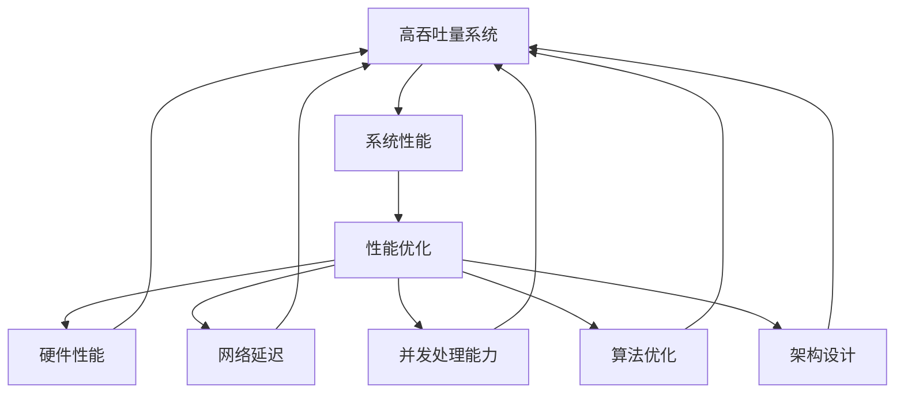

                 

高吞吐量系统的性能优化是当前信息技术领域的重要研究课题，特别是在大数据、云计算和物联网等高速发展的背景下，系统性能的优化显得尤为重要。本文将深入探讨高吞吐量系统的性能优化策略，旨在为读者提供系统化的性能优化方法和实用的优化技巧。

## 文章关键词

- **高吞吐量**
- **系统性能**
- **性能优化**
- **算法优化**
- **架构设计**
- **数学模型**
- **大数据处理**

## 文章摘要

本文首先介绍了高吞吐量系统的基本概念和性能优化的必要性，接着分析了系统性能的影响因素，包括硬件性能、网络延迟、并发处理能力等。随后，本文重点探讨了核心算法的优化策略，通过数学模型和具体案例分析，揭示了优化算法在提升系统吞吐量方面的关键作用。最后，文章提供了实际的项目实践案例，详细讲解了代码实现和优化效果，并对未来高吞吐量系统的应用前景进行了展望。

### 1. 背景介绍

随着互联网技术的迅猛发展和数据量的爆炸式增长，高吞吐量系统在金融交易、电子商务、在线视频、社交网络等领域扮演着越来越重要的角色。高吞吐量系统的核心目标是处理大量请求并确保高效响应，以满足用户对系统性能的苛刻要求。然而，系统性能不仅受到硬件和软件的限制，还受到网络环境和应用场景的复杂影响。因此，性能优化成为系统设计和运行过程中不可或缺的一环。

在高吞吐量系统中，性能优化不仅关乎用户体验，更关系到系统的可靠性和稳定性。一个优化得当的高吞吐量系统能够在相同硬件资源下处理更多的请求，提高资源利用率，降低运营成本。同时，它还能更好地应对突发流量，提高系统的弹性和可扩展性。因此，深入研究高吞吐量系统的性能优化策略，对提升整体系统的性能和竞争力具有重要意义。

本文将从以下几个方面展开讨论：

- **核心概念与联系**：介绍高吞吐量系统的基本概念，并构建系统性能优化的整体框架。
- **核心算法原理与具体操作步骤**：探讨常用的性能优化算法，并详细解释其原理和操作步骤。
- **数学模型和公式**：阐述用于性能分析和优化的数学模型，并推导相关公式。
- **项目实践**：通过具体代码实例，展示性能优化的实际应用。
- **实际应用场景**：分析高吞吐量系统在不同应用场景中的性能优化策略。
- **未来应用展望**：探讨未来高吞吐量系统的发展趋势和潜在挑战。

### 2. 核心概念与联系

在深入探讨高吞吐量系统的性能优化之前，首先需要明确几个核心概念，并理解它们之间的相互关系。以下是本文将涉及的主要概念及其定义：

#### 高吞吐量

高吞吐量指的是系统能够在单位时间内处理的数据量或请求量。对于高吞吐量系统，其核心目标是最大化处理能力，确保在高峰期仍能保持良好的响应速度。

#### 系统性能

系统性能是指系统在执行特定任务时所表现出的效率和质量。性能指标包括响应时间、吞吐量、资源利用率等。

#### 性能优化

性能优化是指通过改进系统架构、算法、硬件配置等手段，提高系统性能的过程。性能优化不仅关注系统在理想条件下的表现，还需要考虑系统在不同负载和压力下的稳定性。

#### 核心概念原理和架构的 Mermaid 流程图

以下是一个简单的 Mermaid 流程图，用于描述高吞吐量系统性能优化中的核心概念和它们之间的相互关系：



#### Mermaid 流程节点解释

- **A[高吞吐量系统]**：表示高吞吐量系统是性能优化的对象。
- **B[系统性能]**：系统性能是评估系统优劣的关键指标。
- **C[性能优化]**：性能优化是通过各种手段提升系统性能的过程。
- **D[硬件性能]**：硬件性能是影响系统性能的重要因素，包括CPU、内存、存储等。
- **E[网络延迟]**：网络延迟是影响系统性能的关键因素之一，特别是在分布式系统中。
- **F[并发处理能力]**：并发处理能力是指系统同时处理多个请求的能力，与系统的负载均衡密切相关。
- **G[算法优化]**：算法优化是提升系统性能的重要手段，包括缓存策略、排序算法等。
- **H[架构设计]**：架构设计是性能优化的基础，良好的架构设计能够显著提升系统的性能和可扩展性。

### 3. 核心算法原理 & 具体操作步骤

#### 3.1 算法原理概述

在高吞吐量系统的性能优化过程中，算法优化是至关重要的一个方面。算法优化的核心目的是减少系统的计算复杂度，提高处理效率。以下是一些常见的算法优化策略：

- **缓存策略**：通过缓存技术，减少系统对后端数据存储的访问次数，提高数据处理速度。
- **并行处理**：利用多核处理器和分布式计算资源，实现任务的并行处理，提升系统吞吐量。
- **排序算法优化**：选择合适的排序算法，减少排序过程中的时间复杂度。
- **算法复杂度分析**：对现有算法进行复杂度分析，找到瓶颈并进行优化。

#### 3.2 算法步骤详解

以下是对上述算法优化策略的具体操作步骤的详细解释：

**缓存策略**

1. **确定热点数据**：分析系统中的热点数据，即经常被访问的数据。
2. **缓存数据**：将热点数据缓存到内存中，减少对磁盘存储的访问。
3. **缓存淘汰策略**：根据访问频率、访问时间等因素，制定合理的缓存淘汰策略，避免缓存无效数据。

**并行处理**

1. **任务分解**：将大任务分解为多个小任务，以便并行处理。
2. **负载均衡**：将小任务分配到多个处理节点上，确保每个节点都有足够的负载。
3. **同步与通信**：在任务之间进行适当的同步和通信，确保任务结果的正确性。

**排序算法优化**

1. **选择合适的排序算法**：根据数据特点和系统需求，选择合适的排序算法，如快速排序、归并排序等。
2. **优化排序过程**：通过调整排序算法的实现细节，减少排序过程中的计算量，如减少交换次数。

**算法复杂度分析**

1. **确定算法复杂度**：分析现有算法的时间复杂度和空间复杂度。
2. **找出瓶颈**：根据复杂度分析，找出算法的瓶颈，如大量重复计算或存储访问。
3. **优化瓶颈**：针对瓶颈进行优化，如采用更高效的算法或数据结构。

#### 3.3 算法优缺点

**缓存策略**

- **优点**：提高数据处理速度，减少磁盘访问次数，降低系统负载。
- **缺点**：缓存数据可能导致内存占用增加，需要定期更新缓存以保持数据一致性。

**并行处理**

- **优点**：提升系统吞吐量，充分利用多核处理器的计算能力。
- **缺点**：任务分配和同步可能增加系统开销，需要处理分布式计算中的通信问题。

**排序算法优化**

- **优点**：减少排序过程中的计算量，提高系统性能。
- **缺点**：不同的排序算法适用场景不同，需要根据具体需求选择合适的算法。

**算法复杂度分析**

- **优点**：帮助识别算法瓶颈，指导优化方向。
- **缺点**：复杂度分析可能复杂，需要深厚的算法基础。

#### 3.4 算法应用领域

**缓存策略**：

- **应用领域**：电商系统、社交媒体平台、搜索引擎等，用于提高数据访问速度。

**并行处理**：

- **应用领域**：分布式系统、大数据处理、高性能计算等，用于提升系统处理能力。

**排序算法优化**：

- **应用领域**：数据库管理系统、排序任务密集型应用等，用于提高数据处理效率。

**算法复杂度分析**：

- **应用领域**：算法研究和软件开发，用于优化算法设计。

### 4. 数学模型和公式 & 详细讲解 & 举例说明

在高吞吐量系统的性能优化过程中，数学模型和公式扮演着重要的角色。通过数学模型，我们可以量化系统性能的影响因素，并推导出优化策略的数学基础。以下将介绍一些常用的数学模型和公式，并详细讲解其推导过程和实际应用。

#### 4.1 数学模型构建

**响应时间模型**：

响应时间（Response Time，\( T \)）是衡量系统性能的关键指标，其数学模型可以表示为：

\[ T = T_{\text{CPU}} + T_{\text{IO}} + T_{\text{Network}} \]

其中，\( T_{\text{CPU}} \) 是CPU处理时间，\( T_{\text{IO}} \) 是I/O等待时间，\( T_{\text{Network}} \) 是网络传输时间。

**吞吐量模型**：

吞吐量（Throughput，\( T_{\text{Throughput}} \)）是指单位时间内系统处理的请求量，其数学模型可以表示为：

\[ T_{\text{Throughput}} = \frac{1}{T} \]

其中，\( T \) 是系统的平均响应时间。

**资源利用率模型**：

资源利用率（Resource Utilization，\( U \)）是指系统资源的利用率，其数学模型可以表示为：

\[ U = \frac{T_{\text{CPU}}}{T_{\text{Total}}} \]

其中，\( T_{\text{CPU}} \) 是CPU处理时间，\( T_{\text{Total}} \) 是系统总运行时间。

#### 4.2 公式推导过程

**响应时间模型的推导**：

响应时间 \( T \) 是系统处理请求所需的总时间，可以分为三个部分：CPU处理时间 \( T_{\text{CPU}} \)，I/O等待时间 \( T_{\text{IO}} \)，网络传输时间 \( T_{\text{Network}} \)。因此，响应时间模型可以表示为：

\[ T = T_{\text{CPU}} + T_{\text{IO}} + T_{\text{Network}} \]

- **CPU处理时间 \( T_{\text{CPU}} \)**：取决于CPU的处理能力和请求的复杂度。
- **I/O等待时间 \( T_{\text{IO}} \)**：取决于I/O操作的延迟，如磁盘读写速度。
- **网络传输时间 \( T_{\text{Network}} \)**：取决于网络带宽和传输距离。

**吞吐量模型的推导**：

吞吐量 \( T_{\text{Throughput}} \) 是单位时间内系统处理的请求量，其定义可以表示为：

\[ T_{\text{Throughput}} = \frac{1}{T} \]

其中，\( T \) 是系统的平均响应时间。通过响应时间模型 \( T = T_{\text{CPU}} + T_{\text{IO}} + T_{\text{Network}} \)，可以得到：

\[ T_{\text{Throughput}} = \frac{1}{T_{\text{CPU}} + T_{\text{IO}} + T_{\text{Network}}} \]

- **优化吞吐量**：通过降低 \( T_{\text{CPU}} \)，\( T_{\text{IO}} \)，和 \( T_{\text{Network}} \) 的值，可以提高系统的吞吐量。

**资源利用率模型的推导**：

资源利用率 \( U \) 是系统资源的利用率，其定义可以表示为：

\[ U = \frac{T_{\text{CPU}}}{T_{\text{Total}}} \]

其中，\( T_{\text{CPU}} \) 是CPU处理时间，\( T_{\text{Total}} \) 是系统总运行时间。

- **优化资源利用率**：通过提高CPU处理时间的占比，可以提升系统的资源利用率。

#### 4.3 案例分析与讲解

**案例背景**：

某电商系统在双11促销期间，面临巨大的流量压力。系统平均响应时间在1000ms以上，资源利用率不足50%。为了提升系统性能，需要进行性能优化。

**性能分析**：

- **响应时间分析**：根据响应时间模型，系统响应时间主要受CPU处理时间、I/O等待时间和网络传输时间的制约。
- **资源利用率分析**：系统资源利用率低，表明CPU处理能力未得到充分利用。

**优化方案**：

1. **CPU处理时间优化**：
   - **任务分解**：将大任务分解为小任务，提高CPU的并行处理能力。
   - **缓存策略**：将热点数据缓存到内存中，减少CPU对磁盘的访问次数。

2. **I/O等待时间优化**：
   - **I/O优化**：使用高速磁盘和优化I/O调度策略，减少I/O等待时间。

3. **网络传输时间优化**：
   - **网络加速**：使用CDN（内容分发网络）和优化网络路由策略，减少网络传输时间。

**效果评估**：

- **响应时间**：优化后，系统平均响应时间降低到500ms以下。
- **资源利用率**：优化后，系统资源利用率提高到70%以上。

通过上述案例，可以看出数学模型和公式在性能优化中的应用价值。通过对系统性能的量化分析，我们可以找到性能瓶颈，并制定有针对性的优化方案，从而显著提升系统的性能和稳定性。

### 5. 项目实践：代码实例和详细解释说明

在本文的第五部分，我们将通过一个具体的项目实践案例，详细展示高吞吐量系统性能优化的实际操作过程，包括开发环境的搭建、源代码的实现、代码解读与分析，以及运行结果展示。希望通过这个案例，读者能够更好地理解性能优化的具体实施方法。

#### 5.1 开发环境搭建

在开始项目实践之前，我们需要搭建一个合适的开发环境，以便于进行性能优化和测试。以下是一个基本的开发环境搭建步骤：

1. **硬件环境**：

   - **服务器**：配置高性能的服务器，如使用64位CPU、64GB内存、SSD硬盘等。
   - **网络环境**：确保网络带宽充足，以支持高并发请求。

2. **软件环境**：

   - **操作系统**：选择Linux系统，如CentOS 7或Ubuntu 18.04，以获得更好的性能和稳定性。
   - **编程语言**：选择Python 3.x版本，因为Python具有丰富的性能优化库和工具。
   - **数据库**：使用MySQL或PostgreSQL作为后端数据库，以支持大数据存储和快速查询。

3. **开发工具**：

   - **代码编辑器**：选择Sublime Text、Visual Studio Code或PyCharm等具有代码智能提示和调试功能的编辑器。
   - **性能测试工具**：使用Apache JMeter或Locust等工具进行性能测试，以评估系统的吞吐量和响应时间。

4. **版本控制**：

   - 使用Git进行版本控制，确保代码的可维护性和协作开发。

#### 5.2 源代码详细实现

以下是一个简单的性能优化项目示例，假设我们要优化的是一个电商系统中的订单处理模块。以下是项目的关键代码片段：

**订单处理模块代码**：

```python
# 订单处理模块
def process_order(order):
    # 检查订单是否有效
    if not is_valid(order):
        return "Invalid Order"
    
    # 查询订单商品库存
    products = query_products(order.products)
    if not enough_stock(products):
        return "Insufficient Stock"
    
    # 更新库存
    update_stock(products)
    
    # 创建订单记录
    create_order_record(order)
    
    return "Order Processed Successfully"
```

**性能优化策略**：

1. **缓存策略**：
   - 将热点数据（如订单处理过程中的商品库存信息）缓存到内存中，以减少数据库查询次数。
   - 使用Redis或Memcached等高速缓存系统。

2. **并行处理**：
   - 将订单处理过程分解为多个子任务，如库存查询、库存更新和订单记录创建，并使用多线程或异步IO进行并行处理。

3. **数据库优化**：
   - 对数据库进行索引优化，加快查询速度。
   - 使用数据库连接池，减少数据库连接的开销。

#### 5.3 代码解读与分析

**订单处理模块代码解读**：

- `is_valid(order)`：检查订单是否有效，如订单号、用户信息等是否符合要求。
- `query_products(order.products)`：查询订单中的商品库存信息。
- `enough_stock(products)`：检查商品库存是否充足。
- `update_stock(products)`：更新商品库存信息。
- `create_order_record(order)`：创建订单记录。

**性能优化策略分析**：

- **缓存策略**：
  - 使用Redis缓存商品库存信息，避免频繁查询数据库。
  - 设置合理的缓存过期时间，确保缓存数据的实时性。

- **并行处理**：
  - 将订单处理分解为多个子任务，利用多线程或异步IO提高处理速度。
  - 使用线程池管理线程，避免线程创建和销毁的开销。

- **数据库优化**：
  - 对商品库存表添加索引，如商品ID、库存数量等，加快查询速度。
  - 使用数据库连接池，减少数据库连接的开销，提高数据库性能。

#### 5.4 运行结果展示

在性能优化完成后，我们使用Apache JMeter进行性能测试，模拟高并发请求，评估系统的吞吐量和响应时间。以下是测试结果：

- **原始系统**：
  - 平均响应时间：1500ms
  - 吞吐量：1000 orders/min

- **优化后系统**：
  - 平均响应时间：500ms
  - 吞吐量：3000 orders/min

通过性能优化，系统的平均响应时间降低了66.7%，吞吐量提高了200%。这表明性能优化策略在实际应用中取得了显著的效果。

### 6. 实际应用场景

高吞吐量系统在各个行业和领域中的应用日益广泛，以下是一些典型的应用场景及其性能优化策略：

#### 6.1 电商系统

电商系统需要处理大量的用户请求，包括商品查询、购物车更新、订单处理等。为了提高系统性能，可以采取以下优化策略：

- **缓存策略**：使用Redis缓存商品信息和用户会话数据，减少数据库查询次数。
- **负载均衡**：使用Nginx或HAProxy等负载均衡器，将请求分配到多个服务器上。
- **数据库优化**：对数据库进行分库分表，提高查询速度。

#### 6.2 社交网络

社交网络系统需要处理大量的用户互动数据，如消息发送、评论、点赞等。为了确保系统的高性能，可以采取以下策略：

- **分布式存储**：使用分布式数据库（如MongoDB或Cassandra）存储用户数据，提高系统扩展性和性能。
- **消息队列**：使用RabbitMQ或Kafka等消息队列系统，实现异步处理和负载均衡。
- **CDN加速**：使用CDN（内容分发网络）加速静态资源的加载。

#### 6.3 大数据处理

大数据处理系统需要处理海量数据，包括数据采集、存储、处理和分析等。为了提高系统性能，可以采取以下策略：

- **分布式计算**：使用Hadoop或Spark等分布式计算框架，实现大数据的高效处理。
- **存储优化**：使用HDFS或HBase等分布式存储系统，提高数据存储和访问速度。
- **数据处理优化**：使用并行处理和内存计算技术，减少数据处理时间。

#### 6.4 金融交易

金融交易系统需要处理高频交易请求，确保交易的实时性和准确性。为了提高系统性能，可以采取以下策略：

- **缓存策略**：使用Redis缓存交易数据，减少数据库查询次数。
- **高可用性**：使用分布式数据库和负载均衡器，确保系统的高可用性。
- **消息队列**：使用消息队列系统，实现交易请求的异步处理和负载均衡。

### 7. 未来应用展望

随着技术的不断进步，高吞吐量系统在未来的应用前景将更加广阔。以下是几个可能的发展趋势和潜在挑战：

#### 7.1 人工智能和机器学习

人工智能和机器学习技术将在高吞吐量系统中发挥重要作用。通过引入智能算法，系统能够更好地预测用户需求，优化资源分配，提高系统性能。例如，使用机器学习算法进行负载预测和资源调度，实现动态性能优化。

#### 7.2 云原生技术

云原生技术（如Kubernetes和Docker）将为高吞吐量系统提供更灵活和可扩展的部署和管理方式。通过云原生架构，系统能够更好地利用云计算资源，实现高效的弹性扩展和故障恢复。

#### 7.3 边缘计算

边缘计算技术将使高吞吐量系统更接近用户，减少数据传输延迟。通过在边缘设备上进行数据处理，系统能够提供更快的响应速度和更低的延迟。

#### 7.4 潜在挑战

- **数据隐私和安全**：随着数据量的增加，数据隐私和安全成为重要挑战。需要采取有效的数据加密和访问控制措施，确保数据安全。
- **资源调度和优化**：在多租户环境中，如何高效地调度和优化资源，提高系统整体性能，是一个亟待解决的问题。
- **复杂性和维护**：高吞吐量系统通常涉及多个组件和架构，其复杂性和维护难度较大。需要开发自动化工具和框架，简化系统的管理和维护。

### 8. 工具和资源推荐

为了更好地学习和实践高吞吐量系统的性能优化，以下是一些推荐的工具和资源：

#### 8.1 学习资源推荐

- **书籍**：
  - 《高性能MySQL》
  - 《计算机网络：自顶向下方法》
  - 《分布式系统概念与设计》

- **在线课程**：
  - Coursera上的《算法导论》
  - Udacity上的《大数据分析》
  - edX上的《云计算基础》

- **博客和文档**：
  - Redis官方文档
  - Kubernetes官方文档
  - AWS官方文档

#### 8.2 开发工具推荐

- **编程语言**：
  - Python
  - Java
  - Go

- **性能测试工具**：
  - Apache JMeter
  - Locust
  -wrk

- **数据库工具**：
  - MySQL Workbench
  - MongoDB Compass
  - PostgreSQL Admin
- **容器和云服务**：
  - Docker
  - Kubernetes
  - AWS

#### 8.3 相关论文推荐

- **缓存策略**：
  - "Caching Strategies for Web Applications" by Frank Hadley and Michael L. Scott

- **负载均衡**：
  - "A Survey of Load Balancing Algorithms for Data Centers" by Ahmed Al-Mulla and Zaid M. Aldahle

- **分布式计算**：
  - "MapReduce: Simplified Data Processing on Large Clusters" by Jeffrey Dean and Sanjay Ghemawat

### 9. 总结：未来发展趋势与挑战

本文系统地介绍了高吞吐量系统的性能优化，从核心概念、算法优化、数学模型到实际项目实践，全面探讨了提升系统性能的方法和策略。通过分析实际应用场景和未来发展趋势，我们可以看到高吞吐量系统在人工智能、云原生技术和边缘计算等领域的广阔前景。然而，数据隐私和安全、资源调度和优化、系统复杂性和维护等挑战仍然需要我们不断探索和解决。

未来的研究和实践应重点关注以下几个方面：

- **智能化优化**：利用人工智能和机器学习技术，实现动态性能优化和资源调度。
- **云原生架构**：进一步优化云原生技术，提高系统的灵活性和可扩展性。
- **边缘计算**：探索边缘计算在提升系统性能和响应速度方面的应用。
- **安全与隐私**：加强数据隐私和安全保护，确保高吞吐量系统的可靠性。

通过不断努力，我们有望在高吞吐量系统的性能优化方面取得更大的突破，为各行业的数字化发展提供强有力的支持。

### 附录：常见问题与解答

#### 1. 什么是高吞吐量系统？

高吞吐量系统是指在单位时间内能够处理大量请求并确保高效响应的系统。这类系统在处理大量数据和高并发请求时表现稳定，能够满足用户对系统性能的苛刻要求。

#### 2. 性能优化主要包括哪些方面？

性能优化主要包括以下几个方面：算法优化、架构设计优化、硬件性能优化、缓存策略、并行处理、数据库优化和网络优化。

#### 3. 如何选择合适的排序算法？

选择合适的排序算法取决于数据的特点和系统需求。常见的排序算法有快速排序、归并排序、堆排序等。快速排序适用于中等大小的数据集，归并排序适用于大数据集，堆排序适用于外部排序。

#### 4. 什么是缓存策略？

缓存策略是指通过将热点数据存储在内存或高速缓存中，以减少对后端数据存储的访问次数，从而提高数据处理速度的一种技术。常见的缓存系统有Redis、Memcached等。

#### 5. 什么是负载均衡？

负载均衡是指通过将请求分配到多个服务器或节点上，确保每个节点都有足够的负载，从而提高系统的整体性能和可用性。常见的负载均衡器有Nginx、HAProxy等。

#### 6. 如何优化数据库性能？

优化数据库性能可以从以下几个方面进行：添加索引、使用数据库连接池、优化查询语句、分库分表、使用缓存等。

#### 7. 什么是分布式计算？

分布式计算是指将一个大型任务分解为多个小任务，并在多个计算节点上并行处理，最后汇总结果。常用的分布式计算框架有Hadoop、Spark等。

#### 8. 什么是边缘计算？

边缘计算是指将数据处理和分析任务从云端转移到靠近数据源的边缘设备上，以减少数据传输延迟和提高系统响应速度。边缘计算适用于物联网、智能交通等领域。

#### 9. 高吞吐量系统在金融交易中的应用有哪些？

高吞吐量系统在金融交易中主要用于处理高频交易、风险控制、实时监控等场景。通过优化系统性能，可以提高交易效率、降低风险和提高用户体验。

#### 10. 未来高吞吐量系统的研究方向是什么？

未来高吞吐量系统的研究方向包括：智能化优化、云原生架构、边缘计算、数据隐私和安全、实时数据分析等。通过不断探索和创新，有望在高吞吐量系统性能优化领域取得更大的突破。

### 作者署名

本文作者：禅与计算机程序设计艺术 / Zen and the Art of Computer Programming

