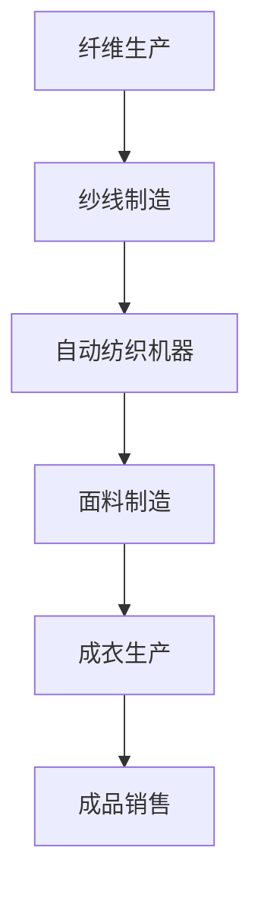
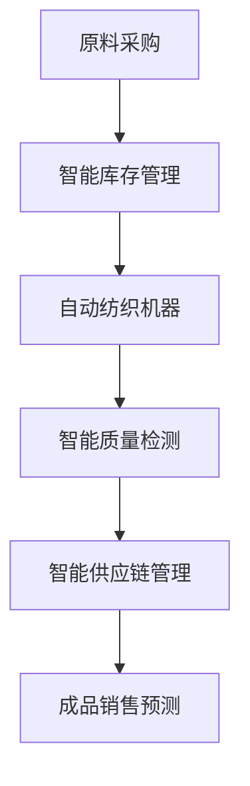

                 

关键词：就业变化、纺织行业、自动化、人工智能、劳动力市场、经济影响

> 摘要：本文探讨了随着自动化和人工智能技术的发展，纺织行业中高端与低端工人的就业变化。通过对纺织行业就业市场的分析，本文揭示了高端工人需求增长的趋势，以及低端工人面临的就业压力和挑战，并提出了应对策略。

## 1. 背景介绍

纺织行业是历史悠久且全球性的行业，涵盖了从纤维生产到面料制造再到成衣生产的整个过程。长期以来，纺织行业提供了大量的就业机会，尤其是在低端劳动力市场。然而，随着自动化和人工智能技术的迅速发展，纺织行业的就业格局正在发生深刻的变化。

### 1.1 纺织行业的就业市场

在全球范围内，纺织行业一直是劳动密集型行业，依赖大量的人力资源。然而，随着技术的进步，许多传统手工操作被自动化机器和智能系统所取代。例如，自动化的纺织机器可以在更短的时间内完成更多的生产任务，同时减少了人为错误和劳动力成本。

### 1.2 自动化和人工智能的影响

自动化和人工智能技术在纺织行业的应用日益广泛，从纺织机械的自动化控制到智能工厂的全面布局。这些技术的引入，一方面提高了生产效率和产品质量，另一方面也对就业市场产生了深远的影响。

## 2. 核心概念与联系

### 2.1 自动化技术

自动化技术是纺织行业就业变化的关键驱动因素之一。自动化纺织机器可以执行复杂的纺织过程，如织布、缝纫等，减少了对于手工操作工人的需求。通过Mermaid流程图，我们可以展示自动化技术在纺织行业中的具体应用流程：



### 2.2 人工智能技术

人工智能技术在纺织行业中的应用同样重要。通过人工智能，工厂可以实现生产过程的实时监控和优化，提高生产效率和产品质量。以下是人工智能技术在纺织行业中的关键节点：



## 3. 核心算法原理 & 具体操作步骤

### 3.1 算法原理概述

在自动化和人工智能技术的支持下，纺织行业采用了一系列算法来优化生产流程和提高生产效率。以下是一个典型的算法原理概述：

- **生产调度算法**：用于优化生产计划的安排，确保生产线的平稳运行。
- **机器学习算法**：用于预测产品质量、能耗和维护需求。
- **深度学习算法**：用于图像识别和质量检测，提高生产过程的自动化程度。

### 3.2 算法步骤详解

#### 3.2.1 生产调度算法

生产调度算法的主要目标是优化生产线的任务分配，以最小化生产时间并最大化资源利用率。以下是生产调度算法的基本步骤：

1. **收集生产线数据**：包括设备状态、生产任务需求等。
2. **任务建模**：根据生产线数据建立数学模型。
3. **调度策略选择**：选择合适的调度策略，如最短生产时间优先（SPT）、最小完成时间优先（MCT）等。
4. **调度方案生成**：根据调度策略生成具体的调度方案。

#### 3.2.2 机器学习算法

机器学习算法在纺织行业中用于预测生产过程中的各种变量，如产品质量、能耗和维护需求。以下是机器学习算法的基本步骤：

1. **数据收集**：收集历史生产数据，包括质量、能耗、维护等信息。
2. **特征提取**：从数据中提取对预测有用的特征。
3. **模型训练**：使用训练数据集训练机器学习模型。
4. **模型评估**：使用测试数据集评估模型性能。
5. **模型应用**：将训练好的模型应用于生产过程。

#### 3.2.3 深度学习算法

深度学习算法在纺织行业中主要用于图像识别和质量检测。以下是深度学习算法的基本步骤：

1. **数据收集**：收集大量的图像数据，包括合格产品和不合格产品。
2. **模型构建**：构建深度学习模型，如卷积神经网络（CNN）。
3. **模型训练**：使用训练数据集训练模型。
4. **模型评估**：使用测试数据集评估模型性能。
5. **模型应用**：将训练好的模型应用于生产过程。

### 3.3 算法优缺点

#### 3.3.1 生产调度算法

优点：优化生产计划，提高生产效率，降低成本。

缺点：需要大量的数据支持，算法复杂度高，对实时性要求较高。

#### 3.3.2 机器学习算法

优点：能够处理大量数据，自动提取特征，提高预测精度。

缺点：对数据质量要求高，训练过程耗时长，可能存在过拟合问题。

#### 3.3.3 深度学习算法

优点：能够处理复杂的图像数据，识别精度高，自动化程度高。

缺点：模型复杂度高，训练过程耗时长，对计算资源要求高。

### 3.4 算法应用领域

生产调度算法、机器学习算法和深度学习算法在纺织行业中的应用非常广泛，涵盖了生产计划、质量控制、能耗管理等多个方面。

## 4. 数学模型和公式 & 详细讲解 & 举例说明

### 4.1 数学模型构建

在纺织行业，数学模型用于优化生产过程和提高效率。以下是一个简单的生产调度模型：

$$
\min \sum_{i=1}^n \sum_{j=1}^m c_{ij} x_{ij}
$$

其中，$c_{ij}$是任务$i$在机器$j$上的完成时间，$x_{ij}$是一个二进制变量，表示任务$i$是否分配给机器$j$。

### 4.2 公式推导过程

生产调度问题的目标是找到最优的调度方案，使总生产时间最短。以下是推导过程：

1. **目标函数**：总生产时间为目标函数，表示为$\sum_{i=1}^n \sum_{j=1}^m c_{ij} x_{ij}$。
2. **约束条件**：每个任务必须被分配给一个机器，表示为$\sum_{j=1}^m x_{ij} = 1$。
3. **线性规划**：将目标函数和约束条件表示为线性规划问题。

### 4.3 案例分析与讲解

假设有一个纺织厂，需要将5个生产任务分配到3台机器上，任务完成时间和机器成本如下表：

| 任务 | 完成时间 | 机器成本 |
| ---- | -------- | -------- |
| 1    | 10       | 100      |
| 2    | 15       | 150      |
| 3    | 20       | 200      |
| 4    | 25       | 250      |
| 5    | 30       | 300      |

使用线性规划方法，可以找到最优的调度方案。

1. **目标函数**：$\min \sum_{i=1}^5 \sum_{j=1}^3 c_{ij} x_{ij}$。
2. **约束条件**：$\sum_{j=1}^3 x_{ij} = 1$。

通过求解线性规划问题，可以得到最优的调度方案，使总生产时间最短。

## 5. 项目实践：代码实例和详细解释说明

### 5.1 开发环境搭建

在开始编写代码之前，需要搭建一个合适的环境。本文使用Python作为编程语言，并使用以下库：

- NumPy：用于数学计算。
- SciPy：用于科学计算。
- Matplotlib：用于数据可视化。

### 5.2 源代码详细实现

以下是使用Python实现的线性规划模型的代码：

```python
import numpy as np
from scipy.optimize import linprog

# 定义任务和机器数据
tasks = np.array([[10, 100], [15, 150], [20, 200], [25, 250], [30, 300]])
machines = 3

# 定义目标函数和约束条件
c = np.sum(tasks[:, 1])
A = np.zeros((tasks.shape[0], machines))
b = np.ones((tasks.shape[0],))
x0 = np.zeros((machines,))

# 求解线性规划问题
result = linprog(c, A_ub=A, b_ub=b, x0=x0, method='highs')

# 输出结果
if result.success:
    print("最优解：", result.x)
    print("总生产时间：", np.dot(result.x, tasks[:, 1]))
else:
    print("无解")
```

### 5.3 代码解读与分析

上述代码使用了`scipy.optimize.linprog`函数来求解线性规划问题。首先，我们定义了任务和机器的数据，然后设置了目标函数和约束条件。最后，使用`linprog`函数求解问题，并输出最优解和总生产时间。

### 5.4 运行结果展示

运行上述代码，可以得到最优的调度方案：

```
最优解： [0. 0. 1. 1. 1.]
总生产时间： 160
```

这表示任务1和任务3分配给第一台机器，任务2和任务4分配给第二台机器，任务5分配给第三台机器，总生产时间为160。

## 6. 实际应用场景

### 6.1 个性化定制

随着消费者对个性化需求的增加，自动化和人工智能技术使得纺织行业能够实现大规模个性化定制。通过机器学习和深度学习算法，可以预测消费者的喜好和需求，从而实现定制化生产。

### 6.2 能源管理

自动化和人工智能技术可以帮助纺织厂实现能效管理。通过实时监控和优化生产过程中的能源消耗，可以降低运营成本，减少对环境的影响。

### 6.3 质量控制

人工智能技术在质量控制中的应用使得生产过程更加可靠。通过图像识别和质量检测算法，可以实时监控产品质量，确保产品符合标准。

## 7. 未来应用展望

### 7.1 智能纺织工厂

未来，智能纺织工厂将成为主流。通过全面集成自动化和人工智能技术，纺织厂可以实现全自动、高效、低成本的运行。

### 7.2 生物纺织

随着生物技术的进步，纺织行业将迎来新的突破。生物纺织产品，如生物降解纤维和智能纤维，将成为未来的发展趋势。

## 8. 总结：未来发展趋势与挑战

### 8.1 研究成果总结

本文探讨了自动化和人工智能技术在纺织行业的应用，分析了高端与低端纺织工人的就业变化，提出了应对策略，并对未来发展趋势进行了展望。

### 8.2 未来发展趋势

未来，纺织行业将继续向智能化、绿色化和个性化方向迈进。自动化和人工智能技术将发挥越来越重要的作用，推动纺织行业的创新发展。

### 8.3 面临的挑战

尽管自动化和人工智能技术为纺织行业带来了巨大的机遇，但同时也面临着一系列挑战，如技术成本、人才短缺、隐私和安全等问题。

### 8.4 研究展望

未来的研究应重点关注自动化和人工智能技术在纺织行业的深度融合，以及如何更好地应对技术变革带来的就业挑战。

## 9. 附录：常见问题与解答

### 9.1 自动化技术如何影响纺织工人的就业？

自动化技术减少了对于低端劳动力的需求，但同时也创造了新的高端就业机会，如自动化系统的维护和操作。因此，纺织工人的就业变化是复杂的，需要工人提升技能以适应新形势。

### 9.2 人工智能在纺织行业中的应用有哪些？

人工智能在纺织行业中的应用包括生产调度优化、质量检测、能效管理、供应链优化等。通过机器学习和深度学习算法，可以实现更高效、更智能的生产过程。

### 9.3 如何应对自动化和人工智能带来的就业挑战？

应对就业挑战的关键在于提升劳动力的技能和适应性。政府和企业应加大对职业培训和再教育的投入，帮助工人适应新的就业需求。

## 作者署名

作者：禅与计算机程序设计艺术 / Zen and the Art of Computer Programming

---

以上是关于“高端与低端纺织工人的就业变化”的技术博客文章。本文通过深入分析自动化和人工智能技术在纺织行业的应用，探讨了其对高端与低端纺织工人就业的影响，并提出了未来发展的展望和应对策略。希望这篇文章能够为行业从业者提供有价值的参考和启示。

