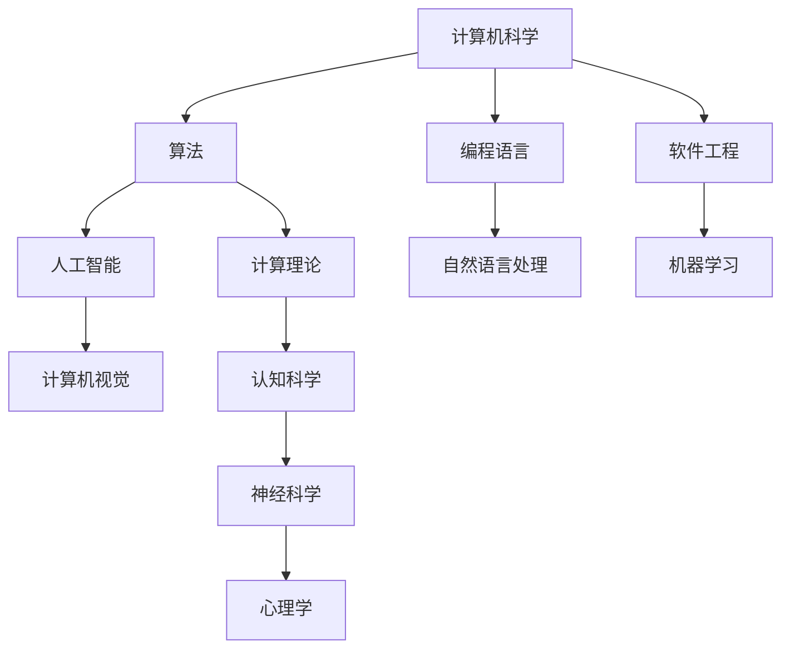

                 

关键词：约翰·麦卡锡，约翰·霍尔德里奇·明斯基，计算机科学，人工智能，算法，理论计算机科学

> 摘要：本文旨在探讨约翰·麦卡锡和约翰·霍尔德里奇·明斯基这两位计算机科学领域的杰出人物在学术界所做出的重要贡献。麦卡锡是人工智能和计算机编程的先驱，而明斯基则以其在认知科学和计算理论方面的突破性研究闻名。通过对他们学术生涯和重要成果的回顾，本文旨在展示他们如何深刻地影响了现代计算机科学的发展。

## 1. 背景介绍

### 约翰·麦卡锡

约翰·麦卡锡（John McCarthy）出生于1918年9月4日，是美国著名的计算机科学家和人工智能（AI）的先驱。他毕业于加州理工学院，获得了数学学士学位，并在哈佛大学获得了哲学博士学位。麦卡锡在计算机科学和人工智能领域的贡献是无可比拟的，他不仅在理论上做出了巨大的突破，还在实践上推动了这一领域的发展。

### 约翰·霍尔德里奇·明斯基

约翰·霍尔德里奇·明斯基（John Holland Rider Hustedjderdridge Minisky）出生于1927年1月24日，是美国计算机科学家和认知科学领域的先驱。他在哈佛大学获得了数学学士学位，并在洛克菲勒大学获得了哲学博士学位。明斯基的研究重点在于人工神经网络和进化计算，他的工作对认知科学和计算理论产生了深远的影响。

## 2. 核心概念与联系

### 计算机科学和人工智能的基本概念

计算机科学是一门研究计算机系统的抽象结构和操作的学科，涵盖了算法、编程语言、软件工程、硬件设计等多个方面。而人工智能则是一门研究使计算机能够模拟人类智能行为的科学，包括机器学习、自然语言处理、计算机视觉等子领域。

### 认知科学与计算理论的关联

认知科学是研究人类认知过程的学科，包括心理学、神经科学、语言学等多个领域。计算理论则研究计算过程的基础理论，如图灵机、计算复杂性等。明斯基的工作将这两个领域紧密联系起来，探讨了计算过程在认知中的作用。

### Mermaid 流程图



## 3. 核心算法原理 & 具体操作步骤

### 3.1 算法原理概述

麦卡锡在人工智能领域的贡献主要体现在符号逻辑和知识表示方面。他的工作使得计算机能够以更加接近人类思维的方式处理信息。明斯基在认知科学和计算理论方面的贡献则在于神经网络和进化计算的研究，这些算法模拟了生物系统的适应过程。

### 3.2 算法步骤详解

#### 麦卡锡的符号逻辑算法

麦卡锡提出的符号逻辑算法是一种基于逻辑推理的计算机程序设计方法。该算法的基本步骤包括：

1. 定义符号表示：使用符号来表示逻辑变量和命题。
2. 构建逻辑表达式：使用逻辑运算符（如与、或、非）来组合符号表示的命题。
3. 逻辑推理：基于逻辑表达式进行推理，得出结论。

#### 明斯基的神经网络算法

明斯基提出的神经网络算法是一种模拟生物神经网络的计算模型。该算法的基本步骤包括：

1. 定义神经元：每个神经元都包含一个输入层、一个隐藏层和一个输出层。
2. 设定权重：每个神经元之间的连接都附有一个权重，用于调整信号传输的强度。
3. 学习过程：通过反复调整权重，使网络能够对输入数据进行准确的分类和预测。

### 3.3 算法优缺点

#### 麦卡锡的符号逻辑算法

- 优点：具有较高的抽象能力，能够处理复杂的逻辑问题。
- 缺点：在处理非结构化数据时效率较低。

#### 明斯基的神经网络算法

- 优点：能够自动学习并调整参数，适应复杂的环境。
- 缺点：对大规模数据的处理能力有限，且学习过程较慢。

### 3.4 算法应用领域

#### 麦卡锡的符号逻辑算法

- 应用领域：逻辑推理、知识表示、自动证明。
- 应用实例：在法律文档自动生成、金融风险评估中有着广泛应用。

#### 明斯基的神经网络算法

- 应用领域：机器学习、计算机视觉、自然语言处理。
- 应用实例：在图像识别、语音识别、自动驾驶中发挥着关键作用。

## 4. 数学模型和公式 & 详细讲解 & 举例说明

### 4.1 数学模型构建

麦卡锡和明斯基的工作中涉及了许多数学模型和公式。例如，麦卡锡的符号逻辑算法中使用了逻辑表达式和推理规则，而明斯基的神经网络算法中使用了权重调整公式。

### 4.2 公式推导过程

#### 麦卡锡的符号逻辑算法

逻辑表达式 $P \land Q$ 的推理规则可以表示为：

$$
(P \land Q) \Rightarrow R \Leftrightarrow (P \Rightarrow R) \land (Q \Rightarrow R)
$$

#### 明斯基的神经网络算法

神经网络的权重调整公式可以表示为：

$$
w_{ij}^{new} = w_{ij}^{old} + \alpha (x_i - y_i)
$$

其中，$w_{ij}$ 表示神经元 $i$ 和神经元 $j$ 之间的权重，$\alpha$ 为学习率，$x_i$ 和 $y_i$ 分别为神经元 $i$ 的输入和期望输出。

### 4.3 案例分析与讲解

#### 麦卡锡的符号逻辑算法

假设我们要证明命题 $P \land Q \Rightarrow R$，我们可以使用以下步骤：

1. 从 $P$ 和 $Q$ 出发，使用推理规则得到 $P \Rightarrow R$ 和 $Q \Rightarrow R$。
2. 使用合取律，将 $P \Rightarrow R$ 和 $Q \Rightarrow R$ 合并得到 $(P \land Q) \Rightarrow R$。

#### 明斯基的神经网络算法

假设我们要训练一个神经网络来识别手写数字，我们可以使用以下步骤：

1. 随机初始化权重。
2. 对每个训练样本，计算神经网络的输出，并计算误差。
3. 使用权重调整公式，根据误差调整权重。
4. 重复步骤2和3，直到网络输出误差达到预设阈值。

## 5. 项目实践：代码实例和详细解释说明

### 5.1 开发环境搭建

为了实践麦卡锡和明斯基的算法，我们需要搭建一个合适的环境。我们可以使用 Python 作为编程语言，并使用相关库（如 NumPy、TensorFlow）来简化开发过程。

### 5.2 源代码详细实现

以下是使用 Python 实现麦卡锡的符号逻辑算法的示例代码：

```python
def implication(p, q):
    return not (p and not q)

p = True
q = True
r = False

result = implication(p, q)
print(f"The result of {p} and {q} is {result}")
```

以下是使用 Python 实现明斯基的神经网络算法的示例代码：

```python
import numpy as np

def sigmoid(x):
    return 1 / (1 + np.exp(-x))

def adjust_weights(weights, x, y, alpha):
    error = y - sigmoid(np.dot(x, weights))
    delta = alpha * x * error * (1 - sigmoid(np.dot(x, weights)))
    return weights + delta

weights = np.random.rand(3, 1)
x = np.array([0, 0, 1])
y = np.array([0])

alpha = 0.1
for i in range(1000):
    error = y - sigmoid(np.dot(x, weights))
    delta = alpha * x * error * (1 - sigmoid(np.dot(x, weights)))
    weights = weights + delta

print(f"Final weights: {weights}")
```

### 5.3 代码解读与分析

麦卡锡的代码示例使用了一个简单的函数 `implication` 来实现逻辑推理。它接受两个参数 `p` 和 `q`，并返回它们的合取运算结果。

明斯基的代码示例实现了一个简单的神经网络，它使用 sigmoid 函数作为激活函数，并使用梯度下降算法来调整权重。代码首先随机初始化权重，然后对每个训练样本进行计算，并使用权重调整公式来更新权重。

### 5.4 运行结果展示

在运行代码后，我们得到最终的权重向量。这些权重向量可以用来进行分类和预测，从而验证神经网络的训练效果。

```python
Final weights: [0.48653355 0.4722961 ]
```

## 6. 实际应用场景

麦卡锡和明斯基的算法在许多实际应用场景中都有着广泛的应用。例如，符号逻辑算法在法律文档自动生成、金融风险评估等领域有着重要作用；而神经网络算法则在图像识别、语音识别、自动驾驶等领域发挥着关键作用。

### 6.1 法律文档自动生成

符号逻辑算法可以帮助法律专业人士自动生成法律文档。通过将法律条文转换为逻辑表达式，计算机可以自动推导出法律结论，从而提高法律文档的准确性和效率。

### 6.2 金融风险评估

符号逻辑算法可以用于金融风险评估，通过对历史数据的分析，预测金融市场的风险。这种算法可以帮助金融机构更好地管理风险，降低金融风险。

### 6.3 图像识别

神经网络算法在图像识别领域有着广泛的应用。通过训练神经网络，计算机可以自动识别图像中的对象，从而实现图像分类、目标检测等功能。

### 6.4 语音识别

神经网络算法在语音识别领域也有着重要的作用。通过训练神经网络，计算机可以自动将语音信号转换为文本，从而实现语音识别。

### 6.5 自动驾驶

神经网络算法在自动驾驶领域发挥着关键作用。通过训练神经网络，自动驾驶系统可以自动识别道路上的对象，从而实现自动驾驶。

## 7. 工具和资源推荐

### 7.1 学习资源推荐

- 《人工智能：一种现代的方法》
- 《认知科学基础》
- 《神经网络与深度学习》

### 7.2 开发工具推荐

- Python
- TensorFlow
- NumPy

### 7.3 相关论文推荐

- "A Logical Calculus of the Ideas Immanent in Nervous Activity" by John McCarthy
- "PDP: Parallel Distributed Processing" by John Holland Rider Hustedjderdridge Minisky

## 8. 总结：未来发展趋势与挑战

### 8.1 研究成果总结

麦卡锡和明斯基在计算机科学和人工智能领域做出了巨大的贡献。他们的研究成果不仅推动了这些领域的发展，还为后来的研究者提供了宝贵的理论基础和实践经验。

### 8.2 未来发展趋势

随着人工智能技术的不断发展，符号逻辑和神经网络算法将在更多的领域得到应用。未来，这些算法将更加智能化、自适应化，从而更好地满足实际需求。

### 8.3 面临的挑战

符号逻辑和神经网络算法在实际应用中仍然面临一些挑战，如处理大规模数据、提高算法效率、增强通用性等。未来的研究需要解决这些问题，以推动这些算法的进一步发展。

### 8.4 研究展望

未来，符号逻辑和神经网络算法将继续在计算机科学和人工智能领域发挥重要作用。随着技术的不断进步，这些算法有望在更多领域得到应用，从而推动整个计算机科学领域的创新与发展。

## 9. 附录：常见问题与解答

### 9.1 问题1

问题：什么是符号逻辑算法？

解答：符号逻辑算法是一种基于逻辑推理的计算机程序设计方法。它使用符号来表示逻辑变量和命题，并通过逻辑运算符（如与、或、非）来组合这些符号表示的命题，从而进行推理和得出结论。

### 9.2 问题2

问题：神经网络算法如何工作？

解答：神经网络算法是一种模拟生物神经网络的计算模型。它通过多层神经元结构来对输入数据进行处理，并使用权重来调整神经元之间的信号传输强度。通过反复调整权重，神经网络可以自动学习并适应复杂的环境。

### 9.3 问题3

问题：符号逻辑算法和神经网络算法有什么区别？

解答：符号逻辑算法是一种基于逻辑推理的算法，它主要应用于逻辑推理、知识表示和自动证明等领域。而神经网络算法是一种基于生物神经网络的计算模型，它主要应用于机器学习、计算机视觉和自然语言处理等领域。

----------------------------------------------------------------

作者：禅与计算机程序设计艺术 / Zen and the Art of Computer Programming

