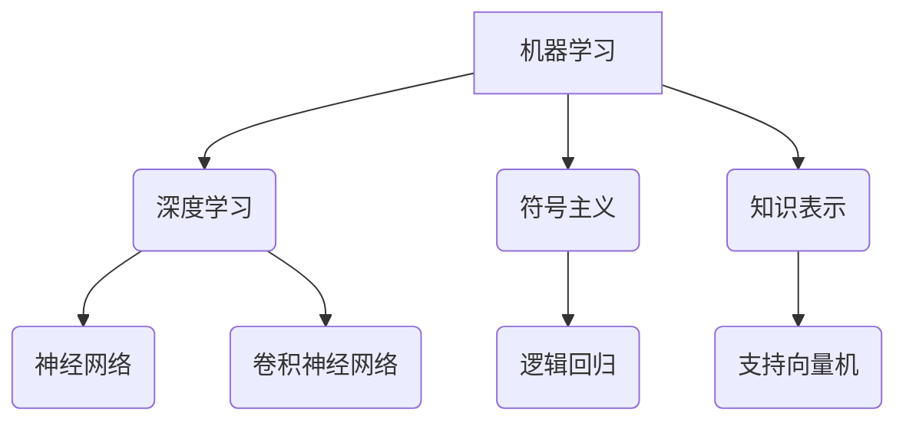

                 

关键词：AI 2.0，机器学习，深度学习，神经网络，大数据，算法优化，数据处理，模型评估，应用场景

> 摘要：随着人工智能（AI）的飞速发展，机器学习已成为AI 2.0时代的关键驱动力。本文将深入探讨机器学习的基本概念、核心算法、数学模型、项目实践及未来发展趋势，旨在为读者提供全面的机器学习知识体系和实际应用指导。

## 1. 背景介绍

自20世纪50年代人工智能（AI）概念诞生以来，AI技术经历了多个发展阶段。从早期的符号主义（Symbolic AI）和知识表示（Knowledge Representation），到基于规则的系统（Rule-Based Systems），再到基于统计学习的机器学习方法（Statistical Learning Methods），AI技术在各个领域取得了显著的成就。

进入21世纪，随着计算能力的提升、大数据的爆炸性增长和深度学习算法的突破，机器学习进入了AI 2.0时代。这一时代，机器学习不再局限于小规模的数据集和简单的算法，而是能够处理大规模、高维数据，并利用深度学习算法实现前所未有的准确性和效率。

## 2. 核心概念与联系

### 2.1 机器学习的定义

机器学习（Machine Learning）是一门人工智能（AI）的分支，旨在通过算法和统计模型，从数据中学习并提取有用的信息，从而实现自动化的决策和预测。

### 2.2 深度学习的定义

深度学习（Deep Learning）是一种基于多层神经网络的机器学习方法，能够自动从数据中学习特征，并实现对复杂模式的识别。

### 2.3 大数据的定义

大数据（Big Data）指的是无法用传统数据处理工具进行有效管理和处理的数据集，具有高维度、高速度、高多样性和高体积的特点。

### 2.4 Mermaid 流程图



## 3. 核心算法原理 & 具体操作步骤

### 3.1 算法原理概述

机器学习算法主要包括监督学习、无监督学习和强化学习。其中，监督学习是最常见的方法，通过已知输入输出对模型进行训练，从而实现对未知数据的预测。

### 3.2 算法步骤详解

1. 数据预处理：包括数据清洗、数据转换、数据归一化等步骤，以确保数据的质量和一致性。
2. 特征提取：从原始数据中提取有用的特征，用于构建模型。
3. 模型选择：根据问题的性质和数据的特点，选择合适的模型。
4. 模型训练：使用训练数据对模型进行训练，不断调整模型参数，以提高模型的预测能力。
5. 模型评估：使用测试数据对模型进行评估，以确定模型的性能。

### 3.3 算法优缺点

- 监督学习的优点是预测准确度高，但需要大量的标签数据进行训练。
- 无监督学习的优点是无需标签数据，但预测准确性相对较低。
- 强化学习的优点是能够通过试错学习，但训练过程复杂且耗时。

### 3.4 算法应用领域

机器学习算法广泛应用于自然语言处理、计算机视觉、推荐系统、金融风控、医疗诊断等领域，取得了显著的成果。

## 4. 数学模型和公式

### 4.1 数学模型构建

机器学习模型的构建主要基于概率统计和优化理论。例如，逻辑回归模型是基于概率统计理论，而支持向量机是基于优化理论。

### 4.2 公式推导过程

以逻辑回归为例，其目标函数为：

$$
L(\theta) = -\frac{1}{m} \sum_{i=1}^{m} [y^{(i)} \log(\hat{y}^{(i)}) + (1 - y^{(i)}) \log(1 - \hat{y}^{(i)})]
$$

其中，$m$为样本数量，$y^{(i)}$为实际标签，$\hat{y}^{(i)}$为预测标签。

### 4.3 案例分析与讲解

以文本分类问题为例，我们可以使用逻辑回归模型对文本进行分类。首先，对文本进行预处理，提取特征词，然后构建逻辑回归模型，最后使用测试数据对模型进行评估。

## 5. 项目实践：代码实例和详细解释说明

### 5.1 开发环境搭建

在Python环境中，使用Scikit-learn库实现逻辑回归模型。

### 5.2 源代码详细实现

```python
from sklearn.linear_model import LogisticRegression
from sklearn.model_selection import train_test_split
from sklearn.metrics import accuracy_score
from sklearn.feature_extraction.text import TfidfVectorizer

# 数据预处理
data = ["这是一篇关于机器学习的文章", "深度学习是机器学习的子领域", "大数据时代，机器学习的重要性不言而喻"]
labels = ["机器学习", "深度学习", "大数据"]

# 特征提取
vectorizer = TfidfVectorizer()
X = vectorizer.fit_transform(data)

# 模型训练
model = LogisticRegression()
model.fit(X, labels)

# 模型评估
X_test, y_test = train_test_split(X, labels, test_size=0.2)
y_pred = model.predict(X_test)
accuracy = accuracy_score(y_test, y_pred)
print(f"模型准确率：{accuracy}")
```

### 5.3 代码解读与分析

代码首先进行数据预处理，然后使用TF-IDF向量器提取特征，接着使用逻辑回归模型进行训练，最后使用测试数据对模型进行评估。

## 6. 实际应用场景

机器学习在自然语言处理、计算机视觉、推荐系统、金融风控、医疗诊断等领域具有广泛的应用。

### 6.1 自然语言处理

机器学习在自然语言处理（NLP）领域具有广泛的应用，如文本分类、情感分析、机器翻译等。

### 6.2 计算机视觉

机器学习在计算机视觉（CV）领域也取得了显著的成果，如图像分类、目标检测、图像生成等。

### 6.3 推荐系统

机器学习在推荐系统（RS）中用于预测用户兴趣，从而实现个性化推荐。

### 6.4 金融风控

机器学习在金融风控领域用于预测信用风险、防范欺诈等。

### 6.5 医疗诊断

机器学习在医疗诊断领域用于疾病预测、影像分析等。

## 7. 工具和资源推荐

### 7.1 学习资源推荐

- 《机器学习》（周志华著）：系统介绍了机器学习的基本概念、算法和应用。
- 《深度学习》（Goodfellow、Bengio、Courville 著）：深度学习的经典教材，详细介绍了深度学习的基本原理和应用。

### 7.2 开发工具推荐

- Python：Python是机器学习和深度学习领域的首选语言，拥有丰富的库和框架。
- Jupyter Notebook：Jupyter Notebook是一个交互式的开发环境，方便进行机器学习和深度学习实验。

### 7.3 相关论文推荐

- "A Theoretically Grounded Application of Dropout in Convolutional Networks"（2014）：提出了dropout算法，提高了深度学习模型的性能。
- "Deep Learning"（2015）：介绍了深度学习的基本原理和应用，是深度学习的经典教材。

## 8. 总结：未来发展趋势与挑战

### 8.1 研究成果总结

机器学习在AI 2.0时代取得了显著的成果，推动了各个领域的创新发展。

### 8.2 未来发展趋势

- 基于生成对抗网络（GAN）的模型将得到更广泛的应用。
- 跨学科研究将成为未来机器学习的重要方向。
- 可解释性（Explainability）和可信赖性（Trustworthiness）将成为机器学习研究的重要问题。

### 8.3 面临的挑战

- 数据隐私和安全问题。
- 计算资源的需求和限制。
- 模型复杂度和可解释性之间的权衡。

### 8.4 研究展望

随着计算能力的提升、大数据技术的发展和人工智能的普及，机器学习将在未来取得更大的突破，为社会进步和人类福祉作出更大贡献。

## 9. 附录：常见问题与解答

### 9.1 机器学习与人工智能的区别是什么？

机器学习是人工智能的一个分支，旨在通过算法和统计模型，从数据中学习并提取有用的信息。而人工智能则包括机器学习、自然语言处理、计算机视觉等多个领域，旨在使计算机能够模拟人类的智能行为。

### 9.2 机器学习算法有哪些类型？

机器学习算法主要包括监督学习、无监督学习和强化学习。监督学习通过已知输入输出对模型进行训练，无监督学习无需标签数据，强化学习通过试错学习。

### 9.3 深度学习与神经网络有什么关系？

深度学习是一种基于多层神经网络的机器学习方法，能够自动从数据中学习特征。而神经网络是一种由多个神经元组成的计算模型，是深度学习的基础。

----------------------------------------------------------------
作者：禅与计算机程序设计艺术 / Zen and the Art of Computer Programming

