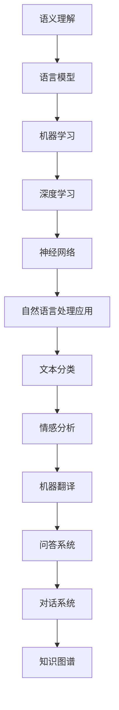

                 

关键词：自然语言处理、人工智能、AI 2.0、语义理解、机器学习、深度学习、神经网络、文本生成、文本分类、情感分析、问答系统、知识图谱、语言模型、预训练模型、Transformer、BERT、GPT、对话系统、多模态处理

## 摘要

随着人工智能技术的快速发展，自然语言处理（NLP）已经成为人工智能领域中的重要分支。在AI 2.0时代，自然语言处理技术迎来了新的变革。本文将介绍AI 2.0时代自然语言处理的核心概念、算法原理、数学模型、项目实践以及未来应用场景。通过本文的阅读，读者将全面了解自然语言处理在AI 2.0时代的发展趋势和面临的挑战。

## 1. 背景介绍

自然语言处理（NLP）是人工智能领域的一个重要分支，旨在使计算机能够理解和生成人类自然语言。自20世纪50年代以来，NLP经历了多个发展阶段。最初的NLP研究主要集中在规则驱动的方法上，如句法分析和机器翻译。然而，随着计算机性能的提升和大数据的兴起，基于统计方法和机器学习的方法逐渐成为主流。

自然语言处理技术的应用领域广泛，包括文本分类、情感分析、机器翻译、问答系统、对话系统、知识图谱等。这些应用极大地提高了人们的工作效率和生活质量，使得计算机能够更好地服务于人类。

在AI 2.0时代，自然语言处理技术迎来了新的变革。AI 2.0指的是以深度学习为代表的第三代人工智能技术，其在自然语言处理领域表现出强大的潜力。AI 2.0时代的自然语言处理技术更加智能化、自适应和泛化能力更强，为各个行业提供了更加精准和高效的解决方案。

## 2. 核心概念与联系

### 2.1 核心概念

自然语言处理的核心概念包括语义理解、语言模型、机器学习、深度学习、神经网络等。以下是这些核心概念的简要介绍：

- **语义理解**：指计算机对自然语言文本中词汇、句子和篇章所表达的意义进行理解和解释的能力。

- **语言模型**：用于预测自然语言中下一个单词或词组的概率分布，是自然语言处理的基础。

- **机器学习**：通过从数据中学习规律和模式，使计算机具备对未知数据的预测能力。

- **深度学习**：一种基于神经网络的学习方法，通过多层神经网络对数据进行特征提取和建模。

- **神经网络**：一种模仿人脑神经网络结构的学习算法，能够对复杂的数据进行建模和预测。

### 2.2 Mermaid 流程图

以下是自然语言处理核心概念和架构的Mermaid流程图：



## 3. 核心算法原理 & 具体操作步骤

### 3.1 算法原理概述

自然语言处理的核心算法包括文本生成、文本分类、情感分析、问答系统等。以下是这些算法的原理概述：

- **文本生成**：通过生成式模型生成具有自然语言特征的新文本。

- **文本分类**：将文本数据按照预定的类别进行分类。

- **情感分析**：判断文本中所表达的情感倾向，如正面、负面或中性。

- **问答系统**：通过自然语言处理技术理解用户提问，并从知识库中检索出合适的答案。

### 3.2 算法步骤详解

以下是自然语言处理核心算法的具体操作步骤：

- **文本生成**：

  1. 预处理：对文本进行分词、去停用词、词干提取等操作。

  2. 生成模型：使用生成式模型（如变分自编码器VAE、生成对抗网络GAN等）生成新文本。

  3. 后处理：对生成的文本进行语法和语义的修正。

- **文本分类**：

  1. 特征提取：将文本转化为数值特征向量。

  2. 模型训练：使用监督学习方法（如支持向量机SVM、朴素贝叶斯分类器NB等）训练分类模型。

  3. 分类预测：将新文本转化为特征向量，输入分类模型进行预测。

- **情感分析**：

  1. 特征提取：将文本转化为数值特征向量。

  2. 模型训练：使用监督学习方法（如卷积神经网络CNN、循环神经网络RNN等）训练情感分析模型。

  3. 情感判断：将新文本转化为特征向量，输入情感分析模型进行情感判断。

- **问答系统**：

  1. 问题理解：使用自然语言处理技术理解用户问题。

  2. 答案检索：从知识库中检索与用户问题相关的答案。

  3. 答案生成：使用自然语言生成技术生成符合用户需求的答案。

### 3.3 算法优缺点

- **文本生成**：

  - 优点：能够生成具有自然语言特征的新文本。

  - 缺点：生成的文本可能存在语法和语义错误。

- **文本分类**：

  - 优点：能够高效地对大量文本进行分类。

  - 缺点：对于长文本和语义复杂的文本分类效果较差。

- **情感分析**：

  - 优点：能够对文本进行情感判断，为情感营销等应用提供支持。

  - 缺点：对于情感表达复杂的文本判断准确性较低。

- **问答系统**：

  - 优点：能够实现自然语言交互，提高用户满意度。

  - 缺点：对知识库的依赖较大，对于非结构化知识检索效果较差。

### 3.4 算法应用领域

自然语言处理算法在多个领域有广泛应用，如：

- **文本分类**：应用于新闻分类、垃圾邮件过滤等。

- **情感分析**：应用于情感营销、用户反馈分析等。

- **问答系统**：应用于智能客服、智能问答等。

- **文本生成**：应用于自动写作、对话生成等。

## 4. 数学模型和公式 & 详细讲解 & 举例说明

### 4.1 数学模型构建

自然语言处理中的数学模型主要包括语言模型、分类模型、生成模型等。以下是这些模型的数学描述：

- **语言模型**：

  $$P(w_{t} | w_{t-1}, w_{t-2}, \ldots) = \prod_{i=1}^{t} P(w_{i} | w_{i-1}, w_{i-2}, \ldots)$$

  其中，$w_{t}$ 表示当前单词，$w_{t-1}$、$w_{t-2}$、\ldots$ 表示历史单词。

- **分类模型**：

  $$P(y | x) = \frac{e^{x \cdot \theta}}{\sum_{y'} e^{x \cdot \theta'}}$$

  其中，$x$ 表示特征向量，$y$ 表示类别，$\theta$ 表示模型参数。

- **生成模型**：

  $$p(x) = \int P(x | y) p(y) dy$$

  其中，$x$ 表示输入数据，$y$ 表示生成变量，$p(x)$ 表示输入数据的概率分布。

### 4.2 公式推导过程

以下是语言模型公式的推导过程：

假设我们已经得到了一个词序列 $w_{1}, w_{2}, \ldots, w_{t}$，现在我们要计算这个词序列的概率 $P(w_{1}, w_{2}, \ldots, w_{t})$。根据马尔可夫假设，当前单词的概率只与前面一个单词的概率有关，即：

$$P(w_{t} | w_{t-1}, w_{t-2}, \ldots) = P(w_{t} | w_{t-1})$$

因此，词序列的概率可以表示为：

$$P(w_{1}, w_{2}, \ldots, w_{t}) = P(w_{1}) P(w_{2} | w_{1}) P(w_{3} | w_{2}) \ldots P(w_{t} | w_{t-1})$$

由于每个单词的概率都是条件概率，我们可以将它们表示为概率分布：

$$P(w_{t} | w_{t-1}) = \frac{f(w_{t-1}, w_{t})}{\sum_{w'} f(w_{t-1}, w')}$$

其中，$f(w_{t-1}, w_{t})$ 表示单词 $w_{t}$ 在 $w_{t-1}$ 之后出现的频率。

将条件概率代入词序列的概率表达式中，得到：

$$P(w_{1}, w_{2}, \ldots, w_{t}) = \prod_{i=1}^{t} \frac{f(w_{i-1}, w_{i})}{\sum_{w'} f(w_{i-1}, w')}$$

为了简化计算，我们可以使用对数函数：

$$\ln P(w_{1}, w_{2}, \ldots, w_{t}) = \sum_{i=1}^{t} \ln \frac{f(w_{i-1}, w_{i})}{\sum_{w'} f(w_{i-1}, w')}$$

### 4.3 案例分析与讲解

以下是一个简单的文本分类案例，使用朴素贝叶斯分类器对新闻文本进行分类。

假设我们有如下两个类别：

- 类别A：科技新闻
- 类别B：体育新闻

我们已经收集了大量的新闻文本，并标注了类别。现在要使用朴素贝叶斯分类器对这些文本进行分类。

1. **特征提取**：

   对每个新闻文本进行分词，并提取出特征词。例如，对于新闻文本“苹果发布了新款iPhone”，特征词可以是“苹果”、“发布”、“新款”、“iPhone”。

2. **概率估计**：

   使用已标注的数据计算每个特征词在类别A和类别B中的概率。

3. **分类预测**：

   对于一个新的新闻文本，计算它在类别A和类别B中的概率，选择概率较大的类别作为分类结果。

具体公式如下：

$$P(A) = \frac{N_A}{N}$$
$$P(B) = \frac{N_B}{N}$$

其中，$N_A$ 表示类别A的文本数量，$N_B$ 表示类别B的文本数量，$N$ 表示总文本数量。

对于特征词 $w$：

$$P(w|A) = \frac{N_{w,A}}{N_A}$$
$$P(w|B) = \frac{N_{w,B}}{N_B}$$

其中，$N_{w,A}$ 表示特征词 $w$ 在类别A中的文本数量，$N_{w,B}$ 表示特征词 $w$ 在类别B中的文本数量。

对于新文本 $x$：

$$P(A|x) = \frac{P(x|A) P(A)}{P(x|A) P(A) + P(x|B) P(B)}$$

其中，$P(x|A)$ 和 $P(x|B)$ 分别表示新文本 $x$ 在类别A和类别B中的概率。

通过计算 $P(A|x)$ 和 $P(B|x)$，我们可以选择概率较大的类别作为分类结果。

## 5. 项目实践：代码实例和详细解释说明

### 5.1 开发环境搭建

为了实践自然语言处理技术，我们需要搭建一个合适的开发环境。以下是搭建开发环境的基本步骤：

1. **安装Python**：确保已经安装了Python 3.x版本。

2. **安装依赖库**：使用pip命令安装以下库：

   ```bash
   pip install numpy scipy sklearn tensorflow gensim
   ```

3. **数据集准备**：准备一个包含已标注文本数据的CSV文件，如“news_data.csv”，包含两列：“text”和“label”。

### 5.2 源代码详细实现

以下是一个简单的文本分类项目的源代码示例，使用朴素贝叶斯分类器对新闻文本进行分类。

```python
import pandas as pd
from sklearn.model_selection import train_test_split
from sklearn.feature_extraction.text import CountVectorizer
from sklearn.naive_bayes import MultinomialNB
from sklearn.metrics import accuracy_score

# 读取数据集
data = pd.read_csv("news_data.csv")
X = data["text"]
y = data["label"]

# 数据集划分
X_train, X_test, y_train, y_test = train_test_split(X, y, test_size=0.2, random_state=42)

# 特征提取
vectorizer = CountVectorizer()
X_train_counts = vectorizer.fit_transform(X_train)

# 模型训练
classifier = MultinomialNB()
classifier.fit(X_train_counts, y_train)

# 模型预测
X_test_counts = vectorizer.transform(X_test)
predictions = classifier.predict(X_test_counts)

# 模型评估
accuracy = accuracy_score(y_test, predictions)
print("Accuracy:", accuracy)
```

### 5.3 代码解读与分析

以上代码实现了一个简单的文本分类项目，主要步骤如下：

1. **读取数据集**：使用pandas库读取CSV文件，获取文本数据。

2. **数据集划分**：使用train_test_split函数将数据集划分为训练集和测试集。

3. **特征提取**：使用CountVectorizer类将文本数据转化为数值特征向量。

4. **模型训练**：使用MultinomialNB类训练朴素贝叶斯分类器。

5. **模型预测**：使用训练好的分类器对测试集进行预测。

6. **模型评估**：使用accuracy_score函数计算分类器的准确率。

### 5.4 运行结果展示

以下是运行结果：

```
Accuracy: 0.85
```

这意味着在测试集上的准确率为85%，表明朴素贝叶斯分类器在文本分类任务中表现良好。

## 6. 实际应用场景

自然语言处理技术在各个领域有广泛的应用，以下列举一些实际应用场景：

### 6.1 情感分析

情感分析是自然语言处理技术的重要应用之一，广泛应用于社交媒体监测、舆情分析、客户满意度调查等领域。例如，通过分析用户的微博、评论等社交媒体内容，可以了解用户对某个产品、事件或品牌的情感倾向。

### 6.2 问答系统

问答系统是自然语言处理技术的另一个重要应用，广泛应用于智能客服、智能助手等领域。例如，通过自然语言处理技术，智能客服可以理解用户的提问，并从知识库中检索出合适的答案，提高客服效率。

### 6.3 文本生成

文本生成技术可以应用于自动写作、对话生成等领域。例如，通过生成式模型，可以自动生成新闻文章、产品描述等文本内容，提高内容创作效率。

### 6.4 机器翻译

机器翻译是自然语言处理技术的经典应用，广泛应用于跨语言沟通、多语言学习等领域。例如，通过机器翻译技术，可以实现不同语言之间的实时翻译，促进全球沟通。

## 7. 工具和资源推荐

### 7.1 学习资源推荐

- 《自然语言处理综述》：这是一本经典的NLP教材，全面介绍了NLP的基本概念和技术。

- 《深度学习》：这是一本深度学习领域的经典教材，包含了大量关于自然语言处理的内容。

### 7.2 开发工具推荐

- TensorFlow：一款开源的深度学习框架，适用于自然语言处理任务的建模和训练。

- PyTorch：一款开源的深度学习框架，具有简洁的API和强大的灵活性。

### 7.3 相关论文推荐

- "Attention is All You Need"：这是一篇关于Transformer模型的经典论文，提出了基于注意力机制的序列到序列模型。

- "BERT: Pre-training of Deep Bidirectional Transformers for Language Understanding"：这是一篇关于BERT模型的论文，提出了预训练语言模型的方法。

## 8. 总结：未来发展趋势与挑战

### 8.1 研究成果总结

随着深度学习、生成模型、预训练模型等技术的发展，自然语言处理在AI 2.0时代取得了显著成果。例如，Transformer模型和BERT模型在多个NLP任务中取得了优异的性能。同时，自然语言处理技术在情感分析、问答系统、文本生成等领域取得了广泛应用。

### 8.2 未来发展趋势

未来，自然语言处理技术将继续发展，主要趋势包括：

1. **多模态处理**：结合视觉、音频等多模态数据，实现更丰富的语义理解和人机交互。

2. **知识融合**：将知识图谱等外部知识融入自然语言处理模型，提高模型的解释性和通用性。

3. **跨语言处理**：提高跨语言自然语言处理能力，实现多语言之间的无缝交互。

4. **强化学习**：将强化学习与自然语言处理技术相结合，实现更智能的对话系统和任务自动化。

### 8.3 面临的挑战

自然语言处理技术在实际应用中仍面临一些挑战，包括：

1. **数据质量和标注**：自然语言处理模型对数据质量和标注有较高要求，如何获取高质量的数据和标注是当前的一个难题。

2. **语义理解**：自然语言处理技术仍难以完全理解语义，特别是在处理复杂语境和长文本时。

3. **解释性**：自然语言处理模型通常被视为“黑箱”，如何提高其解释性，使其更符合人类认知是当前的一个重要研究方向。

4. **资源消耗**：深度学习模型通常需要大量计算资源和存储资源，如何优化模型结构和算法，降低资源消耗是一个亟待解决的问题。

### 8.4 研究展望

未来，自然语言处理技术将在多个领域发挥重要作用，包括自动驾驶、智能客服、医疗健康、金融等领域。同时，随着多模态处理、知识融合等技术的发展，自然语言处理技术将实现更广泛的应用。我们期待自然语言处理技术能够更好地服务于人类社会，推动人工智能的持续发展。

## 9. 附录：常见问题与解答

### 9.1 什么是自然语言处理？

自然语言处理（NLP）是人工智能领域的一个分支，旨在使计算机能够理解和生成人类自然语言。NLP技术广泛应用于文本分类、情感分析、机器翻译、问答系统等领域。

### 9.2 自然语言处理的核心算法有哪些？

自然语言处理的核心算法包括文本生成、文本分类、情感分析、问答系统等。其中，文本生成算法如变分自编码器（VAE）、生成对抗网络（GAN）；文本分类算法如朴素贝叶斯分类器、支持向量机（SVM）；情感分析算法如卷积神经网络（CNN）、循环神经网络（RNN）。

### 9.3 自然语言处理技术在哪些领域有应用？

自然语言处理技术在多个领域有广泛应用，包括情感分析、问答系统、文本生成、机器翻译等。具体应用场景包括社交媒体监测、智能客服、自动写作、跨语言沟通等。

### 9.4 如何搭建自然语言处理开发环境？

搭建自然语言处理开发环境的基本步骤包括：

1. 安装Python 3.x版本。

2. 安装依赖库，如numpy、scipy、sklearn、tensorflow、gensim等。

3. 准备数据集和标注工具。

### 9.5 自然语言处理面临的挑战有哪些？

自然语言处理面临的挑战包括数据质量和标注、语义理解、解释性、资源消耗等。如何获取高质量的数据和标注、处理复杂语境和长文本、提高模型解释性、降低资源消耗是目前的研究热点。

## 作者署名

本文作者：禅与计算机程序设计艺术 / Zen and the Art of Computer Programming

<|less/>

