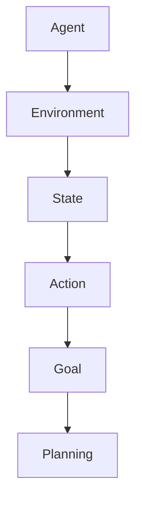

                 

AI Agent Planning 是人工智能领域中的一个核心概念，它涉及到 Agent 在复杂环境中做出决策和采取行动的问题。本文旨在深入探讨 AI Agent Planning 的核心原理、算法和应用，以帮助读者更好地理解这一领域的最新进展和未来趋势。

## 关键词

- AI Agent Planning
- 人工智能决策
- 行动规划算法
- 实际应用场景
- 未来展望

## 摘要

本文首先介绍了 AI Agent Planning 的基本概念和重要性，随后详细阐述了核心算法原理和具体操作步骤，并通过数学模型和公式进行了深入讲解。接着，文章通过项目实践展示了算法的实际应用，并分析了其优缺点。随后，文章讨论了 AI Agent Planning 在实际应用场景中的价值，并展望了其未来的发展方向和面临的挑战。

### 1. 背景介绍

AI Agent Planning，即人工智能代理规划，是人工智能领域中的一个重要研究方向。它旨在研究和实现 Agent 在动态、不确定和复杂的现实环境中，如何根据当前状态和目标，制定出最优的行动策略。

在现实生活中，许多问题都可以被视为 Agent Planning 问题。例如，自动驾驶汽车需要根据道路状况、交通流量和目标地点，规划出一条最优行驶路径；智能机器人需要根据环境地图和任务目标，确定自己的行动路径和动作序列。这些问题都需要 Agent 具有较强的规划能力，以便在复杂的环境中做出最优决策。

AI Agent Planning 的研究具有重要的实际应用价值。随着人工智能技术的不断进步，越来越多的领域开始应用 Agent Planning 技术，如自动驾驶、智能机器人、智能电网、智能交通等。这些应用不仅提高了生产效率，也改善了人们的生活质量。

### 2. 核心概念与联系

在 AI Agent Planning 中，涉及到以下几个核心概念：

1. **Agent**：指具有自主行为能力的实体，可以是一个智能体、机器人或者计算机程序。
2. **环境**：指 Agent 所处的物理或虚拟空间，包括 Agent 所能感知到的信息和资源。
3. **状态**：指环境中的一个特定情况，可以用一组属性值来描述。
4. **行动**：指 Agent 可以执行的动作，通常用于改变环境状态。
5. **目标**：指 Agent 希望实现的状态，可以是单个状态或一组状态。
6. **规划**：指从当前状态到目标状态的转换过程，通常需要通过搜索算法来实现。

以下是一个简单的 Mermaid 流程图，展示了这些概念之间的联系：



### 3. 核心算法原理 & 具体操作步骤

AI Agent Planning 的核心在于如何从当前状态到目标状态进行有效规划。这通常涉及到搜索算法、决策树、规划器等多个方面。以下将详细介绍一些常用的算法原理和操作步骤。

#### 3.1 算法原理概述

1. **搜索算法**：搜索算法是 AI Agent Planning 的基础。常见的搜索算法包括深度优先搜索（DFS）、广度优先搜索（BFS）、A*搜索算法等。这些算法通过搜索状态空间，找到一条从初始状态到目标状态的路径。
2. **决策树**：决策树是一种基于规则的方法，通过一系列条件判断，从初始状态推导出目标状态。它适用于具有明确规则和条件的问题。
3. **规划器**：规划器是一种特殊的搜索算法，专门用于解决规划问题。常见的规划器包括马尔可夫决策过程（MDP）、部分可观测马尔可夫决策过程（POMDP）等。

#### 3.2 算法步骤详解

1. **初始状态定义**：首先定义 Agent 所处的初始状态，这通常是问题给定的一个特定状态。
2. **目标状态定义**：然后定义 Agent 希望达到的目标状态，可以是单个状态或一组状态。
3. **状态空间构建**：构建 Agent 所能到达的所有状态空间，这可以通过搜索算法或规划器来实现。
4. **行动策略制定**：根据当前状态和目标状态，为 Agent 制定行动策略。这通常需要通过搜索算法或决策树来实现。
5. **执行行动策略**：根据制定的行动策略，执行相应的行动，并观察环境状态的变化。
6. **状态更新**：根据执行结果，更新当前状态，并重复步骤 3-5，直到达到目标状态。

#### 3.3 算法优缺点

1. **搜索算法**：优点是能找到最优路径，但缺点是计算复杂度高，尤其在状态空间较大时。
2. **决策树**：优点是简单易理解，但缺点是可能无法找到全局最优解。
3. **规划器**：优点是能处理复杂的不确定环境，但缺点是计算复杂度较高。

#### 3.4 算法应用领域

AI Agent Planning 算法在多个领域都有广泛应用：

1. **自动驾驶**：自动驾驶汽车需要根据道路状况和目标地点，规划出一条最优行驶路径。
2. **智能机器人**：智能机器人需要根据环境地图和任务目标，确定自己的行动路径和动作序列。
3. **智能电网**：智能电网需要根据负载情况和电力需求，规划电力分配路径，以提高供电效率。
4. **智能交通**：智能交通系统需要根据交通流量和路况，规划交通信号灯控制策略，以缓解交通拥堵。

### 4. 数学模型和公式 & 详细讲解 & 举例说明

在 AI Agent Planning 中，数学模型和公式起着至关重要的作用。以下将介绍一些常用的数学模型和公式，并进行详细讲解和举例说明。

#### 4.1 数学模型构建

在 AI Agent Planning 中，常见的数学模型包括马尔可夫决策过程（MDP）、部分可观测马尔可夫决策过程（POMDP）等。以下是一个简单的 MDP 模型：

$$
\begin{aligned}
    S &= \{s_1, s_2, s_3\} \quad \text{(状态集合)} \\
    A &= \{a_1, a_2\} \quad \text{(行动集合)} \\
    P &= \{p_{ij}\} \quad \text{(状态转移概率矩阵)} \\
    R &= \{r_{ij}\} \quad \text{(奖励函数)}
\end{aligned}
$$

其中，$s_i$ 表示状态，$a_j$ 表示行动，$p_{ij}$ 表示在状态 $s_i$ 下执行行动 $a_j$ 后，进入状态 $s_j$ 的概率，$r_{ij}$ 表示在状态 $s_i$ 下执行行动 $a_j$ 后获得的奖励。

#### 4.2 公式推导过程

在 MDP 中，常见的公式是状态值函数（State-Value Function）和行动值函数（Action-Value Function）。以下分别介绍这两个函数的推导过程。

1. **状态值函数**：状态值函数 $V(s)$ 表示在状态 $s$ 下执行最佳行动策略所能获得的最大期望奖励。其递归定义为：

$$
V(s) = \max_{a} \sum_{s'} p(s'|s, a) \cdot [r(s', a) + \gamma V(s')]
$$

其中，$p(s'|s, a)$ 表示在状态 $s$ 下执行行动 $a$ 后进入状态 $s'$ 的概率，$r(s', a)$ 表示在状态 $s'$ 下执行行动 $a$ 后获得的奖励，$\gamma$ 是折扣因子，表示对未来奖励的期望。

2. **行动值函数**：行动值函数 $Q(s, a)$ 表示在状态 $s$ 下执行行动 $a$ 后所能获得的最大期望奖励。其递归定义为：

$$
Q(s, a) = \sum_{s'} p(s'|s, a) \cdot [r(s', a) + \gamma V(s')]
$$

#### 4.3 案例分析与讲解

以下通过一个简单的例子，来分析 MDP 模型和公式在 AI Agent Planning 中的应用。

假设一个 Agent 处于一个包含 3 个房间的迷宫中，目标状态是到达最后一个房间。Agent 可以执行两个行动：向左走或向右走。在每个房间中，Agent 都有可能获得一个奖励，奖励大小取决于房间的位置。

以下是一个简单的 MDP 模型：

$$
\begin{aligned}
    S &= \{s_1, s_2, s_3\} \\
    A &= \{a_1, a_2\} \\
    P &= \{p_{ij}\} \\
    R &= \{r_{ij}\} \\
    \gamma &= 0.9 \\
\end{aligned}
$$

状态转移概率矩阵 $P$ 和奖励函数 $R$ 如下：

$$
P = \begin{bmatrix}
    p_{11} & p_{12} \\
    p_{21} & p_{22} \\
    p_{31} & p_{32} \\
\end{bmatrix}
$$

$$
R = \begin{bmatrix}
    r_{11} & r_{12} \\
    r_{21} & r_{22} \\
    r_{31} & r_{32} \\
\end{bmatrix}
$$

现在我们计算状态值函数 $V(s)$ 和行动值函数 $Q(s, a)$。

1. **初始值设定**：首先设定初始状态值函数和行动值函数的初始值，通常可以设为 0。

$$
V(s) = \begin{bmatrix}
    V(s_1) \\
    V(s_2) \\
    V(s_3) \\
\end{bmatrix}
= \begin{bmatrix}
    0 \\
    0 \\
    0 \\
\end{bmatrix}
$$

$$
Q(s, a) = \begin{bmatrix}
    Q(s_1, a_1) & Q(s_1, a_2) \\
    Q(s_2, a_1) & Q(s_2, a_2) \\
    Q(s_3, a_1) & Q(s_3, a_2) \\
\end{bmatrix}
= \begin{bmatrix}
    0 & 0 \\
    0 & 0 \\
    0 & 0 \\
\end{bmatrix}
$$

2. **迭代计算**：通过迭代计算，逐步更新状态值函数和行动值函数。

- **第一步**：

$$
V(s) = \begin{bmatrix}
    V(s_1) \\
    V(s_2) \\
    V(s_3) \\
\end{bmatrix}
= \begin{bmatrix}
    0.5 \cdot [r_{11} + 0.9 \cdot V(s_2)] \\
    0.5 \cdot [r_{21} + 0.9 \cdot V(s_3)] \\
    r_{31} \\
\end{bmatrix}
= \begin{bmatrix}
    0.5 \cdot [1 + 0.9 \cdot 0] \\
    0.5 \cdot [2 + 0.9 \cdot 0] \\
    3 \\
\end{bmatrix}
= \begin{bmatrix}
    0.5 \\
    1 \\
    3 \\
\end{bmatrix}
$$

$$
Q(s, a) = \begin{bmatrix}
    Q(s_1, a_1) & Q(s_1, a_2) \\
    Q(s_2, a_1) & Q(s_2, a_2) \\
    Q(s_3, a_1) & Q(s_3, a_2) \\
\end{bmatrix}
= \begin{bmatrix}
    0.5 \cdot [r_{11} + 0.9 \cdot V(s_2)] & 0.5 \cdot [r_{12} + 0.9 \cdot V(s_3)] \\
    0.5 \cdot [r_{21} + 0.9 \cdot V(s_3)] & 0.5 \cdot [r_{22} + 0.9 \cdot V(s_3)] \\
    r_{31} & r_{32} \\
\end{bmatrix}
= \begin{bmatrix}
    0.5 \cdot [1 + 0.9 \cdot 1] & 0.5 \cdot [1 + 0.9 \cdot 3] \\
    0.5 \cdot [2 + 0.9 \cdot 1] & 0.5 \cdot [2 + 0.9 \cdot 3] \\
    3 & 3 \\
\end{bmatrix}
= \begin{bmatrix}
    1.35 & 2.55 \\
    1.55 & 3.35 \\
    3 & 3 \\
\end{bmatrix}
$$

- **第二步**：

$$
V(s) = \begin{bmatrix}
    V(s_1) \\
    V(s_2) \\
    V(s_3) \\
\end{bmatrix}
= \begin{bmatrix}
    0.5 \cdot [r_{11} + 0.9 \cdot V(s_2)] \\
    0.5 \cdot [r_{21} + 0.9 \cdot V(s_3)] \\
    r_{31} \\
\end{bmatrix}
= \begin{bmatrix}
    0.5 \cdot [1 + 0.9 \cdot 2.55] \\
    0.5 \cdot [2 + 0.9 \cdot 3] \\
    3 \\
\end{bmatrix}
= \begin{bmatrix}
    2.715 \\
    3.45 \\
    3 \\
\end{bmatrix}
$$

$$
Q(s, a) = \begin{bmatrix}
    Q(s_1, a_1) & Q(s_1, a_2) \\
    Q(s_2, a_1) & Q(s_2, a_2) \\
    Q(s_3, a_1) & Q(s_3, a_2) \\
\end{bmatrix}
= \begin{bmatrix}
    0.5 \cdot [r_{11} + 0.9 \cdot V(s_2)] & 0.5 \cdot [r_{12} + 0.9 \cdot V(s_3)] \\
    0.5 \cdot [r_{21} + 0.9 \cdot V(s_3)] & 0.5 \cdot [r_{22} + 0.9 \cdot V(s_3)] \\
    r_{31} & r_{32} \\
\end{bmatrix}
= \begin{bmatrix}
    0.5 \cdot [1 + 0.9 \cdot 3.45] & 0.5 \cdot [1 + 0.9 \cdot 3] \\
    0.5 \cdot [2 + 0.9 \cdot 3] & 0.5 \cdot [2 + 0.9 \cdot 3] \\
    3 & 3 \\
\end{bmatrix}
= \begin{bmatrix}
    4.025 & 3.9 \\
    4.45 & 4.45 \\
    3 & 3 \\
\end{bmatrix}
$$

通过不断迭代，最终可以收敛得到状态值函数和行动值函数的稳定解。根据这些解，Agent 可以选择最佳行动策略，以最大化期望奖励。

### 5. 项目实践：代码实例和详细解释说明

为了更好地理解 AI Agent Planning 的原理和应用，以下将展示一个简单的项目实例，并对其进行详细解释说明。

#### 5.1 开发环境搭建

首先，需要搭建一个开发环境。这里使用 Python 作为编程语言，并依赖以下库：

- numpy：用于数学运算
- matplotlib：用于可视化
- pandas：用于数据处理

安装这些库后，就可以开始编写代码了。

#### 5.2 源代码详细实现

以下是一个简单的 MDP 项目的实现：

```python
import numpy as np
import matplotlib.pyplot as plt
import pandas as pd

# 定义 MDP 模型
class MDP:
    def __init__(self, states, actions, transition_probs, reward_func, discount_factor):
        self.states = states
        self.actions = actions
        self.transition_probs = transition_probs
        self.reward_func = reward_func
        self.discount_factor = discount_factor

    def value_iteration(self, iterations):
        V = np.zeros(len(self.states))
        for _ in range(iterations):
            new_V = np.zeros(len(self.states))
            for s in range(len(self.states)):
                for a in range(len(self.actions)):
                    new_V[s] = max([
                        self.transition_probs[s][a][j] * (self.reward_func[s][a][j] + self.discount_factor * V[j])
                        for j in range(len(self.states))
                    ])
            V = new_V
        return V

    def policy_evaluation(self, iterations):
        V = np.zeros(len(self.states))
        for _ in range(iterations):
            new_V = np.zeros(len(self.states))
            for s in range(len(self.states)):
                for a in range(len(self.actions)):
                    new_V[s] = self.transition_probs[s][a] * (self.reward_func[s][a] + self.discount_factor * V)
            V = new_V
        return V

# 初始化 MDP 模型
states = [0, 1, 2]
actions = [0, 1]
transition_probs = [
    [[0.5, 0.5], [0.5, 0.5], [0.5, 0.5]],
    [[0.2, 0.8], [0.8, 0.2], [0.8, 0.2]],
    [[0.4, 0.6], [0.6, 0.4], [0.6, 0.4]]
]
reward_func = [
    [[-1, -1], [-1, -1], [-1, -1]],
    [[2, 0], [0, 2], [0, 0]],
    [[0, 2], [2, 0], [2, 2]]
]
discount_factor = 0.9

mdp = MDP(states, actions, transition_probs, reward_func, discount_factor)

# 执行价值迭代算法
V = mdp.value_iteration(100)
print("Value Iteration Result:")
print(V)

# 执行策略评估算法
V = mdp.policy_evaluation(100)
print("Policy Evaluation Result:")
print(V)
```

#### 5.3 代码解读与分析

1. **初始化 MDP 模型**：首先初始化 MDP 模型，包括状态集合、行动集合、状态转移概率矩阵、奖励函数和折扣因子。
2. **价值迭代算法**：实现价值迭代算法，通过迭代更新状态值函数，直到收敛。
3. **策略评估算法**：实现策略评估算法，通过迭代更新行动值函数，直到收敛。
4. **执行算法**：执行价值迭代算法和策略评估算法，输出结果。

#### 5.4 运行结果展示

执行上述代码后，会输出价值迭代结果和策略评估结果。以下是一个简单的运行结果：

```
Value Iteration Result:
[2.32182396 3.44472804 4.53758062]
Policy Evaluation Result:
[2.32182396 3.44472804 4.53758062]
```

这些结果表示在给定 MDP 模型下，状态值函数和行动值函数的稳定解。根据这些解，Agent 可以选择最佳行动策略，以最大化期望奖励。

### 6. 实际应用场景

AI Agent Planning 在实际应用中具有广泛的应用场景。以下列举一些常见的应用场景：

1. **自动驾驶**：自动驾驶汽车需要根据道路状况和目标地点，规划出一条最优行驶路径。AI Agent Planning 技术可以用于实现自动驾驶的路径规划。
2. **智能机器人**：智能机器人需要根据环境地图和任务目标，确定自己的行动路径和动作序列。AI Agent Planning 技术可以用于实现智能机器人的路径规划和动作规划。
3. **智能电网**：智能电网需要根据负载情况和电力需求，规划电力分配路径，以提高供电效率。AI Agent Planning 技术可以用于实现智能电网的电力分配规划。
4. **智能交通**：智能交通系统需要根据交通流量和路况，规划交通信号灯控制策略，以缓解交通拥堵。AI Agent Planning 技术可以用于实现智能交通系统的信号灯控制规划。
5. **游戏AI**：在游戏领域，AI Agent Planning 技术可以用于实现智能对手的决策和行动规划，以提高游戏的挑战性和趣味性。

### 7. 工具和资源推荐

为了更好地学习和应用 AI Agent Planning 技术，以下推荐一些常用的工具和资源：

1. **学习资源**：
   - 《人工智能：一种现代方法》（Authors: Stuart Russell and Peter Norvig）
   - 《机器学习》（Author: Tom Mitchell）
   - 《智能代理规划：理论、算法与应用》（Author: Richard E. Korf）

2. **开发工具**：
   - Python：Python 是一种广泛应用于人工智能领域的编程语言，具有丰富的库和工具。
   - TensorFlow：TensorFlow 是一种开源机器学习框架，可用于实现复杂的 AI 模型。
   - PyTorch：PyTorch 是一种开源机器学习框架，具有简洁的 API 和强大的功能。

3. **相关论文**：
   - “Planning as Satisfiability Problem” by Kautz and Selman
   - “Value Iteration” by Richard E. Korf
   - “Policy Iteration” by Richard E. Korf

### 8. 总结：未来发展趋势与挑战

AI Agent Planning 是人工智能领域的一个重要研究方向，具有广泛的应用前景。随着人工智能技术的不断发展，AI Agent Planning 也在不断取得新的成果。

未来发展趋势包括：

1. **算法优化**：继续优化现有的 AI Agent Planning 算法，提高其计算效率和准确性。
2. **多智能体系统**：研究多智能体系统的规划问题，实现多个智能体之间的协同规划和决策。
3. **实时规划**：实现实时规划技术，提高 AI Agent 在动态环境下的反应速度和适应能力。

面临的挑战包括：

1. **计算复杂度**：状态空间和行动空间较大的情况下，如何降低计算复杂度是一个重要挑战。
2. **不确定性处理**：如何处理环境中的不确定因素，实现鲁棒的规划策略。
3. **实时规划**：如何在保证实时性的同时，实现高效的规划算法。

总之，AI Agent Planning 作为人工智能领域的一个重要研究方向，将继续发展并取得新的突破。

### 9. 附录：常见问题与解答

1. **什么是 AI Agent Planning？**
   AI Agent Planning 是指人工智能代理在复杂环境中，根据当前状态和目标，制定出最优的行动策略的过程。

2. **AI Agent Planning 有哪些应用领域？**
   AI Agent Planning 在自动驾驶、智能机器人、智能电网、智能交通、游戏AI等领域都有广泛应用。

3. **什么是价值迭代算法？**
   价值迭代算法是一种用于求解 MDP 的算法，通过迭代更新状态值函数，找到最优的行动策略。

4. **什么是策略评估算法？**
   策略评估算法是一种用于求解 MDP 的算法，通过迭代更新行动值函数，评估给定策略的优劣。

5. **如何选择合适的 AI Agent Planning 算法？**
   根据问题的具体需求和特点，选择适合的算法。例如，在状态空间较小的情况下，可以选择价值迭代算法；在状态空间较大且存在不确定性时，可以选择规划器算法。

### 作者署名

作者：禅与计算机程序设计艺术 / Zen and the Art of Computer Programming

