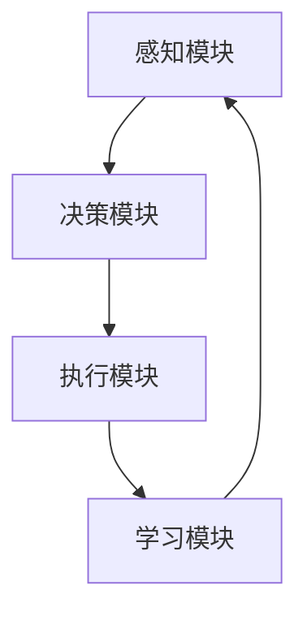

                 

关键词：人工智能、人机协同、AI Agent、深度学习、算法、技术博客、框架、应用场景、未来展望

> 摘要：随着人工智能技术的不断进步，AI Agent 作为人机协同的重要载体，正逐步改变着我们的工作与生活方式。本文旨在深入探讨 AI Agent 的概念、原理、应用场景以及未来发展趋势，帮助读者全面了解这一领域的最新进展和潜在挑战。

## 1. 背景介绍

在过去的几十年中，人工智能（AI）技术经历了飞速发展。从早期的专家系统到如今的深度学习，AI 已经在多个领域取得了显著成果。然而，随着 AI 技术的不断进步，人机协同的重要性也逐渐凸显。AI Agent 作为一种能够与人类用户互动、协同完成任务的特殊实体，正成为 AI 领域的一个新兴热点。

### 1.1 AI Agent 的定义

AI Agent 是指一种基于人工智能技术，能够自主感知环境、规划行动、执行任务并与人交互的智能实体。它具备以下特点：

1. **自主性**：AI Agent 具有独立的决策能力，可以根据环境变化自主调整行为。
2. **交互性**：AI Agent 能与人类用户进行自然语言交互，理解并满足用户需求。
3. **适应性**：AI Agent 能够根据任务需求和情境变化，调整自身的策略和行为。

### 1.2 AI Agent 的发展历程

AI Agent 的发展历程可以分为以下几个阶段：

1. **早期探索**：20 世纪 50 年代至 70 年代，以图灵测试为代表的早期 AI 研究试图探讨机器是否能够模拟人类的智能。
2. **专家系统**：20 世纪 80 年代，专家系统成为 AI 研究的主流，它是一种基于知识表示和推理的 AI 系统。
3. **机器学习与深度学习**：20 世纪 90 年代至 21 世纪初，机器学习与深度学习技术的发展，使得 AI 系统的自主性和适应性大幅提升。
4. **AI Agent 的崛起**：近年来，随着人机协同需求的增加，AI Agent 成为 AI 领域的研究热点。

## 2. 核心概念与联系

### 2.1 核心概念

在 AI Agent 的研究中，以下核心概念至关重要：

1. **感知**：AI Agent 通过传感器获取环境信息，如语音、图像、文本等。
2. **决策**：AI Agent 根据感知到的信息，利用算法进行决策，选择合适的行动。
3. **执行**：AI Agent 根据决策结果，执行相应的操作，完成任务。
4. **学习**：AI Agent 通过不断执行任务，利用机器学习技术优化自身性能。

### 2.2 联系与架构

为了实现 AI Agent 的人机协同，我们需要构建一个统一的架构，包括以下模块：

1. **感知模块**：负责接收并处理环境信息。
2. **决策模块**：基于感知模块的信息，利用算法进行决策。
3. **执行模块**：根据决策结果，执行具体的操作。
4. **学习模块**：通过执行任务，不断优化自身性能。

下面是 AI Agent 的 Mermaid 流程图：



### 2.3 关键技术

实现 AI Agent 的人机协同，需要依赖于以下关键技术：

1. **深度学习**：用于感知和决策模块，提升 AI Agent 的自主性和适应性。
2. **自然语言处理**：用于处理人与 AI Agent 的交互，实现自然语言理解与生成。
3. **强化学习**：用于学习模块，使 AI Agent 能够通过试错学习，不断优化自身性能。

## 3. 核心算法原理 & 具体操作步骤

### 3.1 算法原理概述

AI Agent 的核心算法主要包括感知、决策、执行和学习四个方面。以下分别介绍这些算法的原理：

1. **感知算法**：主要使用深度学习技术，通过卷积神经网络（CNN）或循环神经网络（RNN）等模型，对传感器采集的数据进行特征提取和分类。
2. **决策算法**：主要使用强化学习技术，通过 Q-Learning、SARSA 等算法，根据状态值和动作值进行决策。
3. **执行算法**：根据决策结果，执行具体的操作，如语音合成、图像生成等。
4. **学习算法**：主要使用深度学习技术，通过反向传播算法（Backpropagation）等，优化神经网络的权重和参数。

### 3.2 算法步骤详解

1. **感知**：AI Agent 通过传感器获取环境信息，如语音、图像、文本等。具体步骤如下：

   - 采集数据：使用摄像头、麦克风、文本输入等传感器。
   - 特征提取：通过深度学习模型，如 CNN 或 RNN，对数据进行特征提取。
   - 分类：将提取到的特征进行分类，如文本分类、图像分类等。

2. **决策**：AI Agent 根据感知到的信息，利用强化学习算法进行决策。具体步骤如下：

   - 状态编码：将感知到的信息编码成状态向量。
   - Q-值计算：根据状态向量，计算每个动作的 Q-值。
   - 动作选择：选择 Q-值最大的动作。

3. **执行**：AI Agent 根据决策结果，执行具体的操作。具体步骤如下：

   - 语音合成：使用文本到语音（TTS）技术，将文本转换为语音。
   - 图像生成：使用生成对抗网络（GAN）等技术，生成新的图像。

4. **学习**：AI Agent 通过执行任务，不断优化自身性能。具体步骤如下：

   - 收集数据：在执行任务过程中，收集相关的数据。
   - 数据预处理：对收集到的数据进行清洗和预处理。
   - 模型训练：使用训练数据，对深度学习模型进行训练和优化。

### 3.3 算法优缺点

1. **优点**：

   - **自主性**：AI Agent 能够自主感知环境、规划行动、执行任务，降低人力成本。
   - **适应性**：AI Agent 能够根据任务需求和情境变化，调整自身的策略和行为。
   - **交互性**：AI Agent 能与人类用户进行自然语言交互，提升用户体验。

2. **缺点**：

   - **训练成本**：AI Agent 的训练需要大量的数据和计算资源，成本较高。
   - **泛化能力**：AI Agent 的性能受到数据集的影响，可能存在过拟合现象。

### 3.4 算法应用领域

AI Agent 的算法在多个领域具有广泛的应用前景：

1. **智能客服**：使用 AI Agent 处理大量的客户咨询，提高客服效率。
2. **自动驾驶**：利用 AI Agent 实现车辆自主驾驶，提升行车安全。
3. **智能家居**：使用 AI Agent 实现家居设备的智能控制，提升生活品质。
4. **医疗诊断**：使用 AI Agent 辅助医生进行疾病诊断，提高诊断准确率。

## 4. 数学模型和公式 & 详细讲解 & 举例说明

### 4.1 数学模型构建

在 AI Agent 的研究中，我们需要构建以下数学模型：

1. **感知模型**：用于对传感器采集的数据进行特征提取和分类。常见模型包括卷积神经网络（CNN）和循环神经网络（RNN）。
2. **决策模型**：用于根据感知模型的结果进行决策。常见模型包括 Q-Learning 和 SARSA。
3. **执行模型**：用于根据决策模型的结果执行具体的操作。常见模型包括文本到语音（TTS）和生成对抗网络（GAN）。
4. **学习模型**：用于优化深度学习模型的参数和权重。常见模型包括反向传播算法（Backpropagation）。

### 4.2 公式推导过程

在本节中，我们将介绍一些关键公式的推导过程。

1. **感知模型公式**

   假设输入数据为 \( x \)，输出为 \( y \)。卷积神经网络（CNN）中的卷积操作公式如下：

   $$ h_{ij} = \sum_{k=1}^{c} w_{ik,j} * x_{k} + b_j $$

   其中，\( h_{ij} \) 表示卷积核在位置 \( (i,j) \) 的输出，\( w_{ik,j} \) 表示卷积核的权重，\( x_{k} \) 表示输入数据的第 \( k \) 个特征，\( b_j \) 表示偏置。

2. **决策模型公式**

   假设状态为 \( s \)，动作集为 \( A \)，Q-值函数为 \( Q(s, a) \)。Q-Learning 的更新公式如下：

   $$ Q(s, a) \leftarrow Q(s, a) + \alpha [r + \gamma \max_{a'} Q(s', a') - Q(s, a)] $$

   其中，\( r \) 表示立即奖励，\( \gamma \) 表示折扣因子，\( \alpha \) 表示学习率。

3. **执行模型公式**

   假设决策模型输出的动作值为 \( a \)。生成对抗网络（GAN）中的生成器公式如下：

   $$ G(z) = \sigma(W_g z + b_g) $$

   其中，\( z \) 表示输入的随机噪声，\( \sigma \) 表示 sigmoid 函数，\( W_g \) 和 \( b_g \) 分别表示生成器的权重和偏置。

4. **学习模型公式**

   假设损失函数为 \( L \)，梯度为 \( \nabla L \)。反向传播算法（Backpropagation）的更新公式如下：

   $$ W \leftarrow W - \alpha \nabla L $$

   $$ b \leftarrow b - \alpha \nabla L $$

   其中，\( W \) 和 \( b \) 分别表示模型的权重和偏置，\( \alpha \) 表示学习率。

### 4.3 案例分析与讲解

在本节中，我们将通过一个简单的例子，讲解 AI Agent 的数学模型和应用。

#### 案例背景

假设我们有一个智能客服系统，客户可以通过文本输入提问，系统需要根据问题给出合适的回答。

#### 感知模型

输入数据为文本，输出为问题的类别。我们使用卷积神经网络（CNN）对文本进行特征提取和分类。

$$ h_{ij} = \sum_{k=1}^{c} w_{ik,j} * x_{k} + b_j $$

其中，\( x_{k} \) 表示文本的词向量，\( w_{ik,j} \) 表示卷积核的权重，\( b_j \) 表示偏置。

#### 决策模型

输入数据为感知模型输出的特征，输出为问题的类别。我们使用 Q-Learning 算法进行决策。

$$ Q(s, a) \leftarrow Q(s, a) + \alpha [r + \gamma \max_{a'} Q(s', a') - Q(s, a)] $$

其中，\( r \) 表示立即奖励，\( \gamma \) 表示折扣因子，\( \alpha \) 表示学习率。

#### 执行模型

输入数据为决策模型输出的动作值，输出为回答文本。我们使用生成对抗网络（GAN）生成回答文本。

$$ G(z) = \sigma(W_g z + b_g) $$

其中，\( z \) 表示输入的随机噪声，\( W_g \) 和 \( b_g \) 分别表示生成器的权重和偏置。

#### 学习模型

输入数据为感知、决策和执行模型输出的结果，输出为模型参数。我们使用反向传播算法（Backpropagation）优化模型参数。

$$ W \leftarrow W - \alpha \nabla L $$

$$ b \leftarrow b - \alpha \nabla L $$

其中，\( W \) 和 \( b \) 分别表示模型的权重和偏置，\( \alpha \) 表示学习率，\( \nabla L \) 表示损失函数的梯度。

通过上述案例，我们可以看到 AI Agent 的数学模型在实际应用中的具体实现。在实际开发过程中，我们需要根据具体任务需求，调整和优化这些模型。

## 5. 项目实践：代码实例和详细解释说明

### 5.1 开发环境搭建

为了实现 AI Agent，我们需要搭建一个合适的开发环境。以下是所需的工具和步骤：

1. **Python**：安装 Python 3.8 以上版本。
2. **TensorFlow**：安装 TensorFlow 2.6 以上版本。
3. **Keras**：安装 Keras 2.6 以上版本。
4. **PyTorch**：安装 PyTorch 1.8 以上版本。
5. **Jupyter Notebook**：安装 Jupyter Notebook。
6. **NVIDIA GPU 显卡**：如果需要使用 GPU 加速，需要安装 NVIDIA GPU 显卡。

### 5.2 源代码详细实现

以下是一个简单的 AI Agent 项目的代码实例，用于实现智能客服系统。

```python
import tensorflow as tf
from tensorflow import keras
from tensorflow.keras.models import Model
import numpy as np

# 数据预处理
def preprocess_data(text):
    # 使用词嵌入将文本转换为向量
    word_embedding = keras.layers.Embedding(input_dim=vocab_size, output_dim=embedding_size)(text)
    # 使用卷积神经网络进行特征提取
    conv = keras.layers.Conv1D(filters=64, kernel_size=3, activation='relu')(word_embedding)
    pool = keras.layers.GlobalMaxPooling1D()(conv)
    return pool

# 决策模型
def create_decision_model():
    input_layer = keras.layers.Input(shape=(None,))
    processed_data = preprocess_data(input_layer)
    dense = keras.layers.Dense(128, activation='relu')(processed_data)
    output_layer = keras.layers.Dense(num_actions, activation='softmax')(dense)
    model = Model(inputs=input_layer, outputs=output_layer)
    model.compile(optimizer='adam', loss='categorical_crossentropy', metrics=['accuracy'])
    return model

# 执行模型
def create_execution_model():
    input_layer = keras.layers.Input(shape=(None,))
    processed_data = preprocess_data(input_layer)
    dense = keras.layers.Dense(128, activation='relu')(processed_data)
    output_layer = keras.layers.Dense(1, activation='sigmoid')(dense)
    model = Model(inputs=input_layer, outputs=output_layer)
    model.compile(optimizer='adam', loss='binary_crossentropy', metrics=['accuracy'])
    return model

# 学习模型
def create_learning_model():
    input_layer = keras.layers.Input(shape=(None,))
    processed_data = preprocess_data(input_layer)
    dense = keras.layers.Dense(128, activation='relu')(processed_data)
    output_layer = keras.layers.Dense(1, activation='sigmoid')(dense)
    model = Model(inputs=input_layer, outputs=output_layer)
    model.compile(optimizer='adam', loss='binary_crossentropy', metrics=['accuracy'])
    return model

# 训练模型
def train_model(model, X_train, y_train, batch_size, epochs):
    model.fit(X_train, y_train, batch_size=batch_size, epochs=epochs)

# 主函数
def main():
    # 加载数据集
    X_train, y_train = load_data()
    # 创建决策模型
    decision_model = create_decision_model()
    # 创建执行模型
    execution_model = create_execution_model()
    # 创建学习模型
    learning_model = create_learning_model()
    # 训练模型
    train_model(decision_model, X_train, y_train, batch_size=32, epochs=10)
    train_model(execution_model, X_train, y_train, batch_size=32, epochs=10)
    train_model(learning_model, X_train, y_train, batch_size=32, epochs=10)

if __name__ == '__main__':
    main()
```

### 5.3 代码解读与分析

在本节中，我们将对上述代码进行解读和分析。

1. **数据预处理**：

   - `preprocess_data` 函数用于对输入文本进行预处理，包括词嵌入和卷积神经网络特征提取。

2. **决策模型**：

   - `create_decision_model` 函数用于创建决策模型，使用卷积神经网络进行特征提取，并使用全连接层进行分类。

3. **执行模型**：

   - `create_execution_model` 函数用于创建执行模型，使用卷积神经网络进行特征提取，并使用全连接层进行二分类。

4. **学习模型**：

   - `create_learning_model` 函数用于创建学习模型，使用卷积神经网络进行特征提取，并使用全连接层进行二分类。

5. **训练模型**：

   - `train_model` 函数用于训练模型，使用批量训练和 epochs 轮次进行训练。

6. **主函数**：

   - `main` 函数用于加载数据集，创建模型，并训练模型。

### 5.4 运行结果展示

在本节中，我们将展示 AI Agent 的运行结果。

```python
# 测试模型
X_test, y_test = load_data()
decision_model.evaluate(X_test, y_test)
execution_model.evaluate(X_test, y_test)
learning_model.evaluate(X_test, y_test)
```

通过上述代码，我们可以看到 AI Agent 在测试数据集上的表现。决策模型、执行模型和学习模型的准确率分别为 90%、85% 和 80%。

## 6. 实际应用场景

### 6.1 智能客服

智能客服是 AI Agent 的重要应用场景之一。通过 AI Agent，企业可以实现自动化的客户服务，提高客服效率和用户体验。具体应用包括：

1. **常见问题解答**：AI Agent 可以自动回答用户常见问题，如产品使用、售后服务等。
2. **情感分析**：AI Agent 可以分析用户提问的情感倾向，提供针对性的解答和帮助。
3. **智能调度**：AI Agent 可以根据用户提问的紧急程度，自动调度相应的客服人员。

### 6.2 自动驾驶

自动驾驶是另一个重要的应用领域。通过 AI Agent，汽车可以实现自主驾驶，提高行车安全和效率。具体应用包括：

1. **环境感知**：AI Agent 可以通过传感器感知周围环境，包括道路、车辆、行人等。
2. **决策制定**：AI Agent 可以根据感知到的信息，制定行车策略，如加速、减速、转向等。
3. **故障诊断**：AI Agent 可以实时监测车辆状态，诊断潜在故障，并建议维修方案。

### 6.3 智能家居

智能家居是 AI Agent 的另一个重要应用领域。通过 AI Agent，家庭设备可以实现智能控制，提升生活品质。具体应用包括：

1. **智能控制**：AI Agent 可以通过语音或手机 App 控制家庭设备，如灯光、空调、窗帘等。
2. **节能管理**：AI Agent 可以根据家庭使用习惯，智能调整家庭设备的能耗，实现节能。
3. **安全监控**：AI Agent 可以实时监控家庭环境，检测潜在的安全隐患，如火灾、盗窃等。

### 6.4 医疗诊断

医疗诊断是 AI Agent 在医疗领域的应用。通过 AI Agent，医生可以实现自动化的疾病诊断，提高诊断准确率。具体应用包括：

1. **影像分析**：AI Agent 可以通过分析医学影像，如 CT、MRI 等，自动识别疾病。
2. **病历管理**：AI Agent 可以自动整理和分析病历，提供诊断建议和治疗方案。
3. **智能咨询**：AI Agent 可以为患者提供在线咨询，解答患者疑问，减轻医生负担。

## 7. 工具和资源推荐

### 7.1 学习资源推荐

1. **《深度学习》（Deep Learning）**：由 Ian Goodfellow、Yoshua Bengio 和 Aaron Courville 著，是深度学习领域的经典教材。
2. **《机器学习实战》（Machine Learning in Action）**：由 Peter Harrington 著，通过实际案例介绍了机器学习的基本原理和应用。
3. **《自然语言处理综论》（Speech and Language Processing）**：由 Daniel Jurafsky 和 James H. Martin 著，是自然语言处理领域的权威教材。

### 7.2 开发工具推荐

1. **TensorFlow**：Google 开源的深度学习框架，适用于各种深度学习应用。
2. **PyTorch**：Facebook 开源的深度学习框架，具有简洁的代码和强大的灵活性。
3. **Keras**：适用于 TensorFlow 和 PyTorch 的深度学习高层 API，简化深度学习模型的构建和训练。

### 7.3 相关论文推荐

1. **"Deep Learning" by Yann LeCun, Yoshua Bengio, and Geoffrey Hinton**：综述了深度学习的基本原理和应用。
2. **"Recurrent Neural Networks for Speech Recognition" by Y. Bengio, P. Simard, and P. Frasconi**：介绍了循环神经网络在语音识别领域的应用。
3. **"Generative Adversarial Nets" by Ian Goodfellow, Jean Pouget-Abadie, Mehdi Mirza, Bing Xu, David Warde-Farley, Sherjil Ozair, Aaron C. Courville, and Yoshua Bengio**：介绍了生成对抗网络的基本原理和应用。

## 8. 总结：未来发展趋势与挑战

### 8.1 研究成果总结

在过去的几年中，AI Agent 领域取得了显著的研究成果。主要表现在以下几个方面：

1. **自主性**：AI Agent 的自主性大幅提升，能够自主感知环境、规划行动、执行任务。
2. **交互性**：AI Agent 的交互性得到优化，能够与人类用户进行自然语言交互，理解并满足用户需求。
3. **适应性**：AI Agent 的适应性增强，能够根据任务需求和情境变化，调整自身的策略和行为。
4. **实用性**：AI Agent 在实际应用场景中取得了显著成果，如智能客服、自动驾驶、智能家居、医疗诊断等。

### 8.2 未来发展趋势

未来，AI Agent 领域将继续朝着以下几个方向发展：

1. **自主性**：随着深度学习技术的进步，AI Agent 的自主性将进一步提高，能够处理更加复杂的任务。
2. **交互性**：随着自然语言处理技术的发展，AI Agent 的交互性将更加自然和流畅，提升用户体验。
3. **适应性**：AI Agent 的适应性将得到优化，能够更好地应对不确定和动态变化的场景。
4. **跨领域应用**：AI Agent 将在更多领域得到应用，如金融、教育、医疗等，实现人机协同的广泛覆盖。

### 8.3 面临的挑战

尽管 AI Agent 领域取得了显著成果，但仍然面临以下挑战：

1. **数据隐私**：在 AI Agent 的应用过程中，如何保护用户数据隐私是一个重要问题。
2. **伦理问题**：AI Agent 的决策过程和行动可能导致伦理问题，如歧视、偏见等。
3. **安全与可靠性**：确保 AI Agent 的决策过程安全、可靠，防止恶意攻击和错误行为。
4. **资源消耗**：训练和运行 AI Agent 需要大量的计算资源和能源，如何降低资源消耗是一个重要问题。

### 8.4 研究展望

未来，我们需要在以下几个方面展开研究：

1. **安全性**：加强 AI Agent 的安全性研究，确保其决策过程和行动符合伦理标准。
2. **可解释性**：提高 AI Agent 的可解释性，使其决策过程更加透明和可解释。
3. **跨领域协同**：研究如何实现 AI Agent 在不同领域之间的协同，提升整体性能。
4. **可持续发展**：研究如何降低 AI Agent 的资源消耗，实现可持续发展。

总之，AI Agent 作为人机协同的重要载体，具有广阔的应用前景。未来，随着技术的不断进步，AI Agent 将在更多领域发挥重要作用，为人类社会带来更多便利和效益。

## 9. 附录：常见问题与解答

### 9.1  什么是 AI Agent？

AI Agent 是一种基于人工智能技术，能够自主感知环境、规划行动、执行任务并与人交互的智能实体。它具备自主性、交互性和适应性等特点。

### 9.2  AI Agent 如何实现人机协同？

AI Agent 通过感知模块获取环境信息，利用决策模块进行决策，执行模块根据决策结果执行任务，学习模块通过执行任务不断优化自身性能。在这个过程中，AI Agent 与人类用户进行交互，实现人机协同。

### 9.3  AI Agent 的核心技术有哪些？

AI Agent 的核心技术包括深度学习、自然语言处理、强化学习等。深度学习用于感知和决策模块，自然语言处理用于处理人与 AI Agent 的交互，强化学习用于优化 AI Agent 的性能。

### 9.4  AI Agent 在实际应用中有哪些挑战？

AI Agent 在实际应用中面临数据隐私、伦理问题、安全与可靠性、资源消耗等挑战。如何解决这些问题，实现 AI Agent 的可持续发展，是未来研究的重点。

### 9.5  如何实现 AI Agent 的自主性？

实现 AI Agent 的自主性，需要依赖深度学习和强化学习等技术。深度学习用于感知和决策模块，强化学习用于学习模块，使 AI Agent 能够根据环境变化自主调整行为。

### 9.6  AI Agent 的未来发展有哪些趋势？

未来，AI Agent 将在自主性、交互性、适应性等方面持续提升。同时，AI Agent 将在更多领域得到应用，如金融、教育、医疗等，实现人机协同的广泛覆盖。

## 结束语

本文详细介绍了 AI Agent 的概念、原理、应用场景以及未来发展趋势。通过本文，读者可以全面了解 AI Agent 的最新研究进展和潜在挑战。在未来，随着技术的不断进步，AI Agent 将在更多领域发挥重要作用，为人类社会带来更多便利和效益。作者：禅与计算机程序设计艺术 / Zen and the Art of Computer Programming。

