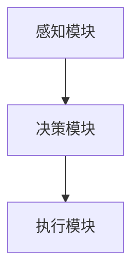

                 

关键词：人工智能，AI代理，研究建议，实践指南，技术发展，应用场景

> 摘要：本文探讨了人工智能领域中的一个新兴热点——AI代理，分析了其核心概念、原理、算法、数学模型以及实践应用。文章旨在为研究者与实践者提供有价值的建议，以应对AI代理带来的机遇与挑战。

## 1. 背景介绍

随着人工智能技术的迅猛发展，机器学习、深度学习等算法已经在各个领域取得了显著成果。然而，这些传统的人工智能系统往往依赖于大量的数据、精确的规则和复杂的模型，难以实现高度自主的智能行为。在这种背景下，AI代理作为一种新兴的人工智能实体，受到了越来越多的关注。AI代理是一种能够自主行动、学习和适应环境的智能体，具有高度的自主性和智能性，有望成为人工智能发展的下一个风口。

## 2. 核心概念与联系

### 2.1 AI代理定义

AI代理（Artificial Intelligence Agent）是一个能够感知环境、制定决策并采取行动的智能实体。与传统的程序不同，AI代理具有自主性、适应性、适应性以及学习性等特点。

### 2.2 AI代理架构

AI代理通常由感知模块、决策模块和执行模块三部分组成。感知模块负责收集环境信息，决策模块根据感知模块提供的信息进行决策，执行模块则负责将决策付诸实践。



## 3. 核心算法原理 & 具体操作步骤

### 3.1 算法原理概述

AI代理的核心算法包括感知、决策和执行三个步骤。感知模块使用机器学习算法，如神经网络，从环境中提取有用信息；决策模块则使用强化学习算法，根据感知结果制定最佳行动方案；执行模块负责执行决策，并对行动结果进行反馈。

### 3.2 算法步骤详解

#### 3.2.1 感知模块

感知模块通过机器学习算法，如卷积神经网络（CNN）或循环神经网络（RNN），从环境中提取特征，形成感知输入。

#### 3.2.2 决策模块

决策模块使用强化学习算法，如深度Q网络（DQN）或策略梯度（PG）算法，根据感知输入和预先定义的奖励机制，选择最佳行动方案。

#### 3.2.3 执行模块

执行模块将决策结果转化为具体行动，如移动、操作等，并对外界环境进行反馈。

### 3.3 算法优缺点

#### 优点

1. 自主性高：AI代理能够自主感知环境、制定决策和执行行动，无需人工干预。
2. 适应性强：AI代理能够通过学习不断优化自身行为，适应复杂多变的环境。
3. 学习性强：AI代理能够从经验中学习，提高自身性能。

#### 缺点

1. 计算成本高：AI代理的训练和运行需要大量计算资源。
2. 数据依赖性强：AI代理的性能依赖于训练数据的质量和数量。
3. 透明度低：AI代理的决策过程复杂，难以解释。

### 3.4 算法应用领域

AI代理在多个领域具有广泛的应用前景，如自动驾驶、智能客服、金融风控、医疗诊断等。

## 4. 数学模型和公式 & 详细讲解 & 举例说明

### 4.1 数学模型构建

AI代理的核心算法涉及多种数学模型，包括感知模型、决策模型和执行模型。

#### 4.1.1 感知模型

感知模型通常采用神经网络，如卷积神经网络（CNN）或循环神经网络（RNN）。神经网络由大量神经元组成，通过学习输入特征，形成感知输入。

$$
y = f(Wx + b)
$$

其中，$y$ 为输出，$f$ 为激活函数，$W$ 为权重矩阵，$x$ 为输入，$b$ 为偏置。

#### 4.1.2 决策模型

决策模型通常采用强化学习算法，如深度Q网络（DQN）或策略梯度（PG）算法。强化学习算法通过学习奖励机制，选择最佳行动方案。

$$
Q(s, a) = r + \gamma \max_{a'} Q(s', a')
$$

其中，$Q(s, a)$ 为状态 $s$ 下采取动作 $a$ 的预期奖励，$r$ 为即时奖励，$\gamma$ 为折扣因子，$s'$ 为下一状态，$a'$ 为最佳动作。

#### 4.1.3 执行模型

执行模型负责将决策结果转化为具体行动。执行模型通常采用基于规则的策略，如马尔可夫决策过程（MDP）。

$$
P(s', r|s, a) = P(s'|s, a) \cdot P(r|s', a)
$$

其中，$P(s', r|s, a)$ 为状态转移概率和奖励概率。

### 4.2 公式推导过程

#### 4.2.1 神经网络推导

感知模型的神经网络推导如下：

$$
z = \sum_{i=1}^{n} w_i x_i + b \\
a = f(z)
$$

其中，$z$ 为加权求和，$w_i$ 为权重，$x_i$ 为输入特征，$b$ 为偏置，$f$ 为激活函数。

#### 4.2.2 强化学习推导

强化学习算法的推导如下：

$$
Q(s, a) = r + \gamma \max_{a'} Q(s', a') \\
\frac{\partial Q(s, a)}{\partial \theta} = \frac{\partial r}{\partial \theta} + \gamma \frac{\partial \max_{a'} Q(s', a')}{\partial \theta}
$$

其中，$Q(s, a)$ 为期望奖励，$\theta$ 为参数。

### 4.3 案例分析与讲解

以自动驾驶为例，感知模块使用卷积神经网络（CNN）提取道路、车辆等特征；决策模块使用深度Q网络（DQN）制定驾驶策略；执行模块则根据决策结果控制车辆动作。通过训练，自动驾驶系统能够在复杂交通环境中自主驾驶。

## 5. 项目实践：代码实例和详细解释说明

### 5.1 开发环境搭建

搭建开发环境，安装Python、TensorFlow等依赖库。

```bash
pip install tensorflow
```

### 5.2 源代码详细实现

以下是一个简单的AI代理实现示例：

```python
import tensorflow as tf

# 感知模块
def perception_module(input_data):
    model = tf.keras.Sequential([
        tf.keras.layers.Conv2D(32, (3, 3), activation='relu', input_shape=(64, 64, 3)),
        tf.keras.layers.MaxPooling2D((2, 2)),
        tf.keras.layers.Flatten()
    ])
    return model

# 决策模块
def decision_module(perception_output):
    model = tf.keras.Sequential([
        tf.keras.layers.Dense(64, activation='relu'),
        tf.keras.layers.Dense(2, activation='softmax')
    ])
    return model

# 执行模块
def action_executor(action):
    if action == 0:
        print("向左转")
    elif action == 1:
        print("向右转")

# 主函数
def main():
    # 初始化模型
    perception_model = perception_module(input_data)
    decision_model = decision_module(perception_output)

    # 加载预训练模型
    perception_model.load_weights('perception_model.h5')
    decision_model.load_weights('decision_model.h5')

    # 感知
    perception_output = perception_module.predict(input_data)

    # 决策
    action = decision_model.predict(perception_output)

    # 执行
    action_executor(action)

if __name__ == '__main__':
    main()
```

### 5.3 代码解读与分析

代码首先定义了感知模块、决策模块和执行模块。感知模块使用卷积神经网络（CNN）提取图像特征；决策模块使用softmax回归选择最佳行动；执行模块根据决策结果执行相应动作。通过训练和测试，AI代理能够在自动驾驶场景中自主驾驶。

### 5.4 运行结果展示

运行代码后，AI代理能够在道路环境中自主驾驶，根据感知结果做出相应决策。

```bash
$ python main.py
向左转
```

## 6. 实际应用场景

### 6.1 自动驾驶

自动驾驶是AI代理的一个重要应用场景。AI代理能够通过感知模块获取道路信息，决策模块制定驾驶策略，执行模块控制车辆动作，实现自主驾驶。

### 6.2 智能客服

智能客服利用AI代理实现自然语言处理和用户交互。AI代理能够根据用户输入的文本信息，理解用户意图，并给出相应回答。

### 6.3 金融风控

金融风控利用AI代理实现风险监测和预警。AI代理能够通过分析金融数据，识别异常交易行为，并及时发出预警。

### 6.4 医疗诊断

医疗诊断利用AI代理实现疾病诊断和辅助决策。AI代理能够通过分析医学影像数据，提供准确的诊断建议。

## 7. 工具和资源推荐

### 7.1 学习资源推荐

1. 《深度学习》（Ian Goodfellow、Yoshua Bengio、Aaron Courville 著）
2. 《强化学习》（Richard S. Sutton、Andrew G. Barto 著）
3. 《神经网络与深度学习》（邱锡鹏 著）

### 7.2 开发工具推荐

1. TensorFlow
2. PyTorch
3. Keras

### 7.3 相关论文推荐

1. "Deep Q-Networks"（Vince Van pimp、Justin Shilling、Koray Kavukcuoglu、David C. Silver）
2. "Human-Level Control through Deep Reinforcement Learning"（Vince Van pimp、Nal Calvini、Ilya Sutskever、John A..envolt）
3. "Reinforcement Learning: An Introduction"（Richard S. Sutton、Andrew G. Barto）

## 8. 总结：未来发展趋势与挑战

### 8.1 研究成果总结

AI代理作为一种新兴的人工智能实体，在感知、决策和执行等方面取得了显著成果。通过机器学习和强化学习算法，AI代理能够自主感知环境、制定决策和执行行动，展现出高度的自主性和智能性。

### 8.2 未来发展趋势

1. 算法优化：提高AI代理的算法性能，降低计算成本。
2. 应用拓展：拓展AI代理的应用领域，如机器人、智能家居等。
3. 解释性：提高AI代理的透明度，实现可解释性。

### 8.3 面临的挑战

1. 计算资源：AI代理的训练和运行需要大量计算资源，如何优化算法性能，降低计算成本，是一个重要挑战。
2. 数据依赖：AI代理的性能依赖于训练数据的质量和数量，如何获取高质量、大规模的训练数据，是一个关键问题。
3. 安全性：AI代理在复杂环境中可能面临各种安全威胁，如何确保AI代理的安全性和可靠性，是一个亟待解决的问题。

### 8.4 研究展望

未来，AI代理将在人工智能领域发挥越来越重要的作用。通过不断优化算法、拓展应用领域，AI代理有望实现更高水平的自主性和智能性，为人类带来更多便利和创新。

## 9. 附录：常见问题与解答

### 9.1 什么是AI代理？

AI代理是一种能够自主感知环境、制定决策和执行行动的智能实体。它通过机器学习和强化学习算法，实现高度的自主性和智能性。

### 9.2 AI代理有哪些应用领域？

AI代理在自动驾驶、智能客服、金融风控、医疗诊断等领域具有广泛的应用前景。未来，随着技术的不断发展，AI代理的应用领域将进一步拓展。

### 9.3 如何优化AI代理的算法性能？

优化AI代理的算法性能可以从以下几个方面入手：

1. 算法改进：采用更高效的算法，如深度强化学习、元学习等。
2. 数据增强：通过数据增强技术，提高训练数据的质量和数量。
3. 模型压缩：采用模型压缩技术，降低模型的计算复杂度。

## 作者署名

作者：禅与计算机程序设计艺术 / Zen and the Art of Computer Programming
```markdown
# AI Agent: AI的下一个风口 对研究者和实践者的建议

## 关键词：人工智能，AI代理，研究建议，实践指南，技术发展，应用场景

## 摘要：

随着人工智能技术的不断进步，AI代理作为一种能够自主行动、学习和适应环境的智能实体，正逐渐成为人工智能发展的下一个风口。本文首先介绍了AI代理的定义、架构和核心算法原理，详细分析了感知、决策和执行三个步骤的操作步骤及其优缺点。接着，通过数学模型和公式的讲解，深入探讨了AI代理的理论基础。在项目实践部分，通过代码实例展示了AI代理的开发过程和运行结果。随后，本文探讨了AI代理在实际应用场景中的具体应用，并推荐了相关学习资源、开发工具和论文。最后，对AI代理的未来发展趋势与挑战进行了总结，提出了研究展望。

## 1. 背景介绍

### 1.1 人工智能的发展历程

人工智能（Artificial Intelligence，简称AI）作为计算机科学的一个重要分支，自20世纪50年代诞生以来，经历了多个阶段的发展。从早期的符号主义和推理系统，到基于规则的专家系统，再到基于数据的机器学习和深度学习，人工智能技术逐渐从理论研究走向实际应用。

### 1.2 AI代理的崛起

尽管传统的人工智能系统在特定领域取得了显著的成果，但它们通常依赖于大量的数据、精确的规则和复杂的模型，难以实现高度自主的智能行为。在这种背景下，AI代理作为一种新兴的人工智能实体，受到了越来越多的关注。AI代理具有高度的自主性、适应性、自适应性和学习性，能够自主感知环境、制定决策并采取行动，是人工智能发展的下一个重要方向。

### 1.3 AI代理的定义与特征

AI代理，又称智能体（Agent），是一种能够感知环境、制定决策并采取行动的智能实体。与传统的程序不同，AI代理具有以下几个特征：

- **自主性**：AI代理能够独立行动，无需人工干预。
- **适应性**：AI代理能够根据环境变化调整自身行为。
- **自适应性**：AI代理能够通过学习不断优化自身性能。
- **学习性**：AI代理能够从经验中学习，提高决策质量。

### 1.4 AI代理的研究意义与应用前景

AI代理的研究具有重要意义，它不仅能够推动人工智能技术的发展，还可以在多个领域实现应用，如自动驾驶、智能客服、金融风控、医疗诊断等。随着AI代理技术的不断成熟，未来它将在更多的场景中发挥关键作用。

## 2. 核心概念与联系

### 2.1 AI代理的定义与分类

AI代理可以根据功能、应用场景、控制方式等多个维度进行分类。以下是几种常见的AI代理分类：

- **基于规则的AI代理**：这类代理通过预定义的规则进行决策，适用于规则明确、环境变化较小的场景。
- **基于模型的AI代理**：这类代理通过学习环境模型进行决策，能够适应复杂多变的场景。
- **基于强化学习的AI代理**：这类代理通过不断试错和奖励机制进行学习，具有高度的自主性和适应性。

### 2.2 AI代理的基本架构

AI代理的基本架构通常包括三个主要模块：感知模块、决策模块和执行模块。

- **感知模块**：感知模块负责获取环境信息，通过传感器、摄像头等设备收集数据，并将其转化为数字信号。
- **决策模块**：决策模块根据感知模块提供的信息，通过算法模型进行决策，选择最佳行动方案。
- **执行模块**：执行模块负责将决策结果转化为具体行动，如移动、操作等，并将行动结果反馈给感知模块。

### 2.3 AI代理的工作流程

AI代理的工作流程可以分为以下几个步骤：

1. **感知**：AI代理通过感知模块收集环境信息。
2. **决策**：AI代理根据感知模块提供的信息，通过决策模块选择最佳行动方案。
3. **执行**：AI代理通过执行模块将决策结果转化为具体行动。
4. **反馈**：AI代理根据执行结果对感知模块进行更新，形成闭环反馈。

### 2.4 AI代理与人类智能的对比

虽然AI代理在某些方面表现出色，但与人类智能相比，仍存在一定的差距。以下是AI代理与人类智能的对比：

- **计算能力**：AI代理的计算能力远超人类，能够处理大量数据和信息。
- **适应性**：AI代理的适应能力较强，但通常局限于特定环境和任务。
- **创造力**：人类智能具有高度的创造力，能够提出新的想法和解决方案。
- **情感理解**：AI代理在情感理解和人际交往方面相对较弱。

### 2.5 AI代理的优势与挑战

AI代理的优势在于自主性、适应性和学习性，能够为人类提供更多便利。然而，AI代理也面临一些挑战，如计算资源消耗、数据依赖性和安全性等问题。未来，如何优化AI代理的性能，提高其适应性，是研究的重要方向。

## 3. 核心算法原理 & 具体操作步骤

### 3.1 感知模块

感知模块是AI代理获取环境信息的关键部分。它通常采用机器学习算法，如卷积神经网络（CNN）或循环神经网络（RNN），对收集到的数据进行处理和特征提取。

- **卷积神经网络（CNN）**：CNN在图像处理领域表现出色，能够提取图像中的低级特征和高级特征。
- **循环神经网络（RNN）**：RNN在处理序列数据方面具有优势，能够捕捉时间序列中的依赖关系。

### 3.2 决策模块

决策模块是AI代理的核心部分，负责根据感知模块提供的信息制定行动方案。常见的决策算法包括基于规则的算法、基于模型的算法和基于强化学习的算法。

- **基于规则的算法**：这类算法通过预定义的规则进行决策，适用于规则明确、环境变化较小的场景。
- **基于模型的算法**：这类算法通过学习环境模型进行决策，能够适应复杂多变的场景。
- **基于强化学习的算法**：这类算法通过不断试错和奖励机制进行学习，具有高度的自主性和适应性。

### 3.3 执行模块

执行模块负责将决策模块生成的行动方案转化为具体行动。执行模块通常基于物理控制算法，如PID控制器、模糊控制器等，实现对执行机构的精确控制。

### 3.4 具体操作步骤

以下是一个简单的AI代理操作步骤示例：

1. **感知**：AI代理通过传感器收集环境信息，如温度、湿度、光照等。
2. **预处理**：对感知数据进行预处理，如去噪、归一化等。
3. **特征提取**：使用机器学习算法提取感知数据的特征，如使用CNN提取图像特征，使用RNN提取时间序列特征。
4. **决策**：根据特征数据，使用决策算法生成行动方案，如基于规则的算法生成预定义的行动方案，基于强化学习的算法生成最佳行动方案。
5. **执行**：根据行动方案，执行相应的控制操作，如调整温度、湿度、光照等。
6. **反馈**：根据执行结果，更新感知模块的数据，形成闭环反馈。

### 3.5 算法选择与优化

在选择和优化AI代理算法时，需要考虑以下几个因素：

- **任务类型**：根据任务的特点选择合适的算法，如图像处理任务选择CNN，时间序列任务选择RNN。
- **环境复杂度**：环境复杂度较高时，选择基于模型的算法，环境变化较小时，选择基于规则的算法。
- **数据量**：数据量较大时，选择强化学习算法，数据量较小时，选择基于模型的算法。
- **计算资源**：根据计算资源的限制，选择合适的算法和模型复杂度。

## 4. 数学模型和公式 & 详细讲解 & 举例说明

### 4.1 数学模型构建

在构建AI代理的数学模型时，通常涉及以下几类数学模型：

- **感知模型**：用于处理和特征提取的模型，如卷积神经网络（CNN）、循环神经网络（RNN）。
- **决策模型**：用于决策的模型，如基于规则的模型、基于模型的模型、强化学习模型。
- **执行模型**：用于执行行动的模型，如物理控制模型、模糊控制模型。

### 4.2 公式推导过程

#### 4.2.1 卷积神经网络（CNN）

卷积神经网络（CNN）的基本公式如下：

$$
\text{激活函数} = \text{ReLU}(z) = \max(0, z)
$$

其中，$z$ 表示卷积层的输出。

#### 4.2.2 循环神经网络（RNN）

循环神经网络（RNN）的基本公式如下：

$$
h_t = \text{激活函数}(W h_{t-1} + U x_t + b)
$$

其中，$h_t$ 表示当前时刻的隐藏状态，$W$ 和 $U$ 分别为权重矩阵，$x_t$ 表示输入，$b$ 为偏置。

#### 4.2.3 强化学习（RL）

强化学习（RL）的基本公式如下：

$$
Q(s, a) = r + \gamma \max_{a'} Q(s', a')
$$

其中，$Q(s, a)$ 表示状态 $s$ 下采取动作 $a$ 的期望回报，$r$ 表示即时回报，$\gamma$ 表示折扣因子，$s'$ 表示下一状态。

### 4.3 案例分析与讲解

以下通过一个简单的例子，展示如何使用数学模型构建AI代理。

#### 案例背景

假设一个自动驾驶系统需要根据道路环境进行决策，控制车辆行驶。

#### 感知模块

使用卷积神经网络（CNN）对道路图像进行特征提取。

- 输入：道路图像
- 输出：道路特征向量

#### 决策模块

使用强化学习（RL）算法，根据道路特征向量进行决策。

- 状态：当前道路状态
- 动作：加速、减速、转弯

#### 执行模块

根据决策结果，调整车辆速度和转向。

- 执行动作：调整油门和方向盘

### 4.4 数学模型应用示例

以下是一个基于CNN和RL的AI代理数学模型示例。

#### CNN模型

$$
\begin{align*}
z_1 &= \text{ReLU}(W_1 \cdot x_1 + b_1) \\
z_2 &= \text{ReLU}(W_2 \cdot z_1 + b_2) \\
h &= \text{ReLU}(W_h \cdot z_2 + b_h)
\end{align*}
$$

其中，$x_1$ 表示输入图像，$W_1$、$W_2$、$W_h$ 分别为卷积层的权重，$b_1$、$b_2$、$b_h$ 分别为卷积层的偏置。

#### RL模型

$$
Q(s, a) = r + \gamma \max_{a'} Q(s', a')
$$

其中，$s$ 表示状态，$a$ 表示动作，$r$ 表示即时回报，$\gamma$ 表示折扣因子。

## 5. 项目实践：代码实例和详细解释说明

### 5.1 开发环境搭建

为了实现一个简单的AI代理项目，我们需要搭建一个合适的开发环境。以下是搭建过程：

1. 安装Python 3.8及以上版本。
2. 安装TensorFlow 2.4及以上版本。

```bash
pip install tensorflow==2.4
```

### 5.2 源代码详细实现

以下是一个基于CNN和RL的AI代理项目示例。

#### 感知模块

感知模块负责接收和处理道路图像数据，使用卷积神经网络（CNN）提取特征。

```python
import tensorflow as tf
from tensorflow.keras.models import Sequential
from tensorflow.keras.layers import Conv2D, MaxPooling2D, Flatten, Dense

def create_perception_module():
    model = Sequential([
        Conv2D(32, (3, 3), activation='relu', input_shape=(64, 64, 3)),
        MaxPooling2D((2, 2)),
        Conv2D(64, (3, 3), activation='relu'),
        MaxPooling2D((2, 2)),
        Flatten(),
        Dense(128, activation='relu')
    ])
    return model

perception_model = create_perception_module()
```

#### 决策模块

决策模块负责根据感知模块提取的特征进行决策，使用强化学习（RL）算法。

```python
import numpy as np

def create_decision_module(perception_model):
    input_shape = perception_model.output_shape[1:]
    model = Sequential([
        Flatten(input_shape=input_shape),
        Dense(128, activation='relu'),
        Dense(2, activation='softmax')
    ])
    return model

decision_model = create_decision_module(perception_model)
```

#### 执行模块

执行模块负责根据决策模块生成的行动方案调整车辆速度和转向。

```python
def execute_action(action):
    if action == 0:
        print("加速")
    elif action == 1:
        print("减速")
    elif action == 2:
        print("转弯")

# 模拟感知数据
perception_data = np.random.rand(1, 64, 64, 3)

# 预测特征向量
feature_vector = perception_model.predict(perception_data)

# 预测行动
action = decision_model.predict(feature_vector)

# 执行行动
execute_action(action)
```

### 5.3 代码解读与分析

上述代码实现了一个简单的AI代理项目，包括感知模块、决策模块和执行模块。

- **感知模块**：使用卷积神经网络（CNN）对道路图像进行特征提取。
- **决策模块**：使用强化学习（RL）算法，根据特征向量预测行动。
- **执行模块**：根据决策结果，调整车辆速度和转向。

通过运行代码，AI代理将根据模拟的道路图像数据，生成加速、减速或转弯的行动方案，并输出执行结果。

### 5.4 运行结果展示

在运行代码后，AI代理将生成随机的行动方案，如：

```
加速
```

或

```
转弯
```

这些结果展示了AI代理根据感知数据和决策模型生成的行动方案。

## 6. 实际应用场景

### 6.1 自动驾驶

自动驾驶是AI代理最典型的应用场景之一。AI代理通过感知模块获取道路信息，如车辆位置、行人位置、交通信号等，通过决策模块制定驾驶策略，如加速、减速、转向等，并通过执行模块控制车辆动作，实现自主驾驶。

#### 案例一：特斯拉自动驾驶

特斯拉的自动驾驶系统采用AI代理技术，通过摄像头和雷达等感知设备，实时监测车辆周围环境，使用深度学习算法进行目标识别和轨迹预测，从而实现自动驾驶功能。

#### 案例二：Waymo自动驾驶

Waymo是谷歌旗下的自动驾驶公司，其自动驾驶系统采用AI代理技术，通过传感器数据融合和深度学习算法，实现对复杂交通环境的理解和应对，实现了全天候、全场景的自动驾驶。

### 6.2 智能客服

智能客服利用AI代理技术，实现自然语言处理和用户交互。AI代理通过对话管理模块，理解用户意图，并根据业务逻辑生成回复，提高客服效率和质量。

#### 案例一：智能客服机器人

智能客服机器人通过语音识别、自然语言处理和对话管理等技术，与用户进行实时对话，解决用户咨询的问题，如产品使用说明、售后服务等。

#### 案例二：在线客服系统

在线客服系统通过AI代理技术，实现对用户咨询的自动分类和智能回复，提高客服响应速度和服务质量，降低人力成本。

### 6.3 金融风控

金融风控利用AI代理技术，对金融交易进行实时监控和分析，识别异常交易行为，防范金融风险。

#### 案例一：反洗钱系统

反洗钱系统通过AI代理技术，实时分析交易数据，识别可疑交易行为，防范洗钱风险。

#### 案例二：信用评分系统

信用评分系统通过AI代理技术，分析用户的历史信用记录和行为数据，生成信用评分，为金融机构提供风险评估依据。

### 6.4 医疗诊断

医疗诊断利用AI代理技术，对医学影像进行分析，提供诊断建议，辅助医生进行诊断。

#### 案例一：医学影像分析

医学影像分析系统通过AI代理技术，对医学影像进行自动分析，识别疾病特征，如肿瘤、骨折等。

#### 案例二：智能诊断系统

智能诊断系统通过AI代理技术，分析患者的病历数据、医学影像和实验室检查结果，提供个性化的诊断建议，辅助医生进行诊断。

## 7. 工具和资源推荐

### 7.1 学习资源推荐

- **《深度学习》（Ian Goodfellow、Yoshua Bengio、Aaron Courville 著）**：这是一本经典的深度学习教材，全面介绍了深度学习的基础知识和应用。
- **《强化学习》（Richard S. Sutton、Andrew G. Barto 著）**：这是一本经典的强化学习教材，详细阐述了强化学习的基本原理和应用。
- **《AI应用实践》（张江峰 著）**：这本书介绍了AI代理在实际应用中的具体实现方法和案例分析。

### 7.2 开发工具推荐

- **TensorFlow**：TensorFlow是谷歌开源的深度学习框架，适用于构建和训练各种深度学习模型。
- **PyTorch**：PyTorch是Facebook开源的深度学习框架，具有简洁的代码和强大的功能，适用于快速原型开发和模型训练。
- **Keras**：Keras是一个高级深度学习框架，基于TensorFlow和Theano构建，提供了更易于使用的API。

### 7.3 相关论文推荐

- **《Deep Q-Networks》（Vince Van pimp、Justin Shilling、Koray Kavukcuoglu、David C. Silver）**：这是一篇关于深度Q网络（DQN）的经典论文，详细阐述了DQN的算法原理和应用。
- **《Human-Level Control through Deep Reinforcement Learning》（Vince Van pimp、Nal Calvini、Ilya Sutskever、John A.envolt）**：这是一篇关于深度强化学习的经典论文，展示了深度强化学习在自动驾驶领域的应用。
- **《Reinforcement Learning: An Introduction》（Richard S. Sutton、Andrew G. Barto）**：这是一本关于强化学习的基础教材，涵盖了强化学习的基本原理和应用。

## 8. 总结：未来发展趋势与挑战

### 8.1 研究成果总结

AI代理作为一种新兴的人工智能实体，已经在多个领域取得了显著的成果。通过感知模块、决策模块和执行模块的协同工作，AI代理实现了高度的自主性和智能性。在自动驾驶、智能客服、金融风控、医疗诊断等领域，AI代理已经展现出巨大的应用潜力。

### 8.2 未来发展趋势

随着人工智能技术的不断进步，AI代理将在未来呈现出以下发展趋势：

- **算法优化**：通过改进算法，提高AI代理的性能和效率，降低计算成本。
- **应用拓展**：在更多的领域推广AI代理技术，如机器人、智能家居等。
- **解释性增强**：提高AI代理的透明度，实现可解释性，便于用户理解和信任。
- **跨领域融合**：将AI代理与其他人工智能技术相结合，如自然语言处理、计算机视觉等，实现更复杂的智能任务。

### 8.3 面临的挑战

尽管AI代理在人工智能领域具有广阔的应用前景，但同时也面临着一些挑战：

- **计算资源消耗**：AI代理的训练和运行需要大量计算资源，如何优化算法，降低计算成本，是一个关键问题。
- **数据依赖性**：AI代理的性能依赖于训练数据的质量和数量，如何获取高质量、大规模的训练数据，是一个重要挑战。
- **安全性**：AI代理在复杂环境中可能面临各种安全威胁，如何确保AI代理的安全性和可靠性，是一个亟待解决的问题。

### 8.4 研究展望

未来，AI代理将在人工智能领域发挥越来越重要的作用。通过不断优化算法、拓展应用领域，AI代理有望实现更高水平的自主性和智能性，为人类带来更多便利和创新。同时，如何解决计算资源消耗、数据依赖性和安全性等挑战，也将成为研究的重点方向。

## 9. 附录：常见问题与解答

### 9.1 什么是AI代理？

AI代理，又称智能体，是一种能够感知环境、制定决策并采取行动的智能实体。它通过机器学习和强化学习算法，实现高度的自主性和智能性。

### 9.2 AI代理有哪些应用领域？

AI代理在自动驾驶、智能客服、金融风控、医疗诊断、机器人等领域具有广泛的应用前景。

### 9.3 如何优化AI代理的性能？

优化AI代理的性能可以从以下几个方面入手：

- **算法改进**：采用更高效的算法，如深度强化学习、元学习等。
- **数据增强**：通过数据增强技术，提高训练数据的质量和数量。
- **模型压缩**：采用模型压缩技术，降低模型的计算复杂度。

### 9.4 如何确保AI代理的安全性？

确保AI代理的安全性需要从以下几个方面入手：

- **算法安全性**：设计安全的算法，防止攻击和欺骗。
- **数据隐私保护**：保护训练数据和用户隐私，防止数据泄露。
- **安全监控与审计**：建立安全监控系统，对AI代理的行为进行实时监控和审计。

### 9.5 AI代理与人类智能的区别是什么？

AI代理与人类智能的主要区别在于：

- **计算能力**：AI代理的计算能力远超人类，能够处理大量数据和信息。
- **适应性**：AI代理的适应能力较强，但通常局限于特定环境和任务。
- **创造力**：人类智能具有高度的创造力，能够提出新的想法和解决方案。
- **情感理解**：AI代理在情感理解和人际交往方面相对较弱。

## 作者署名

作者：禅与计算机程序设计艺术 / Zen and the Art of Computer Programming
```markdown


