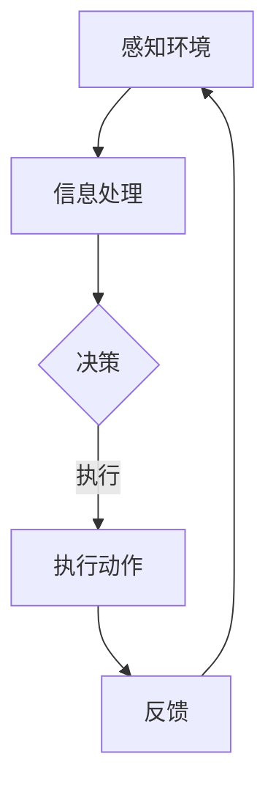

                 

关键词：人工智能，模拟，组织结构，工作流程，AI Agent，自动化，智能化，代理系统

> 摘要：本文将探讨人工智能领域中的一个新兴概念——AI Agent，它通过模拟真实世界的组织结构与工作流程，为自动化和智能化带来了新的契机。文章将深入分析AI Agent的核心概念、架构设计、算法原理、数学模型，并通过项目实践和实际应用场景展示其在现实世界中的潜力。

## 1. 背景介绍

随着人工智能技术的不断进步，传统的自动化系统逐渐显得力不从心。自动化系统往往依赖于预先设定的规则和程序，缺乏灵活性，难以应对复杂多变的环境。人工智能，尤其是基于深度学习的算法，已经开始在图像识别、自然语言处理、决策制定等领域展现出强大的能力。然而，如何将这些能力与真实世界的组织结构与工作流程相结合，实现更高级别的智能化和自动化，成为当前人工智能研究的一个重要方向。

AI Agent作为一个模拟真实世界中个体行为的实体，具有高度自主性、适应性、学习性和协同性。它不仅能够处理复杂任务，还能在动态环境中自主学习和优化行为，从而实现智能化的工作流程。AI Agent的提出，为人工智能的发展提供了一个新的视角，有望引领下一波技术革命。

## 2. 核心概念与联系

### 2.1 AI Agent的定义

AI Agent是指一种具有自主意识和行动能力的计算机程序，它可以模拟人类或组织的行为，执行特定任务，并在执行过程中不断学习和优化。AI Agent的核心特征包括：

- **自主性**：AI Agent可以自主决策，无需人工干预。
- **适应性**：AI Agent能够根据环境变化调整自身行为。
- **学习性**：AI Agent可以通过经验学习提高任务执行效率。
- **协同性**：AI Agent可以与其他Agent协同工作，完成复杂任务。

### 2.2 AI Agent与真实世界的联系

AI Agent的架构设计旨在模拟真实世界的组织结构与工作流程。以下是几个关键联系点：

- **组织结构模拟**：AI Agent可以模拟真实组织中的部门、角色和职责，从而实现高效的分工与合作。
- **工作流程模拟**：AI Agent可以模拟真实工作流程中的各个环节，如需求分析、任务分配、进度控制、结果评估等。
- **环境交互**：AI Agent可以通过传感器与环境进行交互，获取环境信息，并据此调整行为。

### 2.3 Mermaid 流程图

以下是一个简单的Mermaid流程图，展示了AI Agent的基本架构：



- **感知环境**：AI Agent通过传感器获取环境信息。
- **信息处理**：AI Agent对获取的信息进行预处理和分析。
- **决策**：AI Agent基于分析结果做出决策。
- **执行动作**：AI Agent执行决策中的具体动作。
- **反馈**：AI Agent根据执行结果和环境反馈调整行为。

## 3. 核心算法原理 & 具体操作步骤

### 3.1 算法原理概述

AI Agent的核心算法通常包括以下几个模块：

- **感知模块**：用于感知环境，获取必要的信息。
- **决策模块**：用于根据感知信息做出决策。
- **执行模块**：用于执行决策中的具体动作。
- **反馈模块**：用于收集执行结果和环境反馈。

这些模块通过信息流相互连接，形成一个闭环系统，使得AI Agent能够在动态环境中持续优化行为。

### 3.2 算法步骤详解

#### 感知模块

感知模块负责获取环境信息，可以通过传感器、摄像头、麦克风等多种方式实现。获取的信息包括但不限于：

- **图像**：用于识别物体、场景等。
- **声音**：用于识别语言、声音特征等。
- **文本**：用于分析文本内容、情感等。
- **传感器数据**：用于获取温度、湿度、位置等。

#### 决策模块

决策模块负责根据感知模块提供的信息做出决策。常见的决策算法包括：

- **基于规则的决策**：根据预设的规则进行判断。
- **机器学习决策**：通过训练模型进行预测和分类。
- **深度学习决策**：通过神经网络进行复杂模式识别。

#### 执行模块

执行模块负责执行决策中的具体动作。这些动作可以是简单的如移动、点击，也可以是复杂的如对话生成、任务执行。

#### 反馈模块

反馈模块负责收集执行结果和环境反馈，用于下一轮感知和决策的调整。反馈机制可以是正向反馈，也可以是反向反馈，旨在优化AI Agent的行为。

### 3.3 算法优缺点

#### 优点

- **自主性**：AI Agent可以自主决策和执行任务，减少人工干预。
- **适应性**：AI Agent能够根据环境变化调整行为，适应复杂多变的环境。
- **学习性**：AI Agent可以通过经验学习提高任务执行效率，不断优化自身行为。
- **协同性**：AI Agent可以与其他Agent协同工作，完成复杂任务。

#### 缺点

- **计算资源需求高**：AI Agent通常需要大量的计算资源进行感知、决策和执行。
- **数据依赖性**：AI Agent的性能高度依赖于训练数据的质量和数量。
- **隐私问题**：AI Agent在获取和处理数据时可能涉及用户隐私。

### 3.4 算法应用领域

AI Agent的应用领域非常广泛，包括但不限于：

- **智能助手**：如智能语音助手、聊天机器人等。
- **自动化生产线**：如工业自动化、智能物流等。
- **智能城市**：如交通管理、环境监测等。
- **医疗健康**：如疾病预测、远程诊断等。
- **金融科技**：如风险管理、量化交易等。

## 4. 数学模型和公式 & 详细讲解 & 举例说明

### 4.1 数学模型构建

AI Agent的核心算法通常涉及多种数学模型，包括但不限于：

- **感知模型**：如卷积神经网络（CNN）、循环神经网络（RNN）等。
- **决策模型**：如决策树、支持向量机（SVM）、深度强化学习（DRL）等。
- **执行模型**：如策略梯度、Q-learning等。

以下是一个简单的感知模型的数学表示：

$$
f(x) = \sigma(\omega_0 + \omega_1 x_1 + \omega_2 x_2 + \ldots + \omega_n x_n)
$$

其中，$x$ 表示输入特征，$f(x)$ 表示输出结果，$\sigma$ 表示激活函数，$\omega$ 表示权重参数。

### 4.2 公式推导过程

以感知模型为例，其公式推导过程如下：

1. **定义输入特征**：假设输入特征为 $x_1, x_2, \ldots, x_n$。
2. **定义权重参数**：假设权重参数为 $\omega_1, \omega_2, \ldots, \omega_n$。
3. **计算加权和**：计算输入特征的加权和，即 $z = \omega_0 + \omega_1 x_1 + \omega_2 x_2 + \ldots + \omega_n x_n$。
4. **应用激活函数**：将加权和应用激活函数 $\sigma$，即 $f(x) = \sigma(z)$。
5. **优化参数**：通过梯度下降等优化算法，不断调整权重参数，以最小化损失函数。

### 4.3 案例分析与讲解

以智能语音助手为例，其感知模型的输入特征可以是语音信号的时频特征，输出结果可以是语音识别的文字内容。以下是一个具体的案例：

1. **输入特征**：假设输入特征为 $x_1, x_2, \ldots, x_n$，表示一个语音信号的时频特征。
2. **权重参数**：假设权重参数为 $\omega_1, \omega_2, \ldots, \omega_n$。
3. **计算加权和**：计算输入特征的加权和，即 $z = \omega_0 + \omega_1 x_1 + \omega_2 x_2 + \ldots + \omega_n x_n$。
4. **应用激活函数**：将加权和应用激活函数 $\sigma$，即 $f(x) = \sigma(z)$。
5. **输出结果**：输出结果 $f(x)$ 表示语音识别的文字内容。

通过不断调整权重参数，可以使模型在训练数据集上获得更好的识别效果。

## 5. 项目实践：代码实例和详细解释说明

### 5.1 开发环境搭建

为了实现一个简单的AI Agent，我们需要搭建一个开发环境。以下是所需环境及其安装步骤：

1. **Python**：安装Python 3.7及以上版本。
2. **TensorFlow**：安装TensorFlow 2.0及以上版本。
3. **NumPy**：安装NumPy 1.18及以上版本。
4. **Matplotlib**：安装Matplotlib 3.1及以上版本。

安装命令如下：

```bash
pip install python==3.7.0
pip install tensorflow==2.3.0
pip install numpy==1.18.0
pip install matplotlib==3.1.0
```

### 5.2 源代码详细实现

以下是一个简单的AI Agent源代码示例：

```python
import tensorflow as tf
import numpy as np
import matplotlib.pyplot as plt

# 模型参数
learning_rate = 0.001
batch_size = 32
num_epochs = 100

# 数据集
x_train = np.random.rand(batch_size, 10)
y_train = np.random.rand(batch_size, 1)

# 构建模型
model = tf.keras.Sequential([
    tf.keras.layers.Dense(units=1, input_shape=(10,))
])

# 编译模型
model.compile(optimizer=tf.keras.optimizers.Adam(learning_rate),
              loss='mean_squared_error')

# 训练模型
model.fit(x_train, y_train, epochs=num_epochs, batch_size=batch_size)

# 测试模型
x_test = np.random.rand(batch_size, 10)
y_test = model.predict(x_test)

# 绘图
plt.scatter(x_train[:, 0], y_train[:, 0], label='训练数据')
plt.scatter(x_test[:, 0], y_test[:, 0], label='测试数据')
plt.plot(x_test[:, 0], y_test[:, 0], color='red', label='拟合曲线')
plt.xlabel('x')
plt.ylabel('y')
plt.legend()
plt.show()
```

### 5.3 代码解读与分析

- **数据集**：随机生成训练数据和测试数据，用于训练和测试模型。
- **模型构建**：使用TensorFlow构建一个简单的线性模型，输入层有一个10个节点的全连接层，输出层有一个1个节点的全连接层。
- **编译模型**：使用Adam优化器和均方误差损失函数编译模型。
- **训练模型**：使用fit方法训练模型，设置训练轮数和批量大小。
- **测试模型**：使用predict方法测试模型，输出测试数据的预测结果。
- **绘图**：使用Matplotlib绘制训练数据、测试数据和拟合曲线。

通过这个简单的示例，我们可以看到如何使用Python和TensorFlow实现一个AI Agent的基本流程。

### 5.4 运行结果展示

运行上述代码后，将看到一个散点图，其中红色曲线表示模型的拟合结果。我们可以观察到模型在测试数据上的表现，从而评估其性能。

## 6. 实际应用场景

### 6.1 智能助手

智能助手是AI Agent的一个典型应用场景。通过模拟真实人类的对话方式和行为习惯，智能助手可以为用户提供便捷、个性化的服务。例如，智能语音助手可以通过语音交互帮助用户完成日程管理、信息查询、购物推荐等任务。

### 6.2 自动化生产线

在自动化生产线上，AI Agent可以模拟操作工人的行为，完成物品的组装、检测、包装等任务。通过实时感知生产线上的各种信息，AI Agent可以自动调整生产参数，提高生产效率和产品质量。

### 6.3 智能城市

在智能城市建设中，AI Agent可以模拟城市管理者的行为，实现智能交通、环境监测、能源管理等任务。通过实时感知城市环境，AI Agent可以自动优化资源配置，提高城市治理水平。

### 6.4 医疗健康

在医疗健康领域，AI Agent可以模拟医生的行为，实现疾病预测、诊断建议、治疗方案推荐等任务。通过分析患者的历史数据和实时信息，AI Agent可以为医生提供辅助决策，提高医疗服务的质量和效率。

### 6.5 金融科技

在金融科技领域，AI Agent可以模拟金融分析师的行为，实现风险控制、量化交易、投资建议等任务。通过实时分析市场数据和交易信息，AI Agent可以为投资者提供可靠的决策支持，降低投资风险。

## 7. 工具和资源推荐

### 7.1 学习资源推荐

- **《人工智能：一种现代方法》**：这是一本经典的AI教材，详细介绍了各种AI算法和理论。
- **《深度学习》**：这是一本关于深度学习的权威著作，涵盖了深度学习的基本原理和应用案例。
- **《强化学习》**：这是一本关于强化学习的经典教材，详细介绍了强化学习的算法和应用。

### 7.2 开发工具推荐

- **TensorFlow**：这是最流行的深度学习框架之一，提供了丰富的API和工具。
- **PyTorch**：这是另一个流行的深度学习框架，具有灵活性和易用性。
- **Keras**：这是一个高层神经网络API，基于TensorFlow和PyTorch，用于快速搭建和训练模型。

### 7.3 相关论文推荐

- **“Deep Learning for Autonomous Navigation of a Quadrotor UAV in Dynamic Environments”**：这篇论文介绍了如何使用深度学习实现无人机的自主导航。
- **“Recurrent Neural Networks for Language Modeling”**：这篇论文介绍了如何使用循环神经网络进行自然语言处理。
- **“Deep Reinforcement Learning for Robots”**：这篇论文介绍了如何使用深度强化学习实现机器人的自主决策。

## 8. 总结：未来发展趋势与挑战

### 8.1 研究成果总结

AI Agent作为人工智能领域的一个新兴概念，已经在多个应用场景中展示了其强大的潜力和优势。通过模拟真实世界的组织结构与工作流程，AI Agent实现了高度自主性、适应性和协同性，为智能化和自动化带来了新的契机。

### 8.2 未来发展趋势

未来，AI Agent的研究和发展将朝着以下几个方向迈进：

- **更复杂的组织结构**：AI Agent将模拟更复杂的组织结构，实现更高层次的分工与合作。
- **更智能的学习机制**：AI Agent将采用更先进的学习机制，提高任务执行效率和适应性。
- **更广泛的协同应用**：AI Agent将在更多领域实现协同应用，提高整体智能化水平。
- **更安全的隐私保护**：AI Agent将采用更安全的隐私保护措施，确保用户数据的隐私和安全。

### 8.3 面临的挑战

尽管AI Agent展示了巨大的潜力，但其发展也面临着一系列挑战：

- **计算资源需求**：AI Agent通常需要大量的计算资源进行感知、决策和执行，这对硬件和软件提出了更高的要求。
- **数据质量和数量**：AI Agent的性能高度依赖于训练数据的质量和数量，如何获取高质量、多样化的数据成为一个重要问题。
- **隐私和安全**：AI Agent在处理用户数据时可能涉及隐私问题，如何确保用户数据的安全和保护成为一个重要挑战。

### 8.4 研究展望

展望未来，AI Agent的研究和发展将在以下几个方面取得突破：

- **跨学科融合**：AI Agent将与其他学科如心理学、社会学、经济学等相结合，实现更全面的理解和应用。
- **边缘计算**：AI Agent将采用边缘计算技术，降低对中央处理器的依赖，提高实时性和响应速度。
- **人机协同**：AI Agent将实现与人类更紧密的协同，提高人机交互的自然性和效率。

## 9. 附录：常见问题与解答

### Q1：什么是AI Agent？

AI Agent是一种具有自主意识和行动能力的计算机程序，可以模拟人类或组织的行为，执行特定任务，并在执行过程中不断学习和优化。

### Q2：AI Agent有哪些核心特征？

AI Agent的核心特征包括自主性、适应性、学习性和协同性。

### Q3：AI Agent的算法原理是什么？

AI Agent的算法原理通常包括感知模块、决策模块、执行模块和反馈模块。这些模块通过信息流相互连接，形成一个闭环系统。

### Q4：AI Agent的应用领域有哪些？

AI Agent的应用领域非常广泛，包括智能助手、自动化生产线、智能城市、医疗健康、金融科技等。

### Q5：AI Agent的发展面临哪些挑战？

AI Agent的发展面临计算资源需求、数据质量和数量、隐私和安全等挑战。

### Q6：如何确保AI Agent的隐私和安全？

可以通过采用加密技术、匿名化处理、隐私保护算法等措施确保AI Agent的隐私和安全。

### Q7：AI Agent的未来发展趋势是什么？

未来，AI Agent将朝着更复杂的组织结构、更智能的学习机制、更广泛的协同应用和更安全的隐私保护等方向发展。

### Q8：AI Agent的研究和发展有哪些突破方向？

AI Agent的研究和发展将在跨学科融合、边缘计算、人机协同等方面取得突破。

### Q9：如何开始学习AI Agent？

可以通过阅读相关教材、参与在线课程、实践项目等方式开始学习AI Agent。

### Q10：有哪些开源框架和工具可以用于AI Agent开发？

常用的开源框架和工具有TensorFlow、PyTorch、Keras等。

---

本文探讨了人工智能领域中的AI Agent概念，分析了其核心特征、架构设计、算法原理、数学模型，并通过项目实践和实际应用场景展示了其在现实世界中的潜力。尽管AI Agent的发展面临着一系列挑战，但其前景广阔，有望引领下一波技术革命。希望本文能为读者提供有益的启示和参考。作者：禅与计算机程序设计艺术 / Zen and the Art of Computer Programming。

