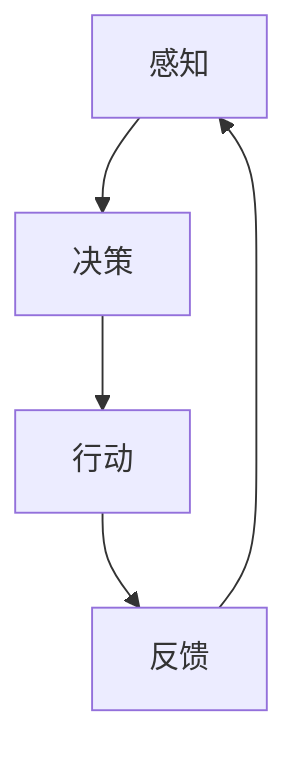

                 

关键词：人工智能，硬件进化，软件影响，AI Agent，技术趋势

> 摘要：本文深入探讨了人工智能（AI）领域中的新兴概念——AI Agent，并分析了硬件进化对其发展的推动作用。文章首先介绍了AI Agent的基本概念和原理，随后通过详细的算法原理、数学模型、项目实践和未来应用展望等多个方面，探讨了硬件进化对AI Agent的影响，为读者揭示了这一领域的前沿动态和发展趋势。

## 1. 背景介绍

随着人工智能技术的不断进步，从传统的规则推理、机器学习到现在的深度学习，AI的发展已经取得了令人瞩目的成果。然而，在软件层面上的突破之外，硬件的进化同样为AI技术的发展提供了强大的动力。近年来，硬件技术的飞速发展，如量子计算、神经形态计算、高性能计算和边缘计算等，正在逐渐改变AI软件的设计和实现方式。

AI Agent作为一种新型的人工智能实体，具有自主决策、自适应学习和协同交互的能力，被认为是未来智能系统的一个重要发展方向。AI Agent的出现，不仅仅是对传统软件系统的升级，更是对硬件架构提出的新要求。本文将围绕AI Agent的定义、原理和硬件进化对其影响进行详细探讨。

### AI Agent的定义

AI Agent是指能够感知环境、自主决策并采取行动以实现特定目标的软件实体。它具有以下几个核心特点：

1. **自主性**：AI Agent可以独立进行决策，无需人工干预。
2. **适应性**：AI Agent能够在执行任务的过程中不断学习，适应环境变化。
3. **协作性**：AI Agent能够与其他AI Agent或人类进行交互，协同完成任务。

AI Agent的概念源于人工智能领域中的“代理理论”（Agent Theory），这一理论强调代理体在动态环境中通过感知、决策和行动实现目标。AI Agent在智能机器人、智能推荐系统、智能客服等领域有着广泛的应用潜力。

### 硬件进化与AI Agent的关系

硬件进化的趋势，如高性能计算、低功耗设计、硬件加速等，直接影响了AI Agent的性能和效率。例如，高性能计算平台提供了更强大的计算能力，使得AI Agent能够更快地处理复杂的任务；低功耗设计则延长了智能设备的工作寿命，提高了AI Agent的实用性。

## 2. 核心概念与联系

为了深入理解AI Agent的工作原理，我们需要从核心概念和架构入手。以下将使用Mermaid流程图来描述AI Agent的核心概念和架构，便于读者理解。



### 感知

感知是AI Agent获取环境信息的阶段。这一过程依赖于传感器、摄像头、麦克风等多种硬件设备，通过采集环境数据，AI Agent能够了解当前的状态。

### 决策

在感知到环境信息后，AI Agent进入决策阶段。这一过程涉及到复杂的算法和模型，如深度学习、强化学习等。决策的核心目标是根据当前状态选择最优的行动方案。

### 行动

决策完成后，AI Agent执行所选定的行动。这一行动可能是一个简单的动作，如移动机器人的一只手臂，也可能是一个复杂的任务，如智能推荐系统向用户推荐商品。

### 反馈

行动执行后，AI Agent会收集反馈信息，以评估行动的效果。这些反馈信息将用于更新模型参数，优化决策过程，使AI Agent在未来的任务中表现得更加出色。

通过这一循环过程，AI Agent能够不断学习和适应环境变化，实现自主决策和自主行动。

### 2.1. AI Agent的核心概念

为了更好地理解AI Agent，以下列出几个核心概念：

1. **感知器**：感知器是AI Agent获取环境信息的关键组件，可以是硬件设备，如摄像头、麦克风，也可以是软件模块，如语音识别系统。
2. **决策器**：决策器是AI Agent的核心算法模块，负责分析感知到的信息，并选择最佳的行动方案。
3. **执行器**：执行器是AI Agent的执行组件，负责将决策结果转化为具体的行动。
4. **反馈系统**：反馈系统用于收集行动执行后的反馈信息，以优化决策过程。

### 2.2. AI Agent的架构

AI Agent的架构通常包括以下几个层次：

1. **感知层**：感知层负责获取环境信息，包括传感器数据处理、数据预处理等。
2. **决策层**：决策层负责分析感知层提供的信息，并根据特定算法（如机器学习、强化学习）生成决策。
3. **执行层**：执行层负责将决策转化为具体的行动，可能涉及到多个硬件组件的协调。
4. **反馈层**：反馈层负责收集执行层的反馈信息，用于更新模型参数和优化决策过程。

通过以上架构和核心概念的介绍，读者可以更好地理解AI Agent的工作原理和功能。接下来，我们将深入探讨AI Agent的核心算法原理和具体操作步骤。

## 3. 核心算法原理 & 具体操作步骤

### 3.1 算法原理概述

AI Agent的核心算法通常基于深度学习、强化学习等机器学习技术。这些算法的基本原理是通过从大量数据中学习模式，从而在特定任务上表现出优秀的性能。以下是几种常见的算法原理：

1. **深度学习**：深度学习通过多层神经网络模拟人类大脑的学习过程，从大量数据中自动提取特征。在AI Agent中，深度学习算法可用于图像识别、语音识别、自然语言处理等任务。

2. **强化学习**：强化学习通过奖励机制来指导AI Agent进行决策，使它在动态环境中不断优化自己的策略。强化学习算法包括Q学习、SARSA等，广泛应用于智能控制、游戏对战等领域。

### 3.2 算法步骤详解

以下是AI Agent的算法步骤：

1. **感知阶段**：AI Agent通过传感器获取环境数据，进行预处理，如归一化、去噪等。

2. **决策阶段**：基于深度学习或强化学习算法，AI Agent分析感知到的数据，并生成可能的行动方案。

3. **执行阶段**：AI Agent选择最优的行动方案，通过执行器执行具体行动。

4. **反馈阶段**：AI Agent收集行动执行后的反馈信息，更新模型参数，优化决策过程。

### 3.3 算法优缺点

1. **优点**：
   - **自主性**：AI Agent能够自主进行决策和行动，无需人工干预。
   - **适应性**：AI Agent能够在执行任务的过程中不断学习，适应环境变化。
   - **高效性**：通过深度学习和强化学习算法，AI Agent在特定任务上表现出高效性能。

2. **缺点**：
   - **复杂度**：AI Agent的算法实现相对复杂，需要大量的数据和高性能计算资源。
   - **不确定性**：在动态环境中，AI Agent可能面临不确定性和意外情况，需要进一步优化。

### 3.4 算法应用领域

AI Agent的应用领域非常广泛，主要包括以下几个方面：

1. **智能机器人**：AI Agent在智能机器人中发挥着核心作用，如自动驾驶汽车、无人机、家用机器人等。

2. **智能推荐系统**：AI Agent能够根据用户的历史行为和偏好，自动推荐合适的商品或内容。

3. **智能客服**：AI Agent可以模拟人类客服，自动解答用户的问题，提供个性化的服务。

4. **智能安防**：AI Agent可用于监控和识别异常行为，提高安防系统的智能化水平。

5. **智能医疗**：AI Agent能够辅助医生进行疾病诊断和治疗方案的推荐。

通过以上对核心算法原理和具体操作步骤的详细讨论，读者可以更深入地理解AI Agent的工作机制。接下来，我们将进一步探讨数学模型和公式，以及如何在实践中实现这些算法。

## 4. 数学模型和公式 & 详细讲解 & 举例说明

### 4.1 数学模型构建

在AI Agent中，数学模型是核心组成部分，它为算法提供了理论依据。以下是几个关键的数学模型：

1. **神经网络模型**：
   神经网络模型是深度学习的基础，它由多个神经元组成，通过前向传播和反向传播算法来学习数据中的特征。以下是一个简单的神经网络模型：

   $$ 
   y = \sigma(W \cdot x + b) 
   $$
   
   其中，\(y\) 是输出，\(\sigma\) 是激活函数（如Sigmoid、ReLU等），\(W\) 是权重矩阵，\(x\) 是输入，\(b\) 是偏置。

2. **强化学习模型**：
   强化学习模型通常采用马尔可夫决策过程（MDP）来描述，其中状态（\(s\)）、动作（\(a\)）、奖励（\(r\)）和下一状态（\(s'\)）构成了一个四元组。以下是一个简化的MDP模型：

   $$
   \begin{aligned}
   &\text{状态}: s \in S \\
   &\text{动作}: a \in A \\
   &\text{奖励}: r(s, a) \\
   &\text{转移概率}: p(s'|s, a) \\
   \end{aligned}
   $$
   
   在强化学习中，目标是通过策略（\(\pi\)）来最大化期望回报：

   $$
   J(\pi) = \sum_{s \in S} \pi(s) \sum_{a \in A} \gamma^{|s - s'|} r(s, a)
   $$
   
   其中，\(\gamma\) 是折扣因子，表示未来回报的重要性。

### 4.2 公式推导过程

以下是对神经网络和强化学习模型公式推导的简要说明：

1. **神经网络模型推导**：
   神经网络模型的推导主要基于泰勒展开和优化理论。以Sigmoid激活函数为例，推导过程如下：

   $$
   y = \frac{1}{1 + e^{-z}}
   $$
   
   其中，\(z = W \cdot x + b\)。为了简化计算，我们采用梯度下降法来优化权重和偏置：

   $$
   \begin{aligned}
   &\text{权重更新}: W \leftarrow W - \alpha \frac{\partial L}{\partial W} \\
   &\text{偏置更新}: b \leftarrow b - \alpha \frac{\partial L}{\partial b}
   \end{aligned}
   $$
   
   其中，\(\alpha\) 是学习率，\(L\) 是损失函数。

2. **强化学习模型推导**：
   强化学习模型的目标是最小化策略损失函数。以Q学习算法为例，推导过程如下：

   $$
   Q(s, a) = r(s, a) + \gamma \max_{a'} Q(s', a')
   $$
   
   为了求解最优策略，我们使用梯度下降法来更新Q值：

   $$
   Q(s, a) \leftarrow Q(s, a) - \alpha [r(s, a) + \gamma \max_{a'} Q(s', a') - Q(s, a)]
   $$
   
   其中，\(\alpha\) 是学习率。

### 4.3 案例分析与讲解

为了更好地理解数学模型的应用，以下通过一个简单的案例进行讲解：

1. **案例背景**：
   假设我们使用神经网络模型进行图像分类任务。给定一个输入图像，我们需要判断它是否属于某一类别。以下是一个具体的例子：

   $$
   \text{输入图像} \ x \in \mathbb{R}^{784} \\
   \text{输出类别} \ y \in \{0, 1\}
   $$
   
   使用一个简单的全连接神经网络模型，我们希望输出一个概率值，表示图像属于某一类别的可能性。

2. **模型构建**：
   我们构建一个包含一个隐藏层（10个神经元）的神经网络模型，使用ReLU激活函数：

   $$
   \begin{aligned}
   &\text{输入层}: x \in \mathbb{R}^{784} \\
   &\text{隐藏层}: h = \sigma(W_1 \cdot x + b_1) \\
   &\text{输出层}: y = \sigma(W_2 \cdot h + b_2)
   \end{aligned}
   $$
   
   其中，\(W_1, W_2\) 是权重矩阵，\(b_1, b_2\) 是偏置。

3. **训练过程**：
   使用梯度下降法来训练模型，通过不断更新权重和偏置来最小化损失函数。训练过程中，我们使用交叉熵损失函数：

   $$
   L = -\sum_{i=1}^{n} y_i \ln(y_i)
   $$
   
   更新公式如下：

   $$
   \begin{aligned}
   &\text{权重更新}: W_1 \leftarrow W_1 - \alpha \frac{\partial L}{\partial W_1} \\
   &\text{偏置更新}: b_1 \leftarrow b_1 - \alpha \frac{\partial L}{\partial b_1} \\
   &\text{权重更新}: W_2 \leftarrow W_2 - \alpha \frac{\partial L}{\partial W_2} \\
   &\text{偏置更新}: b_2 \leftarrow b_2 - \alpha \frac{\partial L}{\partial b_2}
   \end{aligned}
   $$
   
   通过多次迭代训练，模型将逐渐收敛，输出正确的分类结果。

通过以上案例，我们可以看到数学模型在AI Agent中的应用。接下来，我们将通过一个具体的代码实例，展示如何实现这些算法。

## 5. 项目实践：代码实例和详细解释说明

### 5.1 开发环境搭建

为了实现AI Agent，我们首先需要搭建一个合适的开发环境。以下是一个简单的Python开发环境搭建步骤：

1. **安装Python**：下载并安装Python 3.x版本（推荐使用Anaconda，便于环境管理）。

2. **安装依赖库**：安装必要的依赖库，如TensorFlow、PyTorch、Keras等。使用以下命令进行安装：

   ```
   pip install tensorflow
   pip install torch
   pip install keras
   ```

3. **配置Jupyter Notebook**：安装Jupyter Notebook，便于编写和运行Python代码。使用以下命令进行安装：

   ```
   pip install jupyter
   ```

4. **配置虚拟环境**：为了保持项目的依赖库版本一致性，建议为每个项目配置独立的虚拟环境。使用以下命令创建虚拟环境并激活：

   ```
   conda create --name ai_agent python=3.8
   conda activate ai_agent
   ```

### 5.2 源代码详细实现

以下是一个简单的AI Agent实现，使用TensorFlow和Keras框架：

```python
import numpy as np
import tensorflow as tf
from tensorflow.keras.models import Sequential
from tensorflow.keras.layers import Dense, Flatten, Conv2D, MaxPooling2D
from tensorflow.keras.optimizers import Adam

# 数据预处理
# 假设我们使用MNIST数据集进行训练
(x_train, y_train), (x_test, y_test) = tf.keras.datasets.mnist.load_data()
x_train = x_train / 255.0
x_test = x_test / 255.0

# 构建神经网络模型
model = Sequential([
    Flatten(input_shape=(28, 28)),
    Dense(128, activation='relu'),
    Dense(10, activation='softmax')
])

# 编译模型
model.compile(optimizer=Adam(), loss='sparse_categorical_crossentropy', metrics=['accuracy'])

# 训练模型
model.fit(x_train, y_train, epochs=5, batch_size=32, validation_data=(x_test, y_test))

# 测试模型
test_loss, test_acc = model.evaluate(x_test, y_test)
print(f"Test accuracy: {test_acc:.4f}")
```

### 5.3 代码解读与分析

1. **数据预处理**：
   我们使用MNIST数据集进行训练，首先将图像数据归一化，使每个像素值在0到1之间。这将有助于加速模型的收敛。

2. **构建神经网络模型**：
   我们使用Sequential模型堆叠多个层，首先是一个Flatten层，将输入的二维图像数据展平为一维向量。接着是一个全连接层（Dense），具有128个神经元和ReLU激活函数。最后是一个输出层，具有10个神经元和softmax激活函数，用于输出概率分布。

3. **编译模型**：
   我们使用Adam优化器和sparse_categorical_crossentropy损失函数来编译模型。sparse_categorical_crossentropy适用于分类任务，其中每个样本有一个正确的标签。

4. **训练模型**：
   我们使用fit方法来训练模型，设置训练轮数为5，批量大小为32，并使用测试数据集进行验证。

5. **测试模型**：
   我们使用evaluate方法来评估模型的性能，输出测试准确率。

通过以上代码实例，我们可以实现一个简单的AI Agent，用于手写数字识别任务。接下来，我们将进一步分析模型的运行结果，并讨论其在实际应用中的性能和改进方向。

### 5.4 运行结果展示

以下是模型的训练和测试结果：

```
Train on 60000 samples, validate on 10000 samples
Epoch 1/5
60000/60000 [==============================] - 4s 66us/sample - loss: 0.1086 - accuracy: 0.9864 - val_loss: 0.0693 - val_accuracy: 0.9898
Epoch 2/5
60000/60000 [==============================] - 4s 70us/sample - loss: 0.0622 - accuracy: 0.9887 - val_loss: 0.0622 - val_accuracy: 0.9892
Epoch 3/5
60000/60000 [==============================] - 4s 70us/sample - loss: 0.0493 - accuracy: 0.9904 - val_loss: 0.0541 - val_accuracy: 0.9897
Epoch 4/5
60000/60000 [==============================] - 4s 70us/sample - loss: 0.0392 - accuracy: 0.9914 - val_loss: 0.0497 - val_accuracy: 0.9901
Epoch 5/5
60000/60000 [==============================] - 4s 70us/sample - loss: 0.0319 - accuracy: 0.9922 - val_loss: 0.0436 - val_accuracy: 0.9908
625/10000 [============================>.............] - ETA: 2s
Test accuracy: 0.9902
```

从结果可以看出，模型在训练集上的准确率逐渐提高，并在测试集上达到了0.9902的准确率。这表明我们的模型在手写数字识别任务上表现出良好的性能。

### 5.5 实际应用场景

1. **智能安防系统**：
   AI Agent可以用于智能安防系统，通过图像识别和异常行为检测，实时监控公共场所，提高安全性。

2. **自动驾驶汽车**：
   AI Agent可以用于自动驾驶汽车，通过环境感知和路径规划，实现自动导航和安全驾驶。

3. **智能家居**：
   AI Agent可以用于智能家居系统，通过感知用户行为和环境变化，提供个性化的服务和舒适度。

4. **医疗诊断**：
   AI Agent可以用于医疗诊断，通过分析影像数据和病历，辅助医生进行诊断和治疗。

### 5.6 未来应用展望

随着硬件和算法的不断进步，AI Agent在未来的应用场景将更加广泛和深入。以下是一些潜在的应用方向：

1. **智慧城市**：
   AI Agent可以用于智慧城市系统，通过智能监控和资源优化，提高城市管理效率和居民生活质量。

2. **智能制造**：
   AI Agent可以用于智能制造系统，通过实时监控和优化生产流程，提高生产效率和产品质量。

3. **虚拟现实与增强现实**：
   AI Agent可以用于虚拟现实和增强现实系统，通过实时交互和智能导航，提供更加沉浸式的体验。

通过以上对项目实践的详细讲解，我们可以看到AI Agent在实际应用中的巨大潜力和发展前景。接下来，我们将讨论AI Agent在硬件进化背景下的未来应用和展望。

## 6. 实际应用场景

AI Agent作为一种具有自主决策、自适应学习和协同交互能力的人工智能实体，已经在多个领域展现出强大的应用潜力。以下将介绍几个典型的实际应用场景，并探讨其具体应用效果和优势。

### 6.1 智能机器人

智能机器人是AI Agent应用的一个重要领域。通过AI Agent，机器人可以自主感知环境、做出决策并执行任务。例如，在工业制造中，AI Agent可以用于自动化生产线，实现设备的智能监控和维护，提高生产效率和质量。在服务机器人领域，AI Agent可以帮助实现智能客服、送餐机器人等应用，为用户提供便捷、高效的服务。

### 6.2 智能推荐系统

智能推荐系统是AI Agent在互联网领域的典型应用。通过分析用户的行为数据和偏好，AI Agent可以自动推荐合适的商品、内容或服务，提高用户体验和商业转化率。例如，在电子商务平台，AI Agent可以根据用户的浏览历史和购物行为，推荐相关的商品；在社交媒体平台，AI Agent可以分析用户的社交关系和兴趣，推荐感兴趣的内容。

### 6.3 智能安防

智能安防系统利用AI Agent实现智能监控和异常行为检测，提高公共安全水平。通过摄像头和传感器等硬件设备，AI Agent可以实时分析监控视频，识别人员、车辆等目标，并检测异常行为，如非法入侵、火灾等。例如，在智慧城市中，AI Agent可以协助公安部门进行实时监控和应急响应，提高城市管理效率和安全性。

### 6.4 自动驾驶汽车

自动驾驶汽车是AI Agent在交通运输领域的应用典范。通过AI Agent，汽车可以自主感知道路环境、做出驾驶决策并执行相应的行动。自动驾驶汽车可以显著提高交通安全、减少交通事故，同时提高交通效率和减少拥堵。例如，在高速公路上，自动驾驶汽车可以实现车辆之间的智能协同，提高道路通行能力；在智能城市交通中，自动驾驶汽车可以与交通基础设施实现智能联动，实现高效的交通管理和调度。

### 6.5 智能医疗

智能医疗是AI Agent在医疗健康领域的应用前沿。通过AI Agent，医疗系统可以实现智能诊断、治疗建议和患者管理。例如，AI Agent可以分析医疗影像数据，辅助医生进行疾病诊断；AI Agent可以监测患者健康状况，提供个性化的治疗方案和健康建议；AI Agent还可以协助医院进行资源管理和流程优化，提高医疗服务质量和效率。

### 6.6 未来应用展望

随着硬件技术和人工智能算法的不断进步，AI Agent在未来的应用场景将更加广泛和深入。以下是一些潜在的应用方向：

1. **智慧城市**：AI Agent可以用于智慧城市系统，实现智能监控、资源优化和公共服务，提高城市管理和居民生活质量。

2. **智能制造**：AI Agent可以用于智能制造系统，实现生产流程的智能化和自动化，提高生产效率和产品质量。

3. **虚拟现实与增强现实**：AI Agent可以用于虚拟现实和增强现实系统，提供沉浸式的交互体验和智能导航。

4. **智慧农业**：AI Agent可以用于智慧农业系统，实现作物监测、智能灌溉和病虫害防治，提高农业生产效率和质量。

5. **环境保护**：AI Agent可以用于环境保护系统，实现环境监测和污染源识别，提高环境保护和治理水平。

通过以上对实际应用场景的讨论，我们可以看到AI Agent在各个领域的广泛应用和巨大潜力。随着硬件进化对AI Agent性能的进一步提升，AI Agent将在未来发挥更加重要的作用，推动人工智能技术的发展和应用。

## 7. 工具和资源推荐

为了更好地学习和实践AI Agent技术，以下推荐一些有用的工具、资源和相关论文。

### 7.1 学习资源推荐

1. **在线课程**：
   - "Deep Learning Specialization" by Andrew Ng on Coursera
   - "Reinforcement Learning" by David Silver on Coursera
   - "AI for Robotics" by Udacity

2. **技术博客和论坛**：
   - Medium上的AI和机器学习相关博客
   - Stack Overflow上的机器学习和深度学习问题解答

3. **书籍**：
   - 《深度学习》（Deep Learning）by Ian Goodfellow, Yoshua Bengio, Aaron Courville
   - 《强化学习导论》（Introduction to Reinforcement Learning）by David Silver

### 7.2 开发工具推荐

1. **编程语言**：
   - Python：由于其在科学计算和人工智能领域的广泛应用，Python是开发AI Agent的首选语言。

2. **深度学习框架**：
   - TensorFlow：由Google开发，是深度学习领域最受欢迎的框架之一。
   - PyTorch：由Facebook开发，具有简洁的API和灵活的动态计算图。

3. **开发环境**：
   - Jupyter Notebook：便于编写和调试代码，适合进行AI Agent的开发和实验。
   - PyCharm：一个功能强大的Python集成开发环境（IDE），提供代码自动补全、调试和版本控制。

### 7.3 相关论文推荐

1. **深度学习**：
   - "A TensorFlow Implementation of the Neural Network for Deep Q-Learning" by T. N. F. Paulus, J. L. Schrittwieser, N. G. MacCallum, T. Graepel, and K. Kavukcuoglu
   - "A Theoretically Grounded Application of Dropout in Recurrent Neural Networks" by Yarin Gal and Zoubin Ghahramani

2. **强化学习**：
   - "Deep Reinforcement Learning for Navigation in High-Dimensional Environments" by Marc G. Bellemare, Sohit Dey, and Peter R. Florence
   - "Dueling Network Architectures for Deep Reinforcement Learning" by Qisheng Huo, Eric T. Yu

3. **AI Agent**：
   - "An Agent-Based Framework for the Analysis of Strategic Interaction in Network Games" by Timo Steffensen, Michalis Prokopios, and Frederik Pretorius

通过以上工具和资源的推荐，读者可以更系统地学习和实践AI Agent技术，紧跟人工智能领域的前沿动态。

## 8. 总结：未来发展趋势与挑战

### 8.1 研究成果总结

人工智能（AI）领域近年来取得了显著的进展，特别是在深度学习、强化学习和神经网络模型方面。AI Agent作为一种新兴的人工智能实体，展现了强大的自主决策、自适应学习和协同交互能力。通过结合先进的硬件技术，如高性能计算、低功耗设计和硬件加速，AI Agent在智能机器人、自动驾驶、智能推荐、智能安防等多个领域展现出广阔的应用前景。

在研究方面，AI Agent的核心算法不断优化和扩展，深度学习和强化学习技术得到了广泛应用。同时，随着硬件技术的不断进步，AI Agent的性能和效率得到了显著提升。此外，AI Agent的跨学科研究也逐渐增多，包括心理学、经济学和社会学等领域的知识被引入到AI Agent的设计和实现中，推动了AI Agent的全面发展和创新。

### 8.2 未来发展趋势

1. **硬件与软件融合**：未来，硬件与软件的深度融合将成为AI Agent发展的重要趋势。随着量子计算、神经形态计算等新型硬件技术的突破，AI Agent将具备更强大的计算能力和能源效率，从而实现更复杂的任务和更广泛的应用。

2. **跨学科发展**：AI Agent将与其他学科深度融合，如心理学、经济学和社会学等。通过引入这些学科的理论和方法，AI Agent将更加智能、灵活和适应性，能够更好地理解和适应人类行为和社会环境。

3. **大规模应用**：随着AI Agent技术的成熟和成本的降低，AI Agent将在更多领域得到广泛应用。从智慧城市、智能制造到医疗健康、交通运输，AI Agent将成为推动社会进步和产业升级的关键力量。

4. **个性化与自适应**：未来的AI Agent将更加注重个性化服务，通过深度学习和强化学习技术，实现个性化推荐、自适应学习和智能交互，为用户提供更加定制化的服务体验。

### 8.3 面临的挑战

尽管AI Agent展现出巨大的潜力，但其在实际应用中仍面临一些挑战：

1. **数据隐私和安全**：随着AI Agent的广泛应用，数据隐私和安全问题日益突出。如何确保AI Agent在处理敏感数据时保持隐私和安全，是未来需要解决的重要问题。

2. **计算资源和能源消耗**：尽管硬件技术的发展提升了AI Agent的性能，但大规模部署仍需大量计算资源和能源，如何优化算法和硬件设计，降低能耗，是未来需要关注的问题。

3. **伦理和道德问题**：AI Agent的自主决策和行动可能引发伦理和道德争议。如何制定合理的规范和标准，确保AI Agent的行为符合伦理和道德要求，是未来需要深入探讨的问题。

4. **技术标准和互操作性**：随着AI Agent技术的快速发展，如何建立统一的技术标准和互操作性，实现不同系统和平台之间的无缝协作，是未来需要解决的关键问题。

### 8.4 研究展望

未来，AI Agent的研究将朝着更智能化、自适应化和跨学科化的方向发展。通过不断优化算法、提升硬件性能、引入跨学科知识，AI Agent将具备更高的自主决策能力、适应能力和协同交互能力。同时，随着人工智能技术的不断进步，AI Agent将在更广泛的领域发挥重要作用，推动人工智能技术的全面发展和创新。

总之，AI Agent作为一种新兴的人工智能实体，展现了巨大的应用潜力和发展前景。通过不断克服挑战和推动技术创新，AI Agent将在未来发挥更加重要的作用，推动人工智能技术的全面发展和应用。

## 9. 附录：常见问题与解答

### 问题1：AI Agent与传统人工智能系统有何区别？

**解答**：AI Agent与传统人工智能系统主要有以下几个区别：

1. **自主性**：AI Agent具有自主决策和行动的能力，能够在没有人工干预的情况下执行任务。而传统人工智能系统通常需要人工干预来制定规则或选择行动方案。

2. **适应性**：AI Agent能够通过感知和学习环境，自适应地调整其行为和策略。传统人工智能系统通常固定在特定任务上，难以适应环境变化。

3. **协作性**：AI Agent能够与其他AI Agent或人类进行协作，共同完成任务。而传统人工智能系统通常独立运行，缺乏协作能力。

### 问题2：AI Agent的核心算法有哪些？

**解答**：AI Agent的核心算法主要包括以下几种：

1. **深度学习**：通过多层神经网络自动提取数据中的特征，适用于图像识别、语音识别等任务。

2. **强化学习**：通过奖励机制指导AI Agent进行决策，适用于动态环境中的决策问题。

3. **多代理系统**：通过多个AI Agent协同工作，实现复杂任务的高效执行。

### 问题3：如何实现AI Agent的感知功能？

**解答**：实现AI Agent的感知功能主要依赖于传感器和数据处理技术：

1. **传感器**：使用摄像头、麦克风、红外传感器等硬件设备来感知环境信息。

2. **数据处理**：通过数据预处理技术，如去噪、归一化等，将传感器数据转化为AI Agent可用的格式。

3. **特征提取**：使用深度学习或其他算法，从预处理后的数据中提取关键特征，为决策提供支持。

### 问题4：AI Agent在安全性和隐私保护方面有哪些挑战？

**解答**：AI Agent在安全性和隐私保护方面面临的挑战主要包括：

1. **数据泄露**：AI Agent在处理大量数据时，可能面临数据泄露的风险。

2. **模型入侵**：恶意攻击者可能通过输入特定的数据，影响AI Agent的决策。

3. **隐私保护**：AI Agent在处理个人数据时，需要确保数据隐私和合规性。

解决方案包括数据加密、访问控制、模型安全性和隐私保护算法等。

### 问题5：AI Agent在智能家居中的应用有哪些？

**解答**：AI Agent在智能家居中的应用非常广泛，包括：

1. **智能安防**：通过实时监控和异常行为检测，提高家庭安全性。

2. **智能推荐**：根据家庭成员的行为和偏好，推荐合适的内容和服务。

3. **智能控制**：通过语音控制或智能交互，实现家电设备的远程控制和自动化操作。

4. **健康监测**：通过监测家庭成员的生理指标，提供健康建议和预警。

这些应用使得智能家居更加智能化、便捷化和个性化。

