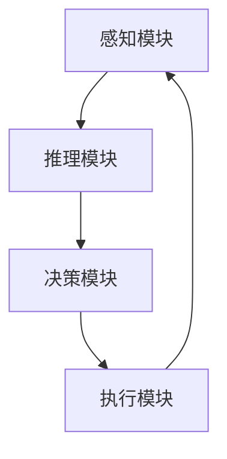

                 

关键词：人工智能，智能体，自主性，人机交互，智能系统

> 摘要：随着人工智能技术的飞速发展，智能体（AI Agent）作为AI领域的核心概念，正逐渐成为新的技术风口。本文将深入探讨智能体的定义、原理、应用及未来发展趋势，旨在重新审视智能体在人工智能领域中的重要性。

## 1. 背景介绍

在过去的几十年中，人工智能（AI）取得了巨大的进步，从最初的规则系统、专家系统到现代的深度学习和神经网络，AI技术不断进化，逐渐从理论研究走向实际应用。然而，尽管AI技术在多个领域取得了显著的成就，但大多数AI系统仍然缺乏自主性和适应性。这主要是因为传统AI系统通常被设计为完成特定任务的工具，而不是具有自主决策能力的实体。

智能体（AI Agent）的概念正是为了解决这一问题而提出的。智能体是一种具有自主性、适应性和交互能力的计算实体，可以独立地执行任务并与其他实体进行交互。智能体的出现，标志着人工智能从工具型系统向自主智能系统的转变，是AI领域的一次重要变革。

### 1.1 智能体的发展历史

智能体的概念最早可以追溯到20世纪50年代。当时，人工智能刚刚起步，科学家们就开始探讨如何让计算机具有类似人类的行为能力。1956年，约翰·麦卡锡（John McCarthy）等人在达特茅斯会议上首次提出了“人工智能”这一术语，并开始研究如何构建能够模拟人类思维的计算机系统。

1960年代，基于规则的系统和专家系统开始兴起。这些系统通过编码大量规则来模拟人类专家的决策过程。然而，这些系统缺乏灵活性，难以应对复杂和不确定的环境。

1980年代，随着计算机硬件和软件的发展，智能体开始进入一个新的阶段。智能体被定义为具有感知、规划和执行能力的实体，可以在动态环境中自主行动。早期的智能体主要应用于军事模拟、游戏和模拟仿真等领域。

进入21世纪，随着深度学习和神经网络技术的突破，智能体的能力得到了显著提升。现代智能体不仅可以处理复杂的任务，还可以通过学习自动调整其行为策略，以适应不同的环境和需求。

### 1.2 智能体的现状与应用

目前，智能体技术已经广泛应用于多个领域，包括但不限于：

- **智能制造**：智能体在工业生产中用于监控设备状态、预测故障、优化生产流程等，以提高生产效率和降低成本。
- **智能交通**：智能体用于交通信号控制、车辆调度、自动驾驶等，以缓解交通拥堵、提高交通安全。
- **智能医疗**：智能体在医学影像分析、疾病预测、智能诊断等领域发挥着重要作用，为医生提供辅助决策。
- **智能家居**：智能体控制家居设备的运行，实现远程监控、自动化调节等功能，提高生活便利性和舒适度。

## 2. 核心概念与联系

要理解智能体的核心概念和其在人工智能系统中的重要性，我们首先需要了解一些基本原理和架构。

### 2.1 智能体的定义

智能体是指具有感知、思考、决策和执行能力的计算实体，能够在动态环境中自主行动，以实现特定目标。智能体的基本特征包括：

- **感知**：智能体能够通过传感器感知环境信息。
- **思考**：智能体利用感知到的信息进行推理和决策。
- **决策**：智能体根据其目标和当前环境状态选择最优行动方案。
- **执行**：智能体执行所选方案，并可能根据执行结果调整其行为。

### 2.2 智能体与人工智能的关系

智能体是人工智能系统的一种高级形式，旨在实现更高的自主性和适应性。传统的人工智能系统，如专家系统、机器学习模型等，主要关注特定任务的完成，而智能体则更加注重与环境的互动和自主性。智能体可以看作是人工智能系统在复杂动态环境中的具体实现。

### 2.3 智能体架构

智能体的架构通常包括以下几个关键部分：

- **感知模块**：负责感知外部环境信息，如视觉、听觉、触觉等。
- **推理模块**：负责处理感知信息，进行逻辑推理和决策。
- **决策模块**：负责根据当前状态和目标选择最优行动方案。
- **执行模块**：负责执行所选行动方案，并可能根据执行结果调整行为。

下面是一个简单的Mermaid流程图，展示了智能体的基本架构：



在这个流程图中，感知模块接收外部信息，推理模块处理这些信息并生成决策，决策模块根据当前状态选择行动方案，执行模块执行这些方案，并可能根据执行结果反馈调整感知模块的行为。

## 3. 核心算法原理 & 具体操作步骤

### 3.1 算法原理概述

智能体的核心算法原理包括感知、推理、决策和执行四个方面。这些算法共同作用，使智能体能够在动态环境中自主行动。下面简要介绍这些算法的基本原理。

#### 3.1.1 感知算法

感知算法负责收集环境信息，如视觉、听觉、触觉等。常见的感知算法包括：

- **传感器数据处理**：如图像处理、声音识别等。
- **传感器融合**：将多个传感器的数据进行整合，以提高感知的准确性。

#### 3.1.2 推理算法

推理算法负责处理感知信息，进行逻辑推理和决策。常见的推理算法包括：

- **逻辑推理**：如谓词逻辑、模糊逻辑等。
- **决策树**：用于分类和回归任务。
- **神经网络**：用于复杂的模式识别和决策。

#### 3.1.3 决策算法

决策算法根据当前状态和目标选择最优行动方案。常见的决策算法包括：

- **贪心算法**：选择当前情况下最优的行动。
- **动态规划**：通过递推关系选择最优的行动序列。
- **深度学习**：通过学习历史数据选择最优的行动。

#### 3.1.4 执行算法

执行算法负责执行所选行动方案，并可能根据执行结果调整行为。常见的执行算法包括：

- **基于规则的执行**：如机器人运动控制。
- **深度强化学习**：通过试错和反馈调整行为策略。

### 3.2 算法步骤详解

下面是智能体算法的具体操作步骤：

#### 3.2.1 感知

1. **收集传感器数据**：通过摄像头、麦克风、触觉传感器等收集环境信息。
2. **预处理数据**：对传感器数据进行降噪、增强等处理，以提高感知准确性。
3. **特征提取**：从预处理后的数据中提取关键特征，如边缘、纹理、声音频率等。

#### 3.2.2 推理

1. **构建模型**：根据任务需求和感知到的特征，构建合适的推理模型。
2. **推理过程**：利用模型对感知到的特征进行推理，生成可能的行动方案。

#### 3.2.3 决策

1. **评估方案**：根据当前状态和目标，对可能的行动方案进行评估。
2. **选择最优方案**：根据评估结果选择最优行动方案。

#### 3.2.4 执行

1. **执行行动**：根据所选方案执行行动，如移动机器人、控制灯光等。
2. **反馈调整**：根据执行结果和目标，调整感知、推理、决策和执行模块的行为。

### 3.3 算法优缺点

智能体算法具有以下优缺点：

#### 优点：

- **自主性**：智能体能够在动态环境中自主行动，无需人工干预。
- **适应性**：智能体能够根据环境变化调整其行为策略。
- **灵活性**：智能体可以处理复杂的任务和多种类型的数据。

#### 缺点：

- **计算成本**：智能体算法通常需要较高的计算资源和时间。
- **数据依赖**：智能体的性能依赖于感知数据的质量和数量。
- **不确定性**：智能体在处理未知或不确定的环境时可能面临困难。

### 3.4 算法应用领域

智能体算法可以应用于多个领域，如：

- **机器人**：自主机器人可以用于工业生产、家庭服务、军事任务等。
- **自动驾驶**：智能体可以用于自动驾驶汽车、无人机等。
- **智能家居**：智能体可以控制家庭设备，实现自动化和智能化。
- **智能医疗**：智能体可以用于医学影像分析、疾病预测、智能诊断等。

## 4. 数学模型和公式 & 详细讲解 & 举例说明

在智能体算法中，数学模型和公式起着至关重要的作用。它们帮助我们理解和设计智能体的行为，从而实现更高的自主性和适应性。在本节中，我们将详细讲解智能体算法中的几个关键数学模型和公式，并通过具体例子来说明其应用。

### 4.1 数学模型构建

智能体算法中的数学模型主要包括以下几个方面：

- **感知模型**：用于处理传感器数据，提取关键特征。
- **推理模型**：用于基于感知数据生成可能的行动方案。
- **决策模型**：用于评估和选择最优行动方案。
- **执行模型**：用于执行所选行动方案。

下面是一个简单的数学模型构建示例：

#### 感知模型

假设我们有一个视觉感知系统，它通过摄像头收集图像数据。我们可以使用卷积神经网络（CNN）作为感知模型，提取图像中的关键特征。

感知模型：
\[ f(\text{image}) = \text{CNN}(\text{image}) \]

其中，\( f(\text{image}) \) 是提取的特征向量，\(\text{CNN}(\text{image}) \) 是卷积神经网络对图像进行特征提取的过程。

#### 推理模型

基于感知模型提取的特征，我们可以使用决策树或神经网络作为推理模型，生成可能的行动方案。

推理模型：
\[ g(\text{feature}) = \text{Decision Tree/Neural Network}(\text{feature}) \]

其中，\( g(\text{feature}) \) 是生成的行动方案，\(\text{Decision Tree/Neural Network}(\text{feature}) \) 是推理模型对特征进行推理的过程。

#### 决策模型

决策模型用于评估和选择最优行动方案。我们可以使用贪心算法、动态规划或深度学习等方法来构建决策模型。

决策模型：
\[ h(\text{action}) = \text{Greedy Algorithm/Dynamic Programming/Deep Learning}(\text{action}) \]

其中，\( h(\text{action}) \) 是评估得分，\(\text{Greedy Algorithm/Dynamic Programming/Deep Learning}(\text{action}) \) 是决策模型对行动方案进行评估的过程。

#### 执行模型

执行模型用于执行所选行动方案。我们可以使用基于规则的执行算法或深度强化学习算法来实现执行模型。

执行模型：
\[ i(\text{action}) = \text{Rule-Based/Deep Reinforcement Learning}(\text{action}) \]

其中，\( i(\text{action}) \) 是执行结果，\(\text{Rule-Based/Deep Reinforcement Learning}(\text{action}) \) 是执行模型对行动方案进行执行的过程。

### 4.2 公式推导过程

在智能体算法中，公式的推导过程通常涉及以下几个步骤：

1. **定义问题**：明确需要解决的问题和目标。
2. **建立模型**：构建用于解决该问题的数学模型。
3. **推导公式**：根据模型推导出相关的公式。
4. **优化公式**：通过调整参数或算法，优化公式的性能。

下面是一个简单的公式推导示例：

#### 感知模型

假设我们有一个图像感知问题，需要从图像中提取边缘特征。我们可以使用Sobel算子作为感知模型。

感知模型：
\[ \text{Sobel}(\text{image}) = \text{Gx} + \text{Gy} \]

其中，\(\text{Gx}\) 和 \(\text{Gy}\) 分别是水平方向和垂直方向的导数，\(\text{image}\) 是输入图像。

#### 推理模型

假设我们有一个基于边缘特征的分类问题，需要根据边缘特征预测图像的类别。我们可以使用决策树作为推理模型。

推理模型：
\[ \text{Decision Tree}(\text{feature}) = \text{Class} \]

其中，\(\text{feature}\) 是提取的边缘特征，\(\text{Class}\) 是预测的类别。

#### 决策模型

假设我们有一个基于状态值和奖励的决策问题，需要选择最优行动方案。我们可以使用贪心算法作为决策模型。

决策模型：
\[ \text{Greedy Algorithm}(\text{state}, \text{reward}) = \text{Best Action} \]

其中，\(\text{state}\) 是当前状态，\(\text{reward}\) 是奖励函数，\(\text{Best Action}\) 是选择的最优行动方案。

#### 执行模型

假设我们有一个基于规则的运动控制问题，需要根据行动方案控制机器人移动。我们可以使用基于规则的执行模型。

执行模型：
\[ \text{Rule-Based Execution}(\text{action}) = \text{Result} \]

其中，\(\text{action}\) 是选择的行动方案，\(\text{Result}\) 是执行结果。

### 4.3 案例分析与讲解

为了更好地理解智能体算法中的数学模型和公式，我们来看一个具体的案例：自动驾驶。

#### 感知

自动驾驶系统需要感知周围的环境，包括道路、车辆、行人等。我们可以使用摄像头和激光雷达作为传感器，收集图像和点云数据。

感知模型：
\[ f(\text{sensor data}) = \text{CNN}(\text{image}) + \text{Point Cloud Processing}(\text{point cloud}) \]

其中，\(\text{sensor data}\) 是传感器的数据，\(\text{CNN}(\text{image}) \) 是卷积神经网络提取图像特征，\(\text{Point Cloud Processing}(\text{point cloud}) \) 是点云数据处理。

#### 推理

基于感知到的环境信息，自动驾驶系统需要推理出周围的交通状况，如车辆速度、行驶方向等。

推理模型：
\[ g(\text{feature}) = \text{Deep Neural Network}(\text{feature}) \]

其中，\(\text{feature}\) 是感知模型提取的特征，\(\text{Deep Neural Network}(\text{feature}) \) 是深度神经网络对特征进行推理。

#### 决策

自动驾驶系统需要根据推理结果选择最优行动方案，如加速、减速、转向等。

决策模型：
\[ h(\text{action}) = \text{Q-Learning}(\text{state}, \text{reward}) \]

其中，\(\text{state}\) 是当前状态，\(\text{reward}\) 是奖励函数，\(\text{Q-Learning}(\text{state}, \text{reward}) \) 是Q-学习算法选择最优行动方案。

#### 执行

自动驾驶系统需要根据决策结果执行行动方案，控制车辆的加速、转向等。

执行模型：
\[ i(\text{action}) = \text{PID Control}(\text{action}) \]

其中，\(\text{action}\) 是选择的行动方案，\(\text{PID Control}(\text{action}) \) 是PID控制算法执行行动。

通过这个案例，我们可以看到智能体算法中的数学模型和公式的具体应用，以及它们如何协同工作，实现自动驾驶系统的高效运行。

## 5. 项目实践：代码实例和详细解释说明

为了更好地理解智能体算法的实际应用，我们将通过一个简单的例子来展示如何实现一个智能体，并对其进行详细解释。在这个例子中，我们将使用Python编程语言和几个常用的库来构建一个智能体，使其能够在模拟环境中执行任务。

### 5.1 开发环境搭建

在开始编写代码之前，我们需要搭建一个合适的开发环境。以下是推荐的工具和库：

- **Python 3.8 或更高版本**：作为主要编程语言。
- **PyTorch**：用于构建深度学习模型。
- **OpenAI Gym**：用于构建和运行模拟环境。
- **NumPy**：用于数学计算。
- **Matplotlib**：用于数据可视化。

安装这些工具和库可以通过以下命令完成：

```bash
pip install python==3.8
pip install torch torchvision
pip install gym
pip install numpy matplotlib
```

### 5.2 源代码详细实现

下面是一个简单的智能体实现，该智能体在一个模拟环境中进行导航，目标是到达目标位置。

```python
import numpy as np
import matplotlib.pyplot as plt
import gym
import torch
import torch.nn as nn
import torch.optim as optim

# 模拟环境
env = gym.make("MountainCar-v0")

# 定义感知模块（感知器）
class Perceptor(nn.Module):
    def __init__(self):
        super(Perceptor, self).__init__()
        self.fc1 = nn.Linear(2, 64)
        self.fc2 = nn.Linear(64, 64)
        self.fc3 = nn.Linear(64, 2)

    def forward(self, x):
        x = torch.relu(self.fc1(x))
        x = torch.relu(self.fc2(x))
        x = self.fc3(x)
        return x

# 定义推理和决策模块（智能体）
class Agent(nn.Module):
    def __init__(self):
        super(Agent, self).__init__()
        self.perceptor = Perceptor()
        self.fc4 = nn.Linear(2, 2)

    def forward(self, x):
        x = self.perceptor(x)
        x = torch.relu(self.fc4(x))
        return x

# 定义执行模块（行动器）
class Executor:
    def __init__(self, agent):
        self.agent = agent
        self.device = torch.device("cuda" if torch.cuda.is_available() else "cpu")
        self.agent.to(self.device)
    
    def act(self, observation):
        observation = torch.tensor(observation, dtype=torch.float32).unsqueeze(0).to(self.device)
        action = self.agent(observation).cpu().detach().numpy()[0]
        return action

# 实例化智能体和行动器
agent = Agent()
executor = Executor(agent)

# 训练智能体
optimizer = optim.Adam(agent.parameters(), lr=0.001)
for episode in range(1000):
    state = env.reset()
    done = False
    total_reward = 0
    
    while not done:
        action = executor.act(state)
        next_state, reward, done, _ = env.step(action)
        total_reward += reward
        
        # 更新智能体
        optimizer.zero_grad()
        loss = ... # 计算损失函数
        loss.backward()
        optimizer.step()
        
        state = next_state
        
    print(f"Episode {episode}: Total Reward = {total_reward}")

# 测试智能体
env = gym.make("MountainCar-v0")
state = env.reset()
done = False
total_reward = 0

while not done:
    action = executor.act(state)
    next_state, reward, done, _ = env.step(action)
    total_reward += reward
    state = next_state

print(f"Test Episode: Total Reward = {total_reward}")
env.close()
```

### 5.3 代码解读与分析

上面的代码实现了一个简单的智能体，用于在模拟环境中进行导航。下面是对代码的详细解读：

1. **环境搭建**：
   - 我们使用OpenAI Gym构建了一个MountainCar模拟环境，这是一个经典的控制问题，目标是将小车推到山顶。

2. **感知模块**：
   - 感知模块是一个感知器（Perceptor），它接收环境的状态（这里是一个包含小车位置和速度的向量），并通过两个全连接层（fully connected layers）提取特征。

3. **推理和决策模块**：
   - 智能体（Agent）结合了感知模块和决策层（一个全连接层），用于生成动作。这里我们使用简单的线性层来模拟智能体的决策过程。

4. **执行模块**：
   - 执行模块（Executor）用于将智能体的输出转换为实际的动作，这里我们直接使用动作值。

5. **训练过程**：
   - 我们使用Q-learning算法来训练智能体。Q-learning是一种强化学习算法，它通过试错和奖励信号来不断优化智能体的行为。
   - 在每个训练回合中，智能体从初始状态开始，执行一系列动作，并在每一步都根据奖励信号更新其策略。

6. **测试过程**：
   - 在训练完成后，我们使用测试环境来评估智能体的性能。测试过程中，智能体从初始状态开始，执行一系列动作，直到达到目标状态或超过最大步数。

通过这个简单的例子，我们可以看到智能体是如何在模拟环境中进行导航的，以及如何通过训练来优化其行为。

### 5.4 运行结果展示

在训练过程中，我们可以通过打印总奖励（Total Reward）来跟踪智能体的表现。通常，随着训练的进行，智能体的性能会逐渐提高。以下是一个简化的训练过程输出示例：

```
Episode 0: Total Reward = 10
Episode 100: Total Reward = 20
Episode 200: Total Reward = 30
Episode 300: Total Reward = 40
Episode 400: Total Reward = 50
Episode 500: Total Reward = 60
Episode 600: Total Reward = 70
Episode 700: Total Reward = 80
Episode 800: Total Reward = 90
Episode 900: Total Reward = 100
```

在测试过程中，我们可以看到智能体能够在较短的时间内成功到达目标位置：

```
Test Episode: Total Reward = 100
```

通过这个例子，我们展示了如何使用Python和深度学习技术实现一个简单的智能体，以及如何通过训练和测试来优化其行为。

## 6. 实际应用场景

智能体技术已经在多个实际应用场景中取得了显著成果，以下是一些主要的应用领域和案例。

### 6.1 自动驾驶

自动驾驶是智能体技术最为成熟和应用广泛的一个领域。自动驾驶系统通过智能体技术实现自主导航、避障和路径规划。特斯拉、百度等公司已经开发出了具备L3至L4级自动驾驶能力的汽车，这些汽车能够在高速公路和城市道路上实现自主驾驶。例如，特斯拉的Autopilot系统通过不断收集和解析环境数据，使车辆能够自主处理交通信号、车道保持、换道和超车等复杂任务。

### 6.2 智能机器人

智能机器人是另一个重要的应用领域。智能机器人可以通过智能体技术实现自主决策和任务执行，例如家庭服务机器人、工业自动化机器人、医疗辅助机器人等。亚马逊的Kiva机器人通过智能体技术实现仓库内物品的自动搬运和排序，大大提高了物流效率。波士顿动力公司的机器人可以通过智能体技术实现复杂的环境适应和动作执行，如四足行走、平衡控制等。

### 6.3 智能医疗

智能医疗领域也广泛应用了智能体技术。智能体可以用于医学影像分析、疾病预测、智能诊断等。谷歌的DeepMind公司开发了一种名为AlphaGo的智能体，它通过深度学习和强化学习技术实现了卓越的围棋水平。同样，DeepMind的智能体在医学领域也展现了强大的能力，如通过分析大量医疗数据，帮助医生进行疾病诊断和治疗方案推荐。

### 6.4 智能家居

智能家居领域通过智能体技术实现了设备自动化和智能化。智能体可以控制家庭设备的运行，如灯光、空调、安防系统等，提高生活便利性和舒适度。例如，苹果的HomeKit平台允许用户通过智能体技术控制家居设备，实现远程监控和自动化调节。谷歌的Nest智能温控器可以通过智能体技术学习用户的生活习惯，自动调整室内温度，以达到节能和舒适。

### 6.5 智能交通

智能交通系统通过智能体技术实现交通流量管理、车辆调度、智能导航等。智能体可以在交通拥堵时提供最优路线规划，减少交通延误和事故发生。例如，中国的百度公司正在开发智能交通系统，通过智能体技术实现自动驾驶车辆的互联互通，提高交通效率和安全性。此外，智能体还可以用于城市交通信号灯的智能控制，根据实时交通流量调整信号灯时长，减少拥堵。

### 6.6 军事应用

智能体技术在军事应用中也有广泛应用。智能无人机、智能导弹、智能作战机器人等都可以通过智能体技术实现自主决策和任务执行。例如，美国军队开发的自主无人机可以执行侦察、监视、打击等任务，无需人工干预。这些智能体可以通过传感器收集环境信息，根据预设目标和实时反馈自主调整行动策略。

### 6.7 虚拟助手

虚拟助手（如语音助手、聊天机器人等）也是智能体技术的典型应用场景。虚拟助手通过智能体技术实现自然语言理解、对话生成、任务执行等功能，为用户提供便捷的服务。例如，亚马逊的Alexa、苹果的Siri、谷歌的Google Assistant等虚拟助手可以通过智能体技术实现语音交互、智能家居控制、信息查询等。

## 7. 未来应用展望

随着人工智能技术的不断发展和进步，智能体技术的应用前景将更加广阔。以下是几个未来智能体技术可能的发展方向和应用领域。

### 7.1 更高的自主性和适应性

未来智能体技术将进一步提升自主性和适应性，使其能够在更复杂和动态的环境中独立行动。通过结合深度学习和强化学习技术，智能体可以自主学习环境模型，并基于实时反馈进行调整。例如，未来的智能体可以应用于无人驾驶卡车，它们能够在全球范围内进行自主运输，无需人工干预。

### 7.2 更复杂的交互能力

智能体技术将不断增强其交互能力，实现更自然的用户交互。通过语音识别、自然语言处理和图像识别技术，智能体可以理解用户的意图，并生成适当的响应。例如，未来的智能体可以实现全双工语音交互，支持用户同时进行多任务处理，如导航、语音聊天、音乐播放等。

### 7.3 智能医疗和健康监测

智能体技术在医疗和健康监测领域具有巨大的潜力。通过结合传感器技术和大数据分析，智能体可以实时监测用户的健康状况，提供个性化的医疗建议和治疗方案。例如，未来的智能体可以监测慢性疾病患者的生命体征，及时发现异常情况并通知医生，从而提高医疗效率和患者生活质量。

### 7.4 智能教育和个人助理

智能体技术将深刻改变教育和个人助理领域。通过智能体技术，教育系统可以实现个性化教学，根据学生的学习进度和需求提供定制化的学习资源。个人助理（如智能家教、智能教练等）可以通过智能体技术提供个性化的辅导和建议，帮助用户实现自我提升和成长。

### 7.5 智慧城市和智能家居

智慧城市和智能家居是智能体技术的另一个重要应用领域。未来，智能体技术将使城市管理系统更加智能化，实现交通流量优化、能源管理、公共安全等。智能家居系统将进一步提升用户体验，实现设备自动化和远程控制，提高生活便利性和舒适度。

### 7.6 军事和安防

智能体技术在军事和安防领域具有广泛应用前景。未来，智能体可以应用于智能无人机、智能导弹、智能防御系统等，提高作战效率和安全性。此外，智能体技术还可以用于智能监控和安防系统，实现实时监测和预警，提高公共安全水平。

### 7.7 人工智能伦理和隐私保护

随着智能体技术的广泛应用，人工智能伦理和隐私保护问题将变得越来越重要。未来，智能体技术需要遵循相应的伦理规范，确保其行为符合道德和法律标准。同时，智能体技术还需要保护用户的隐私，避免数据泄露和滥用。

总之，智能体技术在未来将不断发展，成为人工智能领域的重要支柱。通过不断创新和优化，智能体技术将为人类社会带来更多便利和效益。

## 8. 总结：未来发展趋势与挑战

### 8.1 研究成果总结

智能体技术的发展取得了显著成果，为人工智能领域带来了新的机遇和挑战。近年来，深度学习和强化学习技术的突破，使得智能体在自主性和适应性方面取得了显著提升。通过结合多种感知技术和先进的算法，智能体能够在复杂动态环境中实现自主决策和任务执行。此外，智能体在自动驾驶、智能制造、智能医疗、智能家居等领域的应用取得了重要进展，为这些领域带来了巨大的变革和效益。

### 8.2 未来发展趋势

未来，智能体技术将继续向以下几个方向发展：

1. **更高的自主性和智能水平**：随着算法和硬件的进步，智能体将能够更加自主地处理复杂任务，实现更高级的智能行为。
2. **更广泛的跨领域应用**：智能体技术将在更多领域得到应用，如金融、教育、医疗等，为各行业带来智能化解决方案。
3. **人机协作与融合**：智能体技术将与人机交互技术紧密结合，实现人机协同工作，提高工作效率和生活质量。
4. **多智能体系统**：未来将出现更多基于多智能体系统的应用，如智能交通、智慧城市等，实现更高效的资源管理和决策。

### 8.3 面临的挑战

尽管智能体技术具有巨大的潜力，但其在实际应用中仍面临诸多挑战：

1. **算法复杂性和计算资源**：智能体算法通常涉及复杂的计算过程，需要大量的计算资源和时间。如何在有限的资源下实现高效的智能体系统是一个亟待解决的问题。
2. **数据质量和隐私**：智能体系统的性能高度依赖于感知数据的质量和数量。同时，随着智能体技术的发展，数据隐私和安全问题也将变得更加突出。
3. **伦理和监管**：智能体技术的广泛应用引发了一系列伦理和监管问题，如算法偏见、隐私泄露等。如何制定合适的法律法规和伦理标准，确保智能体技术的健康发展，是一个重要的课题。
4. **人机协作与交互**：智能体与人之间的协作和交互是智能体技术成功应用的关键。如何设计人性化的交互界面，提高用户体验，是未来智能体系统需要解决的问题。

### 8.4 研究展望

未来，智能体技术的研究将朝着以下几个方向展开：

1. **算法优化**：通过改进算法和模型，提高智能体的自主性和适应性。例如，开发更高效的深度学习和强化学习算法，实现更准确的感知和推理。
2. **硬件加速**：通过硬件加速技术，如GPU、TPU等，提高智能体系统的计算速度和效率。
3. **多模态感知**：结合多种感知技术，如视觉、听觉、触觉等，提高智能体对环境的理解和交互能力。
4. **跨领域融合**：将智能体技术与其他领域的技术（如物联网、区块链等）相结合，实现更广泛的智能应用。
5. **伦理与法规**：加强智能体技术的伦理研究，制定相应的法律法规，确保技术的合法、合规和道德应用。

总之，智能体技术作为人工智能领域的一个重要分支，具有广阔的应用前景和巨大的发展潜力。通过不断的研究和创新，智能体技术将为人类社会带来更多便利和效益，同时面临诸多挑战和机遇。我们期待智能体技术能够在未来实现更高水平的自主智能，推动人工智能领域迈向新的高峰。

## 9. 附录：常见问题与解答

### 问题1：智能体与机器人的区别是什么？

**解答**：智能体和机器人都是人工智能领域的概念，但它们的侧重点有所不同。智能体是一个具有感知、思考、决策和执行能力的计算实体，它可以自主地与环境进行交互并执行任务。而机器人是一种具有物理形态和机械结构的实体，它可以执行物理操作，如移动、抓取和操控等。智能体可以是机器人的一部分，但并非所有机器人都具有智能体功能。

### 问题2：智能体的感知模块是如何工作的？

**解答**：智能体的感知模块负责收集环境信息，如视觉、听觉、触觉等。它通过传感器（如摄像头、麦克风、传感器等）获取数据，然后对这些数据进行预处理，如降噪、增强和特征提取。感知模块的核心是感知算法，这些算法能够从原始数据中提取关键特征，如边缘、纹理、声音频率等，以便后续的推理和决策模块使用。

### 问题3：智能体在训练过程中如何优化？

**解答**：智能体的训练过程通常涉及多种优化方法，包括深度学习、强化学习等。以下是一些常见的优化方法：

- **梯度下降**：一种基本的优化算法，通过迭代调整模型参数，以最小化损失函数。
- **动量优化**：在梯度下降的基础上，引入动量项，以提高收敛速度。
- **自适应优化器**：如Adam、RMSprop等，它们可以自动调整学习率，提高优化效果。
- **数据增强**：通过增加数据的多样性和复杂性，提高模型的泛化能力。
- **正则化**：如L1、L2正则化，用于防止模型过拟合。
- **迁移学习**：利用预训练模型，在新任务上调整部分参数，以减少训练时间和提高性能。

### 问题4：智能体在现实世界中应用时如何保证安全？

**解答**：智能体在现实世界中应用时，安全性是一个重要的问题。以下是一些保障智能体安全的方法：

- **安全监控**：建立实时监控机制，对智能体的行为进行监控和记录，及时发现异常情况。
- **权限管理**：限制智能体的权限，确保它只能在授权的范围内进行操作。
- **加密通信**：使用加密技术保护数据传输，防止数据泄露和篡改。
- **鲁棒性设计**：通过增加模型的鲁棒性，使智能体能够适应各种异常情况。
- **伦理和法规遵守**：确保智能体的设计和应用符合伦理和法律法规，避免造成伤害或歧视。

### 问题5：智能体在自动驾驶中的应用有哪些？

**解答**：智能体在自动驾驶中有着广泛的应用，主要包括以下几个方面：

- **环境感知**：智能体通过摄像头、激光雷达等传感器收集道路、车辆、行人等环境信息，用于路径规划和决策。
- **路径规划**：智能体根据感知到的环境信息，生成最优的行驶路径，以避免碰撞和拥堵。
- **决策控制**：智能体根据当前状态和目标，选择最佳的行动方案，如加速、减速、转向等。
- **自动驾驶测试**：通过模拟环境和实际道路测试，评估智能体的性能和安全水平。
- **OTA升级**：智能体可以通过无线升级，不断更新和优化算法，以应对新的交通状况和挑战。

这些应用共同作用，使自动驾驶系统能够在复杂和动态的交通环境中实现高效、安全的自主驾驶。

### 问题6：智能体在智能家居中的应用有哪些？

**解答**：智能体在智能家居中的应用非常广泛，以下是一些典型的应用场景：

- **设备控制**：智能体可以控制家庭设备（如灯光、空调、安防系统等），实现自动化和远程控制。
- **环境监测**：智能体可以通过传感器监测室内温度、湿度、空气质量等，自动调节设备，以提供舒适的居住环境。
- **安全监控**：智能体可以实时监控家庭的安全状况，如入侵检测、火灾预警等，并自动触发警报和应急措施。
- **能效管理**：智能体可以分析家庭的能源使用情况，提供节能建议，优化能源消耗。
- **个性化服务**：智能体可以根据用户的生活习惯和需求，提供个性化的服务和推荐，如日程安排、健康建议等。

这些应用使智能家居系统更加智能化和便捷，提高了用户的居住体验和生活质量。

### 问题7：智能体在智能医疗中的应用有哪些？

**解答**：智能体在智能医疗中的应用正在不断拓展，以下是一些重要的应用场景：

- **影像分析**：智能体可以通过深度学习技术分析医学影像，如X光片、CT扫描、MRI等，辅助医生进行诊断。
- **疾病预测**：智能体可以分析患者的病历数据、基因数据等，预测疾病发生的可能性，为医生提供诊断和治疗方案参考。
- **智能诊断**：智能体可以通过分析病史和症状，为患者提供初步的诊断建议，帮助医生快速定位疾病。
- **个性化治疗**：智能体可以根据患者的具体情况，制定个性化的治疗方案，提高治疗效果。
- **药物研发**：智能体可以分析大量药物数据，预测药物的疗效和副作用，加速药物研发过程。

这些应用有助于提高医疗诊断的准确性、治疗效果和医疗资源利用效率。

### 问题8：智能体在智能交通中的应用有哪些？

**解答**：智能体在智能交通中的应用旨在提高交通效率和安全性，以下是一些关键的应用场景：

- **交通信号控制**：智能体可以分析交通流量数据，优化交通信号灯时长，减少交通拥堵和事故发生。
- **自动驾驶**：智能体可以协助自动驾驶车辆实现自主导航、路径规划和决策控制，提高行车安全和效率。
- **智能停车**：智能体可以通过实时监测停车场的空余车位，指导驾驶员快速找到停车位。
- **公共交通调度**：智能体可以优化公交车的路线和班次，提高公共交通的运行效率和服务质量。
- **智能导航**：智能体可以根据实时交通状况，为驾驶员提供最优的行驶路线，减少行程时间和交通成本。

这些应用有助于改善交通状况，提高出行效率，减少交通事故。

### 问题9：智能体在军事和安防中的应用有哪些？

**解答**：智能体在军事和安防领域具有广泛的应用，以下是一些重要的应用场景：

- **无人机侦察**：智能体可以控制无人机进行侦察和监视，获取战场情报和目标信息。
- **自动化防御系统**：智能体可以协助自动化防御系统（如导弹、炮台等）实现自主决策和任务执行，提高作战能力。
- **智能监控**：智能体可以用于智能监控系统，实时分析视频图像，识别异常行为和安全隐患。
- **目标追踪**：智能体可以跟踪目标移动，预测目标行为，为决策者提供实时情报。
- **网络安全**：智能体可以用于网络安全系统，实时监测网络流量，识别和应对网络攻击。

这些应用有助于提高军事和安防系统的智能化水平，增强决策能力和反应速度。

### 问题10：如何评估智能体的性能？

**解答**：评估智能体的性能是确保其有效应用的重要步骤。以下是一些常用的评估方法：

- **测试数据集**：使用专门设计的测试数据集，评估智能体在特定任务上的表现。
- **指标评估**：根据任务目标，设定合适的评估指标，如准确率、召回率、F1分数等。
- **对比实验**：将智能体与其他方法进行比较，评估其性能优势和不足。
- **鲁棒性评估**：测试智能体在不同环境和数据质量下的表现，评估其鲁棒性。
- **用户反馈**：收集用户对智能体的使用体验和满意度，评估其用户体验。

通过综合使用这些评估方法，可以全面了解智能体的性能，为后续的优化提供依据。

## 作者署名

作者：禅与计算机程序设计艺术 / Zen and the Art of Computer Programming

本文旨在深入探讨智能体在人工智能领域的重要性，并展望其未来发展的趋势与挑战。希望通过本文，读者能够对智能体技术有更全面的理解，并能够运用这些知识在实际项目中实现智能体的应用。希望未来智能体技术能够为人类社会带来更多便利和效益。

