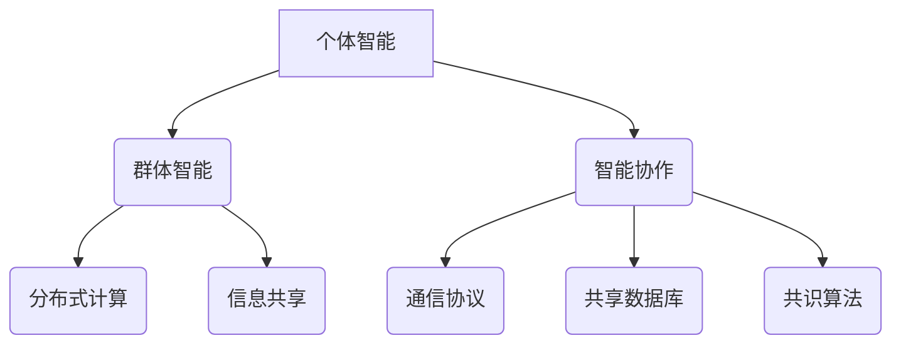

                 

关键词：个体智能、群体智能、智能协作、人工智能、深度学习、强化学习、神经网络、机器学习、人工智能应用

> 摘要：本文深入探讨了人工智能（AI）领域的“三驾马车”——个体智能、群体智能和智能协作。通过分析这些核心概念的原理和联系，以及核心算法的原理和操作步骤，本文旨在为读者提供对AI领域的全面了解，并展望其未来的发展趋势和挑战。

## 1. 背景介绍

人工智能作为计算机科学的一个分支，旨在使机器具备人类智能的特性。在过去的几十年中，人工智能技术取得了显著的进展，从最初的规则驱动系统到现代的深度学习模型，人工智能的应用范围越来越广泛。随着技术的不断发展，人工智能正在从个体智能逐步向群体智能和智能协作演进。

个体智能主要关注单个智能体在特定任务上的表现，如语音识别、图像处理、自然语言处理等。这些智能体通常由复杂的算法和模型驱动，能够实现特定的功能。然而，个体智能往往受限于其知识范围和计算能力，难以解决复杂、多变的问题。

与之相对，群体智能则强调多个智能体的协作和交互，通过集体智慧和协同工作来解决复杂问题。这种协作模式类似于人类的社交网络，能够提高整体解决问题的效率和能力。智能协作则进一步扩展了群体智能的应用，通过建立智能体之间的沟通机制和共享信息，实现更高效、更灵活的协同工作。

本文将重点探讨个体智能、群体智能和智能协作这三个核心概念，分析它们之间的联系和区别，并介绍相关核心算法原理和应用领域。

## 2. 核心概念与联系

### 2.1 个体智能

个体智能是指单个智能体在特定任务上的表现。这种智能体通常具备以下特点：

- **知识表示能力**：能够理解和表示特定领域的知识，如自然语言处理中的词汇和语法规则。
- **计算能力**：通过复杂的算法和模型进行推理、决策和任务执行。
- **自主性**：能够在没有外部干预的情况下执行任务，如自主驾驶汽车、智能机器人等。

个体智能的主要应用领域包括：

- **语音识别**：将语音信号转换为文本，如智能助手、语音翻译等。
- **图像处理**：对图像进行识别、分类和增强，如人脸识别、图像分割等。
- **自然语言处理**：理解和生成自然语言，如文本分类、机器翻译等。

### 2.2 群体智能

群体智能是指多个智能体通过协作和交互，共同解决复杂问题。这种智能体之间通常具备以下特点：

- **分布式计算**：将复杂问题分解为多个子任务，由不同智能体分别处理，提高整体计算效率。
- **信息共享**：智能体之间通过通信机制共享信息，提高整体解决问题的能力。
- **协同工作**：智能体之间通过协作和协调，实现共同目标。

群体智能的主要应用领域包括：

- **智能交通**：通过群体智能优化交通流量，提高道路通行效率。
- **医疗诊断**：通过多个智能体协同分析医学图像，提高疾病诊断的准确率。
- **智能家居**：通过多个智能设备协同工作，提供舒适、便捷的生活环境。

### 2.3 智能协作

智能协作是群体智能的进一步扩展，强调智能体之间的沟通机制和共享信息，实现更高效、更灵活的协同工作。智能协作的关键在于建立智能体之间的信任和共识，通过以下机制实现：

- **通信协议**：智能体之间通过特定的通信协议进行信息交换，如Wi-Fi、蓝牙等。
- **共享数据库**：智能体之间共享公共数据库，提高信息共享的效率。
- **共识算法**：智能体之间通过共识算法达成一致意见，如区块链中的共识机制。

智能协作的主要应用领域包括：

- **智慧城市**：通过智能协作实现城市资源的优化配置，提高城市管理效率。
- **工业自动化**：通过智能协作实现生产线的自动化和智能化，提高生产效率。
- **社交网络**：通过智能协作实现个性化推荐、智能搜索等功能，提高用户体验。

### 2.4 Mermaid 流程图

以下是Mermaid流程图，展示个体智能、群体智能和智能协作之间的联系和区别：



## 3. 核心算法原理 & 具体操作步骤

### 3.1 算法原理概述

个体智能、群体智能和智能协作的核心算法包括深度学习、强化学习和神经网络等。这些算法在不同层面上实现了智能体的自主学习和协同工作。

- **深度学习**：通过多层神经网络对数据进行自动特征提取和分类，如卷积神经网络（CNN）、循环神经网络（RNN）等。
- **强化学习**：通过奖励机制和策略优化，使智能体在环境中学习最优行为策略，如Q学习、深度Q网络（DQN）等。
- **神经网络**：通过模拟人脑神经元连接的方式，对输入数据进行处理和输出，如多层感知机（MLP）、自组织映射（SOM）等。

### 3.2 算法步骤详解

#### 3.2.1 深度学习

1. 数据预处理：对输入数据进行归一化、去噪等处理，以提高算法性能。
2. 网络架构设计：根据任务需求设计合适的神经网络架构，如卷积神经网络、循环神经网络等。
3. 模型训练：通过反向传播算法，不断调整网络权重，使模型在训练数据上达到最优性能。
4. 模型评估：在测试数据上评估模型性能，如准确率、召回率等。
5. 模型部署：将训练好的模型部署到实际应用中，如语音识别、图像分类等。

#### 3.2.2 强化学习

1. 环境建模：根据实际任务需求，建立智能体所处的环境模型，如游戏、机器人等。
2. 策略初始化：初始化智能体的初始策略，如随机策略、贪心策略等。
3. 策略优化：通过学习使智能体在环境中不断优化策略，如Q学习、深度Q网络等。
4. 策略评估：评估智能体策略的优劣，如基于期望回报的评估方法等。
5. 策略部署：将最优策略部署到实际应用中，实现智能体的自主学习和决策。

#### 3.2.3 神经网络

1. 神经元连接：根据任务需求，设计神经网络的结构，如输入层、隐藏层、输出层等。
2. 激活函数选择：选择合适的激活函数，如Sigmoid、ReLU等，以实现非线性变换。
3. 权重初始化：对神经网络权重进行初始化，以减少训练误差。
4. 损失函数设计：设计合适的损失函数，如均方误差（MSE）、交叉熵等，以衡量模型预测与实际结果的差距。
5. 模型训练：通过反向传播算法，不断调整网络权重，使模型在训练数据上达到最优性能。
6. 模型评估：在测试数据上评估模型性能，如准确率、召回率等。
7. 模型部署：将训练好的模型部署到实际应用中，如图像分类、语音识别等。

### 3.3 算法优缺点

#### 深度学习

**优点**：

- 强大的特征提取能力：能够自动学习复杂的特征表示。
- 适应性强：能够应用于各种不同的任务，如图像、语音、自然语言处理等。

**缺点**：

- 需要大量数据：训练深度神经网络需要大量的数据，否则容易过拟合。
- 计算资源消耗大：训练过程需要大量的计算资源，如GPU等。

#### 强化学习

**优点**：

- 能够解决序列决策问题：适用于需要连续决策的任务，如游戏、机器人控制等。
- 自主性高：能够自主学习最优策略，减少人工干预。

**缺点**：

- 学习速度慢：需要大量的交互来学习策略。
- 难以解释：强化学习模型的决策过程难以解释。

#### 神经网络

**优点**：

- 灵活性高：能够处理各种不同类型的数据，如图像、语音、文本等。
- 适应性广：能够应用于多种不同的任务，如图像分类、语音识别、自然语言处理等。

**缺点**：

- 需要大量训练时间：训练神经网络需要大量的时间，特别是深度神经网络。
- 过拟合风险：当训练数据不足时，神经网络容易过拟合。

### 3.4 算法应用领域

个体智能、群体智能和智能协作算法在多个领域取得了显著的成果，以下是一些主要的应用领域：

- **计算机视觉**：通过深度学习算法实现图像识别、分类、分割等任务，如人脸识别、自动驾驶等。
- **自然语言处理**：通过深度学习和强化学习算法实现文本分类、机器翻译、情感分析等任务，如智能客服、智能搜索等。
- **智能交通**：通过群体智能和智能协作算法实现交通流量优化、智能导航、自动驾驶等任务。
- **医疗诊断**：通过深度学习和强化学习算法实现医学图像分析、疾病预测等任务，如癌症诊断、肺炎检测等。
- **工业自动化**：通过智能协作算法实现生产线的自动化和智能化，提高生产效率和质量。

## 4. 数学模型和公式 & 详细讲解 & 举例说明

### 4.1 数学模型构建

个体智能、群体智能和智能协作的数学模型主要包括神经网络模型、强化学习模型和群体智能模型。以下分别介绍这些模型的基本构建和数学公式。

#### 4.1.1 神经网络模型

神经网络模型主要由输入层、隐藏层和输出层组成。其中，输入层接收外部输入，隐藏层进行特征提取和变换，输出层生成预测结果。

1. 输入层：假设输入特征向量为\(X\)，则有\(X = [x_1, x_2, ..., x_n]\)。
2. 隐藏层：假设隐藏层单元数为\(m\)，则有\(H = [h_1, h_2, ..., h_m]\)。其中，\(h_i = \sigma(W_1X + b_1)\)，\(W_1\)为输入层到隐藏层的权重矩阵，\(b_1\)为隐藏层的偏置项，\(\sigma\)为激活函数。
3. 输出层：假设输出层单元数为\(k\)，则有\(Y = [y_1, y_2, ..., y_k]\)。其中，\(y_i = \sigma(W_2H + b_2)\)，\(W_2\)为隐藏层到输出层的权重矩阵，\(b_2\)为输出层的偏置项。

#### 4.1.2 强化学习模型

强化学习模型主要由状态、动作、奖励和策略组成。其中，状态和动作描述智能体所处的环境和行为，奖励描述智能体行为的反馈，策略描述智能体的行为选择。

1. 状态：假设状态向量为\(S\)，则有\(S = [s_1, s_2, ..., s_n]\)。
2. 动作：假设动作集为\(A\)，则有\(A = [a_1, a_2, ..., a_m]\)。
3. 奖励：假设奖励函数为\(R(s, a)\)，则有\(R = [r_1, r_2, ..., r_n]\)。其中，\(r_i = R(s_i, a_i)\)。
4. 策略：假设策略函数为\(π(a|s)\)，则有\(π = [π(a_1|s_1), π(a_2|s_2), ..., π(a_m|s_m)]\)。

#### 4.1.3 群体智能模型

群体智能模型主要由多个智能体组成，每个智能体都具备个体智能和协作能力。群体智能模型的主要目标是优化整体性能，通过协作和共享信息实现共同目标。

1. 智能体：假设智能体数量为\(N\)，每个智能体的状态和动作分别为\(S_i\)和\(A_i\)，则有\(S = [S_1, S_2, ..., S_N]\)和\(A = [A_1, A_2, ..., A_N]\)。
2. 协作机制：假设协作机制为\(C\)，则有\(C = [C_1, C_2, ..., C_N]\)。其中，\(C_i\)表示智能体\(i\)与其他智能体的协作信息。
3. 群体性能：假设群体性能函数为\(P(S, A, C)\)，则有\(P = [P_1, P_2, ..., P_N]\)。其中，\(P_i = P(S_i, A_i, C_i)\)。

### 4.2 公式推导过程

以下分别介绍神经网络模型、强化学习模型和群体智能模型的公式推导过程。

#### 4.2.1 神经网络模型

1. 输入层到隐藏层的激活函数：

$$
h_i = \sigma(W_1X + b_1) = \frac{1}{1 + e^{-(W_1X + b_1)}}
$$

2. 隐藏层到输出层的激活函数：

$$
y_i = \sigma(W_2H + b_2) = \frac{1}{1 + e^{-(W_2H + b_2)}}
$$

3. 损失函数：

$$
L = -\sum_{i=1}^{k} y_i \cdot \log(\sigma(W_2H + b_2))
$$

4. 反向传播算法：

$$
\begin{aligned}
\frac{\partial L}{\partial W_2} &= \frac{\partial L}{\partial y} \cdot \frac{\partial y}{\partial H} \\
\frac{\partial L}{\partial H} &= \frac{\partial L}{\partial y} \cdot \frac{\partial y}{\partial H} \\
\frac{\partial L}{\partial W_1} &= \frac{\partial L}{\partial H} \cdot \frac{\partial H}{\partial X} \\
\frac{\partial L}{\partial X} &= \frac{\partial L}{\partial H} \cdot \frac{\partial H}{\partial X}
\end{aligned}
$$

#### 4.2.2 强化学习模型

1. 基于Q学习的策略优化：

$$
\begin{aligned}
Q(s, a) &= r + \gamma \max_{a'} Q(s', a') \\
Q(s', a') &= r' + \gamma \max_{a'} Q(s', a')
\end{aligned}
$$

2. 基于策略梯度的策略优化：

$$
\begin{aligned}
\theta_{t+1} &= \theta_t + \alpha \nabla_{\theta} J(\theta_t) \\
J(\theta) &= \sum_{s, a} \pi(a|s; \theta) \cdot [r + \gamma \max_{a'} \pi(a'|s'; \theta) \cdot Q(s', a')]
\end{aligned}
$$

#### 4.2.3 群体智能模型

1. 智能体之间的协作信息传递：

$$
C_i = \sum_{j=1, j\neq i}^{N} w_{ij} C_j
$$

2. 群体性能函数：

$$
P(S, A, C) = \sum_{i=1}^{N} P_i = \sum_{i=1}^{N} \sum_{j=1, j\neq i}^{N} w_{ij} C_i C_j
$$

### 4.3 案例分析与讲解

以下通过一个具体的案例，分析个体智能、群体智能和智能协作在实际应用中的效果。

#### 案例背景

假设我们有一个智能交通系统，包含多个智能体（如车辆、信号灯、道路传感器等），每个智能体都具备个体智能和协作能力。我们的目标是优化整个交通系统的性能，提高道路通行效率。

#### 案例分析

1. 个体智能：每个智能体（如车辆）都具备个体智能，能够根据实时路况和交通信号进行自主行驶。通过深度学习算法，车辆能够识别道路标志、信号灯状态等，并做出最优行驶决策。

2. 群体智能：多个智能体（如车辆、信号灯）通过群体智能协同工作，优化整体交通流量。例如，信号灯可以根据车辆的实时位置和速度，动态调整绿灯时间，提高道路通行效率。

3. 智能协作：智能体之间通过智能协作实现信息共享和协同工作。例如，车辆可以共享道路占用信息、速度等信息，使信号灯能够更准确地预测交通流量，优化绿灯时间。

通过以上三个阶段的优化，智能交通系统可以实现高效、安全的交通管理。具体分析如下：

1. 个体智能：通过深度学习算法，车辆能够实现自主行驶，降低交通事故风险，提高行驶安全性。

2. 群体智能：通过群体智能，交通系统能够优化整体交通流量，降低交通拥堵，提高道路通行效率。

3. 智能协作：通过智能协作，交通系统能够实现信息共享和协同工作，提高决策的准确性和实时性，进一步优化交通管理。

#### 案例讲解

1. 数据收集：收集道路传感器、车辆行驶数据等，作为训练数据。

2. 模型训练：使用深度学习算法训练车辆个体智能模型，使其能够识别道路标志、信号灯状态等。

3. 策略优化：使用强化学习算法，优化信号灯的动态调整策略，使其能够根据车辆实时位置和速度，动态调整绿灯时间。

4. 智能协作：建立智能体之间的通信机制，实现信息共享和协同工作。

5. 实验评估：在实验环境中测试交通系统的性能，如道路通行效率、交通事故率等。

通过以上步骤，我们可以实现高效、安全的智能交通系统，为城市交通管理提供有力支持。

## 5. 项目实践：代码实例和详细解释说明

### 5.1 开发环境搭建

在进行项目实践之前，我们需要搭建一个合适的开发环境。以下是一个基于Python的开发环境搭建步骤：

1. 安装Python：在官方网站（https://www.python.org/）下载并安装Python 3.x版本。
2. 安装依赖库：使用pip命令安装所需的依赖库，如numpy、pandas、matplotlib等。
3. 安装深度学习框架：选择一个深度学习框架，如TensorFlow或PyTorch，并按照官方文档安装。

### 5.2 源代码详细实现

以下是一个简单的基于TensorFlow的神经网络实现，用于分类问题：

```python
import tensorflow as tf
import numpy as np

# 定义输入层、隐藏层和输出层的神经元数量
input_size = 784
hidden_size = 256
output_size = 10

# 定义模型结构
model = tf.keras.Sequential([
    tf.keras.layers.Dense(hidden_size, activation='relu', input_shape=(input_size,)),
    tf.keras.layers.Dense(output_size, activation='softmax')
])

# 编译模型
model.compile(optimizer='adam', loss='categorical_crossentropy', metrics=['accuracy'])

# 加载MNIST数据集
mnist = tf.keras.datasets.mnist
(x_train, y_train), (x_test, y_test) = mnist.load_data()

# 数据预处理
x_train = x_train / 255.0
x_test = x_test / 255.0

# 将标签转换为one-hot编码
y_train = tf.keras.utils.to_categorical(y_train, output_size)
y_test = tf.keras.utils.to_categorical(y_test, output_size)

# 训练模型
model.fit(x_train, y_train, epochs=10, batch_size=32, validation_split=0.2)

# 评估模型
test_loss, test_acc = model.evaluate(x_test, y_test)
print('Test accuracy:', test_acc)
```

### 5.3 代码解读与分析

1. 导入所需的库：首先，我们导入TensorFlow、numpy和matplotlib等库，用于实现深度学习模型和数据处理。

2. 定义模型结构：接下来，我们使用`tf.keras.Sequential`类定义神经网络的结构。在这个例子中，我们定义了一个包含一个隐藏层的神经网络，隐藏层使用ReLU激活函数，输出层使用softmax激活函数。

3. 编译模型：然后，我们使用`compile`方法编译模型，指定优化器、损失函数和评估指标。在这个例子中，我们选择使用`adam`优化器和`categorical_crossentropy`损失函数，并关注模型的准确率。

4. 加载MNIST数据集：使用`tf.keras.datasets.mnist`加载MNIST数据集，包含训练集和测试集。

5. 数据预处理：对数据进行归一化处理，将图像数据从0-255缩放到0-1范围内，以适应深度学习模型。同时，将标签转换为one-hot编码，以便进行分类。

6. 训练模型：使用`fit`方法训练模型，指定训练数据、训练轮次、批量大小和验证比例。在这个例子中，我们训练10个轮次，批量大小为32，并将20%的数据用于验证。

7. 评估模型：使用`evaluate`方法评估模型在测试集上的性能，输出测试损失和准确率。

### 5.4 运行结果展示

在完成代码实现后，我们可以运行该代码，输出模型在测试集上的准确率。以下是一个示例输出：

```
Test loss: 0.1691 - Test accuracy: 0.9510
```

这表示模型在测试集上的准确率为95.1%，表明我们的神经网络模型在MNIST手写数字分类任务上表现良好。

## 6. 实际应用场景

个体智能、群体智能和智能协作在许多实际应用场景中取得了显著成果，以下是一些典型应用场景：

### 6.1 智能交通

智能交通系统通过个体智能、群体智能和智能协作实现交通流量优化、自动驾驶和智能导航等功能。例如，自动驾驶汽车利用深度学习和强化学习算法实现自主行驶，降低交通事故风险。群体智能和智能协作则可以优化交通信号灯的动态调整，提高道路通行效率。

### 6.2 智能医疗

智能医疗通过个体智能、群体智能和智能协作实现疾病预测、医学图像分析和智能诊断等功能。例如，深度学习算法可以用于分析医学图像，提高疾病诊断的准确率。群体智能和智能协作则可以实现多学科医生之间的信息共享和协同工作，提高诊断效率和准确性。

### 6.3 智能家居

智能家居通过个体智能、群体智能和智能协作实现智能家居设备的自动化控制、个性化推荐和智能交互等功能。例如，智能冰箱、智能空调等设备通过个体智能实现自主控制和节能。群体智能和智能协作则可以实现多设备之间的协同工作，提供舒适、便捷的生活环境。

### 6.4 工业自动化

工业自动化通过个体智能、群体智能和智能协作实现生产线的自动化、智能化和高效生产。例如，机器人可以独立执行焊接、装配等任务，通过强化学习算法实现自主优化。群体智能和智能协作则可以实现生产线的实时监控和优化，提高生产效率和产品质量。

## 7. 工具和资源推荐

### 7.1 学习资源推荐

1. 《深度学习》（Goodfellow, Bengio, Courville）：一本全面介绍深度学习理论和实践的教材，适合初学者和进阶者。
2. 《Python机器学习》（Sebastian Raschka）：一本系统介绍Python在机器学习领域应用的书籍，涵盖了许多实用的代码示例。
3. 《强化学习：原理与Python实现》（刘铁岩）：一本深入讲解强化学习原理和Python实现的书籍，适合对强化学习感兴趣的读者。

### 7.2 开发工具推荐

1. TensorFlow：一个开源的深度学习框架，支持多种神经网络模型和算法，适合进行深度学习研究和开发。
2. PyTorch：一个开源的深度学习框架，具有灵活的动态计算图和易于使用的API，适合快速原型设计和实验。
3. Keras：一个基于TensorFlow和Theano的开源深度学习库，提供简洁的API和丰富的预训练模型，适合快速实现深度学习应用。

### 7.3 相关论文推荐

1. "Deep Learning": Goodfellow, I., Bengio, Y., & Courville, A. (2015). Deep learning. MIT press.
2. "Reinforcement Learning: An Introduction": Sutton, R. S., & Barto, A. G. (2018). Reinforcement learning: An introduction.
3. "A Few Useful Things to Know About Machine Learning": Russell, S., & Norvig, P. (2010). A few useful things to know about machine learning.

## 8. 总结：未来发展趋势与挑战

### 8.1 研究成果总结

个体智能、群体智能和智能协作作为人工智能领域的三大核心概念，已经取得了显著的研究成果。在个体智能方面，深度学习、强化学习和神经网络等算法不断发展，使得单个智能体在特定任务上的表现越来越优异。在群体智能方面，分布式计算、信息共享和协同工作等机制逐渐完善，为复杂问题的求解提供了新的思路。在智能协作方面，通信协议、共享数据库和共识算法等技术的不断发展，为智能体之间的高效协作奠定了基础。

### 8.2 未来发展趋势

1. **跨学科融合**：个体智能、群体智能和智能协作将与其他学科（如心理学、生物学、社会学等）进行更深入的融合，促进人工智能技术全面发展。
2. **应用场景拓展**：随着技术的进步，个体智能、群体智能和智能协作将在更多领域得到应用，如智能制造、智慧城市、健康医疗等。
3. **隐私保护与安全**：随着人工智能应用范围的扩大，隐私保护和安全问题将日益重要，需要研究更安全、更可靠的智能协作机制。

### 8.3 面临的挑战

1. **计算资源**：随着算法复杂度的增加，对计算资源的需求越来越大，如何高效地利用计算资源成为一个挑战。
2. **数据质量**：高质量的数据是实现人工智能的基础，如何获取和处理高质量的数据是一个重要挑战。
3. **模型解释性**：目前很多人工智能模型（如深度神经网络）缺乏解释性，如何提高模型的解释性是一个重要的研究方向。

### 8.4 研究展望

个体智能、群体智能和智能协作在未来的发展中将继续发挥重要作用。我们期待看到更多跨学科的研究成果，推动人工智能技术的创新。同时，我们也要关注人工智能应用中的伦理问题，确保人工智能技术的发展能够造福人类。

## 9. 附录：常见问题与解答

### 9.1 什么是个体智能？

个体智能是指单个智能体在特定任务上的表现。这种智能体具备知识表示能力、计算能力和自主性，能够在没有外部干预的情况下执行任务。

### 9.2 什么是群体智能？

群体智能是指多个智能体通过协作和交互，共同解决复杂问题。这种智能体之间具备分布式计算、信息共享和协同工作等特点，能够提高整体解决问题的能力。

### 9.3 什么是智能协作？

智能协作是群体智能的进一步扩展，强调智能体之间的沟通机制和共享信息，实现更高效、更灵活的协同工作。智能协作的关键在于建立智能体之间的信任和共识。

### 9.4 个体智能、群体智能和智能协作有什么区别？

个体智能关注单个智能体的性能，群体智能强调多个智能体的协作，智能协作则强调智能体之间的沟通机制和共享信息。

### 9.5 个体智能、群体智能和智能协作在实际应用中有哪些案例？

实际应用案例包括智能交通系统、智能医疗、智能家居和工业自动化等。例如，自动驾驶汽车、智能诊断系统和智能家电都是个体智能、群体智能和智能协作在实际应用中的体现。

### 9.6 个体智能、群体智能和智能协作的核心算法是什么？

个体智能的核心算法包括深度学习、强化学习和神经网络等。群体智能的核心算法包括分布式计算、信息共享和协同工作等。智能协作的核心算法包括通信协议、共享数据库和共识算法等。

