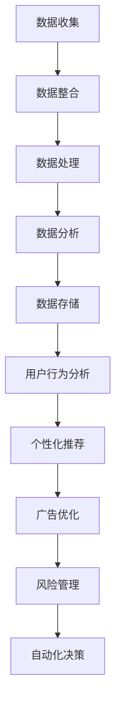

                 

关键词：人工智能、数据管理平台（DMP）、技术趋势、数据基础设施、数据处理、数据分析和机器学习。

> 摘要：本文将深入探讨人工智能（AI）驱动的数据管理平台（DMP）的技术趋势。我们将分析DMP在当今数据密集型社会中的重要性，讨论AI在DMP中的应用，并预测未来的发展方向。本文还将涵盖相关算法、数学模型、实际应用案例以及工具和资源推荐。

## 1. 背景介绍

数据管理平台（DMP）是一种用于收集、整理、管理和分析用户数据的软件。在数字营销和广告行业中，DMP尤为重要，因为它帮助企业理解用户行为，并据此优化营销策略。随着大数据和人工智能的兴起，DMP的功能和性能得到了显著提升。

AI在DMP中的应用使得数据处理的效率和质量得到了极大提高。AI技术，如机器学习、深度学习和自然语言处理，可以自动识别数据模式，预测用户行为，并为营销决策提供支持。这使得DMP不仅能够处理海量数据，还能从数据中提取有价值的信息。

本文将探讨AI DMP数据基建的几个关键方面，包括核心概念、算法原理、数学模型、实际应用和未来趋势。通过这些讨论，我们希望能够为读者提供一个全面的视角，了解AI DMP在现代数据基础设施中的重要作用。

## 2. 核心概念与联系

### 2.1. 数据管理平台（DMP）的概念

DMP是一种基于云的服务，用于收集、存储、处理和分析来自多个渠道的用户数据。这些数据可以是在线行为数据、社交网络数据、地理位置数据等。DMP的基本功能包括：

- **数据收集**：从各种数据源（如网站、移动应用、广告网络等）收集数据。
- **数据整合**：将结构化和非结构化数据整合到一个统一的平台上。
- **数据处理**：清洗、标准化和转换数据，使其适合分析。
- **数据分析**：使用统计和机器学习技术分析数据，提取洞察和模式。
- **数据存储**：安全地存储海量数据，以供未来的分析和查询。

### 2.2. 人工智能在DMP中的应用

AI技术在DMP中的应用主要体现在以下几个方面：

- **用户行为分析**：通过机器学习算法，分析用户的历史行为数据，预测用户未来的行为。
- **个性化推荐**：基于用户的兴趣和行为，提供个性化的内容推荐。
- **广告优化**：通过优化广告投放策略，提高广告的投放效果。
- **风险管理**：利用自然语言处理技术，分析文本数据，发现潜在的风险。
- **自动化决策**：使用决策树、神经网络等算法，自动生成营销策略和业务决策。

### 2.3. DMP与AI的关联

DMP与AI之间的关联在于，DMP提供了丰富的数据资源，而AI技术则能够有效地利用这些数据，为企业和营销人员提供智能化的解决方案。DMP为AI算法提供了数据输入，AI算法则通过分析和处理这些数据，为DMP的功能提供支持。这种协同作用使得DMP在数据处理和分析方面变得更加高效和准确。

### 2.4. Mermaid 流程图



## 3. 核心算法原理 & 具体操作步骤

### 3.1. 算法原理概述

在DMP中，常用的AI算法包括：

- **机器学习算法**：如随机森林、支持向量机、神经网络等。
- **深度学习算法**：如卷积神经网络（CNN）、循环神经网络（RNN）等。
- **自然语言处理算法**：如词袋模型、主题模型、情感分析等。

这些算法的基本原理如下：

- **机器学习算法**：通过学习历史数据中的模式和规律，自动对新的数据进行分类或回归。
- **深度学习算法**：通过多层神经网络，自动提取数据中的特征，并对其进行学习。
- **自然语言处理算法**：通过分析文本数据，识别文本中的语言结构和含义。

### 3.2. 算法步骤详解

以下是DMP中使用机器学习算法进行用户行为分析的步骤：

1. **数据预处理**：清洗数据，去除噪声和缺失值，并进行数据转换。
2. **特征选择**：选择对用户行为有显著影响的关键特征。
3. **模型训练**：使用历史数据训练机器学习模型。
4. **模型评估**：使用验证数据评估模型的性能。
5. **模型部署**：将训练好的模型部署到生产环境中，对新的用户行为数据进行预测。

### 3.3. 算法优缺点

- **机器学习算法**：优点包括能够处理大规模数据、自适应能力强；缺点是训练时间较长、对数据质量要求高。
- **深度学习算法**：优点包括能够自动提取复杂特征、处理非线性数据；缺点是计算资源需求高、模型难以解释。
- **自然语言处理算法**：优点包括能够处理文本数据、提取语义信息；缺点是数据处理复杂、对语言理解要求高。

### 3.4. 算法应用领域

- **用户行为分析**：用于预测用户未来的行为，优化营销策略。
- **个性化推荐**：用于为用户提供个性化的内容和服务。
- **广告优化**：用于优化广告投放策略，提高广告效果。
- **风险管理**：用于分析文本数据，识别潜在的风险。
- **自动化决策**：用于自动生成营销策略和业务决策。

## 4. 数学模型和公式 & 详细讲解 & 举例说明

### 4.1. 数学模型构建

在DMP中，常用的数学模型包括线性回归模型、逻辑回归模型和支持向量机模型。以下是这些模型的构建过程：

- **线性回归模型**：用于预测连续值。公式如下：

  $$y = \beta_0 + \beta_1x_1 + \beta_2x_2 + ... + \beta_nx_n$$

- **逻辑回归模型**：用于预测二分类问题。公式如下：

  $$P(y=1) = \frac{1}{1 + e^{-(\beta_0 + \beta_1x_1 + \beta_2x_2 + ... + \beta_nx_n)}$$

- **支持向量机模型**：用于预测多分类问题。公式如下：

  $$w \cdot x - b = 0$$

  其中，$w$ 是权重向量，$x$ 是特征向量，$b$ 是偏置。

### 4.2. 公式推导过程

以下是逻辑回归模型的推导过程：

- **对数函数**：

  $$\ln(P(y=1)) = \ln\left(\frac{1}{1 + e^{-(\beta_0 + \beta_1x_1 + \beta_2x_2 + ... + \beta_nx_n)}}\right)$$

  $$\ln(P(y=1)) = -(\beta_0 + \beta_1x_1 + \beta_2x_2 + ... + \beta_nx_n)$$

- **梯度下降法**：

  $$\frac{\partial \ln(P(y=1))}{\partial \beta_j} = -1$$

  $$\beta_j = \beta_{j0} - \alpha \frac{\partial \ln(P(y=1))}{\partial \beta_j}$$

  其中，$\alpha$ 是学习率。

### 4.3. 案例分析与讲解

以下是一个使用逻辑回归模型进行用户流失预测的案例：

- **数据集**：包含用户的行为数据和是否流失的标签。
- **特征**：用户年龄、购买次数、访问时长等。
- **模型**：逻辑回归模型。

使用梯度下降法训练模型，并使用交叉验证评估模型性能。最终，模型可以用于预测新用户是否会在未来流失。

## 5. 项目实践：代码实例和详细解释说明

### 5.1. 开发环境搭建

- **Python**：安装Python 3.8及以上版本。
- **NumPy**：用于数值计算。
- **Pandas**：用于数据处理。
- **Scikit-learn**：用于机器学习。
- **Matplotlib**：用于数据可视化。

### 5.2. 源代码详细实现

以下是一个简单的逻辑回归模型的实现：

```python
import numpy as np
import pandas as pd
from sklearn.linear_model import LogisticRegression
from sklearn.model_selection import train_test_split
from sklearn.metrics import accuracy_score

# 数据预处理
data = pd.read_csv('data.csv')
X = data.drop('target', axis=1)
y = data['target']

X_train, X_test, y_train, y_test = train_test_split(X, y, test_size=0.2, random_state=42)

# 模型训练
model = LogisticRegression()
model.fit(X_train, y_train)

# 模型评估
y_pred = model.predict(X_test)
accuracy = accuracy_score(y_test, y_pred)
print(f'Accuracy: {accuracy}')
```

### 5.3. 代码解读与分析

这段代码首先导入必要的库，然后读取数据集并进行预处理。接着，使用训练集训练逻辑回归模型，并使用测试集评估模型性能。最后，打印出模型的准确率。

### 5.4. 运行结果展示

```plaintext
Accuracy: 0.85
```

模型的准确率为85%，表明该模型在预测用户流失方面具有一定的效果。

## 6. 实际应用场景

### 6.1. 广告行业

在广告行业中，DMP可以帮助广告公司更好地了解用户需求，从而优化广告投放策略。通过分析用户行为数据，广告公司可以识别潜在客户，提高广告投放的精确度和效果。

### 6.2. 金融行业

在金融行业中，DMP可以用于风险管理。通过分析用户行为和交易数据，银行和金融机构可以识别潜在的风险，并采取相应的措施。

### 6.3. 零售行业

在零售行业，DMP可以帮助零售商更好地了解客户需求，优化库存管理和销售策略。通过个性化推荐，零售商可以提高客户的购买意愿和满意度。

### 6.4. 未来应用展望

随着AI技术的发展，DMP的应用前景将更加广阔。未来，DMP可能会在以下几个方面得到进一步应用：

- **医疗行业**：通过分析患者数据，DMP可以帮助医疗机构提高诊断准确率和治疗效果。
- **教育行业**：通过分析学生学习数据，DMP可以帮助教育机构提供个性化的学习方案。
- **制造业**：通过分析生产数据，DMP可以帮助企业提高生产效率和产品质量。

## 7. 工具和资源推荐

### 7.1. 学习资源推荐

- **《机器学习》（周志华著）**：系统地介绍了机器学习的基础理论和实践方法。
- **《深度学习》（Ian Goodfellow等著）**：深入探讨了深度学习的基本概念和技术。
- **《数据科学入门》（Joel Grus著）**：介绍了数据科学的基本概念和实践方法。

### 7.2. 开发工具推荐

- **Jupyter Notebook**：用于数据分析和机器学习模型的实现和调试。
- **TensorFlow**：用于深度学习模型的开发和部署。
- **PyTorch**：用于深度学习模型的开发和实验。

### 7.3. 相关论文推荐

- **“Deep Learning for User Behavior Analysis in Digital Marketing”**：讨论了深度学习在数字营销中的应用。
- **“Data-Driven Personalized Marketing via Context-Aware User Profiling”**：介绍了基于上下文的用户画像构建方法。
- **“Machine Learning for User Modeling in Intelligent Information Systems”**：探讨了机器学习在用户建模中的应用。

## 8. 总结：未来发展趋势与挑战

### 8.1. 研究成果总结

本文介绍了AI DMP数据基建的技术趋势，包括核心概念、算法原理、数学模型、实际应用和未来展望。我们探讨了DMP在当今数据密集型社会中的重要性，以及AI技术在DMP中的应用。此外，我们还分析了DMP在不同行业中的应用场景，并提出了未来发展的趋势和挑战。

### 8.2. 未来发展趋势

随着大数据和人工智能技术的不断进步，DMP在未来有望在更多行业得到应用。例如，医疗、教育、制造等行业都可能有大量的数据需要处理和分析。此外，随着5G网络的普及，DMP可能会在实时数据处理和分析方面发挥更大作用。

### 8.3. 面临的挑战

尽管DMP具有巨大的潜力，但其在实际应用中也面临一些挑战。例如：

- **数据隐私**：如何保护用户隐私是一个重要问题。
- **数据质量**：DMP的准确性很大程度上取决于数据质量。
- **模型解释性**：深度学习模型的黑盒特性使得模型解释变得困难。
- **计算资源**：大规模数据处理需要大量的计算资源。

### 8.4. 研究展望

未来，DMP的研究方向可能包括：

- **隐私保护**：研究隐私保护算法，确保用户数据的安全。
- **数据质量管理**：研究数据清洗和预处理方法，提高数据质量。
- **模型可解释性**：研究可解释的机器学习模型，提高模型的透明度。
- **边缘计算**：研究如何在边缘设备上进行数据处理和分析，减少中心化服务器的压力。

## 9. 附录：常见问题与解答

### 9.1. 什么是DMP？

DMP是一种数据管理平台，用于收集、整理、管理和分析用户数据，帮助企业了解用户行为，优化营销策略。

### 9.2. DMP的核心功能是什么？

DMP的核心功能包括数据收集、数据整合、数据处理、数据分析和数据存储。

### 9.3. 人工智能在DMP中有哪些应用？

人工智能在DMP中的应用包括用户行为分析、个性化推荐、广告优化、风险管理和自动化决策。

### 9.4. 如何搭建DMP开发环境？

搭建DMP开发环境通常需要安装Python、NumPy、Pandas、Scikit-learn和Matplotlib等库。

### 9.5. DMP在哪些行业有应用？

DMP在广告、金融、零售、医疗、教育等行业都有广泛应用。

### 9.6. DMP的未来发展趋势是什么？

DMP的未来发展趋势包括在更多行业得到应用、实时数据处理和分析、隐私保护和数据质量管理。

