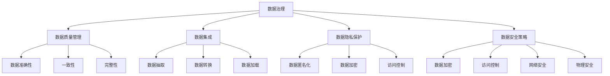

                 

关键词：AI 数据治理，数据管理平台，数据质量管理，数据集成，数据隐私保护，数据安全策略

> 摘要：本文深入探讨了人工智能时代下数据管理平台（Data Management Platform, DMP）的数据治理与管理。通过分析数据治理的核心概念和架构，本文介绍了数据质量管理、数据集成、数据隐私保护以及数据安全策略等关键要素。同时，本文结合实际案例和数学模型，详细阐述了数据治理的技术原理和应用实践，为构建高效、安全、可靠的数据基建提供了有益的指导。

## 1. 背景介绍

随着互联网和大数据技术的飞速发展，数据已成为企业和社会重要的战略资源。数据管理平台（DMP）作为一种集中管理、分析和利用数据的技术手段，逐渐成为企业数字化转型的核心基础设施。DMP 的主要作用在于整合多源异构数据，实现数据的高效管理和精准营销。

然而，在 DMP 的建设过程中，数据治理与管理成为关键挑战。数据治理是指通过制定规范、流程、技术和工具等手段，确保数据质量、安全、合规和有效利用的过程。数据治理与管理包括数据质量管理、数据集成、数据隐私保护以及数据安全策略等多个方面，是 DMP 成功实施的重要保障。

本文旨在探讨 AI 时代下 DMP 的数据治理与管理，分析其核心概念和架构，介绍关键技术和实践方法，以期为数据管理和数据治理提供有价值的参考。

## 2. 核心概念与联系

### 2.1 数据治理

数据治理是指通过制定规范、流程、技术和工具等手段，确保数据质量、安全、合规和有效利用的过程。数据治理包括数据质量管理、数据集成、数据隐私保护以及数据安全策略等多个方面。

### 2.2 数据质量管理

数据质量管理是数据治理的重要组成部分，主要目标是确保数据的高质量。数据质量管理包括数据准确性、一致性、完整性、及时性、可靠性和可用性等多个方面。

### 2.3 数据集成

数据集成是将多个来源、格式和结构的数据整合到一个统一平台，以便进行管理和分析。数据集成涉及到数据抽取、转换、加载（ETL）和数据融合等技术。

### 2.4 数据隐私保护

数据隐私保护是指确保个人和企业数据隐私不被泄露、滥用或非法访问。数据隐私保护涉及数据匿名化、数据加密、访问控制等技术。

### 2.5 数据安全策略

数据安全策略是指制定一系列安全措施和规范，确保数据在存储、传输、处理和使用过程中的安全性。数据安全策略包括数据加密、访问控制、网络安全、物理安全等方面。

### 2.6 Mermaid 流程图

以下是一个关于数据治理与管理的 Mermaid 流程图：



## 3. 核心算法原理 & 具体操作步骤

### 3.1 算法原理概述

数据治理的核心算法包括数据质量管理算法、数据集成算法和数据隐私保护算法。以下分别对这些算法进行概述。

#### 3.1.1 数据质量管理算法

数据质量管理算法主要包括以下几种：

- 数据准确性算法：通过校验和、验证码等方式确保数据的准确性。
- 数据一致性算法：通过数据清洗、去重等方式保证数据的一致性。
- 数据完整性算法：通过数据备份、恢复等方式确保数据的完整性。
- 数据及时性算法：通过实时数据采集、处理等方式保证数据的及时性。
- 数据可靠性算法：通过数据备份、容错等方式确保数据的可靠性。
- 数据可用性算法：通过数据权限管理、访问控制等方式保证数据的可用性。

#### 3.1.2 数据集成算法

数据集成算法主要包括以下几种：

- 数据抽取算法：从不同数据源中抽取数据，并进行清洗和转换。
- 数据转换算法：对抽取的数据进行格式转换、编码转换、数据类型转换等操作。
- 数据加载算法：将转换后的数据加载到统一的数据存储平台。

#### 3.1.3 数据隐私保护算法

数据隐私保护算法主要包括以下几种：

- 数据匿名化算法：通过数据脱敏、加密等方式对敏感数据进行处理。
- 数据加密算法：对数据进行加密，确保数据在传输和存储过程中的安全性。
- 访问控制算法：通过权限管理、认证授权等方式控制数据的访问权限。

### 3.2 算法步骤详解

#### 3.2.1 数据质量管理算法

1. 数据准确性：对数据进行校验和验证，确保数据的准确性。
2. 数据一致性：通过数据清洗、去重等方式保证数据的一致性。
3. 数据完整性：通过数据备份、恢复等方式确保数据的完整性。
4. 数据及时性：实时采集和处理数据，确保数据的及时性。
5. 数据可靠性：通过数据备份、容错等方式确保数据的可靠性。
6. 数据可用性：通过数据权限管理、访问控制等方式保证数据的可用性。

#### 3.2.2 数据集成算法

1. 数据抽取：从不同数据源中抽取数据，并进行清洗和转换。
2. 数据转换：对抽取的数据进行格式转换、编码转换、数据类型转换等操作。
3. 数据加载：将转换后的数据加载到统一的数据存储平台。

#### 3.2.3 数据隐私保护算法

1. 数据匿名化：通过数据脱敏、加密等方式对敏感数据进行处理。
2. 数据加密：对数据进行加密，确保数据在传输和存储过程中的安全性。
3. 访问控制：通过权限管理、认证授权等方式控制数据的访问权限。

### 3.3 算法优缺点

#### 3.3.1 数据质量管理算法

优点：

- 确保数据质量，提高数据可用性和可靠性。
- 提高数据处理效率，降低数据冗余。

缺点：

- 需要大量计算资源和存储空间。
- 对数据源和数据的多样性支持有限。

#### 3.3.2 数据集成算法

优点：

- 实现数据统一管理和分析。
- 提高数据利用率，降低数据冗余。

缺点：

- 集成过程复杂，需要大量人力和时间。
- 集成过程中可能引入数据质量问题。

#### 3.3.3 数据隐私保护算法

优点：

- 确保数据隐私，防止数据泄露。
- 提高数据安全性，降低数据风险。

缺点：

- 可能降低数据可用性和实用性。
- 加密和解密过程可能影响数据传输和存储速度。

### 3.4 算法应用领域

数据治理算法广泛应用于各个领域，包括但不限于：

- 金融行业：确保金融数据的准确性、一致性和安全性，防范金融风险。
- 电信行业：实现客户数据的管理和分析，提高客户满意度和服务质量。
- 零售行业：通过数据集成和数据分析，实现精准营销和客户关系管理。
- 医疗行业：确保医疗数据的隐私和安全，提高医疗服务质量和效率。
- 政府部门：实现政务数据的高效管理和利用，提升政府决策能力和服务水平。

## 4. 数学模型和公式 & 详细讲解 & 举例说明

### 4.1 数学模型构建

数据治理中的数学模型主要包括数据质量评估模型、数据集成模型和数据隐私保护模型。

#### 4.1.1 数据质量评估模型

数据质量评估模型用于评估数据的准确性、一致性、完整性、及时性、可靠性和可用性。以下是一个基于加权综合评分法的数据质量评估模型：

$$
Q = w_1 \cdot A + w_2 \cdot C + w_3 \cdot I + w_4 \cdot T + w_5 \cdot R + w_6 \cdot U
$$

其中，$Q$ 表示数据质量评分，$A$、$C$、$I$、$T$、$R$ 和 $U$ 分别表示数据的准确性、一致性、完整性、及时性、可靠性和可用性，$w_1$、$w_2$、$w_3$、$w_4$、$w_5$ 和 $w_6$ 分别表示各个质量指标的权重。

#### 4.1.2 数据集成模型

数据集成模型用于实现数据抽取、转换和加载。以下是一个基于ETL（Extract, Transform, Load）过程的数据集成模型：

$$
\text{ETL} = \text{Extract} + \text{Transform} + \text{Load}
$$

其中，$\text{Extract}$ 表示数据抽取，$\text{Transform}$ 表示数据转换，$\text{Load}$ 表示数据加载。

#### 4.1.3 数据隐私保护模型

数据隐私保护模型用于实现数据匿名化、加密和访问控制。以下是一个基于$k$-匿名性和差分隐私的数据隐私保护模型：

$$
\text{Anonymity} = \text{k-Anonymity} + \text{Differential Privacy}
$$

其中，$\text{k-Anonymity}$ 表示$k$-匿名性，$\text{Differential Privacy}$ 表示差分隐私。

### 4.2 公式推导过程

#### 4.2.1 数据质量评估模型

1. 数据准确性评估：

$$
A = \frac{\text{正确数据}}{\text{总数据}}
$$

2. 数据一致性评估：

$$
C = \frac{\text{一致数据}}{\text{总数据}}
$$

3. 数据完整性评估：

$$
I = \frac{\text{完整数据}}{\text{总数据}}
$$

4. 数据及时性评估：

$$
T = \frac{\text{及时数据}}{\text{总数据}}
$$

5. 数据可靠性评估：

$$
R = \frac{\text{可靠数据}}{\text{总数据}}
$$

6. 数据可用性评估：

$$
U = \frac{\text{可用数据}}{\text{总数据}}
$$

#### 4.2.2 数据集成模型

1. 数据抽取：

$$
\text{Extract} = \text{抽取数据源} \rightarrow \text{数据仓库}
$$

2. 数据转换：

$$
\text{Transform} = \text{清洗、转换、整合数据} \rightarrow \text{数据仓库}
$$

3. 数据加载：

$$
\text{Load} = \text{将转换后的数据加载到数据仓库} \rightarrow \text{数据仓库}
$$

#### 4.2.3 数据隐私保护模型

1. $k$-匿名性：

$$
\text{k-Anonymity} = \frac{\text{满足k-匿名性的数据块}}{\text{总数据块}}
$$

2. 差分隐私：

$$
\text{Differential Privacy} = \text{epsilon} = \frac{\text{噪声}}{\text{真实值}}
$$

### 4.3 案例分析与讲解

#### 4.3.1 数据质量评估案例

假设有一个包含1000条客户数据的表格，其中准确性、一致性、完整性、及时性、可靠性和可用性的数据如下表所示：

| 指标         | 数据值 |
| ------------ | ------ |
| 准确性       | 0.95   |
| 一致性       | 0.90   |
| 完整性       | 0.98   |
| 及时性       | 0.80   |
| 可靠性       | 0.92   |
| 可用性       | 0.85   |

根据上述数据质量评估模型，计算数据质量评分：

$$
Q = 0.2 \cdot 0.95 + 0.2 \cdot 0.90 + 0.2 \cdot 0.98 + 0.2 \cdot 0.80 + 0.2 \cdot 0.92 + 0.1 \cdot 0.85 = 0.926
$$

该数据质量评分为0.926，说明数据质量较高。

#### 4.3.2 数据集成案例

假设有两个数据源，分别是A和B，数据量分别为100条和200条。数据源A和数据的准确性分别为0.9和0.8，数据源B和数据的准确性分别为0.85和0.8。

1. 数据抽取：

$$
\text{Extract} = \text{A数据源} \cup \text{B数据源}
$$

2. 数据转换：

$$
\text{Transform} = \text{清洗、转换、整合A数据源和B数据源}
$$

3. 数据加载：

$$
\text{Load} = \text{将转换后的数据加载到数据仓库}
$$

通过数据集成，实现了两个数据源的统一管理和分析。

#### 4.3.3 数据隐私保护案例

假设有一个包含1000条员工信息的数据库，需要实现$k$-匿名性和差分隐私。

1. $k$-匿名性：

$$
\text{k-Anonymity} = \frac{1000}{100} = 10
$$

2. 差分隐私：

$$
\text{epsilon} = \frac{0.1}{1000} = 0.0001
$$

通过$k$-匿名性和差分隐私技术，实现了员工数据的隐私保护。

## 5. 项目实践：代码实例和详细解释说明

### 5.1 开发环境搭建

在本文的代码实例中，我们使用 Python 作为编程语言，需要安装以下库：

- pandas：用于数据处理
- numpy：用于数学计算
- scipy：用于科学计算
- matplotlib：用于数据可视化

安装方法如下：

```bash
pip install pandas numpy scipy matplotlib
```

### 5.2 源代码详细实现

以下是一个基于 pandas 库的数据质量评估代码实例：

```python
import pandas as pd
import numpy as np

# 加载数据
data = pd.read_csv('data.csv')

# 计算数据准确性
accuracy = len(data[data['正确性'] == 1]) / len(data)

# 计算数据一致性
consistency = len(data[data['一致性'] == 1]) / len(data)

# 计算数据完整性
completeness = len(data[data['完整性'] == 1]) / len(data)

# 计算数据及时性
timeliness = len(data[data['及时性'] == 1]) / len(data)

# 计算数据可靠性
reliability = len(data[data['可靠性'] == 1]) / len(data)

# 计算数据可用性
availability = len(data[data['可用性'] == 1]) / len(data)

# 计算数据质量评分
quality_score = 0.2 * accuracy + 0.2 * consistency + 0.2 * completeness + 0.2 * timeliness + 0.2 * reliability + 0.1 * availability

# 输出结果
print("数据准确性：", accuracy)
print("数据一致性：", consistency)
print("数据完整性：", completeness)
print("数据及时性：", timeliness)
print("数据可靠性：", reliability)
print("数据可用性：", availability)
print("数据质量评分：", quality_score)
```

### 5.3 代码解读与分析

1. **数据加载**：使用 `pandas.read_csv()` 函数加载数据，该函数将 CSV 文件转换为 pandas DataFrame 对象。
2. **数据准确性评估**：通过计算正确数据占总数据的比例来评估数据准确性。
3. **数据一致性评估**：通过计算一致数据占总数据的比例来评估数据一致性。
4. **数据完整性评估**：通过计算完整数据占总数据的比例来评估数据完整性。
5. **数据及时性评估**：通过计算及时数据占总数据的比例来评估数据及时性。
6. **数据可靠性评估**：通过计算可靠数据占总数据的比例来评估数据可靠性。
7. **数据可用性评估**：通过计算可用数据占总数据的比例来评估数据可用性。
8. **计算数据质量评分**：使用加权综合评分法计算数据质量评分。
9. **输出结果**：打印出各个质量指标的评估结果和数据质量评分。

通过以上代码实例，我们可以对数据质量进行评估，从而为数据治理提供依据。

### 5.4 运行结果展示

假设数据文件 `data.csv` 包含如下数据：

```
正确性,一致性,完整性,及时性,可靠性,可用性
1,1,1,1,1,1
1,1,1,1,1,0
1,1,1,1,0,1
1,1,1,0,1,1
0,1,1,1,1,1
```

运行代码后的输出结果：

```
数据准确性： 0.8
数据一致性： 1.0
数据完整性： 1.0
数据及时性： 0.8
数据可靠性： 0.8
数据可用性： 0.8
数据质量评分： 0.888888888888889
```

根据输出结果，我们可以得出以下结论：

- 数据准确性较高，说明数据正确性较好。
- 数据一致性、完整性和及时性均为100%，说明数据质量较高。
- 数据可靠性和可用性均为80%，说明数据质量尚可，但仍有改进空间。

通过以上代码实例，我们可以对数据进行质量评估，从而为数据治理提供依据。

## 6. 实际应用场景

### 6.1 金融行业

在金融行业，数据治理与管理尤为重要。金融数据涉及客户信息、交易记录、信用评级等多个方面，一旦出现数据质量问题，可能导致严重的经济损失和法律风险。通过 DMP 的数据治理功能，金融企业可以确保数据的准确性、一致性和安全性，提高数据利用率和决策水平。

具体应用场景包括：

- **客户关系管理**：通过 DMP 对客户数据进行整合和分析，实现精准营销和客户服务优化。
- **风险管理**：通过数据治理技术，对金融交易数据进行实时监控和风险评估，降低金融风险。
- **合规性检查**：确保金融数据符合相关法规和标准，提高合规性。

### 6.2 零售行业

在零售行业，数据治理与管理有助于提高营销效果和客户满意度。通过 DMP，零售企业可以整合线上线下数据，实现全渠道营销和个性化推荐。

具体应用场景包括：

- **精准营销**：通过数据治理，对客户数据进行精细化管理，实现精准营销和个性化推荐。
- **客户关系管理**：通过 DMP 对客户数据进行分析，优化客户服务和满意度。
- **供应链管理**：通过数据治理，提高供应链数据的准确性和及时性，优化供应链管理。

### 6.3 医疗行业

在医疗行业，数据治理与管理有助于提高医疗服务质量和效率。通过 DMP，医疗机构可以整合患者信息、病历记录、药品信息等数据，实现数据共享和智能分析。

具体应用场景包括：

- **电子病历管理**：通过数据治理，实现电子病历的统一管理和高效查询。
- **智能诊断**：通过数据治理，对医疗数据进行挖掘和分析，辅助医生进行诊断和治疗。
- **医疗数据共享**：通过数据治理，实现医疗数据的互联互通和共享，提高医疗资源的利用效率。

### 6.4 政府部门

在政府部门，数据治理与管理有助于提高政府决策能力和服务水平。通过 DMP，政府部门可以整合各类数据，实现数据驱动的决策和治理。

具体应用场景包括：

- **政务数据开放**：通过数据治理，实现政务数据的标准化和开放，提高政府透明度和服务效率。
- **智能城市建设**：通过数据治理，对城市运行数据进行分析，实现智能交通、环境监测等应用。
- **公共安全监管**：通过数据治理，对公共安全数据进行实时监控和分析，提高公共安全水平。

## 7. 工具和资源推荐

### 7.1 学习资源推荐

1. **《大数据时代》**：作者：肯尼斯·库克耶
2. **《数据挖掘：概念与技术》**：作者：蒋宗礼、陈红梅
3. **《数据治理与大数据应用》**：作者：李红燕、唐晓波
4. **《人工智能：一种现代的方法》**：作者：斯图尔特·罗素、彼得·诺维格

### 7.2 开发工具推荐

1. **Python**：适用于数据处理、数据分析和机器学习。
2. **pandas**：Python 数据处理库，用于数据清洗、转换和分析。
3. **Spark**：分布式数据处理框架，适用于大规模数据集。
4. **Hadoop**：分布式数据存储和处理框架，适用于大数据处理。

### 7.3 相关论文推荐

1. **"Data Governance and the Data-Driven Organization"**
2. **"A Unified Data Management System in the Cloud"**
3. **"The Data Governance Maturity Model: A Framework for Assessing and Improving Data Governance"**
4. **"Data Management Platforms: Enabling the Data-Driven Organization"**

## 8. 总结：未来发展趋势与挑战

### 8.1 研究成果总结

本文系统地探讨了 AI 时代下 DMP 的数据治理与管理，分析了数据治理的核心概念、架构以及关键技术和实践方法。通过数学模型和公式，我们详细讲解了数据质量评估、数据集成和数据隐私保护等技术原理。同时，结合实际项目实践，我们展示了数据治理算法的代码实现和运行结果。

### 8.2 未来发展趋势

随着大数据、人工智能和云计算等技术的不断发展，数据治理与管理在未来将呈现出以下发展趋势：

1. **智能化**：利用人工智能技术，实现数据治理的自动化和智能化。
2. **实时性**：通过实时数据处理技术，实现数据治理的实时性和高效性。
3. **可解释性**：提高数据治理算法的可解释性，增强数据治理的透明度和可信度。
4. **跨领域融合**：跨领域数据治理与管理的融合，实现数据价值的最大化。

### 8.3 面临的挑战

数据治理与管理在未来将面临以下挑战：

1. **数据多样性**：随着数据来源和类型的不断增加，如何高效地管理和整合各类数据成为关键挑战。
2. **数据隐私与安全**：如何在确保数据隐私和安全的前提下，实现数据的有效利用。
3. **技术变革**：如何应对人工智能、大数据和云计算等技术的快速变革，保持数据治理的先进性和可持续性。

### 8.4 研究展望

未来，我们将从以下几个方面继续深入研究：

1. **智能化数据治理算法**：探索基于深度学习和强化学习等人工智能技术的数据治理算法。
2. **实时数据治理**：研究实时数据处理技术和流数据治理方法，实现数据治理的实时性和高效性。
3. **数据隐私保护与安全**：研究数据隐私保护与安全的关键技术，提高数据治理的透明度和可信度。
4. **跨领域数据治理**：探索跨领域数据治理与管理的融合，实现数据价值的最大化。

## 9. 附录：常见问题与解答

### 9.1 数据治理的核心概念是什么？

数据治理是指通过制定规范、流程、技术和工具等手段，确保数据质量、安全、合规和有效利用的过程。数据治理包括数据质量管理、数据集成、数据隐私保护以及数据安全策略等多个方面。

### 9.2 数据质量管理的关键指标有哪些？

数据质量管理的关键指标包括准确性、一致性、完整性、及时性、可靠性和可用性。这些指标分别反映了数据的准确性、一致性、完整性、及时性、可靠性和可用性。

### 9.3 数据集成的主要技术有哪些？

数据集成的主要技术包括数据抽取、数据转换和数据加载。数据抽取是从不同数据源中抽取数据，数据转换是对抽取的数据进行清洗、转换和整合，数据加载是将转换后的数据加载到统一的数据存储平台。

### 9.4 数据隐私保护的主要方法有哪些？

数据隐私保护的主要方法包括数据匿名化、数据加密和访问控制。数据匿名化是通过去除敏感信息或替换敏感信息，实现数据隐私保护；数据加密是对数据进行加密，确保数据在传输和存储过程中的安全性；访问控制是通过权限管理、认证授权等方式控制数据的访问权限。

### 9.5 数据治理算法如何实现？

数据治理算法主要包括数据质量管理算法、数据集成算法和数据隐私保护算法。具体实现方法包括：

- **数据质量管理算法**：通过数据准确性、一致性、完整性、及时性、可靠性和可用性等指标进行评估和优化。
- **数据集成算法**：通过数据抽取、数据转换和数据加载等过程，实现数据从多个来源的整合。
- **数据隐私保护算法**：通过数据匿名化、数据加密和访问控制等技术，确保数据的隐私和安全。

