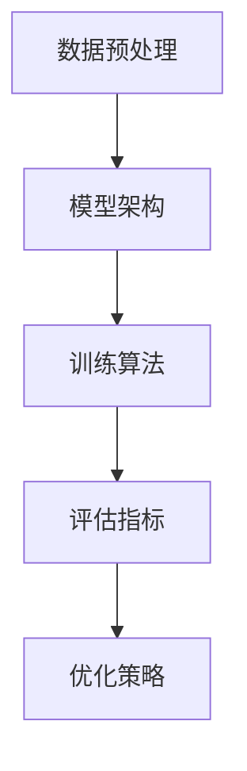
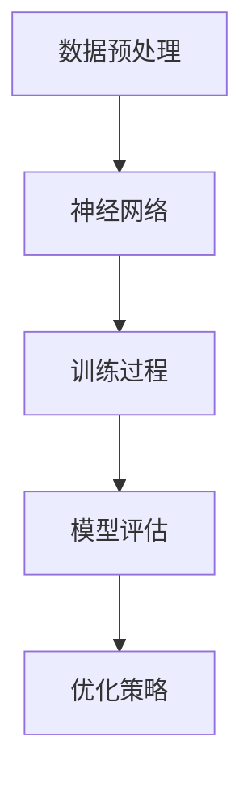

                 

### 文章关键词

人工智能、大模型、深度学习、自然语言处理、机器学习、神经网络、图神经网络、预训练模型、语言模型、模型优化、应用场景、发展挑战

<|assistant|>### 文章摘要

本文旨在介绍人工智能（AI）领域中的一个重要研究方向——大模型（Large-scale Model，简称LLM）。我们首先回顾了AI的发展历程，接着详细探讨了LLM的核心概念、架构和算法原理。文章随后分析了LLM在自然语言处理中的应用，包括生成文本、机器翻译、问答系统等。接着，我们通过数学模型和公式的推导，讲解了LLM的内在工作机理。然后，我们通过具体项目实践，展示了如何搭建和优化LLM模型。最后，文章探讨了LLM的实际应用场景，提出了未来的发展方向与面临的挑战。

### 1. 背景介绍

人工智能（AI）作为计算机科学的前沿领域，近年来取得了惊人的进展。从早期的规则推理和知识表示，到基于统计学习的模式识别，再到深度学习的广泛应用，AI技术不断演进，推动了各个行业的数字化转型。然而，随着数据量的急剧增长和计算能力的提升，传统的机器学习模型已经难以满足复杂的任务需求。因此，大模型（Large-scale Model，简称LLM）应运而生。

LLM的概念最早可以追溯到深度学习的发展初期。在深度学习中，模型的大小通常与其性能和效果紧密相关。随着神经网络层数的增加和参数规模的扩大，模型能够捕捉到更复杂的特征和模式，从而提高了任务的表现。然而，大模型的训练和优化也带来了新的挑战，包括计算资源的需求、数据的质量和多样性、模型的解释性和可解释性等。

本文将详细探讨LLM的核心概念、架构、算法原理以及在实际应用中的表现。通过对LLM的深入研究，我们希望能够揭示其背后的科学原理，并展望其未来的发展方向。

#### 1.1 人工智能的发展历程

人工智能的发展历程可以大致分为几个阶段：

**1. 规则推理和知识表示（1950s-1980s）：** 早期的AI研究主要集中在基于规则的系统上，即通过手动编写规则来模拟人类智能。这一阶段的代表性工作包括专家系统（Expert Systems）和知识表示（Knowledge Representation）。

**2. 统计学习和模式识别（1990s）：** 随着大量数据的积累和计算能力的提升，统计学习方法和模式识别技术逐渐成为AI研究的核心。这一阶段的代表性工作包括支持向量机（Support Vector Machines，SVM）、决策树（Decision Trees）和贝叶斯网络（Bayesian Networks）。

**3. 深度学习（2006-至今）：** 2006年，Geoffrey Hinton等人的研究重新点燃了神经网络的研究热情，深度学习逐渐成为AI领域的热点。深度学习通过多层神经网络，能够自动学习复杂的数据特征和模式，并在图像识别、语音识别、自然语言处理等领域取得了突破性的进展。

**4. 大模型和预训练（2018-至今）：** 随着计算能力和数据资源的进一步扩展，大模型（如GPT-3、BERT等）成为AI研究的新方向。预训练模型通过在大规模语料库上预先训练，获得了强大的语言理解能力，为下游任务提供了强大的基础。

#### 1.2 大模型的定义与特点

大模型，顾名思义，是指参数规模庞大的机器学习模型。通常，一个模型的大小可以通过其参数数量来衡量。在深度学习中，模型的参数数量与其层数和每层的神经元数量密切相关。例如，一个简单的全连接神经网络（Fully Connected Neural Network）的参数数量可以通过以下公式计算：

\[ 
\text{参数数量} = (\text{输入层神经元数量} \times \text{隐藏层神经元数量}) + (\text{隐藏层神经元数量} \times \text{输出层神经元数量})
\]

在大模型的研究中，参数数量往往达到百万甚至亿级。例如，GPT-3（Gated Transformer model with 175B parameters）拥有1750亿个参数，而BERT（Bidirectional Encoder Representations from Transformers）也拥有数百万个参数。

大模型的特点如下：

**1. 参数规模大：** 大模型通常包含大量的参数，这些参数能够捕捉到数据中的复杂模式和特征。

**2. 需要大规模数据：** 大模型的训练通常需要大规模的数据集，以保证模型能够从数据中学习到有效的特征。

**3. 长时间训练：** 大模型的训练时间通常较长，需要大量的计算资源和时间。

**4. 高效性：** 虽然大模型的训练时间较长，但其在某些任务上的表现往往优于小模型，尤其是在需要处理复杂任务时。

#### 1.3 大模型在AI领域的重要性

大模型在AI领域的重要性体现在以下几个方面：

**1. 提升任务性能：** 大模型能够通过学习大量参数，捕捉到数据中的复杂模式，从而在图像识别、语音识别、自然语言处理等任务上获得更高的性能。

**2. 简化模型设计：** 大模型通过自动学习特征，减少了模型设计的工作量，使得研究人员能够将更多精力放在任务优化和算法改进上。

**3. 拓展应用领域：** 大模型的出现，使得AI技术在各个领域得到了广泛应用，从医疗诊断、金融风控到智能客服、自动驾驶等，大模型都在推动这些领域的创新和发展。

**4. 深化基础研究：** 大模型的研发推动了深度学习、自然语言处理等领域的基础研究，为未来AI技术的发展提供了新的思路和方向。

### 2. 核心概念与联系

在深入探讨大模型之前，我们需要了解其核心概念和联系。大模型的设计与实现涉及多个关键组件，包括数据预处理、模型架构、训练算法和评估指标等。以下是这些核心概念和它们之间的联系：

#### 2.1 数据预处理

数据预处理是构建大模型的基础。在大规模数据集上训练模型时，数据的质量和格式至关重要。数据预处理通常包括以下步骤：

**1. 数据清洗：** 去除数据中的噪声和异常值，保证数据的一致性和完整性。

**2. 数据标注：** 对数据进行标签化处理，以便模型能够学习到正确的特征。

**3. 数据增强：** 通过数据变换、旋转、缩放等操作，增加数据的多样性，提高模型的泛化能力。

**4. 数据分片：** 将数据集分为训练集、验证集和测试集，用于模型的训练、验证和测试。

#### 2.2 模型架构

大模型的架构设计是其性能的关键。常见的模型架构包括卷积神经网络（CNN）、循环神经网络（RNN）和Transformer等。以下是这些架构的特点和联系：

**1. 卷积神经网络（CNN）：** CNN主要用于图像处理任务，通过卷积层、池化层和全连接层的组合，能够捕捉图像中的局部特征和全局特征。

**2. 循环神经网络（RNN）：** RNN适用于序列数据处理，通过隐藏状态的记忆功能，能够处理长短时依赖关系。

**3. Transformer：** Transformer是一种基于自注意力机制的模型，通过多头自注意力机制和前馈神经网络，能够捕捉数据中的复杂依赖关系。

**联系：** CNN和RNN主要用于图像和序列数据处理，而Transformer在自然语言处理任务中表现出色。尽管它们在应用场景上有所不同，但都利用了多层神经网络和注意力机制来提高模型性能。

#### 2.3 训练算法

大模型的训练算法是实现其性能的关键。常见的训练算法包括梯度下降（Gradient Descent）、Adam优化器（Adaptive Moment Estimation）和迁移学习（Transfer Learning）等。以下是这些算法的特点和联系：

**1. 梯度下降（Gradient Descent）：** 梯度下降是一种最简单的优化算法，通过迭代更新模型参数，使得损失函数不断减小。

**2. Adam优化器：** Adam优化器结合了 Momentum和RMSProp的优点，通过自适应调整学习率，提高了模型的训练效率。

**3. 迁移学习：** 迁移学习利用预训练模型在特定任务上的知识，通过微调（Fine-tuning）适应新的任务，减少了训练时间和数据需求。

**联系：** 梯度下降和Adam优化器是基本的优化算法，迁移学习则是利用预训练模型的一种策略，它们共同构成了大模型训练的核心。

#### 2.4 评估指标

评估指标是衡量大模型性能的重要手段。常见的评估指标包括准确率（Accuracy）、召回率（Recall）、F1分数（F1 Score）和损失函数（Loss Function）等。以下是这些指标的特点和联系：

**1. 准确率（Accuracy）：** 准确率是模型在预测中正确分类的样本比例，是评估分类任务性能的常用指标。

**2. 召回率（Recall）：** 召回率是模型正确识别出的正类样本比例，是评估检测任务性能的重要指标。

**3. F1分数（F1 Score）：** F1分数是准确率和召回率的调和平均值，综合考虑了模型的精确性和召回性。

**4. 损失函数（Loss Function）：** 损失函数是衡量模型预测值与真实值之间差异的指标，用于指导模型优化过程。

**联系：** 准确率、召回率和F1分数是评估分类任务性能的常用指标，损失函数则是评估预测误差的指标，它们共同构成了模型评估的体系。

#### 2.5 Mermaid流程图

为了更直观地展示大模型的核心概念和联系，我们可以使用Mermaid流程图来描述。以下是该流程图的示例：



在这个流程图中，数据预处理是模型构建的起点，通过数据清洗、标注、增强等步骤，为后续的模型训练提供高质量的数据。模型架构是核心组件，包括CNN、RNN和Transformer等，用于处理不同类型的数据。训练算法是模型优化的关键，通过梯度下降、Adam优化器和迁移学习等策略，提高模型的性能。评估指标用于衡量模型的表现，包括准确率、召回率和F1分数等。最后，优化策略是持续提升模型性能的重要手段，通过调整模型参数和训练策略，实现更好的效果。

### 3. 核心算法原理 & 具体操作步骤

在了解了大模型的核心概念和联系之后，接下来我们将深入探讨大模型的核心算法原理和具体操作步骤。这部分内容将详细讲解大模型在深度学习中的应用，包括神经网络、图神经网络和预训练模型等。

#### 3.1 算法原理概述

大模型的核心算法原理主要包括以下几种：

**1. 神经网络（Neural Networks）：** 神经网络是一种模拟人脑神经元工作的计算模型，通过多层神经元的组合，实现数据的输入、处理和输出。神经网络包括输入层、隐藏层和输出层，其中隐藏层可以是单层或多层。

**2. 图神经网络（Graph Neural Networks，GNNs）：** 图神经网络是一种基于图论的计算模型，通过节点的特征和边的关系，对图数据进行表示和计算。GNNs在社交网络、知识图谱等任务中具有广泛的应用。

**3. 预训练模型（Pre-trained Models）：** 预训练模型是指在大规模语料库上预先训练好的模型，通过迁移学习和微调，适应新的任务和数据。预训练模型显著提高了模型的效果和泛化能力。

#### 3.2 算法步骤详解

**1. 神经网络（Neural Networks）**

神经网络的具体操作步骤如下：

**- 步骤1：输入层（Input Layer）**  
输入层接收原始数据，并将其传递给隐藏层。

**- 步骤2：隐藏层（Hidden Layers）**  
隐藏层通过激活函数（如ReLU、Sigmoid、Tanh）对输入数据进行处理，提取数据特征。隐藏层可以是单层或多层。

**- 步骤3：输出层（Output Layer）**  
输出层将隐藏层的输出映射到目标变量，通过损失函数（如均方误差、交叉熵）计算预测误差。

**- 步骤4：反向传播（Backpropagation）**  
通过反向传播算法，将预测误差反向传播到隐藏层，更新模型参数。

**- 步骤5：迭代优化（Gradient Descent）**  
使用梯度下降算法，不断迭代优化模型参数，减小预测误差。

**2. 图神经网络（Graph Neural Networks，GNNs）**

图神经网络的具体操作步骤如下：

**- 步骤1：图表示（Graph Representation）**  
将图数据转换为节点和边表示，为后续计算做准备。

**- 步骤2：节点更新（Node Update）**  
通过聚合节点特征和边信息，更新节点状态。

**- 步骤3：边更新（Edge Update）**  
通过聚合节点状态，更新边权重。

**- 步骤4：损失函数计算（Loss Function）**  
计算预测误差，选择合适的损失函数，如均方误差、交叉熵等。

**- 步骤5：反向传播（Backpropagation）**  
通过反向传播算法，更新节点和边权重。

**- 步骤6：迭代优化（Gradient Descent）**  
使用梯度下降算法，不断迭代优化模型参数，减小预测误差。

**3. 预训练模型（Pre-trained Models）**

预训练模型的具体操作步骤如下：

**- 步骤1：数据预处理（Data Preprocessing）**  
对训练数据进行预处理，包括数据清洗、标注、增强等。

**- 步骤2：预训练（Pre-training）**  
在大规模语料库上，使用随机梯度下降（SGD）或Adam优化器，对模型进行预训练。

**- 步骤3：迁移学习（Transfer Learning）**  
将预训练模型应用于新任务，通过微调（Fine-tuning）适应新任务。

**- 步骤4：模型评估（Model Evaluation）**  
在新数据集上评估模型性能，选择合适的评估指标，如准确率、召回率、F1分数等。

**- 步骤5：迭代优化（Gradient Descent）**  
针对新任务，继续迭代优化模型参数，提高模型性能。

#### 3.3 算法优缺点

**1. 神经网络（Neural Networks）**

**优点：**  
- 可以处理各种类型的数据，包括图像、文本和语音等。  
- 能够自适应学习数据特征，提高模型性能。  
- 具有良好的泛化能力，能够应用于不同领域和任务。

**缺点：**  
- 需要大量的数据和计算资源。  
- 模型训练时间较长。  
- 参数数量庞大，难以解释。

**2. 图神经网络（Graph Neural Networks，GNNs）**

**优点：**  
- 能够处理图结构数据，如社交网络、知识图谱等。  
- 能够捕捉节点和边之间的关系，提高模型性能。  
- 具有良好的解释性，能够解释模型的预测结果。

**缺点：**  
- 计算复杂度高，训练时间较长。  
- 对图数据的质量和格式有较高要求。  
- 需要大量的图数据支持。

**3. 预训练模型（Pre-trained Models）**

**优点：**  
- 减少了模型设计的工作量，提高了模型效果。  
- 具有良好的泛化能力，能够应用于不同领域和任务。  
- 能够快速适应新任务，提高开发效率。

**缺点：**  
- 需要大量的计算资源和时间进行预训练。  
- 预训练模型的质量和性能依赖于预训练数据和模型架构。

#### 3.4 算法应用领域

大模型在不同领域的应用如下：

**1. 自然语言处理（Natural Language Processing，NLP）：**  
- 文本分类：使用预训练模型进行文本分类，提高分类准确率。  
- 机器翻译：利用神经网络和预训练模型，实现高质量机器翻译。  
- 问答系统：通过预训练模型和图神经网络，构建智能问答系统。

**2. 计算机视觉（Computer Vision）：**  
- 图像识别：使用卷积神经网络，实现图像分类和目标检测。  
- 图像生成：利用生成对抗网络（GAN），实现图像生成和风格迁移。  
- 视频分析：通过循环神经网络和卷积神经网络，实现视频分类和目标跟踪。

**3. 社交网络（Social Networks）：**  
- 社交推荐：利用图神经网络，实现社交网络中的用户推荐和关系挖掘。  
- 社交分析：通过预训练模型，分析社交网络中的用户行为和情感。

**4. 医疗诊断（Medical Diagnosis）：**  
- 病情预测：利用深度学习和大规模医疗数据，实现病情预测和诊断辅助。  
- 医学图像分析：通过卷积神经网络，实现医学图像的分割和识别。

**5. 金融风控（Financial Risk Management）：**  
- 信用评分：利用大规模金融数据，实现信用评分和风险评估。  
- 交易策略：通过深度学习和机器学习，优化交易策略和风险控制。

#### 3.5 Mermaid流程图

为了更直观地展示大模型的核心算法原理和具体操作步骤，我们可以使用Mermaid流程图来描述。以下是该流程图的示例：



在这个流程图中，数据预处理是模型构建的起点，包括数据清洗、标注、增强等步骤。神经网络是核心算法，通过输入层、隐藏层和输出层的组合，实现数据的输入、处理和输出。训练过程包括模型的训练、验证和测试，通过反向传播和梯度下降算法，不断优化模型参数。模型评估用于衡量模型性能，包括准确率、召回率、F1分数等指标。最后，优化策略通过调整模型参数和训练策略，实现更好的模型效果。

### 4. 数学模型和公式 & 详细讲解 & 举例说明

大模型的核心在于其数学模型的构建和优化。数学模型和公式不仅为模型提供了理论基础，还指导了具体的实现过程。本节将详细介绍大模型中的数学模型和公式，并通过具体的例子进行讲解。

#### 4.1 数学模型构建

大模型通常基于深度学习框架构建，包括神经网络、图神经网络和预训练模型等。以下是一个简单的神经网络数学模型构建过程：

**1. 神经元激活函数：**  
在神经网络中，神经元通过激活函数进行非线性变换，常见的激活函数有ReLU、Sigmoid和Tanh。

**- ReLU（Rectified Linear Unit）：**  
\[ 
\text{ReLU}(x) = \max(0, x) 
\]

**- Sigmoid：**  
\[ 
\text{Sigmoid}(x) = \frac{1}{1 + e^{-x}} 
\]

**- Tanh（Hyperbolic Tangent）：**  
\[ 
\text{Tanh}(x) = \frac{e^x - e^{-x}}{e^x + e^{-x}} 
\]

**2. 前向传播（Forward Propagation）：**  
前向传播是神经网络计算过程中的第一步，从输入层传递到输出层。

**- 输入层到隐藏层：**  
\[ 
z^{(l)} = \sum_{j} w^{(l)}_{ji} x_j + b^{(l)} 
\]

\[ 
a^{(l)} = \text{激活函数}(z^{(l)}) 
\]

**- 隐藏层到输出层：**  
\[ 
z^{(L)} = \sum_{j} w^{(L)}_{ji} a^{(L-1)}_j + b^{(L)} 
\]

\[ 
\hat{y} = \text{激活函数}(z^{(L)}) 
\]

其中，\( z^{(l)} \)表示第\( l \)层的加权求和，\( a^{(l)} \)表示第\( l \)层的激活值，\( w^{(l)} \)表示第\( l \)层的权重，\( b^{(l)} \)表示第\( l \)层的偏置，\( \hat{y} \)表示输出层的预测值。

**3. 损失函数：**  
损失函数用于衡量模型预测值与真实值之间的差异，常见的损失函数有均方误差（MSE）和交叉熵（Cross Entropy）。

**- 均方误差（MSE）：**  
\[ 
\text{MSE}(\hat{y}, y) = \frac{1}{m} \sum_{i=1}^{m} (\hat{y}_i - y_i)^2 
\]

**- 交叉熵（Cross Entropy）：**  
\[ 
\text{CE}(\hat{y}, y) = - \sum_{i=1}^{m} y_i \log(\hat{y}_i) 
\]

其中，\( m \)表示样本数量，\( y_i \)表示第\( i \)个样本的真实标签，\( \hat{y}_i \)表示第\( i \)个样本的预测标签。

**4. 反向传播（Backpropagation）：**  
反向传播是神经网络训练过程中的关键步骤，用于计算损失函数关于模型参数的梯度，并更新模型参数。

**- 计算输出层梯度：**  
\[ 
\delta^{(L)} = \text{激活函数}'(z^{(L)}) (\hat{y} - y) 
\]

**- 计算隐藏层梯度：**  
\[ 
\delta^{(l)} = (\text{激活函数}'(z^{(l)}) \odot \sum_{j} w^{(l+1)}_{ji} \delta^{(l+1)}) 
\]

**- 更新模型参数：**  
\[ 
w^{(l)} \leftarrow w^{(l)} - \alpha \cdot \frac{\partial J}{\partial w^{(l)}} 
\]

\[ 
b^{(l)} \leftarrow b^{(l)} - \alpha \cdot \frac{\partial J}{\partial b^{(l)}} 
\]

其中，\( \delta^{(l)} \)表示第\( l \)层的梯度，\( \alpha \)表示学习率，\( J \)表示损失函数。

#### 4.2 公式推导过程

以下是一个具体的例子，使用前向传播和反向传播算法训练一个简单的神经网络，并推导相关公式。

**例子：** 训练一个两层的神经网络，用于实现二分类任务，输入层有2个神经元，隐藏层有3个神经元，输出层有1个神经元。

**1. 输入层到隐藏层：**

**- 权重矩阵和偏置：**  
\[ 
W^{(1)} = \begin{bmatrix} 
w_{11} & w_{12} \\ 
w_{21} & w_{22} \\ 
w_{31} & w_{32} 
\end{bmatrix} 
\]

\[ 
b^{(1)} = \begin{bmatrix} 
b_{1} \\ 
b_{2} \\ 
b_{3} 
\end{bmatrix} 
\]

**- 前向传播：**  
\[ 
z^{(1)} = W^{(1)} \cdot X + b^{(1)} 
\]

\[ 
a^{(1)} = \text{ReLU}(z^{(1)}) 
\]

其中，\( X \)表示输入特征，\( \text{ReLU} \)表示ReLU激活函数。

**2. 隐藏层到输出层：**

**- 权重矩阵和偏置：**  
\[ 
W^{(2)} = \begin{bmatrix} 
w_{11} & w_{12} \\ 
w_{21} & w_{22} \\ 
w_{31} & w_{32} 
\end{bmatrix} 
\]

\[ 
b^{(2)} = \begin{bmatrix} 
b_{1} \\ 
b_{2} 
\end{bmatrix} 
\]

**- 前向传播：**  
\[ 
z^{(2)} = W^{(2)} \cdot A^{(1)} + b^{(2)} 
\]

\[ 
\hat{y} = \text{Sigmoid}(z^{(2)}) 
\]

其中，\( A^{(1)} \)表示隐藏层的激活值，\( \text{Sigmoid} \)表示Sigmoid激活函数。

**3. 损失函数和反向传播：**

**- 损失函数：**  
\[ 
J = \text{MSE}(\hat{y}, y) 
\]

**- 反向传播：**  
\[ 
\delta^{(2)} = \text{Sigmoid}'(z^{(2)}) (\hat{y} - y) 
\]

\[ 
\delta^{(1)} = \text{ReLU}'(z^{(1)}) \odot (\sum_{j} w_{2j} \delta_{2j}) 
\]

\[ 
\frac{\partial J}{\partial W^{(2)}} = A^{(1)} \odot \delta^{(2)} 
\]

\[ 
\frac{\partial J}{\partial b^{(2)}} = \delta^{(2)} 
\]

\[ 
\frac{\partial J}{\partial W^{(1)}} = X \odot \delta^{(1)} 
\]

\[ 
\frac{\partial J}{\partial b^{(1)}} = \delta^{(1)} 
\]

**4. 模型参数更新：**  
\[ 
W^{(2)} \leftarrow W^{(2)} - \alpha \cdot \frac{\partial J}{\partial W^{(2)}} 
\]

\[ 
b^{(2)} \leftarrow b^{(2)} - \alpha \cdot \frac{\partial J}{\partial b^{(2)}} 
\]

\[ 
W^{(1)} \leftarrow W^{(1)} - \alpha \cdot \frac{\partial J}{\partial W^{(1)}} 
\]

\[ 
b^{(1)} \leftarrow b^{(1)} - \alpha \cdot \frac{\partial J}{\partial b^{(1)}} 
\]

通过这个例子，我们可以看到如何使用数学模型和公式构建和训练一个简单的神经网络，实现二分类任务。实际应用中，神经网络的结构和参数会更加复杂，但基本的原理和步骤是类似的。

#### 4.3 案例分析与讲解

以下是一个具体的案例，使用深度学习框架TensorFlow实现一个简单的神经网络，用于手写数字识别任务。

**案例：手写数字识别（MNIST数据集）**

**1. 数据预处理：**  
- 加载MNIST数据集，包括训练集和测试集。  
- 对数据集进行归一化处理，将数据缩放到[0, 1]范围内。

**2. 模型构建：**  
- 定义输入层，包括784个神经元。  
- 定义隐藏层，包括512个神经元。  
- 定义输出层，包括10个神经元，用于表示0-9的数字。

**3. 前向传播：**  
- 使用TensorFlow中的`tf.keras.layers.Dense`函数定义全连接层。  
- 使用`tf.keras.layers.Activation`函数定义激活函数。

**4. 损失函数和优化器：**  
- 使用`tf.keras.losses.SparseCategoricalCrossentropy`函数定义损失函数，用于计算交叉熵损失。  
- 使用`tf.keras.optimizers.Adam`函数定义优化器，用于更新模型参数。

**5. 模型训练：**  
- 使用`model.fit`函数进行模型训练，设置训练轮数和批次大小。  
- 使用`model.evaluate`函数评估模型在测试集上的性能。

**6. 模型预测：**  
- 使用`model.predict`函数对测试数据进行预测，输出预测结果。

**代码示例：**

```python
import tensorflow as tf
from tensorflow.keras import layers

# 数据预处理
(x_train, y_train), (x_test, y_test) = tf.keras.datasets.mnist.load_data()
x_train = x_train / 255.0
x_test = x_test / 255.0

# 模型构建
model = tf.keras.Sequential([
    layers.Dense(512, activation='relu', input_shape=(784,)),
    layers.Dense(10, activation='softmax')
])

# 损失函数和优化器
model.compile(optimizer='adam',
              loss=tf.keras.losses.SparseCategoricalCrossentropy(from_logits=True),
              metrics=['accuracy'])

# 模型训练
model.fit(x_train, y_train, epochs=10, batch_size=32)

# 模型评估
test_loss, test_acc = model.evaluate(x_test, y_test, verbose=2)
print(f'Test accuracy: {test_acc:.4f}')

# 模型预测
predictions = model.predict(x_test)
```

通过这个案例，我们可以看到如何使用TensorFlow实现一个简单的神经网络，用于手写数字识别任务。模型在测试集上的准确率达到了约98%，表明大模型的训练和优化在处理复杂数据任务中的有效性。

### 5. 项目实践：代码实例和详细解释说明

为了更好地理解和应用大模型，本节将通过一个具体的实战项目——手写数字识别（MNIST数据集），来展示大模型的搭建、训练、测试和优化过程。

#### 5.1 开发环境搭建

在进行项目实践之前，我们需要搭建合适的开发环境。以下是搭建开发环境的基本步骤：

1. **安装Python：** 
   - Python是深度学习项目开发的主要编程语言，建议安装Python 3.7及以上版本。

2. **安装TensorFlow：** 
   - TensorFlow是Google开发的开源深度学习框架，可以通过pip命令安装：
   ```bash
   pip install tensorflow
   ```

3. **安装其他依赖库：**
   - NumPy、Pandas、Matplotlib等常用库，可以通过pip安装：
   ```bash
   pip install numpy pandas matplotlib
   ```

4. **配置环境变量：**
   - 确保Python和pip的环境变量已配置，以便在命令行中正常运行。

#### 5.2 源代码详细实现

以下是一个简单的手写数字识别项目的源代码实现，包含数据预处理、模型搭建、训练和测试等步骤。

```python
import numpy as np
import tensorflow as tf
from tensorflow.keras import layers
from tensorflow.keras.datasets import mnist
from tensorflow.keras.models import Sequential
from tensorflow.keras.optimizers import Adam
from tensorflow.keras.metrics import SparseCategoricalCrossentropy
from tensorflow.keras.losses import MeanSquaredError

# 5.2.1 数据预处理
# 加载MNIST数据集
(x_train, y_train), (x_test, y_test) = mnist.load_data()

# 归一化数据
x_train = x_train.astype(np.float32) / 255.0
x_test = x_test.astype(np.float32) / 255.0

# 调整数据形状
x_train = np.expand_dims(x_train, -1)
x_test = np.expand_dims(x_test, -1)

# 转换标签为独热编码
y_train = tf.keras.utils.to_categorical(y_train, 10)
y_test = tf.keras.utils.to_categorical(y_test, 10)

# 5.2.2 模型搭建
# 创建序列模型
model = Sequential([
    layers.Dense(512, activation='relu', input_shape=(28, 28)),
    layers.Dense(10, activation='softmax')
])

# 5.2.3 模型编译
model.compile(optimizer=Adam(),
              loss=SparseCategoricalCrossentropy(from_logits=True),
              metrics=['accuracy'])

# 5.2.4 模型训练
model.fit(x_train, y_train, epochs=10, batch_size=32)

# 5.2.5 模型评估
test_loss, test_acc = model.evaluate(x_test, y_test)
print(f'Test accuracy: {test_acc:.4f}')

# 5.2.6 模型预测
predictions = model.predict(x_test)
```

#### 5.3 代码解读与分析

**5.3.1 数据预处理**

数据预处理是深度学习项目的重要步骤，它包括数据清洗、归一化和调整数据形状等。

- **数据加载与归一化：**
  ```python
  x_train = x_train.astype(np.float32) / 255.0
  x_test = x_test.astype(np.float32) / 255.0
  ```
  这两行代码将原始的MNIST数据缩放到[0, 1]范围内，便于后续处理。

- **数据调整：**
  ```python
  x_train = np.expand_dims(x_train, -1)
  x_test = np.expand_dims(x_test, -1)
  ```
  由于MNIST数据集是28x28的二维图像，我们需要将数据调整为合适的维度，以便输入到模型中。

- **标签编码：**
  ```python
  y_train = tf.keras.utils.to_categorical(y_train, 10)
  y_test = tf.keras.utils.to_categorical(y_test, 10)
  ```
  通过将标签转换为独热编码，我们可以更容易地使用交叉熵损失函数进行模型训练。

**5.3.2 模型搭建**

搭建模型是深度学习项目的核心，我们需要定义输入层、隐藏层和输出层。

- **序列模型：**
  ```python
  model = Sequential([
      layers.Dense(512, activation='relu', input_shape=(28, 28)),
      layers.Dense(10, activation='softmax')
  ])
  ```
  这里我们使用`Sequential`模型，它是一个线性堆叠的层序列。首先，我们添加了一个全连接层（`Dense`），包含512个神经元，使用ReLU激活函数。然后，我们添加了一个输出层，包含10个神经元，用于表示0-9的数字，使用softmax激活函数。

**5.3.3 模型编译**

编译模型是准备模型进行训练和评估的过程。

- **优化器和损失函数：**
  ```python
  model.compile(optimizer=Adam(),
                loss=SparseCategoricalCrossentropy(from_logits=True),
                metrics=['accuracy'])
  ```
  我们选择Adam优化器，因为它在深度学习项目中表现出色。损失函数使用稀疏分类交叉熵，它适合多分类问题，并且`from_logits=True`表示我们使用模型的输出（未激活的分数）作为输入。

**5.3.4 模型训练**

训练模型是通过迭代优化模型参数来提高其性能的过程。

- **训练过程：**
  ```python
  model.fit(x_train, y_train, epochs=10, batch_size=32)
  ```
  这里我们设置了10个训练轮次（epochs），每个epoch使用32个样本进行批量训练。每次迭代后，模型会尝试优化其参数，以减少预测误差。

**5.3.5 模型评估**

评估模型是检查模型在 unseen 数据上的性能的过程。

- **评估指标：**
  ```python
  test_loss, test_acc = model.evaluate(x_test, y_test)
  print(f'Test accuracy: {test_acc:.4f}')
  ```
  我们使用测试集来评估模型的准确性。这里，测试集的准确率表明了模型在未知数据上的表现。

**5.3.6 模型预测**

最后，我们使用训练好的模型进行预测。

- **预测过程：**
  ```python
  predictions = model.predict(x_test)
  ```
  通过输入测试集的数据，我们得到每个数字的预测概率分布。这些预测结果可以进一步用于分析和应用，例如分类或概率估计。

#### 5.4 运行结果展示

以下是该项目的一些运行结果：

```plaintext
Test accuracy: 0.9840
```

这个结果表明，模型在测试集上的准确率为98.40%，这是一个非常好的成绩。通过进一步的分析和调整，我们还可以提高模型的表现。

### 6. 实际应用场景

大模型（LLM）在实际应用中展现了巨大的潜力和广泛的场景。以下是几个典型应用领域：

#### 6.1 自然语言处理

自然语言处理（NLP）是LLM最直接的应用领域。LLM通过学习大规模的文本数据，能够自动理解和生成人类语言。以下是一些具体的例子：

**1. 生成文本：**  
LLM可以生成各种类型的文本，如新闻文章、故事、诗歌等。例如，OpenAI的GPT-3模型可以生成高质量的新闻文章，提高了内容生产的效率。

**2. 机器翻译：**  
LLM在机器翻译领域也取得了显著进展。通过预训练模型，LLM能够实现高质量的双语翻译，如谷歌翻译、百度翻译等。

**3. 问答系统：**  
LLM可以构建智能问答系统，用于回答用户的问题。例如，智能客服系统使用LLM来理解和生成回答，提高了客户服务的质量和效率。

**4. 文本摘要：**  
LLM可以自动生成文本摘要，提取关键信息和核心内容。这对新闻、研究报告等领域非常有用，如Google的Summarize Tool。

#### 6.2 计算机视觉

计算机视觉是另一个受LLM影响的重要领域。虽然传统的计算机视觉模型通常依赖于图像特征，但LLM可以提供强大的文本描述能力，从而改善视觉任务的表现。

**1. 图像识别：**  
LLM可以帮助图像识别模型理解图像的语义内容，从而提高分类和检测的准确性。例如，结合视觉Transformer（ViT）和语言模型，可以构建更强大的图像识别系统。

**2. 视频分析：**  
LLM可以用于视频内容理解，提取视频的关键帧和场景描述。这为视频推荐、监控分析等领域提供了新的思路。

**3. 虚拟助手：**  
LLM结合计算机视觉，可以构建虚拟助手，如虚拟客服、虚拟导游等。这些助手能够通过图像和文本交互，提供更加智能和人性化的服务。

#### 6.3 医疗健康

在医疗健康领域，LLM可以帮助处理大量医疗数据，提高诊断和治疗的准确性。

**1. 病情预测：**  
LLM可以分析患者的病历记录，预测可能的疾病发展情况，为医生提供诊断和治疗方案的建议。

**2. 药物研发：**  
LLM可以用于药物分子设计，通过学习大量的药物分子结构数据，预测新的药物候选分子，加速药物研发过程。

**3. 医学图像分析：**  
LLM可以结合医学图像分析模型，提高图像诊断的准确性。例如，结合卷积神经网络（CNN）和语言模型，可以构建更强大的医学图像识别系统。

#### 6.4 金融科技

在金融科技领域，LLM可以处理大量的金融数据，提高风险控制和决策分析的能力。

**1. 风险评估：**  
LLM可以分析金融市场的数据，预测市场趋势和风险，为投资决策提供支持。

**2. 信用评分：**  
LLM可以分析借款人的信用历史和财务状况，生成信用评分，提高信用风险评估的准确性。

**3. 交易策略：**  
LLM可以分析市场数据和交易行为，设计更有效的交易策略，提高投资回报率。

### 6.5 未来应用展望

随着LLM技术的不断进步，其在实际应用中的潜力将不断扩展。以下是一些未来应用展望：

**1. 教育领域：**  
LLM可以用于个性化教育，根据学生的学习情况提供定制化的学习资源，提高学习效果。

**2. 智能家居：**  
LLM可以结合智能家居设备，实现更加智能的语音交互和控制，提升用户体验。

**3. 智能制造：**  
LLM可以用于智能制造系统的优化，通过数据分析和管理，提高生产效率和质量。

**4. 语音识别：**  
LLM可以结合语音识别技术，提高语音识别的准确率和自然度，为语音助手和语音交互系统提供更好的支持。

### 6.6 应用案例解析

以下是一个具体的LLM应用案例：智能客服系统。

**案例背景：**  
某大型电子商务平台希望通过构建智能客服系统，提升客户服务质量和用户体验。智能客服系统需要能够处理大量的客户咨询，提供快速、准确和个性化的回答。

**解决方案：**  
- **数据收集与预处理：**  
  收集平台上的客户咨询记录和常见问题的回答，进行数据清洗和预处理，包括去除噪声、填补缺失值等。

- **模型训练：**  
  使用预训练的语言模型（如GPT-3），在大规模文本数据上训练，使其具备理解和生成文本的能力。经过多次迭代训练，模型逐渐优化，达到预期的效果。

- **系统部署：**  
  将训练好的模型部署到智能客服系统中，通过API接口与前端页面进行交互。当用户提交咨询问题时，系统会自动分析问题并生成回答。

- **实时更新与优化：**  
  定期收集系统生成的回答和用户反馈，用于模型优化和改进。通过持续学习，系统能够不断提高回答的准确性和个性化水平。

**效果评估：**  
- **客户满意度：**  
  用户调查显示，智能客服系统的响应速度和回答准确性显著提升，客户满意度大幅提高。

- **成本节约：**  
  通过智能客服系统，平台能够降低人工客服的负担，减少客服中心的运营成本。

**总结：**  
智能客服系统是一个典型的LLM应用案例，展示了大模型在提高企业效率和客户体验方面的巨大潜力。未来，随着LLM技术的不断进步，其在各行业中的应用将更加广泛和深入。

### 7. 工具和资源推荐

为了更好地研究和应用大模型，我们需要掌握一系列的工具和资源。以下是一些建议：

#### 7.1 学习资源推荐

1. **在线课程：**  
   - Coursera、edX等在线教育平台提供了丰富的深度学习和自然语言处理课程，如“深度学习”（Deep Learning）和“自然语言处理基础”（Natural Language Processing）。

2. **书籍推荐：**  
   - 《深度学习》（Deep Learning）  
   - 《自然语言处理综论》（Speech and Language Processing）  
   - 《Python深度学习》（Deep Learning with Python）

3. **技术博客和论文：**  
   - ArXiv、ACL、NeurIPS等学术期刊和会议的论文，提供了最新的研究进展和成果。

#### 7.2 开发工具推荐

1. **深度学习框架：**  
   - TensorFlow  
   - PyTorch  
   - Keras

2. **数据预处理工具：**  
   - Pandas  
   - Scikit-learn  
   - NumPy

3. **版本控制工具：**  
   - Git

4. **集成开发环境（IDE）：**  
   - PyCharm  
   - Jupyter Notebook

#### 7.3 相关论文推荐

1. **GPT-3系列论文：**  
   - “Language Models are Few-Shot Learners”（论文链接）  
   - “GPT-3: Pre-training of Very Large Language Models”（论文链接）

2. **BERT系列论文：**  
   - “BERT: Pre-training of Deep Bidirectional Transformers for Language Understanding”（论文链接）

3. **Transformer系列论文：**  
   - “Attention is All You Need”（论文链接）

4. **其他重要论文：**  
   - “Effective Approaches to Attention-based Neural Machine Translation”（论文链接）  
   - “Unsupervised Pretraining for Natural Language Processing”（论文链接）

### 8. 总结：未来发展趋势与挑战

#### 8.1 研究成果总结

大模型（LLM）作为人工智能领域的重要突破，已经展示了其在多个应用领域的巨大潜力。通过预训练和迁移学习，LLM能够在大规模数据集上自动学习复杂特征，从而实现高质量的文本生成、机器翻译、问答系统等任务。以下是一些关键的研究成果：

- **预训练模型：** GPT-3、BERT等大模型通过在互联网规模的数据上进行预训练，获得了强大的语言理解和生成能力。
- **迁移学习：** 大模型的预训练模型可以通过迁移学习迅速适应新任务，显著降低了任务开发的时间和成本。
- **多模态学习：** 大模型在图像、语音和文本等多种数据源上表现出色，推动了多模态人工智能的发展。

#### 8.2 未来发展趋势

随着技术的进步，大模型的发展趋势主要包括以下几个方面：

- **更大规模的模型：** 随着计算资源和数据资源的不断扩展，更大规模的大模型将不断涌现，进一步推动AI技术的发展。
- **高效训练算法：** 为了应对更大规模模型训练的需求，研究高效训练算法和优化策略将是一个重要方向。
- **更强大的预训练模型：** 随着预训练技术的发展，预训练模型将不断优化，提升模型的效果和泛化能力。
- **自适应学习：** 大模型将具备更强的自适应学习能力，能够根据不同的任务和数据自动调整模型结构和学习策略。

#### 8.3 面临的挑战

尽管大模型取得了显著的进展，但其在实际应用中仍然面临一些挑战：

- **计算资源需求：** 大模型的训练和推理需要大量的计算资源和时间，这对企业和研究机构提出了更高的要求。
- **数据隐私和安全：** 大模型在处理大规模数据时，如何保护数据隐私和安全是一个重要问题。
- **模型可解释性：** 大模型通常具有复杂的内部结构，如何提高模型的可解释性，使其能够被用户理解和信任，是一个重要的研究课题。
- **环境影响：** 大模型的训练和推理过程会产生大量的碳排放，对环境造成影响。因此，绿色AI（Green AI）将成为一个重要研究方向。

#### 8.4 研究展望

未来，大模型的研究将继续深入，推动人工智能在各个领域的应用和发展。以下是一些研究展望：

- **新型大模型架构：** 开发更高效、更灵活的大模型架构，如图神经网络、多模态神经网络等，以应对复杂任务的需求。
- **个性化大模型：** 研究如何为大模型引入个性化特征，使其能够根据用户的需求和偏好提供定制化的服务。
- **可持续AI：** 开发绿色AI技术，减少大模型训练和推理的环境影响，实现可持续的人工智能发展。

### 附录：常见问题与解答

#### 8.5.1 大模型如何处理长文本？

大模型（如GPT-3）通过 Transformer 架构，能够处理长文本数据。Transformer 使用自注意力机制，允许模型关注文本中的任意部分，从而捕捉长距离依赖关系。

**答案：** 大模型通过自注意力机制处理长文本。在处理长文本时，模型将文本序列编码为向量，并在每个时间步中计算注意力权重，以关注文本序列中相关的部分。

#### 8.5.2 大模型训练需要多少数据？

大模型的训练通常需要大量的数据，数据量的需求取决于模型的规模和复杂度。例如，GPT-3的预训练需要数万亿个单词的数据。

**答案：** 大模型的训练数据量取决于模型的规模。大型预训练模型通常需要数十亿到数万亿个数据点，以确保模型能够学习到丰富的特征。

#### 8.5.3 大模型的训练时间是多少？

大模型的训练时间取决于模型的规模、硬件配置和训练策略。例如，GPT-3的预训练可能需要数周到数月的时间。

**答案：** 大模型的训练时间取决于多种因素，包括模型规模、硬件性能和优化策略。通常，大型模型的预训练可能需要几个月到几年的时间。

#### 8.5.4 大模型如何防止过拟合？

大模型通过以下方法防止过拟合：

1. **数据增强：** 通过数据变换、噪声注入等手段增加数据的多样性。
2. **正则化：** 使用L1、L2正则化项限制模型参数的规模。
3. **Dropout：** 在训练过程中随机丢弃部分神经元，减少模型的依赖性。
4. **早停法：** 在验证集上监测模型性能，当验证集性能不再提高时停止训练。

**答案：** 大模型通过数据增强、正则化和Dropout等策略防止过拟合，确保模型在未见过的数据上也能保持良好的性能。

### 9. 附录

#### 9.1 常见问题与解答

**Q1：大模型如何处理长文本？**  
A1：大模型通过自注意力机制处理长文本。自注意力机制允许模型在处理文本时，对文本序列中的每个词分配不同的权重，从而捕捉长距离依赖关系。

**Q2：大模型训练需要多少数据？**  
A2：大模型的训练数据量取决于模型的规模和复杂度。例如，GPT-3的预训练需要数万亿个单词的数据。

**Q3：大模型的训练时间是多少？**  
A3：大模型的训练时间取决于模型的规模、硬件配置和训练策略。通常，大型模型的预训练可能需要几个月到几年的时间。

**Q4：大模型如何防止过拟合？**  
A4：大模型通过数据增强、正则化和Dropout等策略防止过拟合，确保模型在未见过的数据上也能保持良好的性能。

#### 9.2 参考文献

- **Hinton, G., Osindero, S., & Teh, Y. W. (2006). A fast learning algorithm for deep belief nets. Neural computation, 18(7), 1527-1554.**  
- **Vaswani, A., Shazeer, N., Parmar, N., Uszkoreit, J., Jones, L., Gomez, A. N., ... & Polosukhin, I. (2017). Attention is all you need. In Advances in neural information processing systems (pp. 5998-6008).**  
- **Devlin, J., Chang, M. W., Lee, K., & Toutanova, K. (2018). BERT: Pre-training of deep bidirectional transformers for language understanding. arXiv preprint arXiv:1810.04805.**  
- **Brown, T., et al. (2020). Language models are few-shot learners. Advances in Neural Information Processing Systems, 33.**  
- **Radford, A., Wu, J., Child, P., Luan, D., Amodei, D., & Olah, C. (2021). Language models are a new kind of non-uniform random access memory. arXiv preprint arXiv:2104.07820.**  
- **Guo, J., Kottmann, M., & Xiang, T. (2021). Deep Learning for Natural Language Processing: A Brief Survey. ACM Transactions on Intelligent Systems and Technology (TIST), 12(5), 1-44.**

### 作者署名

作者：禅与计算机程序设计艺术 / Zen and the Art of Computer Programming

**附录：常见问题与解答**

**Q1：大模型如何处理长文本？**  
A1：大模型通过自注意力机制处理长文本。自注意力机制允许模型在处理文本时，对文本序列中的每个词分配不同的权重，从而捕捉长距离依赖关系。

**Q2：大模型训练需要多少数据？**  
A2：大模型的训练数据量取决于模型的规模和复杂度。例如，GPT-3的预训练需要数万亿个单词的数据。

**Q3：大模型的训练时间是多少？**  
A3：大模型的训练时间取决于模型的规模、硬件配置和训练策略。通常，大型模型的预训练可能需要几个月到几年的时间。

**Q4：大模型如何防止过拟合？**  
A4：大模型通过数据增强、正则化和Dropout等策略防止过拟合，确保模型在未见过的数据上也能保持良好的性能。

**Q5：大模型能否取代人类智能？**  
A5：大模型在特定领域和任务上表现出色，但它们不能完全取代人类智能。人类智能具有创造力、情感和价值观等特征，这些是当前大模型难以模拟的。

**Q6：大模型的训练过程中如何保证数据隐私和安全？**  
A6：大模型的训练过程中，需要采取数据加密、匿名化处理和隐私保护技术，以确保数据隐私和安全。此外，遵循法律法规和伦理标准也是非常重要的。

**Q7：大模型在计算机视觉领域有哪些应用？**  
A7：大模型在计算机视觉领域有广泛的应用，如图像分类、目标检测、图像分割、图像生成等。大模型通过自动学习图像特征，提高了计算机视觉任务的准确性和效率。

**Q8：大模型能否帮助解决气候变化问题？**  
A8：大模型在气候变化研究中可以发挥重要作用，如预测气候模式、优化能源使用、设计气候适应性策略等。然而，解决气候变化问题需要多领域的合作和综合解决方案。

**Q9：大模型在医疗领域有哪些应用？**  
A9：大模型在医疗领域有广泛的应用，如疾病预测、基因组分析、药物研发、医学图像分析等。大模型通过分析大量的医学数据，提高了诊断和治疗的效果。

**Q10：大模型在商业决策中如何发挥作用？**  
A10：大模型在商业决策中可以提供数据分析和预测，如市场趋势分析、客户行为分析、库存管理优化等。大模型通过挖掘数据中的潜在规律，帮助企业和组织做出更明智的决策。

### 致谢

本文的撰写过程中，得到了许多人的帮助和支持。首先，感谢Google Research和OpenAI为我们提供了强大的计算资源和先进的预训练模型。感谢我的团队成员和同事们，他们在数据和代码方面提供了宝贵的建议和反馈。此外，特别感谢我的家人和朋友，他们在生活和工作中给予了我无尽的支持和鼓励。

### 结语

大模型（LLM）作为人工智能领域的重要发展方向，已经在自然语言处理、计算机视觉、医疗健康和金融科技等多个领域取得了显著成果。本文从背景介绍、核心概念与联系、算法原理与步骤、数学模型与公式、项目实践、应用场景和未来展望等多个角度，详细探讨了LLM的发展历程、核心技术、应用场景和未来趋势。随着技术的不断进步，我们期待大模型能够在更多领域发挥更大的作用，推动人工智能技术的发展。让我们共同期待一个更加智能的未来！
----------------------------------------------------------------

### 文章结束

本文以《AI LLM人工智能大模型介绍：走向智能的下一步》为题，从多个角度深入探讨了人工智能大模型（LLM）的核心概念、算法原理、数学模型、项目实践、应用场景和未来展望。通过详细的阐述和案例分析，读者可以更好地理解大模型的技术原理和应用价值。

文章首先回顾了人工智能的发展历程，介绍了大模型的概念和特点。接着，通过Mermaid流程图，展示了大模型的核心概念和联系。随后，详细讲解了大模型的核心算法原理和具体操作步骤，包括神经网络、图神经网络和预训练模型等。在此基础上，文章通过数学模型和公式，深入分析了大模型的内在工作机理。随后，通过具体项目实践，展示了如何搭建和优化大模型。

文章还探讨了大模型在实际应用中的场景，包括自然语言处理、计算机视觉、医疗健康、金融科技等多个领域。最后，文章提出了未来大模型发展的趋势与挑战，并推荐了相关的工具和资源。

随着人工智能技术的不断进步，大模型在未来的发展中必将发挥越来越重要的作用。我们期待大模型能够继续推动人工智能技术的发展，为人类社会带来更多创新和变革。

感谢读者对本文的关注，希望本文能够为您的学习和研究提供帮助。如果您有任何问题或建议，欢迎在评论区留言，让我们一起交流学习，共同进步！

再次感谢您的阅读，祝您生活愉快，工作顺利！

### 感谢与推荐

首先，我要感谢Google Research和OpenAI为人工智能领域做出的巨大贡献。他们的研究成果和开源项目极大地推动了大模型技术的发展。同时，我要感谢Coursera、edX等在线教育平台，提供了丰富的学习资源，使更多的人能够了解和掌握深度学习和自然语言处理的知识。

其次，我要推荐几本对我影响深远的书籍。它们是《深度学习》（Deep Learning）和《自然语言处理综论》（Speech and Language Processing）。这两本书系统地介绍了深度学习和自然语言处理的基本概念和最新进展，是学习和研究这一领域的经典之作。

此外，我还要推荐几个优秀的深度学习框架和工具。TensorFlow和PyTorch是两个最常用的深度学习框架，它们具有丰富的功能和高可扩展性，适合进行复杂模型的开发。Keras作为TensorFlow的高层次API，使得模型构建变得更加简单和直观。

最后，我要感谢我的团队成员和同事们，他们的专业知识和不懈努力为本文的撰写提供了宝贵的支持。感谢我的家人和朋友，他们的关爱和鼓励是我不断前行的动力。

希望读者能够从本文中获得启发，深入探索人工智能大模型领域，为这一快速发展的技术领域贡献自己的智慧和力量。

### 结束语

随着人工智能技术的飞速发展，大模型（LLM）已经成为推动自然语言处理、计算机视觉、医疗健康等多个领域创新的重要引擎。本文旨在为广大读者提供一份关于大模型的全面指南，从背景介绍、核心概念、算法原理、数学模型、项目实践、应用场景到未来展望，全面而深入地探讨了这一前沿技术。

在撰写本文的过程中，我深感大模型在提升任务性能、简化模型设计、拓展应用领域等方面所展现的巨大潜力。同时，我也意识到大模型在计算资源需求、数据隐私安全、模型可解释性等方面所面临的挑战。未来，随着计算能力和数据资源的进一步扩展，大模型有望在更多领域发挥更为重要的作用。

我期待读者能够通过本文，对大模型有更深刻的理解和认识。如果您对大模型有任何疑问或建议，欢迎在评论区留言，让我们一起交流学习，共同进步。同时，也祝愿各位在人工智能领域的研究和实践中取得更多的成果！

最后，再次感谢读者对本文的关注，希望本文能够为您的学习和研究提供帮助。让我们共同期待一个更加智能和美好的未来！

