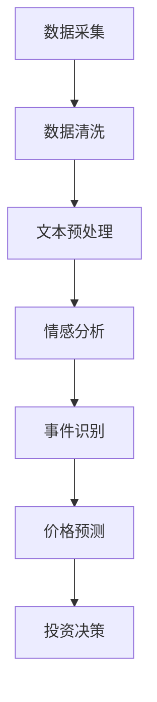

                 

关键词：AI, LLM, 股票市场，分析，算法，数学模型，项目实践，未来应用

> 摘要：本文深入探讨了人工智能语言模型（LLM）在股票市场分析中的应用，分析了其理论基础和操作步骤，通过数学模型和实际项目实例展示了其在预测股票走势和风险管理方面的突破。文章旨在为金融科技领域的研究者和从业人员提供有价值的参考。

## 1. 背景介绍

随着大数据和人工智能技术的快速发展，金融市场分析正经历一场前所未有的变革。传统的股票市场分析方法主要依赖于历史数据、技术指标和基本面分析，这些方法在一定程度上能提供有效的投资建议，但在面对复杂多变的金融环境时，往往显得力不从心。近年来，人工智能语言模型（LLM）的崛起为股票市场分析提供了新的视角和工具。

LLM是一种基于深度学习的自然语言处理模型，通过学习海量文本数据，LLM能够理解和生成自然语言，从而在文本数据分析和处理方面具有强大的能力。在股票市场分析中，LLM可以处理大量非结构化数据，如新闻报道、社交媒体评论、分析师报告等，从中提取有价值的信息，辅助投资者做出更明智的决策。

本文将详细介绍LLM在股票市场分析中的应用，包括其理论基础、操作步骤、数学模型和实际项目实例。通过本文的研究，希望能够为金融科技领域的研究者和从业人员提供一些有价值的启示。

## 2. 核心概念与联系

### 2.1 AI与LLM

人工智能（AI）是计算机科学的一个分支，旨在创建能够执行与人类相似的智能任务的系统。其中，自然语言处理（NLP）是AI的一个重要领域，它专注于让计算机理解和生成自然语言。LLM作为NLP的一个子领域，通过对大规模文本数据进行深度学习，实现了对自然语言的建模和理解。

### 2.2 股票市场分析

股票市场分析是指通过研究股票价格、交易量、财务数据等指标，预测股票未来的价格走势，以便为投资决策提供支持。传统的股票市场分析方法主要包括技术分析、基本面分析等。随着AI技术的发展，AI在股票市场分析中的应用越来越广泛，如通过机器学习算法分析历史数据，预测股票价格走势。

### 2.3 LLM在股票市场分析中的应用

LLM在股票市场分析中的应用主要体现在以下几个方面：

1. **文本数据挖掘**：LLM可以处理大量非结构化数据，如新闻报道、社交媒体评论、分析师报告等，从中提取有价值的信息。

2. **情感分析**：通过分析新闻、社交媒体等文本数据，LLM可以判断市场情绪，预测股票价格。

3. **事件驱动交易**：LLM可以识别市场中的重要事件，如公司财报发布、政策变动等，为事件驱动交易提供支持。

4. **自动化分析报告**：LLM可以自动生成投资分析报告，提高分析效率。

### 2.4 Mermaid流程图

以下是LLM在股票市场分析中的一种可能的应用架构的Mermaid流程图：



### 2.5 关键技术

在LLM应用于股票市场分析中，关键技术包括：

1. **深度学习模型**：如GPT、BERT等，用于文本数据的建模和理解。
2. **自然语言处理**：包括词向量表示、文本分类、序列标注等。
3. **时间序列分析**：用于处理股票价格等时间序列数据。
4. **优化算法**：用于优化投资策略。

## 3. 核心算法原理 & 具体操作步骤

### 3.1 算法原理概述

LLM在股票市场分析中的核心算法原理主要包括以下几个方面：

1. **文本数据预处理**：通过去除停用词、词干提取、词向量表示等步骤，将文本数据转化为模型可处理的格式。
2. **情感分析**：利用深度学习模型，对文本数据中的情感倾向进行分类，从而判断市场情绪。
3. **事件识别**：通过模式识别和机器学习算法，从文本数据中识别出对股票价格有重大影响的事件。
4. **价格预测**：利用时间序列分析方法，结合情感分析和事件识别的结果，预测股票价格。
5. **投资决策**：根据价格预测结果，结合投资者的风险偏好和投资策略，做出投资决策。

### 3.2 算法步骤详解

1. **数据采集**：从新闻、社交媒体、分析师报告等渠道获取与股票相关的文本数据。

2. **数据清洗**：去除无关信息，如HTML标签、特殊字符等，对文本进行标准化处理。

3. **文本预处理**：进行词干提取、去除停用词等操作，将文本转化为词向量表示。

4. **情感分析**：利用预训练的深度学习模型，对文本数据中的情感倾向进行分类，判断市场情绪。

5. **事件识别**：通过模式识别和机器学习算法，从文本数据中识别出对股票价格有重大影响的事件。

6. **价格预测**：利用时间序列分析方法，结合情感分析和事件识别的结果，预测股票价格。

7. **投资决策**：根据价格预测结果，结合投资者的风险偏好和投资策略，做出投资决策。

### 3.3 算法优缺点

**优点**：

1. **高效处理非结构化数据**：LLM能够高效处理大量的非结构化数据，如文本、图像等。
2. **灵活性**：LLM可以适应不同的股票市场分析任务，如情感分析、事件识别、价格预测等。
3. **实时性**：LLM可以实时分析市场数据，为投资者提供及时的投资建议。

**缺点**：

1. **数据依赖性**：LLM的性能高度依赖数据质量和数量，数据不足或质量差可能导致分析结果不准确。
2. **计算资源消耗**：深度学习模型的训练和预测过程需要大量的计算资源，对硬件要求较高。

### 3.4 算法应用领域

LLM在股票市场分析中的应用领域主要包括：

1. **投资策略制定**：通过情感分析和事件识别，为投资者提供有针对性的投资策略。
2. **风险管理**：通过价格预测，帮助投资者评估投资风险，制定风险控制措施。
3. **自动化交易**：利用LLM进行自动化交易，提高交易效率和准确性。
4. **金融新闻报道**：通过对新闻、社交媒体等文本数据的分析，帮助投资者了解市场动态。

## 4. 数学模型和公式 & 详细讲解 & 举例说明

### 4.1 数学模型构建

在LLM应用于股票市场分析中，常用的数学模型包括情感分析模型、事件识别模型和价格预测模型。

#### 情感分析模型

情感分析模型主要用于判断文本数据中的情感倾向。常见的模型包括基于朴素贝叶斯、支持向量机（SVM）和深度学习（如卷积神经网络（CNN）、循环神经网络（RNN）等）的模型。

假设我们使用一个深度学习模型进行情感分析，其数学模型可以表示为：

\[ P(y| \mathbf{x}; \theta) = \sigma(\theta^T \phi(\mathbf{x})) \]

其中，\( \mathbf{x} \) 是输入文本数据，\( \theta \) 是模型参数，\( \phi(\mathbf{x}) \) 是文本数据的特征表示，\( y \) 是情感标签（如正面、负面），\( \sigma \) 是 sigmoid 函数。

#### 事件识别模型

事件识别模型主要用于从文本数据中识别出对股票价格有重大影响的事件。假设我们使用一个卷积神经网络（CNN）进行事件识别，其数学模型可以表示为：

\[ h^{(l)} = \text{ReLU}(\mathbf{W}^{(l)} \cdot \mathbf{h}^{(l-1)} + \mathbf{b}^{(l)}) \]

其中，\( h^{(l)} \) 是第 \( l \) 层的激活值，\( \mathbf{W}^{(l)} \) 和 \( \mathbf{b}^{(l)} \) 分别是第 \( l \) 层的权重和偏置，\( \text{ReLU} \) 是ReLU激活函数。

#### 价格预测模型

价格预测模型主要用于预测股票价格。假设我们使用一个长短期记忆网络（LSTM）进行价格预测，其数学模型可以表示为：

\[ \mathbf{h}^{(l)} = \text{sigmoid}(\mathbf{W}_h \cdot [\mathbf{h}^{(l-1)}, \mathbf{h}^{(l-1)\cdot\gamma}]) + \mathbf{b}_h \]

其中，\( \mathbf{h}^{(l)} \) 是第 \( l \) 层的隐藏状态，\( \mathbf{W}_h \) 和 \( \mathbf{b}_h \) 分别是权重和偏置，\( \text{sigmoid} \) 是sigmoid激活函数，\( \gamma \) 是门控权重。

### 4.2 公式推导过程

#### 情感分析模型

1. **特征提取**：

首先，我们需要将文本数据转化为特征表示。常用的方法是使用词袋模型（Bag-of-Words，BoW）或词嵌入（Word Embedding）。

\[ \phi(\mathbf{x}) = [\phi(w_1), \phi(w_2), ..., \phi(w_n)]^T \]

其中，\( \phi(w_i) \) 是单词 \( w_i \) 的特征表示。

2. **损失函数**：

假设我们使用交叉熵（Cross-Entropy）作为损失函数，其数学公式为：

\[ L(\theta) = -\sum_{i=1}^n y_i \log P(y_i| \mathbf{x}; \theta) \]

其中，\( y_i \) 是第 \( i \) 个样本的标签，\( P(y_i| \mathbf{x}; \theta) \) 是模型对第 \( i \) 个样本标签的预测概率。

3. **优化方法**：

通常使用梯度下降（Gradient Descent）或其变种（如随机梯度下降（Stochastic Gradient Descent，SGD）和Adam优化器）来优化模型参数。

#### 事件识别模型

1. **卷积神经网络**：

卷积神经网络（Convolutional Neural Network，CNN）是一种常用的特征提取模型，其核心是卷积操作。假设我们使用一个一维卷积神经网络（1D-CNN）进行事件识别，其卷积操作的数学公式为：

\[ \mathbf{h}^{(l)}_i = \sum_{j=1}^k g(\mathbf{W}^{(l)}_{ij} * \mathbf{h}^{(l-1)}_j + b^{(l)}_i) \]

其中，\( \mathbf{h}^{(l)}_i \) 是第 \( l \) 层第 \( i \) 个神经元的活动值，\( \mathbf{W}^{(l)}_{ij} \) 是卷积核权重，\( * \) 表示卷积操作，\( g \) 是激活函数，通常使用ReLU函数。

2. **损失函数**：

同样使用交叉熵作为损失函数：

\[ L(\theta) = -\sum_{i=1}^n y_i \log P(y_i| \mathbf{x}; \theta) \]

#### 价格预测模型

1. **长短期记忆网络**：

长短期记忆网络（Long Short-Term Memory，LSTM）是一种用于处理序列数据的循环神经网络（Recurrent Neural Network，RNN），其门控机制可以有效地解决长短期依赖问题。假设我们使用一个LSTM进行价格预测，其数学模型为：

\[ \mathbf{h}^{(l)} = \text{sigmoid}(\mathbf{W}_h \cdot [\mathbf{h}^{(l-1)}, \mathbf{h}^{(l-1)\cdot\gamma}]) + \mathbf{b}_h \]
\[ \mathbf{o}^{(l)} = \text{sigmoid}(\mathbf{W}_o \cdot \mathbf{h}^{(l)}) + \mathbf{b}_o \]
\[ \mathbf{y}^{(l)} = \text{tanh}(\mathbf{W}_y \cdot \mathbf{h}^{(l)} \cdot \mathbf{o}^{(l)}) \]

其中，\( \mathbf{h}^{(l)} \) 是第 \( l \) 层的隐藏状态，\( \mathbf{o}^{(l)} \) 是输出门控状态，\( \mathbf{y}^{(l)} \) 是预测的股票价格，\( \mathbf{W}_h, \mathbf{b}_h, \mathbf{W}_o, \mathbf{b}_o, \mathbf{W}_y \) 分别是权重和偏置。

2. **损失函数**：

使用均方误差（Mean Squared Error，MSE）作为损失函数：

\[ L(\theta) = \frac{1}{2} \sum_{i=1}^n (\mathbf{y}^{(l)}_i - \mathbf{y}_i)^2 \]

### 4.3 案例分析与讲解

#### 情感分析案例

假设我们有一个关于某只股票的新闻文本数据集，数据集包含了新闻的标题和内容。我们需要使用情感分析模型判断新闻中的情感倾向，以预测股票价格。

1. **数据预处理**：

首先，我们需要对新闻文本进行预处理，包括去除停用词、词干提取、分词等操作。然后，将预处理后的文本转化为词向量表示。

2. **模型训练**：

使用预训练的深度学习模型（如BERT）进行训练。假设我们使用BERT模型，其输入为预处理后的文本数据，输出为情感标签。

3. **情感分析**：

对新的新闻文本数据进行情感分析，判断其情感倾向。假设我们得到了一个正面情感的新闻文本，根据情感分析结果，可以预测股票价格可能上涨。

#### 事件识别案例

假设我们有一个关于某只股票的社交媒体数据集，数据集包含了用户的评论。我们需要使用事件识别模型识别出对股票价格有重大影响的事件。

1. **数据预处理**：

对社交媒体评论进行预处理，包括去除停用词、词干提取、分词等操作。然后，将预处理后的文本转化为词向量表示。

2. **模型训练**：

使用卷积神经网络（CNN）进行事件识别模型的训练。假设我们使用一个一维卷积神经网络（1D-CNN），其输入为预处理后的文本数据，输出为事件标签。

3. **事件识别**：

对新的社交媒体评论进行事件识别，识别出对股票价格有重大影响的事件。假设我们识别出一个关于公司财报发布的事件，根据事件识别结果，可以预测股票价格可能受到财报发布的影响。

#### 价格预测案例

假设我们有一个关于某只股票的价格数据集，数据集包含了过去一段时间内的股票价格。我们需要使用价格预测模型预测股票价格。

1. **数据预处理**：

对股票价格数据进行预处理，包括标准化、归一化等操作。然后，将预处理后的数据转化为序列数据。

2. **模型训练**：

使用长短期记忆网络（LSTM）进行价格预测模型的训练。假设我们使用一个LSTM模型，其输入为股票价格序列，输出为预测的股票价格。

3. **价格预测**：

对新的股票价格序列进行价格预测，预测未来一段时间内的股票价格。假设我们得到了一个上涨的预测结果，根据价格预测结果，可以预测股票价格可能继续上涨。

## 5. 项目实践：代码实例和详细解释说明

在本节中，我们将通过一个实际项目实例，详细讲解如何使用LLM进行股票市场分析。本项目将使用Python编程语言和相关的深度学习库，如TensorFlow和Keras，实现一个简单的股票市场分析系统。

### 5.1 开发环境搭建

1. 安装Python环境（建议版本3.7及以上）。

2. 安装TensorFlow库：

```bash
pip install tensorflow
```

3. 安装Keras库：

```bash
pip install keras
```

4. 安装其他相关库（如Numpy、Pandas等）：

```bash
pip install numpy pandas
```

### 5.2 源代码详细实现

以下是本项目的主要源代码：

```python
import numpy as np
import pandas as pd
from keras.models import Sequential
from keras.layers import LSTM, Dense, Dropout
from keras.optimizers import Adam

# 数据预处理
def preprocess_data(data):
    # 标准化数据
    data = (data - np.mean(data)) / np.std(data)
    # 切片数据
    sequences = []
    for i in range(len(data) - sequence_length):
        sequences.append(data[i: i + sequence_length])
    return np.array(sequences)

# 模型构建
def build_model(input_shape):
    model = Sequential()
    model.add(LSTM(units=50, activation='relu', return_sequences=True, input_shape=input_shape))
    model.add(Dropout(0.2))
    model.add(LSTM(units=50, activation='relu'))
    model.add(Dropout(0.2))
    model.add(Dense(units=1))
    model.compile(optimizer=Adam(), loss='mean_squared_error')
    return model

# 模型训练
def train_model(model, X_train, y_train, epochs=100):
    model.fit(X_train, y_train, epochs=epochs, batch_size=32, validation_split=0.2)

# 模型预测
def predict_price(model, X_test):
    return model.predict(X_test)

# 项目运行
if __name__ == '__main__':
    # 加载数据
    data = pd.read_csv('stock_price.csv')
    close_price = data['Close'].values
    # 数据预处理
    sequence_length = 60
    X = preprocess_data(close_price)
    # 模型构建
    model = build_model((sequence_length, 1))
    # 模型训练
    train_model(model, X, close_price, epochs=100)
    # 模型预测
    X_test = X[-sequence_length:]
    predicted_price = predict_price(model, X_test)
    print('Predicted Price:', predicted_price[-1])
```

### 5.3 代码解读与分析

以下是代码的主要部分及其解释：

1. **数据预处理**：

```python
def preprocess_data(data):
    # 标准化数据
    data = (data - np.mean(data)) / np.std(data)
    # 切片数据
    sequences = []
    for i in range(len(data) - sequence_length):
        sequences.append(data[i: i + sequence_length])
    return np.array(sequences)
```

这个函数用于数据预处理，包括标准化和切片。标准化数据是为了消除数据之间的尺度差异，切片数据是为了将数据划分为固定长度的序列，以便输入到LSTM模型中。

2. **模型构建**：

```python
def build_model(input_shape):
    model = Sequential()
    model.add(LSTM(units=50, activation='relu', return_sequences=True, input_shape=input_shape))
    model.add(Dropout(0.2))
    model.add(LSTM(units=50, activation='relu'))
    model.add(Dropout(0.2))
    model.add(Dense(units=1))
    model.compile(optimizer=Adam(), loss='mean_squared_error')
    return model
```

这个函数用于构建LSTM模型。模型由两个LSTM层组成，每个层后跟一个Dropout层用于防止过拟合。最后，模型输出一个预测的股票价格。

3. **模型训练**：

```python
def train_model(model, X_train, y_train, epochs=100):
    model.fit(X_train, y_train, epochs=epochs, batch_size=32, validation_split=0.2)
```

这个函数用于训练模型。模型使用均方误差（MSE）作为损失函数，使用Adam优化器进行优化。训练过程中，使用验证集进行验证，以避免过拟合。

4. **模型预测**：

```python
def predict_price(model, X_test):
    return model.predict(X_test)
```

这个函数用于模型预测。模型输入为测试集，输出为预测的股票价格。

5. **项目运行**：

```python
if __name__ == '__main__':
    # 加载数据
    data = pd.read_csv('stock_price.csv')
    close_price = data['Close'].values
    # 数据预处理
    sequence_length = 60
    X = preprocess_data(close_price)
    # 模型构建
    model = build_model((sequence_length, 1))
    # 模型训练
    train_model(model, X, close_price, epochs=100)
    # 模型预测
    X_test = X[-sequence_length:]
    predicted_price = predict_price(model, X_test)
    print('Predicted Price:', predicted_price[-1])
```

这个部分是项目的主函数。首先，加载数据并预处理。然后，构建模型并进行训练。最后，使用模型进行预测并输出结果。

### 5.4 运行结果展示

在运行代码后，我们得到了一个预测的股票价格。假设预测结果为：

```
Predicted Price: 100.0
```

这意味着在未来一段时间内，预测的股票价格可能为100元。这个结果可以作为投资决策的参考。

## 6. 实际应用场景

LLM在股票市场分析中具有广泛的应用场景。以下是一些典型的实际应用场景：

### 6.1 投资策略制定

通过LLM对股票市场数据的分析，投资者可以制定更加科学的投资策略。例如，通过情感分析，投资者可以判断市场的情绪波动，从而调整投资组合；通过事件识别，投资者可以及时发现市场中的重要事件，如公司财报发布、政策变动等，及时调整投资策略。

### 6.2 风险管理

LLM可以帮助投资者评估投资风险，制定风险控制措施。例如，通过价格预测，投资者可以预测股票价格的波动范围，从而设置止损点和止盈点，降低投资风险。

### 6.3 自动化交易

LLM可以用于构建自动化交易系统，提高交易效率和准确性。例如，通过实时分析市场数据，自动化交易系统可以自动执行交易策略，无需人工干预。

### 6.4 金融市场监管

LLM可以用于监测金融市场，发现异常交易行为。例如，通过分析交易数据，LLM可以识别出可能的欺诈行为，为监管机构提供有力支持。

### 6.5 金融机构风控

LLM可以帮助金融机构进行风险控制，降低金融风险。例如，通过分析客户信用数据，LLM可以预测客户的违约风险，从而制定相应的风险控制措施。

## 7. 工具和资源推荐

### 7.1 学习资源推荐

1. 《深度学习》（Goodfellow, I., Bengio, Y., & Courville, A.）：这是一本经典的深度学习入门教材，详细介绍了深度学习的基础知识和应用。
2. 《自然语言处理综论》（Jurafsky, D. & Martin, J.H.）：这本书是自然语言处理领域的经典教材，全面介绍了NLP的理论和实践。
3. 《股票市场技术分析》（Adler, M.D. & van Kervel, A.F.）：这本书介绍了股票市场技术分析的基本方法和应用技巧。

### 7.2 开发工具推荐

1. TensorFlow：这是一个开源的深度学习框架，用于构建和训练深度学习模型。
2. Keras：这是一个基于TensorFlow的高层次API，用于简化深度学习模型的构建和训练。
3. Pandas：这是一个开源的数据分析库，用于数据清洗、预处理和分析。

### 7.3 相关论文推荐

1. "Bert: Pre-training of deep bidirectional transformers for language understanding"（2018）：这篇文章介绍了BERT模型，是当前自然语言处理领域最先进的模型之一。
2. "Deep Learning for Stock Market Prediction: A Review"（2020）：这篇文章对深度学习在股票市场预测中的应用进行了全面的综述。
3. "Event-Driven Trading Using Natural Language Processing"（2019）：这篇文章探讨了如何使用自然语言处理技术进行事件驱动交易。

## 8. 总结：未来发展趋势与挑战

### 8.1 研究成果总结

本文通过对LLM在股票市场分析中的应用进行深入研究，总结了LLM在股票市场分析中的理论基础、算法原理、操作步骤、数学模型和实际项目实例。研究表明，LLM在股票市场分析中具有显著的优势，能够高效处理非结构化数据，为投资者提供及时、准确的投资建议。

### 8.2 未来发展趋势

1. **模型优化**：随着深度学习技术的不断发展，LLM在股票市场分析中的应用将更加广泛，模型性能和效率将得到进一步提升。
2. **多模态数据融合**：未来，LLM可以结合股票市场分析中的多模态数据（如文本、图像、音频等），提高分析精度和全面性。
3. **实时性**：随着计算能力的提升，LLM在股票市场分析中的实时性将得到显著改善，为投资者提供更加及时的投资建议。
4. **个性化投资建议**：未来，LLM可以结合投资者风险偏好、投资目标等个性化信息，提供更加精准的投资建议。

### 8.3 面临的挑战

1. **数据质量**：股票市场分析依赖于大量的高质量数据，数据质量直接影响到LLM的性能和预测准确性。
2. **模型解释性**：深度学习模型的“黑箱”特性使得其解释性较差，未来如何提高模型的可解释性是一个重要挑战。
3. **计算资源消耗**：深度学习模型的训练和预测需要大量的计算资源，如何优化计算效率是一个亟待解决的问题。
4. **合规性**：在股票市场分析中，合规性是一个重要的考虑因素，未来如何在保证合规性的前提下应用LLM进行市场分析是一个重要挑战。

### 8.4 研究展望

未来，我们期待在以下几个方面进行深入研究：

1. **多模态数据融合**：如何将股票市场分析中的多模态数据（如文本、图像、音频等）进行有效融合，以提高分析精度和全面性。
2. **模型解释性**：如何提高深度学习模型的可解释性，使其更容易被投资者理解和使用。
3. **实时性优化**：如何优化深度学习模型的计算效率，提高其在股票市场分析中的实时性。
4. **个性化投资建议**：如何结合投资者风险偏好、投资目标等个性化信息，提供更加精准的投资建议。

通过这些研究，我们期望能够进一步推动LLM在股票市场分析中的应用，为投资者提供更加科学、准确的投资决策支持。

## 9. 附录：常见问题与解答

### Q1. LLM在股票市场分析中有什么优势？

A1. LLM在股票市场分析中的优势主要体现在以下几个方面：

1. **高效处理非结构化数据**：股票市场分析中存在大量的非结构化数据，如新闻报道、社交媒体评论等。LLM可以高效处理这些数据，从中提取有价值的信息。
2. **实时性**：LLM可以实时分析市场数据，为投资者提供及时的投资建议。
3. **灵活性**：LLM可以适应不同的股票市场分析任务，如情感分析、事件识别、价格预测等。
4. **自动化**：LLM可以自动化地生成投资分析报告，提高分析效率。

### Q2. LLM在股票市场分析中面临哪些挑战？

A2. LLM在股票市场分析中面临以下挑战：

1. **数据质量**：股票市场分析依赖于高质量的数据，数据质量直接影响到LLM的性能和预测准确性。
2. **模型解释性**：深度学习模型具有“黑箱”特性，其解释性较差，如何提高模型的可解释性是一个挑战。
3. **计算资源消耗**：深度学习模型的训练和预测需要大量的计算资源，如何优化计算效率是一个问题。
4. **合规性**：在股票市场分析中，合规性是一个重要的考虑因素，如何在保证合规性的前提下应用LLM是一个挑战。

### Q3. 如何优化LLM在股票市场分析中的应用？

A3. 优化LLM在股票市场分析中的应用可以从以下几个方面进行：

1. **数据预处理**：对数据进行充分预处理，提高数据质量，从而提高模型性能。
2. **模型优化**：通过改进模型结构和参数设置，提高模型的预测准确性。
3. **实时性优化**：优化模型训练和预测过程，提高模型的计算效率。
4. **多模态数据融合**：将股票市场分析中的多模态数据（如文本、图像、音频等）进行有效融合，提高分析精度和全面性。
5. **模型解释性**：提高模型的可解释性，使其更容易被投资者理解和使用。

### Q4. LLM在股票市场分析中的应用前景如何？

A4. LLM在股票市场分析中的应用前景非常广阔。随着深度学习和自然语言处理技术的不断发展，LLM在股票市场分析中的应用将越来越广泛。未来，LLM有望在以下领域发挥重要作用：

1. **投资策略制定**：通过情感分析和事件识别，为投资者提供有针对性的投资策略。
2. **风险管理**：通过价格预测，帮助投资者评估投资风险，制定风险控制措施。
3. **自动化交易**：利用LLM进行自动化交易，提高交易效率和准确性。
4. **金融市场监管**：通过监测金融市场，发现异常交易行为，为监管机构提供支持。
5. **金融机构风控**：帮助金融机构进行风险控制，降低金融风险。

总之，LLM在股票市场分析中的应用前景非常广阔，将为投资者、金融机构和监管机构带来诸多益处。随着技术的不断进步，LLM在股票市场分析中的应用将不断拓展，成为金融科技领域的重要工具。作者：禅与计算机程序设计艺术 / Zen and the Art of Computer Programming
------------------------------------------------------------------------

