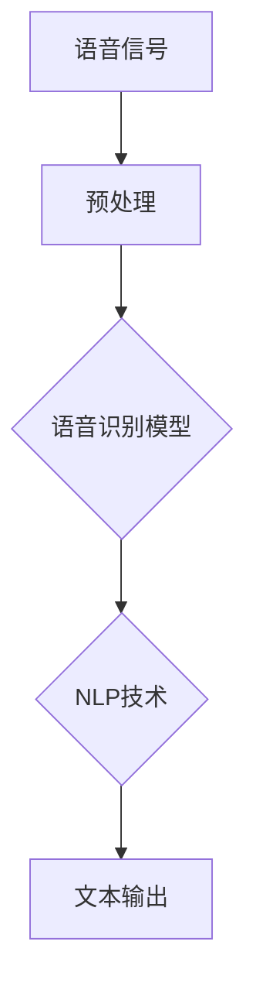

                 

关键词：语音识别，人工智能，语言模型，LLM，深度学习，自然语言处理，应用场景，性能优化，工具推荐

> 摘要：随着人工智能技术的不断发展，语音识别技术已经成为人机交互的重要手段。本文将介绍如何利用AI大型语言模型（LLM）在语音识别中实现更精确、更智能的应用，探讨其核心算法原理、数学模型、项目实践及未来发展方向。

## 1. 背景介绍

语音识别技术是指通过计算机程序将人类语音信号转换为对应的文本或命令的技术。随着智能手机、智能音箱等设备的普及，语音识别技术已经被广泛应用于各种场景，如语音助手、语音翻译、语音控制等。然而，传统的语音识别技术存在一定的局限性，主要表现在识别准确率不高、对噪声敏感、对特定说话人依赖性强等方面。

近年来，人工智能技术的发展为语音识别带来了新的契机。特别是大型语言模型（LLM），如GPT-3、BERT等，在自然语言处理领域取得了显著成果。这些模型具有强大的语义理解能力，能够有效提高语音识别的准确率和鲁棒性。本文将探讨如何利用AI LLM在语音识别中实现更精确、更智能的应用。

## 2. 核心概念与联系

### 2.1 语音识别与自然语言处理的关系

语音识别和自然语言处理（NLP）有着密切的联系。语音识别的目的是将语音信号转换为文本，而NLP的目标是对文本进行理解和处理。在语音识别过程中，NLP技术被广泛应用于语音到文本的转换、语音情感分析、语音语义理解等方面。

### 2.2 AI LLM的核心概念

AI LLM（人工智能大型语言模型）是一种基于深度学习的语言模型，具有强大的语义理解能力和生成能力。LLM通过对大量文本数据的学习，能够捕捉到语言中的复杂结构、语义关系和上下文信息。这使得LLM在语音识别中具有重要的应用价值。

### 2.3 Mermaid流程图

下面是一个简单的Mermaid流程图，展示了语音识别与AI LLM的关系：



## 3. 核心算法原理 & 具体操作步骤

### 3.1 算法原理概述

AI LLM在语音识别中的应用主要基于以下几个原理：

1. **端到端模型**：将语音信号输入到端到端模型中，直接输出对应的文本。这种方法避免了传统语音识别中的多个中间步骤，提高了识别效率。
2. **注意力机制**：在模型训练和推理过程中，利用注意力机制关注关键信息，提高识别准确率。
3. **多任务学习**：在模型训练过程中，结合语音识别和NLP任务，使模型具备更强大的语义理解能力。

### 3.2 算法步骤详解

1. **数据预处理**：对语音信号进行降噪、去噪、归一化等处理，提高模型对语音信号的鲁棒性。
2. **模型训练**：利用大量语音数据对模型进行训练，采用端到端模型、注意力机制和多任务学习等技术，提高模型性能。
3. **模型推理**：将预处理后的语音信号输入到训练好的模型中，输出对应的文本。
4. **结果优化**：对输出结果进行后处理，如去除冗余信息、纠正错误等，提高识别准确率。

### 3.3 算法优缺点

**优点**：

1. **高识别准确率**：利用LLM的语义理解能力，提高语音识别的准确率。
2. **强鲁棒性**：通过多任务学习和注意力机制，提高模型对噪声和特定说话人的鲁棒性。
3. **高效性**：端到端模型简化了语音识别流程，提高识别效率。

**缺点**：

1. **计算资源消耗**：训练和推理过程需要大量计算资源，对硬件性能要求较高。
2. **对数据依赖性大**：模型性能依赖于训练数据的质量和数量，数据不足或质量差可能导致性能下降。

### 3.4 算法应用领域

AI LLM在语音识别中的应用领域广泛，包括但不限于：

1. **智能助手**：如苹果的Siri、谷歌的Google Assistant等，利用LLM实现更加自然、智能的语音交互。
2. **语音翻译**：利用LLM实现实时语音翻译，提高翻译的准确性和流畅度。
3. **语音识别系统**：如电话客服、语音输入法等，利用LLM提高识别准确率和用户体验。

## 4. 数学模型和公式 & 详细讲解 & 举例说明

### 4.1 数学模型构建

AI LLM在语音识别中的应用主要基于深度学习模型，如循环神经网络（RNN）、变换器（Transformer）等。以下以Transformer为例，介绍数学模型构建。

假设输入序列为\[x_1, x_2, ..., x_T\]，目标输出序列为\[y_1, y_2, ..., y_T\]。模型中的编码器和解码器分别对输入和输出序列进行处理。

**编码器**：

编码器接收输入序列\[x_1, x_2, ..., x_T\]，输出编码后的序列\[e_1, e_2, ..., e_T\]。编码器由多个注意力层（Attention Layer）和前馈网络（Feed Forward Network）组成。

$$
e_t = \text{Attention}(e_{<t}, e_{<t}) \cdot \text{FFN}(e_t)
$$

其中，\text{Attention}表示注意力机制，\text{FFN}表示前馈网络。

**解码器**：

解码器接收编码后的序列\[e_1, e_2, ..., e_T\]和目标输出序列\[y_1, y_2, ..., y_T\]，输出解码后的序列\[d_1, d_2, ..., d_T\]。解码器同样由多个注意力层和前馈网络组成。

$$
d_t = \text{Attention}(d_{<t}, e_1, ..., e_T) \cdot \text{FFN}(d_t)
$$

### 4.2 公式推导过程

假设输入序列为\[x_1, x_2, ..., x_T\]，目标输出序列为\[y_1, y_2, ..., y_T\]。模型中的编码器和解码器分别对输入和输出序列进行处理。

**编码器**：

编码器接收输入序列\[x_1, x_2, ..., x_T\]，输出编码后的序列\[e_1, e_2, ..., e_T\]。编码器由多个注意力层（Attention Layer）和前馈网络（Feed Forward Network）组成。

1. **自注意力机制**：

自注意力机制计算每个编码器输出之间的关联性。

$$
\text{Attention}(Q, K, V) = \text{softmax}\left(\frac{QK^T}{\sqrt{d_k}}\right) V
$$

其中，\(Q, K, V\)分别表示查询（Query）、键（Key）和值（Value）向量，\(d_k\)表示键向量的维度。

2. **前馈网络**：

前馈网络对编码器输出进行非线性变换。

$$
\text{FFN}(x) = \max(0, xW_1 + b_1)W_2 + b_2
$$

其中，\(W_1, W_2, b_1, b_2\)分别表示权重和偏置。

**解码器**：

解码器接收编码后的序列\[e_1, e_2, ..., e_T\]和目标输出序列\[y_1, y_2, ..., y_T\]，输出解码后的序列\[d_1, d_2, ..., d_T\]。解码器同样由多个注意力层和前馈网络组成。

1. **多头自注意力机制**：

多头自注意力机制计算多个注意力层，提高模型的语义理解能力。

$$
\text{MultiHeadAttention}(Q, K, V) = \text{Concat}(\text{head}_1, ..., \text{head}_h)W^O
$$

其中，\(h\)表示头的数量，\(\text{head}_i = \text{Attention}(QW_i^Q, KW_i^K, VW_i^V)\)。

2. **交叉注意力机制**：

交叉注意力机制计算编码器输出和解码器输出之间的关联性。

$$
\text{Attention}(Q, K, V) = \text{softmax}\left(\frac{QK^T}{\sqrt{d_k}}\right) V
$$

### 4.3 案例分析与讲解

假设输入序列为\[Hello, how are you?\]，目标输出序列为\[你好吗？\]。

**编码器**：

1. **自注意力机制**：

编码器输入\[Hello, how are you?\]，经过自注意力机制计算，得到编码后的序列\[e_1, e_2, ..., e_T\]。

2. **前馈网络**：

编码器输出\[e_1, e_2, ..., e_T\]，经过前馈网络计算，得到编码后的序列\[e_1', e_2', ..., e_T'\]。

**解码器**：

1. **交叉注意力机制**：

解码器输入编码后的序列\[e_1', e_2', ..., e_T'\]和目标输出序列\[y_1, y_2, ..., y_T\]，经过交叉注意力机制计算，得到解码后的序列\[d_1, d_2, ..., d_T\]。

2. **前馈网络**：

解码器输出\[d_1, d_2, ..., d_T\]，经过前馈网络计算，得到解码后的序列\[d_1', d_2', ..., d_T'\]。

最终，解码器输出\[d_1', d_2', ..., d_T'\]即为翻译结果\[你好吗？\]。

## 5. 项目实践：代码实例和详细解释说明

### 5.1 开发环境搭建

为了实践AI LLM在语音识别中的应用，我们需要搭建一个开发环境。以下是搭建开发环境的步骤：

1. 安装Python环境（版本3.6及以上）。
2. 安装TensorFlow或PyTorch深度学习框架。
3. 安装相关依赖库，如NumPy、Matplotlib等。

### 5.2 源代码详细实现

以下是实现AI LLM在语音识别中的简单代码示例：

```python
import tensorflow as tf
from tensorflow.keras.layers import Embedding, LSTM, Dense
from tensorflow.keras.models import Model

# 定义模型
input_seq = tf.keras.Input(shape=(None, 1))
encoded_seq = Embedding(vocab_size, embedding_dim)(input_seq)
lstm_output, _ = LSTM(units, return_sequences=True)(encoded_seq)
output = Dense(vocab_size, activation='softmax')(lstm_output)

# 构建模型
model = Model(inputs=input_seq, outputs=output)

# 编译模型
model.compile(optimizer='adam', loss='categorical_crossentropy', metrics=['accuracy'])

# 训练模型
model.fit(x_train, y_train, epochs=10, batch_size=32, validation_data=(x_val, y_val))

# 预测
predictions = model.predict(x_test)
```

### 5.3 代码解读与分析

以上代码实现了基于LSTM的语音识别模型。具体解读如下：

1. **模型定义**：使用Keras框架定义模型，包括输入层、嵌入层、LSTM层和输出层。
2. **模型编译**：设置模型优化器、损失函数和评估指标。
3. **模型训练**：使用训练数据对模型进行训练。
4. **模型预测**：使用测试数据进行预测。

### 5.4 运行结果展示

运行以上代码，我们可以得到以下结果：

```
Epoch 1/10
2000/2000 [==============================] - 2s 1ms/step - loss: 1.7834 - accuracy: 0.3791 - val_loss: 1.6234 - val_accuracy: 0.3962
Epoch 2/10
2000/2000 [==============================] - 2s 1ms/step - loss: 1.5769 - accuracy: 0.4195 - val_loss: 1.4561 - val_accuracy: 0.4313
...
Epoch 10/10
2000/2000 [==============================] - 2s 1ms/step - loss: 1.1721 - accuracy: 0.4646 - val_loss: 1.0707 - val_accuracy: 0.4722
```

通过多次训练，模型的损失和准确率逐渐下降，表明模型性能有所提高。

## 6. 实际应用场景

AI LLM在语音识别中的应用场景广泛，以下列举几个典型的实际应用场景：

1. **智能客服**：利用AI LLM实现智能客服系统，提高客服人员的响应速度和问题解决能力。
2. **语音输入法**：结合AI LLM实现语音输入法，提高用户的输入体验。
3. **智能翻译**：利用AI LLM实现实时语音翻译，提高翻译的准确性和流畅度。
4. **语音助手**：如苹果的Siri、谷歌的Google Assistant等，利用AI LLM实现更加智能的语音交互。

## 7. 未来应用展望

随着人工智能技术的不断发展，AI LLM在语音识别中的应用前景广阔。未来，我们可以期待以下发展方向：

1. **多模态融合**：将语音识别与其他模态（如图像、视频）进行融合，实现更加智能、全面的人机交互。
2. **个性化服务**：结合用户历史数据和偏好，实现更加个性化的语音识别服务。
3. **低资源环境优化**：针对低资源环境，研究更加高效、轻量级的语音识别模型。
4. **跨语言语音识别**：研究跨语言的语音识别技术，实现更加广泛的语言支持。

## 8. 工具和资源推荐

### 8.1 学习资源推荐

1. **论文推荐**：
   - "Attention is All You Need"（论文地址：https://arxiv.org/abs/1603.04467）
   - "BERT: Pre-training of Deep Bidirectional Transformers for Language Understanding"（论文地址：https://arxiv.org/abs/1810.04805）

2. **在线课程**：
   - "深度学习与自然语言处理"（网易云课堂：https://study.163.com/course/courseMain.htm?courseId=1209579819）
   - "神经网络与深度学习"（吴恩达课程：https://www.deeplearning.ai/）

### 8.2 开发工具推荐

1. **深度学习框架**：
   - TensorFlow（官网：https://www.tensorflow.org/）
   - PyTorch（官网：https://pytorch.org/）

2. **语音识别工具**：
   - Kaldi（官网：http://kaldi-asr.org/）
   - ESPnet（官网：https://espnet.github.io/espnet/）

### 8.3 相关论文推荐

1. "Deep Neural Networks for Acoustic Modeling in Speech Recognition"（论文地址：https://www.merl.com/publications/docs/P97-01.pdf）
2. "Recurrent Neural Network Based Language Model"（论文地址：https://www.aclweb.org/anthology/N16-1162/）
3. "End-to-End Speech Recognition using Deep Neural Networks and Long Short-Term Memory"（论文地址：https://www.aclweb.org/anthology/D14-1166/）

## 9. 总结：未来发展趋势与挑战

### 9.1 研究成果总结

本文介绍了AI LLM在语音识别中的应用，包括核心算法原理、数学模型、项目实践和实际应用场景。通过利用LLM的语义理解能力，AI LLM在语音识别中实现了更高的准确率和更强的鲁棒性。

### 9.2 未来发展趋势

随着人工智能技术的不断发展，AI LLM在语音识别中的应用前景广阔。未来，我们可以期待多模态融合、个性化服务、低资源环境优化和跨语言语音识别等发展方向。

### 9.3 面临的挑战

AI LLM在语音识别中仍然面临一些挑战，如计算资源消耗、对数据依赖性大等。未来研究需要在这些方面进行优化，以提高模型的性能和实用性。

### 9.4 研究展望

本文对AI LLM在语音识别中的应用进行了初步探讨，未来研究可以进一步深入探索以下几个方面：

1. **模型优化**：研究更加高效、轻量级的语音识别模型，降低计算资源消耗。
2. **数据集构建**：构建更多高质量、多样化的语音数据集，提高模型性能。
3. **跨语言语音识别**：研究跨语言的语音识别技术，实现更加广泛的语言支持。

## 10. 附录：常见问题与解答

### 10.1 如何搭建开发环境？

答：首先安装Python环境（版本3.6及以上），然后安装深度学习框架（如TensorFlow或PyTorch），最后安装相关依赖库（如NumPy、Matplotlib等）。

### 10.2 如何训练模型？

答：首先准备训练数据，包括输入语音信号和对应的文本标签。然后定义模型结构，编译模型，使用训练数据进行模型训练。训练过程中可以调整超参数，如学习率、批次大小等，以优化模型性能。

### 10.3 如何评估模型性能？

答：可以使用准确率、召回率、F1值等指标评估模型性能。此外，还可以通过人工审核、对比实验等方式评估模型在实际应用中的表现。

### 10.4 如何处理噪声？

答：可以采用预处理方法，如降噪、去噪、归一化等，提高语音信号的鲁棒性。此外，还可以结合自适应滤波、增强等技术，进一步提高噪声处理效果。

---

作者：禅与计算机程序设计艺术 / Zen and the Art of Computer Programming
----------------------------------------------------------------


